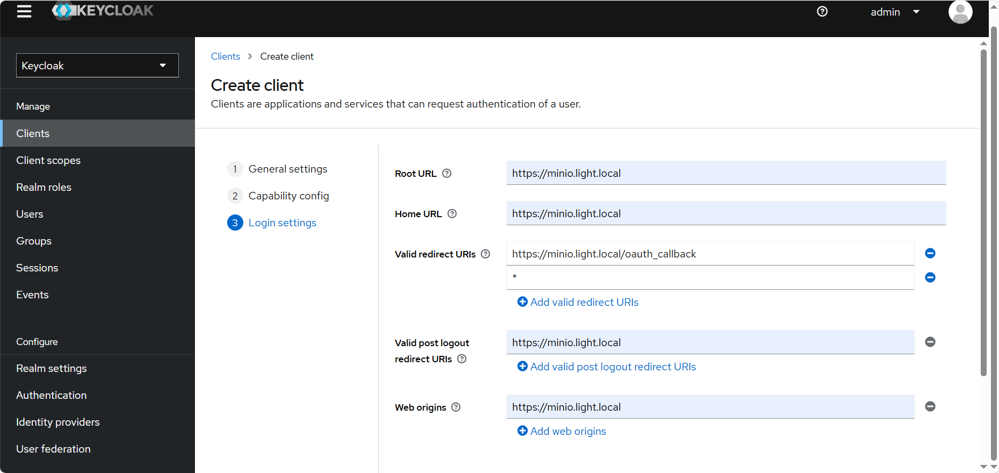
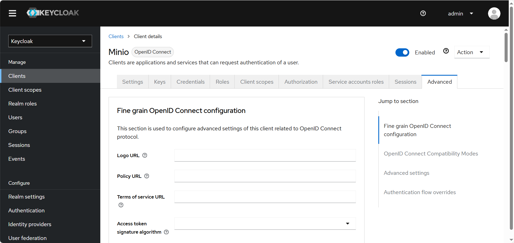

# 将 MinIO 与 Keycloak OIDC 集成

Keycloak是一种单点登录解决方案。使用Keycloak，用户使用Keycloak而不是MinIO进行身份验证。如果没有Keycloak，您将不得不为每个用户创建一个单独的身份 - 从长远来看，这将很麻烦。您需要一个集中身份解决方案来管理 MinIO 的身份验证和授权。在这篇博文中，我们将向您展示如何设置 MinIO 以使用 Keycloak。但从广义上讲，它还应该让您了解 OIDC 是如何配置 MinIO 的，因此您可以将其与 Keycloak 以外的任何东西一起使用，这里我们只是以它为例。


## Keycloak创建并配置Minio客户端

### 1. 登录到Keycloak


### 2. 创建认证客户端 Minio

将客户端名称设置为 **Minio**

 


开启 **Client authentication** 和 **Authorization**

 


设置URL信息

* **Root URL**                  `https://minio.light.local`
* **Home URL                  `https://minio.light.local`**
* **Valid redirect URIs**   `https://minio.light.local>/oauth_callback  `*
* **Valid post logout redirect URIs  `https://minio.light.local`**
* **Web origins**               `https://minio.light.local`

\n 


打开 Advanced → Advanced settings，将 **Access Token Lifespan 改为 1 小时** 

 


### 3. 创建角色， 角色名称对应到 Minio 的 Policy

* Minio-Policy1
* Minio-Policy2

 


### 4. 回到Keycloak，创建Client scope

创建Client scope, 名称为 Minio-Policy

 


在新建的Policy Scope下面， 选中Scope， 点击Assign role添加上面建好的 Minio-Policy1 和 Minio-Policy2

 


点击Policy下面的Mappers， Configure a new mapper 添加一个新的Mapper

* **Mapper type** User Client Role
* **Name**             Minio-Mapper
* **Client ID         Minio**

  \

 


### 5. 配置Scope

点击Clients -> Minio -> Client scopes -> Add client scope 添加上一步建好的Scope Minio-Policy

 


### 6. 创建一个新的用户组

 


添加用户到组

 


为组分配角色

 


\
## 配置Minio

### 1. 在 Minio 中创建对应的 Policy

使用默认账号登陆Minio，创建与Keycloak对应的 Policy

**Administrator** → **Policies**

```json
{
    "Version": "2012-10-17",
    "Statement": [
        {
            "Effect": "Allow",
            "Action": [
                "s3:*"
            ],
            "Resource": [
                "arn:aws:s3:::outline"
            ]
        }
    ]
}
```


 


\
 


\
### **2. 配置Minio的IDP**

登陆Minio， 点击**Administrator** -> Identity → Openid, 按照下图配置, Client Secret 可以从Keycloak Clients -> Minio -> Credentials -> Client secret 获得

* Config URL       `https://keycloak.light.local/realms/master/.well-known/openid-configuration`
* Client ID           Minio
* Client Secret    QQO0uOF9w9XAx8BW8JGMR9fdIEXYAwuy
* Claim Name      Minio-Policy
* Display Name   Keycloak OIDC
* Claim Prefix
* Scopes             openid,profile,email
* Redirect URI     `https://minio.light.local/oauth_callback`

 


### 3. 配置完成后重启服务， 即可通过keycloak登陆


## HTTPS证书失效处理


### 1. 使用Openssl生成CA 证书和服务端证书

```bash
# 生成 RSA私钥和自签名CA证书
openssl req -newkey rsa:2048 -nodes -keyout ca-private.key \
  -x509 -days 365 -out ca-cert.crt \
  -subj "/C=CN/ST=HB/L=WH/O=light/OU=lorch/CN=light.local/emailAddress=lorch@light.local"

# 生成服务端 RSA私钥
openssl genrsa -aes256 -passout pass:111111 -out server.key 2048

# 使用 RSA私钥生成 CSR 签名请求
openssl req -new -key server.key -passin pass:111111 -out server.csr \
  -subj "/C=CN/ST=HB/L=WH/O=light/OU=lorch/CN=light.local/emailAddress=lorch@light.local"

# 使用 CA 证书及CA密钥·对请求签发证书进行签发，生成 x509证书
openssl x509 -req -days 3650 -in server.csr -CA cert.crt -CAkey rsa_private.key \
  -passin pass:111111 -CAcreateserial -out server.crt

# 查看证书细节
openssl x509 -text -noout -in ca-cert.crt
openssl rsa  -text -noout -in ca-private.key
openssl rsa  -text -noout -in server.key
openssl req  -text -noout -in server.csr
openssl x509 -text -noout -in server.crt

```

## 参考

1. [将 MinIO 与 Keycloak OIDC 集成](http://blog.minio.org.cn/integrate-minio-with-keycloak-oidc)
2. [Minio 集成 Keycloak 登陆与授权](https://www.cnblogs.com/Chinori/p/17091169.html)
3. [X509: certificate relies on legacy Common Name field, use SANs or temporarily enable Common Name matching with GODEBUG=x509ignoreCN=0)](https://i.lckiss.com/?p=7479)
4. [基于openssl工具完成自建CA以及为server,client颁发证书](https://blog.csdn.net/weixin_42700740/article/details/117527769)
5. [使用openssl创建包含SAN的证书](https://www.jianshu.com/p/ea5bc56211ee)