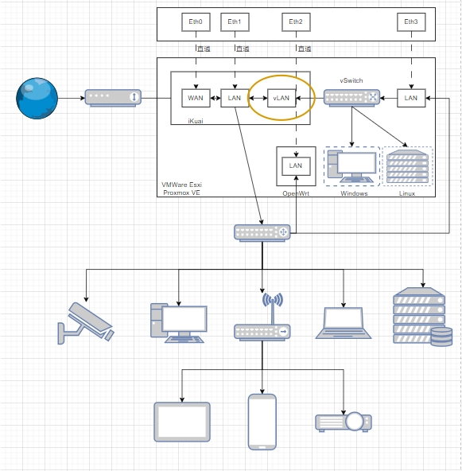
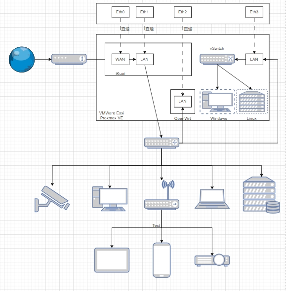
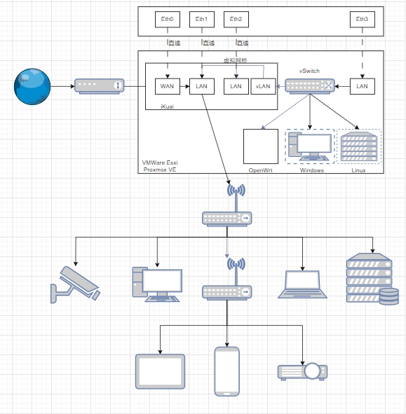

## 网口及拓扑图-方案1
| 设备网口 | Esxi网口 | 主路由网口 | 旁路由网口 |
| -------- | -------- | ---------- | ---------- |
| Eth0     | -        | WAN        | -          |
| Eth1     | -        | LAN        |            |
| Eth2     | -        | -          | LAN        |
| Eth3     | Manage   | vLan       | vLan       |



## 网口及拓扑图-方案2
| 设备网口 | Esxi网口 | 主路由网口 | 旁路由网口 |
| -------- | -------- | ---------- | ---------- |
| Eth0     | -        | WAN        | -          |
| Eth1     | -        | LAN        |            |
| Eth2     | -        | -          | LAN        |
| Eth3     | Manage   | -          |            |



## 网口及拓扑图-方案3
| 设备网口 | Esxi网口 | 主路由网口 | 旁路由网口 |
| -------- | -------- | ---------- | ---------- |
| Eth0     | -        | WAN        | -          |
| Eth1     | -        | LAN        |            |
| Eth2     | -        | LAN        |            |
| Eth3     | Manage   | vLan       | vLan       |




## 系统端口账号设置

| 系统     | 地址          | 端口 | 账号 | 密码         | 公网 |
| -------- | ------------- | ---- | ---- | ------------ | ---- |
| ESxi     | 192.168.0.199 | 80   | root | Esxi@199     | esxi |
| iKuai    | 192.168.0.200 | 80   | root | iKuai@200    | ik   |
| iStoreOS | 192.168.0.201 | 80   | root | iStoreOS@201 | is   |
| OpenWrt  | 192.168.0.201 | 80   | root | OpenWrt@202  | op   |
| HassOS   | 192.168.0.203 | 8123 | root | HassOS@203   | ha   |

```shell
# 编辑网络地址
vim /etc/config/network

# 重启网络
/etc/init.d/network restart

# 重启系统
reboot now
```