- [快速构建和安装干净的 ESXi 8 镜像指南](https://zhuanlan.zhihu.com/p/601787086)
- [快速构建和安装干净的 ESXi 8 镜像指南](https://soulteary.com/2023/01/29/how-to-easily-create-and-install-a-custom-esxi-image.html)

申请的 ESXi 8 的免费授权到了，所以趁着春节假期最后一天，折腾一把。这篇文档支持 ESXi 8 及以下版本的安装镜像构建，无需麻烦的依赖安装和解决环境问题。

相比较安装运行网上已经构建好的黑盒镜像，为什么不自己进行构建呢？

## 写在前面
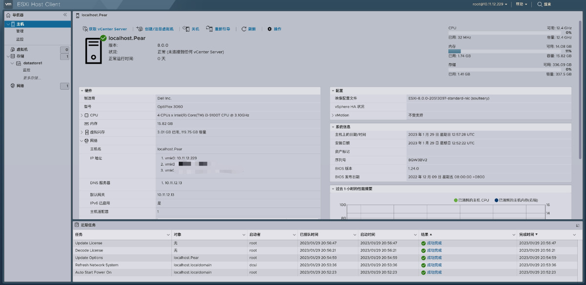

2021 年，我曾写过一篇如何构建 ESXi 7 的安装镜像，以及简单的安装教程：[《NUC 折腾笔记 - 安装 ESXi 7》[1]](https://soulteary.com/2021/06/22/nuc-notes-install-esxi7.html)。文章里的构建方法和命令，截止目前虽然还有效，我们可以通过这些命令，来构建包含我们所需要的硬件驱动或应用软件的自定义镜像。

但是，两年过去了，构建工具和其面对的系统环境却有了变化。有一位海外的用户总结了他在折腾 ESXi 8 所需要的构建环境过程中遇到的问题：[《PowerCLI 13 update and installation hurdles on Windows》[2]](https://blog.zuthof.nl/2022/11/30/powercli-13-update-and-installation-hurdles-on-windows/)。

实际上，如果你还是按照“老路”走，在不同的 Windows 版本中，你将遇到不同的“惊喜”。未免太麻烦了，而且一旦 ESXi 9 出来，各种环境和工具出现更多的“过时问题”，是不是还得在踩一遍坑？那么，有没有简单的方法呢？答案是有的。

我封装了一个简单的，用于 ESXi 镜像构建的 Docker 工具镜像，相比较乱七八糟的折腾一通环境、依赖，使用 Docker 的现成镜像，快速构建你所需要的镜像，显然更高效、稳定、干净，以及可靠。

### 申请免费的 ESXi 个人授权
在 VMware 网站中，我们能够找到 ESXi 8 和 ESXi 7 的使用授权的申请地址：

[VMware vSphere Hypervisor 8[3]](https://my.vmware.com/web/vmware/evalcenter?p=free-esxi8&source=dwnp)
[VMware vSphere Hypervisor 7[4]](https://my.vmware.com/web/vmware/evalcenter?p=free-esxi7&source=dwnp)
注册社区帐号，然后填写表单，耐心等待授权审核通过，然后就能够合情合理合规的使用这款强大的软件啦。（第一次申请，审核时间可能久一些，之后的申请基本都是秒过。）

### 本篇文章中的开源项目
我将本文中使用的代码上传到了 [soulteary/easy-ESXi-builder[5]](https://github.com/soulteary/easy-ESXi-builder)，如果你期望完全自行构建，或者进行调整，可以考虑自取代码，折腾一下。

当然，如果这个项目帮助到了你，欢迎“一键三连”。

## 快速制作 ESXi 安装镜像
我使用 docker 制作了一个构建 ESXi 安装镜像的工作，通过下面的方式，只需要执行一条命令获取工具镜像：
```shell
docker pull soulteary/easy-esxi-builder:2023.01.29
```

至于 docker 的安装，你可以访问[ Docker 官方网站[6]](https://www.docker.com/)下载安装包，然后一路“Next” 完成安装。如果你使用 Linux，也可以参考这篇文章[《在笔记本上搭建高性价比的 Linux 学习环境：基础篇》[7]](https://soulteary.com/2022/06/21/building-a-cost-effective-linux-learning-environment-on-a-laptop-the-basics.html#%E6%9B%B4%E7%AE%80%E5%8D%95%E7%9A%84-docker-%E5%AE%89%E8%A3%85)中提到的“更简单的 Docker 安装”方式，来完成 Docker 的快速初始化。

当我们完成了“工具镜像”的下载后，还需要准备（下载）两类“做饭的素材”：

- ESXi 的离线安装包，比如：“VMware-ESXi-8.0-20513097-depot.zip”，获取方式：
  - 在上文中的“授权申请”页面，我们能够直接下载，比如 ESXi 6，7，8。
  - 获取使用好心人分享的网盘地址（记得做文件 HASH 校验）
- ESXi 相关社区驱动，搭配我们自己的硬件使用，比如：
  - ESXi 的 PCIe 社区网络驱动程序：[community-networking-driver-for-esxi[8]](https://flings.vmware.com/community-networking-driver-for-esxi)
  - ESXi 的 USB 社区网络驱动程序：[usb-network-native-driver-for-esxi[9]](https://flings.vmware.com/usb-network-native-driver-for-esxi)
  - ESXi 的 NVMe 社区驱动程序：[community-nvme-driver-for-esxi[10]](https://flings.vmware.com/community-nvme-driver-for-esxi)

将下载好的文件放置在当前目录，然后执行下面的命令，能够直接启动工具镜像，进入一个干净可靠的构建环境：
```shell
docker run --rm -it -v `pwd`:/data soulteary/easy-esxi-builder:2023.01.29
```
上面的命令执行完毕后，当前目录下载好的 ESXi 安装包和驱动等，将被挂载到 Docker 容器中的 `/data` 目录中。

接下来，我们就能够使用下面的命令，来添加基础镜像，和我们要附加到 ESXi 镜像中的驱动了（命令中的文件名根据下载的文件名进行适当调整）：
```shell
# 加载基础镜像
Add-EsxSoftwareDepot /data/VMware-ESXi-8.0-20513097-depot.zip

# 加载社区 NVMe 驱动
Add-EsxSoftwareDepot /data/nvme-community-driver_1.0.1.0-3vmw.700.1.0.15843807-component-18902434.zip

# 加载社区 PCIe 驱动
Add-EsxSoftwareDepot /data/Net-Community-Driver_1.2.7.0-1vmw.700.1.0.15843807_19480755.zip

# 加载社区 USB 驱动
Add-EsxSoftwareDepot /data/ESXi800-VMKUSB-NIC-FLING-61054763-component-20826251.zip

# 如果你还需要更多驱动，参考上面的命令，继续操作即可。
```

一通命令执行，加载完毕“做饭的素材”后，执行 Get-EsxImageProfile 来查看系统加载了的 ESXi 基础镜像具体是什么版本：
```shell
# Get-EsxImageProfile

Name                           Vendor          Last Modified   Acceptance Level
----                           ------          -------------   ----------------
ESXi-8.0.0-20513097-standard   VMware, Inc.    09/23/2022 18:… PartnerSupported
ESXi-8.0.0-20513097-no-tools   VMware, Inc.    09/23/2022 18:… PartnerSupported
```

然后，使用下面的命令，制作一个“镜像副本”，用于“继续发挥”：
```shell
New-EsxImageProfile -CloneProfile "ESXi-8.0.0-20513097-standard" -name "ESXi-8.0.0-20513097-standard-nic" -vendor "soulteary"
```

命令执行完毕，我们将看到类似下面的输出：
```shell
Name                           Vendor          Last Modified   Acceptance Level
----                           ------          -------------   ----------------
ESXi-8.0.0-20513097-standard-… soulteary       09/23/2022 18:… PartnerSupported
```

同样的，我们需要使用命令 Get-EsxSoftwarePackage 来获得可以使用的驱动列表：
```shell
# Get-EsxSoftwarePackage 

Name                     Version                        Vendor     Creation Date
----                     -------                        ------     -------------
dwi2c                    0.1-2vmw.800.1.0.20513097      VMW        09/23/2022 17:3…
elxnet                   12.0.1250.0-8vmw.800.1.0.2051… VMW        09/23/2022 17:3…
lpnic                    11.4.62.0-1vmw.800.1.0.205130… VMW        09/23/2022 17:3…
esx-update               8.0.0-1.0.20513097             VMware     09/23/2022 17:3…
qfle3                    1.0.67.0-30vmw.800.1.0.205130… VMW        09/23/2022 17:3…
esxio-base               8.0.0-1.0.20513097             VMware     09/23/2022 17:3…
cpu-microcode            8.0.0-1.0.20513097             VMware     09/23/2022 17:3…
esx-base                 8.0.0-1.0.20513097             VMware     09/23/2022 17:3…
...
```

相比较 ESXi 基础镜像列表就俩选项，日志将输出至少一百个驱动，非常不利于观察和获得我们刚刚添加的驱动名称。所以，在这里我们可以通过简单的命令，过滤掉“VMware” 出品、和官方镜像一起构建于 “09/23/2022” （可以根据具体情况调整）的内容：
```shell
# Get-EsxSoftwarePackage | grep -v VMware | grep -v '09/23/2022'

Name                     Version                        Vendor     Creation Date
----                     -------                        ------     -------------
nvme-community           1.0.1.0-3vmw.700.1.0.15843807  VMW        01/08/2020 12:0…
net-community            1.2.7.0-1vmw.700.1.0.15843807  VMW        03/10/2022 21:2…
vmkusb-nic-fling         1.11-1vmw.800.1.20.61054763    VMW        11/16/2022 02:1…
pensandoatlas            1.46.0.E.24.1.256-2vmw.800.1.… VMW        08/16/2022 14:0…
```

命令执行完，能够看到结果列表就所剩不多了。挑选出我们手动添加的驱动的名称，执行类似下面的命令，就完成了对 ESXi 镜像驱动的增加。
```shell
Add-EsxSoftwarePackage -ImageProfile "ESXi-8.0.0-20513097-standard-nic" -SoftwarePackage "nvme-community"

Add-EsxSoftwarePackage -ImageProfile "ESXi-8.0.0-20513097-standard-nic" -SoftwarePackage "net-community"

Add-EsxSoftwarePackage -ImageProfile "ESXi-8.0.0-20513097-standard-nic" -SoftwarePackage "vmkusb-nic-fling"
```

最后，执行命令将附加好社区驱动的 ESXi 镜像进行导出即可：
```shell
Export-EsxImageProfile -ImageProfile "ESXi-8.0.0-20513097-standard-nic" -ExportToIso -FilePath /data/ESXi8.iso
```

镜像导出到 `/data` 目录后，关闭容器，回到当前系统，准备制作安装引导盘（USB 启动盘）。

## ESXi 8 的安装
ESXi 8 安装和之前类似，首先需要制作一张安装引导盘。

### 制作 USB 安装引导盘

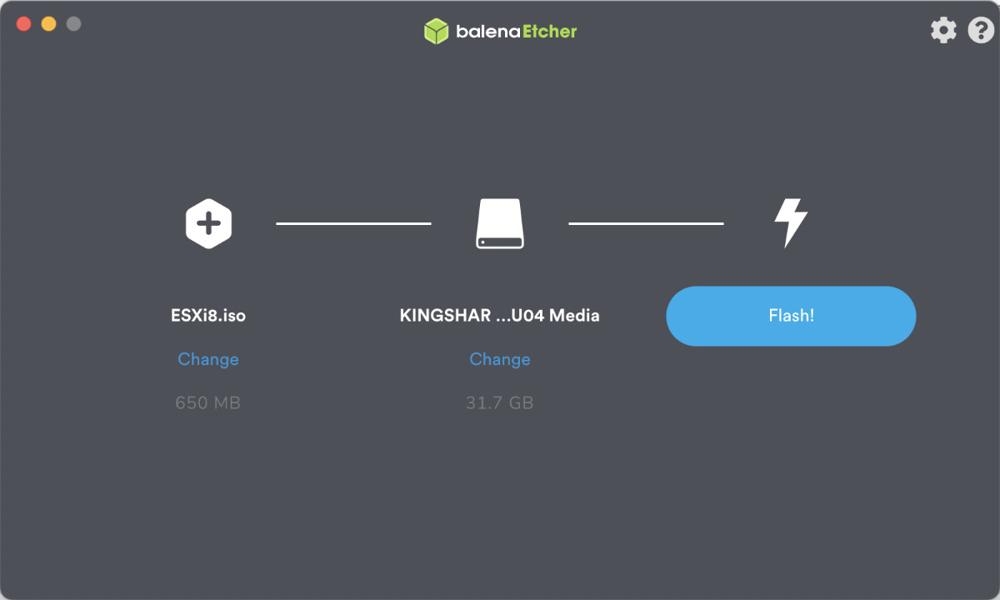
和之前一样，我个人推荐使用 [Balena Etcher[11]](https://www.balena.io/etcher) 来简单的制作启动盘，只需要把我们制作好的 ESXi.iso 拖到软件界面上，然后点击 “Flash!” 按钮，等待镜像写入 USB 设备即可。

### 完成 ESXi 的安装
这里记录和分享下如何在普通的家用设备上完成 ESXi 的安装，包含解决不被 ESXi 支持的网络硬件的安装配置过程。

安装的第一步是在引导界面或者设备 BIOS 设置使用 USB 安装盘设备引导。


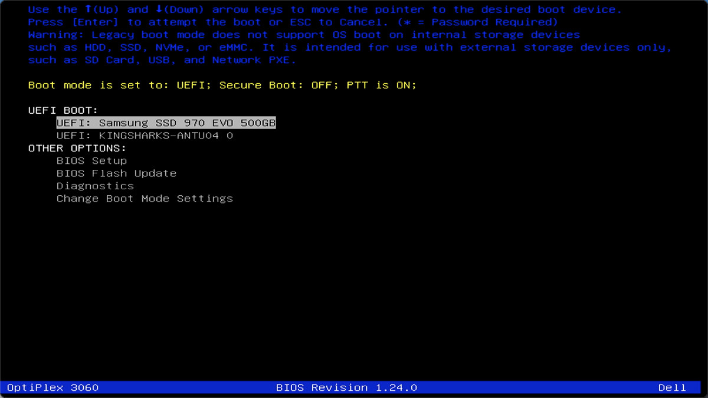
如果 USB 设备引导正常，我们将能够看到类似下面的 ESXi 安装工具的加载界面。


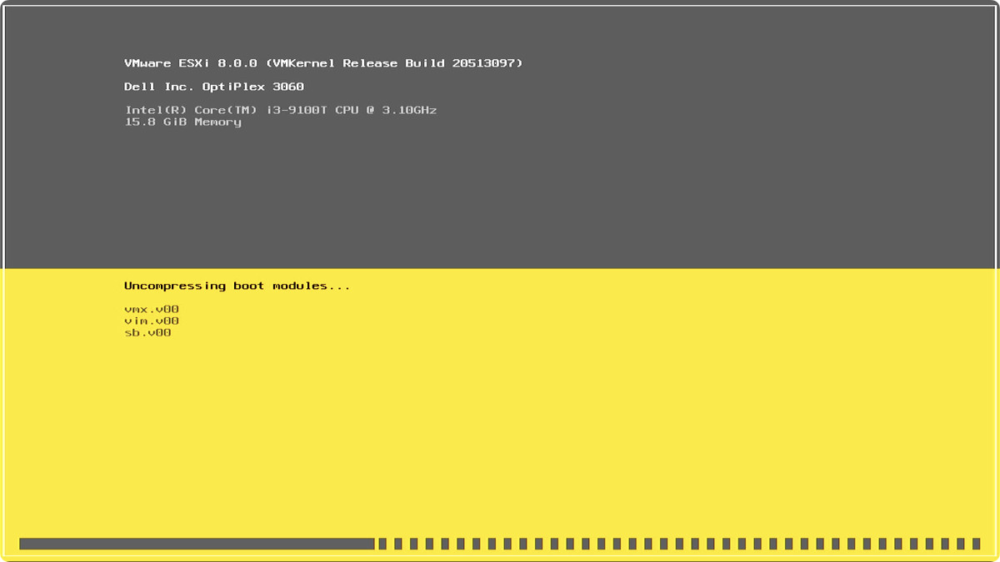
如果你的设备已经接入网络，并且网卡设备可以被识别，我们将进入下面的界面。如果你遇到问题，可以参考下文中的解决方案来解决问题。


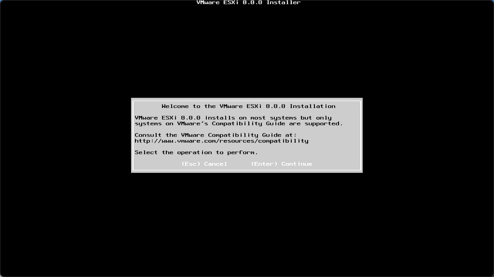
如果你不是跨两个（6->8）版本升级 ESXi，并且之前没有在老版本中安装过网络驱动，可以考虑直接升级。如果你希望省心一些，可以选择备份设备中的虚拟机数据，然后选择第三项，进行全新的覆盖安装。


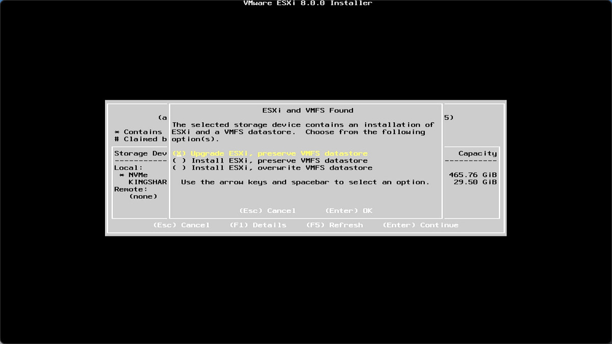
一路“Next”之后，就来到了正式的安装过程中，耐心等待进度条走完。


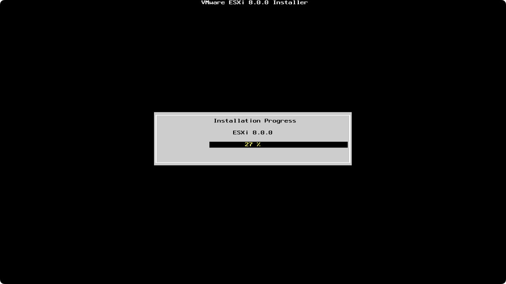
安装完毕，选择重启设备，拔掉插在设备上的 USB 引导盘。耐心等待 ESXi 新系统的启动。


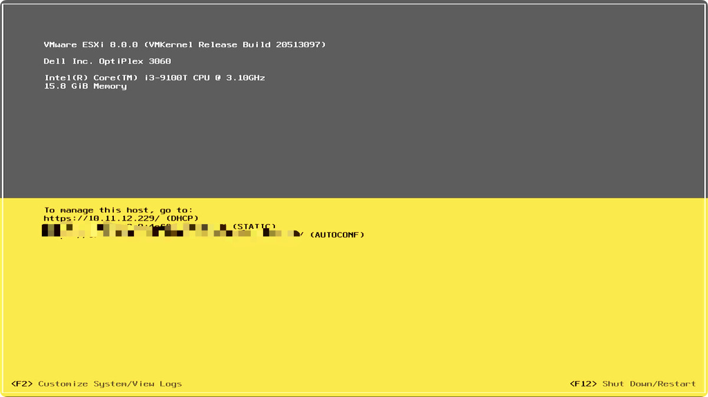
我们可以从启动完毕的 ESXi 的界面中得到 ESXi 控制台的登录地址，或者在路由器的管理界面中，以及使用 arp -a 命令，来寻找在网络中“新出现”的家伙。

```shell
arp -a
...
? (10.11.12.229) at 0:xx:xx:xx:xx:xx on en0 ifscope [ethernet]
...
```

相比较 ESXi 6 和 ESXi 7 ，ESXi 8 的登录界面可以说是“焕然一新”。


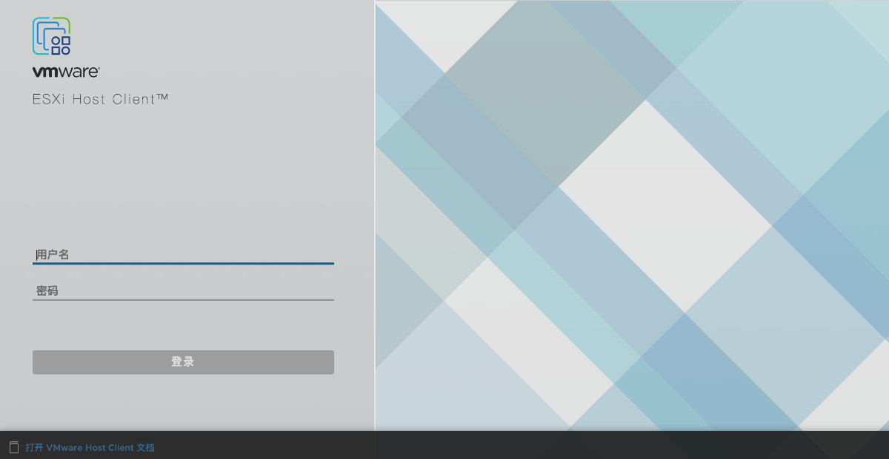
使用我们设置好的账号密码，登录控制台，就能看到新版本的控制台啦。


想要顺利的使用 ESXi ，别忘记更新授权。具体方法，导航栏点击“管理”菜单，进入管理页面，选择“许可”选项卡，点击分配许可证，输入我们的许可即可。


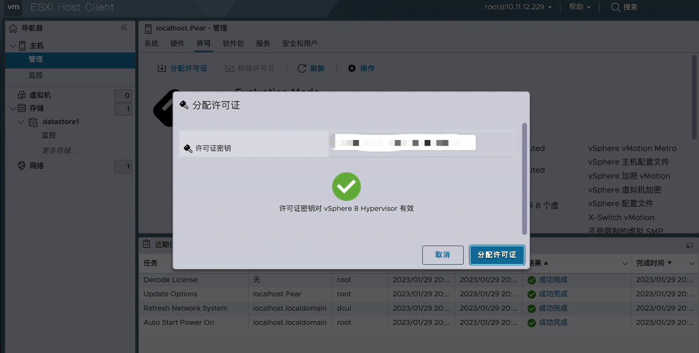

## ESXi 安装常见问题解决方案
常见的问题应该主要就下面两种。

### 无法进入正式安装过程
在 USB 引导设备之后，将先进行安装工具的加载，但是自 ESXi 7 开始，如果我们没有联网（插好网线），或者没有使用能够识别的网卡，将不能继续进行“正式安装过程”。在加载过程的最后，我们将看到类似下面的一闪而过的错误日志界面。


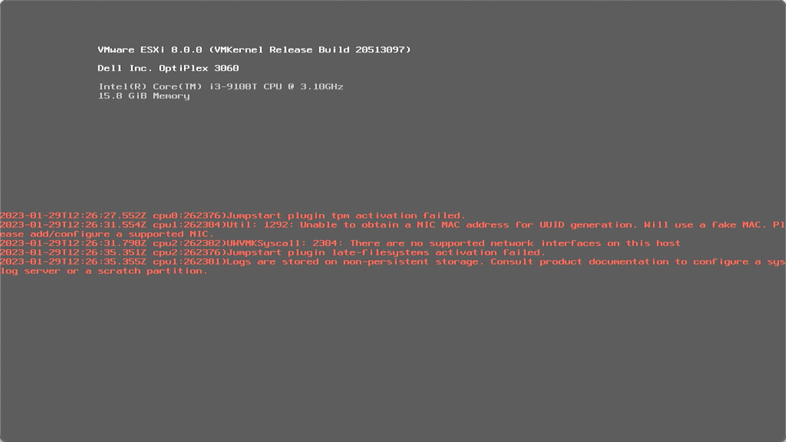
解决方法有几种，包括：插上网线，更换设备网卡，插一张便宜的 USB 网卡，或者降级 ESXi 版本。

### 安装过程中卡在“no vmknic tagged for management was found”
如果你的设备没有 ESXi 8 默认支持的网卡，即使我们在镜像中打了网卡驱动，也会遇到类似下面的问题。


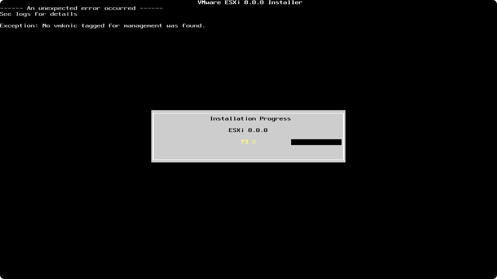
其实，此刻 ESXi 8 已经安装完毕，只差设置“网卡地址”，以及“设置管理员密码”。（这里应该是 VMware 工程师编写代码的疏忽。）

放心的重启设备，拔掉 USB 安装盘，然后等待设备系统加载。


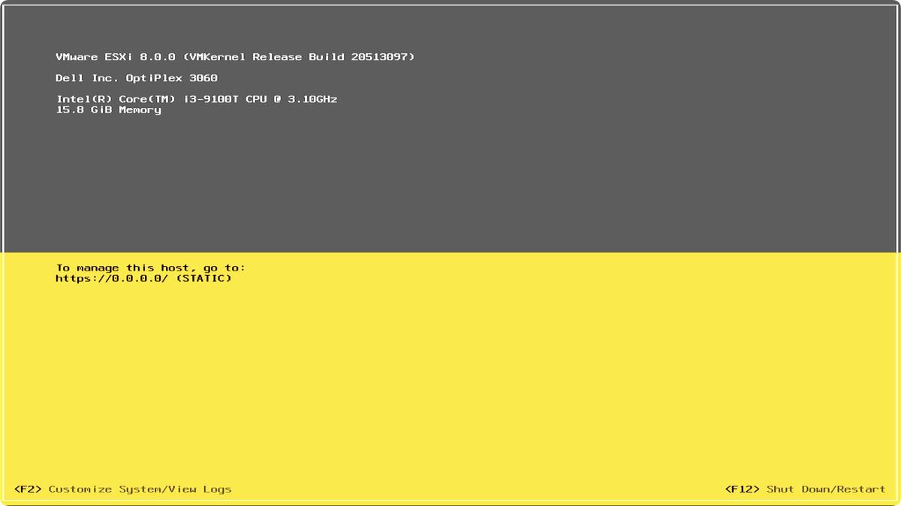
等待 ESXi 启动完毕，我们能够看到网络界面展示的结果是：`https://0.0.0.0/ (static)`。这个算是很典型的网卡没插网线，或者网卡没配置好的状况。

我们按下 F2 ，然后在登录界面直接按下回车，进入 ESXi 系统设置。


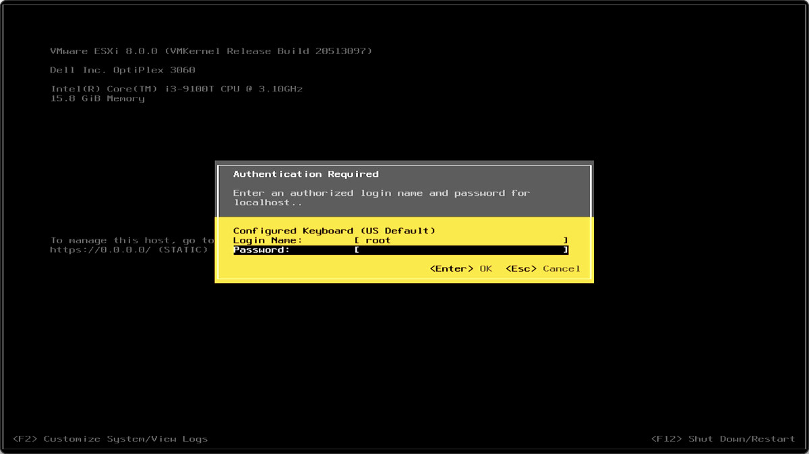
选择“网络恢复”选项。


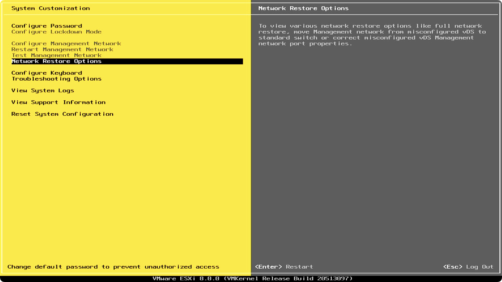
在新的界面中，再次确认恢复网络设置。（重置网络）


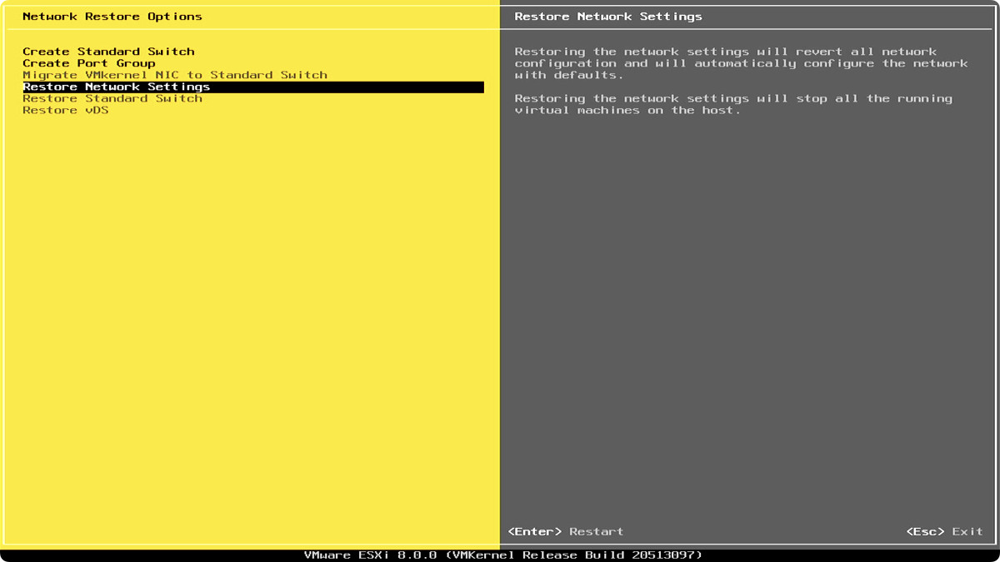
完成网络重置之后，返回 ESXi 界面，能够发现网络状态，就已经正常啦。

下面记录下制作这个镜像工具的过程，希望能够帮助到“后来的人”。比如，如果 ESXi 出新版了，工具需要升级，而我恰好没有时间折腾。

## 制作 Docker ESXi 构建工具镜像
ESXi 构建工具 [PowerCLI 的文档中有提到[12]](https://vdc-repo.vmware.com/vmwb-repository/dcr-public/9619cb6d-3975-4bff-aa1f-0e785283a1a9/58d0925b-e15d-4803-bbd4-eb314dd165b0/GUID-9081EBAF-BF85-48B1-82A0-D1C49F3FF1E8.html)，运行它需要 Python 3.7 运行环境，所以我们使用 `python:3.7` 作为基础镜像。
```shell
FROM python:3.7
```

接着，先来安装需要的 Python 依赖软件包：
```shell
RUN pip config set global.index-url https://pypi.tuna.tsinghua.edu.cn/simple && pip install six psutil lxml pyopenssl --no-cache-dir
```
以及，PowerCLI 运行需要的 [.Net 运行环境[13]](https://learn.microsoft.com/en-us/dotnet/core/install/linux-debian)和 PowerShell 环境：
```shell
RUN wget "https://packages.microsoft.com/config/debian/11/packages-microsoft-prod.deb" -O packages-microsoft-prod.deb && dpkg -i packages-microsoft-prod.deb && rm packages-microsoft-prod.deb

RUN sed -i -e "s/deb.debian.org/mirrors.tuna.tsinghua.edu.cn/" /etc/apt/sources.list && apt-get update && apt-get install -y powershell
```

然后，根据 [VMWare 开发者文档[14]](https://developer.vmware.com/powercli/installation-guide)中的 PowerCLI 安装文档，采用离线方案安装完整的 PowerCLI：
```shell
RUN curl -L 'https://developer.vmware.com/docs/17484/' \
  -H 'authority: developer.vmware.com' \
  -H 'accept: text/html' \
  -H 'referer: https://developer.vmware.com/powercli/installation-guide' \
  -H 'user-agent: Mozilla/5.0 (Macintosh; Intel Mac OS X 10_15_7) AppleWebKit/537.36 (KHTML, like Gecko) Chrome/109.0.0.0 Safari/537.36' \
  --compressed \
  -o VMware-PowerCLI-13.0.0-20829139.zip
```

接下来的工作需要在 Powershell 环境中进行，所以需要设置 pwsh 为容器构建的 shell：
```shell
SHELL ["/usr/bin/pwsh", "-c"]
```

搞定 pwsh 运行环境之后，我们来一套“组合拳”，完整之前下载完毕的 PowerCLI 的工具压缩包的安装，以及做一个简单的环境清理：

```shell
RUN cd $($env:PSModulePath | awk -F ':' '{print $1}') && \
    mv /VMware-PowerCLI-13.0.0-20829139.zip . && \
    Expand-Archive ./VMware-PowerCLI-13.0.0-20829139.zip ./ && \
    rm -rf ./VMware-PowerCLI-13.0.0-20829139.zip
```

最后，告诉工具镜像用 pwsh 替代 python 作为入口即可：
```shell
ENTRYPOINT pwsh
```

完整的代码，可以参考 [soulteary/easy-ESXi-builder[15]](https://github.com/soulteary/easy-ESXi-builder) 项目。

## 其他
关于制作镜像时的技术选型的思考。

### 为什么放弃基于 Windows 制作镜像或编程构建程序
想要制作 ESXi 镜像，我们需要使用到官方提供的 PowerCLI，在[ VMWare 官方的一处文档中[16]](https://vdc-repo.vmware.com/vmwb-repository/dcr-public/9619cb6d-3975-4bff-aa1f-0e785283a1a9/58d0925b-e15d-4803-bbd4-eb314dd165b0/GUID-9081EBAF-BF85-48B1-82A0-D1C49F3FF1E8.html)，我们可以看到下面的线索：
```shell
To use the VMware.ImageBuilder module, you must install Python 3.7 with four additional packages and configure PowerCLI.

Starting from VMware PowerCLI 13.0, Python 3.7 is a prerequisite for using the VMware.ImageBuilder module.

You must also install four additional packages in Python:

- six
- psutil
- lxml
- pyopenssl

To configure PowerCLI, you must set the path to the Python 3.7 executable by using the Set-PowerCLIConfiguration cmdlet.
```

如果我们坚持使用 Windows，那么我们可能需要先[解决 Powershell 的版本更新[17]](https://learn.microsoft.com/en-us/powershell/scripting/windows-powershell/install/installing-windows-powershell?view=powershell-7.3)，以及安装今年即将退出舞台的 Python 3.7 ，要知道目前我们能够获得到的 Windows 的符合条件的 Python 3.7 版本的安装包是 2020 年 8 月的 [Python 3.7.9[18]](https://www.python.org/downloads/release/python-379/)。

并且，Windows 环境下，当我们使用构建必须使用到的命令 Add-EsxSoftwareDepot 来引用官方的安装镜像的时候，可能会遇到需要设置 Python 运行环境路径，设置之后并不生效的问题。以及安装 get-pip 可能因为 Python 版本比较久引发的各种小问题，比如这个：[“No module named 'distutils.cmd'”[19]](https://github.com/pypa/get-pip/issues/124) 等。

与其面对这些“按下葫芦又起瓢”的问题，不如选择更长久、稳定的方案。

### 为什么没有使用 Ubuntu 作为基础镜像，而选择了 Debian
构建镜像需要的 PowerCLI 构建工具，依赖 .Net Runtime，同时也依赖 Python 3.7 版本。

Ubuntu 22.04 安装 Python 3.7 这个老版本比较麻烦，需要使用 ppa 或者下载 deb 包，出于文章前面提到的长久的考虑，不推荐使用 Ubuntu 20.04 或者 18.04 这俩比较久的镜像。

所以，不如直接使用“干净又卫生”的 Python 3.7 的 Docker 镜像，来作为基础镜像。而这个镜像的底子就是 Debian。

## 最后
好了，这篇文章就先写到这里啦。

## 引用链接
[1] [《NUC 折腾笔记 - 安装 ESXi 7》](https://soulteary.com/2021/06/22/nuc-notes-install-esxi7.html)
[2] [《PowerCLI 13 update and installation hurdles on Windows》](https://blog.zuthof.nl/2022/11/30/powercli-13-update-and-installation-hurdles-on-windows/)
[3] [VMware vSphere Hypervisor 8](https://my.vmware.com/web/vmware/evalcenter?p=free-esxi8&source=dwnp)
[4] [VMware vSphere Hypervisor 7](https://my.vmware.com/web/vmware/evalcenter?p=free-esxi7&source=dwnp)
[5] [soulteary/easy-ESXi-builder](https://github.com/soulteary/easy-ESXi-builder)
[6] [Docker 官方网站](https://www.docker.com/)
[7] [《在笔记本上搭建高性价比的 Linux 学习环境：基础篇》](https://soulteary.com/2022/06/21/building-a-cost-effective-linux-learning-environment-on-a-laptop-the-basics.html#%E6%9B%B4%E7%AE%80%E5%8D%95%E7%9A%84-docker-%E5%AE%89%E8%A3%85)
[8] [community-networking-driver-for-esxi](https://flings.vmware.com/community-networking-driver-for-esxi)
[9] [usb-network-native-driver-for-esxi](https://flings.vmware.com/usb-network-native-driver-for-esxi)
[10] [community-nvme-driver-for-esxi](https://flings.vmware.com/community-nvme-driver-for-esxi)
[11] [Balena Etcher](https://www.balena.io/etcher)
[12] [PowerCLI 的文档中有提到](https://vdc-repo.vmware.com/vmwb-repository/dcr-public/9619cb6d-3975-4bff-aa1f-0e785283a1a9/58d0925b-e15d-4803-bbd4-eb314dd165b0/GUID-9081EBAF-BF85-48B1-82A0-D1C49F3FF1E8.html)
[13] [.Net 运行环境](https://learn.microsoft.com/en-us/dotnet/core/install/linux-debian)
[14] [VMWare 开发者文档](https://developer.vmware.com/powercli/installation-guide)
[15] [soulteary/easy-ESXi-builder](https://github.com/soulteary/easy-ESXi-builder)
[16] [VMWare 官方的一处文档中](https://vdc-repo.vmware.com/vmwb-repository/dcr-public/9619cb6d-3975-4bff-aa1f-0e785283a1a9/58d0925b-e15d-4803-bbd4-eb314dd165b0/GUID-9081EBAF-BF85-48B1-82A0-D1C49F3FF1E8.html)
[17] [解决 Powershell 的版本更新](https://learn.microsoft.com/en-us/powershell/scripting/windows-powershell/install/installing-windows-powershell?view=powershell-7.3)
[18] [Python 3.7.9](https://www.python.org/downloads/release/python-379/)
[19] [“No module named 'distutils.cmd'”](https://github.com/pypa/get-pip/issues/124)
