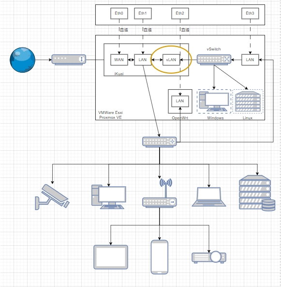
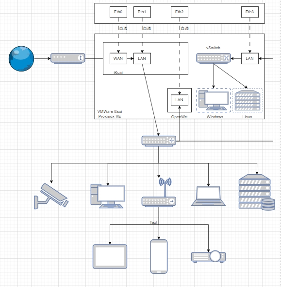
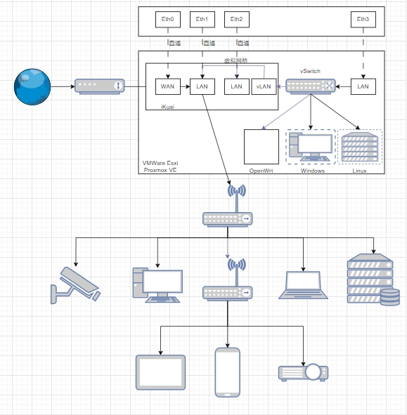

## 网口及拓扑图-方案1
| 设备网口 | Esxi网口 | 主路由网口 | 旁路由网口 |
| -------- | -------- | ---------- | ---------- |
| Eth0     | -        | WAN        | -          |
| Eth1     | -        | LAN        |            |
| Eth2     | -        | -          | LAN        |
| Eth3     | Manage   | vLan       | vLan       |

## 网口及拓扑图-方案2
| 设备网口 | Esxi网口 | 主路由网口 | 旁路由网口 |
| -------- | -------- | ---------- | ---------- |
| Eth0     | -        | WAN        | -          |
| Eth1     | -        | LAN        |            |
| Eth2     | -        | -          | LAN        |
| Eth3     | Manage   | -          |            |

## 网口及拓扑图-方案3
| 设备网口 | Esxi网口 | 主路由网口 | 旁路由网口 |
| -------- | -------- | ---------- | ---------- |
| Eth0     | -        | WAN        | -          |
| Eth1     | -        | LAN        |            |
| Eth2     | -        | LAN        |            |
| Eth3     | Manage   | vLan       | vLan       |

