- [Tailscale](https://tailscale.com/) 
- [Github](https://github.com/tailscale/tailscale)
- [glider](https://github.com/nadoo/glider)

## Tailscale 部署方案

### 仅 Tailscale
1. 简单
2. 国内速度慢
3. 容易断连

### Tailscale + Derper
1. 相对简单
2. 速度快(取决于Derper服务器带宽)
3. 节点数量存在上限，无法指定网段

### Tailscale + Derper + Headscale
1. 相对复杂
2. 速度快(取决于Derper服务器带宽)
3. 节点数量无上限，可指定网段，租户隔离

## 仅 Tailscale 模式部署
1. [注册 Tailscale 账号](https://login.tailscale.com/start)，建议使用微软账号
2. 访问[控制台配置页面](https://login.tailscale.com/admin/settings/keys)，点击 `Generate auth key` 生成认证秘钥，复制秘钥到文本中备用
3. 下载 [Tailscale](https://tailscale.com/download) 客户端并安装到电脑，运行登录账号
4. 手机下载 Tailscale 并安装，使用刚才的秘钥登录（也可以使用账号密码）

## Tailscale + Derper + Headscale 方式部署
目前国家工信部在大力推动三大运营商发展 IPv6，对家用宽带而言，可以使用的 IPv4 公网 IP 会越来越少。有部分地区即使拿到了公网 IPv4 地址，也是个大内网地址，根本不是真正的公网 IP，访问家庭内网的资源将会变得越来越困难。

部分小伙伴可能会选择使用 frp 等针对特定协议和端口的内网穿透方案，但这种方案还是不够酸爽，无法访问家庭内网任意设备的任意端口。更佳的选择还是通过 VPN 来组建大内网。至于该选择哪种 VPN，毫无疑问肯定是 WireGuard，WireGuard 就是 VPN 的未来。**我已经不止一次向大家推荐使用 WireGuard 了，我累了，不想再讲了，你爱 JB 用辣鸡 OpenVPN 之类的就用吧，你开心就好**。

WireGuard 相比于传统 VPN 的核心优势是没有 VPN 网关，所有节点之间都可以点对点（P2P）连接，也就是我之前提到的[全互联模式（full mesh）](https://fuckcloudnative.io/posts/wireguard-full-mesh/%231-%E5%85%A8%E4%BA%92%E8%81%94%E6%A8%A1%E5%BC%8F%E6%9E%B6%E6%9E%84%E4%B8%8E%E9%85%8D%E7%BD%AE)，效率更高，速度更快，成本更低。

WireGuard 目前最大的痛点就是上层应用的功能不够健全，因为 WireGuard 推崇的是 Unix 的哲学，WireGuard 本身只是一个内核级别的模块，只是一个数据平面，至于上层的更高级的功能（比如秘钥交换机制，UDP 打洞，ACL 等），需要通过用户空间的应用来实现。

所以为了基于 WireGuard 实现更完美的 VPN 工具，现在已经涌现出了很多项目在互相厮杀。笔者前段时间一直在推崇 [Netmaker](https://fuckcloudnative.io/posts/configure-a-mesh-network-with-netmaker/)，它通过可视化界面来配置 WireGuard 的全互联模式，它支持 UDP 打洞、多租户等各种高端功能，几乎适配所有平台，非常强大。然而现实世界是复杂的，无法保证所有的 NAT 都能打洞成功，且 Netmaker 目前还没有 fallback 机制，如果打洞失败，无法 fallback 改成走中继节点。Tailscale 在这一点上比 Netmaker 高明许多，它支持 fallback 机制，可以尽最大努力实现全互联模式，部分节点即使打洞不成功，也能通过中继节点在这个虚拟网络中畅通无阻。

没错，我移情别恋了，从 Netmaker 阵营转向了 Tailscale，是渣男没错了。

## Tailscale 是什么
Tailscale 是一种基于 WireGuard 的虚拟组网工具，和 Netmaker 类似，**最大的区别在于 Tailscale 是在用户态实现了 WireGuard 协议，而 Netmaker 直接使用了内核态的 WireGuard**。所以 Tailscale 相比于内核态 WireGuard 性能会有所损失，但与 OpenVPN 之流相比还是能甩好几十条街的，Tailscale 虽然在性能上做了些许取舍，但在功能和易用性上绝对是完爆其他工具：

1. 开箱即用
   - 无需配置防火墙
   - 没有额外的配置
2. 高安全性/私密性
    - 自动密钥轮换
    - 点对点连接
    - 支持用户审查端到端的访问记录
3. 在原有的 ICE、STUN 等 UDP 协议外，实现了 DERP TCP 协议来实现 NAT 穿透
4. 基于公网的控制服务器下发 ACL 和配置，实现节点动态更新
5. 通过第三方（如 Google） SSO 服务生成用户和私钥，实现身份认证

简而言之，我们可以将 Tailscale 看成是更为易用、功能更完善的 WireGuard。

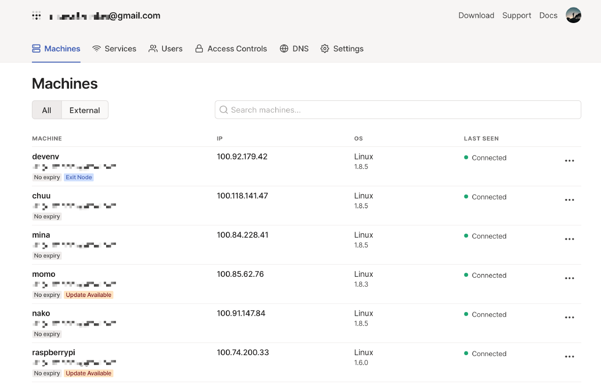

光有这些还不够，作为一个白嫖党，咱更关心的是免费与开源。

Tailscale 是一款商业产品，但个人用户是可以白嫖的，个人用户在接入设备不超过 20 台的情况下是可以免费使用的（虽然有一些限制，比如子网网段无法自定义，且无法设置多个子网）。除 Windows 和 macOS 的图形应用程序外，其他 Tailscale 客户端的组件（包含 Android 客户端）是在 BSD 许可下以开源项目的形式开发的，你可以在他们的 GitHub 仓库找到各个操作系统的客户端源码。

对于大部份用户来说，白嫖 Tailscale 已经足够了，如果你有更高的需求，比如自定义网段，可以选择付费。

我就不想付费行不行？行，不过得往下看。

## Headscale 是什么
Tailscale 的控制服务器是不开源的，而且对免费用户有诸多限制，这是人家的摇钱树，可以理解。好在目前有一款开源的实现叫 [Headscale](https://github.com/juanfont/headscale)，这也是唯一的一款，希望能发展壮大。

Headscale 由欧洲航天局的 Juan Font 使用 Go 语言开发，在 BSD 许可下发布，实现了 Tailscale 控制服务器的所有主要功能，可以部署在企业内部，没有任何设备数量的限制，且所有的网络流量都由自己控制。

目前 Headscale 还没有可视化界面，期待后续更新吧。

## Headscale 部署
Headscale 部署很简单，推荐直接在 Linux 主机上安装。

> 理论上来说只要你的 Headscale 服务可以暴露到公网出口就行，但最好不要有 NAT，所以推荐将 Headscale 部署在有公网 IP 的云主机上。

首先需要到其 GitHub 仓库的 Release 页面下载最新版的二进制文件。

```shell
$ wget --output-document=/usr/local/bin/headscale \
   https://github.com/juanfont/headscale/releases/download/v<HEADSCALE VERSION>/headscale_<HEADSCALE VERSION>_linux_<ARCH>

$ chmod +x /usr/local/bin/headscale
```

创建配置目录：

```shell
$ mkdir -p /etc/headscale
```

创建目录用来存储数据与证书：

```shell
$ mkdir -p /var/lib/headscale
```

创建空的 SQLite 数据库文件：

```shell
$ touch /var/lib/headscale/db.sqlite
```

创建 Headscale 配置文件：

```shell
$ wget https://github.com/juanfont/headscale/raw/main/config-example.yaml -O /etc/headscale/config.yaml
```

- 修改配置文件，将 server_url 改为公网 IP 或域名。如果是国内服务器，域名必须要备案。我的域名无法备案，所以我就直接用公网 IP 了。

- 如果暂时用不到 DNS 功能，可以先将 magic_dns 设为 false。

- server_url 设置为 http://<PUBLIC_IP>:8080，将 <PUBLIC_IP> 替换为公网 IP 或者域名。

- 可自定义私有网段，也可同时开启 IPv4 和 IPv6：

```shell
ip_prefixes:
  # - fd7a:115c:a1e0::/48
  - 10.1.0.0/16
```

创建 SystemD service 配置文件：

```shell
# /etc/systemd/system/headscale.service
[Unit]
Description=headscale controller
After=syslog.target
After=network.target

[Service]
Type=simple
User=headscale
Group=headscale
ExecStart=/usr/local/bin/headscale serve
Restart=always
RestartSec=5

# Optional security enhancements
NoNewPrivileges=yes
PrivateTmp=yes
ProtectSystem=strict
ProtectHome=yes
ReadWritePaths=/var/lib/headscale /var/run/headscale
AmbientCapabilities=CAP_NET_BIND_SERVICE
RuntimeDirectory=headscale

[Install]
WantedBy=multi-user.target
```

创建 headscale 用户：

```shell
$ useradd headscale -d /home/headscale -m
```

修改 /var/lib/headscale 目录的 owner：

```shell
$ chown -R headscale:headscale /var/lib/headscale
```

修改配置文件中的 unix_socket：

```shell
unix_socket: /var/run/headscale/headscale.sock
```

Reload SystemD 以加载新的配置文件：

```shell
$ systemctl daemon-reload
```

启动 Headscale 服务并设置开机自启：

```shell
$ systemctl enable --now headscale
```

查看运行状态：

```shell
$ systemctl status headscale
```

查看占用端口：

```shell
$ ss -tulnp|grep headscale

tcp LISTEN 0 1024 [::]:9090 [::]:* users:(("headscale",pid=10899,fd=13))

tcp LISTEN 0 1024 [::]:50443 [::]:* users:(("headscale",pid=10899,fd=10))

tcp LISTEN 0 1024 [::]:8080 [::]:* users:(("headscale",pid=10899,fd=12))
```

Tailscale 中有一个概念叫 tailnet，你可以理解成租户，租户与租户之间是相互隔离的，具体看参考 Tailscale 的官方文档：[What is a tailnet](https://tailscale.com/kb/1136/tailnet/)。Headscale 也有类似的实现叫 namespace，即命名空间。我们需要先创建一个 namespace，以便后续客户端接入，例如：

```shell
$ headscale namespaces create default
```

查看命名空间：

```shell
$ headscale namespaces list

ID | Name    | Created
1  | default | 2022-03-09 06:12:06
```

## Tailscale 客户端接入
目前除了 iOS 客户端，其他平台的客户端都有办法自定义 Tailscale 的控制服务器。

| OS      | 是否支持 Headscale          |
| ------- | --------------------------- |
| Linux   | Yes                         |
| OpenBSD | Yes                         |
| FreeBSD | Yes                         |
| macOS   | Yes                         |
| Windows | Yes 参考 [Windows 客户端文档](https://github.com/juanfont/headscale/blob/main/docs/windows-client.md) |
| Android | [需要自己编译客户端](https://github.com/juanfont/headscale/issues/58%23issuecomment-950386833)          |
| iOS     | 暂不支持                    |

我们先来看下 Linux 平台的接入。

### Linux
Tailscale 官方提供了各种 Linux 发行版的软件包，但国内的网络你懂得，软件源根本用不了。好在官方还提供了[静态编译的二进制文件](https://tailscale.com/download/linux/static)，我们可以直接下载。例如：

```shell
$ wget https://pkgs.tailscale.com/stable/tailscale_1.22.2_amd64.tgz
```

解压：

```shell
$ tar zxvf tailscale_1.22.2_amd64.tgz
x tailscale_1.22.2_amd64/
x tailscale_1.22.2_amd64/tailscale
x tailscale_1.22.2_amd64/tailscaled
x tailscale_1.22.2_amd64/systemd/
x tailscale_1.22.2_amd64/systemd/tailscaled.defaults
x tailscale_1.22.2_amd64/systemd/tailscaled.service
```

将二进制文件复制到官方软件包默认的路径下：
```shell
$ cp tailscale_1.22.2_amd64/tailscaled /usr/sbin/tailscaled
$ cp tailscale_1.22.2_amd64/tailscale /usr/bin/tailscale
```

将 systemD service 配置文件复制到系统路径下：

```shell
$ cp tailscale_1.22.2_amd64/systemd/tailscaled.service /lib/systemd/system/tailscaled.service
```

将环境变量配置文件复制到系统路径下：
```shell
$ cp tailscale_1.22.2_amd64/systemd/tailscaled.defaults /etc/default/tailscaled
```

启动 tailscaled.service 并设置开机自启：

```shell
$ systemctl enable --now tailscaled

sudo tailscale up
```

查看服务状态：

```shell
$ systemctl status tailscaled
```

Tailscale 接入 Headscale：
```shell
# 将 <HEADSCALE_PUB_IP> 换成你的 Headscale 公网 IP 或域名
$ tailscale up --login-server=http://<HEADSCALE_PUB_IP>:8080 --accept-routes=true --accept-dns=false
```

这里推荐将 DNS 功能关闭，因为它会覆盖系统的默认 DNS。如果你对 DNS 有需求，可自己研究官方文档，这里不再赘述。

执行完上面的命令后，会出现下面的信息：

```shell
To authenticate, visit:

http://xxxxxx:8080/register?key=905cf165204800247fbd33989dbc22be95c987286c45aac303393704

1150d846
```

在浏览器中打开该链接，就会出现如下的界面：


将其中的命令复制粘贴到 headscale 所在机器的终端中，并将 NAMESPACE 替换为前面所创建的 namespace。
```shell
$ headscale -n default nodes register --key 905cf165204800247fbd33989dbc22be95c987286c45aac3033937041150d846
Machine register
```

注册成功，查看注册的节点：

```shell
$ headscale nodes list

ID | Name    | NodeKey | Namespace | IP addresses | Ephemeral | Last seen           | Online | Expired
1  | coredns | [Ew3RB] | default   | 10.1.0.1     | false     | 2022-03-20 09:08:58 | online | no
```

回到 Tailscale 客户端所在的 Linux 主机，可以看到 Tailscale 会自动创建相关的路由表和 iptables 规则。路由表可通过以下命令查看：

```shell
$ ip route show table 52
```

查看 iptables 规则：

```shell
$ iptables -S
-P INPUT DROP
-P FORWARD ACCEPT
-P OUTPUT ACCEPT
-N ts-forward
-N ts-input
-A INPUT -j ts-input
-A FORWARD -j ts-forward
-A ts-forward -i tailscale0 -j MARK --set-xmark 0x40000/0xffffffff
-A ts-forward -m mark --mark 0x40000 -j ACCEPT
-A ts-forward -s 100.64.0.0/10 -o tailscale0 -j DROP
-A ts-forward -o tailscale0 -j ACCEPT
-A ts-input -s 10.1.0.5/32 -i lo -j ACCEPT
-A ts-input -s 100.115.92.0/23 ! -i tailscale0 -j RETURN
-A ts-input -s 100.64.0.0/10 ! -i tailscale0 -j DROP

$ iptables -S -t nat
-P PREROUTING ACCEPT
-P INPUT ACCEPT
-P OUTPUT ACCEPT
-P POSTROUTING ACCEPT
-A ts-postrouting -m mark --mark 0x40000 -j MASQUERADE
```

### macOS
macOS 客户端的安装相对来说就简单多了，只需要在应用商店安装 APP 即可，前提是你**需要一个美区 ID**。。。

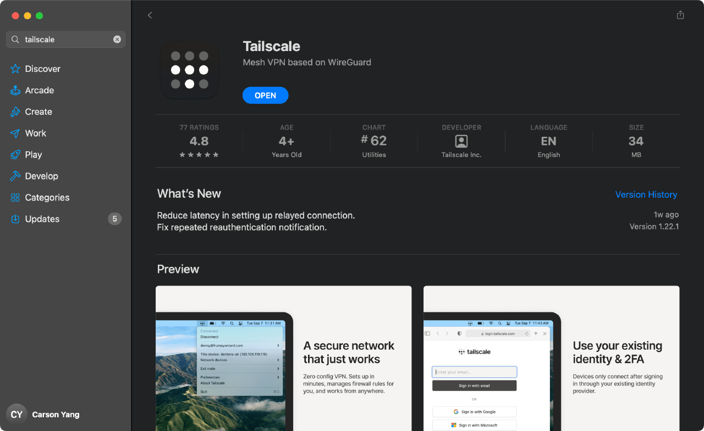

安装完成后还需要做一些骚操作，才能让 Tailscale 使用 Headscale 作为控制服务器。当然，Headscale 已经给我们提供了详细的操作步骤，你只需要在浏览器中打开 URL：`http://<HEADSCALE_PUB_IP>:8080/apple`，便会出现如下的界面：

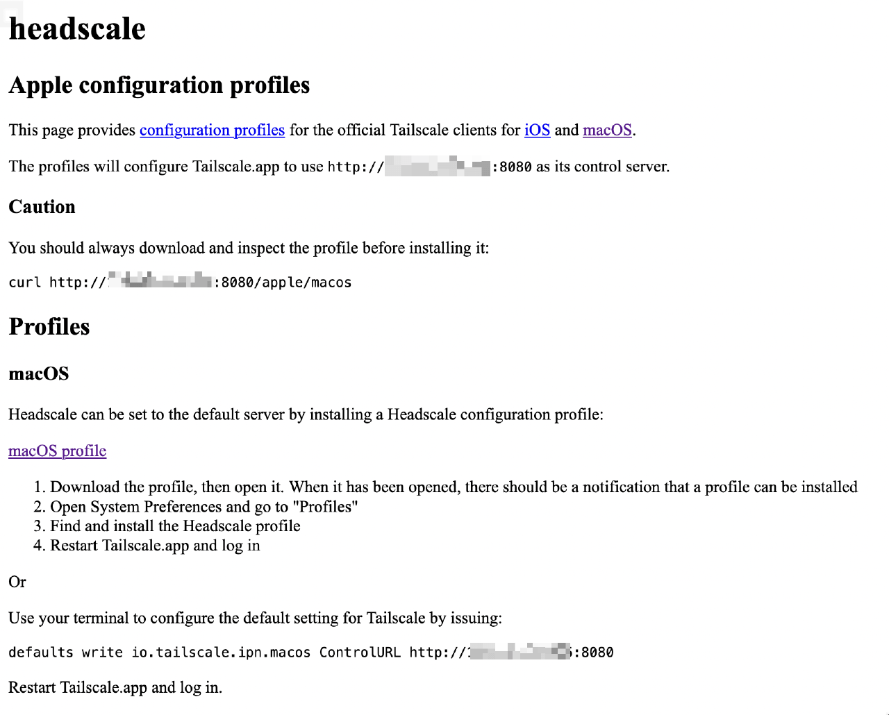

你只需要按照图中所述的步骤操作即可，本文就不再赘述了。

修改完成后重启 Tailscale 客户端，在 macOS 顶部状态栏中找到 Tailscale 并点击，然后再点击 Log in。

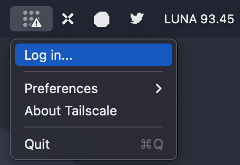

然后立马就会跳转到浏览器并打开一个页面。

[外链图片转存失败,源站可能有防盗链机制,建议将图片保存下来直接上传(img-njhEh83z-1674098293951)(null)]

接下来与之前 Linux 客户端相同，回到 Headscale 所在的机器执行浏览器中的命令即可，注册成功：

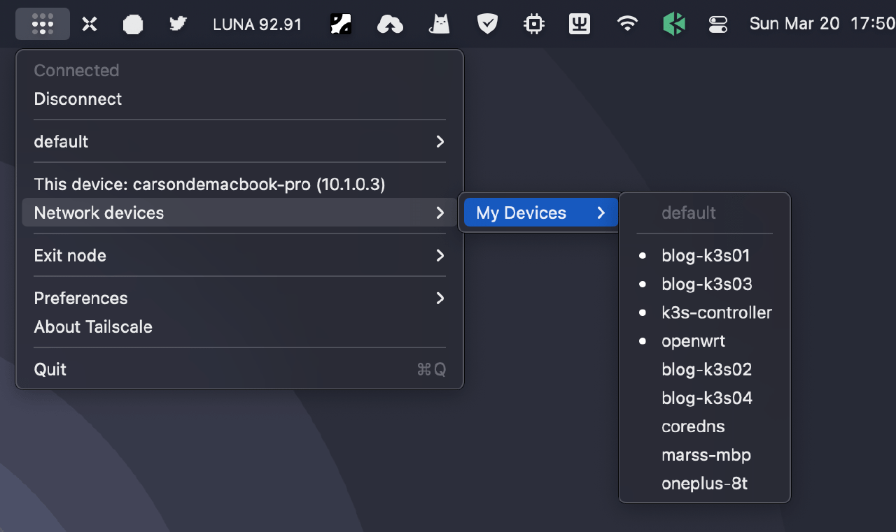

回到 Headscale 所在主机，查看注册的节点：

```shell
$ headscale nodes list

ID | Name                | NodeKey | Namespace | IP addresses | Ephemeral | Last seen           | Online | Expired
1  | coredns             | [Ew3RB] | default   | 10.1.0.1     | false     | 2022-03-20 09:08:58 | online | no
2  | carsondemacbook-pro | [k7bzX] | default   | 10.1.0.2     | false     | 2022-03-20 09:48:30 | online | no
```

回到 macOS，测试是否能 ping 通对端节点：

```shell
$ ping -c 2 10.1.0.1
PING 10.1.0.1 (10.1.0.1): 56 data bytes
64 bytes from 10.1.0.1: icmp_seq=0 ttl=64 time=37.025 ms
64 bytes from 10.1.0.1: icmp_seq=1 ttl=64 time=38.181 ms

--- 10.1.0.1 ping statistics ---
2 packets transmitted, 2 packets received, 0.0% packet loss
round-trip min/avg/max/stddev = 37.025/37.603/38.181/0.578 ms
```

也可以使用 Tailscale CLI 来测试：

```shell
$ /Applications/Tailscale.app/Contents/MacOS/Tailscale ping 10.1.0.1
pong from coredns (10.1.0.1) via xxxx:41641 in 36ms
```

如果你没有美区 ID，无法安装 App，可以直接使用命令行版本，通过 Homebrew 安装即可：

```shell
$ brew install tailscale
```

### Android
Android 客户端就比较麻烦了，需要自己修改源代码编译 App，具体可参考[这个 issue](https://github.com/juanfont/headscale/issues/58%23issuecomment-950386833)。编译过程还是比较麻烦的，需要先修改源码，然后构建一个包含编译环境的 Docker 镜像，最后在通过该镜像启动容器编译 apk。

我知道很多人一看麻烦就不想搞了，这个问题不大，我送佛送到西，提供了一条龙服务，你只需 fork 我的 GitHub 仓库 [tailscale-android](https://github.com/yangchuansheng/tailscale-android)：

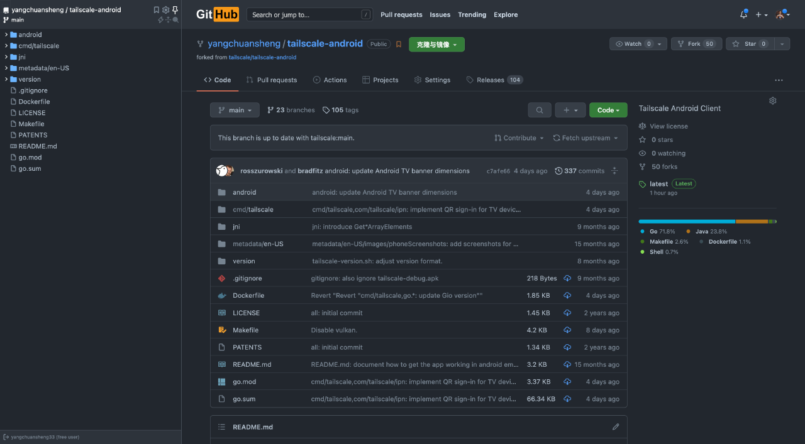

然后在你的仓库中点击 Settings 标签，找到 Secrets 下拉框中的 Actions 选项：

[外链图片转存失败,源站可能有防盗链机制,建议将图片保存下来直接上传(img-zsC7leJz-1674098293831)(null)]

选择 New repository secret 添加一个 secret 叫 HEADSCALE_URL，将你的 Headscale 服务公网地址填入其中：

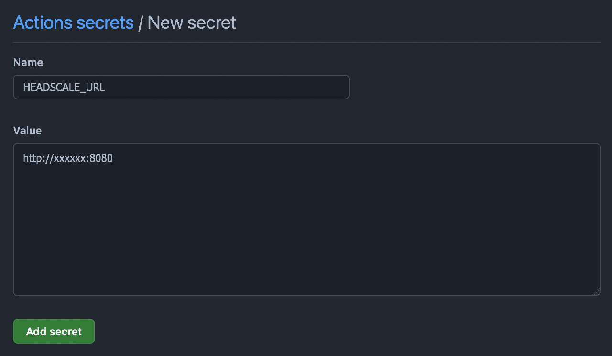

添加在这里的配置，将只对你可见，不用担心会泄露给他人。

然后点击 Actions 标签，选择 Release Workflow。

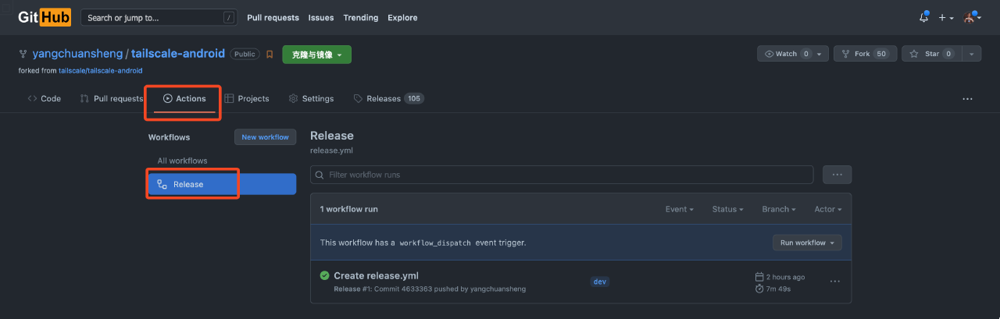

你会看到一个 Run workflow 按钮，点击它，然后在下拉框中点击 Run workflow。

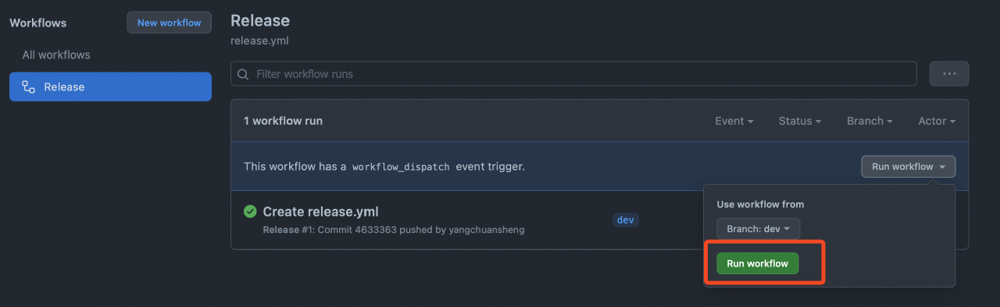

流水线就会开始执行，执行成功后就会在 Release 页面看到编译好的 apk。

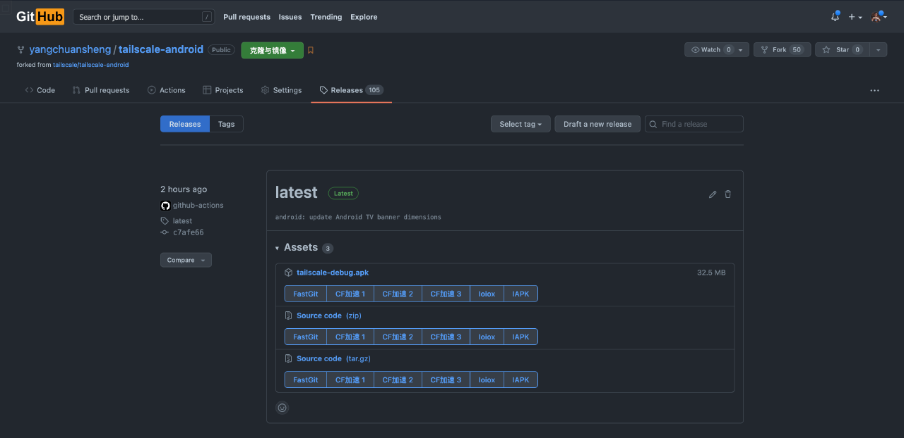

接下来的事情就简单了，下载这个 apk 到你的 Android 手机上安装就好了。安装完成后打开 Tailscale App，选择 Sign in with other。

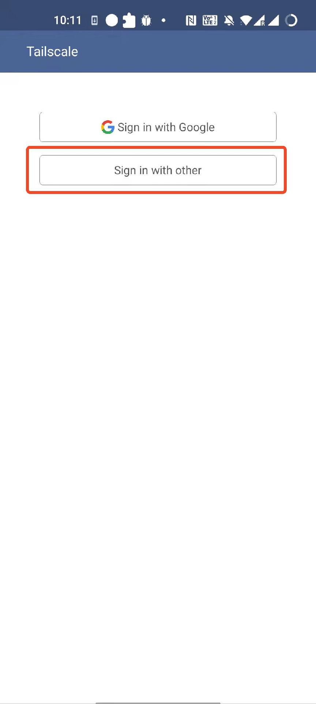

然后就会跳出这个页面：


将其中的命令粘贴到 Headscale 所在主机的终端，将 NAMESPACE 替换为之前创建的 namespace，然后执行命令即可。注册成功后可将该页面关闭，回到 App 主页，效果如图：

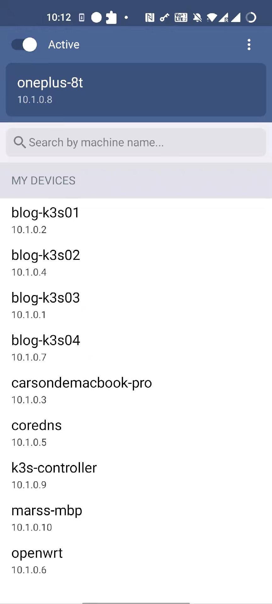

回到之前的 GitHub 仓库，刚才我们是通过手动触发 Workflow 来编译 apk 的，有没有办法自动编译呢？只要 Tailscale 官方仓库有更新，就立即触发 Workflow 开始编译。

那当然是可以实现的，而且我已经实现了，仔细看 GitHub Actions 的编排文件：

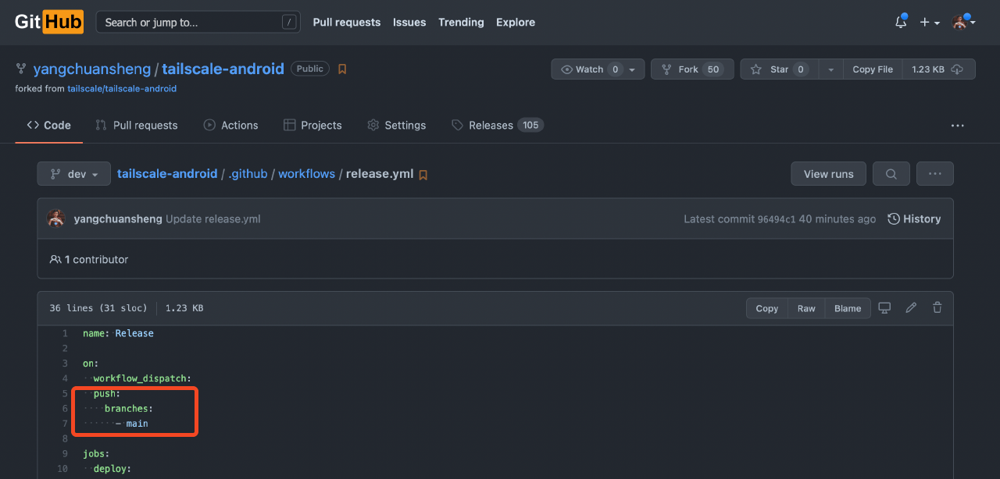

红框圈出来的部分表示只要仓库的 main 分支有更新，便会触发 Workflow。现在的问题是如何让 main 分支和上游官方仓库一致，一直保持在最新状态。

这个问题使用第三方 Github App 就可以解决，这个 App 名字简单粗暴，就叫 Pull，它的作用非也很简单粗暴：保持你的 Fork 在最新状态。

Pull 的使用方法很简单：

1. 打开 [Pull App](https://github.com/apps/pull) 页面
2. 点击右上角绿色的 install 按钮

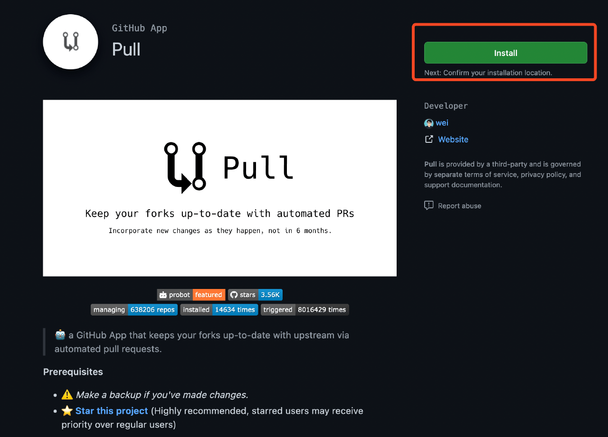

在选项页面，使用默认的 All repositories 即可（你也可以选择指定的仓库，比如 tailscale-android），然后点击绿色的 install 按钮：

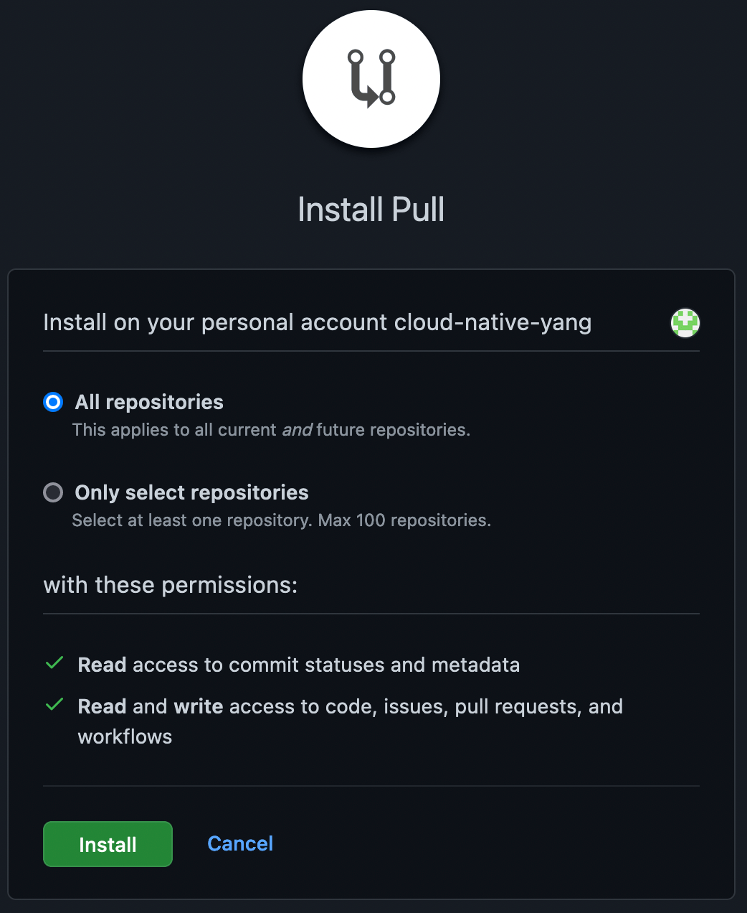

简单三步，Pull App 就安装好了。接下来 Pull App 会每天定时帮你更新代码库，使你 fork 的代码始终是最新版的。

### Windows
Windows Tailscale 客户端想要使用 Headscale 作为控制服务器，只需在浏览器中打开 URL：`http://<HEADSCALE_PUB_IP>:8080/windows`，便会出现如下的界面：

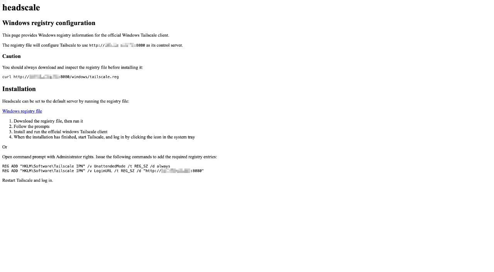

按照其中的步骤操作即可。

### 其他 Linux 发行版
除了常规的 Linux 发行版之外，还有一些特殊场景的 Linux 发行版，比如 OpenWrt、威联通（QNAP）、群晖等，这些发行版的安装方法已经有人写好了，这里就不详细描述了，我只给出相关的 GitHub 仓库，大家如果自己有需求，直接去看相关仓库的文档即可。

- OpenWrt：https://github.com/adyanth/openwrt-tailscale-enabler
- 群晖：https://github.com/tailscale/tailscale-synology
- 威联通：https://github.com/ivokub/tailscale-qpkg

### iOS
Tailscale iOS 客户端源代码没有开源，目前还无法破解使其使用第三方控制服务器，遗憾~~

## 打通局域网
到目前为止我们只是打造了一个点对点的 Mesh 网络，各个节点之间都可以通过 WireGuard 的私有网络 IP 进行直连。但我们可以更大胆一点，还记得我在文章开头提到的访问家庭内网的资源吗？我们可以通过适当的配置让每个节点都能访问其他节点的局域网 IP。这个使用场景就比较多了，你可以直接访问家庭内网的 NAS，或者内网的任何一个服务，**更高级的玩家可以使用这个方法来访问云上 Kubernetes 集群的 Pod IP 和 Service IP**。

假设你的家庭内网有一台 Linux 主机（比如 OpenWrt）安装了 Tailscale 客户端，我们希望其他 Tailscale 客户端可以直接通过家中的局域网 IP（例如 `192.168.100.0/24`） 访问家庭内网的任何一台设备。

配置方法很简单，首先需要设置 IPv4 与 IPv6 路由转发：

```shell
$ echo 'net.ipv4.ip_forward = 1' | tee /etc/sysctl.d/ipforwarding.conf
$ echo 'net.ipv6.conf.all.forwarding = 1' | tee -a /etc/sysctl.d/ipforwarding.conf
$ sysctl -p /etc/sysctl.d/ipforwarding.conf
```

客户端修改注册节点的命令，在原来命令的基础上加上参数 `--advertise-routes=192.168.100.0/24`。

```shell
$ tailscale up --login-server=http://<HEADSCALE_PUB_IP>:8080 --accept-routes=true --accept-dns=false --advertise-routes=192.168.100.0/24
```

在 Headscale 端查看路由，可以看到相关路由是关闭的。

```shell
$ headscale nodes list|grep openwrt

6 | openwrt | [7LdVc] | default | 10.1.0.6 | false | 2022-03-20 15:50:46 | online | no

$ headscale routes list -i 6

Route            | Enabled
192.168.100.0/24 | false
```

开启路由：

```shell
$ headscale routes enable -i 6 -r "192.168.100.0/24"

Route            | Enabled
192.168.100.0/24 | true
```

其他节点查看路由结果：
```shell
$ ip route show table 52|grep "192.168.100.0/24"

192.168.100.0/24 dev tailscale0
```

现在你在任何一个 Tailscale 客户端所在的节点都可以 ping 通家庭内网的机器了，你在公司或者星巴克也可以像在家里一样用同样的 IP 随意访问家中的任何一个设备，就问你香不香？

## 总结
目前从稳定性来看，Tailscale 比 Netmaker 略胜一筹，基本上不会像 Netmaker 一样时不时出现 ping 不通的情况，这取决于 Tailscale 在用户态对 NAT 穿透所做的种种优化，他们还专门写了一篇文章介绍 [NAT 穿透的原理](https://tailscale.com/blog/how-nat-traversal-works/)，[中文版](https://arthurchiao.art/blog/how-nat-traversal-works-zh/)翻译自国内的 eBPF 大佬赵亚楠，墙裂推荐大家阅读。放一张图给大家感受一下：

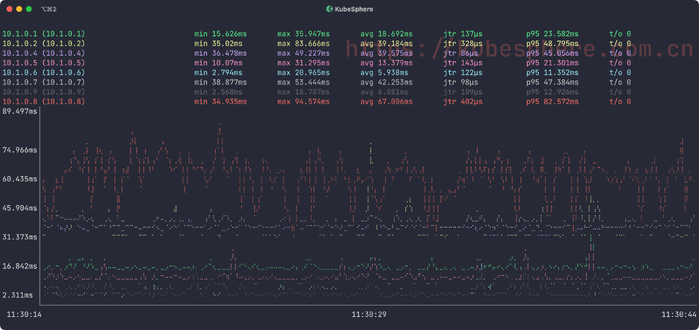

本文给大家介绍了 Tailscale 和 Headscale，包括 Headscale 的安装部署和各个平台客户端的接入，以及如何打通各个节点所在的局域网。下篇文章将会给大家介绍如何让 Tailscale 使用自定义的 DERP Servers（也就是中继服务器），See you~~

上面我们介绍了如何使用 Headscale 替代 Tailscale 官方的控制服务器，并接入各个平台的客户端。本文将会介绍如何让 Tailscale 使用自定义的 DERP Servers。可能很多人都不知道 DERP 是个啥玩意儿，没关系，我先从中继服务器开始讲起。

## STUN 是什么
Tailscale 的终极目标是让两台处于网络上的任何位置的机器建立点对点连接（直连），但现实世界是复杂的，大部份情况下机器都位于 NAT 和防火墙后面，这时候就需要通过打洞来实现直连，也就是 NAT 穿透。

NAT 按照 NAT 映射行为和有状态防火墙行为可以分为多种类型，但对于 NAT 穿透来说根本不需要关心这么多类型，只需要看 NAT 或者有状态防火墙是否会严格检查目标 Endpoint，根据这个因素，可以将 NAT 分为 Easy NAT 和 Hard NAT。

- **Easy NAT** 及其变种称为 “Endpoint-Independent Mapping” (EIM，终点无关的映射)
这里的 Endpoint 指的是目标 Endpoint，也就是说，有状态防火墙只要看到有客户端自己发起的出向包，就会允许相应的入向包进入，不管这个入向包是谁发进来的都可以。

- **hard NAT** 以及变种称为 “Endpoint-Dependent Mapping”（EDM，终点相关的映射）
这种 NAT 会针对每个目标 Endpoint 来生成一条相应的映射关系。 在这样的设备上，如果客户端向某个目标 Endpoint 发起了出向包，假设客户端的公网 IP 是 `2.2.2.2`，那么有状态防火墙就会打开一个端口，假设是 `4242`。那么只有来自该目标 Endpoint 的入向包才允许通过 `2.2.2.2:4242`，其他客户端一律不允许。这种 NAT 更加严格，所以叫 Hard NAT。

对于 Easy NAT，我们只需要提供一个第三方的服务，它能够告诉客户端“它看到的客户端的公网 ip:port 是什么”，然后将这个信息以某种方式告诉通信对端（peer），后者就知道该和哪个地址建连了！这种服务就叫 STUN (`Session Traversal Utilities for NAT`，NAT会话穿越应用程序)。它的工作流程如下图所示：

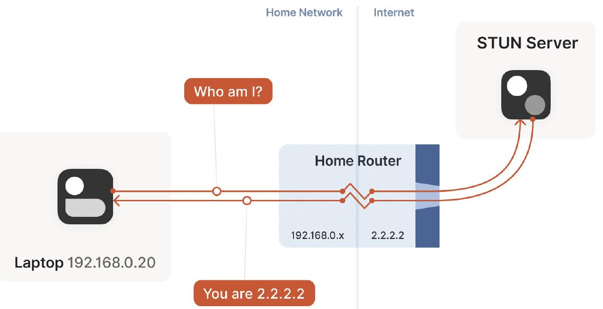

- 笔记本向 STUN 服务器发送一个请求：“从你的角度看，我的地址什么？”
- STUN 服务器返回一个响应：“我看到你的 UDP 包是从这个地址来的：ip:port”。

## 中继是什么
对于 Hard NAT 来说，STUN 就不好使了，即使 STUN 拿到了客户端的公网 ip:port 告诉通信对端也于事无补，因为防火墙是和 STUN 通信才打开的缺口，这个缺口只允许 STUN 的入向包进入，其他通信对端知道了这个缺口也进不来。通常企业级 NAT 都属于 Hard NAT。

这种情况下打洞是不可能了，但也不能就此放弃，可以选择一种折衷的方式：创建一个中继服务器（relay server），客户端与中继服务器进行通信，中继服务器再将包中继（relay）给通信对端。

至于中继的性能，那要看具体情况了：

- 如果能直连，那显然没必要用中继方式；
- 但如果无法直连，而中继路径又非常接近双方直连的真实路径，并且带宽足够大，那中继方式并不会明显降低通信质量。延迟肯定会增加一点，带宽会占用一些，但相比完全连接不上，还是可以接受的。

事实上对于大部分网络而言，Tailscale 都可以通过各种黑科技打洞成功，只有极少数情况下才会选择中继，中继只是一种 fallback 机制。

## 中继协议简介
中继协议有多种实现方式。

### TURN
TURN 即 `Traversal Using Relays around NAT`，这是一种经典的中继实现方式，核心理念是：

- 用户（人）先去公网上的 TURN 服务器认证，成功后后者会告诉你：“我已经为你分配了 ip:port，接下来将为你中继流量”，
- 然后将这个 ip:port 地址告诉对方，让它去连接这个地址，接下去就是非常简单的客户端/服务器通信模型了。

与 STUN 不同，这种协议没有真正的交互性，不是很好用，因此 Tailscale 并没有采用 TURN 作为中继协议。

### DERP
DERP 即 `Detoured Encrypted Routing Protocol`，这是 Tailscale 自研的一个协议：

- 它是一个**通用目的包中继协议，运行在 HTTP 之上**，而大部分网络都是允许 HTTP 通信的。
- 它根据目的公钥（destination’s public key）来中继加密的流量（encrypted payloads）。

[外链图片转存失败,源站可能有防盗链机制,建议将图片保存下来直接上传(img-MRFOL84K-1674098294997)(null)]

Tailscale 使用的算法很有趣，所有客户端之间的连接都是先选择 DERP 模式（中继模式），这意味着连接立即就能建立（优先级最低但 100% 能成功的模式），用户不用任何等待。然后开始并行地进行路径发现，通常几秒钟之后，我们就能发现一条更优路径，然后将现有连接透明升级（upgrade）过去，变成点对点连接（直连）。

因此，DERP 既是 Tailscale 在 NAT 穿透失败时的保底通信方式（此时的角色与 TURN 类似），也是在其他一些场景下帮助我们完成 NAT 穿透的旁路信道。 换句话说，它既是我们的保底方式，也是有更好的穿透链路时，帮助我们进行连接升级（upgrade to a peer-to-peer connection）的基础设施。

## 自建私有 DERP Server
Tailscale 的私钥只会保存在当前节点，因此 DERP server 无法解密流量，它只能和互联网上的其他路由器一样，呆呆地将加密的流量从一个节点转发到另一个节点，只不过 DERP 使用了一个稍微高级一点的协议来防止滥用。

Tailscale 开源了 DERP 服务器的代码，如果你感兴趣，可以阅读 [DERP 的源代码](https://github.com/tailscale/tailscale/tree/main/derp)。

Tailscale 官方内置了很多 DERP 服务器，分步在全球各地，**惟独不包含中国大陆**，原因你懂得。这就导致了一旦流量通过 DERP 服务器进行中继，延时就会非常高。而且官方提供的 DERP 服务器是万人骑，存在安全隐患。

为了实现低延迟、高安全性，我们可以参考 [Tailscale 官方文档](https://tailscale.com/kb/1118/custom-derp-servers/)自建私有的 DERP 服务器。有两种部署模式，一种是基于域名，另外一种不需要域名，可以直接使用 IP，不过需要一点黑科技。我们先来看最简单的使用域名的方案。

### 使用域名
这种方案需要满足以下几个条件：

- 要有自己的域名，并且申请了 SSL 证书
- 需要准备一台或多台云主机
- 如果服务器在国内，域名需要备案
- 如果服务器在国外，则不需要备案

如果以上条件都俱备，就可以按照下面的步骤开始部署了。

推荐直接使用 Docker 来部署，我已经构建好了 Docker 镜像，直接部署就可以了：

```shell
🐳  → docker run --restart always \
  --name derper -p 12345:12345 -p 3478:3478/udp \
  -v /root/.acme.sh/xxxx/:/app/certs \
  -e DERP_CERT_MODE=manual \
  -e DERP_ADDR=:12345 \
  -e DERP_DOMAIN=xxxx \
  -d ghcr.io/yangchuansheng/derper:latest
```

有几点需要注意：

- 能用 443 端口尽量用 443 端口，实在不行再用别的端口；
- 默认情况下也会开启 STUN 服务，UDP 端口是 3478；
- 防火墙需要放行端口 12345 和 3478；
- 准备好 SSL 证书；
- 域名部分我打了码，请换成你自己的域名。

关于证书部分需要重点说明：**假设你的域名是 xxx.com，那么证书的名称必须是 xxx.com.crt，一个字符都不能错！同理，私钥名称必须是 xxx.com.key，一个字符都不能错！**

查看容器日志：

```shell
🐳  → docker logs -f derper
2022/03/26 11:36:28 no config path specified; using /var/lib/derper/derper.key
2022/03/26 11:36:28 derper: serving on :12345 with TLS
2022/03/26 11:36:28 running STUN server on [::]:3478
```

目前 derper 运行一段时间就会崩溃，暂时还没有更好的解决方案，只能通过定时重启来解决，比如通过 crontab 来设置每两小时重启一次容器：

```shell
0 */2 * * * docker restart derper &> /dev/null
```

具体可参考这个 issue：[Derper TLS handshake error: remote error: tls: internal error](https://github.com/tailscale/tailscale/issues/4082)

部署好 derper 之后，就可以修改 Headscale 的配置来使用自定义的 DERP 服务器了。Headscale 可以通过两种形式的配置来使用自定义 DERP：

- 一种是在线 URL，格式是 JSON，与 Tailscale 官方控制服务器使用的格式和语法相同。
- 另一种是本地文件，格式是 YAML。

我们可以直接使用本地的 YAML 配置文件，内容如下：

```yaml
# /etc/headscale/derp.yaml
regions:
  900:
    regionid: 900
    regioncode: thk 
    regionname: Tencent Hongkong 
    nodes:
      - name: 900a
        regionid: 900
        hostname: xxxx
        ipv4: xxxx
        stunport: 3478
        stunonly: false
        derpport: 12345
      - name: 900b
        regionid: 900
        hostname: xxxx
        ipv4: xxxx
        stunport: 3478
        stunonly: false
        derpport: 12345
  901:
    regionid: 901
    regioncode: hs 
    regionname: Huawei Shanghai 
    nodes:
      - name: 901a
        regionid: 901
        hostname: xxxx
        ipv4: xxxx
        stunport: 3478
        stunonly: false
        derpport: 12345
```

配置说明：

- regions 是 YAML 中的对象，下面的每一个对象表示一个可用区，每个可用区里面可设置多个 DERP 节点，即 nodes。
- 每个可用区的 regionid 不能重复。
- 每个 node 的 name 不能重复。
- regionname 一般用来描述可用区，regioncode 一般设置成可用区的缩写。
- ipv4 字段不是必须的，如果你的域名可以通过公网解析到你的 DERP 服务器地址，这里可以不填。如果你使用了一个二级域名，而这个域名你并没有在公共 - DNS server 中添加相关的解析记录，那么这里就需要指定 IP（前提是你的证书包含了这个二级域名，这个很好支持，搞个泛域名证书就行了）。
- stunonly: false 表示除了使用 STUN 服务，还可以使用 DERP 服务。
- 上面的配置中域名和 IP 部分我都打码了，你需要根据你的实际情况填写。

接下来还需要修改 Headscale 的配置文件，引用上面的自定义 DERP 配置文件。需要修改的配置项如下：

```yaml
# /etc/headscale/config.yaml
derp:
  # List of externally available DERP maps encoded in JSON
  urls:
  #  - https://controlplane.tailscale.com/derpmap/default

  # Locally available DERP map files encoded in YAML
  #
  # This option is mostly interesting for people hosting
  # their own DERP servers:
  # https://tailscale.com/kb/1118/custom-derp-servers/
  #
  # paths:
  #   - /etc/headscale/derp-example.yaml
  paths:
    - /etc/headscale/derp.yaml

  # If enabled, a worker will be set up to periodically
  # refresh the given sources and update the derpmap
  # will be set up.
  auto_update_enabled: true

  # How often should we check for DERP updates?
  update_frequency: 24h
```

可以把 Tailscale 官方的 DERP 服务器禁用，来测试自建的 DERP 服务器是否能正常工作。

修改完配置后，重启 headscale 服务：

```shell
$ systemctl restart headscale
```

在 Tailscale 客户端上使用以下命令查看目前可以使用的 DERP 服务器：

```shell
$ tailscale netcheck

Report:
        * UDP: true
        * IPv4: yes, xxxxx:57068
        * IPv6: no
        * MappingVariesByDestIP: false
        * HairPinning: false
        * PortMapping: 
        * Nearest DERP: Tencent Hongkong
        * DERP latency:
                - thk: 39.7ms (Tencent Hongkong)
```

tailscale netcheck 实际上只检测 3478/udp 的端口， 就算 netcheck 显示能连，也不一定代表 12345 端口可以转发流量。最简单的办法是直接打开 DERP 服务器的 URL：`https://xxxx:12345`，如果看到如下页面，且地址栏的 SSL 证书标签显示正常可用，那才是真没问题了。

[外链图片转存失败,源站可能有防盗链机制,建议将图片保存下来直接上传(img-OjTtRXSl-1674098293696)(null)]

查看与通信对端的连接方式：

```shell
$ tailscale status
10.1.0.5        coredns              default      linux   -
                carsondemacbook-pro  default      macOS   active; direct xxxx:2756; offline, tx 50424 rx 34056
                oneplus-8t           default      android active; relay "thk"; offline, tx 1608 rx 1552
                openwrt              default      linux   active; direct xxxx:2834; offline, tx 1403688 rx 1217620
```

这个客户端是一台云主机，有 3 个通信对端，分别是 macOS、OpenWRT 与 Android 手机，macOS 和 OpenWRT 都处于电信家庭内网中，Android 手机使用的是电信流量。可以看到只有 Android 手机是通过自定义的 DERP 服务器来中继流量的，打洞成功率相当高。使用 ping 来测试连通性：

```shell
$ ping 10.1.0.8
PING 10.1.0.8 (10.1.0.8) 56(84) bytes of data.
64 bytes from 10.1.0.8: icmp_seq=1 ttl=64 time=150 ms
64 bytes from 10.1.0.8: icmp_seq=2 ttl=64 time=131 ms
64 bytes from 10.1.0.8: icmp_seq=3 ttl=64 time=161 ms
64 bytes from 10.1.0.8: icmp_seq=4 ttl=64 time=137 ms
64 bytes from 10.1.0.8: icmp_seq=5 ttl=64 time=156 ms
64 bytes from 10.1.0.8: icmp_seq=6 ttl=64 time=169 ms
^C
--- 10.1.0.8 ping statistics ---
6 packets transmitted, 6 received, 0% packet loss, time 5005ms
rtt min/avg/max/mdev = 131.728/151.154/169.627/13.193 ms
```

也可以使用 Tailscale 命令行工具来测试：

```shell
$ tailscale ping 10.1.0.8
pong from oneplus-8t (10.1.0.8) via DERP(thk) in 104ms
pong from oneplus-8t (10.1.0.8) via DERP(thk) in 111ms
pong from oneplus-8t (10.1.0.8) via DERP(thk) in 105ms
```

这个更加友好一点，会直接告诉你是通过 DERP 中继服务器来和对方通信的。

如果当前 Tailscale 客户端所在主机开启了 IPv6，那么与手机便可以直接通过 IPv6 点对点连接：

```shell
$ /Applications/Tailscale.app/Contents/MacOS/Tailscale status
                coredns              default      linux   active; direct xxxx:45986; offline, tx 124352 rx 185736
                oneplus-8t           default      android active; direct [240e:472:da0:24a2:a07f:2a67:2a1e:4475]:37237; offline, tx 125216 rx 20052
                openwrt              default      linux   active; direct [240e:390:caf:1870:c02c:e8ff:feb9:b0b]:41641; offline, tx 181992 rx 3910120

$ /Applications/Tailscale.app/Contents/MacOS/Tailscale ping 10.1.0.8
pong from oneplus-8t (10.1.0.8) via [240e:472:da0:24a2:a07f:2a67:2a1e:4475]:37237 in 62ms
```

所以如果你开启了 IPv6，可以大大增加点对点连接的成功率。

### 使用纯 IP
我知道，大部分人是没有自己的域名的。再退一步，就算有自己的域名，如果没有备案，也是没办法部署在国内服务器上使用的。

这个时候我们就只能从 derper 源码上动手脚了，找到 tailscale 仓库中的 cmd/derper/cert.go 文件，将与域名验证相关的内容删除或注释：

```cpp
func (m *manualCertManager) getCertificate(hi *tls.ClientHelloInfo) (*tls.Certificate, error) {
	//if hi.ServerName != m.hostname {
	//	return nil, fmt.Errorf("cert mismatch with hostname: %q", hi.ServerName)
	//}
	return m.cert, nil
}
```

还需要创建自签名证书，可以通过脚本来创建：

```shell
# build_cert.sh

#!/bin/bash

CERT_HOST=$1
CERT_DIR=$2
CONF_FILE=$3

echo "[req]
default_bits  = 2048
distinguished_name = req_distinguished_name
req_extensions = req_ext
x509_extensions = v3_req
prompt = no

[req_distinguished_name]
countryName = XX
stateOrProvinceName = N/A
localityName = N/A
organizationName = Self-signed certificate
commonName = $CERT_HOST: Self-signed certificate

[req_ext]
subjectAltName = @alt_names

[v3_req]
subjectAltName = @alt_names

[alt_names]
IP.1 = $CERT_HOST
" > "$CONF_FILE"

mkdir -p "$CERT_DIR"
openssl req -x509 -nodes -days 730 -newkey rsa:2048 -keyout "$CERT_DIR/$CERT_HOST.key" -out "$CERT_DIR/$CERT_HOST.crt" -config "$CONF_FILE"
```

重新编写 Dockerfile，将 derper 的域名设置为 127.0.0.1：

```shell
FROM golang:latest AS builder

WORKDIR /app

# ========= CONFIG =========
# - download links
ENV MODIFIED_DERPER_GIT=https://github.com/yangchuansheng/ip_derper.git
ENV BRANCH=ip_derper
# ==========================

# build modified derper
RUN git clone -b $BRANCH $MODIFIED_DERPER_GIT tailscale --depth 1 && \
    cd /app/tailscale/cmd/derper && \
    /usr/local/go/bin/go build -ldflags "-s -w" -o /app/derper && \
    cd /app && \
    rm -rf /app/tailscale

FROM ubuntu:20.04
WORKDIR /app

# ========= CONFIG =========
# - derper args
ENV DERP_HOST=127.0.0.1
ENV DERP_CERTS=/app/certs/
ENV DERP_STUN true
ENV DERP_VERIFY_CLIENTS false
# ==========================

# apt
RUN apt-get update && \
    apt-get install -y openssl curl

COPY build_cert.sh /app/
COPY --from=builder /app/derper /app/derper

# build self-signed certs && start derper
CMD bash /app/build_cert.sh $DERP_HOST $DERP_CERTS /app/san.conf && \
    /app/derper --hostname=$DERP_HOST \
    --certmode=manual \
    --certdir=$DERP_CERTS \
    --stun=$DERP_STUN  \
    --verify-clients=$DERP_VERIFY_CLIENTS
```

构建好镜像后，就可以在你想部署 derper 的主机上直接通过该镜像启动 derper 容器了，命令如下：
```shell
🐳  → docker run --restart always --net host --name derper -d ghcr.io/yangchuansheng/ip_derper
```

和使用域名的方案一样，防火墙需要放行相应端口（12345 与 3478）。

查看容器日志：

```shell
🐳  → docker logs -f derper
Generating a RSA private key
.......................................+++++
..............+++++
writing new private key to '/app/certs//127.0.0.1.key'
-----
2022/03/26 14:30:31 no config path specified; using /var/lib/derper/derper.key
2022/03/26 14:30:31 derper: serving on :443 with TLS
2022/03/26 14:30:31 running STUN server on [::]:3478
```

如果你想自己构建 derper 镜像，可以参考我的 [GitHub 仓库](https://github.com/yangchuansheng/ip_derper)。

下面就是骚操作了，我们在 Headscale 的配置中需要将 DERP 的域名设置为 IP！不理解的可以再消化一下，然后继续往下看哈哈~~

除了 derper 之外，Tailscale 客户端还需要跳过域名验证，这个需要在 DERP 的配置中设置。而 Headscale 的本地 YAML 文件目前还不支持这个配置项，所以没办法，咱只能使用在线 URL 了。JSON 配置内容如下：

```json
{
  "Regions": {
    "901": {
      "RegionID": 901,
      "RegionCode": "ali-sh",
      "RegionName": "Aliyun Shanghai",
      "Nodes": [
        {
          "Name": "901a",
          "RegionID": 901,
          "DERPPort": 443,
          "HostName": "xxxx",
          "IPv4": "xxxx",
          "InsecureForTests": true
        }
      ]
    }
  }
}
```

配置解析：

- HostName 直接填 derper 的公网 IP，即和 IPv4 的值相同。
- InsecureForTests 一定要设置为 true，以跳过域名验证。

你需要把这个 JSON 文件变成 Headscale 服务器可以访问的 URL，比如在 Headscale 主机上搭个 Nginx，或者上传到对象存储（比如阿里云 OSS）。

接下来还需要修改 Headscale 的配置文件，引用上面的自定义 DERP 的 URL。需要修改的配置项如下：

```yaml
# /etc/headscale/config.yaml
derp:
  # List of externally available DERP maps encoded in JSON
  urls:
  #  - https://controlplane.tailscale.com/derpmap/default
    - https://xxxxx/derp.json

  # Locally available DERP map files encoded in YAML
  #
  # This option is mostly interesting for people hosting
  # their own DERP servers:
  # https://tailscale.com/kb/1118/custom-derp-servers/
  #
  # paths:
  #   - /etc/headscale/derp-example.yaml
  paths:
    - /etc/headscale/derp.yaml

  # If enabled, a worker will be set up to periodically
  # refresh the given sources and update the derpmap
  # will be set up.
  auto_update_enabled: true

  # How often should we check for DERP updates?
  update_frequency: 24h
```

修改完配置后，重启 headscale 服务：

```shell
$ systemctl restart headscale
```

在 Tailscale 客户端上使用以下命令查看目前可以使用的 DERP 服务器：

```shell
$ tailscale netcheck

Report:
	* UDP: true
	* IPv4: yes, 192.168.100.1:49656
	* IPv6: no
	* MappingVariesByDestIP: true
	* HairPinning: false
	* PortMapping: UPnP
	* Nearest DERP: Home Hangzhou
	* DERP latency:
		- home: 9.7ms   (Home Hangzhou)
		-  hs: 25.2ms  (Huawei Shanghai)
		- thk: 43.5ms  (Tencent Hongkong)
```

再次查看与通信对端的连接方式：

```shell
$ tailscale status
                coredns              default      linux   active; direct xxxx:45986; offline, tx 131012 rx 196020
                oneplus-8t           default      android active; relay "home"; offline, tx 211900 rx 22780
                openwrt              default      linux   active; direct 192.168.100.254:41641; offline, tx 189868 rx 4074772
```

可以看到这一次 Tailscale 自动选择了一个线路最优的国内的 DERP 服务器作为中继，可以测试一下延迟：

```shell
$ tailscale ping 10.1.0.8
pong from oneplus-8t (10.1.0.8) via DERP(home) in 30ms
pong from oneplus-8t (10.1.0.8) via DERP(home) in 45ms
pong from oneplus-8t (10.1.0.8) via DERP(home) in 30ms
```

完美！这里的 home 当然是我的家庭宽带，部署方式与上面所说的国内云主机类似，你需要额外开启公网的端口映射（12345/tcp, 3478/udp）。还有一点需要注意的是配置内容：

```json
{
  "Regions": {
    "901": {
      "RegionID": 901,
      "RegionCode": "ali-sh",
      "RegionName": "Aliyun Shanghai",
      "Nodes": [
        {
          "Name": "901a",
          "RegionID": 901,
          "DERPPort": 443,
          "HostName": "xxxx",
          "IPv4": "xxxx",
          "InsecureForTests": true
        }
      ]
    },
    "902": {
      "RegionID": 902,
      "RegionCode": "home",
      "RegionName": "Home Hangzhou",
      "Nodes": [
        {
          "Name": "902a",
          "RegionID": 902,
          "DERPPort": 12345,
          "HostName": "xxxx",
          "InsecureForTests": true
        }
      ]
    }
  }
}
```

与国内云主机相比，家庭宽带的配置有两点不同：

- 需要删除 IPv4 配置项。因为家用宽带的公网 IP 是动态变化的，所以你需要使用 DDNS 来动态解析公网 IP。
- HostName 最好填域名，因为你的公网 IP 是动态变化的，没法填写 IP，除非你不停地修改配置文件。填域名也没关系啦，反正不会验证域名的，也不用关心证书的事情，只要域名能解析到你的公网 IP 即可。

## 防止 DERP 被白嫖
默认情况下 DERP 服务器是可以被白嫖的，只要别人知道了你的 DERP 服务器的地址和端口，就可以为他所用。如果你的服务器是个小水管，用的人多了可能会把你撑爆，因此我们需要修改配置来防止被白嫖。

> 特别声明：只有使用域名的方式才可以通过认证防止被白嫖，使用纯 IP 的方式无法防白嫖，你只能小心翼翼地隐藏好你的 IP 和端口，不能让别人知道。

只需要做两件事情：

1. 在 DERP 服务器上安装 Tailscale。

第一步需要在 DERP 服务所在的主机上安装 Tailscale 客户端，启动 tailscaled 进程。

2. derper 启动时加上参数 --verify-clients。

本文推荐的是通过容器启动，[Dockerfile 内容](https://github.com/yangchuansheng/docker-image/blob/master/derper/Dockerfile)如下：

```shell
FROM golang:latest AS builder

LABEL org.opencontainers.image.source https://github.com/yangchuansheng/docker-image

WORKDIR /app

# https://tailscale.com/kb/1118/custom-derp-servers/
RUN go install tailscale.com/cmd/derper@main

FROM ubuntu
WORKDIR /app

ARG DEBIAN_FRONTEND=noninteractive

RUN apt-get update && \
    apt-get install -y --no-install-recommends apt-utils && \
    apt-get install -y ca-certificates && \
    mkdir /app/certs

ENV DERP_DOMAIN your-hostname.com
ENV DERP_CERT_MODE letsencrypt
ENV DERP_CERT_DIR /app/certs
ENV DERP_ADDR :443
ENV DERP_STUN true
ENV DERP_HTTP_PORT 80
ENV DERP_VERIFY_CLIENTS false

COPY --from=builder /go/bin/derper .

CMD /app/derper --hostname=$DERP_DOMAIN \
    --certmode=$DERP_CERT_MODE \
    --certdir=$DERP_CERT_DIR \
    --a=$DERP_ADDR \
    --stun=$DERP_STUN  \
    --http-port=$DERP_HTTP_PORT \
    --verify-clients=$DERP_VERIFY_CLIENTS
```

默认情况下 `--verify-clients` 参数设置的是 false。我们不需要对 Dockerfile 内容做任何改动，只需在容器启动时加上环境变量即可，将之前的启动命令修改一下：

```shell
🐳  → docker run --restart always \
  --name derper -p 12345:12345 -p 3478:3478/udp \
  -v /root/.acme.sh/xxxx/:/app/certs \
  -e DERP_CERT_MODE=manual \
  -e DERP_ADDR=:12345 \
  -e DERP_DOMAIN=xxxx \
  -e DERP_VERIFY_CLIENTS=true \
  -d ghcr.io/yangchuansheng/derper:latest
```

这样就大功告成了，别人即使知道了你的 DERP 服务器地址也无法使用，但还是要说明一点，即便如此，你也应该尽量不让别人知道你的服务器地址，防止别人有可趁之机。

## 总结
本文给大家介绍了 STUN 对于辅助 NAT 穿透的意义，科普了几种常见的中继协议，包含 Tailscale 自研的 DERP 协议。最后手把手教大家如何自建私有的 DERP 服务器，并让 Tailscale 使用我们自建的 DERP 服务器。

## 参考
- [Tailscale-搭建异地局域网开源版中文部署指南](https://blog.csdn.net/github_36665118/article/details/128733646)
- [Tailscale部署教程:不需要公网IP也能异地使用Docker，访问NAS局域网设备](https://zhuanlan.zhihu.com/p/692182613)
- [tailscale安装教程](https://www.cnblogs.com/exmyth/p/17932486.html)
- [Caddy, Docker 简单的自建 Tailscale DERP](https://zhuanlan.zhihu.com/p/678914979)
- [开源版tailscale，headscale搭建](https://www.dongvps.com/2022-09-02/%e5%bc%80%e6%ba%90%e7%89%88tailscale%ef%bc%8cheadscale%e6%90%ad%e5%bb%ba/)
- [GitHub - fredliang44/derper-docker: tailscale‘s selfhosted derp-server docker image](https://github.com/fredliang44/derper-docker)
- [Custom DERP Servers](https://tailscale.com/kb/1118/custom-derp-servers)
- [How NAT traversal works](https://tailscale.com/blog/how-nat-traversal-works)
- [Tailscale 基础教程：部署私有 DERP 中继服务器](https://icloudnative.io/posts/custom-derp-servers)
- [浅探 Tailscale DERP 中转服务](https://kiprey.github.io/2023/11/tailscale-derp)

