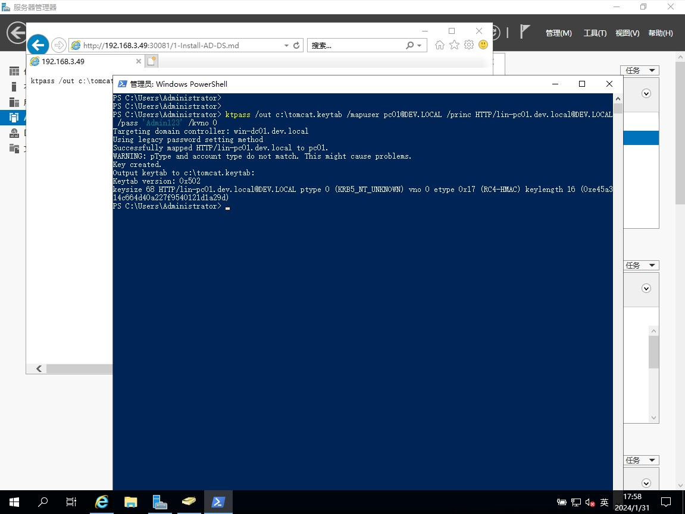

官方文档
- [Windows 集成身份验证](https://learn.microsoft.com/zh-cn/aspnet/web-api/overview/security/integrated-windows-authentication)
- [Windows Authentication](https://learn.microsoft.com/en-us/iis/configuration/system.webServer/security/authentication/windowsAuthentication/)
- [服务主体名称](https://learn.microsoft.com/zh-cn/windows/win32/ad/service-principal-names)
- [Windows Authentication How-To](https://tomcat.apache.org/tomcat-10.1-doc/windows-auth-howto.html)
- [Tomcat Windows 认证](https://www.w3cschool.cn/tomcat/6wds1ka3.html)
- [Tomcat Windows 认证](https://xy2401.com/local-docs/apache.zh/tomcat-9.0/windows-auth-howto.html)

Windows域认证流程
- https://blog.csdn.net/zj007ok/article/details/101434566

SPNEGO使用
- [使用Spnego为Tomcat集成Win-Auth](https://spnego.sourceforge.net/)
- [使用Spnego为Tomcat集成Win-Auth](https://spnego.sourceforge.net/pre_flight.html)
- [使用Spnego为oTomcat集成Win-Auth](https://spnego.sourceforge.net/spnego_tomcat.html)
- [Spnego讨论区](https://sourceforge.net/p/spnego/discussion/)

- [Win Auth Demo](https://github.com/michael-o/tomcatspnegoad)
- [Win Auth Demo Document](https://tomcatspnegoad.sourceforge.net)

客户端(浏览器)设置参考
- [weblogic-sso-kerberos](http://www.oracle.com/technetwork/articles/idm/weblogic-sso-kerberos-1619890.html)

## 一、Tomcat配置
- tomcat 版本为 9.0.85
- JDK 版本为 jdk 1.8

以下用`~`表示Tomcat安装目录: `D:\Develop\apache-tomcat-9.0.85`

#### 1. 添加 Spnego 依赖 `spnego.jar`
版本依赖关系
| Tomcat     | JDK      | spnego                 |
| ---------- | -------- | ---------------------- |
| Tomcat 8   | Java 8   | spnego-r9.jar          |
| Tomcat 9   | Java 11+ | spnego-r9.jar          |
| Tomcat 10+ | Java 11+ | spnego-jakarta-2.0.jar |

- [spnego-r9.jar](https://sourceforge.net/projects/spnego/files/spnego-r9.jar/download)
- [spnego-jakarta-2.0.jar](https://sourceforge.net/projects/spnego/files/spnego-jakarta-2.0.jar/download)

将下载的依赖包放入 `tomcat/lib/` 目录下，例如: `~\lib\spnego-r9.jar`

### 2. 修改 web.xml 文件

修改 `~\conf\web.xml`，添加以下内容
```xml
<!--==================== SPNEGO FILTER - Kerberos SSO ===================== --> 
<filter>
    <filter-name>SpnegoHttpFilter</filter-name>
    <filter-class>net.sourceforge.spnego.SpnegoHttpFilter</filter-class>

    <init-param>
        <param-name>spnego.allow.basic</param-name>
        <param-value>true</param-value>
    </init-param>

    <init-param>
        <param-name>spnego.allow.localhost</param-name>
        <param-value>true</param-value>
    </init-param>

    <init-param>
        <param-name>spnego.allow.unsecure.basic</param-name>
        <param-value>true</param-value>
    </init-param>

    <init-param>
        <param-name>spnego.login.client.module</param-name>
        <param-value>spnego-client</param-value>
    </init-param>

    <init-param>
        <param-name>spnego.krb5.conf</param-name>
        <param-value>krb5.conf</param-value>
    </init-param>

    <init-param>
        <param-name>spnego.login.conf</param-name>
        <param-value>login.conf</param-value>
    </init-param>

    <init-param>
        <!-- 此处配置 AD域账号，用于服务端的认证 -->
        <param-name>spnego.preauth.username</param-name>
        <param-value>pc01</param-value>
    </init-param>

    <init-param>
        <!-- 此处配置 AD域账号对应的密码，用于服务端的认证 -->
        <param-name>spnego.preauth.password</param-name>
        <param-value>Admin123</param-value>
    </init-param>

    <init-param>
        <param-name>spnego.login.server.module</param-name>
        <param-value>spnego-server</param-value>
    </init-param>

    <init-param>
        <param-name>spnego.prompt.ntlm</param-name>
        <param-value>true</param-value>
    </init-param>

    <init-param>
        <param-name>spnego.logger.level</param-name>
        <param-value>1</param-value>
    </init-param>
</filter>

<filter-mapping>
    <filter-name>SpnegoHttpFilter</filter-name>
    <url-pattern>*.jsp</url-pattern>
</filter-mapping>
```

### 3. 创建`krb5.conf`和`login.conf`
- https://spnego.sourceforge.net/krb5.conf

添加`~/krb5.conf`
```conf
[libdefaults]
default_realm = DEV.LOCAL
# 如果未在 ~/conf/web.xml 配置域账号，则需要配置keytab
# default_keytab_name = FILE:C:\apache-tomcat-9.0.85\conf\tomcat.keytab
# 加密算法，根据【AD域-用户及计算机管理-用户-账户-账号选项】设置值选择
default_tkt_enctypes = aes256-cts aes256-cts-hmac-sha1-96 aes128-cts-hmac-sha1-96 aes128-cts rc4-hmac des3-cbc-sha1 des-cbc-md5 des-cbc-crc arcfour-hmac arcfour-hmac-md5
default_tgs_enctypes = aes256-cts aes256-cts-hmac-sha1-96 aes128-cts-hmac-sha1-96 aes128-cts rc4-hmac des3-cbc-sha1 des-cbc-md5 des-cbc-crc arcfour-hmac arcfour-hmac-md5
permitted_enctypes   = aes256-cts aes256-cts-hmac-sha1-96 aes128-cts-hmac-sha1-96 aes128-cts rc4-hmac des3-cbc-sha1 des-cbc-md5 des-cbc-crc arcfour-hmac arcfour-hmac-md5
forwardable=true

[realms]
DEV.LOCAL = {
    # AD域服务器的地址
    kdc = win-dc01.dev.local
    default_domain = DEV.LOCAL
}

[domain_realm]
dev.local= DEV.LOCAL
.dev.local= DEV.LOCAL
```

- https://spnego.sourceforge.net/login.conf

添加`~/login.conf`
```conf
spnego-client {
	com.sun.security.auth.module.Krb5LoginModule required;
};

spnego-server {
	com.sun.security.auth.module.Krb5LoginModule required
	storeKey=true
	isInitiator=false;
};
```

### 4. 注册SPN（Service Principal Name）

一个SPN只能对应一个用户名，一个用户可以有多个SPN
```shell
# 查看帮助
setspn --help

# 添加SPN
setspn -A HTTP/lin-pc01                 pc01
setspn -A HTTP/lin-pc01.dev.local       pc01

setspn -A HTTP/win-pc01                 pc02
setspn -A HTTP/win-pc01.dev.local       pc02

# 查看账号关联的SPN
setspn -L pc01

# 删除账号关联的SPN
setspn -D HTTP/lin-pc01                 pc01

# 查询SPN信息
setspn -Q HTTP/lin-pc01.dev.local
```


生成`tomcat.keytab`
```shell
# /out      输出文件路径
# /mapuser  映射用户
# /princ    关联的计算机
# /pass     映射用户的密码
# /kvno     版本
ktpass /out c:\tomcat.keytab /mapuser pc01@DEV.LOCAL /princ HTTP/lin-pc01.dev.local@DEV.LOCAL /pass 'Admin123' /kvno 0

ktpass /princ HTTP/YOUR_COMPUTER_NAME_HERE@YOUR_DOMAIN_HERE.COM /mapuser YOUR_USER_HERE /pass YOUR_PASSWORD_HERE /Target YOUR_DOMAIN_HERE.COM /out YOUR_KEYTAB_FILENAME_HERE.keytab /kvno 0 /crypto RC4-HMAC-NT /ptype KRB5_NT_PRINCIPAL
```



### 5. 测试配置文件
```java
import java.io.File;
import java.io.FileNotFoundException;
import java.security.NoSuchAlgorithmException;
 
import javax.security.auth.callback.Callback;
import javax.security.auth.callback.CallbackHandler;
import javax.security.auth.callback.NameCallback;
import javax.security.auth.callback.PasswordCallback;
import javax.security.auth.login.Configuration;
import javax.security.auth.login.LoginContext;
 
public final class HelloKDC {
 
    private HelloKDC() {
        // default private
    }
 
    public static void main(final String[] args) throws Exception {
 
    	// Domain (pre-authentication) account
        final String username = "pc01";
        
        // Password for the pre-auth acct.
        final String password = "Admin123";
        
        // Name of our krb5 config file
        final String krbfile = "krb5.conf";
        
        // Name of our login config file
        final String loginfile = "login.conf";
        
        // Name of our login module
        final String module = "spnego-client";
 
        // set some system properties
        System.setProperty("java.security.krb5.conf", krbfile);
        System.setProperty("java.security.auth.login.config", loginfile);
        //System.setProperty("sun.security.krb5.debug", true);
 
        // assert 
        HelloKDC.validate(username, password, krbfile, loginfile, module);
 
        final CallbackHandler handler = 
            HelloKDC.getUsernamePasswordHandler(username, password);
 
        final LoginContext loginContext = new LoginContext(module, handler);
 
        // attempt to login
        loginContext.login();
 
        // output some info
        System.out.println("Subject=" + loginContext.getSubject());
 
        // logout
        loginContext.logout();
 
        System.out.println("Connection test successful.");
    }
 
    private static void validate(final String username, final String password
        , final String krbfile, final String loginfile, final String moduleName) 
        throws FileNotFoundException, NoSuchAlgorithmException {
 
        // confirm username was provided
        if (null == username || username.isEmpty()) {
            throw new IllegalArgumentException("Must provide a username");
        }
 
        // confirm password was provided
        if (null == password || password.isEmpty()) {
            throw new IllegalArgumentException("Must provide a password");
        }
 
        // confirm krb5.conf file exists
        if (null == krbfile || krbfile.isEmpty()) {
            throw new IllegalArgumentException("Must provide a krb5 file");
        } else {
            final File file = new File(krbfile);
            if (!file.exists()) {
                throw new FileNotFoundException(krbfile);
            }
        }
 
        // confirm loginfile
        if (null == loginfile || loginfile.isEmpty()) {
            throw new IllegalArgumentException("Must provide a login file");
        } else {
            final File file = new File(loginfile);
            if (!file.exists()) {
                throw new FileNotFoundException(loginfile);
            }
        }
 
        // confirm that runtime loaded the login file
        final Configuration config = Configuration.getConfiguration();
 
        // confirm that the module name exists in the file
        if (null == config.getAppConfigurationEntry(moduleName)) {
            throw new IllegalArgumentException("The module name " 
                    + moduleName + " was not found in the login file");
        }        
    }
 
    private static CallbackHandler getUsernamePasswordHandler(
        final String username, final String password) {
 
        final CallbackHandler handler = new CallbackHandler() {
            public void handle(final Callback[] callback) {
                for (int i=0; i<callback.length; i++) {
                    if (callback[i] instanceof NameCallback) {
                        final NameCallback nameCallback = (NameCallback) callback[i];
                        nameCallback.setName(username);
                    } else if (callback[i] instanceof PasswordCallback) {
                        final PasswordCallback passCallback = (PasswordCallback) callback[i];
                        passCallback.setPassword(password.toCharArray());
                    } else {
                        System.err.println("Unsupported Callback: " 
                                + callback[i].getClass().getName());
                    }
                }
            }
        };
 
        return handler;
    }
}
```

```shell
# 编译
javac HelloKDC.java

# 运行
java HelloKDC
```

### 6. 创建一个 `hello_spnego.jsp` 文件

- https://spnego.sourceforge.net/hello_spnego.zip

添加 `~/webapps/ROOT/hello_spnego.jsp`
```jsp
<html>
<head>
    <title>Hello SPNEGO Example</title>
</head>
<body>
Hello <%= request.getRemoteUser() %> !
</body>
</html>
```

## 二、客户端配置
- https://spnego.sourceforge.net/client_keytab.html

### 1. 编译 HelloKeytab.java

```java
import java.net.URL;

import net.sourceforge.spnego.SpnegoHttpURLConnection;

public class HelloKeytab {

    public static void main(final String[] args) throws Exception {
        System.setProperty("java.security.krb5.conf", "krb5.conf");
        System.setProperty("sun.security.krb5.debug", "true");
        System.setProperty("java.security.auth.login.config", "client-login.conf");
          
        SpnegoHttpURLConnection spnego = null;
        
        try {
            spnego = new SpnegoHttpURLConnection("custom-client");
            spnego.connect(new URL("http://win10.lh9527.com:8080/hello_spnego.jsp"));
            
            System.out.println("HTTP Status Code: " 
                    + spnego.getResponseCode());
            
            System.out.println("HTTP Status Message: "
                    + spnego.getResponseMessage());

        } finally {
            if (null != spnego) {
                spnego.disconnect();
            }
        }
    }
}
```


### 2. 创建 login.conf 文件

`client-login.conf`
```conf
custom-client {
    com.sun.security.auth.module.Krb5LoginModule required
    storeKey=true
    useKeyTab=true
    keyTab="file:///C:/spnego/client-keytab.keytab"
    principal=pyy;
};
```

### 3. 创建密钥表文件

```shell
ktab.exe -a pyy Admin123 -k client-keytab.keytab

ktab.exe -l -k client-keytab.keytab
```

### 4. 测试密钥表文件

```shell
javac -cp .;spnego-r9.jar HelloKeytab.java

java -cp .;spnego-r9.jar HelloKeytab
```

## 三、服务器配置
- https://spnego.sourceforge.net/server_keytab.html
### 1. 编译 HelloKeytab.java

```java
import java.net.URL;

import net.sourceforge.spnego.SpnegoHttpURLConnection;

public class HelloKeytab {

    public static void main(final String[] args) throws Exception {
        System.setProperty("java.security.krb5.conf", "krb5.conf");
        System.setProperty("sun.security.krb5.debug", "true");
        System.setProperty("java.security.auth.login.config", "server-login.conf");
          
        SpnegoHttpURLConnection spnego = null;
        
        try {
            spnego = new SpnegoHttpURLConnection("custom-client");
            spnego.connect(new URL("http://win10.lh9527.com:8080/hello_spnego.jsp"));
            
            System.out.println("HTTP Status Code: " 
                    + spnego.getResponseCode());
            
            System.out.println("HTTP Status Message: "
                    + spnego.getResponseMessage());

        } finally {
            if (null != spnego) {
                spnego.disconnect();
            }
        }
    }
}
```


### 2. 创建 login.conf 文件

`server-login.conf`
```conf
custom-client {
    com.sun.security.auth.module.Krb5LoginModule required
    storeKey=true
    useKeyTab=true
    keyTab="file:///C:/spnego/server-keytab.keytab"
    principal=win10;
};
```

### 3. 创建密钥表文件

```shell
ktab.exe -a win10 Admin123 -k server-keytab.keytab

ktab.exe -l -k server-keytab.keytab
```

### 4. 测试密钥表文件

```shell
javac -cp .;spnego-r9.jar HelloKeytab.java

java -cp .;spnego-r9.jar HelloKeytab
```

### 5. 配置应用程序服务器以使用 keytab 文件
1. 将 `server-keytab.keytab` 移至与 `login.conf` 文件相同的目录，改名为 `tomcat.keytab`。
2. 修改应用服务器的 `login.conf` 文件以反映 `keytab` 文件的使用情况。
   
```conf
spnego-client {
	com.sun.security.auth.module.Krb5LoginModule required;
};

spnego-server {
	com.sun.security.auth.module.Krb5LoginModule required
	storeKey=true
	useKeyTab=true
	keyTab="tomcat.keytab"
	principal=win10
	isInitiator=false
	storeKey=true;
};
```

3. 从`web.xml`文件中删除用户名和密码


## 四、认证信息委派
- https://spnego.sourceforge.net/user_access_control.html

### 1. AD域账户开启Delegation

在【AD DS域管理 - 用户和计算机 - 用户 - 属性 - 账户 - 账户选项】中，
勾选  `Account is trusted for delegation` (Windows Server 2019中没有此选项，可能已过期)

### 2. Tomcat开启Delegation
```xml
<init-param>
    <param-name>spnego.prompt.ntlm</param-name>
    <param-value>true</param-value>
</init-param>
<!-- 添加此项，使Tomcat支持delegate -->
<init-param>
    <param-name>spnego.allow.delegation</param-name>
    <param-value>true</param-value>
</init-param>
```

### 3. 创建一个 `hello_delegate.jsp` 文件

- https://spnego.sourceforge.net/credential_delegation.html

添加`~/webapps/ROOT/hello_delegate.jsp`
```jsp
<!DOCTYPE HTML PUBLIC "-//W3C//DTD HTML 4.01 Transitional//EN">
<%@ page import="java.net.*" %>
<%@ page import="org.ietf.jgss.*" %>
<%@ page import="net.sourceforge.spnego.*" %>
<html>
<head>
    <title>Hello Delegate Example</title>
</head>
<body>
<%
    if (request instanceof DelegateServletRequest) {
        DelegateServletRequest dsr = (DelegateServletRequest) request;
        GSSCredential creds = dsr.getDelegatedCredential();

        if (null == creds) {
            out.print("No delegated creds.");
        } else {
            out.print(creds.getName().toString());

            SpnegoHttpURLConnection spnego =
                new SpnegoHttpURLConnection(creds);

            spnego.connect(new URL("http://win10.lh9527.com:8080/hello_spnego.jsp"));

            out.print("<br />HTTP Status Code: " + spnego.getResponseCode());
            out.print("<br />HTTP Status Message: " + spnego.getResponseMessage());
            spnego.disconnect();
        }

    } else {
        out.print("Request not a delegate.");
    }
%>
</body>
</html>
```

### 测试委派
1. 复制一个tomcat，分别启动server1, server2
2. 访问server1: http://server1:8080/hello_spnego.jsp
3. 访问server2: http://server1:8080/hello_spnego.jsp
4. 访问server2: http://server1:8080/hello_delegate.jsp

## 问题解决
### 1. SPNEGO Checksum failed
- [SPNEGO with Tomcat error: GSSException: Failure unspecified at GSS-API level (Mechanism level: Checksum failed)](https://stackoverflow.com/questions/26784376/spnego-with-tomcat-error-gssexception-failure-unspecified-at-gss-api-level-me)
- [GSSContext with null SrcName](https://stackoverflow.com/questions/34306386/gsscontext-with-null-srcname/45712445#45712445)
- [kerberos-spnego-checksum-failed-problem](http://middlesphere-1.blogspot.ru/2016/10/kerberos-spnego-checksum-failed-problem.html)
- [Kerberos AD Spnego authentication fails on one machine but not on another](https://stackoverflow.com/questions/47809459/kerberos-ad-spnego-authentication-fails-on-one-machine-but-not-on-another)
- [AES256 Checksum failed](https://sourceforge.net/p/spnego/discussion/1003769/thread/3653ff3362/)

错误信息如下
```shell
GSSException: Failure unspecified at GSS-API level (Mechanism level: Checksum failed)
```

1. 检查AD域账号是否已开启 `AES-128` / `AES-256` 认证
2. 检查`krb5.conf`中配置的加密方式是否匹配`AES-128` / `AES-256`
3. 检查浏览器的配置是否正确，Chrome和Edge不需要配置，IE和Firefox需要设置，参考 [Client Configuration](http://www.oracle.com/technetwork/articles/idm/weblogic-sso-kerberos-1619890.html) 部分
4. 检查JDK版本，实测 `tomcat-9.0.85` 版本使用`jdk 21`会报错，改为`jdk 1.8`就可以正常访问，可以更换JDK版本再测试
5. tomcat服务器和tomcat `web.xml`中配置的账号需要绑定，即添加SPN步骤
