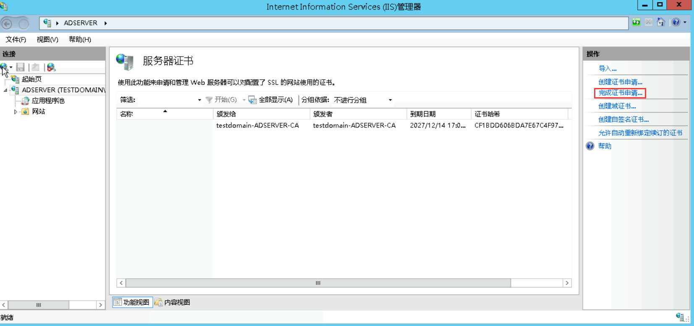

- [ADFS 用户 SSO 使用说明](https://cloud.tencent.com/document/product/598/84174)
- [Dynamics CRM安装教程五：ADFS安装配置](https://www.cnblogs.com/bzpfly/p/13521792.html)
- [部署联合服务器场](https://learn.microsoft.com/zh-cn/windows-server/identity/ad-fs/deployment/deploying-a-federation-server-farm)
- [安装 AD FS 软件](https://learn.microsoft.com/zh-cn/previous-versions/azure/azure-services/dn151310(v=azure.100))
- [使用 AD FS 和 Web 应用程序代理部署工作文件夹：步骤 1，设置 AD FS](https://learn.microsoft.com/zh-cn/windows-server/storage/work-folders/deploy-work-folders-adfs-step1)

## 操作场景

Active Directory Federation Services（ADFS）是 Microsoft's 推出的 Windows Server 活动目录联合服务 (ADFS)。ADFS是一种能够用于一次会话过程中多个 Web 应用用户认证的新技术。您可以使用用户 SSO 将 ADFS 与腾讯云进行集成，从而实现 ADFS 账户管理腾讯云控制台管理腾讯云的资源。

## 前提条件

1. 拥有一台  Windows Server 服务器。
2. 在服务器内进行以下搭建工作。

- DNS 服务器：将身份认证请求解析到正确的 Federation Service 上。
- Active Directory域服务（AD DS）：提供对域用户和域设备等对象的创建、查询和修改等功能。
- Active Directory Federation Service（AD FS）：提供配置 SSO 信赖方的功能，并对配置好的信赖方提供 SSO 认证。

## 操作步骤
1. 安装部署 Microsoft AD 域控制器
2. 安装AD证书服务
3. 安装AD FS服务

## 安装部署 Microsoft AD 域控制器

安装步骤参考[AD域控制器安装](./1-Install-AD-DS.md)

1. 在云服务器内，进入 Server Manager > Dashboard，单击 Add roles and features，如下图所示：

2. 一直单击 Next 直到单击 Install 完成安装，如下图所示：

3. 安装完成后单击 Promote this server to a domain controller，如下图所示：

4. 在 Deployment Configuration 页面选择 Add a new forest 补充 Root domain name 信息为 testdomain.com，如下图所示：

5. 在 Domain Controller Options 中补充 Password 信息，如下图所示，完成后一直单击Next，单击 Install 完成安装

6. 安装完成后，服务器将重启，重启完成后，进入 Start Menu > Active Directory Users and Computers，如下图所示：

7. 在 Active Directory Users and Computers 页面，新建 Org 及 Users 信息，其中 Users-First name 名称需与后续腾讯云创建的子用户保持一致，如下图所示：

## 安装 CA

1. 在云服务器内，进入 Server Manager > Dashboard，单击 Add roles and features，如下图所示：

2. 一直单击 Next 直到 Server Roles 页面，Roles 选择 Active Directory Certificate Services，如下图所示：

3. 一直单击 Next 直到 AD CS-Server Roles 页面，Server Roles 选择 Certification Authority、Certification Authority Web Enrollment，如下图所示：

4.  一直单击 Next 直到 Results 页面，单击下图信息配置 AD CS Configuration，如下图所示：

5. 单击 Next ，在Role Serverives，勾选下图信息，单击 Next，

6. 在 Setup Type 页面，选择 Enterprise CA，如下图所示：

7. 在 CA Type 页面，选择 Root CA，如下图所示：

8. 在 Private Key 页面，选择 Create a new private key，如下图所示：

9. 在 Certificate Database 页面，补充信息，单击下一步，如下图所示：

10. 访问  http://localhost/certsrv  确保 CA 安装成功，如下图所示：

## 安装 ADFS 服务

在配置前您需要给计算机或者指定的用户或者计算机授权证书颁发。安装 ADFS 前，需要创建和配置证书，本文中通过 IIS 进行证书申请。
1. 在云服务器内，单击 ，在弹出的窗口单击工具，选择 “IIS 管理器” 。

2. 在 IIS 管理器中，单击服务器证书，如下图所示：

3. 进入服务器证书页面，单击 创建证书申请，如下图所示：

4. 访问  http://localhost/certsrv，单击申请证书 > 高级证书申请 > 使用 base64 编码，如下图所示：

5. 在弹出的提交证书申请页面，将申请证书保存的证书文件内容复制之后补充至以下输入框，证书模板选择 Web 服务器，单击提交。如下图所示：

6. 提交之后，单击 下载证书，如下图所示：

7. 在服务器证书页面，单击 完成证书申请，在弹出的页面选择步骤 5 下载的证书，如下图所示：

8. 在网站 > Default Web Site 主页，右键单击 编辑绑定，如下图所示：

9. 在弹出的网站绑定页面，单击 添加，选择类型为 https，IP 地址为全部未分配，端口为 80，SSL 证书为 test.cert，如下图所示：

10. 在管理工具页面，单击 证书颁发机构，如下图所示：

11. 在证书颁发机构页面，选择证件模板，右键单击管理，如下图所示：

12. 参考下图配置：

13.  进入服务器管理器 > 仪表板页面，单击 添加角色和功能，按照默认选择一直单击 下一步 直到服务器角色选择页面，勾选 Active Directory Federation Services，一直单击 下一步，直至安装完成。

14.  在安装完成页面，单击 在此服务器上配置联合身份验证服务，如下图所示：

15. 在弹出的向导页面，单击 下一步，

设置指定服务属性，选择并填写好所需数据，单击下一步。

设置指定服务账户，选择使用现有的域用户账户或组托管服务账户，单击选择。

选择指定账户后，单击确认，确认后直至安装完成。

## 用户SSO配置

1. 在服务器内浏览器访问 `https://adserver.testdomain.com/FederationMetadata/2007-06/FederationMetadata.xml`，将源数据 XML 下载至本地。

2. 进入 访问管理-用户 SSO 控制台，单击右侧 编辑，设置 SSO 协议为 SAML，上传第 1 步保存的 XML 文件。

3. 在服务器内进入 ADFS 管理页面，选择信任关系 > 信赖方信任，右键选择添加信赖方信任，单击 启动，补充联合元数据地址，元数据地址从第 2 步中获取，一直单击 下一步，如下图所示：

4. 配置完后，效果如下图所示：

## 为腾讯云 SP 配置 SAML 断言属性

为保证腾讯云 SAML 响应定位到正确的子用户，SAML 断言中的 NameID 字段需要是腾讯云子用户名。SAML 断言中的 NameID 默认传入为（TESTDOMAIN\子用户名）格式，需正则表达式去除原有配置 TESTDOMAIN，仅保留子用户名（TESTDOMAIN 是前面的默认 NETBIOS 名）。
自定义规则为：安装 ADFS 服务中步骤3 申请证书所在文件内的txt内容。

> 说明:
> 
> 若出现请求终止，无法创建 SSL/TLS 安全通道时，可通过 powershell 执行方式后重启服务器解决。
> 
> 32位机器：
> 
> Set-ItemProperty -Path 'HKLM:\SOFTWARE\Wow6432Node\Microsoft.NetFramework\v4.0.30319' -Name 'SchUseStrongCrypto' -Value '1' -Type DWord
>
>64位机器：
>
> Set-ItemProperty -Path 'HKLM:\SOFTWARE\Microsoft.NetFramework\v4.0.30319' -Name 'SchUseStrongCrypto' -Value '1' -Type DWord

## 用户 SSO 登录

1. 浏览器输入 `https://adserver.testdomain.com/adfs/ls/idpinitiatedsignon`。

2. 输入用户名、密码信息，即可完成登录，如下图所示：

