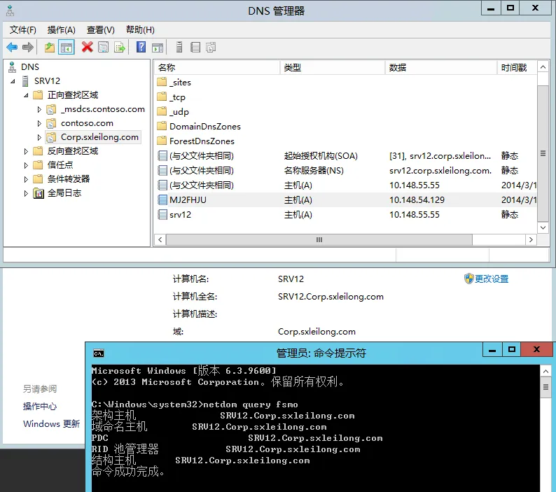

- [变更（重命名）AD域名称](https://blog.51cto.com/sxleilong/1377731)

## 变更（重命名）AD域名称
示例将域名 `contoso.com` 重命名为 `Corp.sxleilong.com`

查看当前fsmo的5个角色。

以管理员身份打开命令行窗口，输入命令：`netdom query fsmo`

 

 

创建新的DNS区域。

打开DNS管理器，右击正向查找区域，选择“新建区域”

 

采用默认，下一步

选中`至此林中域控制器上运行的所有DNS服务器（A）：contoso.com`，下一步

填写要重命名后的域名，下一步

采用默认，下一步

创建完正向查找区域后如下所示

以管理员身份打开命令行窗口，运行命令：`rendom /list`。该命令用来产生一个名为`Domainlist.xml`的文件，此文件包含当前林的配置。

 

由于我是在`system32`下执行的以上命令，所以文件也会产生在`System32`目录下，可以搜索到该文件，用记事本打开并进行编辑

替换下图中×××部分，我已经替换好，如:将 `Contoso.com` 替换为 `Corp.sxleilong.com`

当完成以上替换并保存退出后，再次返回到cmd窗口，运行命令：

`rendom /showforest`

接下来运行命令`Rendom /upload`。该命令是上传刚修改的`Domainlist.xml`到承载域命名操作主机角色域控制器的配置目录分区

`Rendom /prepare` 是用来验证林中每一个DC在进行重命名指令的准备情况，这应该联系成功联系所有DC并返回没有错误，然后处理下一个进程

`Rendom /execute`。这个命令是用来验证所有DC的准备状况然后在每个DC上执行重命名动作。完成后将自动在一分钟之后重启服务器

待重启完成后就可以用重命名后的域帐户登录

此时，可以看到已经成功登录且显示域为`Corp.sxleilong.com`

再次打开cmd，输入命令：`gpfixup /olddns:contoso.com /newdns:Corp.sxleilong.com`。这个是用来刷新所有域的引用和链接到组策略对象

下一步输入命令：`gpfixup /oldnb:SRV12 /newnb:Corp.sxleilong` 这里是为变更`Netbios`名称

执行命令`rendom /clean`。从AD中移除旧的域名引用

`Rendom /end` 用来解冻林配置，允许后续进行变更。从`Rendom /upload`到这步一直处于配置冻结状态

打开DNS管理器，展开并选中`Corp.sxleilong.com`，可以看到对应IP列表

接下来可以变更下DNS后缀，变更完成后点击“确定”

完成后重新启动服务器

此时，我们将一台Win Srv 08 加入`Corp.sxleilong.com`域中，然后重启以域用户登录

在DC上可以看到已经加入域的Server DNS 记录。同时，在进行FSMO角色查询，可以看到已经完全转换过来了，至此，重命名AD域名完成。

