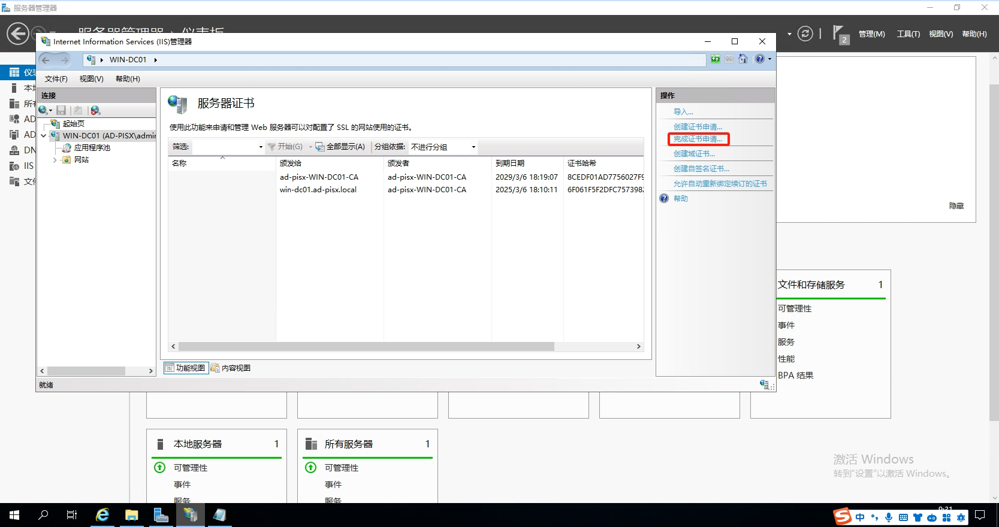

- [ADFS 用户 SSO 使用说明](https://cloud.tencent.com/document/product/598/84174)
- [Dynamics CRM安装教程五：ADFS安装配置](https://www.cnblogs.com/bzpfly/p/13521792.html)
- [部署联合服务器场](https://learn.microsoft.com/zh-cn/windows-server/identity/ad-fs/deployment/deploying-a-federation-server-farm)
- [安装 AD FS 软件](https://learn.microsoft.com/zh-cn/previous-versions/azure/azure-services/dn151310(v=azure.100))
- [使用 AD FS 和 Web 应用程序代理部署工作文件夹：步骤 1，设置 AD FS](https://learn.microsoft.com/zh-cn/windows-server/storage/work-folders/deploy-work-folders-adfs-step1)

- [Keeper Microsoft AD FS](https://docs.keeper.io/sso-connect-cloud/identity-provider-setup/ad-fs-keeper)
- [Active Directory 联合身份验证服务概述](https://learn.microsoft.com/zh-cn/windows-server/identity/ad-fs/ad-fs-overview)
- [SAML2 :: Spring Security](https://docs.spring.io/spring-security/reference/servlet/saml2/index.html)

- [实战：ADFS3.0单点登录系列-总览](https://www.cnblogs.com/luoyedemeng/articles/9836169.html)
- [实战：ADFS3.0单点登录系列-前置准备](https://www.cnblogs.com/luoyedemeng/articles/9836196.html)
- [实战：ADFS3.0单点登录系列-ADFS3.0安装配置](https://www.cnblogs.com/luoyedemeng/articles/9837685.html)
- [实战：ADFS3.0单点登录系列-集成SharePoint](https://www.cnblogs.com/luoyedemeng/articles/9838248.html)
- [实战：ADFS3.0单点登录系列-集成MVC](https://www.cnblogs.com/luoyedemeng/articles/9838277.html)
- [实战：ADFS3.0单点登录系列-集成Exchange](https://www.cnblogs.com/luoyedemeng/articles/9838305.html)
- [Dynamic CRM 2016 IFD配置（1）证书颁发机构配置](https://www.cnblogs.com/luoyedemeng/articles/9838609.html)
- [Dynamic CRM 2016 IFD配置（2）证书配置](https://www.cnblogs.com/luoyedemeng/articles/9842030.html)
- [Dynamic CRM 2016 IFD配置（3）DNS及防火墙配置](https://www.cnblogs.com/luoyedemeng/articles/9842172.html)
- [Dynamic CRM 2016 IFD配置（4）ADFS安装配置](https://www.cnblogs.com/luoyedemeng/articles/9842264.html)
- [Dynamic CRM 2016 IFD配置（5）Claims-based认证-内部访问配置](https://www.cnblogs.com/luoyedemeng/articles/9842277.html)
- [Dynamic CRM 2016 IFD配置（6）Claims-based认证-外部访问配置](https://www.cnblogs.com/luoyedemeng/articles/9842294.html)
- [Server2012 下 部署ADFS IFD](https://www.cnblogs.com/luoyedemeng/articles/9842465.html)

- [服务部署系列手册--01-AD域服务安装及新林安装配置](https://blog.csdn.net/lynxkor/article/details/103927227)
- [服务部署系列手册--02-ADFS3.0单点登录服务安装及配置](https://blog.csdn.net/lynxkor/article/details/103928142)
- [服务部署系列手册--03-证书服务安装及SSL证书申请颁发](https://blog.csdn.net/lynxkor/article/details/104746643)
- [服务部署系列手册--04-SQL SERVER2016安装及配置](https://blog.csdn.net/lynxkor/article/details/105123593)
- [服务部署系列手册--05-Dynamics365安装部署及配置](https://blog.csdn.net/lynxkor/article/details/105134007)

- [如何将Spring Security 集成 SAML2 ADFS 实现SSO单点登录?](https://cloud.tencent.com/developer/article/2367225)
- [示例代码](https://github.com/Kahen/spring-security-saml2-azure-ad-example)

- [How to configure Keeper SSO Connect Cloud with Microsoft AD FS for seamless and secure SAML 2.0 authentication](https://docs.keeper.io/sso-connect-cloud/identity-provider-setup/ad-fs-keeper)
- [Active Directory 联合身份验证服务概述](https://learn.microsoft.com/zh-cn/windows-server/identity/ad-fs/ad-fs-overview)
- [SAML2 :: Spring Security](https://docs.spring.io/spring-security/reference/servlet/saml2/index.html)

## 创建AD域账户
如果安装AD域未创建账户，需要先创建一个账户用于ADFS认证配置

1. 安装完成后，服务器将重启，重启完成后，进入 `服务器管理` > `AD DS`，如下图所示：

2. 在 `Active Directory 用户与计算机` 页面，新建 `组织单位` 及 `用户` 信息，其中 `姓(Users-First name)` 名称需与后续腾讯云创建的子用户保持一致，如下图所示：

## 安装CA证书服务

1. 在服务器内，进入 `服务器管理器` > `仪表板`， 点击 `添加角色和功能`，如下图所示：

2. 一直单击 `下一步` 直到 `服务器角色` 页面，`角色` 选择 `Active Directory 证书服务`，如下图所示：

3. 一直单击 `下一步` 直到 `AD CS` - `角色服务` 页面，`角色服务` 选择 `证书颁发服务`、`证书颁发机构Web注册`，如下图所示：

4. 一直单击 `下一步` 直到 `结果` 页面，单击下图信息配置 `AD CS 配置`，如下图所示：

5. 单击 `下一步` ，在`角色服务`，勾选下图信息，单击 `下一步`

6. 在 `设置类型` 页面，选择 `企业 CA`，如下图所示：

7. 在 `CA 类型` 页面，选择 `根 CA`，如下图所示：

8. 在 `私钥` 页面，选择 `创建新的私钥`，如下图所示：

9. 在 `证书数据库` 页面，补充信息，单击下一步，如下图所示：

10. 访问  `http://localhost/certsrv`  确保 CA 安装成功，如下图所示：

## 安装AD FS服务

在配置前您需要给计算机或者指定的用户或者计算机授权证书颁发。安装 ADFS 前，需要创建和配置证书，本文中通过 IIS 进行证书申请。
1. 在服务器内进入`服务器管理器` > `仪表板`，单击`工具`，选择 `IIS 管理器` 。

2. 在 `IIS 管理器`中，单击`服务器证书`，如下图所示：

3. 进入`服务器证书`页面，单击 `创建证书申请`，如下图所示：

输入证书文件名`C:\Users\Administrator\Desktop\cert.txt`

4. 访问 `http://localhost/certsrv`，单击`申请证书` > `高级证书申请` > `使用 base64 编码`，如下图所示：

5. 在弹出的提交证书申请页面，将申请证书保存的证书文件内容复制之后补充至以下输入框，证书模板选择 `Web 服务器`，单击提交。如下图所示：

6. 提交之后，单击 下载证书，如下图所示：

7. 在`服务器证书`页面，单击 `完成证书申请`，在弹出的页面选择`步骤 6` 下载的证书，如下图所示：

8. 在`网站` > `Default Web Site` 主页，右键单击 编辑绑定，如下图所示：

9. 在弹出的网站绑定页面，单击 添加，选择类型为 https，IP 地址为全部未分配，端口为 443，SSL 证书为 `ad-pisx.cert`，如下图所示：

1.  在 `控制面板` > `系统和安全` > `管理工具`页面，单击 `证书颁发机构`，如下图所示：

11. 在证书颁发机构页面，选择证件模板，右键单击管理，如下图所示：

12. 参考下图配置：

13.  进入`服务器管理器` > `仪表板页面`，单击 `添加角色和功能`，按照默认选择一直单击 下一步 直到服务器角色选择页面，勾选 `Active Directory 联合身份验证服务`，一直单击 下一步，直至安装完成。

14.  在安装完成页面，单击 `在此服务器上配置联合身份验证服务`，如下图所示：

15. 在弹出的向导页面，单击 下一步，

设置`指定服务属性`，选择并填写好所需数据，单击下一步。

设置`指定服务账户`，选择`使用现有的域用户账户或组托管服务账户`，单击`选择`。

选择指定账户后，单击确认，输入账号密码，点击`下一步`后直至安装完成。

**Note:** 如果不知道用户全名，可以使用`高级`中的搜索功能
