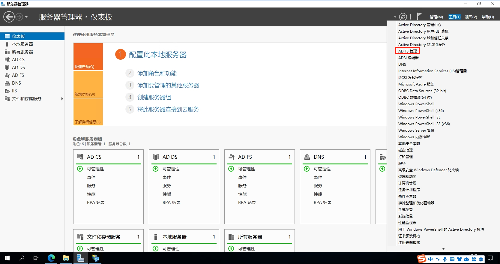
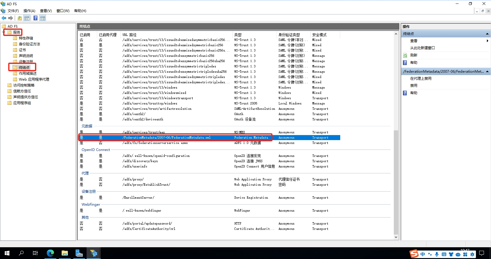
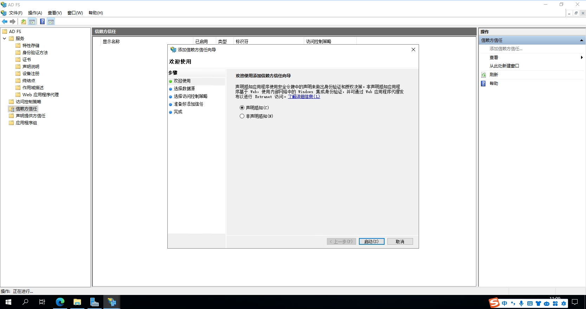
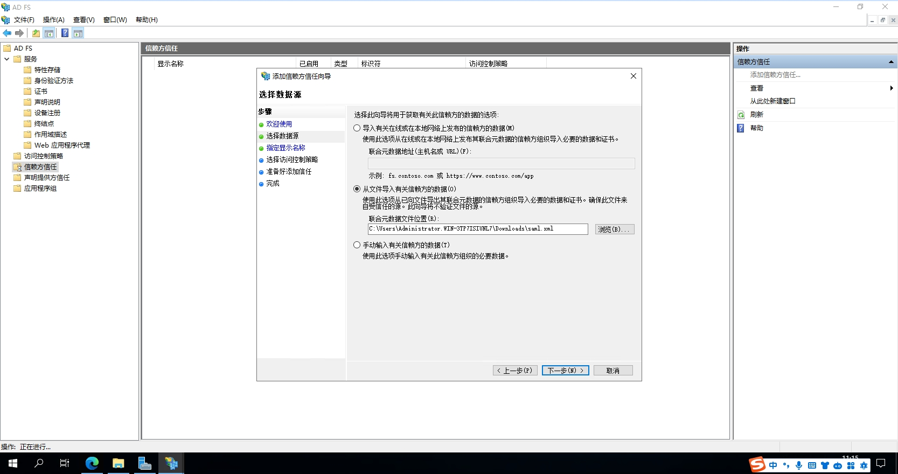
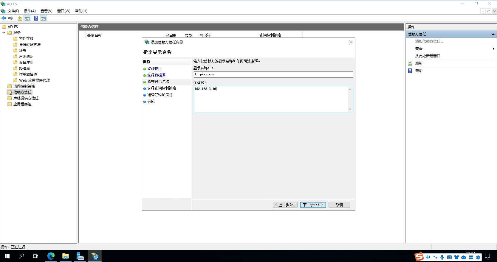
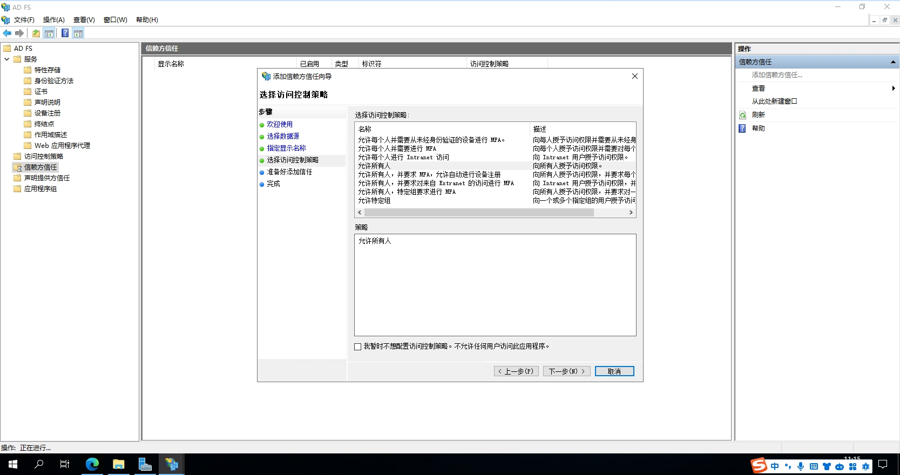
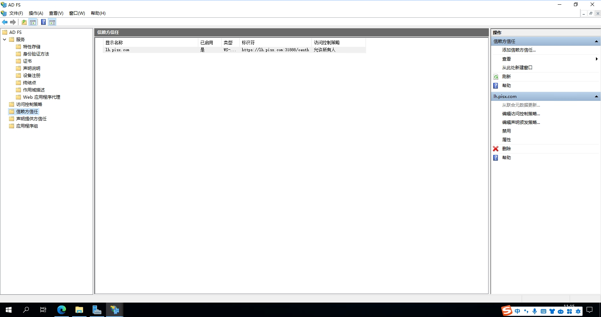

- [spring-security-saml2-service-provider example](https://github.com/code-tinkering/spring-security-saml2-service-provider-example)
- [spring-security-saml2-service-provider example](https://codetinkering.com/spring-security-saml2-service-provider-example/)
- [SAML2 – Spring Security 5.2 Tutorial](https://codetinkering.com/saml2-spring-security-5-2-tutorial/)
- [SAML x509 证书工具](https://www.samltool.com/self_signed_certs.php)
- [Active Directory 证书服务(一)](https://zhuanlan.zhihu.com/p/402961562)

- [Spring Security Demo - Login with Microsoft AD FS](https://github.com/selvinsource/spring-security/tree/oauth2login-adfs-sample/samples/boot/oauth2login#adfs-login)
- [saml2-tutorial](https://github.com/code-tinkering/saml2-tutorial)

## 准备
- AD FS服务器域名 `win-dc01.ad-pisx.com`
- 本地开发计算机域名  `win-srv01.ad-pisx.com`

## 生成密钥和证书
以下命令将为我们的身份和服务提供商生成所有必需的密钥和证书：

```shell
# Generate a 2048-bit RSA Public / Private key pair 
openssl req -newkey rsa:2048 -new -nodes -x509 -days 3650 -keyout private.key -out public.crt

# Convert the PKCS#8 format private-key to PKCS#1 unencrypted format 
openssl rsa -in private.key -out rsaprivate.key
```
出现提示时，请提供必要的详细信息，例如州、省、市、组织、电子邮件等。

如果您在创建这些证书时遇到困难，OneLogin 提供的[SAML x509 证书工具](https://www.samltool.com/self_signed_certs.php)可能会有所帮助。

您应该有三个结果文件：

- `private.key` - PKCS#8 格式的未加密 RSA 私钥文件
- `public.cer` - 相应的 x509 自签名证书文件
- `rsaprivate.key` - PKCS#1 格式的未加密 RSA 私钥
在现实场景中，身份提供商将拥有自己的私钥，并且可以持有其可信服务提供商的公共证书，反之亦然。但是，如果您是两者的所有者，则可以在身份和服务提供商之间共享相同的公钥和私钥。为了简单起见，我们将为两个提供商重复使用相同的公钥和私钥。

```shell
openssl pkcs12 -in pisx.pfx -nodes -out pisx.pem

openssl rsa -in pisx.pem -out pisx.key

openssl x509 -in pisx.pem -out pisx.crt
```

```shell
# 导入服务端证书
keytool -import -keystore d:/cert/root.pfx -storepass 1 -alias root -file d:/cert/win-dc01.ad-pisx.download.crt
```
该命令由4个部分组成：
- `keytool -import` 用于导入的命令
- `-keystore <信任库文件路径>` 希望生成的信任库文件，例如路径可以写：C:\Users\abc\Desktop\truststore.jks
- `-storepass <密码>` 设置一个信任库密码
- `-alias alias_for_certificate -file <证书文件路径>` 指定要导入的证书文件，例如可以写：C:\Users\abc\Desktop\cert.pem

## 双向HTTPS证书安装
### 1. 本地开发机安装
1. 客户端生成一个证书申请文件，这一步可以使用openssl生成,比如

```shell
openssl req -new -SHA256 -newkey rsa:2048 -nodes \
    -keyout win-srv01.ad-pisx.com.key -out win-srv01.ad-pisx.com.csr \
    -subj "/C=CN/ST=HUBEI/L=WUHAN/O=PISX/OU=DIGINN/CN=win-srv01.ad-pisx.com"
```

或者直接找个[在线的网站生成](https://myssl.com/csr_create.html)

2. 将生成的证书请求文件发送到AD域服务器

3. 在AD域服务器上访问 `http://localhost/certsrv/`，填上生成的证书请求文件 `csr`，生成证书

4. 打开 `服务器管理器`，点击 `工具` > `证书颁发机构`，在`颁发的证书`中可以看到刚才颁发的证书

### 2. AD域服务器证书安装
```shell
openssl pkcs12 -in pisx.pfx -nodes -out pisx.pem

openssl rsa -in pisx.pem -out pisx.key

openssl x509 -in pisx.pem -out pisx.crt
```

## Spring Boot集成AD FS认证
- [How to configure spring boot security OAuth2 for ADFS?](https://stackoverflow.com/questions/43148552/how-to-configure-spring-boot-security-oauth2-for-adfs)
- [如何为 ADFS 配置 spring boot security OAuth2？](https://segmentfault.com/q/1010000042940754)
- [Login with Microsoft AD FS](https://github.com/selvinsource/spring-security/tree/oauth2login-adfs-sample/samples/boot/oauth2login#adfs-login)

### 1. 导入依赖

```xml
<dependency>
    <groupId>org.springframework.security</groupId>
    <artifactId>spring-security-saml2-service-provider</artifactId>
</dependency>
```

## 用户SSO配置
1. 打开 `服务器管理` > `仪表板`，点击 `工具` > `AD FS管理`，在 `服务` > `终结点` > `元数据` 中找到 `Federation Metadata`的值，一般默认为 `/FederationMetadata/2007-06/FederationMetadata.xml`





2. 在服务器内浏览器访问 `https://win-dc01.ad-pisx.local/FederationMetadata/2007-06/FederationMetadata.xml`，将元数据 XML 下载至本地。

3. 在服务器内进入 AD FS 管理页面，选择`信赖方信任`，右键选择`添加信赖方信任`，单击 `启动`，补充联合元数据地址，元数据地址从`Spring Boot集成AD FS认证`中获取，一直单击 `下一步`，如下图所示：





```xml
<?xml version="1.0" encoding="UTF-8"?><md:EntityDescriptor xmlns:md="urn:oasis:names:tc:SAML:2.0:metadata" entityID="http://lh.pisx.com:31888/oauth">
    <md:SPSSODescriptor protocolSupportEnumeration="urn:oasis:names:tc:SAML:2.0:protocol">
        <md:SingleLogoutService Binding="urn:oasis:names:tc:SAML:2.0:bindings:HTTP-POST" Location="http://lh.pisx.com:31888/oauth/saml/logout" ResponseLocation="http://lh.pisx.com:31888/oauth/saml/SingleLogout"/>
        <md:AssertionConsumerService Binding="urn:oasis:names:tc:SAML:2.0:bindings:HTTP-POST" Location="http://lh.pisx.com:31888/oauth/login/saml2/sso/adfs" index="1"/>
    </md:SPSSODescriptor>
</md:EntityDescriptor>
```





4. 配置完后，效果如下图所示：




## 四、示例

http://lh.pisx.com:31888/saml2/authenticate/adfs
### 1. 请求流程
2. 发送请求 `http://lh.pisx.com:31888/oauth/samlLogin`
3. 没有认证，重定向到 `https://lh.pisx.com:31888/oauth/saml2/authenticate/adfs`
  - 见 `Saml2WebSsoAuthenticationRequestFilter`，默认URL为 `/saml2/authenticate/{registrationId}`
4. 组装SAML认证请求，重定向到 `https://adfs.sf-auto.com/adfs/ls/`
  - AD FS Server
5. 输入用户名密码，再次请求 `https://adfs.sf-auto.com/adfs/ls/`
6. 携带认证结果，重定向 `https://lh.pisx.com:31888/oauth/saml/SSO/adfs`
  - 见 `Saml2WebSsoAuthenticationFilter`，默认URL为 `/login/saml2/sso/{registrationId}`
7. 根据结果进行认证，认证成功后回调开始的请求地址 `https://lh.pisx.com:31888/oauth/samlLogin`
8. 认证完成后重定向到原始的请求地址 `https://lh.pisx.com:9100/test` 并携带token


### 2. 请求参数解析 SAMLRequest
上面第四步携带的请求参数示例
```shell
SAMLRequest: lZFNb4JAEIbv/RVk78t+iAobwdCapiY2WsEeelthqSSwi8xi+vOLoom9mPS4szPPTJ53Nv+pK+ekWiiNDhFzKXKUzkxe6u8Q7dJX7KN59DQDWVe8EXFnD3qrjp0C68QAqrX93IvR0NWqTVR7KjO1265CdLC2AUFIU9V1mR8lcBeK3NSy1G5majFivu8TI3sgOcNJkqyJzAtAzqKHl1ray0U3zvmrJ+B+wJwBlwKpgCBnuQhRvP2YsiAoWI6pzMfY8zKK95T5eFLIkSd5kI0473sBOrXUYKW2IeKUe5gyTKcp9QULxJi5bBJ8IWfTGmsyUz2XelDRtVoYCSUILWsFwmYiid9XgrtU7IcmEG9pusGbdZIi5/OmlJ+V9pI1iEHiY1ZzXYyiwbm4XNzeEx4D5C0VFP0jgxm53xZdn38Dj34B
```

这个参数需要[Base64 Decode + Inflate解析](https://www.samltool.com/decode.php)为XML并[格式化](https://c.runoob.com/front-end/710/)
```xml
<?xml version="1.0" encoding="UTF-8"?>
<saml2p:AuthnRequest AssertionConsumerServiceURL="https://plmmidqas2.sfdomain.com:31888/oauth/saml/SSO/adfs" 
					 Destination="https://adfs.sf-auto.com/adfs/ls/" 
					 ID="ARQ7199f1d-0ad5-44c0-b018-6fa34a29c322" 
					 IssueInstant="2024-01-07T08:19:51.169Z" 
					 ProtocolBinding="urn:oasis:names:tc:SAML:2.0:bindings:HTTP-POST" 
					 Version="2.0"
					 xmlns:saml2p="urn:oasis:names:tc:SAML:2.0:protocol">
  <saml2:Issuer
    xmlns:saml2="urn:oasis:names:tc:SAML:2.0:assertion">https://plmmidqas2.sfdomain.com:31888/oauth
  
  </saml2:Issuer>
</saml2p:AuthnRequest>
```

对请求参数进行简单的[校验](https://www.samltool.com/validate_authn_req.php)

- `SAML AuthN Request`: 请求的XML
- `SP EntityId`: `https://plmmidqas2.sfdomain.com:31888/oauth`
- `Target URL, Destination of the AuthN Request`: `https://adfs.sf-auto.com/adfs/ls/`

### 3. 响应值解析 SAMLResponse
上面第六步携带的认证结果示例
```shell
SAMLResponse: PHNhbWxwOlJlc3BvbnNlIElEPSJfNjM2MmZjOGMtYWFkOS00M2EwLTljM2QtNTcyZTUwY2FiOWU2IiBWZXJzaW9uPSIyLjAiIElzc3VlSW5zdGFudD0iMjAyNC0wMS0wN1QwODoyMDo0NC4wMjVaIiBEZXN0aW5hdGlvbj0iaHR0cHM6Ly9wbG1taWRxYXMyLnNmZG9tYWluLmNvbTozMTg4OC9vYXV0aC9zYW1sL1NTTy9hZGZzIiBDb25zZW50PSJ1cm46b2FzaXM6bmFtZXM6dGM6U0FNTDoyLjA6Y29uc2VudDp1bnNwZWNpZmllZCIgSW5SZXNwb25zZVRvPSJBUlE3MTk5ZjFkLTBhZDUtNDRjMC1iMDE4LTZmYTM0YTI5YzMyMiIgeG1sbnM6c2FtbHA9InVybjpvYXNpczpuYW1lczp0YzpTQU1MOjIuMDpwcm90b2NvbCI+PElzc3VlciB4bWxucz0idXJuOm9hc2lzOm5hbWVzOnRjOlNBTUw6Mi4wOmFzc2VydGlvbiI+aHR0cDovL2FkZnMuc2YtYXV0by5jb20vYWRmcy9zZXJ2aWNlcy90cnVzdDwvSXNzdWVyPjxzYW1scDpTdGF0dXM+PHNhbWxwOlN0YXR1c0NvZGUgVmFsdWU9InVybjpvYXNpczpuYW1lczp0YzpTQU1MOjIuMDpzdGF0dXM6U3VjY2VzcyIgLz48L3NhbWxwOlN0YXR1cz48QXNzZXJ0aW9uIElEPSJfN2U4ODA4NWYtZWYyZS00MTBhLWEwMGQtODRkZjhkYzQ1MThjIiBJc3N1ZUluc3RhbnQ9IjIwMjQtMDEtMDdUMDg6MjA6NDQuMDI1WiIgVmVyc2lvbj0iMi4wIiB4bWxucz0idXJuOm9hc2lzOm5hbWVzOnRjOlNBTUw6Mi4wOmFzc2VydGlvbiI+PElzc3Vlcj5odHRwOi8vYWRmcy5zZi1hdXRvLmNvbS9hZGZzL3NlcnZpY2VzL3RydXN0PC9Jc3N1ZXI+PGRzOlNpZ25hdHVyZSB4bWxuczpkcz0iaHR0cDovL3d3dy53My5vcmcvMjAwMC8wOS94bWxkc2lnIyI+PGRzOlNpZ25lZEluZm8+PGRzOkNhbm9uaWNhbGl6YXRpb25NZXRob2QgQWxnb3JpdGhtPSJodHRwOi8vd3d3LnczLm9yZy8yMDAxLzEwL3htbC1leGMtYzE0biMiIC8+PGRzOlNpZ25hdHVyZU1ldGhvZCBBbGdvcml0aG09Imh0dHA6Ly93d3cudzMub3JnLzIwMDEvMDQveG1sZHNpZy1tb3JlI3JzYS1zaGEyNTYiIC8+PGRzOlJlZmVyZW5jZSBVUkk9IiNfN2U4ODA4NWYtZWYyZS00MTBhLWEwMGQtODRkZjhkYzQ1MThjIj48ZHM6VHJhbnNmb3Jtcz48ZHM6VHJhbnNmb3JtIEFsZ29yaXRobT0iaHR0cDovL3d3dy53My5vcmcvMjAwMC8wOS94bWxkc2lnI2VudmVsb3BlZC1zaWduYXR1cmUiIC8+PGRzOlRyYW5zZm9ybSBBbGdvcml0aG09Imh0dHA6Ly93d3cudzMub3JnLzIwMDEvMTAveG1sLWV4Yy1jMTRuIyIgLz48L2RzOlRyYW5zZm9ybXM+PGRzOkRpZ2VzdE1ldGhvZCBBbGdvcml0aG09Imh0dHA6Ly93d3cudzMub3JnLzIwMDEvMDQveG1sZW5jI3NoYTI1NiIgLz48ZHM6RGlnZXN0VmFsdWU+MzFrSUdOdkxzQTk3YWdCUTRXSmlMWWsyVUtDM212UEl0cGVySEtaVzd3dz08L2RzOkRpZ2VzdFZhbHVlPjwvZHM6UmVmZXJlbmNlPjwvZHM6U2lnbmVkSW5mbz48ZHM6U2lnbmF0dXJlVmFsdWU+Y3VKQWhPZWN0eENBT0Y4ZWRaVHp4T0tTOWpSeEhVNE1jUU9QNXFkZXk3WjdTQnZOOEdzeUs5ekVFNFVXYUJaYytnVm5sVFNPMXlyNmhhaWNkYktnN2FOeUpLWmFZV1NsaXBxc2RoUnNIOFJKZFBrOHI3aUJwNER5aVhQTVZUcFJGVHI5cDZJQmhCOUV3elUyNnFlN0RkZm9pSlcraVgxekNmNDZwci9DdXJueExSeERlT0tuYURoTHk4VjBVZWRqSk1YR1ZBQlRHOWsxajVYd1gwREgxQ0lUK0wzQ0x2d0cwNUVzUmJTWkdhclcwaWMrYWdWS1lDbDVEYlRNNWsvNnFzam9GWFhhMkFFUzNiQUp5bWNuOTd5UWd1ZjZpM3hxd3RCbE92ek9sTC9UTXpMTW55cnhXYXN4ZE83QnVFSEVhOFpxTVRyRVV0ek1PbzQzdThoRzRnPT08L2RzOlNpZ25hdHVyZVZhbHVlPjxLZXlJbmZvIHhtbG5zPSJodHRwOi8vd3d3LnczLm9yZy8yMDAwLzA5L3htbGRzaWcjIj48ZHM6WDUwOURhdGE+PGRzOlg1MDlDZXJ0aWZpY2F0ZT5NSUlIbHpDQ0JYK2dBd0lCQWdJUUNUQytvb1hYSVRBMmJhTk5FTXhhbmpBTkJna3Foa2lHOXcwQkFRc0ZBREJjTVFzd0NRWURWUVFHRXdKVlV6RVhNQlVHQTFVRUNoTU9SR2xuYVVObGNuUXNJRWx1WXk0eE5EQXlCZ05WQkFNVEsxSmhjR2xrVTFOTUlFZHNiMkpoYkNCVVRGTWdVbE5CTkRBNU5pQlRTRUV5TlRZZ01qQXlNaUJEUVRFd0hoY05Nak13T1RFNU1EQXdNREF3V2hjTk1qUXhNREV5TWpNMU9UVTVXakFZTVJZd0ZBWURWUVFEREEwcUxuTm1MV0YxZEc4dVkyOXRNSUlCSWpBTkJna3Foa2lHOXcwQkFRRUZBQU9DQVE4QU1JSUJDZ0tDQVFFQXVZQTZKM0RLVk81dCt3VkRmUGpJWnF1SmtiTTJkaE00UHpxNGtBME5XK2V3NkNrZDJnUmpuYXRTVTVtMlFnRWh1dzJjL3l2U25FbDdKMG5tTlBBQm9EZ3N6azRiaGtSRElyNVdZVUFQbTBXRnB2V2NIWHM0NEJwUXJxdUlOcUdHWFhUS3laV2FDYWhUN3hFYkJaRmx5Z3l2dU91NkZzK201Q01SdTRKbVNTZWo0MSs4YUJwa3d2QW9Ueld4NjZYLzcxS3U5UXdJU0pwajV3QmEvN3VmV3pqVDN6dlFTUnNPU1ptWkRRTTdSejEzSUlkL0RLTkZmcjZoRjJ4TzJBTXVaL2kraXdFSDI2bmdRRGtxazgydGtZYUVwa2N0MDlSUTBuTWlhRnJyb1QvM3hsM2RlbU00eHJRRmE1blhqM3RHTHNnLzBVZEpDOGlJcVlPMUdzcXNvd0lEQVFBQm80SURsekNDQTVNd0h3WURWUjBqQkJnd0ZvQVU4SnlGL2FLZmZZL0phTHZWMUlsTkhiN1RrUDh3SFFZRFZSME9CQllFRkJCdjZyeUV0RmxOWW9IUGZpL3A0ZDltcHNlK01DVUdBMVVkRVFRZU1CeUNEU291YzJZdFlYVjBieTVqYjIyQ0MzTm1MV0YxZEc4dVkyOXRNRDRHQTFVZElBUTNNRFV3TXdZR1o0RU1BUUlCTUNrd0p3WUlLd1lCQlFVSEFnRVdHMmgwZEhBNkx5OTNkM2N1WkdsbmFXTmxjblF1WTI5dEwwTlFVekFPQmdOVkhROEJBZjhFQkFNQ0JhQXdIUVlEVlIwbEJCWXdGQVlJS3dZQkJRVUhBd0VHQ0NzR0FRVUZCd01DTUlHZkJnTlZIUjhFZ1pjd2daUXdTS0JHb0VTR1FtaDBkSEE2THk5amNtd3pMbVJwWjJsalpYSjBMbU52YlM5U1lYQnBaRk5UVEVkc2IySmhiRlJNVTFKVFFUUXdPVFpUU0VFeU5UWXlNREl5UTBFeExtTnliREJJb0VhZ1JJWkNhSFIwY0RvdkwyTnliRFF1WkdsbmFXTmxjblF1WTI5dEwxSmhjR2xrVTFOTVIyeHZZbUZzVkV4VFVsTkJOREE1TmxOSVFUSTFOakl3TWpKRFFURXVZM0pzTUlHSEJnZ3JCZ0VGQlFjQkFRUjdNSGt3SkFZSUt3WUJCUVVITUFHR0dHaDBkSEE2THk5dlkzTndMbVJwWjJsalpYSjBMbU52YlRCUkJnZ3JCZ0VGQlFjd0FvWkZhSFIwY0RvdkwyTmhZMlZ5ZEhNdVpHbG5hV05sY25RdVkyOXRMMUpoY0dsa1UxTk1SMnh2WW1Gc1ZFeFRVbE5CTkRBNU5sTklRVEkxTmpJd01qSkRRVEV1WTNKME1Bd0dBMVVkRXdFQi93UUNNQUF3Z2dGL0Jnb3JCZ0VFQWRaNUFnUUNCSUlCYndTQ0FXc0JhUUIyQU83TjBHVFYyeHJPeFZ5M25iVE5FNkl5aDBaOHZPemV3MUZJV1VaeEg3V2JBQUFCaXF0cUExSUFBQVFEQUVjd1JRSWhBSkJRekwyMlp0dzR1VlBaVGcvR3hlMzlXRVZBM3dXY05OOGVFMXFBUzBPSEFpQWF5cVRFRDJVOVVmQVhHNUpvZjM3TzBUTUxISDNJanFOVG1lSnJrSThvcXdCMkFFaXc0MnZhcGtjMEQrVnFBdnFkTU9zY1VnSExWdDBzZ2RtN3Y2czUySVJ6QUFBQmlxdHFBM1VBQUFRREFFY3dSUUlnSkMreVNZMlY2NGVKN0J2a0tJdm54bWh6L1RCbVliY1UwbVNiTDhFcEJqa0NJUUN1cnNZRlpaY0I1OWRzQkJLaXgraHVVUHJHbUplNi9jcG5qSmFzY1ExOHFBQjNBTnEydjJzL3RiWWluNXZDdTF4cjZIQ1JjV3k3VVlTRk5MMmtQVEJJMS91ckFBQUJpcXRxQTZFQUFBUURBRWd3UmdJaEFKZXh4WjJxbnVqTkNDVmZ2ZTFaMThhdmZNVCtTVEhpdkxtVFFyV1dzZ3AyQWlFQXNldDR4d1NRQVRnM2hhT1dhN1dLTXVoSjAwaFBwelUrUFI1cTNoQUszZ2d3RFFZSktvWklodmNOQVFFTEJRQURnZ0lCQUk5NVJ2UDFBSUlSMyt0bU5QZ1QzRE9wbisxdUI0VFA3NCt3Z3QrWjB4dGJQbldVNUpxdjYxLzR0alpmZ2o1QjE1djVZbENhb3ZGS1FCMkxPRllhT3dBYy8xMGRGVTBqVnpDUTFlajU3cCtRL2habEpMNDEwNkZtOG1tc012U1BFMjlKTHFZSnh1bjZuTFZIelQ0T3NMMHN6a3oyRWl2OEw1MXNVdkFPZWtrSUo2RENYc1FqNHNqZVNja2FWK2tCZkVKSEZCdnJRRkxvbExYQzYyLzg3Y1BNSlUvbFQxYW42bnFmcHVlZ1pweldrRXJuS3NGcUtsTzZvdGJwTWJ5YnBkMVk5SFpkYlhnSkl5cUJxbjUrSmp0cHlyT3podGFNUWc0OEhGb21JdFhBRUVndE1iYkRFZUx1eVdSSzQ0eG1iYmNUZStnRVJ0MnlrWjZ2czYybUxRRUorQVl5YlBZTDVGTTRhcTB5YmZXUjZaKzNGSTZFdml1SUYzV3Exc1lSUTB0MlJla1lzZEx3eEZHT0FZd0tIdllPcUFzRkx6RnhhM0dYTlVsek80TXU3SllTMWtiMnZqM0R2d3FMZDRzeFRzRkRqM0dMaVN2K2oraVVzZFQvcTJpa0cwUzJjc2ZQNmhrWnY5cG9PakkrbGM2Z2xWeFpVaFUwRUkyTVh0anV2M2pRU0VyMkNYLzhsUjFBMHZKNjNCRjZPTXBjSmNBRjBqTTF0WFNCQXR0K3N1VFp1anc1dkZ2cW1vSGpqVWJ4R2lHS0Mza2xYd1R4aXJyTjRsNkxPak81SUk0NTZLaWtwYkQ3YjJwUVJoOU9EK0xZWkRLRE5LNXA0LzVvRm5XOGdKdnFrNzVPcjRGT0M1Nzk1RTFCaUtTTnJoUmx1V0lkcy80RjJlRGtUTGJuPC9kczpYNTA5Q2VydGlmaWNhdGU+PC9kczpYNTA5RGF0YT48L0tleUluZm8+PC9kczpTaWduYXR1cmU+PFN1YmplY3Q+PE5hbWVJRD55YW5nZ3VhbmctdkBzZmRvbWFpbi5jb208L05hbWVJRD48U3ViamVjdENvbmZpcm1hdGlvbiBNZXRob2Q9InVybjpvYXNpczpuYW1lczp0YzpTQU1MOjIuMDpjbTpiZWFyZXIiPjxTdWJqZWN0Q29uZmlybWF0aW9uRGF0YSBJblJlc3BvbnNlVG89IkFSUTcxOTlmMWQtMGFkNS00NGMwLWIwMTgtNmZhMzRhMjljMzIyIiBOb3RPbk9yQWZ0ZXI9IjIwMjQtMDEtMDdUMDg6MjU6NDQuMDI1WiIgUmVjaXBpZW50PSJodHRwczovL3BsbW1pZHFhczIuc2Zkb21haW4uY29tOjMxODg4L29hdXRoL3NhbWwvU1NPL2FkZnMiIC8+PC9TdWJqZWN0Q29uZmlybWF0aW9uPjwvU3ViamVjdD48Q29uZGl0aW9ucyBOb3RCZWZvcmU9IjIwMjQtMDEtMDdUMDg6MjA6NDQuMDIzWiIgTm90T25PckFmdGVyPSIyMDI0LTAxLTA3VDA5OjIwOjQ0LjAyM1oiPjxBdWRpZW5jZVJlc3RyaWN0aW9uPjxBdWRpZW5jZT5odHRwczovL3BsbW1pZHFhczIuc2Zkb21haW4uY29tOjMxODg4L29hdXRoPC9BdWRpZW5jZT48L0F1ZGllbmNlUmVzdHJpY3Rpb24+PC9Db25kaXRpb25zPjxBdHRyaWJ1dGVTdGF0ZW1lbnQ+PEF0dHJpYnV0ZSBOYW1lPSJodHRwOi8vc2NoZW1hcy54bWxzb2FwLm9yZy93cy8yMDA1LzA1L2lkZW50aXR5L2NsYWltcy9lbWFpbGFkZHJlc3MiPjxBdHRyaWJ1dGVWYWx1ZT55YW5nZ3VhbmctdkBzZi5sb2NhbDwvQXR0cmlidXRlVmFsdWU+PC9BdHRyaWJ1dGU+PEF0dHJpYnV0ZSBOYW1lPSJodHRwOi8vc2NoZW1hcy54bWxzb2FwLm9yZy93cy8yMDA1LzA1L2lkZW50aXR5L2NsYWltcy9uYW1lIj48QXR0cmlidXRlVmFsdWU+5p2o5YWJ77yIUExNLS3lpJbpg6jpob7pl67vvIk8L0F0dHJpYnV0ZVZhbHVlPjwvQXR0cmlidXRlPjwvQXR0cmlidXRlU3RhdGVtZW50PjxBdXRoblN0YXRlbWVudCBBdXRobkluc3RhbnQ9IjIwMjQtMDEtMDdUMDg6MjA6NDQuMDAwWiIgU2Vzc2lvbkluZGV4PSJfN2U4ODA4NWYtZWYyZS00MTBhLWEwMGQtODRkZjhkYzQ1MThjIj48QXV0aG5Db250ZXh0PjxBdXRobkNvbnRleHRDbGFzc1JlZj51cm46ZmVkZXJhdGlvbjphdXRoZW50aWNhdGlvbjp3aW5kb3dzPC9BdXRobkNvbnRleHRDbGFzc1JlZj48L0F1dGhuQ29udGV4dD48L0F1dGhuU3RhdGVtZW50PjwvQXNzZXJ0aW9uPjwvc2FtbHA6UmVzcG9uc2U+
```

这个响应值需要[Base64 Decode + Inflate解析](https://www.samltool.com/decode.php)为XML并[格式化](https://c.runoob.com/front-end/710/)
```xml
<samlp:Response ID="_6362fc8c-aad9-43a0-9c3d-572e50cab9e6" 
				Version="2.0" 
				IssueInstant="2024-01-07T08:20:44.025Z" 
				Destination="https://plmmidqas2.sfdomain.com:31888/oauth/saml/SSO/adfs" 
				Consent="urn:oasis:names:tc:SAML:2.0:consent:unspecified" 
				InResponseTo="ARQ7199f1d-0ad5-44c0-b018-6fa34a29c322"
  xmlns:samlp="urn:oasis:names:tc:SAML:2.0:protocol">
  <Issuer
    xmlns="urn:oasis:names:tc:SAML:2.0:assertion">http://adfs.sf-auto.com/adfs/services/trust
  </Issuer>
  <samlp:Status>
    <samlp:StatusCode Value="urn:oasis:names:tc:SAML:2.0:status:Success" />
  </samlp:Status>
  <Assertion ID="_7e88085f-ef2e-410a-a00d-84df8dc4518c" IssueInstant="2024-01-07T08:20:44.025Z" Version="2.0"
    xmlns="urn:oasis:names:tc:SAML:2.0:assertion">
    <Issuer>http://adfs.sf-auto.com/adfs/services/trust</Issuer>
    <ds:Signature
      xmlns:ds="http://www.w3.org/2000/09/xmldsig#">
      <ds:SignedInfo>
        <ds:CanonicalizationMethod Algorithm="http://www.w3.org/2001/10/xml-exc-c14n#" />
        <ds:SignatureMethod Algorithm="http://www.w3.org/2001/04/xmldsig-more#rsa-sha256" />
        <ds:Reference URI="#_7e88085f-ef2e-410a-a00d-84df8dc4518c">
          <ds:Transforms>
            <ds:Transform Algorithm="http://www.w3.org/2000/09/xmldsig#enveloped-signature" />
            <ds:Transform Algorithm="http://www.w3.org/2001/10/xml-exc-c14n#" />
          </ds:Transforms>
          <ds:DigestMethod Algorithm="http://www.w3.org/2001/04/xmlenc#sha256" />
          <ds:DigestValue>31kIGNvLsA97agBQ4WJiLYk2UKC3mvPItperHKZW7ww=</ds:DigestValue>
        </ds:Reference>
      </ds:SignedInfo>
      <ds:SignatureValue>cuJAhOectxCAOF8edZTzxOKS9jRxHU4McQOP5qdey7Z7SBvN8GsyK9zEE4UWaBZc+gVnlTSO1yr6haicdbKg7aNyJKZaYWSlipqsdhRsH8RJdPk8r7iBp4DyiXPMVTpRFTr9p6IBhB9EwzU26qe7DdfoiJW+iX1zCf46pr/CurnxLRxDeOKnaDhLy8V0UedjJMXGVABTG9k1j5XwX0DH1CIT+L3CLvwG05EsRbSZGarW0ic+agVKYCl5DbTM5k/6qsjoFXXa2AES3bAJymcn97yQguf6i3xqwtBlOvzOlL/TMzLMnyrxWasxdO7BuEHEa8ZqMTrEUtzMOo43u8hG4g==</ds:SignatureValue>
      <KeyInfo
        xmlns="http://www.w3.org/2000/09/xmldsig#">
        <ds:X509Data>
          <ds:X509Certificate>MIIHlzCCBX+gAwIBAgIQCTC+ooXXITA2baNNEMxanjANBgkqhkiG9w0BAQsFADBcMQswCQYDVQQGEwJVUzEXMBUGA1UEChMORGlnaUNlcnQsIEluYy4xNDAyBgNVBAMTK1JhcGlkU1NMIEdsb2JhbCBUTFMgUlNBNDA5NiBTSEEyNTYgMjAyMiBDQTEwHhcNMjMwOTE5MDAwMDAwWhcNMjQxMDEyMjM1OTU5WjAYMRYwFAYDVQQDDA0qLnNmLWF1dG8uY29tMIIBIjANBgkqhkiG9w0BAQEFAAOCAQ8AMIIBCgKCAQEAuYA6J3DKVO5t+wVDfPjIZquJkbM2dhM4Pzq4kA0NW+ew6Ckd2gRjnatSU5m2QgEhuw2c/yvSnEl7J0nmNPABoDgszk4bhkRDIr5WYUAPm0WFpvWcHXs44BpQrquINqGGXXTKyZWaCahT7xEbBZFlygyvuOu6Fs+m5CMRu4JmSSej41+8aBpkwvAoTzWx66X/71Ku9QwISJpj5wBa/7ufWzjT3zvQSRsOSZmZDQM7Rz13IId/DKNFfr6hF2xO2AMuZ/i+iwEH26ngQDkqk82tkYaEpkct09RQ0nMiaFrroT/3xl3demM4xrQFa5nXj3tGLsg/0UdJC8iIqYO1GsqsowIDAQABo4IDlzCCA5MwHwYDVR0jBBgwFoAU8JyF/aKffY/JaLvV1IlNHb7TkP8wHQYDVR0OBBYEFBBv6ryEtFlNYoHPfi/p4d9mpse+MCUGA1UdEQQeMByCDSouc2YtYXV0by5jb22CC3NmLWF1dG8uY29tMD4GA1UdIAQ3MDUwMwYGZ4EMAQIBMCkwJwYIKwYBBQUHAgEWG2h0dHA6Ly93d3cuZGlnaWNlcnQuY29tL0NQUzAOBgNVHQ8BAf8EBAMCBaAwHQYDVR0lBBYwFAYIKwYBBQUHAwEGCCsGAQUFBwMCMIGfBgNVHR8EgZcwgZQwSKBGoESGQmh0dHA6Ly9jcmwzLmRpZ2ljZXJ0LmNvbS9SYXBpZFNTTEdsb2JhbFRMU1JTQTQwOTZTSEEyNTYyMDIyQ0ExLmNybDBIoEagRIZCaHR0cDovL2NybDQuZGlnaWNlcnQuY29tL1JhcGlkU1NMR2xvYmFsVExTUlNBNDA5NlNIQTI1NjIwMjJDQTEuY3JsMIGHBggrBgEFBQcBAQR7MHkwJAYIKwYBBQUHMAGGGGh0dHA6Ly9vY3NwLmRpZ2ljZXJ0LmNvbTBRBggrBgEFBQcwAoZFaHR0cDovL2NhY2VydHMuZGlnaWNlcnQuY29tL1JhcGlkU1NMR2xvYmFsVExTUlNBNDA5NlNIQTI1NjIwMjJDQTEuY3J0MAwGA1UdEwEB/wQCMAAwggF/BgorBgEEAdZ5AgQCBIIBbwSCAWsBaQB2AO7N0GTV2xrOxVy3nbTNE6Iyh0Z8vOzew1FIWUZxH7WbAAABiqtqA1IAAAQDAEcwRQIhAJBQzL22Ztw4uVPZTg/Gxe39WEVA3wWcNN8eE1qAS0OHAiAayqTED2U9UfAXG5Jof37O0TMLHH3IjqNTmeJrkI8oqwB2AEiw42vapkc0D+VqAvqdMOscUgHLVt0sgdm7v6s52IRzAAABiqtqA3UAAAQDAEcwRQIgJC+ySY2V64eJ7BvkKIvnxmhz/TBmYbcU0mSbL8EpBjkCIQCursYFZZcB59dsBBKix+huUPrGmJe6/cpnjJascQ18qAB3ANq2v2s/tbYin5vCu1xr6HCRcWy7UYSFNL2kPTBI1/urAAABiqtqA6EAAAQDAEgwRgIhAJexxZ2qnujNCCVfve1Z18avfMT+STHivLmTQrWWsgp2AiEAset4xwSQATg3haOWa7WKMuhJ00hPpzU+PR5q3hAK3ggwDQYJKoZIhvcNAQELBQADggIBAI95RvP1AIIR3+tmNPgT3DOpn+1uB4TP74+wgt+Z0xtbPnWU5Jqv61/4tjZfgj5B15v5YlCaovFKQB2LOFYaOwAc/10dFU0jVzCQ1ej57p+Q/hZlJL4106Fm8mmsMvSPE29JLqYJxun6nLVHzT4OsL0szkz2Eiv8L51sUvAOekkIJ6DCXsQj4sjeSckaV+kBfEJHFBvrQFLolLXC62/87cPMJU/lT1an6nqfpuegZpzWkErnKsFqKlO6otbpMbybpd1Y9HZdbXgJIyqBqn5+JjtpyrOzhtaMQg48HFomItXAEEgtMbbDEeLuyWRK44xmbbcTe+gERt2ykZ6vs62mLQEJ+AYybPYL5FM4aq0ybfWR6Z+3FI6EviuIF3Wq1sYRQ0t2RekYsdLwxFGOAYwKHvYOqAsFLzFxa3GXNUlzO4Mu7JYS1kb2vj3DvwqLd4sxTsFDj3GLiSv+j+iUsdT/q2ikG0S2csfP6hkZv9poOjI+lc6glVxZUhU0EI2MXtjuv3jQSEr2CX/8lR1A0vJ63BF6OMpcJcAF0jM1tXSBAtt+suTZujw5vFvqmoHjjUbxGiGKC3klXwTxirrN4l6LOjO5II456KikpbD7b2pQRh9OD+LYZDKDNK5p4/5oFnW8gJvqk75Or4FOC5795E1BiKSNrhRluWIds/4F2eDkTLbn</ds:X509Certificate>
        </ds:X509Data>
      </KeyInfo>
    </ds:Signature>
    <Subject>
      <NameID>yangguang-v@sfdomain.com</NameID>
      <SubjectConfirmation Method="urn:oasis:names:tc:SAML:2.0:cm:bearer">
        <SubjectConfirmationData InResponseTo="ARQ7199f1d-0ad5-44c0-b018-6fa34a29c322" NotOnOrAfter="2024-01-07T08:25:44.025Z" Recipient="https://plmmidqas2.sfdomain.com:31888/oauth/saml/SSO/adfs" />
      </SubjectConfirmation>
    </Subject>
    <Conditions NotBefore="2024-01-07T08:20:44.023Z" NotOnOrAfter="2024-01-07T09:20:44.023Z">
      <AudienceRestriction>
        <Audience>https://plmmidqas2.sfdomain.com:31888/oauth</Audience>
      </AudienceRestriction>
    </Conditions>
    <AttributeStatement>
      <Attribute Name="http://schemas.xmlsoap.org/ws/2005/05/identity/claims/emailaddress">
        <AttributeValue>yangguang-v@sf.local</AttributeValue>
      </Attribute>
      <Attribute Name="http://schemas.xmlsoap.org/ws/2005/05/identity/claims/name">
        <AttributeValue>杨光（PLM--外部顾问）</AttributeValue>
      </Attribute>
    </AttributeStatement>
    <AuthnStatement AuthnInstant="2024-01-07T08:20:44.000Z" SessionIndex="_7e88085f-ef2e-410a-a00d-84df8dc4518c">
      <AuthnContext>
        <AuthnContextClassRef>urn:federation:authentication:windows</AuthnContextClassRef>
      </AuthnContext>
    </AuthnStatement>
  </Assertion>
</samlp:Response>
```

对响应值进行简单的[校验](https://www.samltool.com/validate_authn_req.php)

- `SAML Response`: 响应的的XML
- `IdP EntityId`: `http://adfs.sf-auto.com/adfs/services/trust`
- `SP EntityId`: `https://plmmidqas2.sfdomain.com:31888/oauth`
- `SP Attribute Consume Service Endpoint`: `https://plmmidqas2.sfdomain.com:31888/oauth/saml/SSO/adfs`
- `Target URL, Destination of the Response`: `https://plmmidqas2.sfdomain.com:31888/oauth/saml/SSO/adfs`
- `X.509 cert of the IdP (to check Signature)`: 响应XML中的 `<ds:X509Certificate></ds:X509Certificate>`

## 五、注意事项

### 1. 响应状态码
取值为`Status` - `StatusCode` 的 `value` 属性
- `urn:oasis:names:tc:SAML:2.0:status:Success` 表示认证成功，没有或为其他值都是认证失败
- `urn:oasis:names:tc:SAML:2.0:status:NoPassive` 用户未登录 [响应为NoPassive状态的被动登录](https://www.cnpython.com/java/785418) 
- `urn:oasis:names:tc:SAML:2.0:status:Responder` IDP无法验证`SAMLRequest`请求消息，需要看ADFS的后台日志，定位具体问题

```shell
Microsoft.IdentityServer.Protocols.Saml.SamlProtocolSignatureAlgorithmMismatchException: MSIS7093: 
The message is not signed with expected signature algorithm. 
Message is signed with signature algorithm http://www.w3.org/2000/09/xmldsig#rsa-sha1. 
Expected signature algorithm http://www.w3.org/2001/04/xmldsig-more#rsa-sha256. 
at Microsoft.IdentityServer.Web.Protocols.Saml.SamlProtocolManager.ValidateSignatureRequirements(SamlMessage samlMessage) 
at Microsoft.IdentityServer.Web.Protocols.Saml.SamlProtocolManager.Issue(HttpSamlRequestMessage httpSamlRequestMessage, SecurityTokenElement onBehalfOf, String sessionState, String relayState, String& newSamlSession, String& samlpAuthenticationProvider, Boolean isUrlTranslationNeeded, WrappedHttpListenerContext context, Boolean isKmsiRequested)
```

例如上面日志就表示接收到了`rsa-sha1`的请求，ADFS期望收到的为`rsa-sha256`请求

### 2. IDP 与 SP 的摘要算法需要一致
参考[将 ADFS 与 Spring SAML 扩展集成时的问题](https://www.coder.work/article/6699695)
- IDP 的摘要算法可以从 `FederationMetadata.xml` 中获取，一般默认为`RSA-SHA256`，如下所示

```xml
<ds:Signature
    xmlns:ds="http://www.w3.org/2000/09/xmldsig#">
    <ds:SignedInfo>
        <ds:CanonicalizationMethod Algorithm="http://www.w3.org/2001/10/xml-exc-c14n#"/>
        <ds:SignatureMethod Algorithm="http://www.w3.org/2001/04/xmldsig-more#rsa-sha256"/>
        <ds:Reference URI="#_a4c31e03-f662-4807-9765-9a308fd4718e">
        <ds:Transforms>
            <ds:Transform Algorithm="http://www.w3.org/2000/09/xmldsig#enveloped-signature"/>
            <ds:Transform Algorithm="http://www.w3.org/2001/10/xml-exc-c14n#"/>
        </ds:Transforms>
        <ds:DigestMethod Algorithm="http://www.w3.org/2001/04/xmlenc#sha256"/>
        <ds:DigestValue>xxxxxxxxxxxxxxxxxxxxxxxxxxxxxxxxxx</ds:DigestValue>
        </ds:Reference>
    </ds:SignedInfo>
    <ds:SignatureValue>xxxxxxxxxxxxxxxxxxxxxxxxxxxxxxxxxx</ds:SignatureValue>
    <KeyInfo
        xmlns="http://www.w3.org/2000/09/xmldsig#">
        <X509Data>
        <X509Certificate>xxxxxxxxxxxxxxxxxxxxxxxxxxxxxxxxxx</X509Certificate>
        </X509Data>
    </KeyInfo>
</ds:Signature>
```

- SP(Spring Security) 的摘要算法默认为 `SignatureConstants.ALGO_ID_SIGNATURE_RSA_SHA256`，可以通过[asserting-party](https://docs.spring.io/spring-security/reference/servlet/appendix/namespace/http.html#nsa-asserting-party-attributes)或者[配置文件](https://docs.spring.io/spring-security/reference/servlet/saml2/login/authentication-requests.html#servlet-saml2login-sp-initiated-factory-signing)来设置

```java
@Bean
InMemoryRelyingPartyRegistrationRepository repository(Saml2RelyingPartyProperties properties) {
    Saml2RelyingPartyProperties.Registration registration = properties.getRegistration().values().iterator().next();
    return new InMemoryRelyingPartyRegistrationRepository(RelyingPartyRegistrations
            .fromMetadataLocation(registration.getIdentityprovider().getMetadataUri())
            .registrationId("adfs")
            .entityId(registration.getEntityId())
            .assertingPartyDetails(party ->
                    party.signingAlgorithms(sign ->
                            sign.add(SignatureConstants.ALGO_ID_SIGNATURE_RSA_SHA256)))
            .assertionConsumerServiceLocation(registration.getAcs().getLocation())
            .build());
}
```

### 3. NameID属性
`Assertion` - `Subject` - `NameID`属性不能为空，否则Spring Security框架不能正确获取认证用户名，导致认证出错
- 见 `org.springframework.security.saml2.provider.service.authentication.OpenSaml4AuthenticationProvider#createDefaultResponseAuthenticationConverter`

```java
public static Converter<ResponseToken, Saml2Authentication> createDefaultResponseAuthenticationConverter() {
    return (responseToken) -> {
        Response response = responseToken.response;
        Saml2AuthenticationToken token = responseToken.token;
        Assertion assertion = CollectionUtils.firstElement(response.getAssertions());
        String username = assertion.getSubject().getNameID().getValue();
        Map<String, List<Object>> attributes = getAssertionAttributes(assertion);
        return new Saml2Authentication(new DefaultSaml2AuthenticatedPrincipal(username, attributes),
                token.getSaml2Response(), AuthorityUtils.createAuthorityList("ROLE_USER"));
    };
}
```

- 确实没有`NameID`，或不能提供`NameID`，可以参考此处配置[Coordinating with a UserDetailsService](https://docs.spring.io/spring-security/reference/servlet/saml2/login/authentication.html#servlet-saml2login-opensamlauthenticationprovider-userdetailsservice)，重写 `ResponseAuthenticationConverter`，在生成认证信息时取其他属性

```java
@Configuration
@EnableWebSecurity
public class SecurityConfig {
    @Autowired
    UserDetailsService userDetailsService;

    @Bean
    public SecurityFilterChain filterChain(HttpSecurity http) throws Exception {
        OpenSaml4AuthenticationProvider authenticationProvider = new OpenSaml4AuthenticationProvider();
        authenticationProvider.setResponseAuthenticationConverter(responseToken -> {
            Saml2Authentication authentication = OpenSaml4AuthenticationProvider
                    .createDefaultResponseAuthenticationConverter() 
                    .convert(responseToken);
            Assertion assertion = responseToken.getResponse().getAssertions().get(0);
            String username = assertion.getSubject().getNameID().getValue();
            UserDetails userDetails = this.userDetailsService.loadUserByUsername(username); 
            return MySaml2Authentication(userDetails, authentication); 
        });

        http
            .authorizeHttpRequests(authz -> authz
                .anyRequest().authenticated()
            )
            .saml2Login(saml2 -> saml2
                .authenticationManager(new ProviderManager(authenticationProvider))
            );
        return http.build();
    }
}
```

### 4. 注意 `ds:Reference` 签名需要指向 `Assertion`
参考[Issuer of the Assertion not found or multiple](https://stackoverflow.com/questions/54617814/issuer-of-the-assertion-not-found-or-multiple-a-valid-subjectconfirmation-was-n)

相应解析XML为
```xml
<samlp:Response ID="_6362fc8c-aad9-43a0-9c3d-572e50cab9e6" 
        Version="2.0" 
        IssueInstant="2024-01-07T08:20:44.025Z" 
        Destination="https://plmmidqas2.sfdomain.com:31888/oauth/saml/SSO/adfs" 
        Consent="urn:oasis:names:tc:SAML:2.0:consent:unspecified" 
        InResponseTo="ARQ7199f1d-0ad5-44c0-b018-6fa34a29c322"
  xmlns:samlp="urn:oasis:names:tc:SAML:2.0:protocol">
  <Issuer
    xmlns="urn:oasis:names:tc:SAML:2.0:assertion">http://adfs.sf-auto.com/adfs/services/trust
  </Issuer>
  <samlp:Status>
    <samlp:StatusCode Value="urn:oasis:names:tc:SAML:2.0:status:Success" />
  </samlp:Status>
  <Assertion ID="_7e88085f-ef2e-410a-a00d-84df8dc4518c" IssueInstant="2024-01-07T08:20:44.025Z" Version="2.0"
    xmlns="urn:oasis:names:tc:SAML:2.0:assertion">
    <Issuer>http://adfs.sf-auto.com/adfs/services/trust</Issuer>
    <ds:Signature
      xmlns:ds="http://www.w3.org/2000/09/xmldsig#">
      <ds:SignedInfo>
        <ds:CanonicalizationMethod Algorithm="http://www.w3.org/2001/10/xml-exc-c14n#" />
        <ds:SignatureMethod Algorithm="http://www.w3.org/2001/04/xmldsig-more#rsa-sha256" />
        <ds:Reference URI="#_7e88085f-ef2e-410a-a00d-84df8dc4518c">
          <ds:Transforms>
            <ds:Transform Algorithm="http://www.w3.org/2000/09/xmldsig#enveloped-signature" />
            <ds:Transform Algorithm="http://www.w3.org/2001/10/xml-exc-c14n#" />
          </ds:Transforms>
          <ds:DigestMethod Algorithm="http://www.w3.org/2001/04/xmlenc#sha256" />
          <ds:DigestValue>31kIGNvLsA97agBQ4WJiLYk2UKC3mvPItperHKZW7ww=</ds:DigestValue>
        </ds:Reference>
      </ds:SignedInfo>
      <ds:SignatureValue>xxxxxxxxxxxxxxxxxxxxxxxxxxxxxxxxxxxxxxxxx</ds:SignatureValue>
      <KeyInfo
        xmlns="http://www.w3.org/2000/09/xmldsig#">
        <ds:X509Data>
          <ds:X509Certificate>xxxxxxxxxxxxxxxxxxxxxxxxxxxxxxxxxxxxxxxxx</ds:X509Certificate>
        </ds:X509Data>
      </KeyInfo>
    </ds:Signature>
  </Assertion>
</samlp:Response>
```

`samlp:Response` 标签的 ID 为 `_6362fc8c-aad9-43a0-9c3d-572e50cab9e6`
```xml
<samlp:Response ID="_6362fc8c-aad9-43a0-9c3d-572e50cab9e6" 
    />
```

`Assertion` 标签的 ID 为 `_7e88085f-ef2e-410a-a00d-84df8dc4518c`
```xml
<Assertion ID="_7e88085f-ef2e-410a-a00d-84df8dc4518c" IssueInstant="2024-01-07T08:20:44.025Z" Version="2.0"
    xmlns="urn:oasis:names:tc:SAML:2.0:assertion">
```

`ds:Reference` 引用的ID必须指向 `Assertion` 而不是整个 `Response`
```xml
<ds:Reference URI="#_7e88085f-ef2e-410a-a00d-84df8dc4518c">
```
