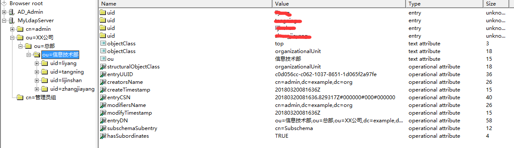
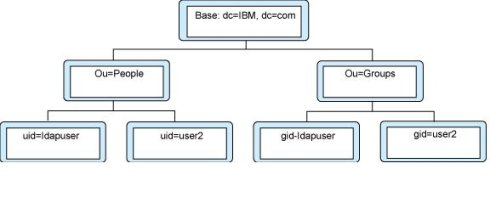

- [Spring Boot集成AD域实现统一用户认证](https://cloud.tencent.com/developer/article/2055616)
- [Spring Security Kerberos Document](https://spring.io/projects/spring-security-kerberos/)
- [Spring Security Kerberos Github](https://github.com/spring-projects/spring-security-kerberos)
- [Spring Security Kerberos 环境搭建](https://blog.csdn.net/weixin_44417481/article/details/127939023)
- [初识 Windows域认证体系 Kerberos认证](https://zhuanlan.zhihu.com/p/77873456)
- [Make spring boot web app support Windows Integrated Authentication using AD user](https://learn.microsoft.com/en-us/answers/questions/1202298/make-spring-boot-web-app-support-windows-integrate)
- [Spring Application with SSO using Windows Credentials(via Kerberos)](https://stackoverflow.com/questions/72620401/spring-application-with-sso-using-windows-credentialsvia-kerberos)
- [Java SSO: Kerberos authentication against Active Directory](https://stackoverflow.com/questions/3118799/java-sso-kerberos-authentication-against-active-directory)

## 1. 引言
由于近期需要开发基于JWT Token的统一身份认证服务项目， 因此需要集成公司原有的AD域实现用户的身份认证问题， 项目采用Spring Boot框架进行开发， 在此将相应的集成开发步骤进行记录。

### 1.1 LDAP简介
目录是一个为查询、浏览和搜索而优化的专业分布式数据库，它呈树状结构组织数据，就好象Linux/Unix系统中的文件目录一样。目录数据库和关系数据库不同，它有优异的读性能，但写性能差，并且没有事务处理、回滚等复杂功能，不适于存储修改频繁的数据。目录服务是由目录数据库和一套访问协议组成的系统。类似以下的信息适合储存在目录中：

企业员工信息，如姓名、电话、邮箱等；
公用证书和安全密钥；
公司的物理设备信息，如服务器，它的IP地址、存放位置、厂商、购买时间等；
LDAP（Lightweight Directory Access Protocol）是基于目录服务的轻量目录访问协议，它是基于X.500标准而发展起来的，但是它更加简单，并且可以根据需要定制。与X.500不同，LDAP支持TCP/IP，这对访问Internet是必须的。

#### LDAP具有如下特点：

- LDAP的结构用树来表示，而不是用表格；
- LDAP可以很快地得到查询结果，不过在写方面，效率比较差；
- LDAP提供了静态数据的快速查询方式；
- 基于Client/Server模型，Server 用于存储数据，Client提供操作目录信息树的工具；
- LDAP是一种基于X.500协议的互联网开放标准，LDAP协议是跨平台的互联网协议。

LDAP目录中的信息是按照树型结构进行组织的，具体信息存储在条目(Entry)的数据结构中。条目相当于关系数据库中表的记录；条目是具有唯一标志名称DN （Distinguished Name）的属性（Attribute），DN是用来引用条目的，DN相当于关系数据库表中的关键字（Primary Key）。属性（Attribute）由类型（Type）和一个或多个值（Values）组成，相当于关系数据库中的字段（Field）由字段名和数据类型组成，只是为了方便检索的需要，LDAP中的Type可以有多个Value，而不是关系数据库中为降低数据的冗余性要求实现的各个域必须是不相关的。LDAP中条目的组织一般按照地理位置和组织关系进行组织，非常的直观。LDAP把数据存放在文件中，为提高效率可以使用基于索引的文件数据库，而不是关系数据库。



LDAP的信息是以树型结构存储（如下图所示）的，在树根一般定义国家(c=CN)或域名(dc=com)，在其下则往往定义一个或多个组织 (Organization)(o=Acme)或组织单元(Organizational units) (ou=People)。一个组织单元可能包含诸如所有雇员、大楼内的所有设备等信息。此外，LDAP支持对条目能够和必须支持哪些属性进行控制，这是有一个特殊的称为对象类别(objectClass)的属性来实现的。该属性的值决定了该条目必须遵循的一些规则，其规定了该条目能够及至少应该包含哪些属性。例如：inetOrgPerson对象类需要支持sn(surname)和cn(common name)属性，但也可以包含可选的如邮件，电话号码等属性。



### 1.2 LDAP常见简称
| 简称 | 全称              | 用途       |
| ---- | ----------------- | ---------- |
| o    | organizaiton      | 组织/公司  |
| ou   | Organizaiton Unit | 组织单元   |
| c    | Country           | 国家       |
| dc   | Domain Component  | 域名       |
| sn   | Suer Name         | 真实名称   |
| cn   | Common Name       | 常用名称   |
| dn   | Distiguished Name | 唯一标识名 |
| uid  | User ID           | 用户标识   |

### 1.3 AD域与LDAP的区别
Windows AD(Active Directory)域应该是LDAP的一个应用实例，而不应该是LDAP本身。Windows AD域的用户、权限管理应该是微软公司使用LDAP存储了一些数据来解决域控这个具体问题，AD域提供了相关的用户接口，我们可以把AD域当做微软定制的LDAP服务器。Active Directory先实现一个LDAP服务器，然后自己先用这个LDAP服务器实现了自己的一个具体应用。

## 2. Spring Boot集成LDAP配置
在pom.xml中添加Maven依赖

```xml
<!-- LDAP Module -->
<dependency>
  <groupId>org.springframework.boot</groupId>
  <artifactId>spring-boot-starter-data-ldap</artifactId>
</dependency>
<!-- JPA Module -->
<dependency>
  <groupId>org.springframework.boot</groupId>
  <artifactId>spring-boot-starter-data-jpa</artifactId>
</dependency>
```

项目依赖包`spring-boot-starter-data-ldap`是Spring Boot封装的对LDAP自动化配置的实现，它是基于spring-data-ldap来对LDAP服务端进行具体操作的。

### 2.1 方法1. 自定义LdapTemplate配置
1. 在项目应用配置文件application.yml中添加AD域配置

```yaml
# AD Config
ldap:
  url: "ldap://192.168.1.1:389"
  base: DC=example,DC=com
  userDn: "administrator@example.com"
  userPwd: 123456
  referral: follow
  domainName: "%s@example.com"
```

2. 在Spring Boot中启动AD域配置

```java
package com.garyond.hurricane.myservice.config;

import org.springframework.beans.factory.annotation.Value;
import org.springframework.context.annotation.Bean;
import org.springframework.context.annotation.Configuration;
import org.springframework.ldap.core.LdapTemplate;
import org.springframework.ldap.core.support.LdapContextSource;

@Configuration
public class LdapConfig { 
   

    @Value("${ldap.url}")
    private String ldapUrl;

    @Value("${ldap.base}")
    private String ldapBase;

    @Value("${ldap.userDn}")
    private String ldapUserDn;

    @Value("${ldap.userPwd}")
    private String ldapUserPwd;

    @Value("${ldap.referral}")
    private String ldapReferral;


    /* * SpringLdap的javaConfig注入方式 */
    @Bean
    public LdapTemplate ldapTemplate() {
        return new LdapTemplate(contextSourceTarget());
    }

    /* * SpringLdap的javaConfig注入方式 */
    @Bean
    public LdapContextSource contextSourceTarget() {
        LdapContextSource ldapContextSource = new LdapContextSource();

        ldapContextSource.setUrl(ldapUrl);
        ldapContextSource.setBase(ldapBase);
        ldapContextSource.setUserDn(ldapUserDn);
        ldapContextSource.setPassword(ldapUserPwd);
        ldapContextSource.setReferral(ldapReferral);
        return ldapContextSource;
    }
}
```

3. 使用LdapTemplate操作LDAP

```java
@Service
public class LdapServiceImpl implements LdapService { 
   

    @Autowired
    private LdapTemplate ldapTemplate;

    @Value("${ldap.domainName}")
    private String ldapDomainName;

    @Value("${ldap.base}")
    private String ldapBaseDn;

    /** * 获取部门列表 */
    @Override
    public List<String> getDepartmentList(String ldapBase, Filter filter) {
        return ldapTemplate.search(ldapBase, filter.encode(), new AttributesMapper() {
            @Override
            public String mapFromAttributes(Attributes attr) throws NamingException {
                String distinguishedName = (String)attr.get("distinguishedName").get();
                distinguishedName = StringUtils.substringBefore(distinguishedName,ldapBaseDn);

                return StringUtils.substringBeforeLast(distinguishedName, ",");
            }
        });
    }

    /** * 获取用户列表 */
    @Override
    public List<User> getPersonList(String ldapBase, Filter filter) {
        return ldapTemplate.search(ldapBase, filter.encode(), new AttributesMapper() {
            @Override
            public User mapFromAttributes(Attributes attr) throws NamingException {
                User person = new User();
                String distingugihedName = (String)attr.get("distinguishedName").get();
                person.setUserName((String)attr.get("username").get());
                person.setEmail((String)attr.get("mail").get());
                person.setRealName((String)attr.get("name").get());
                if (null != attr.get("mobile")) {
                    person.setMobile((String) attr.get("mobile").get());
                }
                if (null != attr.get("telephoneNumber")) {
                    person.setPhone((String) attr.get("telephoneNumber").get());
                }
                person.setLdapFlag(1);
                String departmentName = StringUtils.substringAfter(distingugihedName.split(",")[1], "OU=");
                person.setUnitName(departmentName);
                return person;
            }
        });
    }

    /* * 身份认证 */
    @Override
    public boolean authenticate(String userName, String password) {

        //String userDomainName = getDnForUser(userName);

        String userDomainName = String.format(ldapDomainName, userName);

        DirContext ctx = null;

        try {
            ctx = ldapTemplate.getContextSource().getContext(userDomainName,password);
            return true;

        } catch(Exception e) {
            e.printStackTrace();
        } finally {
            LdapUtils.closeContext(ctx);
        }

        return false;
    }
}
```

**注：** 此处没有使用Spring Data Ldap项目包中的完成自动配置， 而是使用自定义的Ldap操作。
 

### 2.2 方法2. 使用Spring Data Ldap自动配置
1. 在项目应用配置文件application.yml中添加AD域配置

使用Spring Data Ldap项目包连接LDAP服务器可以采用以下的配置方式：

```yaml
spring:
    ldap:
       urls: ldap://192.168.1.1:389
       base: DC=example,DC=com
       username: "administrator@example.com"
       password: 123456
```

2. 启用Ldap配置

在Spring Boot主应用程序中添加`@EnableLdapRepositories`注解

```java
@SpringBootApplication
@EnableLdapRepositories
public class MyServiceApplication { 
   

    public static void main(String[] args) {
        SpringApplication.run(MyServiceApplication.class, args);
    }
}
```

3. 定义LDAP中属性与Java中所定义实体的关系映射

```java
@Data
@Entry(base = "ou=XX公司,dc=example,dc=com", objectClasses = {
  
  "OrganizationalPerson", "Person", "top"})
public class User { 
   

    @Id
    private Name id;

    @DnAttribute(value = "distiguishedName")
    private String distinguishedName;

    @Attribute(name = "cn")
    private String commonName;

    @Attribute(name = "sn")
    private String suerName;

    @Atrributed(name = "email")
    private String email;

    ... ...

}
```

4. 创建LDAP对应的DAO操作

```java
/** * UserDao继承CrudRepository接口实现基于Ldap的增删改查操作 */
public interface UserDao extends CrudRepository<Person, Name> { 
}
```

通过上面3和4两个步骤的定义之后，已经将User对象与AD域存储的内容实现了实体映射关系，我们只需要使用`UserDao`就可以轻松的对LDAP的相应内容实现读写操作。

5. 创建单元测试用例读取所有用户的信息

```java
@RunWith(SpringRunner.class)
@SpringBootTest
public class ApplicationTests { 
   

    @Autowired
    private UserDao userDao;

    @Test
    public void findAll() throws Exception {
        userDao.findAll().forEach(p -> {
            System.out.println("Distigushed Name:" + p.distinguishedName);
        });
    }
}
```

## 参考文献
- [Spring Boot中使用LDAP来统一管理用户信息](http://blog.didispace.com/spring-boot-ldap-user/)
- [Spring LDAP 使用](https://my.oschina.net/sayi/blog/180123)
- [LDAP服务器的概念和原理简单介绍](https://www.cnblogs.com/yjd_hycf_space/p/7994597.html)

## 客户端电脑添加AD域
#### 4. 注册SPN（Service Principal Name）

一个SPN只能对应一个用户名，一个用户可以有多个SPN
```shell
# 查看帮助
setspn --help

# 添加SPN
setspn -A HTTP/win-srv01                srv01
setspn -A HTTP/win-srv01.ad-pisx.local  srv01

# 查看账号关联的SPN
setspn -L srv01

# 删除账号关联的SPN
setspn -D HTTP/win-srv01                srv01
setspn -D HTTP/win-srv01.ad-pisx.local  srv01

# 查询SPN信息
setspn -Q HTTP/win-srv01.ad-pisx.local
```

生成`tomcat.keytab`
```shell
# /out      输出文件路径
# /mapuser  映射用户
# /princ    关联的计算机
# /pass     映射用户的密码
# /kvno     版本
ktpass /out c:\tomcat.keytab /mapuser srv01@AD-PISX.LOCAL /princ HTTP/win-srv01.ad-pisx.local@AD-PISX.LOCAL /pass 'Admin123' /kvno 0 /crypto ALL

ktpass /out c:\tomcat.keytab /mapuser srv01@AD-PISX.LOCAL /princ HTTP/win-srv01.ad-pisx.local@AD-PISX.LOCAL /pass 'Admin123' /ptype KRB5_NT_PRINCIPAL /crypto All

ktpass /princ HTTP/YOUR_COMPUTER_NAME_HERE@YOUR_DOMAIN_HERE.COM /mapuser YOUR_USER_HERE /pass YOUR_PASSWORD_HERE /Target YOUR_DOMAIN_HERE.COM /out YOUR_KEYTAB_FILENAME_HERE.keytab /kvno 0 /crypto RC4-HMAC-NT /ptype KRB5_NT_PRINCIPAL
```