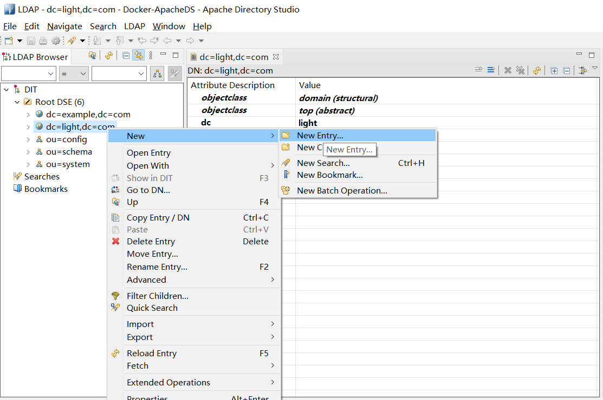

- [ApacheDS安装 [ LDAP和Kerberos ] 配置](https://blog.csdn.net/zhanglong_4444/article/details/114900046)

- [快速搭建Kerberos服务端及入门使用](https://www.cnblogs.com/yinzhengjie/p/10765503.html)

## 一 .前言
### 1.1. 安装包

| 组件                    | 下载地址                                                          |
| ----------------------- | ----------------------------------------------------------------- |
| JDK 17                  | https://openjdk.org/projects/jdk/17/ |
| ApacheDS                | http://directory.apache.org/apacheds/downloads.html               |
| Apache Directory Studio | https://directory.apache.org/studio/downloads.html                |
| 百度云盘                | https://pan.baidu.com/s/1GkFwUOhuMBdqZY8jx1p8Kg?password=4s3h     |


### 1.2. 名词含义

| 名词 | 全称              | 含义                                                       |
| ---- | ----------------- | ---------------------------------------------------------- |
| CN   | Common Name       | 为用户名或服务器名，最长可以到80个字符，可以为中文；       |
| OU   | Organization Unit | 为组织单元，最多可以有四级，每级最长32个字符，可以为中文； |
| DC   | Domain Component  | 域组件                                                     |

```shell
LDAP 目录类似于文件系统目录。 
下列目录： 
DC=redmond,DC=wa,DC=microsoft,DC=com       
如果我们类比文件系统的话，可被看作如下文件路径:    
Com\Microsoft\Wa\Redmond   

例如：CN=test,OU=developer,DC=domainname,DC=com 
在上面的代码中
 cn=test 可能代表一个用户名，
 ou=developer 代表一个 active directory 中的组织单位。

这句话的含义可能就是说明 :
test 这个对象处在domainname.com 域的 developer 组织单元中。
```

## 二 .安装apacheDS

### 2.1. 安装ApacheDS
设置安装目录，设置JDK位置

### 2.2. 安装Apache Directory Studio
**注意：** Apache Directory Studio 安装有点坑, 要求JDK必须为11以上. 需要修改 `ApacheDirectoryStudio.ini`

```ini
-startup
plugins/org.eclipse.equinox.launcher_1.6.0.v20200915-1508.jar
--launcher.library
plugins/org.eclipse.equinox.launcher.win32.win32.x86_64_1.2.0.v20200915-1442
/studio-rcp/resources/icons/linux/studio.xpm
###
#Uncomment_to_configure_the_language
#https://directory.apache.org/studio/faqs.html#how-to-set-the-language-of-studio
#-nl
#en
###
#Uncomment_to_configure_Java_version_to_use
#https://directory.apache.org/studio/faqs.html#how-to-set-the-java-vm-to-use
#-vm
#/usr/lib/jvm/java-11-openjdk/bin/java
-vm
D:/Develop/jdk/jdk-17/bin/java
-vmargs
-Dosgi.requiredJavaVersion=11
###
#Uncomment_to_configure_heap_memory
#https://directory.apache.org/studio/faqs.html#how-to-increase-the-heap-memory
#-Xms1g
#-Xmx2g
```

### 2.3. 配置连接

创建连接，设置连接信息，默认端口为: 10389


点击Next，设置用户信息


默认账号
- user：`uid=admin,ou=system` 
- password：`secret`

点击Finish保存即可


### 2.4. 设置分区
右击新建的连接名称`ApacheDS`，选择 `Open Configuration`，切换到`Partitions`页签


点击Add


- ID: light
- Suffix: dc=light,dc=com

Ctrl+S保存, 重启ApacheDS

### 2.5. 添加组
右键点击新建的 `Partition` - `New` - `New Entry`


点击 `Next`


选择`organizationUnit`点击`Add`


点击 `Next`


填入RDN信息 `ou` = `Group`，点击`Next`


点击`Finish`


## 三 .修改配置
### 3.1. linux用户schema
刷新 `ou=schema`


将`cn=nis`的属性`m-disabled`配置修改为`False`，修改之后就可以有`posixAccount`、`posixGroup`相关属性。


### 3.2. 添加测试组
断开连接，重新刷新


添加组，右键点击新建的 `ou=Group` - `New` - `New Entry`


点击`Next`


搜索`po`，如果没有值可以刷新一下


选择 `posixGroup`，点击`Add`


填入RDN信息 `cn` = `test`，点击`Next`


点击`Finish`


### 3.3. 添加用户
创建test.ldif文件
```ldif
dn: uid=test,ou=Group,dc=light,dc=com
uid: test
cn: test
objectClass: account
objectClass: posixAccount
objectClass: top
objectClass: shadowAccount
userPassword: {crypt}!!
shadowLastChange: 18663
shadowMin: 0
shadowMax: 99999
shadowWarning: 7
loginShell: /bin/bash
uidNumber: 1000
gidNumber: 0
homeDirectory: /home/test
```

选择刚创建的文件导入用户


如果要覆盖之前的，可以勾选 `Overwrite existing logfile`


### 3.4. 修改用户密码
双击修改用户密码，将密码改为`test`


## 四 .LDAP用户同步
### 4.1. 安装LDAP client
前置环境处理

1. 关闭SELinux

```shell
[root@localhost ~]# setenforce 0
setenforce: SELinux is disabled
[root@localhost ~]# sed -i 's#SELINUX=enforcing#SELINUX=disabled#g' /etc/selinux/config 
[root@localhost ~]# grep SELINUX=disabled /etc/selinux/config
SELINUX=disabled
```

2. 关闭iptables

```shell
查看防火墙状态
firewall-cmd --state
停止firewall
systemctl stop firewalld.service
禁止firewall开机启动
systemctl disable firewalld.service
```

3. 在需要同步的物理机上执行安装指令

> yum install nss-pam-ldapd openldap-clients openldap -y

### 4.2. 配置LDAP client
1. 添加client服务器到LDAP服务,注意IP

```shell
[root@localhost ~]# authconfig --enablemkhomedir --disableldaptls --enableldap --enableldapauth --ldapserver="192.168.101.30:10389" --ldapbasedn="dc=yss,dc=com" --update

getsebool:  SELinux is disabled
[root@localhost ~]#
```

这个指令修改了/etc/nsswitch.conf 以及/etc/openldap/ldap.conf文件

2. /etc/nsswitch.conf

```shell
[root@localhost ~]# cat /etc/nsswitch.conf  |egrep -v "^#|^$"
passwd:     files sss ldap
shadow:     files sss ldap
group:      files sss ldap
hosts:      files dns myhostname
bootparams: nisplus [NOTFOUND=return] files
ethers:     files
netmasks:   files
networks:   files
protocols:  files
rpc:        files
services:   files sss
netgroup:   files sss ldap
publickey:  nisplus
automount:  files ldap
aliases:    files nisplus
[root@localhost ~]#

```

3. /etc/pam.d/system-auth

```shell
[root@localhost ~]# cat /etc/pam.d/system-auth
#%PAM-1.0
# This file is auto-generated.
# User changes will be destroyed the next time authconfig is run.
auth        required      pam_env.so
auth        required      pam_faildelay.so delay=2000000
auth        sufficient    pam_unix.so nullok try_first_pass
auth        requisite     pam_succeed_if.so uid >= 1000 quiet_success
auth        sufficient    pam_ldap.so use_first_pass
auth        required      pam_deny.so

account     required      pam_unix.so broken_shadow
account     sufficient    pam_localuser.so
account     sufficient    pam_succeed_if.so uid < 1000 quiet
account     [default=bad success=ok user_unknown=ignore] pam_ldap.so
account     required      pam_permit.so

password    requisite     pam_pwquality.so try_first_pass local_users_only retry=3 authtok_type=
password    sufficient    pam_unix.so sha512 shadow nullok try_first_pass use_authtok
password    sufficient    pam_ldap.so use_authtok
password    required      pam_deny.so

session     optional      pam_keyinit.so revoke
session     required      pam_limits.so
-session     optional      pam_systemd.so
session     [success=1 default=ignore] pam_succeed_if.so service in crond quiet use_uid
session     required      pam_unix.so
session     optional      pam_ldap.so
```

4. /etc/sysconfig/authconfig

```shell
[root@localhost ~]# more /etc/sysconfig/authconfig

USELDAP=yes
USELDAPAUTH=yes
USELOCAUTHORIZE=yes
USESHADOW=yes
....
```

5. /etc/ssh/sshd_config

```shell
[root@localhost ~]# cat /etc/ssh/sshd_config | grep UsePAM
# WARNING: 'UsePAM no' is not supported in Red Hat Enterprise Linux and may cause several
UsePAM yes
[root@localhost ~]#
```

### 4.3. 重启服务nslcd
```shell
[root@localhost ~]# systemctl restart nslcd
[root@localhost ~]# systemctl restart sshd
```

### 4.4. 验证
创建 test02.ldif文件
```ldif
dn: uid=test02,ou=Group,dc=yss,dc=com
uid: test02
cn: test02
objectClass: account
objectClass: posixAccount
objectClass: top
objectClass: shadowAccount
userPassword: {crypt}!!
shadowLastChange: 18663
shadowMin: 0
shadowMax: 99999
shadowWarning: 7
loginShell: /bin/bash
uidNumber: 6666
gidNumber: 666
homeDirectory: /home/test02
```

需要注意的事情 :

- uid 和 cn 一般都是相同的
- uidNumber 是用户的id , 这个一定要改, 要是不存在的用户组id
- loginShell 默认 /bin/bash 就行
- gidNumber 这个是用户组的id
- homeDirectory : 用户的home目录

使用su指令进行切换就行…
```shell
[root@localhost home]# su -l test02
创建目录 '/home/test02'。
上一次登录：三 3月 17 15:29:57 CST 2021pts/3 上
[test02@localhost ~]$ pwd
/home/test02
[test02@localhost ~]$ id
uid=6666(test02) gid=0(root) 组=0(root)
```

## 五 .Kerberos同步
### 5.1. 修改ApacheDS 配置，开启Kerberos KDC
选取对应的服务器 , 鼠标右键单击 `Open Configuration` .

打开配置页面，勾选上`Enable Kerberos Server`, `Enable Kerberos Change Password Server`，改完之后 `Control + S` 保存，


重启 ApacheDS 使配置生效。

### 5.2. 安装Kerberos client
安装Kerberos 客户端
```shell
yum install -y krb5-workstation krb5-libs krb5-auth-dialog 

```
- krb5-workstation 
- krb5-libs 
- krb5-auth-dialog 

### 5.3. 修改kerberos配置文件
修改`/etc/krb5.conf`文件, 配置kdc地址

> vim /etc/krb5.conf

```conf

```

### 5.4. 添加Kerberos认证用户
导入 `kdc-data.ldif` 到ldap ，文件内容如下

```ldif
dn: dc=light,dc=com
objectClass: dcObject
objectClass: organization
objectClass: top
dc: light
o: light.com

dn: ou=Users,dc=light,dc=com
objectClass: organizationalUnit
objectClass: top
ou: Users

dn: uid=hnelson,ou=Users,dc=light,dc=com
objectClass: top
objectClass: person
objectClass: inetOrgPerson
objectClass: krb5principal
objectClass: krb5kdcentry
cn: Horatio Nelson
sn: Nelson
uid: hnelson
userPassword: secret
krb5PrincipalName: hnelson@LIGHT.COM
krb5KeyVersionNumber: 0

dn: uid=krbtgt,ou=Users,dc=light,dc=com
objectClass: top
objectClass: person
objectClass: inetOrgPerson
objectClass: krb5principal
objectClass: krb5kdcentry
cn: KDC Service
sn: Service
uid: krbtgt
userPassword: secret
krb5PrincipalName: krbtgt/LIGHT.COM@LIGHT.COM
krb5KeyVersionNumber: 0

dn: uid=ldap,ou=Users,dc=light,dc=com
objectClass: top
objectClass: person
objectClass: inetOrgPerson
objectClass: krb5principal
objectClass: krb5kdcentry
cn: LDAP
sn: Service
uid: ldap
userPassword: randall
krb5PrincipalName: ldap/localhost@LIGHT.COM
krb5KeyVersionNumber: 0
```

通过Apache Directory Studio，右键点击连接名称 `ApacheDS` -> `Import` -> `LDIF Import` 选择指定文件。


导入成功


### 5.5. kerberos 验证

```shell
#输入密码 文件中指定的是secret
[root@localhost apacheds-2.0.0.AM2]# kinit hnelson
Password for hnelson@LIGHT.COM:

#查看ticket
[root@localhost apacheds-2.0.0.AM2]# klist
Ticket cache: KEYRING:persistent:0:0
Default principal: hnelson@LIGHT.COM

Valid starting       Expires              Service principal
2021-03-17T16:19:26  2021-03-18T16:19:12  krbtgt/LIGHT.COM@LIGHT.COM
	renew until 2021-03-24T16:19:12
```

### 5.6. kerberos 导出keytab文件
使用ktutil 导出keytab 文件

```shell
[root@localhost apacheds-2.0.0.AM2]# ktutil
ktutil:  add_entry -password -p hnelson@LIGHT.COM -k 1 -e aes128-cts-hmac-sha1-96
Password for hnelson@LIGHT.COM:
ktutil:  wkt /opt/hnelson.keytab
ktutil:  q
[root@localhost apacheds-2.0.0.AM2]#
```

add_entry 为每一种加密方式添加keytab ，然后用wkt 将keytab写入到文件。

### 5.7. 验证keytab文件
```shell
[root@localhost apacheds-2.0.0.AM2]#  kinit -kt  /opt/hnelson.keytab hnelson
[root@localhost apacheds-2.0.0.AM2]# klist
Ticket cache: KEYRING:persistent:0:0
Default principal: hnelson@LIGHT.COM

Valid starting       Expires              Service principal
2021-03-17T16:31:43  2021-03-18T16:31:38  krbtgt/LIGHT.COM@LIGHT.COM
	renew until 2021-03-24T16:31:38
```

## 六 .linux与kerberos用户统一
1. sman用户的ldif配置

**注意** 要和kerberos的认证在同一个域下面.

```ldif
dn: uid=sman,ou=Users,dc=light,dc=com
objectClass: inetOrgPerson
objectClass: krb5KDCEntry
objectClass: krb5Principal
objectClass: organizationalPerson
objectClass: person
objectClass: posixAccount
objectClass: shadowAccount
objectClass: top
cn: sman
gidNumber: 666
homeDirectory: /home/sman
krb5KeyVersionNumber: 1
krb5PrincipalName: sman@LIGHT.COM
sn: sman
uid: sman
uidNumber: 6668
krb5Key:: MBGgAwIBA6EKBAgs3IwczpIjCA==
krb5Key:: MBmgAwIBEaESBBDZ4KQ8CUaBfkx/xz+Mo6nf
krb5Key:: MBmgAwIBF6ESBBA+wfd6dpePW9BH3npNz4gx
krb5Key:: MCGgAwIBEKEaBBhMSqjaSWQWy4yiAaQq6lgVdvhu1jjaFtM=
loginShell: /bin/bash
shadowLastChange: 18663
shadowMax: 99999
shadowMin: 0
shadowWarning: 7
userPassword:: e1NTSEF9eG5LRUJMNVljNTA4amtkQ3NBLzA2NW1QU3ltOEFVMS9KUjVOclE9PQ==
```

2. 直接导入即可.


3. 查看sman


4. 修改密码，更改后密码为 `sman`


5. 验证

```shell
[root@localhost conf]# su -l sman
创建目录 '/home/sman'。
[sman@localhost ~]$
[root@localhost ~]# kinit sman
Password for sman@LIGHT.COM:
[root@localhost ~]# klist
Ticket cache: KEYRING:persistent:0:krb_ccache_CwJLBLC
Default principal: sman@LIGHT.COM

Valid starting       Expires              Service principal
2021-03-17T17:28:23  2021-03-18T17:28:16  krbtgt/LIGHT.COM@LIGHT.COM
	renew until 2021-03-24T17:28:16
```

6. LDAP 服务器配置


- Address : kerberos-server-01
- Address : kerberos-server-01
- SASL Host: kerberos-server-01
- SASL principal: ldap/kerberos-server-01@LIGHT.COM
- Search Base DN: ou=Users,dc=light,dc=com
- SASL Realms: LIGHT.COM

7. Kerberos服务器配置


- Address : kerberos-server-01
- Address : kerberos-server-01
- Requeire Pre-Authentication By Encrypted Timestamp: 不勾选
- Search Base DN: ou=Users,dc=light,dc=com

## 七 .参考
- [ApacheDS使用详细教程](https://blog.csdn.net/weixin_41609807/article/details/114586185)
- [entOS7.4下OpenLDAP 的安装与配置及OpenLDAP主从主主](https://devopstack.cn/linux/394.html#22_SELinux)
- [apacheDS 配置kerberos](https://zhuanlan.zhihu.com/p/355985595)
