- [一个强大的作图工具Mermaid入门](https://www.cnblogs.com/wuxianfeng023/p/17174441.html)


## 参考网站:
- [在线编辑器](https://mermaid.live/edit)
- [官网](https://mermaid.js.org/intro/)

## 使用方法
- VS Code安装插件 `Markdown Preview Mermaid Support`
- 在Typora中选择` ```mermaid`即可，复杂的功能需要收费版可以显示
- 有些未实现的(实验性质的)或者你没有收费的typora的，那你可以用在线作图或者直接用`Mermaid-js`(npm或者其他工具安装即可)

如果要学更多的语法，请移步官网

## Demo
### 流程图 Flowcharts
```shell
graph TD;
    A-->B;
    A-->C;
    B-->D;
    C-->D;
```


### 时序图 Sequence Diagrams
```shell
sequenceDiagram
    Alice->>+John: Hello John, how are you?
    Alice->>+John: John, can you hear me?
    John-->>-Alice: Hi Alice, I can hear you!
    John-->>-Alice: I feel great!
```

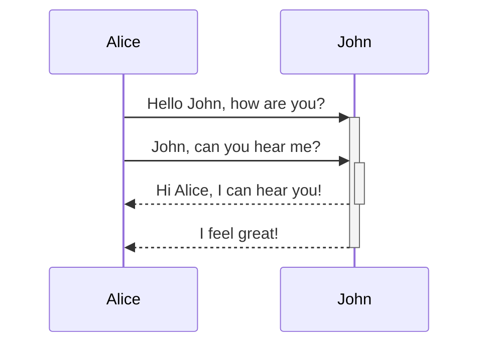

```shell
sequenceDiagram
    participant Alice
    participant Bob
    Alice->>John: Hello John, how are you?
    loop Healthcheck
        John->>John: Fight against hypochondria
    end
    Note right of John: Rational thoughts <br/>prevail!
    John-->>Alice: Great!
    John->>Bob: How about you?
    Bob-->>John: Jolly good!
```

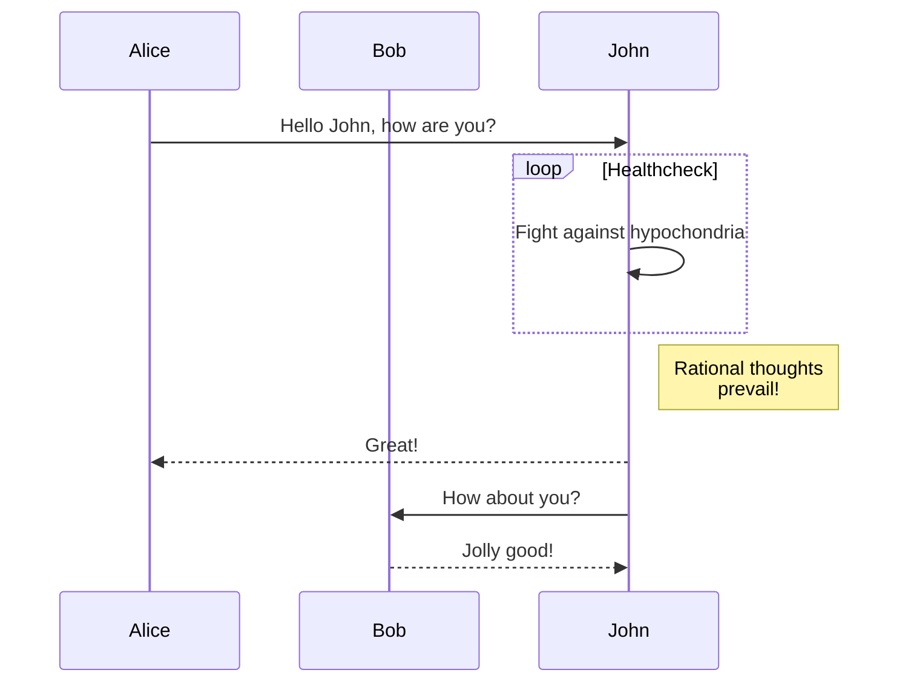

### 甘特图Gantt Diagrams
```shell
gantt
dateFormat  YYYY-MM-DD
title Adding GANTT diagram to mermaid
excludes weekdays 2014-01-10

section A section
Completed task            :done,    des1, 2014-01-06,2014-01-08
Active task               :active,  des2, 2014-01-09, 3d
Future task               :         des3, after des2, 5d
Future task2               :         des4, after des3, 5d
```

md中如果显示不出来，可能是你的typora没升级到1.XX版本，收费的能显示
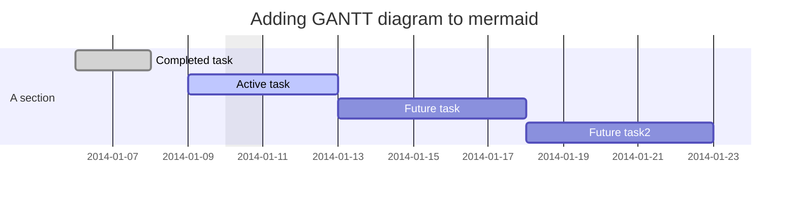

### 类图 Class Diagrams
```shell
classDiagram
Class01 <|-- AveryLongClass : Cool
Class03 *-- Class04
Class05 o-- Class06
Class07 .. Class08
Class09 --> C2 : Where am i?
Class09 --* C3
Class09 --|> Class07
Class07 : equals()
Class07 : Object[] elementData
Class01 : size()
Class01 : int chimp
Class01 : int gorilla
Class08 <--> C2: Cool label
```

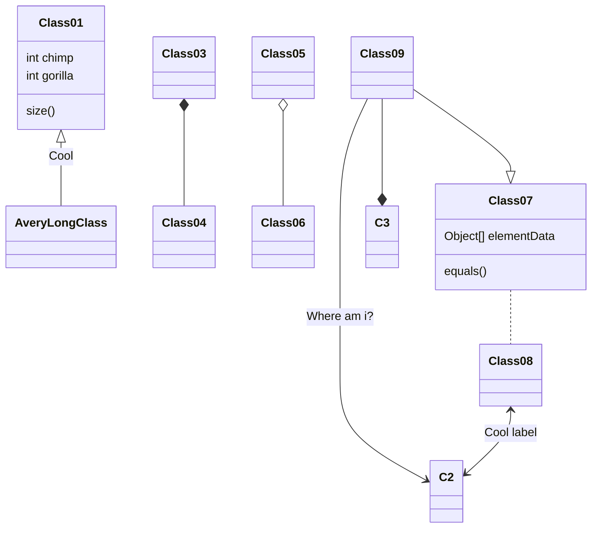

### Git图 GitGraph
```shell
    gitGraph
       commit
       commit
       branch develop
       commit
       commit
       commit
       checkout main
       commit
       commit
```

这里也显示不出来，应该是博客园本身集成的mermaid版本略低(好像是8.xx版本)
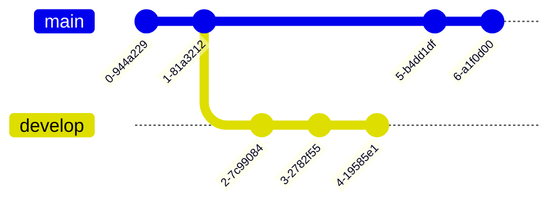

### 实体关系图 Entity Relationship Diagrams
```shell
erDiagram
    CUSTOMER ||--o{ ORDER : places
    ORDER ||--|{ LINE-ITEM : contains
    CUSTOMER }|..|{ DELIVERY-ADDRESS : uses
```

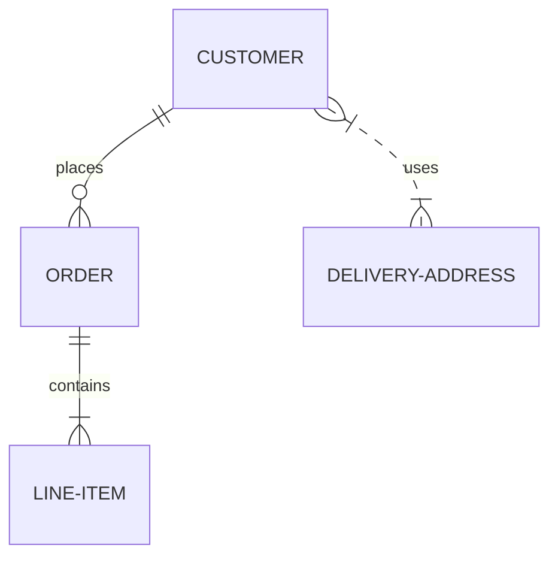

### User Journey Diagram
```shell
journey
    title My working day
    section Go to work
      Make tea: 5: Me
      Go upstairs: 3: Me
      Do work: 1: Me, Cat
    section Go home
      Go downstairs: 5: Me
      Sit down: 5: Me
```

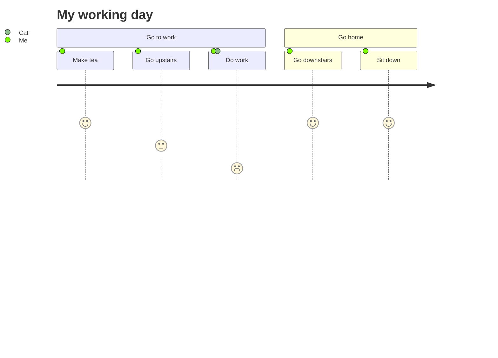

### 饼图 Pie chart Diagrams
```shell
pie title Pets adopted by volunteers
    "Dogs" : 386
    "Cats" : 85
    "Rats" : 15
```

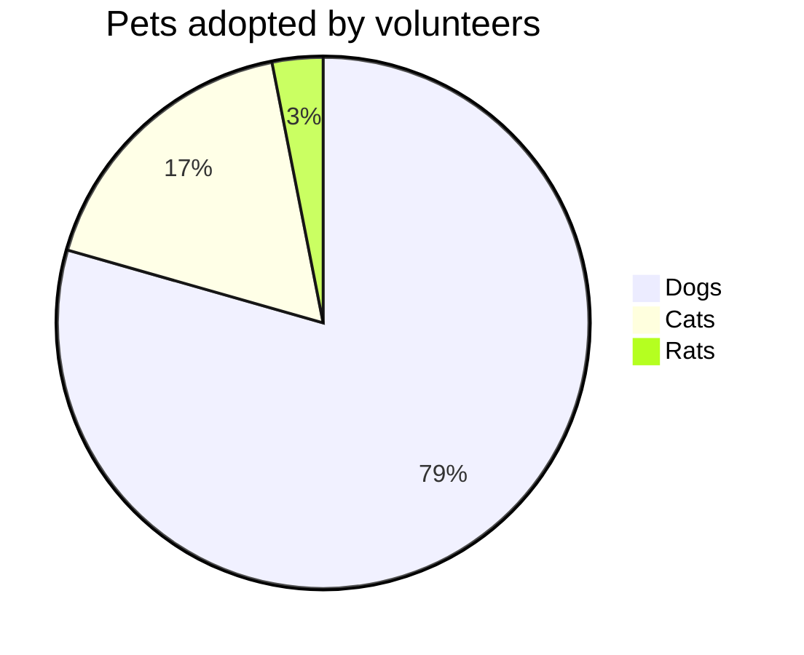

### 脑图 Mindmaps Diagrams
```shell
mindmap
  root((mindmap))
    Origins
      Long history
      ::icon(fa fa-book)
      Popularisation
        British popular psychology author Tony Buzan
    Research
      On effectiveness<br/>and features
      On Automatic creation
        Uses
            Creative techniques
            Strategic planning
            Argument mapping
    Tools
      Pen and paper
      Mermaid
```

同样显示不出来

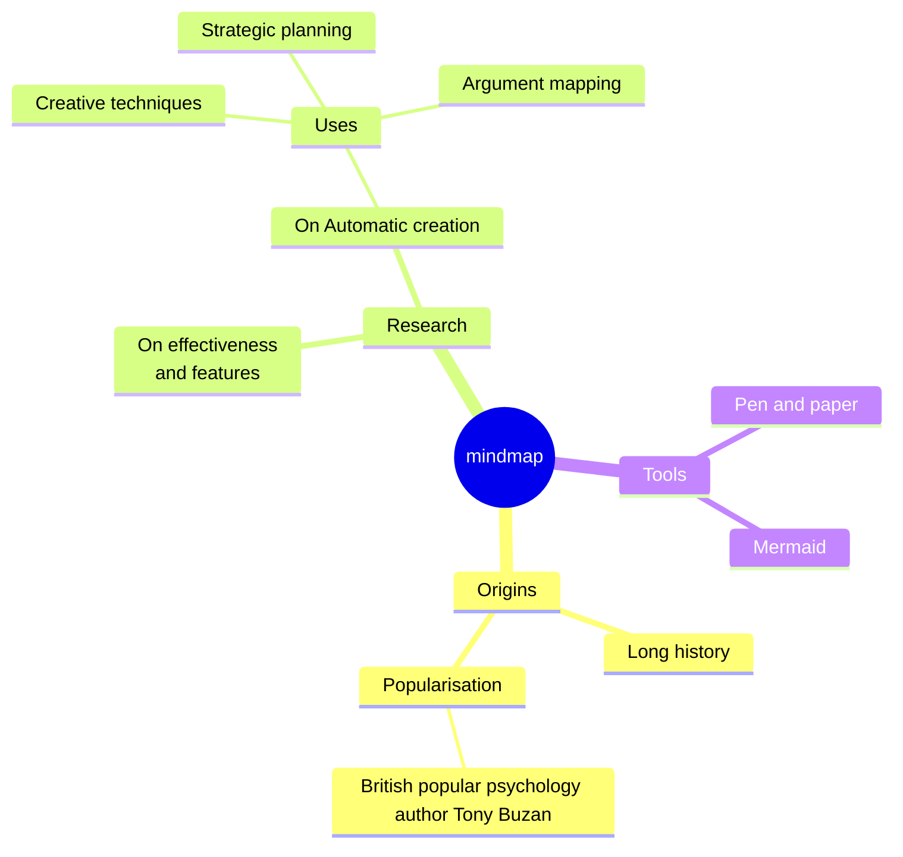

### Basic FR
```shell
graph LR
    A[Square Rect] -- Link text --> B((Circle))
    A --> C(Round Rect)
    B --> D{Rhombus}
    C --> D
```

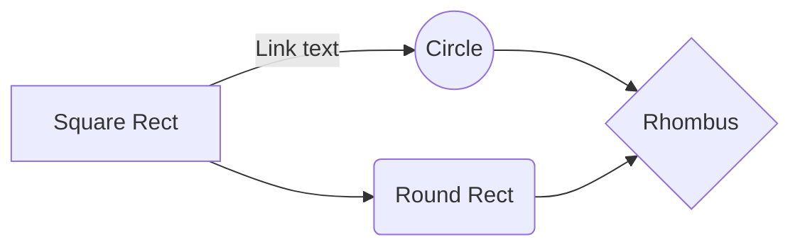

### 时间线 Timeline
```shell
timeline
    title History of Social Media Platform
    2002 : LinkedIn
    2004 : Facebook
         : Google
    2005 : Youtube
    2006 : Twitter
```

一样显示不出来
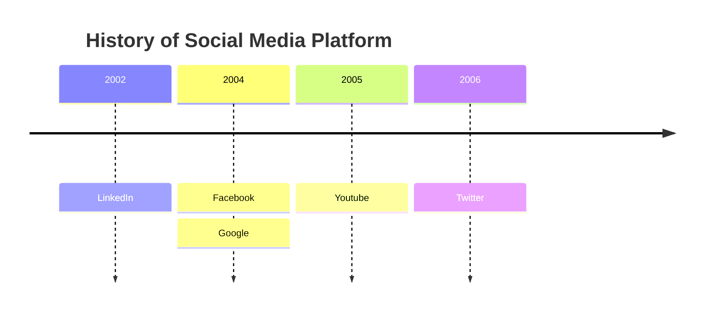


## 图标
### 方向
- TB - top to bottom 从上到下
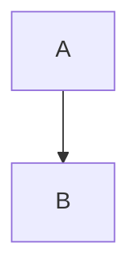

- TD - top-down/ same as top to bottom 自顶向下/类似从上至下


- BT - bottom to top 从下到上
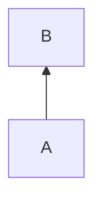

- RL - right to left 从右到左
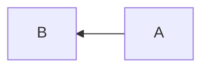

- LR - left to right 从左到右
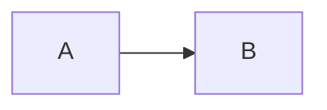

### 形状
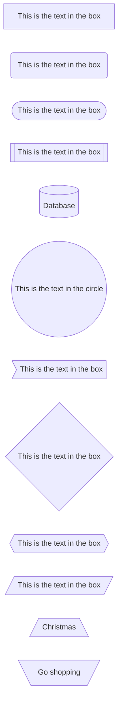

### 连线

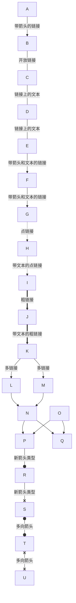
