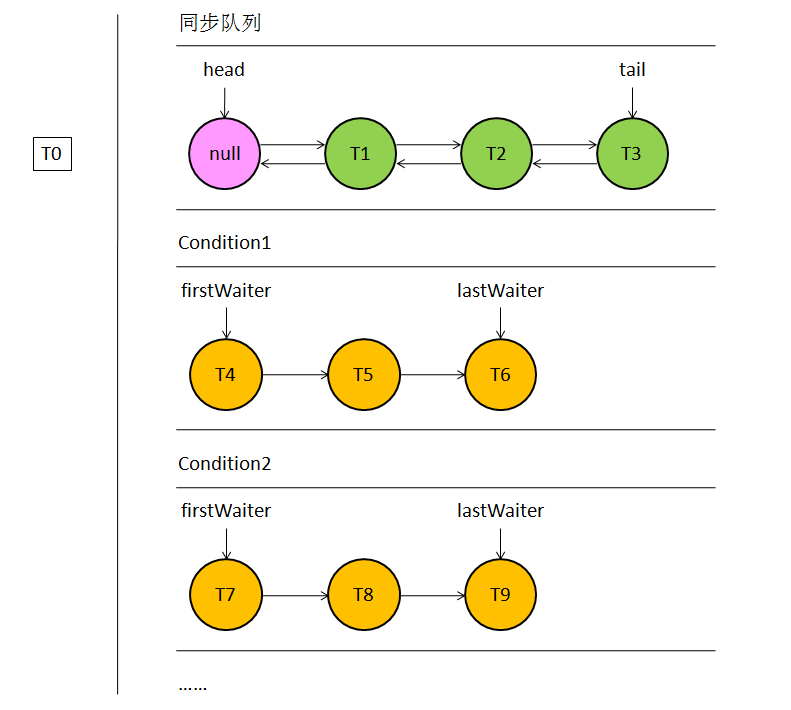
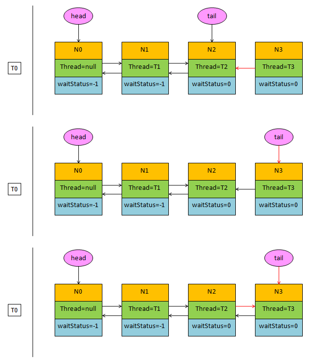
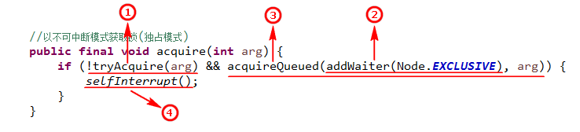

- [Java并发系列[1]----AbstractQueuedSynchronizer源码分析之概要分析](https://www.cnblogs.com/liuyun1995/p/8400663.html)
- [Java并发系列[2]----AbstractQueuedSynchronizer源码分析之独占模式](https://www.cnblogs.com/liuyun1995/p/8400724.html)
- [Java并发系列[3]----AbstractQueuedSynchronizer源码分析之共享模式](https://www.cnblogs.com/liuyun1995/p/8404877.html)
- [Java并发系列[4]----AbstractQueuedSynchronizer源码分析之条件队列](https://www.cnblogs.com/liuyun1995/p/8416340.html)

## 概要分析
学习Java并发编程不得不去了解一下`java.util.concurrent`这个包，这个包下面有许多我们经常用到的并发工具类，例如：`ReentrantLock`, `CountDownLatch`, `CyclicBarrier`, `Semaphore`等。而这些类的底层实现都依赖于`AbstractQueuedSynchronizer`这个类，由此可见这个类的重要性。所以在Java并发系列文章中我首先对`AbstractQueuedSynchronizer`这个类进行分析，由于这个类比较重要，而且代码比较长，为了尽可能分析的透彻一些，我决定用四篇文章对该类进行一个比较完整的介绍。本篇文章作为概要介绍主要是让读者们对该类有个初步了解。为了叙述简单，后续有些地方会用AQS代表这个类。

### 1. AbstractQueuedSynchronizer这个类是干嘛的？

相信要许多读者使用过`ReentrantLock`，但是却不知道`AbstractQueuedSynchronizer`的存在。其实`ReentrantLock`实现了一个内部类`Sync`，该内部类继承了`AbstractQueuedSynchronizer`，所有锁机制的实现都是依赖于Sync内部类，也可以说`ReentrantLock`的实现就是依赖于`AbstractQueuedSynchronizer`类。于此类似，`CountDownLatch`, `CyclicBarrier`, `Semaphore`这些类也是采用同样的方式来实现自己对于锁的控制。可见，`AbstractQueuedSynchronizer`是这些类的基石。那么`AQS`内部到底实现了什么以至于所以这些类都要依赖于它呢？可以这样说，`AQS`为这些类提供了基础设施，也就是提供了一个密码锁，这些类拥有了密码锁之后可以自己来设置密码锁的密码。此外，`AQS`还提供了一个排队区，并且提供了一个线程训导员，我们知道线程就像一个原始的野蛮人，它不懂得讲礼貌，它只会横冲直撞，所以你得一步一步去教它，告诉它什么时候需要去排队了，要到哪里去排队，排队前要做些什么，排队后要做些什么。这些教化工作全部都由`AQS`帮你完成了，从它这里教化出来的线程都变的非常文明懂礼貌，不再是原始的野蛮人，所以以后我们只需要和这些文明的线程打交道就行了，千万不要和原始线程有过多的接触！

### 2. 为何说AbstractQueuedSynchronizer提供了一把密码锁？

```java
//同步队列的头结点
private transient volatile Node head;

//同步队列的尾结点
private transient volatile Node tail;

//同步状态
private volatile int state;

//获取同步状态
protected final int getState() {
    return state;
}

//设置同步状态
protected final void setState(int newState) {
    state = newState;
}

//以CAS方式设置同步状态
protected final boolean compareAndSetState(int expect, int update) {
    return unsafe.compareAndSwapInt(this, stateOffset, expect, update);
}
```

上面的代码列出了`AQS`的所有成员变量，可以看到AQS的成员变量只有三个，分别是同步队列头结点引用，同步队列尾结点引用以及同步状态。注意，这三个成员变量都使用了`volatile`关键字进行修饰，这就确保了多个线程对它的修改都是内存可见的。整个类的核心就是这个同步状态，可以看到同步状态其实就是一个int型的变量，大家可以把这个同步状态看成一个密码锁，而且还是从房间里面锁起来的密码锁，`state`具体的值就相当于密码控制着密码锁的开合。当然这个锁的密码是多少就由各个子类来规定了，例如在`ReentrantLock`中，`state`等于0表示锁是开的，`state`大于0表示锁是锁着的，而在`Semaphore`中，`state`大于0表示锁是开的，`state`等于0表示锁是锁着的。

### 3. AbstractQueuedSynchronizer的排队区是怎样实现的？



`AbstractQueuedSynchronizer`内部其实有两个排队区，一个是同步队列，一个是条件队列。从上图可以看出，同步队列只有一条，而条件队列可以有多条。同步队列的结点分别持有前后结点的引用，而条件队列的结点只有一个指向后继结点的引用。图中T表示线程，每个结点包含一个线程，线程在获取锁失败后首先进入同步队列排队，而想要进入条件队列该线程必须持有锁才行。接下来我们看看队列中每个结点的结构。

```java
//同步队列的结点
static final class Node {

    static final Node SHARED = new Node(); //表示当前线程以共享模式持有锁

    static final Node EXCLUSIVE = null;    //表示当前线程以独占模式持有锁

    static final int CANCELLED =  1;       //表示当前结点已经取消获取锁

    static final int SIGNAL    = -1;       //表示后继结点的线程需要运行

    static final int CONDITION = -2;       //表示当前结点在条件队列中排队

    static final int PROPAGATE = -3;       //表示后继结点可以直接获取锁

    volatile int waitStatus; //表示当前结点的等待状态

    volatile Node prev;      //表示同步队列中的前继结点

    volatile Node next;      //表示同步队列中的后继结点

    volatile Thread thread;  //当前结点持有的线程引用

    Node nextWaiter;         //表示条件队列中的后继结点

    //当前结点状态是否是共享模式
    final boolean isShared() {
        return nextWaiter == SHARED;
    }

    //返回当前结点的前继结点
    final Node predecessor() throws NullPointerException {
        Node p = prev;
        if (p == null) {
            throw new NullPointerException();
        } else {
            return p;
        }
    }

    //构造器1
    Node() {}

    //构造器2, 默认用这个构造器
    Node(Thread thread, Node mode) {
        //注意持有模式是赋值给nextWaiter
        this.nextWaiter = mode;
        this.thread = thread;
    }

    //构造器3, 只在条件队列中用到
    Node(Thread thread, int waitStatus) {
        this.waitStatus = waitStatus;
        this.thread = thread;
    }
}
```

`Node`代表同步队列和条件队列中的一个结点，它是`AbstractQueuedSynchronizer`的内部类。`Node`有很多属性，比如持有模式，等待状态，同步队列中的前继和后继，以及条件队列中的后继引用等等。可以把同步队列和条件队列看成是排队区，每个结点看成是排队区的座位，将线程看成是排队的客人。客人刚来时会先去敲敲门，看看锁有没有开，如果锁没开它就会去排队区领取一个号码牌，声明自己想要以什么样的方式来持有锁，最后再到队列的末尾进行排队。

### 4. 怎样理解独占模式和共享模式？

前面讲到每个客人在排队前会领取一个号码牌，声明自己想要以什么样的方式来占有锁，占有锁的方式分为独占模式和共享模式，那么怎样来理解独占模式和共享模式呢？实在找不到什么好的比喻，大家可以联想一下公共厕所，独占模式的人比较霸道，老子要么就不进，进来了就不许别人再进了，自己一个人独自占用整个厕所。共享模式的人就没那么讲究了，当它发现这个厕所已经可以用了之后，它自己进来还不算，还得热心的问下后面的人介不介意一起用，如果后面的人不介意一起使用那就不用再排队了大家一起上就是了， 当然如果后面的人介意那就只好留在队列里继续排队了。

### 5. 怎样理解结点的等待状态？

我们还看到每个结点都有一个等待状态，这个等待状态分为`CANCELLED`，`SIGNAL`，`CONDITION`，`PROPAGATE`四种状态。可以将这个等待状态看作是挂在座位旁边的牌子，标识当前座位上的人的等待状态。这个牌子的状态不仅自己可以修改，其他人也可以修改。例如当这个线程在排队过程中已经打算放弃了，它就会将自己座位上的牌子设置为`CANCELLED`，这样其他人看到了就可以将它清理出队列。还有一种情况是，当线程在座位上要睡着之前，它怕自己睡过了头，就会将前面位置上的牌子改为`SIGNAL`，因为每个人在离开队列前都会回到自己座位上看一眼，如果看到牌子上状态为`SIGNAL`，它就会去唤醒下一个人。只有保证前面位置上的牌子为`SIGNAL`，当前线程才会安心的睡去。`CONDITION`状态表示该线程在条件队列中排队，`PROPAGATE`状态提醒后面来的线程可以直接获取锁，这个状态只在共享模式用到，后面单独讲共享模式的时候会讲到。

### 6. 结点进入同步队列时会进行哪些操作？

```java
//结点入队操作, 返回前一个结点
private Node enq(final Node node) {
    for (;;) {
        //获取同步队列尾结点引用
        Node t = tail;
        //如果尾结点为空说明同步队列还没有初始化
        if (t == null) {
            //初始化同步队列
            if (compareAndSetHead(new Node())) {
                tail = head;
            }
        } else {
            //1.指向当前尾结点
            node.prev = t;
            //2.设置当前结点为尾结点
            if (compareAndSetTail(t, node)) {
                //3.将旧的尾结点的后继指向新的尾结点
                t.next = node;
                //for循环唯一的出口
                return t;
            }
        }
    }
}
```



注意，入队操作使用一个死循环，只有成功将结点添加到同步队列尾部才会返回，返回结果是同步队列原先的尾结点。下图演示了整个操作过程。


读者需要注意添加尾结点的顺序，分为三步：指向尾结点，CAS更改尾结点，将旧尾结点的后继指向当前结点。在并发环境中这三步操作不一定能保证完成，所以在清空同步队列所有已取消的结点这一操作中，为了寻找非取消状态的结点，不是从前向后遍历而是从后向前遍历的。还有就是每个结点进入队列中时它的等待状态是为0，只有后继结点的线程需要挂起时才会将前面结点的等待状态改为SIGNAL。

**注：** 以上全部分析基于JDK1.7，不同版本间会有差异，读者需要注意


## 独占模式
在上一篇[《Java并发系列[1]----AbstractQueuedSynchronizer源码分析之概要分析》](https://www.cnblogs.com/liuyun1995/p/8400663.html)中我们介绍了`AbstractQueuedSynchronizer`基本的一些概念，主要讲了AQS的排队区是怎样实现的，什么是独占模式和共享模式以及如何理解结点的等待状态。理解并掌握这些内容是后续阅读AQS源码的关键，所以建议读者先看完我的上一篇文章再回过头来看这篇就比较容易理解。在本篇中会介绍在独占模式下结点是怎样进入同步队列排队的，以及离开同步队列之前会进行哪些操作。`AQS`为在独占模式和共享模式下获取锁分别提供三种获取方式：不响应线程中断获取，响应线程中断获取，设置超时时间获取。这三种方式整体步骤大致是相同的，只有少部分不同的地方，所以理解了一种方式再看其他方式的实现都是大同小异。在本篇中我会着重讲不响应线程中断的获取方式，其他两种方式也会顺带讲一下不一致的地方。

### 1. 怎样以不响应线程中断获取锁？

```java
//不响应中断方式获取(独占模式)
public final void acquire(int arg) {
    if (!tryAcquire(arg) && acquireQueued(addWaiter(Node.EXCLUSIVE), arg)) {
        selfInterrupt();
    }
}
```

上面代码中虽然看起来简单，但是它按照顺序执行了下图所示的4个步骤。下面我们会逐个步骤进行演示分析。



#### 第一步：`!tryAcquire(arg)`

```java
//尝试去获取锁(独占模式)
protected boolean tryAcquire(int arg) {
    throw new UnsupportedOperationException();
}
```

这时候来了一个人，他首先尝试着去敲了敲门，如果发现门没锁(tryAcquire(arg)=true)，那就直接进去了。如果发现门锁了(tryAcquire(arg)=false)，就执行下一步。这个tryAcquire方法决定了什么时候锁是开着的，什么时候锁是关闭的。这个方法必须要让子类去覆盖，重写里面的判断逻辑。

#### 第二步：`addWaiter(Node.EXCLUSIVE)`

```java
//将当前线程包装成结点并添加到同步队列尾部
private Node addWaiter(Node mode) {
    //指定持有锁的模式
    Node node = new Node(Thread.currentThread(), mode);
    //获取同步队列尾结点引用
    Node pred = tail;
    //如果尾结点不为空, 表明同步队列已存在结点
    if (pred != null) {
        //1.指向当前尾结点
        node.prev = pred;
        //2.设置当前结点为尾结点
        if (compareAndSetTail(pred, node)) {
            //3.将旧的尾结点的后继指向新的尾结点
            pred.next = node;
            return node;
        }
    }
    //否则表明同步队列还没有进行初始化
    enq(node);
    return node;
}

//结点入队操作
private Node enq(final Node node) {
    for (;;) {
        //获取同步队列尾结点引用
        Node t = tail;
        //如果尾结点为空说明同步队列还没有初始化
        if (t == null) {
            //初始化同步队列
            if (compareAndSetHead(new Node())) {
                tail = head;
            }
        } else {
            //1.指向当前尾结点
            node.prev = t;
            //2.设置当前结点为尾结点
            if (compareAndSetTail(t, node)) {
                //3.将旧的尾结点的后继指向新的尾结点
                t.next = node;
                return t;
            }
        }
    }
}
```

执行到这一步表明第一次获取锁失败，那么这个人就给自己领了块号码牌进入排队区去排队了，在领号码牌的时候会声明自己想要以什么样的方式来占用房间(独占模式or共享模式)。注意，这时候他并没有坐下来休息(将自己挂起)哦。

#### 第三步：`acquireQueued(addWaiter(Node.EXCLUSIVE), arg)`

```java
//以不可中断方式获取锁(独占模式)
final boolean acquireQueued(final Node node, int arg) {
    boolean failed = true;
    try {
        boolean interrupted = false;
        for (;;) {
            //获取给定结点的前继结点的引用
            final Node p = node.predecessor();
            //如果当前结点是同步队列的第一个结点, 就尝试去获取锁
            if (p == head && tryAcquire(arg)) {
                //将给定结点设置为head结点
                setHead(node);
                //为了帮助垃圾收集, 将上一个head结点的后继清空
                p.next = null;
                //设置获取成功状态
                failed = false;
                //返回中断的状态, 整个循环执行到这里才是出口
                return interrupted;
            }
            //否则说明锁的状态还是不可获取, 这时判断是否可以挂起当前线程
            //如果判断结果为真则挂起当前线程, 否则继续循环, 在这期间线程不响应中断
            if (shouldParkAfterFailedAcquire(p, node) && parkAndCheckInterrupt()) {
                interrupted = true;
            }
        }
    } finally {
        //在最后确保如果获取失败就取消获取
        if (failed) {
            cancelAcquire(node);
        }
    }
}

//判断是否可以将当前结点挂起
private static boolean shouldParkAfterFailedAcquire(Node pred, Node node) {
    //获取前继结点的等待状态
    int ws = pred.waitStatus;
    //如果前继结点状态为SIGNAL, 表明前继结点会唤醒当前结点, 所以当前结点可以安心的挂起了
    if (ws == Node.SIGNAL) {
        return true;
    }
    
    if (ws > 0) {
        //下面的操作是清理同步队列中所有已取消的前继结点
        do {
            node.prev = pred = pred.prev;
        } while (pred.waitStatus > 0);
        pred.next = node;
    } else {
        //到这里表示前继结点状态不是SIGNAL, 很可能还是等于0, 这样的话前继结点就不会去唤醒当前结点了
        //所以当前结点必须要确保前继结点的状态为SIGNAL才能安心的挂起自己
        compareAndSetWaitStatus(pred, ws, Node.SIGNAL);
    }
    return false;
}

//挂起当前线程
private final boolean parkAndCheckInterrupt() {
    LockSupport.park(this);
    return Thread.interrupted();
}
```

领完号码牌进入排队区后就会立马执行这个方法，当一个结点首次进入排队区后有两种情况，一种是发现他前面的那个人已经离开座位进入房间了，那他就不坐下来休息了，会再次去敲一敲门看看那小子有没有完事。如果里面的人刚好完事出来了，都不用他叫自己就直接冲进去了。否则，就要考虑坐下来休息一会儿了，但是他还是不放心，如果他坐下来睡着后没人提醒他怎么办？他就在前面那人的座位上留一个小纸条，好让从里面出来的人看到纸条后能够唤醒他。还有一种情况是，当他进入排队区后发现前面还有好几个人在座位上排队呢，那他就可以安心的坐下来咪一会儿了，但在此之前他还是会在前面那人(此时已经睡着了)的座位上留一个纸条，好让这个人在走之前能够去唤醒自己。当一切事情办妥了之后，他就安安心心的睡觉了，注意，我们看到整个for循环就只有一个出口，那就是等线程成功的获取到锁之后才能出去，在没有获取到锁之前就一直是挂在for循环的`parkAndCheckInterrupt()`方法里头。线程被唤醒后也是从这个地方继续执行for循环。

#### 第四步：`selfInterrupt()`
```java
//当前线程将自己中断
private static void selfInterrupt() {
    Thread.currentThread().interrupt();
}
```

由于上面整个线程一直是挂在for循环的`parkAndCheckInterrupt()`方法里头，没有成功获取到锁之前不响应任何形式的线程中断，只有当线程成功获取到锁并从for循环出来后，他才会查看在这期间是否有人要求中断线程，如果是的话再去调用`selfInterrupt()`方法将自己挂起。

### 2. 怎样以响应线程中断获取锁？

```java
//以可中断模式获取锁(独占模式)
private void doAcquireInterruptibly(int arg) throws InterruptedException {
    //将当前线程包装成结点添加到同步队列中
    final Node node = addWaiter(Node.EXCLUSIVE);
    boolean failed = true;
    try {
        for (;;) {
            //获取当前结点的前继结点
            final Node p = node.predecessor();
            //如果p是head结点, 那么当前线程就再次尝试获取锁
            if (p == head && tryAcquire(arg)) {
                setHead(node);
                p.next = null; // help GC
                failed = false;
                //获取锁成功后返回
                return;
            }
            //如果满足条件就挂起当前线程, 此时响应中断并抛出异常
            if (shouldParkAfterFailedAcquire(p, node) && parkAndCheckInterrupt()) {
                //线程被唤醒后如果发现中断请求就抛出异常
                throw new InterruptedException();
            }
        }
    } finally {
        if (failed) {
            cancelAcquire(node);
        }
    }
}
```
响应线程中断方式和不响应线程中断方式获取锁流程上大致上是相同的。唯一的一点区别就是线程从`parkAndCheckInterrupt`方法中醒来后会检查线程是否中断，如果是的话就抛出`InterruptedException`异常，而不响应线程中断获取锁是在收到中断请求后只是设置一下中断状态，并不会立马结束当前获取锁的方法，一直到结点成功获取到锁之后才会根据中断状态决定是否将自己挂起。

### 3. 怎样设置超时时间获取锁？

```java
//以限定超时时间获取锁(独占模式)
private boolean doAcquireNanos(int arg, long nanosTimeout) throws InterruptedException {
    //获取系统当前时间
    long lastTime = System.nanoTime();
    //将当前线程包装成结点添加到同步队列中
    final Node node = addWaiter(Node.EXCLUSIVE);
    boolean failed = true;
    try {
        for (;;) {
            //获取当前结点的前继结点
            final Node p = node.predecessor();
            //如果前继是head结点, 那么当前线程就再次尝试获取锁
            if (p == head && tryAcquire(arg)) {
                //更新head结点
                setHead(node);
                p.next = null;
                failed = false;
                return true;
            }
            //超时时间用完了就直接退出循环
            if (nanosTimeout <= 0) {
                return false;
            }
            //如果超时时间大于自旋时间, 那么等判断可以挂起线程之后就会将线程挂起一段时间
            if (shouldParkAfterFailedAcquire(p, node) && nanosTimeout > spinForTimeoutThreshold) {
                //将当前线程挂起一段时间, 之后再自己醒来
                LockSupport.parkNanos(this, nanosTimeout);
            }
            //获取系统当前时间
            long now = System.nanoTime();
            //超时时间每次都减去获取锁的时间间隔
            nanosTimeout -= now - lastTime;
            //再次更新lastTime
            lastTime = now;
            //在获取锁的期间收到中断请求就抛出异常
            if (Thread.interrupted()) {
                throw new InterruptedException();
            }
        }
    } finally {
        if (failed) {
            cancelAcquire(node);
        }
    }
}
```
设置超时时间获取首先会去获取一下锁，第一次获取锁失败后会根据情况，如果传入的超时时间大于自旋时间那么就会将线程挂起一段时间，否则的话就会进行自旋，每次获取锁之后都会将超时时间减去获取一次锁所用的时间。一直到超时时间小于0也就说明超时时间用完了，那么这时就会结束获取锁的操作然后返回获取失败标志。注意在以超时时间获取锁的过程中是可以响应线程中断请求的。

### 4. 线程释放锁并离开同步队列是怎样进行的？

```java
//释放锁的操作(独占模式)
public final boolean release(int arg) {
    //拨动密码锁, 看看是否能够开锁
    if (tryRelease(arg)) {
        //获取head结点
        Node h = head;
        //如果head结点不为空并且等待状态不等于0就去唤醒后继结点
        if (h != null && h.waitStatus != 0) {
            //唤醒后继结点
            unparkSuccessor(h);
        }
        return true;
    }
    return false;
}

//唤醒后继结点
private void unparkSuccessor(Node node) {
    //获取给定结点的等待状态
    int ws = node.waitStatus;
    //将等待状态更新为0
    if (ws < 0) {
        compareAndSetWaitStatus(node, ws, 0);
    }
    //获取给定结点的后继结点
    Node s = node.next;
    //后继结点为空或者等待状态为取消状态
    if (s == null || s.waitStatus > 0) {
        s = null;
        //从后向前遍历队列找到第一个不是取消状态的结点
        for (Node t = tail; t != null && t != node; t = t.prev) {
            if (t.waitStatus <= 0) {
                s = t;
            }
        }
    }
    //唤醒给定结点后面首个不是取消状态的结点
    if (s != null) {
        LockSupport.unpark(s.thread);
    }
}
```
线程持有锁进入房间后就会去办自己的事情，等事情办完后它就会释放锁并离开房间。通过`tryRelease`方法可以拨动密码锁进行解锁，我们知道`tryRelease`方法是需要让子类去覆盖的，不同的子类实现的规则不一样，也就是说不同的子类设置的密码不一样。像在ReentrantLock当中，房间里面的人每调用`tryRelease`方法一次，`state`就减1，直到`state`减到0的时候密码锁就开了。大家想想这个过程像不像我们在不停的转动密码锁的转轮，而每次转动转轮数字只是减少1。`CountDownLatch`和这个也有点类似，只不过它不是一个人在转，而是多个人每人都去转一下，集中大家的力量把锁给开了。线程出了房间后它会找到自己原先的座位，也就是找到head结点。看看座位上有没有人给它留了小纸条，如果有的话它就知道有人睡着了需要让它帮忙唤醒，那么它就会去唤醒那个线程。如果没有的话就表明同步队列中暂时还没有人在等待，也没有人需要它唤醒，所以它就可以安心的离去了。以上过程就是在独占模式下释放锁的过程。

**注：** 以上全部分析基于JDK1.7，不同版本间会有差异，读者需要注意

## 共享模式
通过上一篇的分析，我们知道了独占模式获取锁有三种方式，分别是不响应线程中断获取，响应线程中断获取，设置超时时间获取。在共享模式下获取锁的方式也是这三种，而且基本上都是大同小异，我们搞清楚了一种就能很快的理解其他的方式。虽然说`AbstractQueuedSynchronizer`源码有一千多行，但是重复的也比较多，所以读者不要刚开始的时候被吓到，只要耐着性子去看慢慢的自然能够渐渐领悟。就我个人经验来说，阅读`AbstractQueuedSynchronizer`源码有几个比较关键的地方需要弄明白，分别是独占模式和共享模式的区别，结点的等待状态，以及对条件队列的理解。理解了这些要点那么后续源码的阅读将会轻松很多。当然这些在我的[《Java并发系列[1]----AbstractQueuedSynchronizer源码分析之概要分析》](https://www.cnblogs.com/liuyun1995/p/8400663.html)这篇文章里都有详细的介绍，读者可以先去查阅。本篇对于共享模式的分析也是分为三种获取锁的方式和一种释放锁的方式。

### 1. 不响应线程中断的获取

```java
//以不可中断模式获取锁(共享模式)
public final void acquireShared(int arg) {
    //1.尝试去获取锁
    if (tryAcquireShared(arg) < 0) {
        //2.如果获取失败就进入这个方法
        doAcquireShared(arg);
    }
}

//尝试去获取锁(共享模式)
//负数：表示获取失败
//零值：表示当前结点获取成功, 但是后继结点不能再获取了
//正数：表示当前结点获取成功, 并且后继结点同样可以获取成功
protected int tryAcquireShared(int arg) {
    throw new UnsupportedOperationException();
}
```

调用`acquireShared`方法是不响应线程中断获取锁的方式。在该方法中，首先调用`tryAcquireShared`去尝试获取锁，`tryAcquireShared`方法返回一个获取锁的状态，这里AQS规定了返回状态若是负数代表当前结点获取锁失败，若是0代表当前结点获取锁成功，但后继结点不能再获取了，若是正数则代表当前结点获取锁成功，并且这个锁后续结点也同样可以获取成功。子类在实现`tryAcquireShared`方法获取锁的逻辑时，返回值需要遵守这个约定。如果调用`tryAcquireShared`的返回值小于0，就代表这次尝试获取锁失败了，接下来就调用`doAcquireShared`方法将当前线程添加进同步队列。我们看到`doAcquireShared`方法。

```java
//在同步队列中获取(共享模式)
private void doAcquireShared(int arg) {
    //添加到同步队列中
    final Node node = addWaiter(Node.SHARED);
    boolean failed = true;
    try {
        boolean interrupted = false;
        for (;;) {
            //获取当前结点的前继结点
            final Node p = node.predecessor();
            //如果前继结点为head结点就再次尝试去获取锁
            if (p == head) {
                //再次尝试去获取锁并返回获取状态
                //r < 0, 表示获取失败
                //r = 0, 表示当前结点获取成功, 但是后继结点不能再获取了
                //r > 0, 表示当前结点获取成功, 并且后继结点同样可以获取成功
                int r = tryAcquireShared(arg);
                if (r >= 0) {
                    //到这里说明当前结点已经获取锁成功了, 此时它会将锁的状态信息传播给后继结点
                    setHeadAndPropagate(node, r);
                    p.next = null;
                    //如果在线程阻塞期间收到中断请求, 就在这一步响应该请求
                    if (interrupted) {
                        selfInterrupt();
                    }
                    failed = false;
                    return;
                }
            }
            //每次获取锁失败后都会判断是否可以将线程挂起, 如果可以的话就会在parkAndCheckInterrupt方法里将线程挂起
            if (shouldParkAfterFailedAcquire(p, node) && parkAndCheckInterrupt()) {
                interrupted = true;
            }
        }
    } finally {
        if (failed) {
            cancelAcquire(node);
        }
    }
}
```

进入`doAcquireShared`方法首先是调用`addWaiter`方法将当前线程包装成结点放到同步队列尾部。这个添加结点的过程我们在讲独占模式时讲过，这里就不再讲了。结点进入同步队列后，如果它发现在它前面的结点就是`head`结点，因为`head`结点的线程已经获取锁进入房间里面了，那么下一个获取锁的结点就轮到自己了，所以当前结点先不会将自己挂起，而是再一次去尝试获取锁，如果前面那人刚好释放锁离开了，那么当前结点就能成功获得锁，如果前面那人还没有释放锁，那么就会调用`shouldParkAfterFailedAcquire`方法，在这个方法里面会将`head`结点的状态改为`SIGNAL`，只有保证前面结点的状态为`SIGNAL`，当前结点才能放心的将自己挂起，所有线程都会在`parkAndCheckInterrupt`方法里面被挂起。如果当前结点恰巧成功的获取了锁，那么接下来就会调用`setHeadAndPropagate`方法将自己设置为head结点，并且唤醒后面同样是共享模式的结点。下面我们看下`setHeadAndPropagate`方法具体的操作。

```java
//设置head结点并传播锁的状态(共享模式)
private void setHeadAndPropagate(Node node, int propagate) {
    Node h = head;
    //将给定结点设置为head结点
    setHead(node);
    //如果propagate大于0表明锁可以获取了
    if (propagate > 0 || h == null || h.waitStatus < 0) {
        //获取给定结点的后继结点
        Node s = node.next;
        //如果给定结点的后继结点为空, 或者它的状态是共享状态
        if (s == null || s.isShared()) {
            //唤醒后继结点
            doReleaseShared();
        }
    }
}

//释放锁的操作(共享模式)
private void doReleaseShared() {
    for (;;) {
        //获取同步队列的head结点
        Node h = head;
        if (h != null && h != tail) {
            //获取head结点的等待状态
            int ws = h.waitStatus;
            //如果head结点的状态为SIGNAL, 表明后面有人在排队
            if (ws == Node.SIGNAL) {
                //先把head结点的等待状态更新为0
                if (!compareAndSetWaitStatus(h, Node.SIGNAL, 0)) {
                    continue;
                }
                //再去唤醒后继结点
                unparkSuccessor(h);
             //如果head结点的状态为0, 表明此时后面没人在排队, 就只是将head状态修改为PROPAGATE
            }else if (ws == 0 && !compareAndSetWaitStatus(h, 0, Node.PROPAGATE)) {
                continue;
            }
        }
        //只有保证期间head结点没被修改过才能跳出循环
        if (h == head) {
            break;
        }
    }
}
```

调用`setHeadAndPropagate`方法首先将自己设置成`head`结点，然后再根据传入的`tryAcquireShared`方法的返回值来决定是否要去唤醒后继结点。前面已经讲到当返回值大于0就表明当前结点成功获取了锁，并且后面的结点也可以成功获取锁。这时当前结点就需要去唤醒后面同样是共享模式的结点，注意，每次唤醒仅仅只是唤醒后一个结点，如果后一个结点不是共享模式的话，当前结点就直接进入房间而不会再去唤醒更后面的结点了。共享模式下唤醒后继结点的操作是在`doReleaseShared`方法进行的，共享模式和独占模式的唤醒操作基本也是相同的，都是去找到自己座位上的牌子(等待状态)，如果牌子上为SIGNAL表明后面有人需要让它帮忙唤醒，如果牌子上为0则表明队列此时并没有人在排队。在独占模式下是如果发现没人在排队就直接离开队列了，而在共享模式下如果发现队列后面没人在排队，当前结点在离开前仍然会留个小纸条(将等待状态设置为`PROPAGATE`)告诉后来的人这个锁的可获取状态。那么后面来的人在尝试获取锁的时候可以根据这个状态来判断是否直接获取锁。

### 2. 响应线程中断的获取

```java
//以可中断模式获取锁(共享模式)
public final void acquireSharedInterruptibly(int arg) throws InterruptedException {
    //首先判断线程是否中断, 如果是则抛出异常
    if (Thread.interrupted()) {
        throw new InterruptedException();
    }
    //1.尝试去获取锁
    if (tryAcquireShared(arg) < 0) {
        //2. 如果获取失败则进人该方法
        doAcquireSharedInterruptibly(arg);
    }
}

//以可中断模式获取(共享模式)
private void doAcquireSharedInterruptibly(int arg) throws InterruptedException {
    //将当前结点插入同步队列尾部
    final Node node = addWaiter(Node.SHARED);
    boolean failed = true;
    try {
        for (;;) {
            //获取当前结点的前继结点
            final Node p = node.predecessor();
            if (p == head) {
                int r = tryAcquireShared(arg);
                if (r >= 0) {
                    setHeadAndPropagate(node, r);
                    p.next = null;
                    failed = false;
                    return;
                }
            }
            if (shouldParkAfterFailedAcquire(p, node) && parkAndCheckInterrupt()) {
                //如果线程在阻塞过程中收到过中断请求, 那么就会立马在这里抛出异常
                throw new InterruptedException();
            }
        }
    } finally {
        if (failed) {
            cancelAcquire(node);
        }
    }
}
```

响应线程中断获取锁的方式和不响应线程中断获取锁的方式在流程上基本是相同的，唯一的区别就是在哪里响应线程的中断请求。在不响应线程中断获取锁时，线程从`parkAndCheckInterrupt`方法中被唤醒，唤醒后就立马返回是否收到中断请求，即使是收到了中断请求也会继续自旋直到获取锁后才响应中断请求将自己给挂起。而响应线程中断获取锁会才线程被唤醒后立马响应中断请求，如果在阻塞过程中收到了线程中断就会立马抛出`InterruptedException`异常。

### 3. 设置超时时间的获取

```java
//以限定超时时间获取锁(共享模式)
public final boolean tryAcquireSharedNanos(int arg, long nanosTimeout) throws InterruptedException {
    if (Thread.interrupted()) {
        throw new InterruptedException();
    }
    //1.调用tryAcquireShared尝试去获取锁
    //2.如果获取失败就调用doAcquireSharedNanos
    return tryAcquireShared(arg) >= 0 || doAcquireSharedNanos(arg, nanosTimeout);
}

//以限定超时时间获取锁(共享模式)
private boolean doAcquireSharedNanos(int arg, long nanosTimeout) throws InterruptedException {
    long lastTime = System.nanoTime();
    final Node node = addWaiter(Node.SHARED);
    boolean failed = true;
    try {
        for (;;) {
            //获取当前结点的前继结点
            final Node p = node.predecessor();
            if (p == head) {
                int r = tryAcquireShared(arg);
                if (r >= 0) {
                    setHeadAndPropagate(node, r);
                    p.next = null;
                    failed = false;
                    return true;
                }
            }
            //如果超时时间用完了就结束获取, 并返回失败信息
            if (nanosTimeout <= 0) {
                return false;
            }
            //1.检查是否满足将线程挂起要求(保证前继结点状态为SIGNAL)
            //2.检查超时时间是否大于自旋时间
            if (shouldParkAfterFailedAcquire(p, node) && nanosTimeout > spinForTimeoutThreshold) {
                //若满足上面两个条件就将当前线程挂起一段时间
                LockSupport.parkNanos(this, nanosTimeout);
            }
            long now = System.nanoTime();
            //超时时间每次减去获取锁的时间
            nanosTimeout -= now - lastTime;
            lastTime = now;
            //如果在阻塞时收到中断请求就立马抛出异常
            if (Thread.interrupted()) {
                throw new InterruptedException();
            }
        }
    } finally {
        if (failed) {
            cancelAcquire(node);
        }
    }
}
```
如果看懂了上面两种获取方式，再来看设置超时时间的获取方式就会很轻松，基本流程都是一样的，主要是理解超时的机制是怎样的。如果第一次获取锁失败会调用`doAcquireSharedNanos`方法并传入超时时间，进入方法后会根据情况再次去获取锁，如果再次获取失败就要考虑将线程挂起了。这时会判断超时时间是否大于自旋时间，如果是的话就会将线程挂起一段时间，否则就继续尝试获取，每次获取锁之后都会将超时时间减去获取锁的时间，一直这样循环直到超时时间用尽，如果还没有获取到锁的话就会结束获取并返回获取失败标识。在整个期间线程是响应线程中断的。

### 4. 共享模式下结点的出队操作

```java
//释放锁的操作(共享模式)
public final boolean releaseShared(int arg) {
    //1.尝试去释放锁
    if (tryReleaseShared(arg)) {
        //2.如果释放成功就唤醒其他线程
        doReleaseShared();
        return true;
    }
    return false;
}

//尝试去释放锁(共享模式)
protected boolean tryReleaseShared(int arg) {
    throw new UnsupportedOperationException();
}

//释放锁的操作(共享模式)
private void doReleaseShared() {
    for (;;) {
        //获取同步队列的head结点
        Node h = head;
        if (h != null && h != tail) {
            //获取head结点的等待状态
            int ws = h.waitStatus;
            //如果head结点的状态为SIGNAL, 表明后面有人在排队
            if (ws == Node.SIGNAL) {
                //先把head结点的等待状态更新为0
                if (!compareAndSetWaitStatus(h, Node.SIGNAL, 0)) {
                    continue;
                }
                //再去唤醒后继结点
                unparkSuccessor(h);
             //如果head结点的状态为0, 表明此时后面没人在排队, 就只是将head状态修改为PROPAGATE
            }else if (ws == 0 && !compareAndSetWaitStatus(h, 0, Node.PROPAGATE)) {
                continue;
            }
        }
        //只有保证期间head结点没被修改过才能跳出循环
        if (h == head) {
            break;
        }
    }
}
```

线程在房间办完事之后就会调用`releaseShared`方法释放锁，首先调用`tryReleaseShared`方法尝试释放锁，该方法的判断逻辑由子类实现。如果释放成功就调用`doReleaseShared`方法去唤醒后继结点。走出房间后它会找到原先的座位(head结点)，看看座位上是否有人留了小纸条(状态为SIGNAL)，如果有就去唤醒后继结点。如果没有(状态为0)就代表队列没人在排队，那么在离开之前它还要做最后一件事情，就是在自己座位上留下小纸条(状态设置为PROPAGATE)，告诉后面的人锁的获取状态，整个释放锁的过程和独占模式唯一的区别就是在这最后一步操作。

**注：** 以上全部分析基于JDK1.7，不同版本间会有差异，读者需要注意

## 条件队列
通过前面三篇的分析，我们深入了解了`AbstractQueuedSynchronizer`的内部结构和一些设计理念，知道了`AbstractQueuedSynchronizer`内部维护了一个同步状态和两个排队区，这两个排队区分别是同步队列和条件队列。我们还是拿公共厕所做比喻，同步队列是主要的排队区，如果公共厕所没开放，所有想要进入厕所的人都得在这里排队。而条件队列主要是为条件等待设置的，我们想象一下如果一个人通过排队终于成功获取锁进入了厕所，但在方便之前发现自己没带手纸，碰到这种情况虽然很无奈，但是它也必须接受这个事实，这时它只好乖乖的出去先准备好手纸(进入条件队列等待)，当然在出去之前还得把锁给释放了好让其他人能够进来，在准备好了手纸(条件满足)之后它又得重新回到同步队列中去排队。当然进入房间的人并不都是因为没带手纸，可能还有其他一些原因必须中断操作先去条件队列中去排队，所以条件队列可以有多个，依不同的等待条件而设置不同的条件队列。条件队列是一条单向链表，`Condition`接口定义了条件队列中的所有操作，`AbstractQueuedSynchronizer`内部的`ConditionObject`类实现了`Condition`接口，下面我们看看`Condition`接口都定义了哪些操作。

```java
public interface Condition {
    
    //响应线程中断的条件等待
    void await() throws InterruptedException;
    
    //不响应线程中断的条件等待
    void awaitUninterruptibly();
    
    //设置相对时间的条件等待(不进行自旋)
    long awaitNanos(long nanosTimeout) throws InterruptedException;
    
    //设置相对时间的条件等待(进行自旋)
    boolean await(long time, TimeUnit unit) throws InterruptedException;
    
    //设置绝对时间的条件等待
    boolean awaitUntil(Date deadline) throws InterruptedException;
    
    //唤醒条件队列中的头结点
    void signal();
    
    //唤醒条件队列的所有结点
    void signalAll();
    
}
```

`Condition`接口虽然定义了这么多方法，但总共就分为两类，以`await`开头的是线程进入条件队列等待的方法，以`signal`开头的是将条件队列中的线程“唤醒”的方法。这里要注意的是，调用`signal`方法可能唤醒线程也可能不会唤醒线程，什么时候会唤醒线程这得看情况，后面会讲到，但是调用`signal`方法一定会将线程从条件队列中移到同步队列尾部。这里为了叙述方便，我们先暂时不纠结这么多，统一称`signal`方法为唤醒条件队列线程的操作。大家注意看一下，`await`方法分为5种，分别是响应线程中断等待，不响应线程中断等待，设置相对时间不自旋等待，设置相对时间自旋等待，设置绝对时间等待；`signal`方法只有2种，分别是只唤醒条件队列头结点和唤醒条件队列所有结点的操作。同一类的方法基本上是相通的，由于篇幅所限，我们不可能也不需要将这些方法全部仔细的讲到，只需要将一个代表方法搞懂了再看其他方法就能够触类旁通。所以在本文中我只会细讲`await`方法和signal方法，其他方法不细讲但会贴出源码来以供大家参考。

### 1. 响应线程中断的条件等待

```java
//响应线程中断的条件等待
public final void await() throws InterruptedException {
    //如果线程被中断则抛出异常
    if (Thread.interrupted()) {
        throw new InterruptedException();
    }
    //将当前线程添加到条件队列尾部
    Node node = addConditionWaiter();
    //在进入条件等待之前先完全释放锁
    int savedState = fullyRelease(node);
    int interruptMode = 0;
    //线程一直在while循环里进行条件等待
    while (!isOnSyncQueue(node)) {
        //进行条件等待的线程都在这里被挂起, 线程被唤醒的情况有以下几种：
        //1.同步队列的前继结点已取消
        //2.设置同步队列的前继结点的状态为SIGNAL失败
        //3.前继结点释放锁后唤醒当前结点
        LockSupport.park(this);
        //当前线程醒来后立马检查是否被中断, 如果是则代表结点取消条件等待, 此时需要将结点移出条件队列
        if ((interruptMode = checkInterruptWhileWaiting(node)) != 0) {
            break;
        }
    }
    //线程醒来后就会以独占模式获取锁
    if (acquireQueued(node, savedState) && interruptMode != THROW_IE) {
        interruptMode = REINTERRUPT;
    }
    //这步操作主要为防止线程在signal之前中断而导致没与条件队列断绝联系
    if (node.nextWaiter != null) {
        unlinkCancelledWaiters();
    }
    //根据中断模式进行响应的中断处理
    if (interruptMode != 0) {
        reportInterruptAfterWait(interruptMode);
    }
}
```

当线程调用`await`方法的时候，首先会将当前线程包装成node结点放入条件队列尾部。在`addConditionWaiter`方法中，如果发现条件队列尾结点已取消就会调用`unlinkCancelledWaiters`方法将条件队列所有的已取消结点清空。这步操作是插入结点的准备工作，那么确保了尾结点的状态也是`CONDITION`之后，就会新建一个node结点将当前线程包装起来然后放入条件队列尾部。注意，这个过程只是将结点添加到同步队列尾部而没有挂起线程哦。

#### 第二步：完全将锁释放

```java
//完全释放锁
final int fullyRelease(Node node) {
    boolean failed = true;
    try {
        //获取当前的同步状态
        int savedState = getState();
        //使用当前的同步状态去释放锁
        if (release(savedState)) {
            failed = false;
            //如果释放锁成功就返回当前同步状态
            return savedState;
        } else {
            //如果释放锁失败就抛出运行时异常
            throw new IllegalMonitorStateException();
        }
    } finally {
        //保证没有成功释放锁就将该结点设置为取消状态
        if (failed) {
            node.waitStatus = Node.CANCELLED;
        }
    }
}
```

将当前线程包装成结点添加到条件队列尾部后，紧接着就调用`fullyRelease`方法释放锁。注意，方法名为`fullyRelease`也就这步操作会完全的释放锁，因为锁是可重入的，所以在进行条件等待前需要将锁全部释放了，不然的话别人就获取不了锁了。如果释放锁失败的话就会抛出一个运行时异常，如果成功释放了锁的话就返回之前的同步状态。

#### 第三步：进行条件等待

```java
//线程一直在while循环里进行条件等待
while (!isOnSyncQueue(node)) {
    //进行条件等待的线程都在这里被挂起, 线程被唤醒的情况有以下几种：
    //1.同步队列的前继结点已取消
    //2.设置同步队列的前继结点的状态为SIGNAL失败
    //3.前继结点释放锁后唤醒当前结点
    LockSupport.park(this);
    //当前线程醒来后立马检查是否被中断, 如果是则代表结点取消条件等待, 此时需要将结点移出条件队列
    if ((interruptMode = checkInterruptWhileWaiting(node)) != 0) {
        break;
    }
}

//检查条件等待时的线程中断情况
private int checkInterruptWhileWaiting(Node node) {
    //中断请求在signal操作之前：THROW_IE
    //中断请求在signal操作之后：REINTERRUPT
    //期间没有收到任何中断请求：0
    return Thread.interrupted() ? (transferAfterCancelledWait(node) ? THROW_IE : REINTERRUPT) : 0;
}

//将取消条件等待的结点从条件队列转移到同步队列中
final boolean transferAfterCancelledWait(Node node) {
    //如果这步CAS操作成功的话就表明中断发生在signal方法之前
    if (compareAndSetWaitStatus(node, Node.CONDITION, 0)) {
        //状态修改成功后就将该结点放入同步队列尾部
        enq(node);
        return true;
    }
    //到这里表明CAS操作失败, 说明中断发生在signal方法之后
    while (!isOnSyncQueue(node)) {
        //如果sinal方法还没有将结点转移到同步队列, 就通过自旋等待一下
        Thread.yield();
    }
    return false;
}
```

在以上两个操作完成了之后就会进入while循环，可以看到while循环里面首先调用`LockSupport.park(this)`将线程挂起了，所以线程就会一直在这里阻塞。在调用`signal`方法后仅仅只是将结点从条件队列转移到同步队列中去，至于会不会唤醒线程需要看情况。如果转移结点时发现同步队列中的前继结点已取消，或者是更新前继结点的状态为`SIGNAL`失败，这两种情况都会立即唤醒线程，否则的话在`signal`方法结束时就不会去唤醒已在同步队列中的线程，而是等到它的前继结点来唤醒。当然，线程阻塞在这里除了可以调用`signal`方法唤醒之外，线程还可以响应中断，如果线程在这里收到中断请求就会继续往下执行。可以看到线程醒来后会马上检查是否是由于中断唤醒的还是通过`signal`方法唤醒的，如果是因为中断唤醒的同样会将这个结点转移到同步队列中去，只不过是通过调用`transferAfterCancelledWait`方法来实现的。最后执行完这一步之后就会返回中断情况并跳出while循环。

#### 第四步：结点移出条件队列后的操作

```java
//线程醒来后就会以独占模式获取锁
if (acquireQueued(node, savedState) && interruptMode != THROW_IE) {
    interruptMode = REINTERRUPT;
}
//这步操作主要为防止线程在signal之前中断而导致没与条件队列断绝联系
if (node.nextWaiter != null) {
    unlinkCancelledWaiters();
}
//根据中断模式进行响应的中断处理
if (interruptMode != 0) {
    reportInterruptAfterWait(interruptMode);
}

//结束条件等待后根据中断情况做出相应处理
private void reportInterruptAfterWait(int interruptMode) throws InterruptedException {
    //如果中断模式是THROW_IE就抛出异常
    if (interruptMode == THROW_IE) {
        throw new InterruptedException();
    //如果中断模式是REINTERRUPT就自己挂起
    } else if (interruptMode == REINTERRUPT) {
        selfInterrupt();
    }
}
```

当线程终止了while循环也就是条件等待后，就会回到同步队列中。不管是因为调用`signal`方法回去的还是因为线程中断导致的，结点最终都会在同步队列中。这时就会调用`acquireQueued`方法执行在同步队列中获取锁的操作，这个方法我们在独占模式这一篇已经详细的讲过。也就是说，结点从条件队列出来后又是乖乖的走独占模式下获取锁的那一套，等这个结点再次获得锁之后，就会调用`reportInterruptAfterWait`方法来根据这期间的中断情况做出相应的响应。如果中断发生在`signal`方法之前，`interruptMode`就为THROW_IE，再次获得锁后就抛出异常；如果中断发生在`signal`方法之后，`interruptMode`就为`REINTERRUPT`，再次获得锁后就重新中断。

### 2.不响应线程中断的条件等待

```java
//不响应线程中断的条件等待
public final void awaitUninterruptibly() {
    //将当前线程添加到条件队列尾部
    Node node = addConditionWaiter();
    //完全释放锁并返回当前同步状态
    int savedState = fullyRelease(node);
    boolean interrupted = false;
    //结点一直在while循环里进行条件等待
    while (!isOnSyncQueue(node)) {
        //条件队列中所有的线程都在这里被挂起
        LockSupport.park(this);
        //线程醒来发现中断并不会马上去响应
        if (Thread.interrupted()) {
            interrupted = true;
        }
    }
    if (acquireQueued(node, savedState) || interrupted) {
        //在这里响应所有中断请求, 满足以下两个条件之一就会将自己挂起
        //1.线程在条件等待时收到中断请求
        //2.线程在acquireQueued方法里收到中断请求
        selfInterrupt();
    }
}
```

### 3. 设置相对时间的条件等待(不进行自旋)

```java
//设置定时条件等待(相对时间), 不进行自旋等待
public final long awaitNanos(long nanosTimeout) throws InterruptedException {
    //如果线程被中断则抛出异常
    if (Thread.interrupted()) {
        throw new InterruptedException();
    }
    //将当前线程添加到条件队列尾部
    Node node = addConditionWaiter();
    //在进入条件等待之前先完全释放锁
    int savedState = fullyRelease(node);
    long lastTime = System.nanoTime();
    int interruptMode = 0;
    while (!isOnSyncQueue(node)) {
        //判断超时时间是否用完了
        if (nanosTimeout <= 0L) {
            //如果已超时就需要执行取消条件等待操作
            transferAfterCancelledWait(node);
            break;
        }
        //将当前线程挂起一段时间, 线程在这期间可能被唤醒, 也可能自己醒来
        LockSupport.parkNanos(this, nanosTimeout);
        //线程醒来后先检查中断信息
        if ((interruptMode = checkInterruptWhileWaiting(node)) != 0) {
            break;
        }
        long now = System.nanoTime();
        //超时时间每次减去条件等待的时间
        nanosTimeout -= now - lastTime;
        lastTime = now;
    }
    //线程醒来后就会以独占模式获取锁
    if (acquireQueued(node, savedState) && interruptMode != THROW_IE) {
        interruptMode = REINTERRUPT;
    }
    //由于transferAfterCancelledWait方法没有把nextWaiter置空, 所有这里要再清理一遍
    if (node.nextWaiter != null) {
        unlinkCancelledWaiters();
    }
    //根据中断模式进行响应的中断处理
    if (interruptMode != 0) {
        reportInterruptAfterWait(interruptMode);
    }
    //返回剩余时间
    return nanosTimeout - (System.nanoTime() - lastTime);
}
```

### 4. 设置相对时间的条件等待(进行自旋)

```java
//设置定时条件等待(相对时间), 进行自旋等待
public final boolean await(long time, TimeUnit unit) throws InterruptedException {
    if (unit == null) { throw new NullPointerException(); }
    //获取超时时间的毫秒数
    long nanosTimeout = unit.toNanos(time);
    //如果线程被中断则抛出异常
    if (Thread.interrupted()) { throw new InterruptedException(); }
    //将当前线程添加条件队列尾部
    Node node = addConditionWaiter();
    //在进入条件等待之前先完全释放锁
    int savedState = fullyRelease(node);
    //获取当前时间的毫秒数
    long lastTime = System.nanoTime();
    boolean timedout = false;
    int interruptMode = 0;
    while (!isOnSyncQueue(node)) {
        //如果超时就需要执行取消条件等待操作
        if (nanosTimeout <= 0L) {
            timedout = transferAfterCancelledWait(node);
            break;
        }
        //如果超时时间大于自旋时间, 就将线程挂起一段时间
        if (nanosTimeout >= spinForTimeoutThreshold) {
            LockSupport.parkNanos(this, nanosTimeout);
        }
        //线程醒来后先检查中断信息
        if ((interruptMode = checkInterruptWhileWaiting(node)) != 0) {
            break;
        }
        long now = System.nanoTime();
        //超时时间每次减去条件等待的时间
        nanosTimeout -= now - lastTime;
        lastTime = now;
    }
    //线程醒来后就会以独占模式获取锁
    if (acquireQueued(node, savedState) && interruptMode != THROW_IE) {
        interruptMode = REINTERRUPT;
    }
    //由于transferAfterCancelledWait方法没有把nextWaiter置空, 所有这里要再清理一遍
    if (node.nextWaiter != null) {
        unlinkCancelledWaiters();
    }
    //根据中断模式进行响应的中断处理
    if (interruptMode != 0) {
        reportInterruptAfterWait(interruptMode);
    }
    //返回是否超时标志
    return !timedout;
}
```

### 5. 设置绝对时间的条件等待

```java
//设置定时条件等待(绝对时间)
public final boolean awaitUntil(Date deadline) throws InterruptedException {
    if (deadline == null) { throw new NullPointerException(); } 
    //获取绝对时间的毫秒数
    long abstime = deadline.getTime();
    //如果线程被中断则抛出异常
    if (Thread.interrupted()) { throw new InterruptedException(); }
    //将当前线程添加到条件队列尾部
    Node node = addConditionWaiter();
    //在进入条件等待之前先完全释放锁
    int savedState = fullyRelease(node);
    boolean timedout = false;
    int interruptMode = 0;
    while (!isOnSyncQueue(node)) {
        //如果超时就需要执行取消条件等待操作
        if (System.currentTimeMillis() > abstime) {
            timedout = transferAfterCancelledWait(node);
            break;
        }
        //将线程挂起一段时间, 期间线程可能被唤醒, 也可能到了点自己醒来
        LockSupport.parkUntil(this, abstime);
        //线程醒来后先检查中断信息
        if ((interruptMode = checkInterruptWhileWaiting(node)) != 0) {
            break;
        }
    }
    //线程醒来后就会以独占模式获取锁
    if (acquireQueued(node, savedState) && interruptMode != THROW_IE) {
        interruptMode = REINTERRUPT;
    }
    //由于transferAfterCancelledWait方法没有把nextWaiter置空, 所有这里要再清理一遍
    if (node.nextWaiter != null) {
        unlinkCancelledWaiters();
    }
    //根据中断模式进行响应的中断处理
    if (interruptMode != 0) {
        reportInterruptAfterWait(interruptMode);
    }
    //返回是否超时标志
    return !timedout;
}
```

### 6. 唤醒条件队列中的头结点

```java
//唤醒条件队列中的下一个结点
public final void signal() {
    //判断当前线程是否持有锁
    if (!isHeldExclusively()) {
        throw new IllegalMonitorStateException();
    }
    Node first = firstWaiter;
    //如果条件队列中有排队者
    if (first != null) {
        //唤醒条件队列中的头结点
        doSignal(first);
    }
}

//唤醒条件队列中的头结点
private void doSignal(Node first) {
    do {
        //1.将firstWaiter引用向后移动一位
        if ( (firstWaiter = first.nextWaiter) == null) {
            lastWaiter = null;
        }
        //2.将头结点的后继结点引用置空
        first.nextWaiter = null;
        //3.将头结点转移到同步队列, 转移完成后有可能唤醒线程
        //4.如果transferForSignal操作失败就去唤醒下一个结点
    } while (!transferForSignal(first) && (first = firstWaiter) != null);
}

//将指定结点从条件队列转移到同步队列中
final boolean transferForSignal(Node node) {
    //将等待状态从CONDITION设置为0
    if (!compareAndSetWaitStatus(node, Node.CONDITION, 0)) {
        //如果更新状态的操作失败就直接返回false
        //可能是transferAfterCancelledWait方法先将状态改变了, 导致这步CAS操作失败
        return false;
    }
    //将该结点添加到同步队列尾部
    Node p = enq(node);
    int ws = p.waitStatus;
    if (ws > 0 || !compareAndSetWaitStatus(p, ws, Node.SIGNAL)) {
        //出现以下情况就会唤醒当前线程
        //1.前继结点是取消状态
        //2.更新前继结点的状态为SIGNAL操作失败
        LockSupport.unpark(node.thread);
    }
    return true;
}
```

可以看到`signal`方法最终的核心就是去调用`transferForSignal`方法，在`transferForSignal`方法中首先会用`CAS`操作将结点的状态从`CONDITION`设置为0，然后再调用`enq`方法将该结点添加到同步队列尾部。我们再看到接下来的if判断语句，这个判断语句主要是用来判断什么时候会去唤醒线程，出现这两种情况就会立即唤醒线程，一种是当发现前继结点的状态是取消状态时，还有一种是更新前继结点的状态失败时。这两种情况都会马上去唤醒线程，否则的话就仅仅只是将结点从条件队列中转移到同步队列中就完了，而不会立马去唤醒结点中的线程。`signalAll`方法也大致类似，只不过它是去循环遍历条件队列中的所有结点，并将它们转移到同步队列，转移结点的方法也还是调用`transferForSignal`方法。

### 7. 唤醒条件队列的所有结点

```java
//唤醒条件队列后面的全部结点
public final void signalAll() {
    //判断当前线程是否持有锁
    if (!isHeldExclusively()) {
        throw new IllegalMonitorStateException();
    }
    //获取条件队列头结点
    Node first = firstWaiter;
    if (first != null) {
        //唤醒条件队列的所有结点
        doSignalAll(first);
    }
}

//唤醒条件队列的所有结点
private void doSignalAll(Node first) {
    //先把头结点和尾结点的引用置空
    lastWaiter = firstWaiter = null;
    do {
        //先获取后继结点的引用
        Node next = first.nextWaiter;
        //把即将转移的结点的后继引用置空
        first.nextWaiter = null;
        //将结点从条件队列转移到同步队列
        transferForSignal(first);
        //将引用指向下一个结点
        first = next;
    } while (first != null);
}
```

至此，我们整个的`AbstractQueuedSynchronizer`源码分析就结束了，相信通过这四篇的分析，大家能更好的掌握并理解`AQS`。这个类确实很重要，因为它是其他很多同步类的基石，由于笔者水平和表达能力有限，如果哪些地方没有表述清楚的，或者理解不到位的，还请广大读者们能够及时指正，共同探讨学习。可在下方留言阅读中所遇到的问题，如果有需要`AQS`注释源码的也可联系笔者索取。

**注：** 以上全部分析基于JDK1.7，不同版本间会有差异，读者需要注意