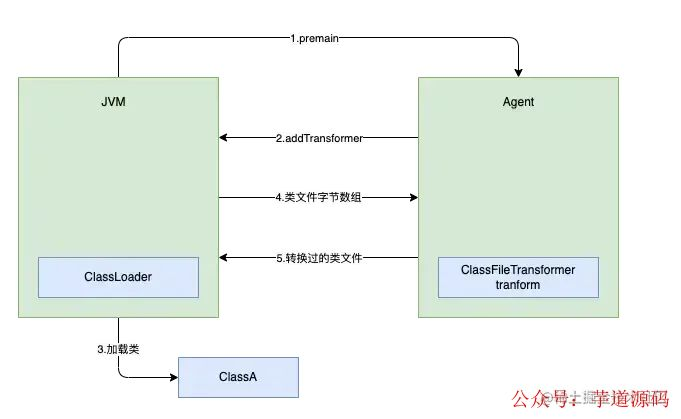
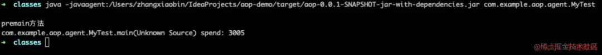
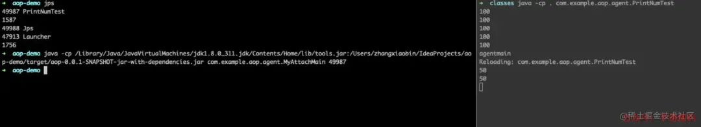
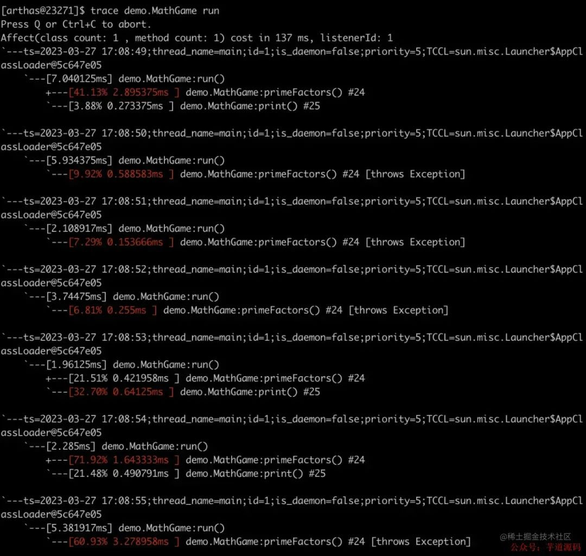
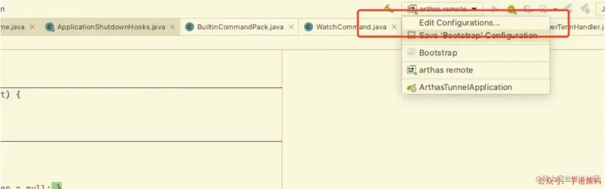
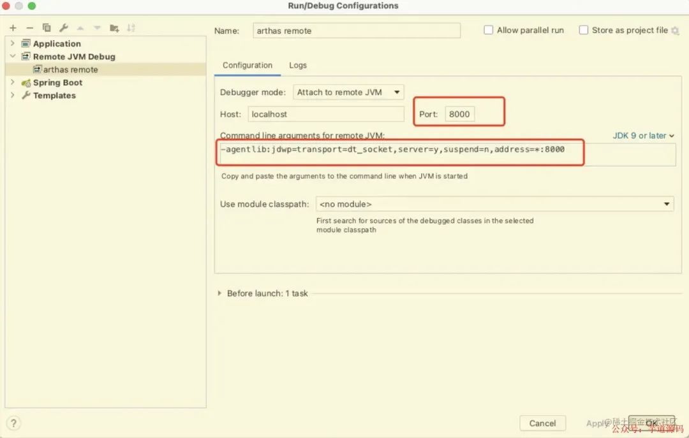
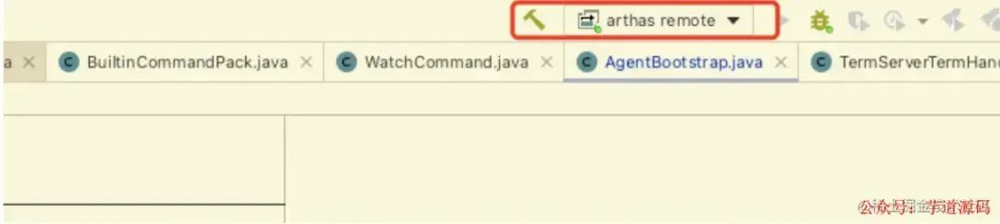
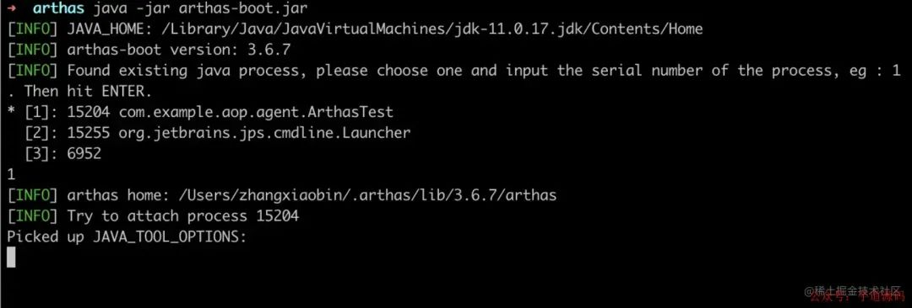
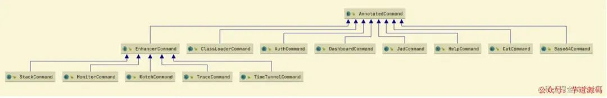
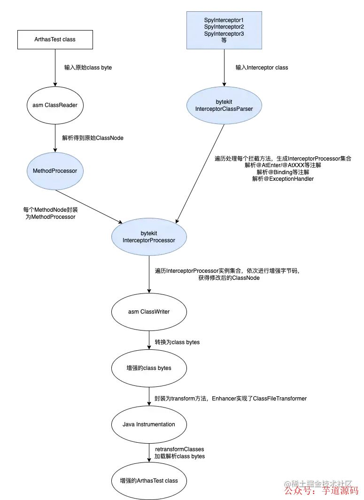

- [Java Agent](https://juejin.cn/post/7215401973843034171)
- [手把手教你实现一个Java Agent](https://mp.weixin.qq.com/s/wOtc4_GOEBymM6GwNW3tag)

## 故事的小黄花
团队中有同事在做性能优化相关的工作，因为公司基础设施不足，同事在代码中写了大量的代码统计某个方法的耗时，大概的代码形式就是
```java
@Override
public void method(Req req) {
    StopWatch stopWatch = new StopWatch();
    stopWatch.start("某某方法-耗时统计");
    method()
    stopWatch.stop();
    log.info("查询耗时分布：{}", stopWatch.prettyPrint());
}
```

这样的代码非常多，侵入性很大，联想到之前学习的Java Agent技术，可以无侵入式地解决这类问题，所以做了一个很小很小的demo

## Instrumentation
在了解Agent之前需要先看看Instrumentation

JDK从1.5版本开始引入了java.lang.instrument包，该包提供了一些工具帮助开发人员实现字节码增强，Instrumentation接口的常用方法如下
```java
public interface Instrumentation {
    /**
     * 注册Class文件转换器，转换器用于改变Class文件二进制流的数据
     *
     * @param transformer          注册的转换器
     * @param canRetransform       设置是否允许重新转换
     */
    void addTransformer(ClassFileTransformer transformer, boolean canRetransform);

    /**
     * 移除一个转换器
     *
     * @param transformer          需要移除的转换器
     */
    boolean removeTransformer(ClassFileTransformer transformer);
  
    /**
     * 在类加载之后，重新转换类，如果重新转换的方法有活跃的栈帧，那些活跃的栈帧继续运行未转换前的方法
     *
     * @param 重新转换的类数组
     */
    void retransformClasses(Class<?>... classes) throws UnmodifiableClassException;
  
    /**
     * 当前JVM配置是否支持重新转换
     */
    boolean isRetransformClassesSupported();

    /**
     * 获取所有已加载的类
     */
    @SuppressWarnings("rawtypes")
    Class[] getAllLoadedClasses();
}
public interface ClassFileTransformer {
    // className参数表示当前加载类的类名，classfileBuffer参数是待加载类文件的字节数组
    // 调用addTransformer注册ClassFileTransformer以后，后续所有JVM加载类都会被它的transform方法拦截
    // 这个方法接收原类文件的字节数组，在这个方法中做类文件改写，最后返回转换过的字节数组，由JVM加载这个修改过的类文件
    // 如果transform方法返回null，表示不对此类做处理，如果返回值不为null，JVM会用返回的字节数组替换原来类的字节数组
    byte[] transform(  ClassLoader         loader,
                String              className,
                Class<?>            classBeingRedefined,
                ProtectionDomain    protectionDomain,
                byte[]              classfileBuffer)
        throws IllegalClassFormatException;
}
```

Instrumentation有两种使用方式

- 在JVM启动的时候添加一个Agent jar包
- JVM运行以后在任意时刻通过Attach API远程加载Agent的jar包

## Agent
使用Java Agent需要借助一个方法，该方法的方法签名如下
```java
public static void premain (String agentArgs, Instrumentation instrumentation) {
}
```

从字面上理解，就是运行在`main()`函数之前的类。在Java虚拟机启动时，在执行main()函数之前，会先运行指定类的premain()方法，在premain()方法中对class文件进行修改，它有两个入参

- agentArgs：启动参数，在JVM启动时指定
- instrumentation：上文所将的Instrumentation的实例，我们可以在方法中调用上文所讲的方法，注册对应的Class转换器，对Class文件进行修改

如下图，借助Instrumentation，JVM启动时的处理流程是这样的：JVM会执行指定类的`premain()`方法，在`premain()`中可以调用`Instrumentation`对象的`addTransformer`方法注册`ClassFileTransformer`。当JVM加载类时会将类文件的字节数组传递给`ClassFileTransformer`的`transform`方法，在`transform`方法中对Class文件进行解析和修改，之后JVM就会加载转换后的Class文件


JVM启动时的处理流程

那我们需要做的就是写一个转换Class文件的`ClassFileTransformer`，下面用一个计算函数耗时的小例子看看Java Agent是怎么使用的
```java
public class MyClassFileTransformer implements ClassFileTransformer {
    @Override
    public byte[] transform(ClassLoader loader, String className, Class<?> classBeingRedefined, ProtectionDomain protectionDomain, byte[] classfileBuffer) {
        if ("com/example/aop/agent/MyTest".equals(className)) {
            // 使用ASM框架进行字节码转换
            ClassReader cr = new ClassReader(classfileBuffer);
            ClassWriter cw = new ClassWriter(cr, ClassWriter.COMPUTE_FRAMES);
            ClassVisitor cv = new TimeStatisticsVisitor(Opcodes.ASM7, cw);
            cr.accept(cv, ClassReader.SKIP_FRAMES | ClassReader.SKIP_DEBUG);
            return cw.toByteArray();
        }
        return classfileBuffer;

    }
}

public class TimeStatisticsVisitor extends ClassVisitor {

    public TimeStatisticsVisitor(int api, ClassVisitor classVisitor) {
        super(Opcodes.ASM7, classVisitor);
    }

    @Override
    public MethodVisitor visitMethod(int access, String name, String descriptor, String signature, String[] exceptions) {
        MethodVisitor mv = cv.visitMethod(access, name, descriptor, signature, exceptions);
        if (name.equals("<init>")) {
            return mv;
        }
        return new TimeStatisticsAdapter(api, mv, access, name, descriptor);
    }
}

public class TimeStatisticsAdapter extends AdviceAdapter {

    protected TimeStatisticsAdapter(int api, MethodVisitor methodVisitor, int access, String name, String descriptor) {
        super(api, methodVisitor, access, name, descriptor);
    }

    @Override
    protected void onMethodEnter() {
        // 进入函数时调用TimeStatistics的静态方法start
        super.visitMethodInsn(Opcodes.INVOKESTATIC, "com/example/aop/agent/TimeStatistics", "start", "()V", false);
        super.onMethodEnter();
    }

    @Override
    protected void onMethodExit(int opcode) {
        // 退出函数时调用TimeStatistics的静态方法end
        super.onMethodExit(opcode);
        super.visitMethodInsn(Opcodes.INVOKESTATIC, "com/example/aop/agent/TimeStatistics", "end", "()V", false);
    }
}

public class TimeStatistics {
    public static ThreadLocal<Long> t = new ThreadLocal<>();

    public static void start() {
        t.set(System.currentTimeMillis());
    }
    public static void end() {
        long time = System.currentTimeMillis() - t.get();
        System.out.println(Thread.currentThread().getStackTrace()[2] + " spend: " + time);
    }
}

public class AgentMain {
    // premain()函数中注册MyClassFileTransformer转换器
    public static void premain (String agentArgs, Instrumentation instrumentation) {
        System.out.println("premain方法");
        instrumentation.addTransformer(new MyClassFileTransformer(), true);
    }
}
```

```xml
<build>
  <plugins>
    <plugin>
      <groupId>org.apache.maven.plugins</groupId>
      <artifactId>maven-assembly-plugin</artifactId>
      <version>3.1.1</version>
      <configuration>
        <descriptorRefs>
          <!--将应用的所有依赖包都打到jar包中。如果依赖的是 jar 包，jar 包会被解压开，平铺到最终的 uber-jar 里去。输出格式为 jar-->
          <descriptorRef>jar-with-dependencies</descriptorRef>
        </descriptorRefs>
        <archive>
          <manifestEntries>
            // 指定premain()的所在方法
            <Agent-CLass>com.example.aop.agent.AgentMain</Agent-CLass>
            <Premain-Class>com.example.aop.agent.AgentMain</Premain-Class>
            <Can-Redefine-Classes>true</Can-Redefine-Classes>
            <Can-Retransform-Classes>true</Can-Retransform-Classes>
          </manifestEntries>
        </archive>
      </configuration>
      <executions>
        <execution>
          <phase>package</phase>
          <goals>
            <goal>single</goal>
          </goals>
        </execution>
      </executions>
    </plugin>
    <plugin>
      <groupId>org.apache.maven.plugins</groupId>
      <artifactId>maven-compiler-plugin</artifactId>
      <version>3.1</version>
      <configuration>
        <source>${maven.compiler.source}</source>
        <target>${maven.compiler.target}</target>
      </configuration>
    </plugin>
  </plugins>
</build>
```

使用命令行执行下面的测试类

```shell
java -javaagent:/Users/zhangxiaobin/IdeaProjects/aop-demo/target/aop-0.0.1-SNAPSHOT-jar-with-dependencies.jar com.example.aop.agent.MyTest
public class MyTest {
    public static void main(String[] args) throws InterruptedException {
        Thread.sleep(3000);
    }
}
```

计算出了某个方法的耗时


计算出某个方法的耗时

## Attach
在上面的例子中，我们只能在JVM启动时指定一个Agent，这种方式局限在main()方法执行前，如果我们想在项目启动后随时随地地修改Class文件，要怎么办呢？这个时候需要借助Java Agent的另外一个方法，该方法的签名如下
```java
public static void agentmain (String agentArgs, Instrumentation inst) {
}
```

`agentmain()`的参数与`premain()`有着同样的含义，但是`agentmain()`是在Java Agent被Attach到Java虚拟机上时执行的，当Java Agent被attach到Java虚拟机上，Java程序的`main()`函数一般已经启动，并且程序很可能已经运行了相当长的时间，此时通过`Instrumentation.retransformClasses()`方法，可以动态转换Class文件并使之生效，下面用一个小例子演示一下这个功能

下面的类启动后，会不断打印出100这个数字，我们通过Attach功能使之打印出50这个数字
```java
public class PrintNumTest {
    public static void main(String[] args) throws InterruptedException {
        while (true) {
            System.out.println(getNum());
            Thread.sleep(3000);
        }
    }
    private static int getNum() {
        return 100;
    }
}
```

依然是定义一个`ClassFileTransformer`，使用ASM框架修改`getNum()`方法
```java
public class PrintNumTransformer implements ClassFileTransformer {
    @Override
    public byte[] transform(ClassLoader loader, String className, Class<?> classBeingRedefined, ProtectionDomain protectionDomain, byte[] classfileBuffer) throws IllegalClassFormatException {
        if ("com/example/aop/agent/PrintNumTest".equals(className)) {
            System.out.println("asm");
            ClassReader cr = new ClassReader(classfileBuffer);
            ClassWriter cw = new ClassWriter(cr, ClassWriter.COMPUTE_FRAMES);
            ClassVisitor cv = new TransformPrintNumVisitor(Opcodes.ASM7, cw);
            cr.accept(cv, ClassReader.SKIP_FRAMES | ClassReader.SKIP_DEBUG);
            return cw.toByteArray();
        }
        return classfileBuffer;
    }
}

public class TransformPrintNumVisitor extends ClassVisitor {
    public TransformPrintNumVisitor(int api, ClassVisitor classVisitor) {
        super(Opcodes.ASM7, classVisitor);
    }
    @Override
    public MethodVisitor visitMethod(int access, String name, String descriptor, String signature, String[] exceptions) {
        MethodVisitor mv = cv.visitMethod(access, name, descriptor, signature, exceptions);
        if (name.equals("getNum")) {
            return new TransformPrintNumAdapter(api, mv, access, name, descriptor);
        }
        return mv;
    }

}

public class TransformPrintNumAdapter extends AdviceAdapter {

    protected TransformPrintNumAdapter(int api, MethodVisitor methodVisitor, int access, String name, String descriptor) {
        super(api, methodVisitor, access, name, descriptor);
    }

    @Override
    protected void onMethodEnter() {
        super.visitIntInsn(BIPUSH, 50);
        super.visitInsn(IRETURN);
    }
}

public class PrintNumAgent {

    public static void agentmain (String agentArgs, Instrumentation inst) throws UnmodifiableClassException {
        System.out.println("agentmain");
        inst.addTransformer(new PrintNumTransformer(), true);

        Class[] allLoadedClasses = inst.getAllLoadedClasses();
        for (Class allLoadedClass : allLoadedClasses) {
            if (allLoadedClass.getSimpleName().equals("PrintNumTest")) {
                System.out.println("Reloading: " + allLoadedClass.getName());
                inst.retransformClasses(allLoadedClass);
                break;
            }
        }
    }
}
```

```xml
<build>
  <plugins>
    <plugin>
      <groupId>org.apache.maven.plugins</groupId>
      <artifactId>maven-assembly-plugin</artifactId>
      <version>3.1.1</version>
      <configuration>
        <descriptorRefs>
          <!--将应用的所有依赖包都打到jar包中。如果依赖的是 jar 包，jar 包会被解压开，平铺到最终的 uber-jar 里去。输出格式为 jar-->
          <descriptorRef>jar-with-dependencies</descriptorRef>
        </descriptorRefs>
        <archive>
          <manifestEntries>
            // 指定agentmain所在的类
            <Agent-CLass>com.example.aop.agent.PrintNumAgent</Agent-CLass>
            <Premain-Class>com.example.aop.agent.PrintNumAgent</Premain-Class>
            <Can-Redefine-Classes>true</Can-Redefine-Classes>
            <Can-Retransform-Classes>true</Can-Retransform-Classes>
          </manifestEntries>
        </archive>
      </configuration>
      <executions>
        <execution>
          <phase>package</phase>
          <goals>
            <goal>single</goal>
          </goals>
        </execution>
      </executions>
    </plugin>
    <plugin>
      <groupId>org.apache.maven.plugins</groupId>
      <artifactId>maven-compiler-plugin</artifactId>
      <version>3.1</version>
      <configuration>
        <source>${maven.compiler.source}</source>
        <target>${maven.compiler.target}</target>
      </configuration>
    </plugin>
  </plugins>
</build>
```

因为是跨进程通信，Attach的发起端是一个独立的java程序，这个java程序会调用`VirtualMachine.attach`方法开始合目标JVM进行跨进程通信
```java
public class MyAttachMain {
    public static void main(String[] args) throws IOException, AttachNotSupportedException, AgentLoadException, AgentInitializationException {
        VirtualMachine virtualMachine = VirtualMachine.attach(args[0]);
        try {
            virtualMachine.loadAgent("/Users/zhangxiaobin/IdeaProjects/aop-demo/target/aop-0.0.1-SNAPSHOT-jar-with-dependencies.jar");
        } finally {
            virtualMachine.detach();
        }
    }
}
```

使用jps查询到`PrintNumTest`的进程id，再用下面的命令执行`MyAttachMain`类
```shell
java -cp /Library/Java/JavaVirtualMachines/jdk1.8.0_311.jdk/Contents/Home/lib/tools.jar:/Users/zhangxiaobin/IdeaProjects/aop-demo/target/aop-0.0.1-SNAPSHOT-jar-with-dependencies.jar com.example.aop.agent.MyAttachMain 49987
```

可以清楚地看到打印的数字变成了50


效果

## Arthas
以上是我写的小demo，有很多不足之处，看看大佬是怎么写的，arthas的trace命令可以统计方法耗时，如下图


Arthas

## 搭建调试环境
Arthas debug需要借助IDEA的远程debug功能，可以参考 https://github.com/alibaba/arthas/issues/222

先写一个可以循环执行的Demo
```java
public class ArthasTest {
    public static void main(String[] args) throws InterruptedException {
        int i = 0;
        while (true) {
            Thread.sleep(2000);
            print(i++);
        }
    }
    public static void print(Integer content) {
        System.out.println("Main print: " + content);
    }
}
```

命令行执行改demo
```shell
java -Xdebug -Xrunjdwp:transport=dt_socket,server=y,address=8000 com.example.aop.agent.ArthasTest
```

在Arthas源码的项目中设置远程debug


在Arthas源码的项目中设置远程debug


在Arthas源码的项目中设置远程debug

在这个方法com.taobao.arthas.agent334.AgentBootstrap#main任意位置打上断点，切换到刚刚设置的远程debug模式，启动项目



远程debug模式
可以看到刚刚处于Listening的ArthasTest开始执行，启动`arthas-boot.jar`，就可以看到断点跳进Arthas源码的项目中


跳进Arthas源码的项目中

## bytekit
在看trace命令之前需要一点前置知识，使用ASM进行字节码增强，代码逻辑不好修改，理解困难，所以bytekit基于ASM提供了一套简洁的API，让开发人员可以比较轻松地完成字节码增强，我们先来看一个简单的demo，来自`https://github.com/alibaba/bytekit`
```java
public class SampleInterceptor {
    @AtEnter(inline = false, suppress = RuntimeException.class, suppressHandler = PrintExceptionSuppressHandler.class)
    public static void atEnter(@Binding.This Object object,
                               @Binding.Class Object clazz,
                               @Binding.Args Object[] args,
                               @Binding.MethodName String methodName,
                               @Binding.MethodDesc String methodDesc) {
        System.out.println("atEnter, args[0]: " + args[0]);
    }

    @AtExit(inline = true)
    public static void atExit(@Binding.Return Object returnObject) {
        System.out.println("atExit, returnObject: " + returnObject);
    }

    @AtExceptionExit(inline = true, onException = RuntimeException.class)
    public static void atExceptionExit(@Binding.Throwable RuntimeException ex,
                                       @Binding.Field(name = "exceptionCount") int exceptionCount) {
        System.out.println("atExceptionExit, ex: " + ex.getMessage() + ", field exceptionCount: " + exceptionCount);
    }
}
```

上文说过，bytekit的宗旨是提供简介的API让开发可以轻松地完成字节码增强，从注解名我们就可以知道`@AtEnter`是在方法进入时插入，`@AtExit`是在方法退出时插入，`@AtExceptionExit`时在发生异常退出时插入
`inline = true`表示方法中的代码直接插入增强方法中，`inline = false`表示是调用这个方法，有点难理解，我们等下看反编译后的代码
配置了 `suppress = RuntimeException.class` 和 `suppressHandler = PrintExceptionSuppressHandler.class`，说明插入的代码会被 `try/catch` 包围
`@AtExceptionExit`在原方法体范围`try-catch`指定异常进行处理
这是我们要进行增强的方法

```java
public class Sample {
    private int exceptionCount = 0;
    public String hello(String str, boolean exception) {
        if (exception) {
            exceptionCount++;
            throw new RuntimeException("test exception, str: " + str);
        }
        return "hello " + str;
    }
}

public class SampleMain {
    public static void main(String[] args) throws Exception {
        // 解析定义的 Interceptor类 和相关的注解
        DefaultInterceptorClassParser interceptorClassParser = new DefaultInterceptorClassParser();
        List<InterceptorProcessor> processors = interceptorClassParser.parse(SampleInterceptor.class);
        // 加载字节码
        ClassNode classNode = AsmUtils.loadClass(Sample.class);
        // 对加载到的字节码做增强处理
        for (MethodNode methodNode : classNode.methods) {
            if (methodNode.name.equals("hello")) {
                MethodProcessor methodProcessor = new MethodProcessor(classNode, methodNode);
                for (InterceptorProcessor interceptor : processors) {
                    interceptor.process(methodProcessor);
                }
            }
        }
        // 获取增强后的字节码
        byte[] bytes = AsmUtils.toBytes(classNode);
        // 查看反编译结果
        System.out.println(Decompiler.decompile(bytes));
        // 修改Sample
        AgentUtils.reTransform(Sample.class, bytes);
        // 执行sample的方法
        try {
            Sample sample = new Sample();
            sample.hello("3", false);
            sample.hello("4", true);
        } catch (Exception e) {
            e.printStackTrace();
        }
    }
}
```

这是Sample反编译后的结果，代码量剧增

```java
public class Sample {
    private int exceptionCount = 0;

    /*
     * WARNING - void declaration
     */
    public String hello(String string, boolean bl) {
        try {
            String string2;
            void str;
            void exception;
            try {
                // @AtEnter 直接调用，inline为false的效果
                SampleInterceptor.atEnter((Object)this, Sample.class, (Object[])new Object[]{string, new Boolean(bl)}, (String)"hello", (String)"(Ljava/lang/String;Z)Ljava/lang/String;");
            }
            catch (RuntimeException runtimeException) {
                Class<Sample> clazz = Sample.class;
                RuntimeException runtimeException2 = runtimeException;
                System.out.println("exception handler: " + clazz);
                runtimeException2.printStackTrace();
            }
            if (exception != false) {
                ++this.exceptionCount;
                throw new RuntimeException("test exception, str: " + (String)str);
            }
            String string3 = string2 = "hello " + (String)str;
            // @AtExit 代码直接插入
            System.out.println("atExit, returnObject: " + string3);
            return string2;
        }
        catch (RuntimeException runtimeException) {
            int n = this.exceptionCount;
            RuntimeException runtimeException3 = runtimeException;
            // @AtExceptionExit 代码直接插入
            System.out.println("atExceptionExit, ex: " + runtimeException3.getMessage() + ", field exceptionCount: " + n);
            throw runtimeException;
        }
    }
}
```

有了这个前置知识，我们来看看trace命令

## trace

trace

Arthas命令很多，如果是`exit`、`logout`、`quit`、`jobs`、`fg`、`bg`、`kill`等简单的命令，就会直接执行，如果是`trace`这种复杂的命令，会专门用一个类写处理的逻辑，如上图，根据名字就可以猜到这个类是处理什么命令的，这么多类的组织形式是模版模式，入口在`com.taobao.arthas.core.shell.command.AnnotatedCommand#process`

```java
public abstract class AnnotatedCommand {
    public abstract void process(CommandProcess process);
}

public class TraceCommand extends EnhancerCommand {
}

public abstract class EnhancerCommand extends AnnotatedCommand {
    @Override
    public void process(final CommandProcess process) {
        // ctrl-C support
        process.interruptHandler(new CommandInterruptHandler(process));
        // q exit support
        process.stdinHandler(new QExitHandler(process));
        // start to enhance
        enhance(process);
    }
}
```

有一些命令都有字节码增强的逻辑，这些逻辑共同封装在了`EnhancerCommand`这个类中，`TraceCommand`继承了`EnhancerCommand`，当`trace`命令执行的时候，增强的逻辑在`EnhancerCommand`，我们只看核心代码

```java
com.taobao.arthas.core.command.monitor200.EnhancerCommand#enhance
com.taobao.arthas.core.advisor.Enhancer#enhance(java.lang.instrument.Instrumentation)

public synchronized EnhancerAffect enhance(final Instrumentation inst) throws UnmodifiableClassException {
        ......
        try {
            // 很明显，这里添加了一个文件转换器，注意，此处的转换器为本类
            ArthasBootstrap.getInstance().getTransformerManager().addTransformer(this, isTracing);
            ......
        } catch (Throwable e) {
            logger.error("Enhancer error, matchingClasses: {}", matchingClasses, e);
            affect.setThrowable(e);
        }
        return affect;
    }
```

根据方法名就可以在本类搜索到，具体代码如下

```java
@Override
public byte[] transform(final ClassLoader inClassLoader, String className, Class<?> classBeingRedefined,
                        ProtectionDomain protectionDomain, byte[] classfileBuffer) throws IllegalClassFormatException {
    try {
      // 检查classloader能否加载到 SpyAPI，如果不能，则放弃增强
      try {
        if (inClassLoader != null) {
          inClassLoader.loadClass(SpyAPI.class.getName());
        }
      } catch (Throwable e) {
        logger.error("the classloader can not load SpyAPI, ignore it. classloader: {}, className: {}",
                     inClassLoader.getClass().getName(), className, e);
        return null;
      }
      // 这里要再次过滤一次，为啥？因为在transform的过程中，有可能还会再诞生新的类
      // 所以需要将之前需要转换的类集合传递下来，再次进行判断
      if (matchingClasses != null && !matchingClasses.contains(classBeingRedefined)) {
        return null;
      }
      // ClassNode中有各种属性，对应Class文件结构
      // keep origin class reader for bytecode optimizations, avoiding JVM metaspace OOM.
      ClassNode classNode = new ClassNode(Opcodes.ASM9);
      ClassReader classReader = AsmUtils.toClassNode(classfileBuffer, classNode);
      // remove JSR https://github.com/alibaba/arthas/issues/1304
      classNode = AsmUtils.removeJSRInstructions(classNode);
      // 重要代码，生成增强字节码的拦截器
      DefaultInterceptorClassParser defaultInterceptorClassParser = new DefaultInterceptorClassParser();
      final List<InterceptorProcessor> interceptorProcessors = new ArrayList<InterceptorProcessor>();
      interceptorProcessors.addAll(defaultInterceptorClassParser.parse(SpyInterceptor1.class));
      interceptorProcessors.addAll(defaultInterceptorClassParser.parse(SpyInterceptor2.class));
      interceptorProcessors.addAll(defaultInterceptorClassParser.parse(SpyInterceptor3.class));
      if (this.isTracing) {
        // 根据配置判断trace命令是否要跳过计算Java类库的代码的耗时
        if (!this.skipJDKTrace) {
          interceptorProcessors.addAll(defaultInterceptorClassParser.parse(SpyTraceInterceptor1.class));
          interceptorProcessors.addAll(defaultInterceptorClassParser.parse(SpyTraceInterceptor2.class));
          interceptorProcessors.addAll(defaultInterceptorClassParser.parse(SpyTraceInterceptor3.class));
        } else {
          interceptorProcessors.addAll(defaultInterceptorClassParser.parse(SpyTraceExcludeJDKInterceptor1.class));
          interceptorProcessors.addAll(defaultInterceptorClassParser.parse(SpyTraceExcludeJDKInterceptor2.class));
          interceptorProcessors.addAll(defaultInterceptorClassParser.parse(SpyTraceExcludeJDKInterceptor3.class));
        }
      }

      List<MethodNode> matchedMethods = new ArrayList<MethodNode>();
      for (MethodNode methodNode : classNode.methods) {
        if (!isIgnore(methodNode, methodNameMatcher)) {
          matchedMethods.add(methodNode);
        }
      }
      // https://github.com/alibaba/arthas/issues/1690
      if (AsmUtils.isEnhancerByCGLIB(className)) {
        for (MethodNode methodNode : matchedMethods) {
          if (AsmUtils.isConstructor(methodNode)) {
            AsmUtils.fixConstructorExceptionTable(methodNode);
          }
        }
      }
      .......
      for (MethodNode methodNode : matchedMethods) {
        if (AsmUtils.isNative(methodNode)) {
          logger.info("ignore native method: {}",
                      AsmUtils.methodDeclaration(Type.getObjectType(classNode.name), methodNode));
          continue;
        }
        // 先查找是否有 atBeforeInvoke 函数，如果有，则说明已经有trace了，则直接不再尝试增强，直接插入 listener
        if(AsmUtils.containsMethodInsnNode(methodNode, Type.getInternalName(SpyAPI.class), "atBeforeInvoke")) {
          for (AbstractInsnNode insnNode = methodNode.instructions.getFirst(); insnNode != null; insnNode = insnNode
               .getNext()) {
            if (insnNode instanceof MethodInsnNode) {
              final MethodInsnNode methodInsnNode = (MethodInsnNode) insnNode;
              if(this.skipJDKTrace) {
                if(methodInsnNode.owner.startsWith("java/")) {
                  continue;
                }
              }
              // 原始类型的box类型相关的都跳过
              if(AsmOpUtils.isBoxType(Type.getObjectType(methodInsnNode.owner))) {
                continue;
              }
              AdviceListenerManager.registerTraceAdviceListener(inClassLoader, className,
                                                                methodInsnNode.owner, methodInsnNode.name, methodInsnNode.desc, listener);
            }
          }
        }else {
          // 重点代码，增强动作就是在这里完成的
          MethodProcessor methodProcessor = new MethodProcessor(classNode, methodNode, groupLocationFilter);
          for (InterceptorProcessor interceptor : interceptorProcessors) {
            try {
              List<Location> locations = interceptor.process(methodProcessor);
              for (Location location : locations) {
                if (location instanceof MethodInsnNodeWare) {
                  MethodInsnNodeWare methodInsnNodeWare = (MethodInsnNodeWare) location;
                  MethodInsnNode methodInsnNode = methodInsnNodeWare.methodInsnNode();
                  AdviceListenerManager.registerTraceAdviceListener(inClassLoader, className,
                                                                    methodInsnNode.owner, methodInsnNode.name, methodInsnNode.desc, listener);
                }
              }
            } catch (Throwable e) {
              logger.error("enhancer error, class: {}, method: {}, interceptor: {}", classNode.name, methodNode.name, interceptor.getClass().getName(), e);
            }
          }
        }

        // enter/exist 总是要插入 listener
        AdviceListenerManager.registerAdviceListener(inClassLoader, className, methodNode.name, methodNode.desc,
                                                     listener);
        affect.addMethodAndCount(inClassLoader, className, methodNode.name, methodNode.desc);
      }

      // https://github.com/alibaba/arthas/issues/1223 , V1_5 的major version是49
      if (AsmUtils.getMajorVersion(classNode.version) < 49) {
        classNode.version = AsmUtils.setMajorVersion(classNode.version, 49);
      }

      byte[] enhanceClassByteArray = AsmUtils.toBytes(classNode, inClassLoader, classReader);

      // 增强成功，记录类
      classBytesCache.put(classBeingRedefined, new Object());

      // dump the class
      dumpClassIfNecessary(className, enhanceClassByteArray, affect);

      // 成功计数
      affect.cCnt(1);

      return enhanceClassByteArray;
    } catch (Throwable t) {
      logger.warn("transform loader[{}]:class[{}] failed.", inClassLoader, className, t);
      affect.setThrowable(t);
    }
    return null;
}
```

这段代码很长，其实主要逻辑就两个

- 解析Interceptor Class的@AtXxx，@Binding等注解，生成InterceptorProcessor对象集合
- 遍历InterceptorProcessor集合，修改原方法的字节码

整体的流程如下图


整体的流程如图

那这些拦截器长什么样子呢？我们随便找一个例子来看看

```java
public static class SpyInterceptor1 {
    @AtEnter(inline = true)
    public static void atEnter(@Binding.This Object target, @Binding.Class Class<?> clazz,
                               @Binding.MethodInfo String methodInfo, @Binding.Args Object[] args) {
      SpyAPI.atEnter(clazz, methodInfo, target, args);
    }
}
```
看到这里，就很熟悉了，跟上面bytekit的例子很像，是在方法进入时插入的，当然，这里只是浅讲一下trace的原理，bytekit背后的原理，需要更底层的知识储备，我还需要继续学习

## 参考资料
- https://developer.aliyun.com/article/768074
- https://arthas.aliyun.com/doc/trace.html#注意事项
- https://blog.csdn.net/tianjindong0804/article/details/128423819
