- [2万字+55张图盘点七种基本的GC垃圾回收算法](https://mp.weixin.qq.com/s/B9Va42xxFIquW_O1wsdOQg)

## 一、为什么要有 GC

### 1.1 什么是 GC

GC 是 Garbage Collection 的简称，中文称为“垃圾回收”。GC ，是指程序把不用的内存空间视为垃圾并回收掉的整套动作。

GC 要做的有两件事：

1. 找到内存空间里的垃圾；

2. 回收垃圾，让程序能再次利用这部分空间。

满足这两项功能的程序就是 GC。

### 1.2 为什么要有 GC

在没有 GC 的世界里，程序员必须自己手动进行内存管理，必须清楚地确保必要的内存空间，释放不要的内存空间。

程序员在手动进行内存管理时，申请内存尚不存在什么问题，但在释放不要的内存空间时，就必须一个不漏地释放。这非常麻烦，容易发生下面三种问题：内存泄露，悬垂指针，错误释放引发 BUG。

1. 如果忘记释放内存空间，该内存空间就会发生内存泄露（内存空间在使用完毕后未释放），即无法被使用，但它又会持续存在下去。如果将发生内存泄露的程序放着不管，总有一刻内存会被占满，甚至还可能导致系统崩溃。

2. 在释放内存空间时，如果忘记初始化指向已经回收的内存地址（对象已释放）的指针，这个指针就会一直指向释放完毕的内存空间。此时，这个指针处于一种悬挂的状态，我们称其为“悬垂指针”（dangling pointer）。如果在程序中错误地引用了悬垂指针， 就会产生无法预期的 BUG。

3. 一旦错误释放了使用中的内存空间，下一次程序使用此空间时就会发生故障。大多数情况下会发生段错误，运气不好的话还可能引发恶性 BUG，甚至引发安全漏洞。

为了省去上述手动内存管理的麻烦，人们钻研开发出了 GC。如果把内存管理交给计算机， 程序员就不用去想着释放内存了。

当然，技术领域的不变法则就是万事皆有代价，GC 也会带来一些麻烦，比如后台程序需要耗费一定的 CPU 和内存资源去释放内存，在系统繁忙的情况下会对业务程序性能造成一定的不利影响。为了解决 GC 带来的问题，最近几年出现了一门新的没有 GC 的 Rust 语言，大有替代 C 语言的趋势，不过学习曲线比较陡峭，感兴趣的同学可以自行钻研。

## 二、GC 相关的基本术语

### 2.1 对象、指针、活动对象、非活动对象、堆、根

GC 操作的基本单元可以叫做对象。对象是内存空间的某些数据的集合。在本文中，对象由头(header)和域(field)构成。

对象的头，主要包含对象的大小、种类信息。对象中可访问的部分称为“域”，可以认为是 C 语言中结构体的成员变量。如图2.1所示。

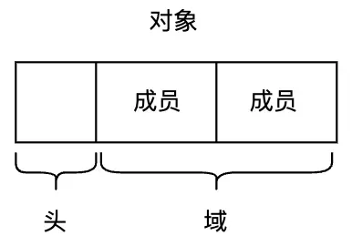

图2.1 对象、头、域

指针是指向内存空间中某块区域的值。GC 是根据对象的指针指向去搜寻其他对象的。对象和指针的关系如图2.2所示。

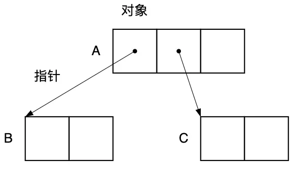

图2.2 对象和指针

我们将内存空间中被其他对象通过指针引用的对象成为活动对象，没有对象引用的对象是非活动对象，也就是 GC 需要回收的垃圾。如图2.3所示。

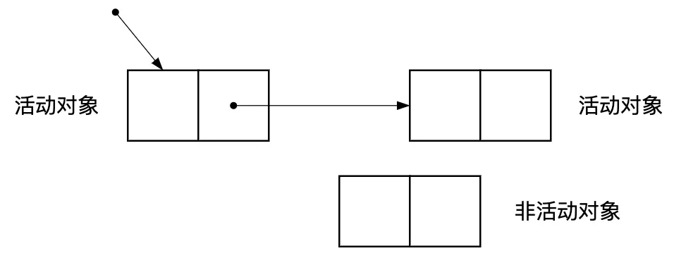

图2.3 活动对象和非活动对象

根(root)是“根基”“根底”。在 GC 的世界里，根是指向对象的指针的“起点” 部分。堆指的是用于动态（也就是执行程序时）存放对象的内存空间。当应用程序申请存放对象时， 所需的内存空间就会从这个堆中被分配给 应用程序。如图2.4所示。

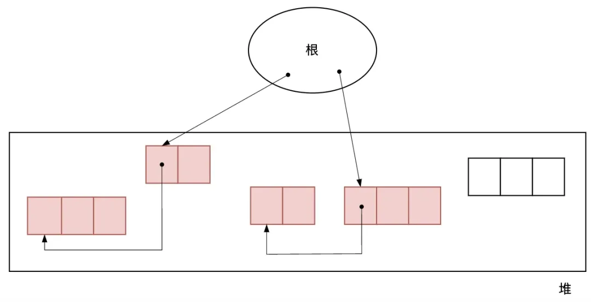

图2.4 根和堆里的对象

### 2.2 GC 算法性能的评价标准

评价 GC 算法的性能时，我们采用以下 4 个标准。

- 吞吐量。

- 最大暂停时间。

- 堆使用效率。

- 访问的局部性。

#### 吞吐量

GC 的吞吐量是：运行用户代码时间 / (运行用户代码时间 + 垃圾收集时间)。

如图2.5所示，在程序运行的整个过程中，应用程序的时间是 X、Y、Z，应用程序的总时间是 X + Y + Z。GC 一共启动了两次，花费的时间为 A、B，则 GC 总花费的时间是 A + B。这种情况下 GC 的吞吐量为 (X + Y + Z) /(X + Y + Z + A + B)。

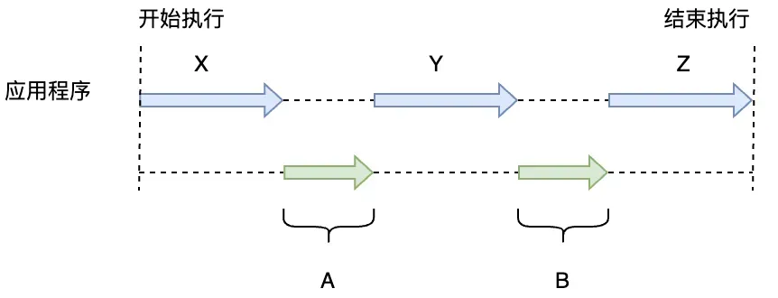

图2.5 应用程序和 GC 的执行示意图

从这里的描述可知，GC 的吞吐量就是应用程序执行的时间(不是内存大小哦)和 GC 时间的比值，GC 执行的总时间越短，GC 吞吐量越大。

人们通常都喜欢吞吐量高的 GC 算法。然而判断各算法吞吐量的好坏时不能一概而论。因为工程技术中，任何好处都是有代价的。

#### 最大暂停时间

本文介绍的所有 GC 算法，都会在 GC 执行过程中另应用程序暂停执行。最大暂停时间指的是“因执行 GC 而暂停执行应用程序的最长时间”。

当编写像动作游戏这样追求即时性的程序时，就必须尽量压低 GC 导致的最大暂停时间。如果因为 GC 导致玩家频繁卡顿，相信谁都会想摔手柄。对音乐和动画这样类似于编码应用的程序来说，GC 的最大暂停时间就不那么重要了。更为重要的是，我们必须选择一个整体处理时间更短的算法。

不管尝试哪种 GC 算法，我们都会发现较大的吞吐量和较短的最大暂停时间不可兼得。所以应根据执行的应用所重视的指标的不同，来分别采用不同的 GC 算法。

#### 堆使用效率

堆使用效率，是指：程序在运行过程中，单位时间内能使用的堆内存空间的大小。举个例子，GC 复制算法中将堆二等分，每次只使用一半，交替进行，因此总是只能利用堆的一半。相对而言，GC 标记-清除算法和引用计数法就能利用整个堆。

与吞吐量和最大暂停时间一样，堆使用效率也是 GC 算法的重要评价指标之一。  

然而，堆使用效率和吞吐量，以及最大暂停时间不可兼得。简单地说就是：可用的堆越大，GC 运行越快；相反，越想有效地利用有限的堆，GC 花费的时间就越长。

#### 访问的局部性

计算机上有 4 种存储器，分别是寄存器、缓存、内存、辅助存储器。它们之间有着如图 2.6 所示的层级关系。

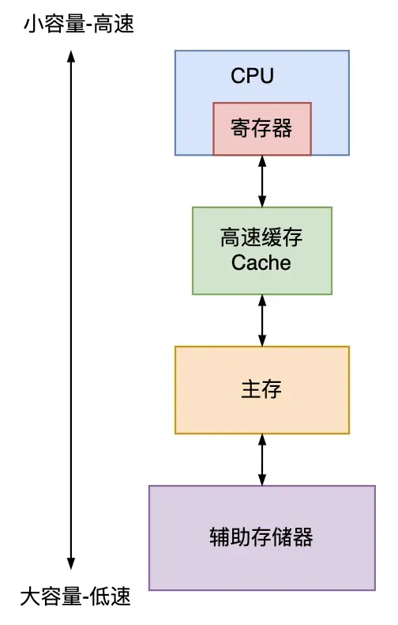

图2.6 存储器的层次结构

众所周知，越是可实现高速存取的存储器容量就越小。计算机会尽可能地利用较高速的存储器，但由于高速的存储器容量小，不可能把所有要利用的数据都放在寄存器和高速缓存里。一般我们会把所有的数据都放在内存里，当 CPU 访问数据时，仅把要使用的数据从内存读取到缓存。由于数据是分块读取，我们还将它附近的所有数据都读取到高速缓存中， 从而压缩读取数据所需要的时间。这种内存空间中相邻的数据很可能存在连续访问因而带来访问效率提升的情况，称为“访问的局部性”。

部分 GC 算法会利用这种局部性原理，把具有引用关系的对象安排在堆中较近的位置，就能提高在缓存 Cache 中读取到想要的数据的概率，令应用程序高速运行。

## 三、常用的 GC 算法

三种最基本的 GC 算法是标记-清除法、引用计数法、GC 复制算法。后面延伸出来的4种不过是三种基本算法的组合而已。

### 3.1 GC 标记-清除法

GC 标记-清除算法由标记阶段和清除阶段构成。标记阶段是把所有活动对象都做上标记的阶段。清除阶段是把那些没有标记的对象，也就是非活动对象回收的阶段。通过这两个阶段，就可以令不能利用的内存空间重新得到利用。

为了说明 GC 标记-清除算法的工作原理，下面分为标记、清除两个阶段来描述。

#### 标记阶段

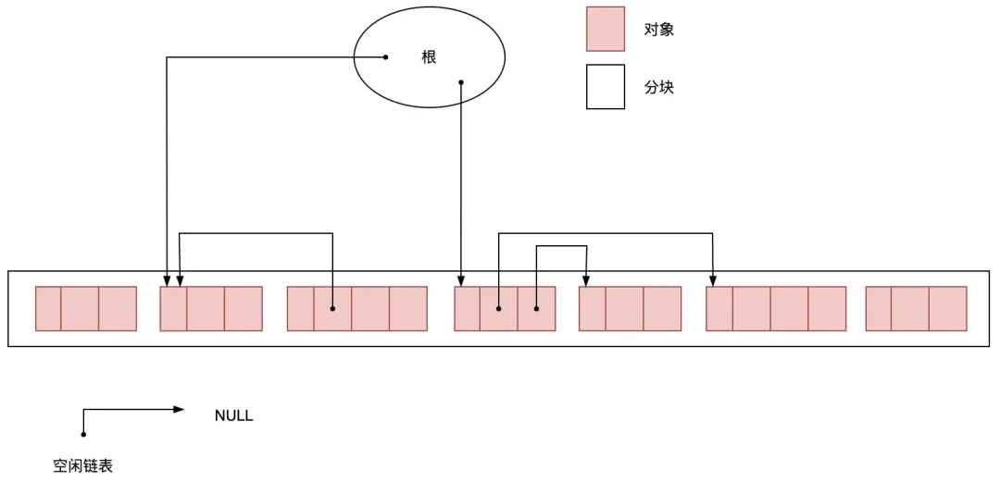

图3.1 执行 GC 前堆的状态

执行 GC 前堆的状态如图3.1所示。

在标记阶段中，垃圾回收器 Collector 会为堆里的所有活动对象打上标记。为此，我们首先要标记通过根直接引用的对象。首先我们标记这样的对象，然后递归地标记通过指针数组能访问到的对象。这样就能把所有活动对象都标记上了。 

标记 Mark 对象，是在对象的头部进行置位操作。如图3.2所示，是程序标记对象的动作示意。

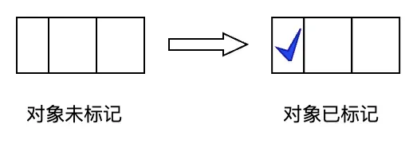

图3.2 标记对象的动作示意

标记完所有活动对象后，标记阶段就结束了。标记阶段结束时的堆如图 3.3 所示，从根对象沿着指针引用找下去，会发现有四个对象被引用，都需要打上标记位。

在标记阶段中，程序会标记所有活动对象。毫无疑问，标记所花费的时间是与“活动对象的总数”成正比的。

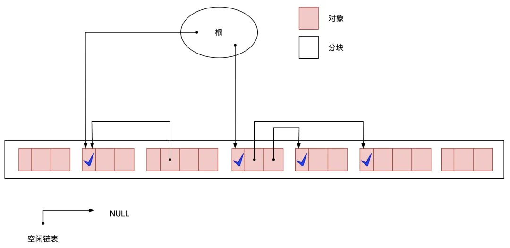

图3.3 标记阶段结束后的堆状态

用一句话概括，标记阶段就是“遍历对象并标记”的处理过程。

#### 清除阶段

在清除阶段中，垃圾回收器 Collector 会遍历整个堆，回收没有打上标记的对象（即垃圾），使其能再次得到利用。

在清除阶段，GC 程序会遍历堆，具体来说就是从堆首地址开始，按顺序一个个遍历对象的标志位。如果一个对象设置了标记位，就说明这个对象是活动对象，必然是不能被回收的。

GC 程序会把非活动对象回收再利用。回收对象就是把对象作为分块，连接到被称为“空闲链表”的单向链表。在之后进行分配时只要遍历这个空闲链表，就可以找到分块了。 

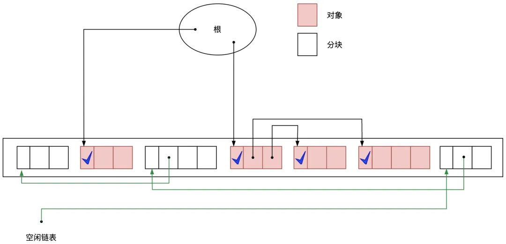

图3.4 清除阶段结束后的堆状态

在清除阶段，程序会遍历所有堆，进行垃圾回收。也就是说，所花费时间与堆大小成正 比。堆越大，清除阶段所花费的时间就会越长。

在 GC 的标记-清除过程中，还会不断进行的两个动态操作那就是分配和合并。

#### 分配

分配是指将回收的垃圾进行再利用。

GC 程序在清除阶段已经把垃圾对象连接到空闲链表了。当应用程序创建新对象时，搜索空闲链表并寻找大小合适的分块，这项操作就叫作分配。

#### 合并

根据分配策略的不同可能会产生大量的小分块。但如果它们是连续的， 我们就能把所有的小分块连在一起形成一个大分块。这种“连接连续分块”的操作就叫作合并(coalescing)，合并是在清除阶段进行的。

#### 标记清除法的优点
1. 实现简单，很容易在基本的 GC 标记清除法基础上改进，或者容易和其他算法组合形成新的 GC 算法。

2. GC 标记-清除算法因为不会移动对象，所以非常适合搭配保守式 GC 算法。

#### 标记清除法的缺点
1. 碎片化。使用过程中会逐渐产生被细化的分块，不久后就会导致无数的小分块散布在堆的各处。
2. 分配速度慢。GC 标记-清除算法中分块不是连续的，因此每次分配都必须遍历空闲链表，找到足够大的分块才行。

3. 与写时复制技术(copy-on-write)不兼容。这里不展开说了。

#### GC 标记-清除法的改进

##### 改进一：分配速度的改进——多个空闲链表

之前介绍的基本标记-清除算法中只用到了一个空闲链表，在这个空闲链表中，对大的分块和小的分块进行同样的处理。但是这样一来，每次分配的时候都要遍历一次空闲链表来寻找合适大小的分块，这样非常浪费时间。

可以寻求一种改进的方法，利用分块大小不同的空闲链表，即创建只连接大分块的空闲链表和只连接小分块的空闲链表，甚至不同规格大小的分块采用不同的空闲链表管理。这样一来，只要按照应用程序所申请的对象大小选择空闲链表，就能在短时间内找到符合条件的分块了。我们知道，Golang 的内存分配里就是这么做的了。

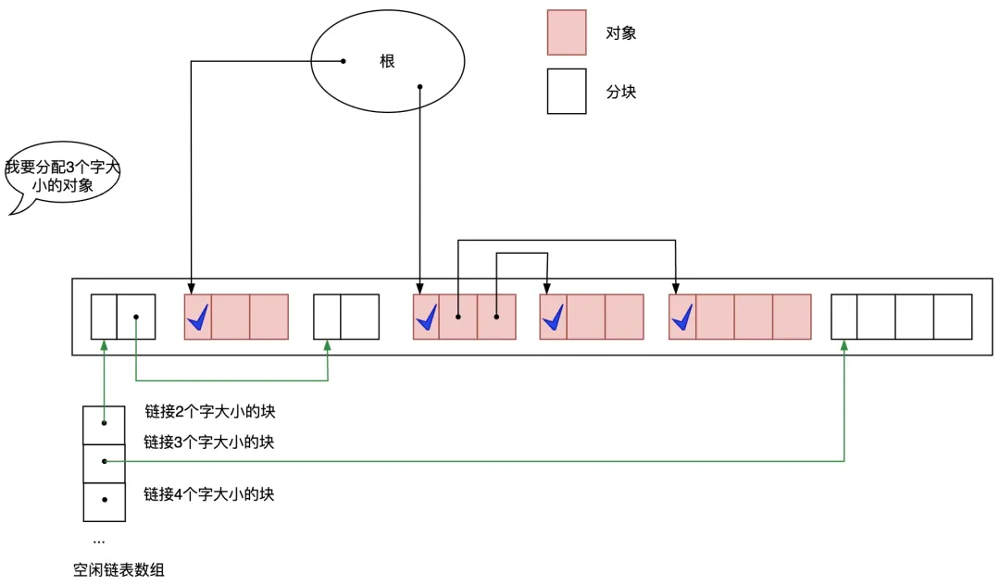

图3.5 利用多个空闲链表提高分配速度

##### 改进二：碎片化分块问题的改进——BiBOP 法

BiBOP 是 Big Bag Of Pages 的缩写。用一句话概括就是“将大小相近的对象整理成固定大小的块进行管理的做法”。

如图3.6所示，是 BiBOP 法的示意图。把堆分割成多个规格大小的空间，让每个规格的空间只能配置同样大小的分块。

2个字的分块只能在最左边的堆空间里分配，3个字的分块只能在中间的堆空间分配，4个字的块在最右边。像这样配置对象，就会提高内存的使用效率。

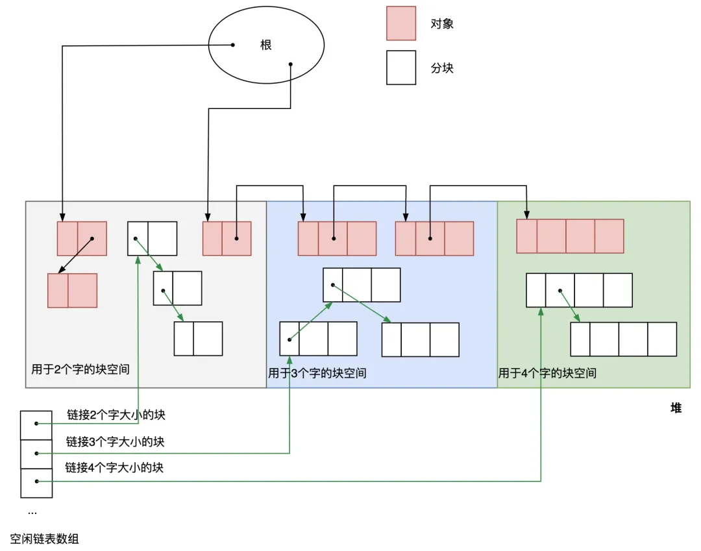

图 3.6 BiBOP 法的示意图

### 3.2 GC 引用计数法

#### 引用计数法的基本原理

引用计数法(Reference Counting)就是，让所有对象事先记录下“有多少程序引用自己”。形象点儿说，就是让各对象知道自己的“人气指数”，让没有人气的对象自己消失。

引用计数法依靠“计数器”记录有多少对象引用了自己（被引用数）。

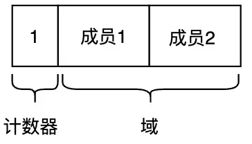

图3.7 引用计数法中的对象

如图3.8所示，是 A 的指针由指向 B 改为指向 C 时，各对象的计数器的变化情况。初始状态下从根引用 A 和 C，从 A 引用 B。A 持有唯一指向 B 的指针，假设现在将该指针更新到了 C，B 的计数器值变成了 0，计数器变更时，计数器为0的对象会被回收，因此 B 被回收了。且 B 连接上了空闲链表， 能够再被利用了。又因为新形成了由 A 指向 C 的指针，所以 C 的计数器的值增量为 2。

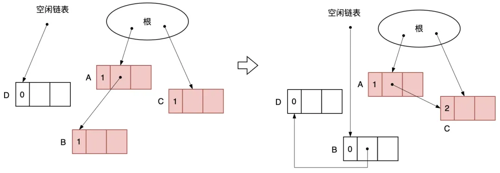

图3.8 在对象引用变更时各对象的计数器的变化情况

#### 引用计数法的优点

1. 可即刻回收垃圾。在引用计数法中，每个对象始终都知道自己的被引用数(就是计数器的值)。当被引用数的值为 0 时，对象马上就会把自己作为空闲空间被GC程序连接到空闲链表。也就是说，各个对象在变成垃圾的同时就会立刻被回收。另一方面，在其他的 GC 算法中，即使对象变成了垃圾，程序也无法立刻判别。只有当内存分块用尽后 GC 开始执行时，才能知道哪个对象是垃圾，哪个对象不是垃圾。

2. 最大暂停时间短。在引用计数法中，只有当应用程序更新指针时(计数器变更)程序才会执行垃圾回收。也就是说， 每次生成垃圾时这部分垃圾都会被回收，因而大幅度地削减了 GC 的最大暂停时间。

3. 没有必要沿着指针查找被引用对象。引用计数法和 GC 标记-清除算法不一样，没必要由根沿着指针查找。当我们想减少沿着指针查找的次数时，它就派上用场了。打个比方，在分布式环境中，如果要沿各个计算节点之间的指针进行查找，成本就会增大。

#### 引用计数法的缺点

1. 计数器值的增减处理繁重。在程序繁忙的情况下，指针都会频繁地更新。特别是有根的指针，会以极快的速度进行更新。在引用计数法中，每当指针更新时，计数器的值都会随之更新，因此值的增减处理必然会变得繁重。
计数器需要占用很多位。用于引用计数的计数器最大必须能数完堆中所有对象的引用数。打个比方，假如我们用的是 32 位机器，那么就有可能要让 2 的 32 次方个对象同时引用一个对象。考虑到这种情况， 就有必要确保各对象的计数器有 32 位大小。也就是说，对于所有对象，必须留有 32 位的空间。这就害得内存空间的使用效率大大降低了。

2. 实现烦琐复杂。该算法本身很简单，但事实上实现起来却不容易。进行指针更新操作时，需要同时变更对象引用和计数器，这容易导致遗漏，一旦遗漏了某处，内存管理就无法正确进行，就会产生 BUG。

3. 循环引用无法回收。因为两个对象互相引用，所以各对象的计数器的值都是 1。但是这些对象组并没有被其他任何对象引用。因此想一并回收这两个对象都不行，只要它们的计数器值都是 1，就无法回收。

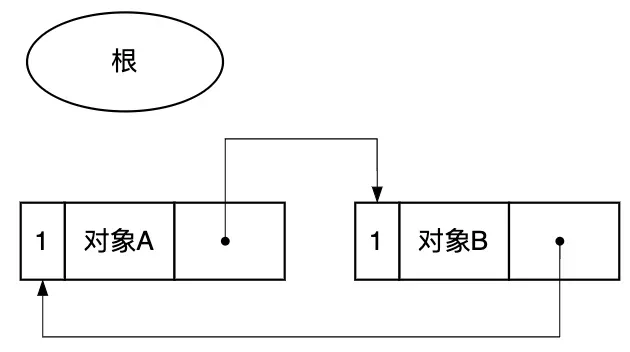

图3.9 循环引用对象

最后，尽管引用计数法有很多缺点，引用计数法也不是一个“完全没法用”的算法。事实上，很多处理系统和应用都在使用引用计数法。

因为引用计数法只要稍加改良，就会变得非常具有实用性了。

#### 引用计数法的改进

##### 改进一：延迟引用计数法

针对引用计数法“计数器增减处理繁重”的缺点，有人提出了延迟引用计数法(Deferred Reference Counting)。计数器值增减处理繁重的原因之一是从根的引用变化频繁。延迟引用计数法就是让从根引用的指针的变化不反映在计数器上，而是采用一个零数表 ZCT(Zero Count Table)来存储从根引用的各对象的被引用数，即使这个值变为0，程序也先不回收这个对象（延迟一词体现在这），而是等零数表 ZCT 爆满或者空闲链表为空时再扫描零数表 ZCT，删除确实没有被引用的对象。这样一来即使频繁重写堆中对象的引用关系，对象的计数器值也不会有所变化，因而大大改善了“计数器值的增减处理繁重”这一缺点。

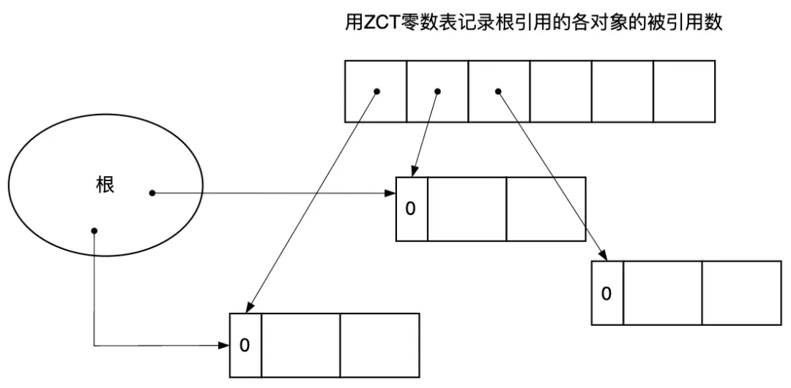

图3.10 用零数表 ZCT 记录根引用的各对象的被引用数

**优点：** 在延迟引用计数法中，程序延迟了根引用的计数。通过延迟，减轻了因根引用频繁发生变化而导致的计数器增减所带来的额外负担。

**缺点：** 为了延迟计数器值的增减，垃圾不能马上得到回收，这样一来垃圾就会压迫堆，程序也就失去了引用计数法的一大优点——可即刻回收垃圾。

##### 改进二：减少计数器位数的Sticky 引用计数法

我们假设用于计数器的位数为 5 位，那么这种计数器最多只能数到 2 的 5 次方减 1，也就是 31 个引用数。如果此对象被大于 31 个对象引用，那么计数器就会溢出。对于计数器溢出的对象，有两种处理方法：1）什么都不做，2）通过GC标记-清除法进行管理。

1. 对于计数器溢出的对象，什么都不做。这样一来，即使这个对象成了垃圾(即被引用数为 0)，也不能将其回收。也就是说， 白白浪费了内存空间。然而事实上有很多研究表明，很多对象一生成马上就死了。也就是说， 在很多情况下，计数器的值会在 0 到 1 的范围内变化，鲜少出现 5 位计数器溢出这样的情况。

2. 对于计数器溢出的对象，通过GC标记-清除法进行管理。具体实现就不展开了。这种方式，在计数器溢出后即使对象成了垃圾，程序还是能回收它。另外还有一个优点，那就是还能回收循环的垃圾。

### 3.3 GC 复制算法

#### 基本原理

GC 复制算法(Copying GC)，就是只把某个空间里的活动对象复制到其他空间，把原空间里的所有对象都回收掉。在此，我们将复制活动对象的原空间称为 From 空间，将粘贴活动对象的新空间称为 To 空间。

GC 复制算法是利用 From 空间进行分配的。当 From 空间被完全占满时，GC 会将活动对象全部复制到 To 空间。当复制完成后，该算法会把 From 空间和 To 空间互换，GC 也就结束了。From 空间和 To 空间大小必须一致。这是为了保证能把 From 空间中的所有活动对象都收纳到 To 空间里。GC 复制算法的概要如图 3.11 所示。

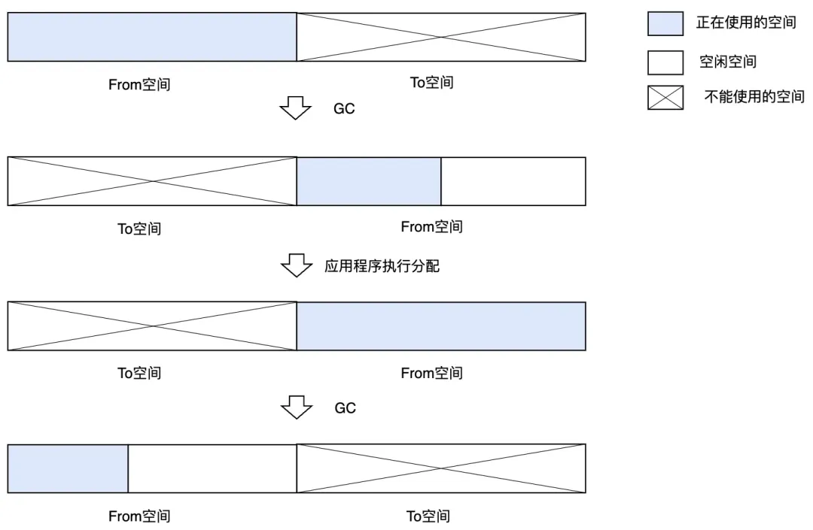

图3.11 GC 复制算法的示意图

#### GC 复制算法的执行过程

我们通过下面一个例子来说明 GC 复制算法的执行过程。如图3.12所示，堆里 From 空间已经分配满了部分对象，对象间的引用关系如连线所示，即将开始 GC，To 空间目前没有被使用，有个空闲分块起始指针 $free 需要指向 To 空间的开头，对象复制到了 To 空间放在 $free 指向的位置。

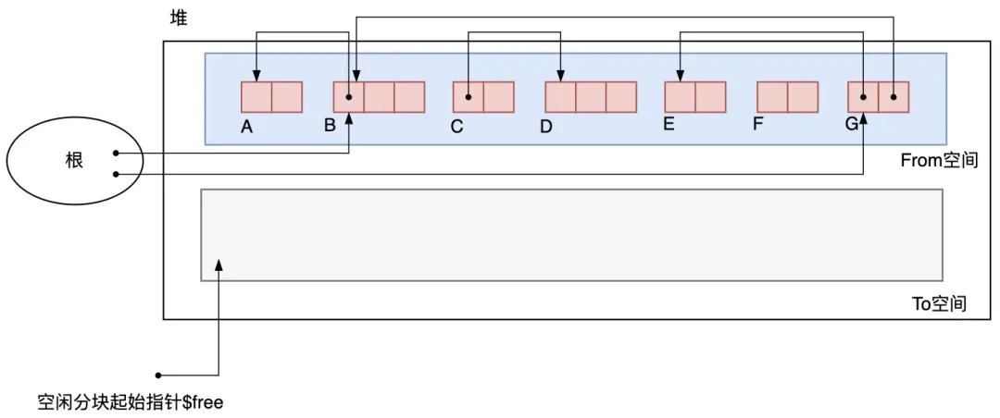

图3.12 初始状态

开始 GC 后，首先复制的是从根引用的对象 B 和 G，对象 B 先被复制到 To 空间，空闲分块起始指针 $free 移到 B 对象之后。B 被复制后生成的对象称为 B'，原对象 B 还在 From 空间，B 里保存了指向 B’的指针，因为原 From 空间还有其他对象要通过 B 找到 B’。 如图3.13所示。

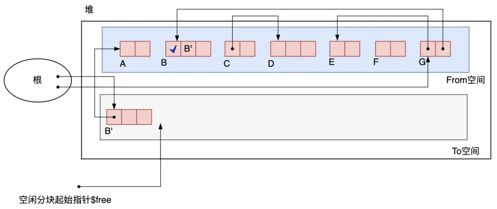

图3.13 B 被复制之后

目前只把 B’复制了过来，它的子对象 A 还在 From 空间里。下面要把这个 A 复制到 To 空间里。

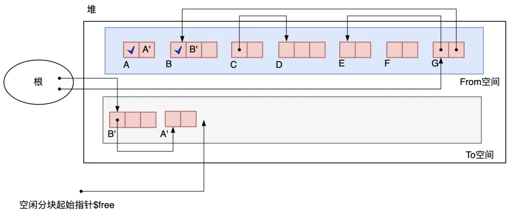

图3.14 A被复制之后

这次才可以说在真正意义上复制了 B。因为 A 没有子对象，所以对 A 的复制也就完成了。

接下来，我们要复制和 B 一样从根引用的 G，以及其子对象 E。虽然 B 也是 G 的子对象， 不过因为已经复制完 B 了，所以只要把从 G 指向 B 的指针换到 BꞋ 上就行了。

最后只要把 From 空间和 To 空间互换，GC 就结束了。GC 结束时堆的状态如图 3.15 所示。

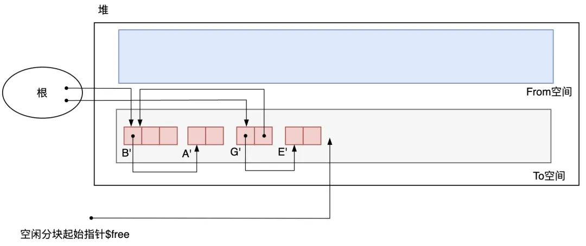

图3.15 GC 结束后

从 GC 复制算法的执行过程可以知道，从根开始搜索对象，采用的是深度优先搜索的方式。如图3.16所示。

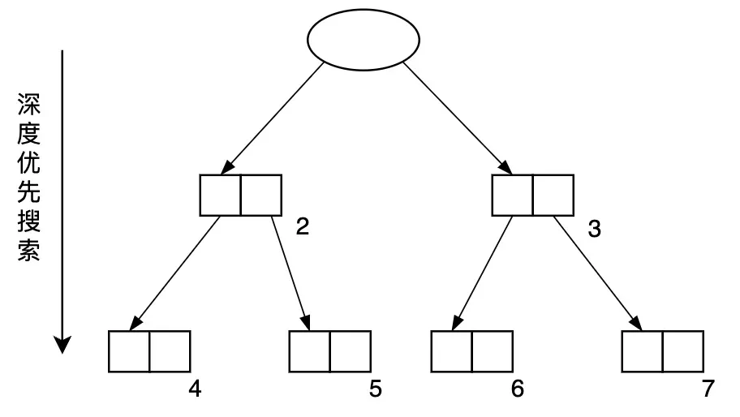

图3.16 GC 复制算法目前查找引用对象使用的是深度优先搜索

#### GC 复制算法的优点

1. 优秀的吞吐量。GC 标记-清除算法消耗的吞吐量是搜索活动对象(标记阶段)所花费的时间和搜索整体堆(清除阶段)所花费的时间之和。因为 GC 复制算法只搜索并复制活动对象，所以跟一般的 GC 标记-清除算法相比，它能在较短时间内完成 GC。也就是说，其吞吐量优秀。

2. 可实现内存的高速分配。GC 复制算法不使用空闲链表。这是因为分块是一个连续的内存空间。因此，调查这个分块的大小，只要这个分块大小不小于所申请的大小，那么移动空闲分块的指针就可以进行分配了。

3. 不会发生碎片化。基于算法性质，活动对象被集中安排在 From 空间的开头。像这样把对象重新集中，放在堆的一端的行为就叫作压缩。在 GC 复制算法中，每次运行 GC 时都会执行压缩。因此 GC 复制算法有个非常优秀的特点，就是不会发生碎片化。

4. 满足高速缓存的局部性原理。在 GC 复制算法中有引用关系的对象会被安排在堆里离彼此较近的位置。访问效率更高。

#### GC 复制算法的缺点

1. 堆使用效率低下。GC 复制算法把堆二等分，通常只能利用其中的一半来安排对象。也就是说，只有一半 堆能被使用。相比其他能使用整个堆的 GC 算法而言，可以说这是 GC 复制算法的一个重大的缺陷。

2. 不兼容保守式 GC 算法。因为GC复制算法会移动对象到另外的位置，保守式GC算法要求对象的位置不能移动，这在某些情况下有一点的优势。而GC复制算法没有这种优势。

3. 递归调用函数。复制某个对象时要递归复制它的子对象。因此在每次进行复制的时候都要调用递归函数，由此带来的额外负担不容忽视。比起这种递归算法，迭代算法更能高速地执行。此外，因为在每次递归调用时都会消耗栈，所以还有栈溢出的可能。

#### GC 复制算法的改进

##### 改进一：Cheney 的 GC 复制算法

Cheney 的 GC 复制算法说起来也没什么复杂的，就是将基本GC的深度优先搜索改为广度优先搜索。这样可以将递归复制改为迭代复制。

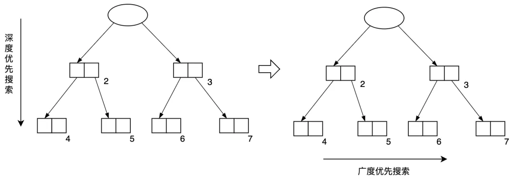

图3.17 Cheney 的 GC 复制算法将深度优先搜索改为广度优先搜索

Cheney 的 GC 复制算法的过程用下面几张图来描述。GC 开始前的初始状态如图3.18所示。只是在指向 To 空间开头的指针多了一个 $scan，用来扫描已复制对象的指针，该指针是实现广度优先搜索查找对象的关键。

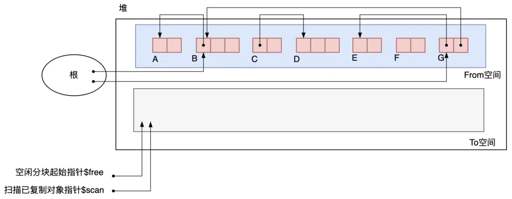

图3.18 初始状态

在 Cheney 的算法中，首先复制所有从根直接引用的对象，在这里就是复制 B 和 G。由于 $scan 负责对已复制完的对象进行搜索并向右移动指针，$free 负责对没复制的对象进行复制并向右移动指针，此时 $scan 仍然指着 To 空间的开头，$free 从 To 空间的开头向右移动了 B 和 G 个长度。如图3.19所示。

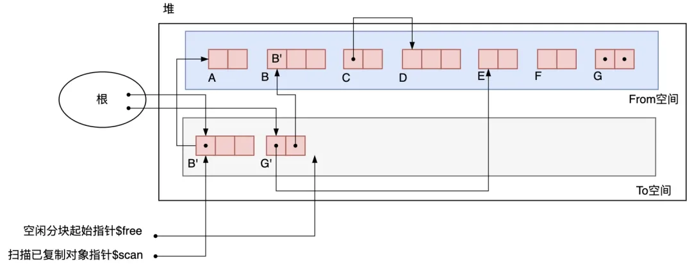

图3.19 复制 B 和 G 之后

由于根引用的两个对象 B、G 已经复制完成，接下来移动 $scan 指针搜索已复制对象 B 的子对象，然后把被 B’引用的 A 复制到了 To 空间，同时把 scan 和 $free 分别向右移动了。

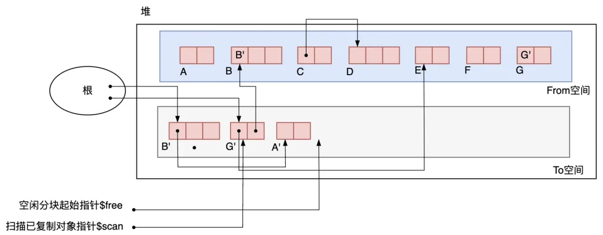

图3.20 搜索 B' 之后

下面该搜索的是 G’。搜索 G’后，E 被复制到了 To 空间，从 G’ 指向 B 的指针被换到了 B’。

下面该搜索 A’和 E’ 了，不过它们都没有子对象，所以即使搜索了也不能进行复制。因为在 E’ 搜索完成时 $scan 和 $free 一致，所以最后只要把 From 空间和 To 空间互换，GC 就结束了。如图3.21所示。

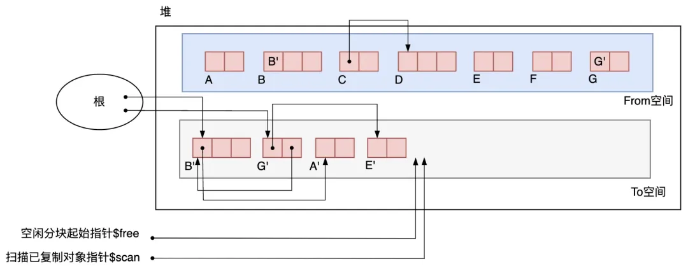

图3.21 GC 结束后

不用递归算法而用迭代算法，可以抑制调用函数的额外负担和栈的消耗。但是，带来的缺点是有引用关系的对象在内存中没有放在一起，没有利用到高速缓存 Cache 的局部性原理，在访问效率上要打个折扣。当然，对这一问题的改进是近似深度优先搜索方法，这里就不展开了。

##### 改进二：多空间复制算法

GC 复制算法最大的缺点是只能利用半个堆。这是因为该算法将整个堆分成了两半，每次都要腾出一半。多空间复制算法可以改进 GC 复制算法“只能利用半个堆”的问题。

多空间复制算法说白了就是把堆 N 等分，对其中 2 块空间执行 GC 复制算法，对剩下的（N-2）块空间执行 GC 标记-清除算法，也就是把这 2 种算法组合起来使用。 

下面用四张图来说明多空间复制算法的执行过程。

首先将堆划分成四个大小相同的子空间，分别用 heap[0]，heap[1]，heap[2]，heap[3] 来表示。

第1次执行 GC 之前，是 heap[0] 作为 To 空间，heap[1] 作为 From 空间，可以分配活动对象。heap[2] 和 heap[3] 也可以分配对象，不过是采用标记-清除算法，它们的空闲分块用空闲链表链接起来。

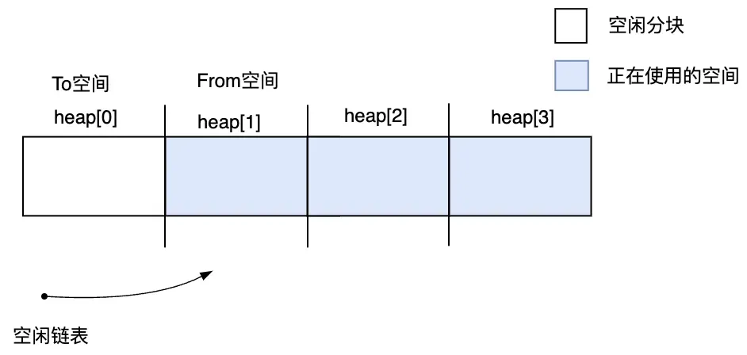

图3.22 开始执行第1次 GC 之前

第1次 GC 之后，作为 From 空间的 heap[1] 的活动对象复制到了作为 To 空间的 heap[0] 中。

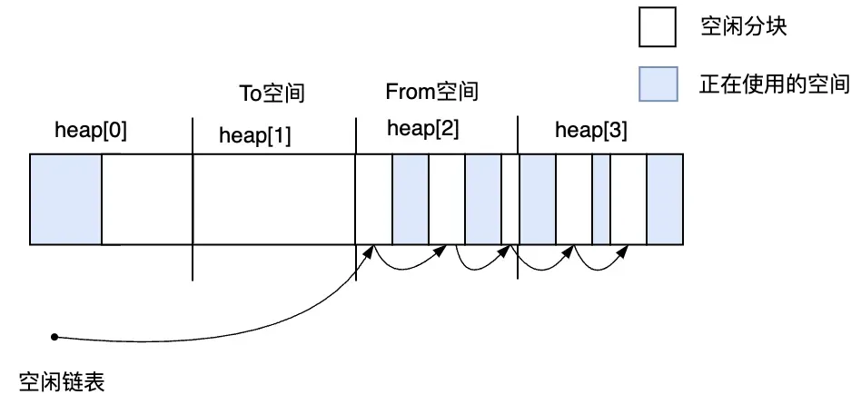

图3.23 第1次 GC 结束之后

接下来，将 To 空间和 From 空间分别向右移动一个位置，将 heap[1] 作为 To 空间，将 heap[2] 作为 From 空间。此时，新对象可以分配在作为 From 空间的 heap[2]，heap[0] 和 heap[3] 采用标记-清除算法，同样可以分配新对象。

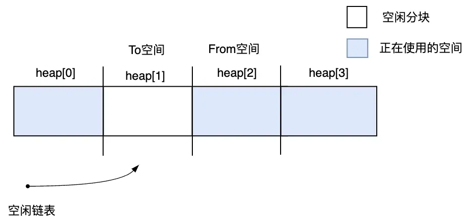

图3.24 开始执行第2次 GC 之前

如果作为 From 空间的 heap[2]，heap[0] 和 heap[3] 三个空间又满了，需要执行第2次 GC。此时，会把 From 空间的活动对象复制到作为 To 空间的 heap[1] 中，第2次 GC 结束之后的堆状态如下图3.25所示。

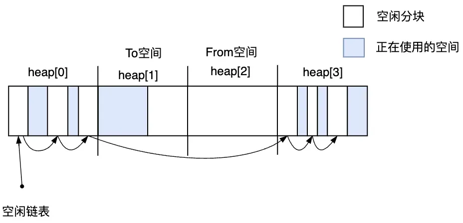

图3.25 第2次 GC 结束之后

**优点：** 多空间复制算法没有将堆二等分，而是分割成了更多块空间，从而更有效地利用了堆。以往的 GC 复制算法只能使用半个堆，而多空间复制算法仅仅需要空出一个分块，不能使用 的只有 1/N 个堆。

**缺点：** 执行 GC 复制算法的只有N等分中的两块空间，对于剩下的(N-2)块空间执行的是 GC 标记-清除算法。因此就出现了 GC 标记-清除算法固有的问题——分配耗费时间、分块碎片化等。只要把执行 GC 标记-清除算法的空间缩小，就可以缓解这些问题。打个比方，如果让 N = 3，就能把发生碎片化的空间控制在整体堆的 1/3。不过这时候为了在剩下的 2/3 的空间里执行 GC 复制算法，我们就不能使用其中的一半，也就是堆空间的 1/3。

从这里我们可以看到，几乎不存在没有缺点的万能算法。

### 3.4 GC 标记-压缩算法

#### 基本原理

GC 标记-压缩算法(Mark Compact GC)是将 GC 标记-清除算法与 GC 复制算法相结合的产物。

GC 标记-压缩算法由标记阶段和压缩阶段构成。在 GC 标记-压缩算法中新空间和原空间是同一个空间。

压缩阶段并不会改变对象的排列顺序，只是把对象按顺序从堆各处向左移动到堆的开头。这样就缩小了它们之间的空隙， 把它们聚集到了堆的一端。

#### GC 标记-压缩算法的执行过程

GC 标记-压缩算法的执行过程的简化版本，如下图3.26所示。GC 开始后，首先是标记阶段。搜索根引用的对象及其子对象并打上标记，这里采用深度优先搜索。然后将打上标记的活动对象复制到堆的开头。压缩阶段并不会改变对象的排列顺序，只是缩小了它们之间的空隙， 把它们聚集到了堆的一端。

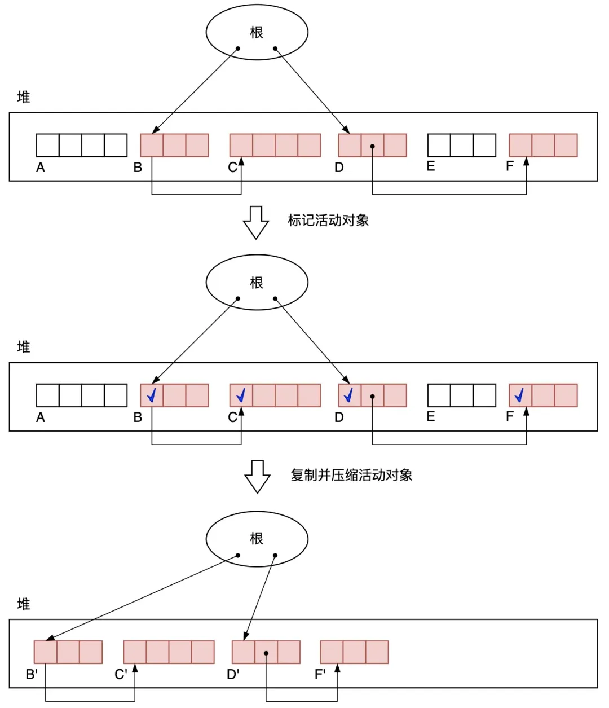

图3.26 GC 标记-复制算法的过程简化版

这里需要重点说明的是压缩过程。压缩过程会通过从头到尾按顺序扫描堆 3 次，第1次是对每个打上标记的对象找到它要移动的位置并记录在它们各自的成员变量 forwarding 里，第2次是重写所有活动对象的指针，将它们指向原位置的指针改为指向压缩后的对象地址，第3次是搜索整个堆，将活动对象移动到 forwarding 指针指向的位置完成对象的移动。

下面依次说明。

如图3.27所示，是第1次顺序扫描堆，对每个打上标记的对象，找到它要移动的位置并记录在它们各自的成员变量 forwarding 里。

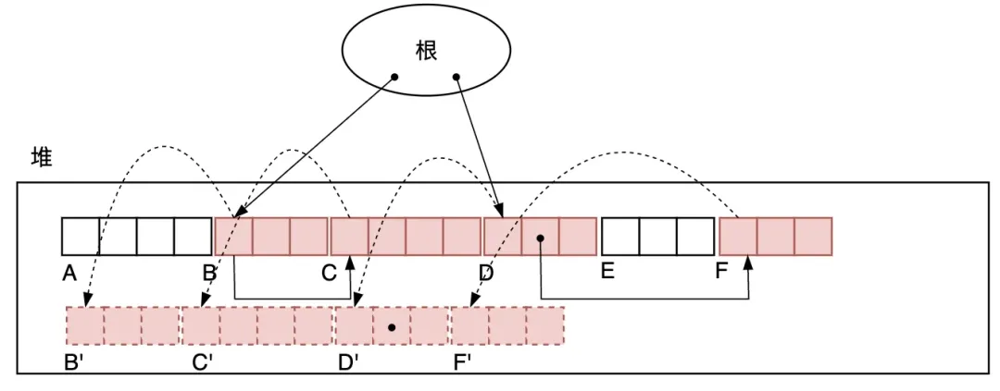

图3.27 顺序扫描堆，对各个活动对象用其 forwarding 指针记录其要移动的目标位置

第2次扫描堆，更新重写所有活动对象的指针，将它们指向原位置的指针改为指向压缩后的对象地址，如图3.28所示。

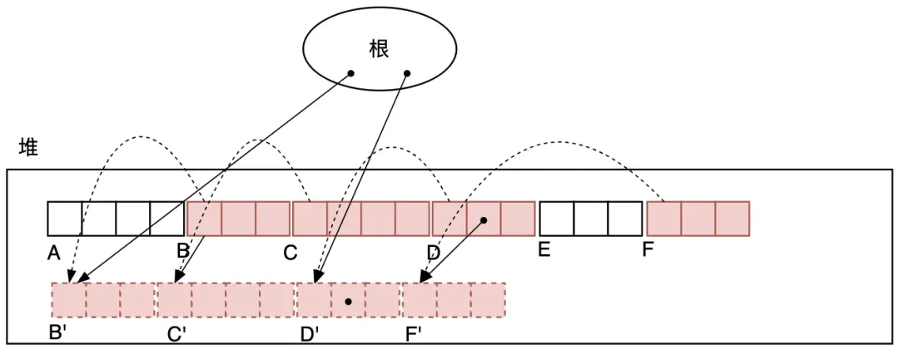

图3.28 扫描堆，更新重写所有活动对象的指针

第3次扫描堆，移动活动对象到其目的地址，完成对象的压缩过程。

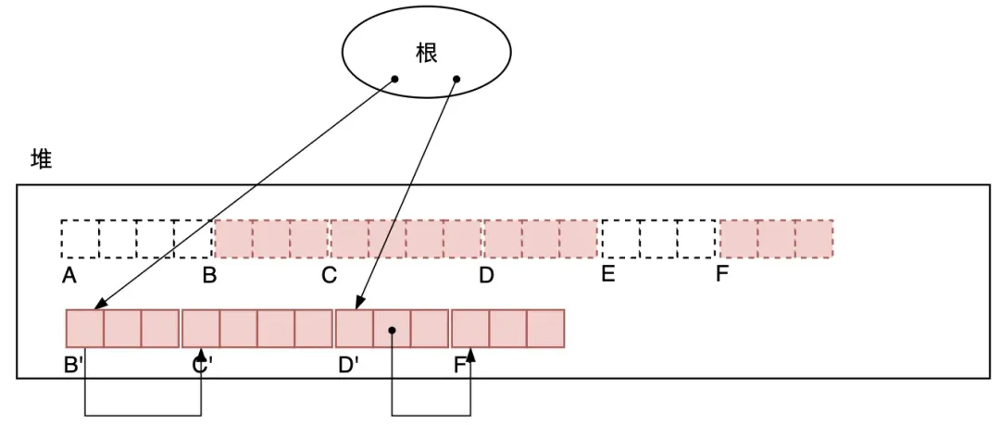

图3.29 扫描堆，移动活动对象到其目的地址

三次堆扫描完成后，GC 整个过程结束。GC 结束状态如图3.30所示。

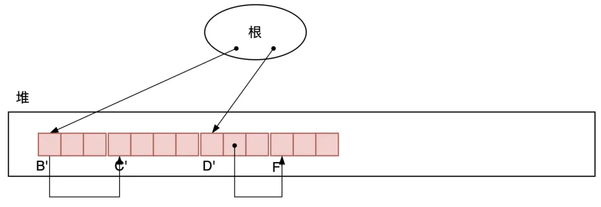

图3.30 GC 结束

#### GC 标记-压缩算法的优点

1. 可有效利用堆。GC 标记-压缩算法和其他算法相比而言，堆利用效率高。GC 标记-压缩算法不会出现 GC 复制算法那样只能利用半个堆的情况。GC 标记-压缩算法可以在整个堆中安排对象，堆使用效率几乎是 GC 复制算法的 2 倍。

2. 没有 GC 标记-清除法所带来的碎片化问题。

#### GC 标记-压缩算法的缺点
1. 压缩花费计算成本。压缩有着巨大的好处，但也有相应的代价。必须对整个堆进行 3 次搜索。执行该算法所花费的时间是和堆大小成正比的。

2. GC 标记-压缩算法的吞吐量要劣于其他算法。

#### GC 标记-压缩算法的改进

##### 改进一：减少堆搜索次数的 Two-Finger 二指算法

Two-Finger 算法有着很大的制约条件，那就是“必须将所有对象整理成大小一致”。

在基本的 GC 标记-压缩算法中，通过执行压缩操作使活动对象往左边滑动。而在 Two-Finger 算法中，是通过执行压缩操作来让活动对象填补空闲空间。此时为了让对象能恰好填补空闲空间， 必须让所有对象大小一致。

Two-Finger 二指算法中对象的移动过程，如下图3.31所示。主要用到了两个指针，空闲分块指针 $free 和活动对象指针 $live，前者从左往右找，后者从右往左找。当 $free 找到了空闲分块，$live 找到了活动对象，则将活动对象移动到空闲分块 $free 的位置，实现对象的移动。

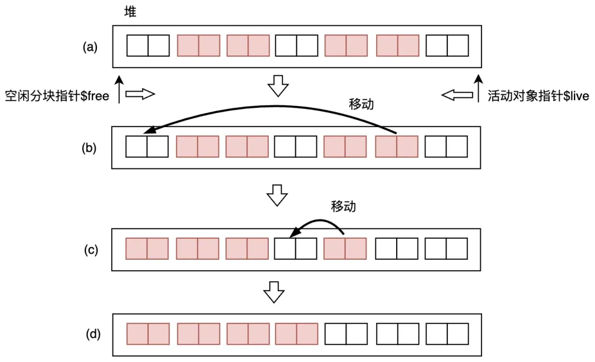

图3.31 Two-Finger 二指算法中对象的移动

**优点：** Two-Finger 二指算法，压缩需要的搜索次数只有 2 次，在吞吐量方面占优势。

**缺点：** 压缩移动对象时没有考虑把有引用关系的对象放在一起，无法利用高速缓存基于局部性原理提升访存效率。该算法还有一个限制条件，那就是所有对象的大小必须一致，导致应用受限。不过和第3.1节介绍的要求“将大小相近的对象整理成固定大小的块进行管理的做法”的 BiBOP 算法结合起来使用，会起到珠联璧合的效果。

### 3.5 保守式 GC

#### 什么是保守式 GC

保守式 GC(Conservative GC)指的是“不能识别指针和非指针的 GC”。

如下图所示，在 C/C++ 等高级语言的早期 GC 程序里，如果寄存器、函数调用栈或全局变量空间等这些根空间里有一个数值型的变量0x00d0caf0和一个指针的地址是相同的值0x00d0caf0，则程序无法识别这个值到底是数值变量还是指针。

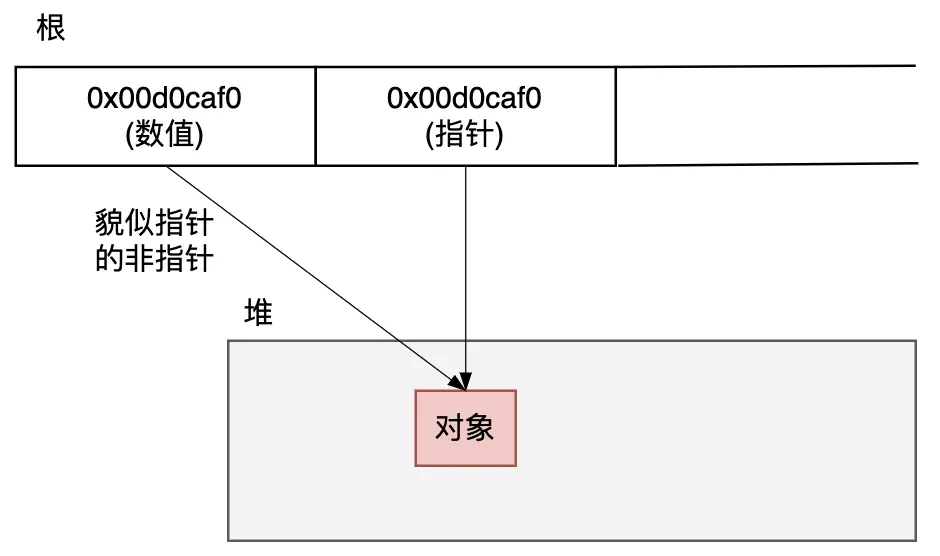

图3.32 貌似指针的非指针

对于貌似指针的非指针，为了避免错误回收导致程序故障，采取“宁可放过，不可杀错”的宽容原则，把它们当做活动对象而保留下来，像这样，在运行 GC 时采取的是一种保守的态度，即“把可疑的东西看作指针，稳妥处理”，所以我们称这种方法为“保守式 GC ”。

保守式 GC 的特点是尽量不移动对象的位置，因为容易把非指针重写从而产生意想不到的 BUG。

当然，大部分高级程序语言如 Java、Golang 在语言设计之初就是强类型语言，不存在无法识别变量和指针的问题，它们采用的就是跟保守式 GC 相对应的准确式 GC。

#### 保守式 GC 的优点
容易编写语言处理程序（语言处理程序是指将源程序转换成机器语言、以便计算机能够运行的汇编程序、编译程序和解释程序）。处理程序基本上不用在意 GC 就可以编写代码。语言处理程序的实现者即使没有意识到 GC 的存在，程序也会自己回收垃圾。因此语言处理程序的实现要比准确式 GC 简单。

#### 保守式 GC 的缺点

1. 识别指针和非指针需要付出成本。在跟空间里，变量和指针的值相同的情况下，程序需要额外通过是否内存对齐、是否指向堆内对象的开头等手段来判断指针和非指针，成本较高。

2. 错误识别指针会压迫堆。当存在貌似指针的非指针时，保守式 GC 会把被引用的对象错误识别为活动对象。如果这个对象存在大量的子对象，那么它们一律都会被看成活动对象。这样容易留下较多的垃圾对象，从而会严重压迫堆。

3. 能够使用的 GC 算法有限。由于保守式GC的特点是尽量不移动对象的位置，因为容易把非指针重写从而产生意想不到的BUG。所以基本上不能使用 GC 复制算法等移动对象的 GC 算法。

#### 保守式 GC 的改进

##### 改进一：准确式 GC

准确式 GC(Exact GC)和保守式 GC 正好相反，它是能正确识别指针和非指针的 GC。

要能精确地识别指针和非指针，需要依赖程序语言设计之初的语言处理程序的支持。

大部分高级程序语言如 Java、Golang，在语言设计之初就是强类型语言，不存在无法识别变量和指针的问题，它们采用的就是跟保守式 GC 相对应的准确式 GC。

**优点：** 不会错误识别指针，不会将已经死了的对象识别为活动对象，因此GC回收垃圾会比较彻底。还可以使用GC复制算法等需要移动对象的算法，提高GC的吞吐量和效率。

**缺点：** 当创建准确式 GC 时，语言处理程序(语言处理程序是指将源程序转换成机器语言、以便计算机能够运行的汇编程序、编译程序和解释程序)必须对 GC 进行一些支援。也就是说，在创建语言处理程序时必须顾及 GC。增加了语言处理程序的实现复杂度。

##### 改进二：间接引用

保守式 GC 有个缺点，就是“不能使用 GC 复制算法等移动对象的算法”。解决这个问题的方法之一就是“间接引用”。

根和对象之间通过句柄连接。每个对象都有一个句柄，它们分别持有指向这些对象的指针。并且局部变量和全局变量没有指向对象的指针，只装着指向句柄的指针。当应用程序操作对象时，要通过经由句柄的间接引用来执行。

只要采用了间接引用，那么即使移动了引用目标的对象，也不用改写关键的值——根里面的值，改写句柄里的指针就可以了。也就是说，我们只要采用间接引用来处理对象， 就可以移动对象。如下图所示，在复制完对象之后，根的值并没有重写。

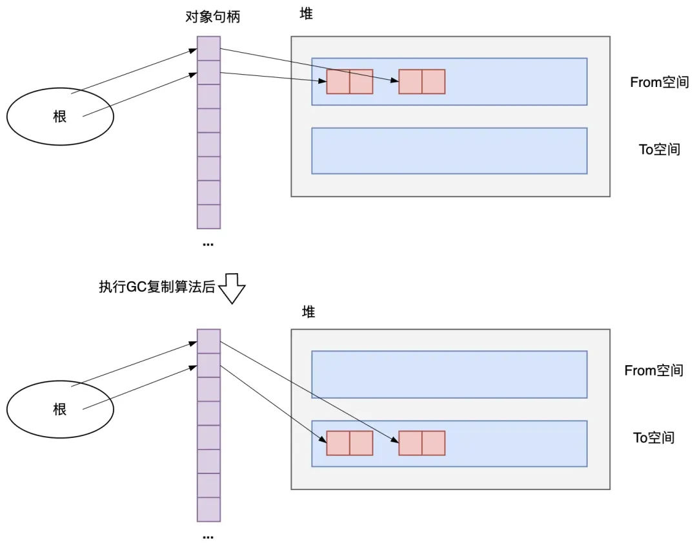

图3.33 根到对象通过句柄间接引用

**优点：** 因为在使用间接引用的情况下有可能实现 GC 复制算法，所以可以得到 GC 复制算法所带来的好处，例如消除碎片化等。

**缺点：** 因为必须将所有对象都(经由句柄)间接引用，所以会降低访问对象内数据的速度，这会关系到整个语言处理程序的速度。

##### 改进三：MostlyCopyingGC 大部分复制算法

MostlyCopyingGC 就是“把那些不明确的根指向的对象以外的对象都复制的 GC 算法”。Mostly 是“大部分”的意思。说白了，MostlyCopyingGC 就是抛开那些不能移动的对象，将其他“大部分”的对象都进行复制的 GC 算法。这里不展开细说了。

### 3.6 分代垃圾回收

程序应用中的一个经验：大部分的对象在生成后马上就变成了垃圾， 很少有对象能活得很久。

分代垃圾回收(Generational GC)，利用了该经验，在对象中导入了“年龄”的概念，经历过一次 GC 后活下来的对象年龄为 1 岁。

#### 新生代对象和老年代对象

分代垃圾回收中把对象分类成几代，针对不同的代使用不同的 GC 算法，我们把刚生成的对象称为新生代对象，到达一定年龄的对象则称为老年代对象。

由于新生代对象大部分会变成垃圾，如果应用程序只对这些新生代对象执行 GC，除了引用计数法以外的基本算法，都会进行只寻找活动对象的操作，如 GC 标记-清除算法的标记阶段和 GC 复制算法等。因此，如果很多对象都会死去，花费在 GC 上的时间应该就能减少。

我们将对新对象执行的 GC 称为新生代 GC(minor GC)。minor 在这里的意思是“小规模的”。新生代 GC 的前提是大部分新生代对象都没存活下来，GC 在短时间内就结束了。

另一方面，新生代 GC 将存活了一定次数的新生代对象当作老年代对象来处理。新生代对象上升为老年代对象的情况称为晋升(promotion)。

因为老年代对象很难成为垃圾，所以我们对老年代对象减少执行 GC 的频率。相对于新生代 GC，将面向老年代对象的 GC 称为老年代 GC(major GC)。

需要注意的是，分代垃圾回收不是跟 GC 标记-清除算法和 GC 复制算法并列在一起供开发人员选择的算法，而是需要跟这些基本算法一并使用。比如新生代GC使用GC复制算法，而老年代GC由于频率较低、可以使用最简单的GC标记-清除算法。

#### 分代垃圾回收的基本原理

分代垃圾回收算法把对分成了四个空间，分别是生成空间、2 个大小相等的幸存空间以及老年代空间。新生代对象会被分配到新生代空间，老年代对象则会被分配到老年代空间里。

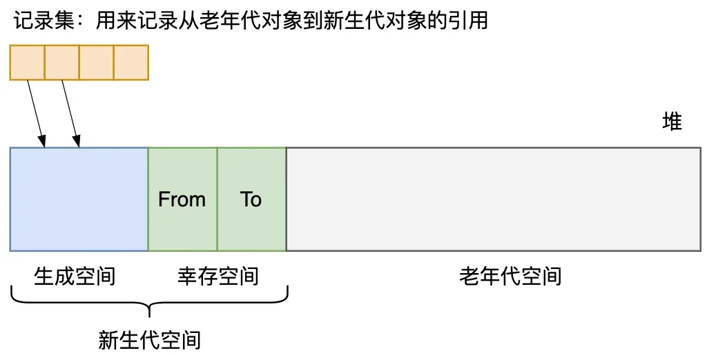

图3.34 分代垃圾回收的堆空间

应用程序创建的新对象一般会放到新生代空间里，当生成空间满了的时候，新生代 GC 就会启动，将生成空间中的所有活动对象复制，这跟 GC 复制算法是一个道理，复制的目标空间是幸存空间。

2 个幸存空间和 GC 复制算法里的 From 空间、To 空间很像，我们经常只利用其中的一个。在每次执行新生代 GC 的时候，活动对象就会被复制到另一个幸存空间里。在此我们将正在使用的幸存空间作为 From 幸存空间，将没有使用的幸存空间作为 To 幸存空间。

新生代 GC 也必须复制生成空间里的对象。也就是说，生成空间和 From 幸存空间这两个空间里的活动对象都会被复制到 To 幸存空间里去——这就是新生代 GC。

只有从一定次数的新生代 GC 中存活下来的对象才会得到晋升，也就是会被复制到老年代空间去。

在执行新生代 GC 时需要注意，需要考虑到从老年代空间到新生代空间的引用。新生代对象不只会被根和新生代空间引用，也可能被老年代对象引用。因此，除了一般 GC 里的根，还需要将从老年代空间的引用当作根(像根一样的东西)来处理。

这里，使用记录集用来记录从老年代对象到新生代对象的引用。这样在新生代 GC 时就可以不搜索老年代空间的所有对象，只通过搜索记录集来发现从老年代对象到新生代对象的引用。

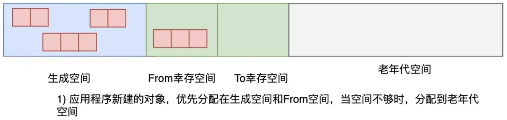

图3.35 新对象分配在生成空间和 From 空间

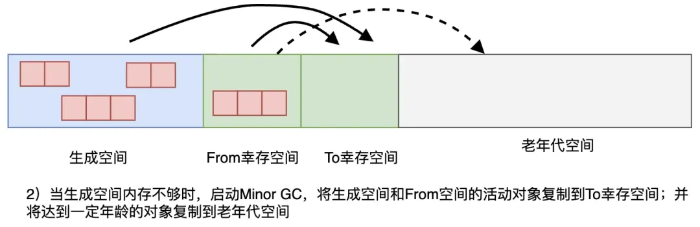

图3.36 MinorGC 启动，将活动对象复制到 To 空间

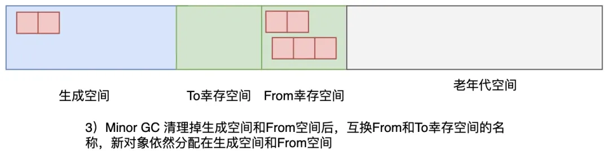

图3.37 MinorGC 清理完成后，互换 From 空间到 To 空间

通过新生代 GC 得到晋升的对象把老年代空间占满后，就要执行老年代 GC 了。老年代 GC 没什么难的地方，它只用到了3.1节的 GC 标记-清除算法。

#### 分代垃圾回收的优点

“很多对象年纪轻轻就会死”这一经验适合大多数情况，新生代 GC 只将刚生成的对象当成对象，这样一来就能减少时间上的消耗。分代垃圾回收可以改善 GC 所花费的时间(吞吐量)。“据实验表明，分代垃圾回收花费的时间是 GC 复制算法的 1/4。”

#### 分代垃圾回收的缺点

“很多对象年纪轻轻就会死”这个法则毕竟只适合大多数情况，并不适用于所有程序。对对象会活得很久的程序执行分代垃圾回收，就会产生以下两个问题。

- 新生代 GC 所花费的时间增多。

- 老年代 GC 频繁运行。

#### 分代垃圾回收的改进

##### 改进一：多代垃圾回收

分代垃圾回收将对象分为新生代和老年代，通过尽量减少从新生代晋升到老年代的对象， 来减少在老年代对象上消耗的垃圾回收的时间。

基于这个理论，大家可能会想到分为 3 代或 4 代岂不更好？这样一来能晋升到最老一代的对象不就更少了吗？这种方法就叫作多代垃圾回收(Multi-generational GC)。

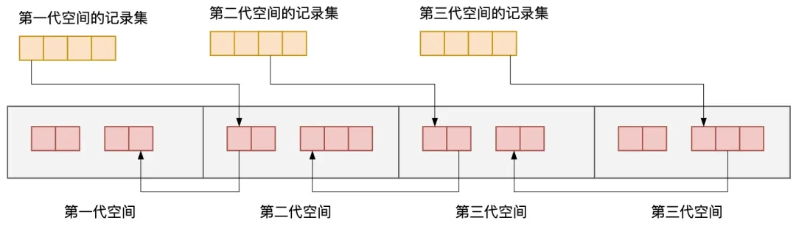

图3.38 4代垃圾回收的堆空间

在这个方法中，除了最老的那一代之外，每代都有一个记录集。X 代的记录集只记录来自比 X 老的其他代的引用。

分代数量越多，对象变成垃圾的机会也就越大，所以这个方法确实能减少活到最老代的对象。

但是我们也不能过度增加分代数量。分代数量越多，每代的空间也就相应地变小了，这样一来各代之间的引用就变多了，各代中垃圾回收花费的时间也就越来越长了。

综合来看，少设置一些分代能得到更优秀的吞吐量，据说分为 2 代或者 3 代是最好的。

### 3.7 增量式垃圾回收

增量式垃圾回收(Incremental GC)是一种通过逐渐推进垃圾回收来控制应用程序最大暂停时间的方法。

增量(incremental)这个词有“慢慢发生变化” 的意思。就如它的名字一样， 增量式垃圾回收是将 GC 和应用程序一点点交替运行的手法。增量式垃圾回收的示意图如图 3.39 所示。

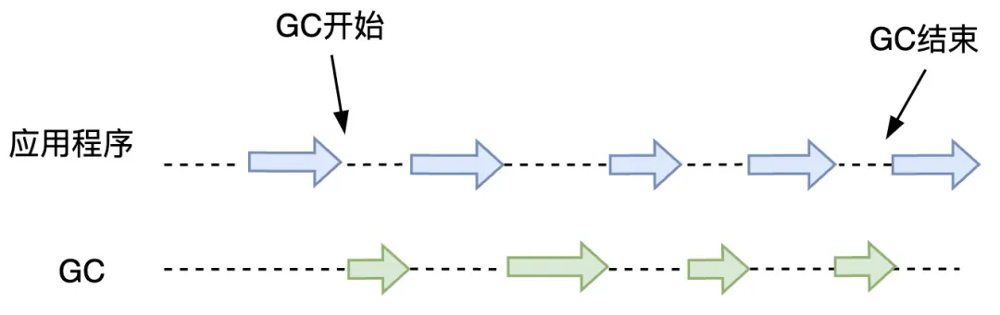

图3.39 增量式垃圾回收示意图

增量式垃圾回收也叫三色标记法(Tri-color marking)。本文中，增量式垃圾回收=三色标记法。

#### 三色标记法

三色标记法是将对象根据搜索情况，分为三种颜色：

- 白色：还未搜索过的对象。

- 灰色：正在搜索的对象。

- 黑色：搜索完成的对象。

GC 开始运行前所有的对象都是白色。GC 一开始运行，所有从根能到达的对象都会被标记，然后被堆到栈里。GC 只是发现了这样的对象，但还没有搜索完它们，所以这些对象就成了灰色对象。

灰色对象会被依次从栈中取出，其子对象也会被涂成灰色。当其所有的子对象都被涂成灰色时，对象就会被涂成黑色。

当 GC 结束时已经不存在灰色对象了，活动对象全部为黑色，垃圾则为白色。

这就是三色标记算法的概念。

三色标记法和 GC 标记-清除算法结合起来增量式执行，就是我们本节要说的增量式垃圾回收，或叫增量式标记-清除算法。

增量式的 GC 标记-清除算法(三色标记法)可分为以下三个阶段。

- 根查找阶段。

- 标记阶段。

- 清除阶段。

这本书的三色标记法解释的并不清楚，下面我结合 Golang 的三色标记实现来说明具体过程。

##### 1. 根查找阶段

在根查找阶段中，GC 程序将直接从根引用的对象打上灰色标记，放到灰色队列里，将 Root 根对象本身标记为黑色对象。根查找阶段只在 GC 开始时运行一次。如下图所示。

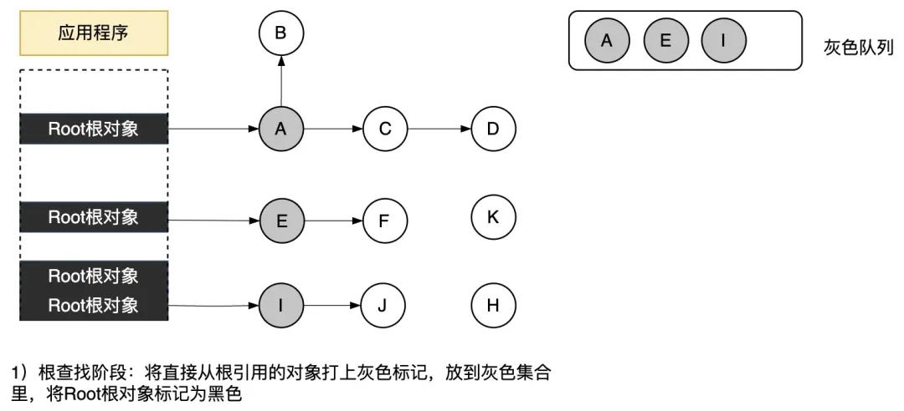

图3.40 根查找阶段

##### 2. 标记阶段

从灰色队列里取出对象，将其子对象涂成灰色，将该灰色对象本身标记为黑色。将这一系列操作执行 X 次，在这里“X 次”是重点，不是一次处理所有的灰色对象，而是只处理一定个数，然后暂停 GC，再次开始执行应用程序。这样一来，就能缩短应用程序的最大暂停时间。

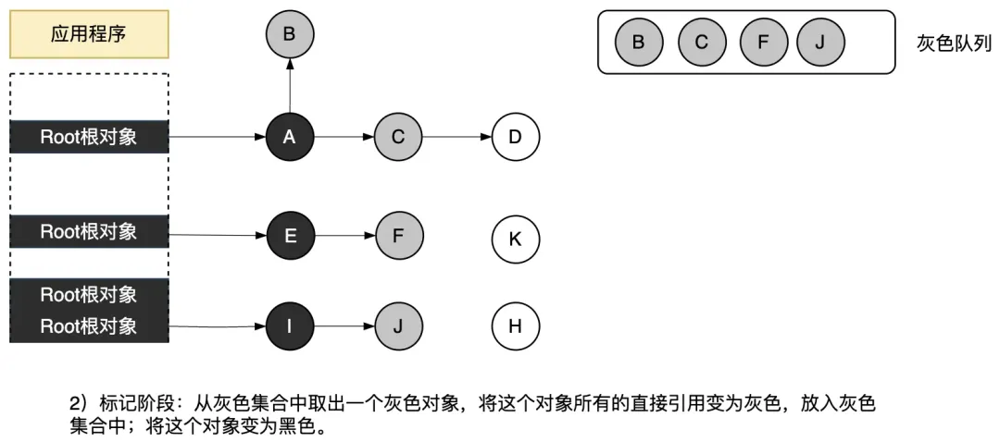

图3.41 标记阶段

将灰色队列里的所有灰色对象，通过多次搜索阶段、搜索并标记为黑色，完成后，意味着标记结束。标记结束时，灰色队列为空，所有灰色对象都成了黑色。这里，黑色对象意味着活动对象，白色对象意味着空闲对象，白色对象等待着在清除阶段被 GC 回收，也就是挂载到空闲链表上以供后面新对象分配使用。

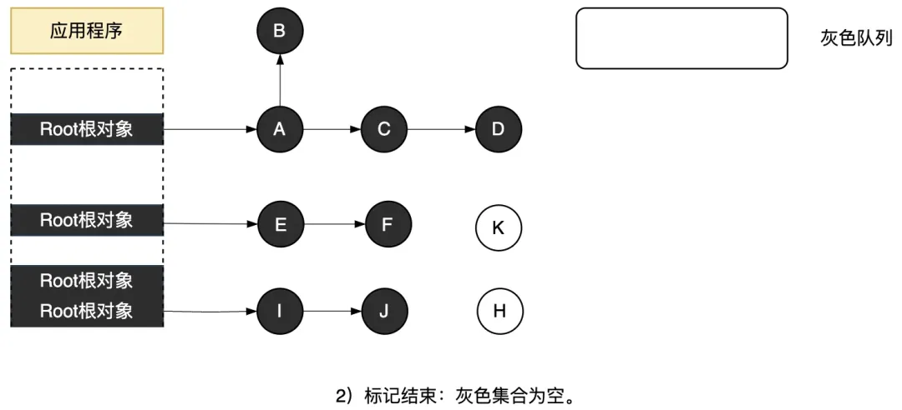

图3.42 标记结束

##### 3. 清除阶段

在清除阶段，将黑色对象视为活动对象并保留，将白色对象挂载到空闲链表以清除，便于后面新对象分配时使用。

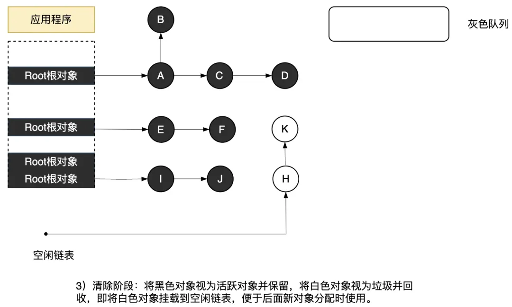

图3.43 清除阶段

三色标记清除算法本身是不可以并发或者增量执行的，它需要 STW 暂停应用程序，而如果并发执行，用户程序可能在标记执行的过程中修改对象的指针，容易把原本应该垃圾回收的死亡对象错误的标记为存活，或者把原本存活的对象错误的标记为已死亡，下面以后一种情况举例说明。

如下图所示。在一轮标记暂停的状态是：A 被涂成黑色，B 被涂成灰色进入灰色队列。所以下一轮标记，就要对 B 进行搜索了。如果在这两次标记之间，应用程序把从 A 指向 B 的引用更新为从 A 指向 C 之后的状态，然后再删除从 B 指向 C 的引用，如下图 c) 所示。这个时候如果重新开始标记， B 原本是灰色对象，经过搜索后被涂成了黑色。然而尽管 C 是活动对象，程序却不会对它进行搜索。这是因为已经搜索完有唯一指向 C 的引用的 A 了。

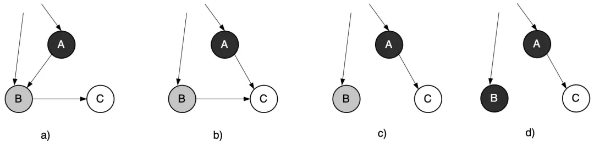

图3.44 没有 STW 时活动对象的标记遗漏

为了防止这种现象的发生，最简单的方式就是 STW，直接禁止掉其他用户程序对对象引用关系的干扰，但是 STW 的过程有明显的资源浪费，对所有的用户程序都有很大影响。那么是否可以在保证对象不丢失的情况下合理的尽可能的提高 GC 效率，减少 STW 时间呢？答案是可以的，就是屏障机制。

##### 写入屏障

写入屏障的具体操作是：在 A 对象引用 C 对象的时候，C 对象被标记为灰色。(将 C 挂在黑色对象A的下游，C 必须被标记为灰色)。

这一操作满足：不存在黑色对象引用白色对象的情况了， 因为白色会强制变成灰色。

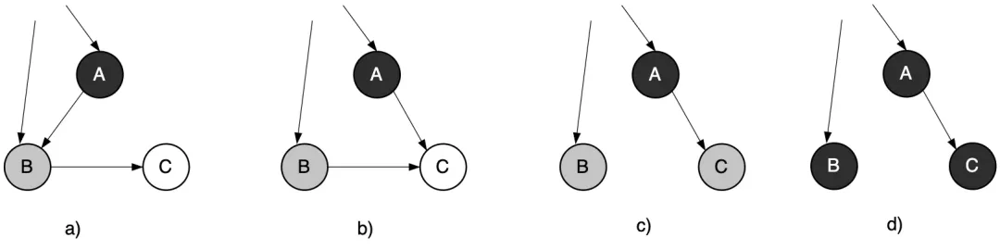

图3.45 白色对象被引用时强制被标记为灰色

增量式垃圾回收的优点

增量式垃圾回收不是一口气运行 GC，而是和应用程序交替运行的，因此不会长时间妨碍到应用程序的运行。

增量式垃圾回收适合那些比起提高吞吐量，更重视缩短最大暂停时间的应用程序。

#### 增量式垃圾回收的缺点

用到了写入屏障，就会增加额外负担。既然有缩短最大暂停时间的优势，吞吐量也一般。

增量式垃圾回收的改进

##### 改进一：Steele 的写入屏障

具体操作：在标记过程中发出引用的对象是黑色对象，且新的引用的目标对象为灰色或白色，那么我们就把发出引用的对象涂成灰色。如下图所示，A 原本为黑色，引用白色的 C，这时，A 需要回退到灰色。

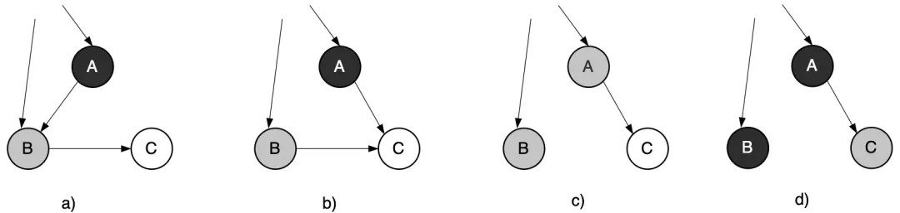

图3.46 黑色对象引用白色时，自身由黑变灰

Steele 的写入屏障相比上文的写入屏障来说，标记对象的条件要严格一些， 相应地写入屏障带来的额外负担会增大。但是可以减少被标记的对象，从而防止了因疏忽而造成垃圾残留的后果。

##### 改进二：删除屏障

具体操作: 被删除的对象，如果自身为灰色或者白色，那么被标记为灰色。如下图所示，C 被 B 删除时，C 本身为白色，所以需要被标记为灰色。

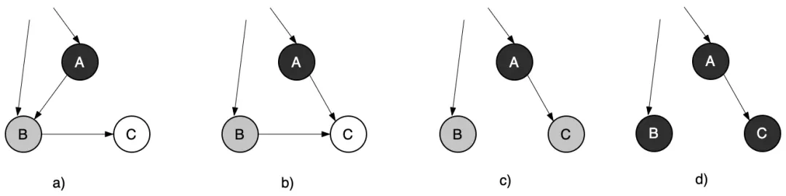

图3.47 对象被删除时，如果自身为灰或白，标记为灰色

这种方式实现相对简单，但是回收精度低，一个对象即使被删除了最后一个指向它的指针也依旧可以活过这一轮，在下一轮 GC 中才会被清理掉。

还有很多提高标记效率又能避免误删或遗留对象的屏障机制，比如混合写屏障，这里就不多讨论了。

## 四、七种 GC 算法的对比分析

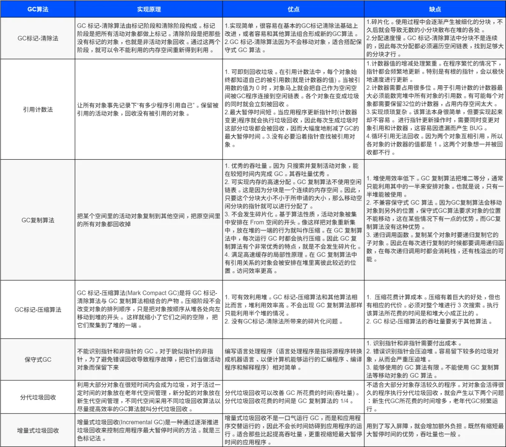

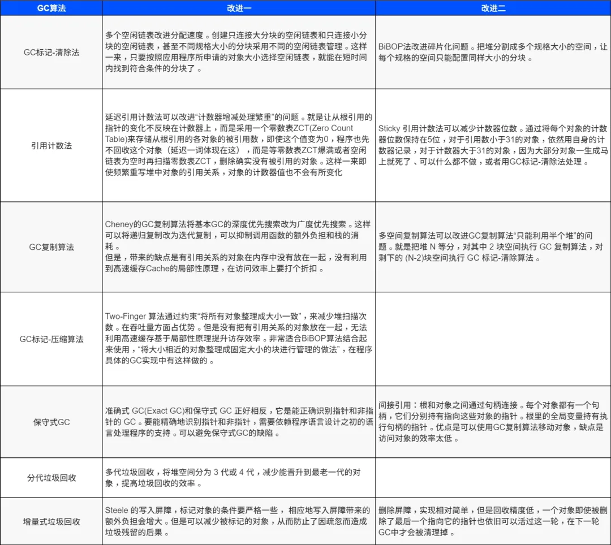

## 五、总结

内存其实就是一块连续的空间，可以看做一个大数组，这块空间在业务运行时，经常会或零散或整齐的分布一些大大小小的对象，怎么样高效的分配和回收这块空间，同时尽量不影响业务系统的运行，就是 GC 垃圾回收要做的事，学习了七种基本的 GC 算法之后，我们更加知道，工程技术中没有“银弹”，没有完美无缺的算法，只有最适合自己业务系统的解法。

本文的重要性在于：我们在具体的工程实践中，经常会遇到各种问题场景，每种场景都会遇到各种方案选型，各个不同方案的侧重点是什么、有什么缺点、缺点怎样改进，到底哪种方案是当前业务场景需要的，基于什么方面进行考虑选取某种方案，这些问题和疑惑，在思考并学习七种基本的 GC 算法的过程中，会得到很多启发和收获。
