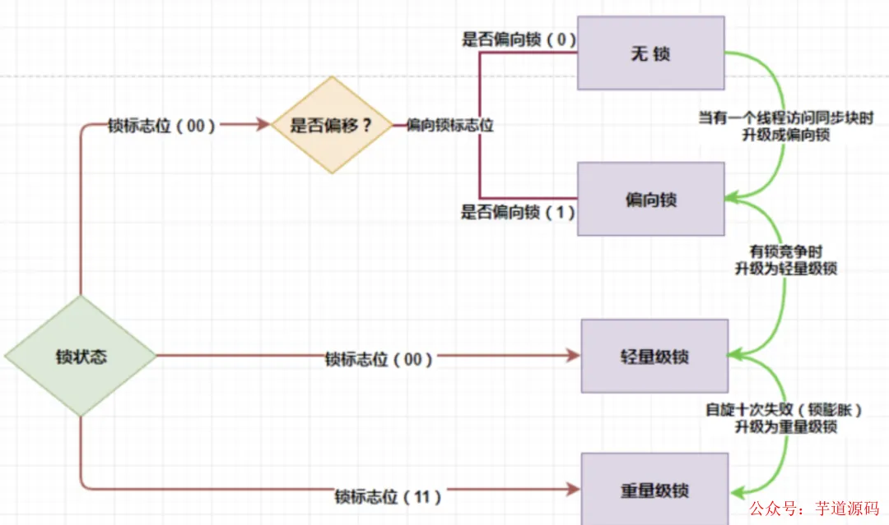
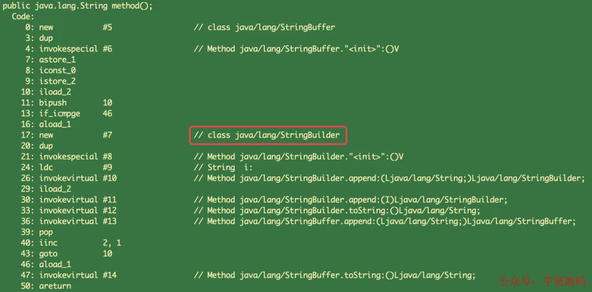

- [聊聊 13 种锁的实现方式](https://mp.weixin.qq.com/s/lTYBxsdUDe7Ix3iylbcNTw)

分布式系统时代，线程并发，资源抢占，"锁" 慢慢变得很重要。那么常见的锁都有哪些？

## 1、悲观锁
正如其名，它是指对数据修改时持保守态度，认为其他人也会修改数据。因此在操作数据时，会把数据锁住，直到操作完成。悲观锁大多数情况下依靠数据库的锁机制实现，以保证操作最大程度的独占性。如果加锁的时间过长，其他用户长时间无法访问，影响程序的并发访问性，同时这样对数据库性能开销影响也很大，特别是长事务而言，这样的开销往往无法承受。

如果是单机系统，我们可以采用 JAVA 自带的 `synchronized` 关键字，通过添加到方法或同步块上，锁住资源 如果是分布式系统，我们可以借助数据库自身的锁机制来实现

```sql
select * from 表名 where id= #{id} for update
```

使用悲观锁的时候，我们要注意锁的级别，MySQL innodb 在加锁时，只有明确的指定主键或（索引字段）才会使用 `行锁`；否则，会执行 `表锁`，将整个表锁住，此时性能会很差。在使用悲观锁时，我们必须关闭 MySQL 数据库的自动提交属性，因为mysql默认使用自动提交模式。悲观锁适用于写多的场景，而且并发性能要求不高

## 2、乐观锁
乐观锁，从字面意思也能猜到个大概，在操作数据时非常乐观，认为别人不会同时修改数据，因此乐观锁不会上锁 只是在 `提交更新` 时，才会正式对数据的冲突与否进行检测。如果发现冲突了，则返回错误信息，让用户决定如何去做，`fail-fast 机制` 。否则，执行本次操作。

**分为三个阶段：数据读取、写入校验、数据写入。**

如果是单机系统 ，我们可以基于JAVA 的 CAS来实现，CAS 是一种原子操作，借助硬件的比较并交换来实现。

如果是分布式系统 ，我们可以在数据库表中增加一个 `版本号` 字段，如：version

```sql
update 表 
set ... , version = version +1 
where id= #{id} and version = #{version} 
```

操作前，先读取记录的版本号，更新时，通过SQL语句比较版本号是否一致。如果一致，则更新数据。否则会再次读取版本，重试上面的操作。

## 3、分布式锁
JAVA 中的 `synchronized` `、ReentrantLock` 等，都是解决单体应用单机部署的资源互斥问题。随着业务快速发展，当单体应用演化为分布式集群后，多线程、多进程分布在不同的机器上，原来的单机并发控制锁策略失效

此时我们需要引入 `分布式锁`，解决跨机器的互斥机制来控制共享资源的访问。

分布式锁需要具备哪些条件：

- 与单机系统一样的资源互斥功能，这是锁的基础
- 高性能获取、释放锁
- 高可用
- 具备可重入性
- 有锁失效机制，防止死锁
- 非阻塞，不管是否获得锁，要能快速返回

实现方式多种多样，基于 `数据库`、`Redis`、以及 `Zookeeper` 等，这里讲下主流的基于Redis的实现方式：

加锁：

```shell
SET key unique_value  [EX seconds] [PX milliseconds] [NX|XX]
```

通过原子命令，如果执行成功返回 1，则表示加锁成功。注意：`unique_value` 是客户端生成的唯一标识，区分来自不同客户端的锁操作 解锁要特别注意，先判断 `unique_value` 是不是加锁的客户端，是的话才允许解锁删除。毕竟我们不能删除其他客户端加的锁。

解锁：解锁有两个命令操作，需要借助 Lua 脚本来保证原子性。

```lua
// 先比较 unique_value 是否相等，避免锁的误释放
if redis.call("get",KEYS[1]) == ARGV[1] then
    return redis.call("del",KEYS[1])
else
    return 0
end
```

借助 Redis 的高性能，Redis 实现分布式锁也是目前主流实现方式。但任何事情有利有弊，如果加锁的服务器宕机了，当slave 节点还没来得及数据备份，那不是别的客户端也可以获得锁。

为了解决这个问题，Redis 官方设计了一个分布式锁 Redlock。

**基本思路** ：让客户端与多个独立的 Redis 节点并行请求申请加锁，如果能在半数以上的节点成功地完成加锁操作，那么我们就认为，客户端成功地获得分布式锁，否则加锁失败。

## 4、可重入锁
可重入锁，也叫做递归锁，是指在同一个线程在调外层方法获取锁的时候，再进入内层方法会自动获取锁。

对象锁或类锁内部有计数器，一个线程每获得一次锁，计数器 +1；解锁时，计数器 -1。

> 有多少次加锁，就要对应多少次解锁，加锁与解锁成对出现。

JAVA 中的 `ReentrantLock` 和 `synchronized` 都是 可重入锁。可重入锁的一个好处是可一定程度避免死锁。

## 5、自旋锁
自旋锁是采用让当前线程不停地在循环体内执行，当循环的条件被其他线程改变时才能进入临界区。自旋锁只是将当前线程不停地执行循环体，不进行线程状态的改变，所以响应速度更快。但当线程数不断增加时，性能下降明显，因为每个线程都需要执行，会占用CPU时间片。如果线程竞争不激烈，并且保持锁的时间段。适合使用自旋锁。

自旋锁缺点：

- 可能引发死锁
- 可能占用 CPU 的时间过长

我们可以设置一个 循环时间 或 循环次数，超出阈值时，让线程进入阻塞状态，防止线程长时间占用 CPU 资源。JUC 并发包中的 CAS 就是采用自旋锁，`compareAndSet` 是CAS操作的核心，底层利用Unsafe对象实现的。

```java
public final int getAndAddInt(Object var1, long var2, int var4) {
    int var5;
    do {
        var5 = this.getIntVolatile(var1, var2);
    } while(!this.compareAndSwapInt(var1, var2, var5, var5 + var4));
    return var5;
}
```

如果内存中 var1 对象的var2字段值等于预期的 var5，则将该位置更新为新值（var5 + var4），否则不进行任何操作，一直重试，直到操作成功为止。

> CAS 包含了Compare和Swap 两个操作，如何保证原子性呢？CAS 是由 CPU 支持的原子操作，其原子性是在硬件层面进行控制。

特别注意，CAS 可能导致 ABA 问题，我们可以引入递增版本号来解决。

## 6、独享锁
独享锁，也有人叫它排他锁。无论读操作还是写操作，只能有一个线程获得锁，其他线程处于阻塞状态。

缺点：读操作并不会修改数据，而且大部分的系统都是 `读多写少`，如果读读之间互斥，大大降低系统的性能。下面的 `共享锁` 会解决这个问题。

像JAVA 中的 `ReentrantLock` 和 `synchronized` 都是独享锁

## 7、共享锁
共享锁是指允许多个线程同时持有锁，一般用在读锁上。读锁的共享锁可保证并发读是非常高效的。读写，写读 ，写写的则是互斥的。独享锁与共享锁也是通过AQS来实现的，通过实现不同的方法，来实现独享或者共享

`ReentrantReadWriteLock`，其读锁是共享锁，其写锁是独享锁。

## 8、读锁/写锁
如果对某个资源是读操作，那多个线程之间并不会相互影响，可以通过添加读锁实现共享。如果有修改动作，为了保证数据的并发安全，此时只能有一个线程获得锁，我们称之为 写锁。读读是共享的；而 读写、写读 、写写 则是互斥的

> 像 JAVA 中的 `ReentrantReadWriteLock` 就是一种 读写锁

## 9、公平锁/非公平锁
**公平锁** ：多个线程按照申请锁的顺序去获得锁，所有线程都在队列里排队，先来先获取的公平性原则。

**优点** ：所有的线程都能得到资源，不会饿死在队列中。

**缺点** ：吞吐量会下降很多，队列里面除了第一个线程，其他的线程都会阻塞，CPU 唤醒下一个阻塞线程有系统开销


**非公平锁** ：多个线程不按照申请锁的顺序去获得锁，而是同时以插队方式直接尝试获取锁，获取不到（插队失败），会进入队列等待（失败则乖乖排队），如果能获取到（插队成功），就直接获取到锁。

**优点** ：可以减少 CPU 唤醒线程的开销，整体的吞吐效率会高点

**缺点** ：可能导致队列中排队的线程一直获取不到锁或者长时间获取不到锁，活活饿死。

Java 多线程并发操作，我们操作锁大多时候都是基于 `Sync` 本身去实现的，而 `Sync` 本身却是 `ReentrantLock` 的一个内部类，`Sync` 继承 `AbstractQueuedSynchronizer`

像 `ReentrantLock` 默认是非公平锁，我们可以在构造函数中传入 true，来创建公平锁。
```java
public ReentrantLock(boolean fair) {
    sync = fair ? new FairSync() : new NonfairSync();
}
```

## 10、可中断锁/不可中断锁
可中断锁：指一个线程因为没有获得锁在阻塞等待过程中，可以中断自己阻塞的状态。不可中断锁：恰恰相反，如果锁被其他线程获取后，当前线程只能阻塞等待。如果持有锁的线程一直不释放锁，那其他想获取锁的线程就会一直阻塞。

内置锁 `synchronized` 是不可中断锁，而 `ReentrantLock` 是可中断锁。

`ReentrantLock` 获取锁定有三种方式：

- `lock()`， 如果获取了锁立即返回，如果别的线程持有锁，当前线程则一直处于阻塞状态，直到该线程获取锁
- `tryLock()`， 如果获取了锁立即返回true，如果别的线程正持有锁，立即返回false
- `tryLock(long timeout,TimeUnit unit)`， 如果获取了锁定立即返回true，如果别的线程正持有锁，会等待参数给定的时间，在等待的过程中，如果获取了锁定，就返回true，如果等待超时，返回false；
- `lockInterruptibly()`，如果获取了锁定立即返回；如果没有获取锁，线程处于阻塞状态，直到获取锁或者线程被别的线程中断

更多：https://github.com/aalansehaiyang/p-java-proof/blob/master/resource/17.md

## 11、分段锁
分段锁其实是一种锁的设计，目的是细化锁的粒度，并不是具体的一种锁，对于 `ConcurrentHashMap` 而言，其并发的实现就是通过分段锁的形式来实现高效的并发操作。

`ConcurrentHashMap`中的分段锁称为`Segment`，它即类似于`HashMap`（JDK7 中`HashMap`的实现）的结构，即内部拥有一个`Entry`数组，数组中的每个元素又是一个链表；同时又是一个 `ReentrantLock`（`Segment`继承了`ReentrantLock`）。

当需要put元素的时候，并不是对整个`HashMap`加锁，而是先通过`hashcode`知道要放在哪一个分段中，然后对这个分段加锁，所以当多线程put时，只要不是放在同一个分段中，可支持并行插入。

## 12、锁升级（无锁|偏向锁|轻量级锁|重量级锁）
JDK 1.6之前，`synchronized` 还是一个重量级锁，效率比较低。但是在JDK 1.6后，JVM为了提高锁的获取与释放效率对 `synchronized` 进行了优化，引入了偏向锁和轻量级锁 ，从此以后锁的状态就有了四种：无锁、偏向锁、轻量级锁、重量级锁。这四种状态会随着竞争的情况逐渐升级，而且是不可降级。



### 无锁

无锁并不会对资源锁定，所有的线程都可以访问并修改同一个资源，但同时只有一个线程能修改成功。也就是我们常说的乐观锁。

### 偏向锁

偏向于第一个访问锁的线程，初次执行 `synchronized` 代码块时，通过 CAS 修改对象头里的锁标志位，锁对象变成偏向锁。

当一个线程访问同步代码块并获取锁时，会在 `Mark Word` 里存储锁偏向的线程 ID。在线程进入和退出同步块时不再通过 CAS 操作来加锁和解锁，而是检测 `Mark Word` 里是否存储着指向当前线程的偏向锁。轻量级锁的获取及释放依赖多次 CAS 原子指令，而偏向锁只需要在置换 `ThreadID` 的时候依赖一次 `CAS` 原子指令即可。

执行完同步代码块后，线程并不会主动释放偏向锁。当线程第二次再执行同步代码块时，线程会判断此时持有锁的线程是否就是自己（持有锁的线程ID也在对象头里），如果是则正常往下执行。由于之前没有释放锁，这里不需要重新加锁，偏向锁几乎没有额外开销，性能极高。

偏向锁只有遇到其他线程尝试竞争偏向锁时，持有偏向锁的线程才会释放锁，线程是不会主动释放偏向锁的。关于偏向锁的撤销，需要等待全局安全点，即在某个时间点上没有字节码正在执行时，它会先暂停拥有偏向锁的线程，然后判断锁对象是否处于被锁定状态。如果线程不处于活动状态，则将对象头设置成无锁状态，并撤销偏向锁，恢复到无锁（标志位为01）或轻量级锁（标志位为00）的状态。

> 偏向锁是指当一段同步代码一直被同一个线程所访问时，即不存在多个线程的竞争时，那么该线程在后续访问时便会自动获得锁，从而降低获取锁带来的消耗。

### 轻量级锁

当前锁是偏向锁，此时有多个线程同时来竞争锁，偏向锁就会升级为轻量级锁。轻量级锁认为虽然竞争是存在的，但是理想情况下竞争的程度很低，通过自旋方式来获取锁。

轻量级锁的获取有两种情况：

- 当关闭偏向锁功能时
- 多个线程竞争偏向锁导致偏向锁升级为轻量级锁。一旦有第二个线程加入锁竞争，偏向锁就升级为轻量级锁（自旋锁）

在轻量级锁状态下继续锁竞争，没有抢到锁的线程将自旋，不停地循环判断锁是否能够被成功获取。获取锁的操作，其实就是通过CAS修改对象头里的锁标志位。先比较当前锁标志位是否为“释放”，如果是则将其设置为“锁定”，此过程是原子性。如果抢到锁，然后线程将当前锁的持有者信息修改为自己。

### 重量级锁

如果线程的竞争很激励，线程的自旋超过了一定次数（默认循环10次，可以通过虚拟机参数更改），将轻量级锁升级为重量级锁（依然是 CAS  修改锁标志位，但不修改持有锁的线程ID），当后续线程尝试获取锁时，发现被占用的锁是重量级锁，则直接将自己挂起（而不是忙等），等待将来被唤醒。

重量级锁是指当有一个线程获取锁之后，其余所有等待获取该锁的线程都会处于阻塞状态。简言之，就是所有的控制权都交给了操作系统，由操作系统来负责线程间的调度和线程的状态变更。而这样会出现频繁地对线程运行状态的切换，线程的挂起和唤醒，从而消耗大量的系统资。

## 13、锁优化技术（锁粗化、锁消除）
**锁粗化** 就是告诉我们任何事情都有个度，有些情况下我们反而希望把很多次锁的请求合并成一个请求，以降低短时间内大量锁请求、同步、释放带来的性能损耗。

举个例子：有个循环体，内部

```java
for(int i=0;i<size;i++){
    synchronized(lock){
        ...业务处理，省略
    }
}
```
经过锁粗化的代码如下：

```java
synchronized(lock){
    for(int i=0;i<size;i++){
        ...业务处理，省略
    }
}
```

**锁消除** 指的是在某些情况下，JVM 虚拟机如果检测不到某段代码被共享和竞争的可能性，就会将这段代码所属的同步锁消除掉，从而到底提高程序性能的目的。

锁消除的依据是逃逸分析的数据支持，如 `StringBuffer` 的 `append()` 方法，或 `Vector` 的 `add()` 方法，在很多情况下是可以进行锁消除的，比如以下这段代码：

```java
public String method() {
    StringBuffer sb = new StringBuffer();
    for (int i = 0; i < 10; i++) {
        sb.append("i:" + i);
    }
    return sb.toString();
}
```

以上代码经过编译之后的字节码如下：



从上述结果可以看出，之前我们写的线程安全的加锁的 `StringBuffer` 对象，在生成字节码之后就被替换成了不加锁不安全的 `StringBuilder` 对象了，原因是 `StringBuffer` 的变量属于一个局部变量，并且不会从该方法中逃逸出去，所以我们可以使用锁消除（不加锁）来加速程序的运行。
