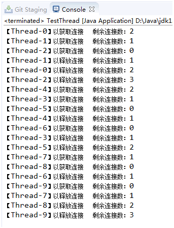

- [Java并发系列[6]----Semaphore源码分析](https://cnblogs.com/liuyun1995/p/8474026.html)
- [【96期】Java并发系列 | Semaphore源码分析](https://mp.weixin.qq.com/s/gfrnrGEfqkA1MpGq8aAnAQ)

`Semaphore`(信号量)是JUC包中比较常用到的一个类，它是AQS共享模式的一个应用，可以允许多个线程同时对共享资源进行操作，并且可以有效的控制并发数，利用它可以很好的实现流量控制。

`Semaphore`提供了一个许可证的概念，可以把这个许可证看作公共汽车车票，只有成功获取车票的人才能够上车，并且车票是有一定数量的，不可能毫无限制的发下去，这样就会导致公交车超载。所以当车票发完的时候(公交车以满载)，其他人就只能等下一趟车了。如果中途有人下车，那么他的位置将会空闲出来，因此如果这时其他人想要上车的话就又可以获得车票了。

利用`Semaphore`可以实现各种池，我们在本篇末尾将会动手写一个简易的数据库连接池。首先我们来看一下`Semaphore`的构造器。
```java
//构造器1
public Semaphore(int permits) {
    sync = new NonfairSync(permits);
}

//构造器2
public Semaphore(int permits, boolean fair) {
    sync = fair ? new FairSync(permits) : new NonfairSync(permits);
}
```

`Semaphore`提供了两个带参构造器，没有提供无参构造器。这两个构造器都必须传入一个初始的许可证数量，使用构造器1构造出来的信号量在获取许可证时会采用非公平方式获取，使用构造器2可以通过参数指定获取许可证的方式(公平or非公平)。

Semaphore主要对外提供了两类API，获取许可证和释放许可证，默认的是获取和释放一个许可证，也可以传入参数来同时获取和释放多个许可证。在本篇中我们只讲每次获取和释放一个许可证的情况。

## 1、获取许可证
```java
//获取一个许可证(响应中断)
public void acquire() throws InterruptedException {
    sync.acquireSharedInterruptibly(1);
}

//获取一个许可证(不响应中断)
public void acquireUninterruptibly() {
    sync.acquireShared(1);
}

//尝试获取许可证(非公平获取)
public boolean tryAcquire() {
    return sync.nonfairTryAcquireShared(1) >= 0;
}

//尝试获取许可证(定时获取)
public boolean tryAcquire(long timeout, TimeUnit unit) throws InterruptedException {
    return sync.tryAcquireSharedNanos(1, unit.toNanos(timeout));
}
```

上面的API是`Semaphore`提供的默认获取许可证操作。每次只获取一个许可证，这也是现实生活中较常遇到的情况。除了直接获取还提供了尝试获取，直接获取操作在失败之后可能会阻塞线程，而尝试获取则不会。另外还需注意的是`tryAcquire`方法是使用非公平方式尝试获取的。在平时我们比较常用到的是`acquire`方法去获取许可证。下面我们就来看看它是怎样获取的。可以看到acquire方法里面直接就是调用`sync.acquireSharedInterruptibly`，这个方法是`AQS`里面的方法，我们简单讲一下。

```java
//以可中断模式获取锁(共享模式)
public final void acquireSharedInterruptibly(int arg) throws InterruptedException {
    //首先判断线程是否中断, 如果是则抛出异常
    if (Thread.interrupted()) {
        throw new InterruptedException();
    }
    //1.尝试去获取锁
    if (tryAcquireShared(arg) < 0) {
        //2. 如果获取失败则进人该方法
        doAcquireSharedInterruptibly(arg);
    }
}
```

`acquireSharedInterruptibly`方法首先就是去调用`tryAcquireShared`方法去尝试获取，`tryAcquireShared`在`AQS`里面是抽象方法，`FairSync`和`NonfairSync`这两个派生类实现了该方法的逻辑。`FairSync`实现的是公平获取的逻辑，而`NonfairSync`实现的非公平获取的逻辑。

```java
abstract static class Sync extends AbstractQueuedSynchronizer {
    //非公平方式尝试获取
    final int nonfairTryAcquireShared(int acquires) {
        for (;;) {
            //获取可用许可证
            int available = getState();
            //获取剩余许可证
            int remaining = available - acquires;
            //1.如果remaining小于0则直接返回remaining
            //2.如果remaining大于0则先更新同步状态再返回remaining
            if (remaining < 0 || compareAndSetState(available, remaining)) {
                return remaining;
            }
        }
    }
}

//非公平同步器
static final class NonfairSync extends Sync {
    private static final long serialVersionUID = -2694183684443567898L;

    NonfairSync(int permits) {
        super(permits);
    }

    //尝试获取许可证
    protected int tryAcquireShared(int acquires) {
        return nonfairTryAcquireShared(acquires);
    }
}

//公平同步器
static final class FairSync extends Sync {
    private static final long serialVersionUID = 2014338818796000944L;

    FairSync(int permits) {
        super(permits);
    }

    //尝试获取许可证
    protected int tryAcquireShared(int acquires) {
        for (;;) {
            //判断同步队列前面有没有人排队
            if (hasQueuedPredecessors()) {
                //如果有的话就直接返回-1，表示尝试获取失败
                return -1;
            }
            //获取可用许可证
            int available = getState();
            //获取剩余许可证
            int remaining = available - acquires;
            //1.如果remaining小于0则直接返回remaining
            //2.如果remaining大于0则先更新同步状态再返回remaining
            if (remaining < 0 || compareAndSetState(available, remaining)) {
                return remaining;
            }
        }
    }
}
```

这里需要注意的是`NonfairSync`的`tryAcquireShared`方法直接调用的是`nonfairTryAcquireShared`方法，这个方法是在父类`Sync`里面的。非公平获取锁的逻辑是先取出当前同步状态(同步状态表示许可证个数)，将当前同步状态减去参入的参数，如果结果不小于0的话证明还有可用的许可证，那么就直接使用`CAS`操作更新同步状态的值，最后不管结果是否小于0都会返回该结果值。

这里我们要了解`tryAcquireShared`方法返回值的含义，返回负数表示获取失败，零表示当前线程获取成功但后续线程不能再获取，正数表示当前线程获取成功并且后续线程也能够获取。我们再来看`acquireSharedInterruptibly`方法的代码。

```java
//以可中断模式获取锁(共享模式)
public final void acquireSharedInterruptibly(int arg) throws InterruptedException {
    //首先判断线程是否中断, 如果是则抛出异常
    if (Thread.interrupted()) {
        throw new InterruptedException();
    }
    //1.尝试去获取锁
    //负数：表示获取失败
    //零值：表示当前线程获取成功, 但是后继线程不能再获取了
    //正数：表示当前线程获取成功, 并且后继线程同样可以获取成功
    if (tryAcquireShared(arg) < 0) {
        //2. 如果获取失败则进人该方法
        doAcquireSharedInterruptibly(arg);
    }
}
```

如果返回的`remaining < 0`的话就代表获取失败，因此`tryAcquireShared(arg) < 0`就为`true`，所以接下来就会调用`doAcquireSharedInterruptibly`方法，这个方法我们在讲AQS的时候讲过，它会将当前线程包装成结点放入同步队列尾部，并且有可能挂起线程。这也是当remaining小于0时线程会排队阻塞的原因。

而如果返回的`remaining>=0`的话就代表当前线程获取成功，因此`tryAcquireShared(arg) < 0`就为`flase`，所以就不会再去调用`doAcquireSharedInterruptibly`方法阻塞当前线程了。

以上是非公平获取的整个逻辑，而公平获取时仅仅是在此之前先去调用`hasQueuedPredecessors`方法判断同步队列是否有人在排队，如果有的话就直接`return -1`表示获取失败，否则才继续执行下面和非公平获取一样的步骤。

## 2、释放许可证
```java
//释放一个许可证
public void release() {
    sync.releaseShared(1);
}
```

调用release方法是释放一个许可证，它的操作很简单，就调用了AQS的releaseShared方法，我们来看看这个方法。

```java
//释放锁的操作(共享模式)
public final boolean releaseShared(int arg) {
    //1.尝试去释放锁
    if (tryReleaseShared(arg)) {
        //2.如果释放成功就唤醒其他线程
        doReleaseShared();
        return true;
    }
    return false;
}
```

`AQS`的`releaseShared`方法首先调用`tryReleaseShared`方法尝试释放锁，这个方法的实现逻辑在子类`Sync`里面。

```java
abstract static class Sync extends AbstractQueuedSynchronizer {
    ...
    //尝试释放操作
    protected final boolean tryReleaseShared(int releases) {
        for (;;) {
            //获取当前同步状态
            int current = getState();
            //将当前同步状态加上传入的参数
            int next = current + releases;
            //如果相加结果小于当前同步状态的话就报错
            if (next < current) {
                throw new Error("Maximum permit count exceeded");
            }
            //以CAS方式更新同步状态的值, 更新成功则返回true, 否则继续循环
            if (compareAndSetState(current, next)) {
                return true;
            }
        }
    }
    ...
}
```

可以看到`tryReleaseShared`方法里面采用for循环进行自旋，首先获取同步状态，将同步状态加上传入的参数，然后以`CAS`方式更新同步状态，更新成功就返回true并跳出方法，否则就继续循环直到成功为止，这就是`Semaphore`释放许可证的流程。

## 3、动手写个连接池

`Semaphore`代码并没有很复杂，常用的操作就是获取和释放一个许可证，这些操作的实现逻辑也都比较简单，但这并不妨碍`Semaphore`的广泛应用。下面我们就来利用`Semaphore`实现一个简单的数据库连接池，通过这个例子希望读者们能更加深入的掌握`Semaphore`的运用。

```java
public class ConnectPool {

    //连接池大小
    private int size;
    //数据库连接集合
    private Connect[] connects;
    //连接状态标志
    private boolean[] connectFlag;
    //剩余可用连接数
    private volatile int available;
    //信号量
    private Semaphore semaphore;

    //构造器
    public ConnectPool(int size) {  
        this.size = size;
        this.available = size;
        semaphore = new Semaphore(size, true);
        connects = new Connect[size];
        connectFlag = new boolean[size];
        initConnects();
    }

    //初始化连接
    private void initConnects() {
        //生成指定数量的数据库连接
        for(int i = 0; i < this.size; i++) {
            connects[i] = new Connect();
        }
    }

    //获取数据库连接
    private synchronized Connect getConnect(){  
        for(int i = 0; i < connectFlag.length; i++) {
            //遍历集合找到未使用的连接
            if(!connectFlag[i]) {
                //将连接设置为使用中
                connectFlag[i] = true;
                //可用连接数减1
                available--;
                System.out.println("【"+Thread.currentThread().getName()+"】以获取连接      剩余连接数：" + available);
                //返回连接引用
                return connects[i];
            }
        }
        return null;
    }

    //获取一个连接
    public Connect openConnect() throws InterruptedException {
        //获取许可证
        semaphore.acquire();
        //获取数据库连接
        return getConnect();
    }

    //释放一个连接
    public synchronized void release(Connect connect) {  
        for(int i = 0; i < this.size; i++) {
            if(connect == connects[i]){
                //将连接设置为未使用
                connectFlag[i] = false;
                //可用连接数加1
                available++;
                System.out.println("【"+Thread.currentThread().getName()+"】以释放连接      剩余连接数：" + available);
                //释放许可证
                semaphore.release();
            }
        }
    }

    //剩余可用连接数
    public int available() {
        return available;
    }

}
```

测试代码：

```java
public class TestThread extends Thread {

    private static ConnectPool pool = new ConnectPool(3);

    @Override
    public void run() {
        try {
            Connect connect = pool.openConnect();
            Thread.sleep(100);  //休息一下
            pool.release(connect);
        } catch (InterruptedException e) {
            e.printStackTrace();
        }
    }

    public static void main(String[] args) {
        for(int i = 0; i < 10; i++) {
            new TestThread().start();
        }
    }

}
```

测试结果：



我们使用一个数组来存放数据库连接的引用，在初始化连接池的时候会调用`initConnects`方法创建指定数量的数据库连接，并将它们的引用存放到数组中，此外还有一个相同大小的数组来记录连接是否可用。

每当外部线程请求获取一个连接时，首先调用`semaphore.acquire()`方法获取一个许可证，然后将连接状态设置为使用中，最后返回该连接的引用。许可证的数量由构造时传入的参数决定，每调用一次`semaphore.acquire()`方法许可证数量减1，当数量减为0时说明已经没有连接可以使用了，这时如果其他线程再来获取就会被阻塞。

每当线程释放一个连接的时候会调用`semaphore.release()`将许可证释放，此时许可证的总量又会增加，代表可用的连接数增加了，那么之前被阻塞的线程将会醒来继续获取连接，这时再次获取就能够成功获取连接了。

测试示例中初始化了一个3个连接的连接池，我们从测试结果中可以看到，每当线程获取一个连接剩余的连接数将会减1，等到减为0时其他线程就不能再获取了，此时必须等待一个线程将连接释放之后才能继续获取。可以看到剩余连接数总是在0到3之间变动，说明我们这次的测试是成功的。
