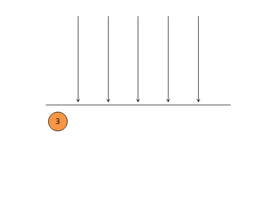
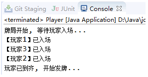
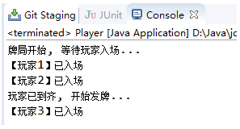

- [Java并发系列[7]----CountDownLatch源码分析](https://cnblogs.com/liuyun1995/p/8528988.html)
- [【94期】Java并发系列 | CountDownLatch源码分析](https://mp.weixin.qq.com/s/KD0Tfn8FefHjk1TaQu4Yog)

`CountDownLatch`(闭锁)是一个很有用的工具类，利用它我们可以拦截一个或多个线程使其在某个条件成熟后再执行。它的内部提供了一个计数器，在构造闭锁时必须指定计数器的初始值，且计数器的初始值必须大于0。

另外它还提供了一个`countDown`方法来操作计数器的值，每调用一次`countDown`方法计数器都会减1，直到计数器的值减为0时就代表条件已成熟，所有因调用`await`方法而阻塞的线程都会被唤醒。

这就是`CountDownLatch`的内部机制，看起来很简单，无非就是阻塞一部分线程让其在达到某个条件之后再执行。但是`CountDownLatch`的应用场景却比较广泛，只要你脑洞够大利用它就可以玩出各种花样。最常见的一个应用场景是开启多个线程同时执行某个任务，等到所有任务都执行完再统计汇总结果。下图动态演示了闭锁阻塞线程的整个过程。



上图演示了有5个线程因调用`await`方法而被阻塞，它们需要等待计数器的值减为0才能继续执行。计数器的初始值在构造闭锁时被指定，后面随着每次`countDown`方法的调用而减1。下面代码贴出了`CountDownLatch`的构造方法。
```java
//构造器
public CountDownLatch(int count) {
    if (count < 0) throw new IllegalArgumentException("count < 0");
    this.sync = new Sync(count);
}
```

`CountDownLatch`只有一个带参构造器，必须传入一个大于0的值作为计数器初始值，否则会报错。可以看到在构造方法中只是去new了一个`Sync`对象并赋值给成员变量`sync`。和其他同步工具类一样，`CountDownLatch`的实现依赖于`AQS`，它是`AQS`共享模式下的一个应用。`CountDownLatch`实现了一个内部类`Sync`并用它去继承`AQS`，这样就能使用`AQS`提供的大部分方法了。下面我们就来看一下Sync内部类的代码。

```java
//同步器
private static final class Sync extends AbstractQueuedSynchronizer {

    //构造器
    Sync(int count) {
        setState(count);
    }

    //获取当前同步状态
    int getCount() {
        return getState();
    }

    //尝试获取锁
    //返回负数：表示当前线程获取失败
    //返回零值：表示当前线程获取成功, 但是后继线程不能再获取了
    //返回正数：表示当前线程获取成功, 并且后继线程同样可以获取成功
    protected int tryAcquireShared(int acquires) {
        return (getState() == 0) ? 1 : -1;
    }

    //尝试释放锁
    protected boolean tryReleaseShared(int releases) {
        for (;;) {
            //获取同步状态
            int c = getState();
            //如果同步状态为0, 则不能再释放了
            if (c == 0) {
                return false;
            }
            //否则的话就将同步状态减1
            int nextc = c-1;
            //使用CAS方式更新同步状态
            if (compareAndSetState(c, nextc)) {
                return nextc == 0;
            }
        }
    }
}
```

可以看到`Sync`的构造方法会将同步状态的值设置为传入的参数值。之后每次调用countDown方法都会将同步状态的值减1，这也就是计数器的实现原理。在平时使用`CountDownLatch`工具类时最常用的两个方法就是`await`方法和`countDown`方法。调用`await`方法会阻塞当前线程直到计数器为0，调用`countDown`方法会将计数器的值减1直到减为0。下面我们来看一下`await`方法是怎样调用的。
```java
//导致当前线程等待, 直到门闩减少到0, 或者线程被打断
public void await() throws InterruptedException {
    //以响应线程中断方式获取
    sync.acquireSharedInterruptibly(1);
}

//以可中断模式获取锁(共享模式)
public final void acquireSharedInterruptibly(int arg) throws InterruptedException {
    //首先判断线程是否中断, 如果是则抛出异常
    if (Thread.interrupted()) {
        throw new InterruptedException();
    }
    //1.尝试去获取锁
    if (tryAcquireShared(arg) < 0) {
        //2. 如果获取失败则进人该方法
        doAcquireSharedInterruptibly(arg);
    }
}
```

当线程调用`await`方法时其实是调用到了`AQS`的`acquireSharedInterruptibly`方法，该方法是以响应线程中断的方式来获取锁的，上面同样贴出了该方法的代码。我们可以看到在`acquireSharedInterruptibly`方法首先会去调用`tryAcquireShared`方法尝试获取锁。

我们看到`Sync`里面重写的`tryAcquireShared`方法的逻辑，方法的实现逻辑很简单，就是判断当前同步状态是否为0，如果为0则返回1表明可以获取锁，否则返回-1表示不能获取锁。如果`tryAcquireShared`方法返回1则线程能够不必等待而继续执行，如果返回-1那么后续就会去调用`doAcquireSharedInterruptibly`方法让线程进入到同步队列里面等待。这就是调用`await`方法会阻塞当前线程的原理，下面看看`countDown`方法是怎样将阻塞的线程唤醒的。

```java
//减少门闩的方法
public void countDown() {
    sync.releaseShared(1);
}

//释放锁的操作(共享模式)
public final boolean releaseShared(int arg) {
    //1.尝试去释放锁
    if (tryReleaseShared(arg)) {
        //2.如果释放成功就唤醒其他线程
        doReleaseShared();
        return true;
    }
    return false;
}
```

可以看到`countDown`方法里面调用了`releaseShared`方法，该方法同样是`AQS`里面的方法，我们在上面也贴出了它的代码。`releaseShared`方法里面首先是调用`tryReleaseShared`方法尝试释放锁，`tryReleaseShared`方法在`AQS`里面是一个抽象方法，它的具体实现逻辑在子类`Sync`类里面，我们在上面贴出的`Sync`类代码里可以找到该方法。

`tryReleaseShared`方法如果返回`true`表示释放成功，返回`false`表示释放失败，只有当将同步状态减1后该同步状态恰好为0时才会返回`true`，其他情况都是返回`false`。那么当`tryReleaseShared`返回`true`之后就会马上调用`doReleaseShared`方法去唤醒同步队列的所有线程。

这样就解释了为什么最后一次调用`countDown`方法将计数器减为0后就会唤醒所有被阻塞的线程。`CountDownLatch`基本的原理大致就是这些，下面我们看一个它的使用示例。

应用场景：在玩欢乐斗地主时必须等待三个玩家都到齐才可以进行发牌。
```java
public class Player extends Thread {

    private static int count = 1;
    private final int id = count++;
    private CountDownLatch latch;

    public Player(CountDownLatch latch) {
        this.latch = latch;
    }

    @Override
    public void run() {
        System.out.println("【玩家" + id + "】已入场");
        latch.countDown();
    }

    public static void main(String[] args) throws InterruptedException {
        CountDownLatch latch = new CountDownLatch(3);
        System.out.println("牌局开始, 等待玩家入场...");
        new Player(latch).start();
        new Player(latch).start();
        new Player(latch).start();
        latch.await();
        System.out.println("玩家已到齐, 开始发牌...");
    }

}
```




运行结果显示发牌操作一定是在所有玩家都入场后才进行。我们将23行的`latch.await()`注释掉，对比下看看结果。



可以看到在注释掉`latch.await()`这行之后，就不能保证在所有玩家入场后才开始发牌了。
