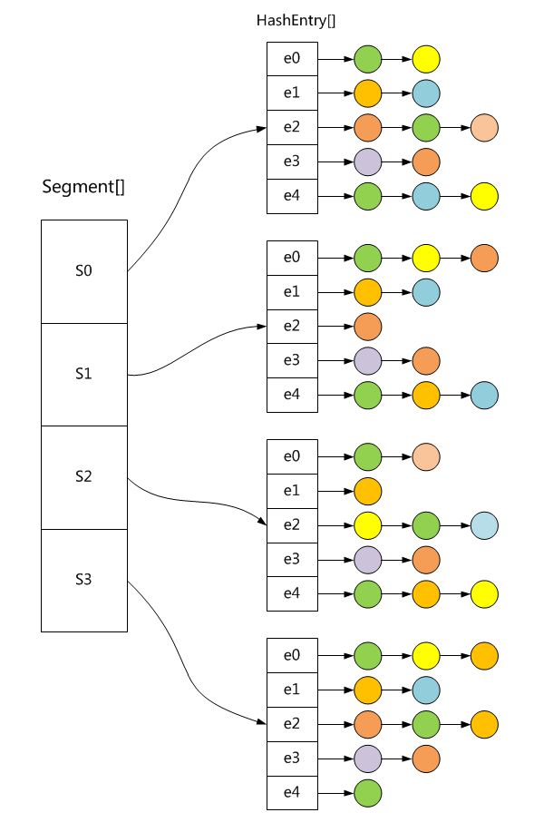
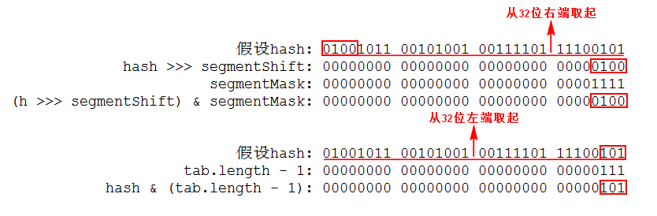

- [Java并发系列[9]----ConcurrentHashMap源码分析](https://www.cnblogs.com/liuyun1995/p/8631264.html)

我们知道哈希表是一种非常高效的数据结构，设计优良的哈希函数可以使其上的增删改查操作达到`O(1)`级别。Java为我们提供了一个现成的哈希结构，那就是`HashMap`类，在前面的文章中我曾经介绍过`HashMap`类，知道它的所有方法都未进行同步，因此在多线程环境中是不安全的。为此，Java为我们提供了另外一个`HashTable`类，它对于多线程同步的处理非常简单粗暴，那就是在`HashMap`的基础上对其所有方法都使用`synchronized`关键字进行加锁。这种方法虽然简单，但导致了一个问题，那就是在同一时间内只能由一个线程去操作哈希表。即使这些线程都只是进行读操作也必须要排队，这在竞争激烈的多线程环境中极为影响性能。本篇介绍的`ConcurrentHashMap`就是为了解决这个问题的，它的内部使用分段锁将锁进行细粒度化，从而使得多个线程能够同时操作哈希表，这样极大的提高了性能。下图是其内部结构的示意图。



## 1. ConcurrentHashMap有哪些成员变量？

```java
//默认初始化容量
static final int DEFAULT_INITIAL_CAPACITY = 16;

//默认加载因子
static final float DEFAULT_LOAD_FACTOR = 0.75f;

//默认并发级别
static final int DEFAULT_CONCURRENCY_LEVEL = 16;

//集合最大容量
static final int MAXIMUM_CAPACITY = 1 << 30;

//分段锁的最小数量
static final int MIN_SEGMENT_TABLE_CAPACITY = 2;

//分段锁的最大数量
static final int MAX_SEGMENTS = 1 << 16;

//加锁前的重试次数
static final int RETRIES_BEFORE_LOCK = 2;

//分段锁的掩码值
final int segmentMask;

//分段锁的移位值
final int segmentShift;

//分段锁数组
final Segment<K,V>[] segments;
```

在阅读完本篇文章之前，相信读者不能理解这些成员变量的具体含义和作用，不过请读者们耐心看下去，后面将会在具体场景中一一介绍到这些成员变量的作用。在这里读者只需对这些成员变量留个眼熟即可。但是仍有个别变量是我们现在需要了解的，例如`Segment`数组代表分段锁集合，并发级别则代表分段锁的数量(也意味有多少线程可以同时操作)，初始化容量代表整个容器的容量，加载因子代表容器元素可以达到多满的一种程度。

## 2. 分段锁的内部结构是怎样的？

```java
//分段锁
static final class Segment<K,V> extends ReentrantLock implements Serializable {
    //自旋最大次数
    static final int MAX_SCAN_RETRIES = Runtime.getRuntime().availableProcessors() > 1 ? 64 : 1;
    //哈希表
    transient volatile HashEntry<K,V>[] table;
    //元素总数
    transient int count;
    //修改次数
    transient int modCount;
    //元素阀值
    transient int threshold;
    //加载因子
    final float loadFactor;
    //省略以下内容
    ...
}
```

`Segment`是`ConcurrentHashMap`的静态内部类，可以看到它继承自ReentrantLock，因此它在本质上是一个锁。它在内部持有一个`HashEntry`数组(哈希表)，并且保证所有对该数组的增删改查方法都是线程安全的，具体是怎样实现的后面会讲到。所有对`ConcurrentHashMap`的增删改查操作都可以委托`Segment`来进行，因此`ConcurrentHashMap`能够保证在多线程环境下是安全的。又因为不同的`Segment`是不同的锁，所以多线程可以同时操作不同的`Segment`，也就意味着多线程可以同时操作`ConcurrentHashMap`，这样就能避免`HashTable`的缺陷，从而极大的提高性能。

## 3. ConcurrentHashMap初始化时做了些什么？

```java
//核心构造器
@SuppressWarnings("unchecked")
public ConcurrentHashMap(int initialCapacity, float loadFactor, int concurrencyLevel) {
    if (!(loadFactor > 0) || initialCapacity < 0 || concurrencyLevel <= 0) {
        throw new IllegalArgumentException();
    }
    //确保并发级别不大于限定值
    if (concurrencyLevel > MAX_SEGMENTS) {
        concurrencyLevel = MAX_SEGMENTS;
    }
    int sshift = 0;
    int ssize = 1;
    //保证ssize为2的幂, 且是最接近的大于等于并发级别的数
    while (ssize < concurrencyLevel) {
        ++sshift;
        ssize <<= 1;
    }
    //计算分段锁的移位值
    this.segmentShift = 32 - sshift;
    //计算分段锁的掩码值
    this.segmentMask = ssize - 1;
    //总的初始容量不能大于限定值
    if (initialCapacity > MAXIMUM_CAPACITY) {
        initialCapacity = MAXIMUM_CAPACITY;
    }
    //获取每个分段锁的初始容量
    int c = initialCapacity / ssize;
    //分段锁容量总和不小于初始总容量
    if (c * ssize < initialCapacity) {
        ++c;
    }
    int cap = MIN_SEGMENT_TABLE_CAPACITY;
    //保证cap为2的幂, 且是最接近的大于等于c的数
    while (cap < c) {
        cap <<= 1;
    }
    //新建一个Segment对象模版
    Segment<K,V> s0 = new Segment<K,V>(loadFactor, (int)(cap * loadFactor), (HashEntry<K,V>[])new HashEntry[cap]);
    //新建指定大小的分段锁数组
    Segment<K,V>[] ss = (Segment<K,V>[])new Segment[ssize];
    //使用UnSafe给数组第0个元素赋值
    UNSAFE.putOrderedObject(ss, SBASE, s0);
    this.segments = ss;
}
```

`ConcurrentHashMap`有多个构造器，但是上面贴出的是它的核心构造器，其他构造器都通过调用它来完成初始化。核心构造器需要传入三个参数，分别是初始容量，加载因子和并发级别。在前面介绍成员变量时我们可以知道默认的初始容量为16，加载因子为0.75f，并发级别为16。现在我们看到核心构造器的代码，首先是通过传入的`concurrencyLevel`来计算出`ssize`，`ssize`是`Segment`数组的长度，它必须保证是2的幂，这样就可以通过`hash&ssize-1`来计算分段锁在数组中的下标。由于传入的`concurrencyLevel`不能保证是2的幂，所以不能直接用它来当作`Segment`数组的长度，因此我们要找到一个最接近`concurrencyLevel`的2的幂，用它来作为数组的长度。假如现在传入的`concurrencyLevel=15`，通过上面代码可以计算出`ssize=16`，`sshift=4`。接下来立马可以算出`segmentShift=16，segmentMask=15`。注意这里的`segmentShift`是分段锁的移位值，`segmentMask`是分段锁的掩码值，这两个值是用来计算分段锁在数组中的下标，在下面我们会讲到。在算出分段锁的个数`ssize`之后，就可以根据传入的总容量来计算每个分段锁的容量，它的值`c = initialCapacity / ssize`。分段锁的容量也就是`HashEntry`数组的长度，同样也必须保证是2的幂，而上面算出的c的值不能保证这一点，所以不能直接用c作为`HashEntry`数组的长度，需要另外找到一个最接近c的2的幂，将这个值赋给cap，然后用cap来作为`HashEntry`数组的长度。现在我们有了`ssize`和`cap`，就可以新建分段锁数组Segment[]和元素数组`HashEntry[]`了。注意，与JDK1.6不同是的，在JDK1.7中只新建了`Segment`数组，并没有对它初始化，初始化Segment的操作留到了插入操作时进行。

## 4. 通过怎样的方式来定位锁和定位元素？

```java
//根据哈希码获取分段锁
@SuppressWarnings("unchecked")
private Segment<K,V> segmentForHash(int h) {
    long u = (((h >>> segmentShift) & segmentMask) << SSHIFT) + SBASE;
    return (Segment<K,V>) UNSAFE.getObjectVolatile(segments, u);
}

//根据哈希码获取元素
@SuppressWarnings("unchecked")
static final <K,V> HashEntry<K,V> entryForHash(Segment<K,V> seg, int h) {
    HashEntry<K,V>[] tab;
    return (seg == null || (tab = seg.table) == null) ? null :
    (HashEntry<K,V>) UNSAFE.getObjectVolatile(tab, ((long)(((tab.length - 1) & h)) << TSHIFT) + TBASE);
}
```

在JDK1.7中是通过`UnSafe`来获取数组元素的，因此这里比JDK1.6多了些计算数组元素偏移量的代码，这些代码我们暂时不关注，现在我们只需知道下面这两点：
a. 通过哈希码计算分段锁在数组中的下标：`(h >>> segmentShift) & segmentMask`。
b. 通过哈希码计算元素在数组中的下标：`(tab.length - 1) & h`。
现在我们假设传给构造器的两个参数为`initialCapacity=128, concurrencyLevel=16`。根据计算可以得到`ssize=16, sshift=4，segmentShift=28，segmentMask=15`。同样，算得每个分段锁内的`HashEntry`数组的长度为8，所以`tab.length-1=7`。根据这些值，我们通过下图来解释如何根据同一个哈希码来定位分段锁和元素。



可以看到分段锁和元素的定位都是通过元素的哈希码来决定的。定位分段锁是取哈希码的高位值(从32位处取起)，定位元素是取的哈希码的低位值。现在有个问题，它们一个从32位的左端取起，一个从32位的右端取起，那么会在某个时刻产生冲突吗？我们在成员变量里可以找到`MAXIMUM_CAPACITY = 1 << 30`，`MAX_SEGMENTS = 1 << 16`，这说明定位分段锁和定位元素使用的总的位数不超过30，并且定位分段锁使用的位数不超过16，所以至少还隔着2位的空余，因此是不会产生冲突的。

## 5. 查找元素具体是怎样实现的？

```java
//根据key获取value
public V get(Object key) {
    Segment<K,V> s;
    HashEntry<K,V>[] tab;
    //使用哈希函数计算哈希码
    int h = hash(key);
    //根据哈希码计算分段锁的索引
    long u = (((h >>> segmentShift) & segmentMask) << SSHIFT) + SBASE;
    //获取分段锁和对应的哈希表
    if ((s = (Segment<K,V>)UNSAFE.getObjectVolatile(segments, u)) != null && (tab = s.table) != null) {
        //根据哈希码获取链表头结点, 再对链表进行遍历
        for (HashEntry<K,V> e = (HashEntry<K,V>) UNSAFE.getObjectVolatile
                 (tab, ((long)(((tab.length - 1) & h)) << TSHIFT) + TBASE);
             e != null; e = e.next) {
            K k;
            //根据key和hash找到对应元素后返回value值
            if ((k = e.key) == key || (e.hash == h && key.equals(k))) {
                return e.value;
            }
        }
    }
    return null;
}
```

在JDK1.6中分段锁的get方法是通过下标来访问数组元素的，而在JDK1.7中是通过`UnSafe`的`getObjectVolatile`方法来读取数组中的元素。为啥要这样做？我们知道虽然`Segment`对象持有的`HashEntry`数组引用是`volatile`类型的，但是数组内的元素引用不是`volatile`类型的，因此多线程对数组元素的修改是不安全的，可能会在数组中读取到尚未构造完成的对象。在JDK1.6中是通过第二次加锁读取来保证安全的，而JDK1.7中通过`UnSafe`的`getObjectVolatile`方法来读取同样也是为了保证这一点。使用`getObjectVolatile`方法读取数组元素需要先获得元素在数组中的偏移量，在这里根据哈希码计算得到分段锁在数组中的偏移量为u，然后通过偏移量u来尝试读取分段锁。由于分段锁数组在构造时没进行初始化，因此可能读出来一个空值，所以需要先进行判断。在确定分段锁和它内部的哈希表都不为空之后，再通过哈希码读取`HashEntry`数组的元素，根据上面的结构图可以看到，这时获得的是链表的头结点。之后再从头到尾的对链表进行遍历查找，如果找到对应的值就将其返回，否则就返回null。以上就是整个查找元素的过程。

## 6. 插入元素具体是怎样实现的？

```java
//向集合添加键值对(若存在则替换)
@SuppressWarnings("unchecked")
public V put(K key, V value) {
    Segment<K,V> s;
    //传入的value不能为空
    if (value == null) throw new NullPointerException();
    //使用哈希函数计算哈希码
    int hash = hash(key);
    //根据哈希码计算分段锁的下标
    int j = (hash >>> segmentShift) & segmentMask;
    //根据下标去尝试获取分段锁
    if ((s = (Segment<K,V>)UNSAFE.getObject(segments, (j << SSHIFT) + SBASE)) == null) {
        //获得的分段锁为空就去构造一个
        s = ensureSegment(j);
    }
    //调用分段锁的put方法
    return s.put(key, hash, value, false);
}

//向集合添加键值对(不存在才添加)
@SuppressWarnings("unchecked")
public V putIfAbsent(K key, V value) {
    Segment<K,V> s;
    //传入的value不能为空
    if (value == null) throw new NullPointerException();
    //使用哈希函数计算哈希码
    int hash = hash(key);
    //根据哈希码计算分段锁的下标
    int j = (hash >>> segmentShift) & segmentMask;
    //根据下标去尝试获取分段锁
    if ((s = (Segment<K,V>)UNSAFE.getObject(segments, (j << SSHIFT) + SBASE)) == null) {
        //获得的分段锁为空就去构造一个
        s = ensureSegment(j);
    }
    //调用分段锁的put方法
    return s.put(key, hash, value, true);
}
```

`ConcurrentHashMap`中有两个添加键值对的方法，通过put方法添加时如果存在则会进行覆盖，通过`putIfAbsent`方法添加时如果存在则不进行覆盖，这两个方法都是调用分段锁的`put`方法来完成操作，只是传入的最后一个参数不同而已。在上面代码中我们可以看到首先是根据key的哈希码来计算出分段锁在数组中的下标，然后根据下标使用`UnSafe`类`getObject`方法来读取分段锁。由于在构造`ConcurrentHashMap`时没有对`Segment`数组中的元素初始化，所以可能读到一个空值，这时会先通过ensureSegment方法新建一个分段锁。获取到分段锁之后再调用它的`put`方法完成添加操作，下面我们来看看具体是怎样操作的。

```java
//添加键值对
final V put(K key, int hash, V value, boolean onlyIfAbsent) {
    //尝试获取锁, 若失败则进行自旋
    HashEntry<K,V> node = tryLock() ? null : scanAndLockForPut(key, hash, value);
    V oldValue;
    try {
        HashEntry<K,V>[] tab = table;
        //计算元素在数组中的下标
        int index = (tab.length - 1) & hash;
        //根据下标获取链表头结点
        HashEntry<K,V> first = entryAt(tab, index);
        for (HashEntry<K,V> e = first;;) {
            //遍历链表寻找该元素, 找到则进行替换
            if (e != null) {
                K k;
                if ((k = e.key) == key || (e.hash == hash && key.equals(k))) {
                    oldValue = e.value;
                    //根据参数决定是否替换旧值
                    if (!onlyIfAbsent) {
                        e.value = value;
                        ++modCount;
                    }
                    break;
                }
                e = e.next;
            //没找到则在链表添加一个结点
            } else {
                //将node结点插入链表头部
                if (node != null) {
                    node.setNext(first);
                } else {
                    node = new HashEntry<K,V>(hash, key, value, first);
                }
                //插入结点后将元素总是加1
                int c = count + 1;
                //元素超过阀值则进行扩容
                if (c > threshold && tab.length < MAXIMUM_CAPACITY) {
                    rehash(node);
                //否则就将哈希表指定下标替换为node结点
                } else {
                    setEntryAt(tab, index, node);
                }
                ++modCount;
                count = c;
                oldValue = null;
                break;
            }
        }
    } finally {
        unlock();
    }
    return oldValue;
}
```

为保证线程安全，分段锁中的put操作是需要进行加锁的，所以线程一开始就会去获取锁，如果获取成功就继续执行，若获取失败则调用`scanAndLockForPut`方法进行自旋，在自旋过程中会先去扫描哈希表去查找指定的key，如果key不存在就会新建一个`HashEntry`返回，这样在获取到锁之后就不必再去新建了，为的是在等待锁的过程中顺便做些事情，不至于白白浪费时间，可见作者的良苦用心。具体自旋方法我们后面再细讲，现在先把关注点拉回来，线程在成功获取到锁之后会根据计算到的下标，获取指定下标的元素。此时获取到的是链表的头结点，如果头结点不为空就对链表进行遍历查找，找到之后再根据`onlyIfAbsent`参数的值决定是否进行替换。如果遍历没找到就会新建一个`HashEntry`指向头结点，此时如果自旋时创建了`HashEntry`，则直接将它的`next`指向当前头结点，如果自旋时没有创建就在这里新建一个`HashEntry`并指向头结点。在向链表添加元素之后检查元素总数是否超过阀值，如果超过就调用`rehash`进行扩容，没超过的话就直接将数组对应下标的元素引用指向新添加的node。setEntryAt方法内部是通过调用`UnSafe`的`putOrderedObject`方法来更改数组元素引用的，这样就保证了其他线程在读取时可以读到最新的值。

## 7. 删除元素具体是怎样实现的？

```java
//删除指定元素(找到对应元素后直接删除)
public V remove(Object key) {
    //使用哈希函数计算哈希码
    int hash = hash(key);
    //根据哈希码获取分段锁的索引
    Segment<K,V> s = segmentForHash(hash);
    //调用分段锁的remove方法
    return s == null ? null : s.remove(key, hash, null);
}

//删除指定元素(查找值等于给定值才删除)
public boolean remove(Object key, Object value) {
    //使用哈希函数计算哈希码
    int hash = hash(key);
    Segment<K,V> s;
    //确保分段锁不为空才调用remove方法
    return value != null && (s = segmentForHash(hash)) != null && s.remove(key, hash, value) != null;
}
```

ConcurrentHashMap提供了两种删除操作，一种是找到后直接删除，一种是找到后先比较再删除。这两种删除方法都是先根据`key`的哈希码找到对应的分段锁后，再通过调用分段锁的`remove`方法完成删除操作。下面我们来看看分段锁的`remove`方法。

```java
//删除指定元素
final V remove(Object key, int hash, Object value) {
    //尝试获取锁, 若失败则进行自旋
    if (!tryLock()) {
        scanAndLock(key, hash);
    }
    V oldValue = null;
    try {
        HashEntry<K,V>[] tab = table;
        //计算元素在数组中的下标
        int index = (tab.length - 1) & hash;
        //根据下标取得数组元素(链表头结点)
        HashEntry<K,V> e = entryAt(tab, index);
        HashEntry<K,V> pred = null;
        //遍历链表寻找要删除的元素
        while (e != null) {
            K k;
            //next指向当前结点的后继结点
            HashEntry<K,V> next = e.next;
            //根据key和hash寻找对应结点
            if ((k = e.key) == key || (e.hash == hash && key.equals(k))) {
                V v = e.value;
                //传入的value不等于v就跳过, 其他情况就进行删除操作
                if (value == null || value == v || value.equals(v)) {
                    //如果pred为空则代表要删除的结点为头结点
                    if (pred == null) {
                        //重新设置链表头结点
                        setEntryAt(tab, index, next);
                    } else {
                        //设置pred结点的后继为next结点
                        pred.setNext(next);
                    }
                    ++modCount;
                    --count;
                    //记录元素删除之前的值
                    oldValue = v;
                }
                break;
            }
            //若e不是要找的结点就将pred引用指向它
            pred = e;
            //检查下一个结点
            e = next;
        }
    } finally {
        unlock();
    }
    return oldValue;
}
```

在删除分段锁中的元素时需要先获取锁，如果获取失败就调用`scanAndLock`方法进行自旋，如果获取成功就执行下一步，首先计算数组下标然后通过下标获取`HashEntry`数组的元素，这里获得了链表的头结点，接下来就是对链表进行遍历查找，在此之前先用`next`指针记录当前结点的后继结点，然后对比key和hash看看是否是要找的结点，如果是的话就执行下一个if判断。满足`value`为空或者`value`的值等于结点当前值这两个条件就会进入到if语句中进行删除操作，否则直接跳过。在if语句中执行删除操作时会有两种情况，如果当前结点为头结点则直接将`next`结点设置为头结点，如果当前结点不是头结点则将pred结点的后继设置为`next`结点。这里的pred结点表示当前结点的前继结点，每次在要检查下一个结点之前就将pred指向当前结点，这就保证了pred结点总是当前结点的前继结点。注意，与JDK1.6不同，在JDK1.7中`HashEntry`对象的`next`变量不是final的，因此这里可以通过直接修改`next`引用的值来删除元素，由于`next`变量是`volatile`类型的，所以读线程可以马上读到最新的值。

## 8. 替换元素具体是怎样实现的？

```java
//替换指定元素(CAS操作)
public boolean replace(K key, V oldValue, V newValue) {
    //使用哈希函数计算哈希码
    int hash = hash(key);
    //保证oldValue和newValue不为空
    if (oldValue == null || newValue == null) throw new NullPointerException();
    //根据哈希码获取分段锁的索引
    Segment<K,V> s = segmentForHash(hash);
    //调用分段锁的replace方法
    return s != null && s.replace(key, hash, oldValue, newValue);
}

//替换元素操作(CAS操作)
final boolean replace(K key, int hash, V oldValue, V newValue) {
    //尝试获取锁, 若失败则进行自旋
    if (!tryLock()) {
        scanAndLock(key, hash);
    }
    boolean replaced = false;
    try {
        HashEntry<K,V> e;
        //通过hash直接找到头结点然后对链表遍历
        for (e = entryForHash(this, hash); e != null; e = e.next) {
            K k;
            //根据key和hash找到要替换的结点
            if ((k = e.key) == key || (e.hash == hash && key.equals(k))) {
                //如果指定的当前值正确则进行替换
                if (oldValue.equals(e.value)) {
                    e.value = newValue;
                    ++modCount;
                    replaced = true;
                }
                //否则不进行任何操作直接返回
                break;
            }
        }
    } finally {
        unlock();
    }
    return replaced;
}
```

`ConcurrentHashMap`同样提供了两种替换操作，一种是找到后直接替换，另一种是找到后先比较再替换(CAS操作)。这两种操作的实现大致是相同的，只是CAS操作在替换前多了一层比较操作，因此我们只需简单了解其中一种操作即可。这里拿CAS操作进行分析，还是老套路，首先根据key的哈希码找到对应的分段锁，然后调用它的`replace`方法。进入分段锁中的`replace`方法后需要先去获取锁，如果获取失败则进行自旋，如果获取成功则进行下一步。首先根据`hash`码获取链表头结点，然后根据`key`和`hash`进行遍历查找，找到了对应的元素之后，比较给定的`oldValue`是否是当前值，如果不是则放弃修改，如果是则用新值进行替换。由于`HashEntry`对象的value域是`volatile`类型的，因此可以直接替换。

## 9. 自旋时具体做了些什么？

```java
//自旋等待获取锁(put操作)
private HashEntry<K,V> scanAndLockForPut(K key, int hash, V value) {
    //根据哈希码获取头结点
    HashEntry<K,V> first = entryForHash(this, hash);
    HashEntry<K,V> e = first;
    HashEntry<K,V> node = null;
    int retries = -1;
    //在while循环内自旋
    while (!tryLock()) {
        HashEntry<K,V> f;
        if (retries < 0) {
            //如果头结点为空就新建一个node
            if (e == null) {
                if (node == null) {
                    node = new HashEntry<K,V>(hash, key, value, null);
                }
                retries = 0;
            //否则就遍历链表定位该结点
            } else if (key.equals(e.key)) {
                retries = 0;
            } else {
                e = e.next;
            }
          //retries每次在这加1, 并判断是否超过最大值
        } else if (++retries > MAX_SCAN_RETRIES) {
            lock();
            break;
          //retries为偶数时去判断first有没有改变
        } else if ((retries & 1) == 0 && (f = entryForHash(this, hash)) != first) {
            e = first = f;
            retries = -1;
        }
    }
    return node;
}

//自旋等待获取锁(remove和replace操作)
private void scanAndLock(Object key, int hash) {
    //根据哈希码获取链表头结点
    HashEntry<K,V> first = entryForHash(this, hash);
    HashEntry<K,V> e = first;
    int retries = -1;
    //在while循环里自旋
    while (!tryLock()) {
        HashEntry<K,V> f;
        if (retries < 0) {
            //遍历链表定位到该结点
            if (e == null || key.equals(e.key)) {
                retries = 0;
            } else {
                e = e.next;
            }
          //retries每次在这加1, 并判断是否超过最大值
        } else if (++retries > MAX_SCAN_RETRIES) {
            lock();
            break;
          //retries为偶数时去判断first有没有改变
        } else if ((retries & 1) == 0 && (f = entryForHash(this, hash)) != first) {
            e = first = f;
            retries = -1;
        }
    }
}
```

在前面我们讲到过，分段锁中的`put`，`remove`，`replace`这些操作都会要求先去获取锁，只有成功获得锁之后才能进行下一步操作，如果获取失败就会进行自旋。自旋操作也是在JDK1.7中添加的，为了避免线程频繁的挂起和唤醒，以此提高并发操作时的性能。在`put`方法中调用的是`scanAndLockForPut`，在`remove`和`replace`方法中调用的是`scanAndLock`。这两种自旋方法大致是相同的，这里我们只分析`scanAndLockForPut`方法。首先还是先根据`hash`码获得链表头结点，之后线程会进入`while`循环中执行，退出该循环的唯一方式是成功获取锁，而在这期间线程不会被挂起。刚进入循环时`retries`的值为-1，这时线程不会马上再去尝试获取锁，而是先去寻找到key对应的结点(没找到会新建一个)，然后再将`retries`设为0，接下来就会一次次的尝试获取锁，对应`retries`的值也会每次加1，直到超过最大尝试次数如果还没获取到锁，就会调用lock方法进行阻塞获取。在尝试获取锁的期间，还会每隔一次(`retries`为偶数)去检查头结点是否被改变，如果被改变则将`retries`重置回-1，然后再重走一遍刚才的流程。这就是线程自旋时所做的操作，需注意的是如果在自旋时检测到头结点已被改变，则会延长线程的自旋时间。

## 10. 哈希表扩容时都做了哪些操作？

```java
//再哈希
@SuppressWarnings("unchecked")
private void rehash(HashEntry<K,V> node) {
    //获取旧哈希表的引用
    HashEntry<K,V>[] oldTable = table;
    //获取旧哈希表的容量
    int oldCapacity = oldTable.length;
    //计算新哈希表的容量(为旧哈希表的2倍)
    int newCapacity = oldCapacity << 1;
    //计算新的元素阀值
    threshold = (int)(newCapacity * loadFactor);
    //新建一个HashEntry数组
    HashEntry<K,V>[] newTable = (HashEntry<K,V>[]) new HashEntry[newCapacity];
    //生成新的掩码值
    int sizeMask = newCapacity - 1;
    //遍历旧表的所有元素
    for (int i = 0; i < oldCapacity ; i++) {
        //取得链表头结点
        HashEntry<K,V> e = oldTable[i];
        if (e != null) {
            HashEntry<K,V> next = e.next;
            //计算元素在新表中的索引
            int idx = e.hash & sizeMask;
            //next为空表明链表只有一个结点
            if (next == null) {
                //直接把该结点放到新表中
                newTable[idx] = e;
            }else {
                HashEntry<K,V> lastRun = e;
                int lastIdx = idx;
                //定位lastRun结点, 将lastRun之后的结点直接放到新表中
                for (HashEntry<K,V> last = next; last != null; last = last.next) {
                    int k = last.hash & sizeMask;
                    if (k != lastIdx) {
                        lastIdx = k;
                        lastRun = last;
                    }
                }
                newTable[lastIdx] = lastRun;
                //遍历在链表lastRun结点之前的元素, 将它们依次复制到新表中
                for (HashEntry<K,V> p = e; p != lastRun; p = p.next) {
                    V v = p.value;
                    int h = p.hash;
                    int k = h & sizeMask;
                    HashEntry<K,V> n = newTable[k];
                    newTable[k] = new HashEntry<K,V>(h, p.key, v, n);
                }
            }
        }
    }
    //计算传入结点在新表中的下标
    int nodeIndex = node.hash & sizeMask;
    //将传入结点添加到链表头结点
    node.setNext(newTable[nodeIndex]);
    //将新表指定下标元素换成传入结点
    newTable[nodeIndex] = node;
    //将哈希表引用指向新表
    table = newTable;
}
```

`rehash`方法在`put`方法中被调用，我们知道在`put`方法时会新建元素并添加到哈希数组中，随着元素的增多发生哈希冲突的可能性越大，哈希表的性能也会随之下降。因此每次`put`操作时都会检查元素总数是否超过阀值，如果超过则调用rehash方法进行扩容。因为数组长度一旦确定则不能再被改变，因此需要新建一个数组来替换原先的数组。从代码中可以知道新创建的数组长度为原数组的2倍(`oldCapacity << 1`)。创建好新数组后需要将旧数组中的所有元素移到新数组中，因此需要计算每个元素在新数组中的下标。计算新下标的过程如下图所示。


我们知道下标直接取的是哈希码的后几位，由于新数组的容量是直接用旧数组容量右移1位得来的，因此掩码位数向右增加1位，取到的哈希码位数也向右增加1位。如上图，若旧的掩码值为111，则元素下标为101，扩容后新的掩码值为1111，则计算出元素的新下标为0101。由于同一条链表上的元素下标是相同的，现在假设链表所有元素的下标为101，在扩容后该链表元素的新下标只有0101或1101这两种情况，因此数组扩容会打乱原先的链表并将链表元素分成两批。在计算出新下标后需要将元素移动到新数组中，在`HashMap`中通过直接修改`next`引用导致了多线程的死锁。虽然在`ConcurrentHashMap`中通过加锁避免了这种情况，但是我们知道`next`域是`volatile`类型的，它的改动能立马被读线程读取到，因此为保证线程安全采用复制元素来迁移数组。但是对链表中每个元素都进行复制有点影响性能，作者发现链表尾部有许多元素的`next`是不变的，它们在新数组中的下标是相同的，因此可以考虑整体移动这部分元素。具统计实际操作中只有`1/6`的元素是必须复制的，所以整体移动链表尾部元素(`lastRun`后面的元素)是可以提升一定性能的。

**注：** 本篇文章基于JDK1.7版本。