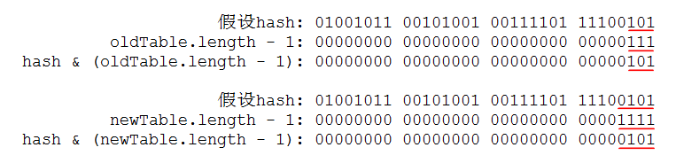

- [Java并发系列[9]----ConcurrentHashMap源码分析](https://www.cnblogs.com/liuyun1995/p/8631264.html)

我们知道哈希表是一种非常高效的数据结构，设计优良的哈希函数可以使其上的增删改查操作达到O(1)级别。Java为我们提供了一个现成的哈希结构，那就是HashMap类，在前面的文章中我曾经介绍过HashMap类，知道它的所有方法都未进行同步，因此在多线程环境中是不安全的。为此，Java为我们提供了另外一个HashTable类，它对于多线程同步的处理非常简单粗暴，那就是在HashMap的基础上对其所有方法都使用synchronized关键字进行加锁。这种方法虽然简单，但导致了一个问题，那就是在同一时间内只能由一个线程去操作哈希表。即使这些线程都只是进行读操作也必须要排队，这在竞争激烈的多线程环境中极为影响性能。本篇介绍的ConcurrentHashMap就是为了解决这个问题的，它的内部使用分段锁将锁进行细粒度化，从而使得多个线程能够同时操作哈希表，这样极大的提高了性能。下图是其内部结构的示意图。

1. ConcurrentHashMap有哪些成员变量？

复制代码
 1 //默认初始化容量
 2 static final int DEFAULT_INITIAL_CAPACITY = 16;
 3 
 4 //默认加载因子
 5 static final float DEFAULT_LOAD_FACTOR = 0.75f;
 6 
 7 //默认并发级别
 8 static final int DEFAULT_CONCURRENCY_LEVEL = 16;
 9 
10 //集合最大容量
11 static final int MAXIMUM_CAPACITY = 1 << 30;
12 
13 //分段锁的最小数量
14 static final int MIN_SEGMENT_TABLE_CAPACITY = 2;
15 
16 //分段锁的最大数量
17 static final int MAX_SEGMENTS = 1 << 16;
18 
19 //加锁前的重试次数
20 static final int RETRIES_BEFORE_LOCK = 2;
21 
22 //分段锁的掩码值
23 final int segmentMask;
24 
25 //分段锁的移位值
26 final int segmentShift;
27 
28 //分段锁数组
29 final Segment<K,V>[] segments;
复制代码
在阅读完本篇文章之前，相信读者不能理解这些成员变量的具体含义和作用，不过请读者们耐心看下去，后面将会在具体场景中一一介绍到这些成员变量的作用。在这里读者只需对这些成员变量留个眼熟即可。但是仍有个别变量是我们现在需要了解的，例如Segment数组代表分段锁集合，并发级别则代表分段锁的数量(也意味有多少线程可以同时操作)，初始化容量代表整个容器的容量，加载因子代表容器元素可以达到多满的一种程度。

2. 分段锁的内部结构是怎样的？

复制代码
 1 //分段锁
 2 static final class Segment<K,V> extends ReentrantLock implements Serializable {
 3     //自旋最大次数
 4     static final int MAX_SCAN_RETRIES = Runtime.getRuntime().availableProcessors() > 1 ? 64 : 1;
 5     //哈希表
 6     transient volatile HashEntry<K,V>[] table;
 7     //元素总数
 8     transient int count;
 9     //修改次数
10     transient int modCount;
11     //元素阀值
12     transient int threshold;
13     //加载因子
14     final float loadFactor;
15     //省略以下内容
16     ...
17 }
复制代码
Segment是ConcurrentHashMap的静态内部类，可以看到它继承自ReentrantLock，因此它在本质上是一个锁。它在内部持有一个HashEntry数组(哈希表)，并且保证所有对该数组的增删改查方法都是线程安全的，具体是怎样实现的后面会讲到。所有对ConcurrentHashMap的增删改查操作都可以委托Segment来进行，因此ConcurrentHashMap能够保证在多线程环境下是安全的。又因为不同的Segment是不同的锁，所以多线程可以同时操作不同的Segment，也就意味着多线程可以同时操作ConcurrentHashMap，这样就能避免HashTable的缺陷，从而极大的提高性能。

3. ConcurrentHashMap初始化时做了些什么？

复制代码
 1 //核心构造器
 2 @SuppressWarnings("unchecked")
 3 public ConcurrentHashMap(int initialCapacity, float loadFactor, int concurrencyLevel) {
 4     if (!(loadFactor > 0) || initialCapacity < 0 || concurrencyLevel <= 0) {
 5         throw new IllegalArgumentException();
 6     }
 7     //确保并发级别不大于限定值
 8     if (concurrencyLevel > MAX_SEGMENTS) {
 9         concurrencyLevel = MAX_SEGMENTS;
10     }
11     int sshift = 0;
12     int ssize = 1;
13     //保证ssize为2的幂, 且是最接近的大于等于并发级别的数
14     while (ssize < concurrencyLevel) {
15         ++sshift;
16         ssize <<= 1;
17     }
18     //计算分段锁的移位值
19     this.segmentShift = 32 - sshift;
20     //计算分段锁的掩码值
21     this.segmentMask = ssize - 1;
22     //总的初始容量不能大于限定值
23     if (initialCapacity > MAXIMUM_CAPACITY) {
24         initialCapacity = MAXIMUM_CAPACITY;
25     }
26     //获取每个分段锁的初始容量
27     int c = initialCapacity / ssize;
28     //分段锁容量总和不小于初始总容量
29     if (c * ssize < initialCapacity) {
30         ++c;
31     }
32     int cap = MIN_SEGMENT_TABLE_CAPACITY;
33     //保证cap为2的幂, 且是最接近的大于等于c的数
34     while (cap < c) {
35         cap <<= 1;
36     }
37     //新建一个Segment对象模版
38     Segment<K,V> s0 = new Segment<K,V>(loadFactor, (int)(cap * loadFactor), (HashEntry<K,V>[])new HashEntry[cap]);
39     //新建指定大小的分段锁数组
40     Segment<K,V>[] ss = (Segment<K,V>[])new Segment[ssize];
41     //使用UnSafe给数组第0个元素赋值
42     UNSAFE.putOrderedObject(ss, SBASE, s0);
43     this.segments = ss;
44 }
复制代码
ConcurrentHashMap有多个构造器，但是上面贴出的是它的核心构造器，其他构造器都通过调用它来完成初始化。核心构造器需要传入三个参数，分别是初始容量，加载因子和并发级别。在前面介绍成员变量时我们可以知道默认的初始容量为16，加载因子为0.75f，并发级别为16。现在我们看到核心构造器的代码，首先是通过传入的concurrencyLevel来计算出ssize，ssize是Segment数组的长度，它必须保证是2的幂，这样就可以通过hash&ssize-1来计算分段锁在数组中的下标。由于传入的concurrencyLevel不能保证是2的幂，所以不能直接用它来当作Segment数组的长度，因此我们要找到一个最接近concurrencyLevel的2的幂，用它来作为数组的长度。假如现在传入的concurrencyLevel=15，通过上面代码可以计算出ssize=16，sshift=4。接下来立马可以算出segmentShift=16，segmentMask=15。注意这里的segmentShift是分段锁的移位值，segmentMask是分段锁的掩码值，这两个值是用来计算分段锁在数组中的下标，在下面我们会讲到。在算出分段锁的个数ssize之后，就可以根据传入的总容量来计算每个分段锁的容量，它的值c = initialCapacity / ssize。分段锁的容量也就是HashEntry数组的长度，同样也必须保证是2的幂，而上面算出的c的值不能保证这一点，所以不能直接用c作为HashEntry数组的长度，需要另外找到一个最接近c的2的幂，将这个值赋给cap，然后用cap来作为HashEntry数组的长度。现在我们有了ssize和cap，就可以新建分段锁数组Segment[]和元素数组HashEntry[]了。注意，与JDK1.6不同是的，在JDK1.7中只新建了Segment数组，并没有对它初始化，初始化Segment的操作留到了插入操作时进行。

4. 通过怎样的方式来定位锁和定位元素？

复制代码
 1 //根据哈希码获取分段锁
 2 @SuppressWarnings("unchecked")
 3 private Segment<K,V> segmentForHash(int h) {
 4     long u = (((h >>> segmentShift) & segmentMask) << SSHIFT) + SBASE;
 5     return (Segment<K,V>) UNSAFE.getObjectVolatile(segments, u);
 6 }
 7 
 8 //根据哈希码获取元素
 9 @SuppressWarnings("unchecked")
10 static final <K,V> HashEntry<K,V> entryForHash(Segment<K,V> seg, int h) {
11     HashEntry<K,V>[] tab;
12     return (seg == null || (tab = seg.table) == null) ? null :
13     (HashEntry<K,V>) UNSAFE.getObjectVolatile(tab, ((long)(((tab.length - 1) & h)) << TSHIFT) + TBASE);
14 }
复制代码
在JDK1.7中是通过UnSafe来获取数组元素的，因此这里比JDK1.6多了些计算数组元素偏移量的代码，这些代码我们暂时不关注，现在我们只需知道下面这两点：
a. 通过哈希码计算分段锁在数组中的下标：(h >>> segmentShift) & segmentMask。
b. 通过哈希码计算元素在数组中的下标：(tab.length - 1) & h。
现在我们假设传给构造器的两个参数为initialCapacity=128, concurrencyLevel=16。根据计算可以得到ssize=16, sshift=4，segmentShift=28，segmentMask=15。同样，算得每个分段锁内的HashEntry数组的长度为8，所以tab.length-1=7。根据这些值，我们通过下图来解释如何根据同一个哈希码来定位分段锁和元素。

可以看到分段锁和元素的定位都是通过元素的哈希码来决定的。定位分段锁是取哈希码的高位值(从32位处取起)，定位元素是取的哈希码的低位值。现在有个问题，它们一个从32位的左端取起，一个从32位的右端取起，那么会在某个时刻产生冲突吗？我们在成员变量里可以找到MAXIMUM_CAPACITY = 1 << 30，MAX_SEGMENTS = 1 << 16，这说明定位分段锁和定位元素使用的总的位数不超过30，并且定位分段锁使用的位数不超过16，所以至少还隔着2位的空余，因此是不会产生冲突的。

5. 查找元素具体是怎样实现的？

复制代码
 1 //根据key获取value
 2 public V get(Object key) {
 3     Segment<K,V> s;
 4     HashEntry<K,V>[] tab;
 5     //使用哈希函数计算哈希码
 6     int h = hash(key);
 7     //根据哈希码计算分段锁的索引
 8     long u = (((h >>> segmentShift) & segmentMask) << SSHIFT) + SBASE;
 9     //获取分段锁和对应的哈希表
10     if ((s = (Segment<K,V>)UNSAFE.getObjectVolatile(segments, u)) != null && (tab = s.table) != null) {
11         //根据哈希码获取链表头结点, 再对链表进行遍历
12         for (HashEntry<K,V> e = (HashEntry<K,V>) UNSAFE.getObjectVolatile
13                  (tab, ((long)(((tab.length - 1) & h)) << TSHIFT) + TBASE);
14              e != null; e = e.next) {
15             K k;
16             //根据key和hash找到对应元素后返回value值
17             if ((k = e.key) == key || (e.hash == h && key.equals(k))) {
18                 return e.value;
19             }
20         }
21     }
22     return null;
23 }
复制代码
在JDK1.6中分段锁的get方法是通过下标来访问数组元素的，而在JDK1.7中是通过UnSafe的getObjectVolatile方法来读取数组中的元素。为啥要这样做？我们知道虽然Segment对象持有的HashEntry数组引用是volatile类型的，但是数组内的元素引用不是volatile类型的，因此多线程对数组元素的修改是不安全的，可能会在数组中读取到尚未构造完成的对象。在JDK1.6中是通过第二次加锁读取来保证安全的，而JDK1.7中通过UnSafe的getObjectVolatile方法来读取同样也是为了保证这一点。使用getObjectVolatile方法读取数组元素需要先获得元素在数组中的偏移量，在这里根据哈希码计算得到分段锁在数组中的偏移量为u，然后通过偏移量u来尝试读取分段锁。由于分段锁数组在构造时没进行初始化，因此可能读出来一个空值，所以需要先进行判断。在确定分段锁和它内部的哈希表都不为空之后，再通过哈希码读取HashEntry数组的元素，根据上面的结构图可以看到，这时获得的是链表的头结点。之后再从头到尾的对链表进行遍历查找，如果找到对应的值就将其返回，否则就返回null。以上就是整个查找元素的过程。

6. 插入元素具体是怎样实现的？

复制代码
 1 //向集合添加键值对(若存在则替换)
 2 @SuppressWarnings("unchecked")
 3 public V put(K key, V value) {
 4     Segment<K,V> s;
 5     //传入的value不能为空
 6     if (value == null) throw new NullPointerException();
 7     //使用哈希函数计算哈希码
 8     int hash = hash(key);
 9     //根据哈希码计算分段锁的下标
10     int j = (hash >>> segmentShift) & segmentMask;
11     //根据下标去尝试获取分段锁
12     if ((s = (Segment<K,V>)UNSAFE.getObject(segments, (j << SSHIFT) + SBASE)) == null) {
13         //获得的分段锁为空就去构造一个
14         s = ensureSegment(j);
15     }
16     //调用分段锁的put方法
17     return s.put(key, hash, value, false);
18 }
19 
20 //向集合添加键值对(不存在才添加)
21 @SuppressWarnings("unchecked")
22 public V putIfAbsent(K key, V value) {
23     Segment<K,V> s;
24     //传入的value不能为空
25     if (value == null) throw new NullPointerException();
26     //使用哈希函数计算哈希码
27     int hash = hash(key);
28     //根据哈希码计算分段锁的下标
29     int j = (hash >>> segmentShift) & segmentMask;
30     //根据下标去尝试获取分段锁
31     if ((s = (Segment<K,V>)UNSAFE.getObject(segments, (j << SSHIFT) + SBASE)) == null) {
32         //获得的分段锁为空就去构造一个
33         s = ensureSegment(j);
34     }
35     //调用分段锁的put方法
36     return s.put(key, hash, value, true);
37 }
复制代码
ConcurrentHashMap中有两个添加键值对的方法，通过put方法添加时如果存在则会进行覆盖，通过putIfAbsent方法添加时如果存在则不进行覆盖，这两个方法都是调用分段锁的put方法来完成操作，只是传入的最后一个参数不同而已。在上面代码中我们可以看到首先是根据key的哈希码来计算出分段锁在数组中的下标，然后根据下标使用UnSafe类getObject方法来读取分段锁。由于在构造ConcurrentHashMap时没有对Segment数组中的元素初始化，所以可能读到一个空值，这时会先通过ensureSegment方法新建一个分段锁。获取到分段锁之后再调用它的put方法完成添加操作，下面我们来看看具体是怎样操作的。

复制代码
 1 //添加键值对
 2 final V put(K key, int hash, V value, boolean onlyIfAbsent) {
 3     //尝试获取锁, 若失败则进行自旋
 4     HashEntry<K,V> node = tryLock() ? null : scanAndLockForPut(key, hash, value);
 5     V oldValue;
 6     try {
 7         HashEntry<K,V>[] tab = table;
 8         //计算元素在数组中的下标
 9         int index = (tab.length - 1) & hash;
10         //根据下标获取链表头结点
11         HashEntry<K,V> first = entryAt(tab, index);
12         for (HashEntry<K,V> e = first;;) {
13             //遍历链表寻找该元素, 找到则进行替换
14             if (e != null) {
15                 K k;
16                 if ((k = e.key) == key || (e.hash == hash && key.equals(k))) {
17                     oldValue = e.value;
18                     //根据参数决定是否替换旧值
19                     if (!onlyIfAbsent) {
20                         e.value = value;
21                         ++modCount;
22                     }
23                     break;
24                 }
25                 e = e.next;
26             //没找到则在链表添加一个结点
27             } else {
28                 //将node结点插入链表头部
29                 if (node != null) {
30                     node.setNext(first);
31                 } else {
32                     node = new HashEntry<K,V>(hash, key, value, first);
33                 }
34                 //插入结点后将元素总是加1
35                 int c = count + 1;
36                 //元素超过阀值则进行扩容
37                 if (c > threshold && tab.length < MAXIMUM_CAPACITY) {
38                     rehash(node);
39                 //否则就将哈希表指定下标替换为node结点
40                 } else {
41                     setEntryAt(tab, index, node);
42                 }
43                 ++modCount;
44                 count = c;
45                 oldValue = null;
46                 break;
47             }
48         }
49     } finally {
50         unlock();
51     }
52     return oldValue;
53 }
复制代码
为保证线程安全，分段锁中的put操作是需要进行加锁的，所以线程一开始就会去获取锁，如果获取成功就继续执行，若获取失败则调用scanAndLockForPut方法进行自旋，在自旋过程中会先去扫描哈希表去查找指定的key，如果key不存在就会新建一个HashEntry返回，这样在获取到锁之后就不必再去新建了，为的是在等待锁的过程中顺便做些事情，不至于白白浪费时间，可见作者的良苦用心。具体自旋方法我们后面再细讲，现在先把关注点拉回来，线程在成功获取到锁之后会根据计算到的下标，获取指定下标的元素。此时获取到的是链表的头结点，如果头结点不为空就对链表进行遍历查找，找到之后再根据onlyIfAbsent参数的值决定是否进行替换。如果遍历没找到就会新建一个HashEntry指向头结点，此时如果自旋时创建了HashEntry，则直接将它的next指向当前头结点，如果自旋时没有创建就在这里新建一个HashEntry并指向头结点。在向链表添加元素之后检查元素总数是否超过阀值，如果超过就调用rehash进行扩容，没超过的话就直接将数组对应下标的元素引用指向新添加的node。setEntryAt方法内部是通过调用UnSafe的putOrderedObject方法来更改数组元素引用的，这样就保证了其他线程在读取时可以读到最新的值。

7. 删除元素具体是怎样实现的？

复制代码
 1 //删除指定元素(找到对应元素后直接删除)
 2 public V remove(Object key) {
 3     //使用哈希函数计算哈希码
 4     int hash = hash(key);
 5     //根据哈希码获取分段锁的索引
 6     Segment<K,V> s = segmentForHash(hash);
 7     //调用分段锁的remove方法
 8     return s == null ? null : s.remove(key, hash, null);
 9 }
10 
11 //删除指定元素(查找值等于给定值才删除)
12 public boolean remove(Object key, Object value) {
13     //使用哈希函数计算哈希码
14     int hash = hash(key);
15     Segment<K,V> s;
16     //确保分段锁不为空才调用remove方法
17     return value != null && (s = segmentForHash(hash)) != null && s.remove(key, hash, value) != null;
18 }
复制代码
ConcurrentHashMap提供了两种删除操作，一种是找到后直接删除，一种是找到后先比较再删除。这两种删除方法都是先根据key的哈希码找到对应的分段锁后，再通过调用分段锁的remove方法完成删除操作。下面我们来看看分段锁的remove方法。

复制代码
 1 //删除指定元素
 2 final V remove(Object key, int hash, Object value) {
 3     //尝试获取锁, 若失败则进行自旋
 4     if (!tryLock()) {
 5         scanAndLock(key, hash);
 6     }
 7     V oldValue = null;
 8     try {
 9         HashEntry<K,V>[] tab = table;
10         //计算元素在数组中的下标
11         int index = (tab.length - 1) & hash;
12         //根据下标取得数组元素(链表头结点)
13         HashEntry<K,V> e = entryAt(tab, index);
14         HashEntry<K,V> pred = null;
15         //遍历链表寻找要删除的元素
16         while (e != null) {
17             K k;
18             //next指向当前结点的后继结点
19             HashEntry<K,V> next = e.next;
20             //根据key和hash寻找对应结点
21             if ((k = e.key) == key || (e.hash == hash && key.equals(k))) {
22                 V v = e.value;
23                 //传入的value不等于v就跳过, 其他情况就进行删除操作
24                 if (value == null || value == v || value.equals(v)) {
25                     //如果pred为空则代表要删除的结点为头结点
26                     if (pred == null) {
27                         //重新设置链表头结点
28                         setEntryAt(tab, index, next);
29                     } else {
30                         //设置pred结点的后继为next结点
31                         pred.setNext(next);
32                     }
33                     ++modCount;
34                     --count;
35                     //记录元素删除之前的值
36                     oldValue = v;
37                 }
38                 break;
39             }
40             //若e不是要找的结点就将pred引用指向它
41             pred = e;
42             //检查下一个结点
43             e = next;
44         }
45     } finally {
46         unlock();
47     }
48     return oldValue;
49 }
复制代码
在删除分段锁中的元素时需要先获取锁，如果获取失败就调用scanAndLock方法进行自旋，如果获取成功就执行下一步，首先计算数组下标然后通过下标获取HashEntry数组的元素，这里获得了链表的头结点，接下来就是对链表进行遍历查找，在此之前先用next指针记录当前结点的后继结点，然后对比key和hash看看是否是要找的结点，如果是的话就执行下一个if判断。满足value为空或者value的值等于结点当前值这两个条件就会进入到if语句中进行删除操作，否则直接跳过。在if语句中执行删除操作时会有两种情况，如果当前结点为头结点则直接将next结点设置为头结点，如果当前结点不是头结点则将pred结点的后继设置为next结点。这里的pred结点表示当前结点的前继结点，每次在要检查下一个结点之前就将pred指向当前结点，这就保证了pred结点总是当前结点的前继结点。注意，与JDK1.6不同，在JDK1.7中HashEntry对象的next变量不是final的，因此这里可以通过直接修改next引用的值来删除元素，由于next变量是volatile类型的，所以读线程可以马上读到最新的值。

8. 替换元素具体是怎样实现的？

复制代码
 1 //替换指定元素(CAS操作)
 2 public boolean replace(K key, V oldValue, V newValue) {
 3     //使用哈希函数计算哈希码
 4     int hash = hash(key);
 5     //保证oldValue和newValue不为空
 6     if (oldValue == null || newValue == null) throw new NullPointerException();
 7     //根据哈希码获取分段锁的索引
 8     Segment<K,V> s = segmentForHash(hash);
 9     //调用分段锁的replace方法
10     return s != null && s.replace(key, hash, oldValue, newValue);
11 }
12 
13 //替换元素操作(CAS操作)
14 final boolean replace(K key, int hash, V oldValue, V newValue) {
15     //尝试获取锁, 若失败则进行自旋
16     if (!tryLock()) {
17         scanAndLock(key, hash);
18     }
19     boolean replaced = false;
20     try {
21         HashEntry<K,V> e;
22         //通过hash直接找到头结点然后对链表遍历
23         for (e = entryForHash(this, hash); e != null; e = e.next) {
24             K k;
25             //根据key和hash找到要替换的结点
26             if ((k = e.key) == key || (e.hash == hash && key.equals(k))) {
27                 //如果指定的当前值正确则进行替换
28                 if (oldValue.equals(e.value)) {
29                     e.value = newValue;
30                     ++modCount;
31                     replaced = true;
32                 }
33                 //否则不进行任何操作直接返回
34                 break;
35             }
36         }
37     } finally {
38         unlock();
39     }
40     return replaced;
41 }
复制代码
ConcurrentHashMap同样提供了两种替换操作，一种是找到后直接替换，另一种是找到后先比较再替换(CAS操作)。这两种操作的实现大致是相同的，只是CAS操作在替换前多了一层比较操作，因此我们只需简单了解其中一种操作即可。这里拿CAS操作进行分析，还是老套路，首先根据key的哈希码找到对应的分段锁，然后调用它的replace方法。进入分段锁中的replace方法后需要先去获取锁，如果获取失败则进行自旋，如果获取成功则进行下一步。首先根据hash码获取链表头结点，然后根据key和hash进行遍历查找，找到了对应的元素之后，比较给定的oldValue是否是当前值，如果不是则放弃修改，如果是则用新值进行替换。由于HashEntry对象的value域是volatile类型的，因此可以直接替换。

9. 自旋时具体做了些什么？

复制代码
 1 //自旋等待获取锁(put操作)
 2 private HashEntry<K,V> scanAndLockForPut(K key, int hash, V value) {
 3     //根据哈希码获取头结点
 4     HashEntry<K,V> first = entryForHash(this, hash);
 5     HashEntry<K,V> e = first;
 6     HashEntry<K,V> node = null;
 7     int retries = -1;
 8     //在while循环内自旋
 9     while (!tryLock()) {
10         HashEntry<K,V> f;
11         if (retries < 0) {
12             //如果头结点为空就新建一个node
13             if (e == null) {
14                 if (node == null) {
15                     node = new HashEntry<K,V>(hash, key, value, null);
16                 }
17                 retries = 0;
18             //否则就遍历链表定位该结点
19             } else if (key.equals(e.key)) {
20                 retries = 0;
21             } else {
22                 e = e.next;
23             }
24           //retries每次在这加1, 并判断是否超过最大值
25         } else if (++retries > MAX_SCAN_RETRIES) {
26             lock();
27             break;
28           //retries为偶数时去判断first有没有改变
29         } else if ((retries & 1) == 0 && (f = entryForHash(this, hash)) != first) {
30             e = first = f;
31             retries = -1;
32         }
33     }
34     return node;
35 }
36 
37 //自旋等待获取锁(remove和replace操作)
38 private void scanAndLock(Object key, int hash) {
39     //根据哈希码获取链表头结点
40     HashEntry<K,V> first = entryForHash(this, hash);
41     HashEntry<K,V> e = first;
42     int retries = -1;
43     //在while循环里自旋
44     while (!tryLock()) {
45         HashEntry<K,V> f;
46         if (retries < 0) {
47             //遍历链表定位到该结点
48             if (e == null || key.equals(e.key)) {
49                 retries = 0;
50             } else {
51                 e = e.next;
52             }
53           //retries每次在这加1, 并判断是否超过最大值
54         } else if (++retries > MAX_SCAN_RETRIES) {
55             lock();
56             break;
57           //retries为偶数时去判断first有没有改变
58         } else if ((retries & 1) == 0 && (f = entryForHash(this, hash)) != first) {
59             e = first = f;
60             retries = -1;
61         }
62     }
63 }
复制代码
在前面我们讲到过，分段锁中的put，remove，replace这些操作都会要求先去获取锁，只有成功获得锁之后才能进行下一步操作，如果获取失败就会进行自旋。自旋操作也是在JDK1.7中添加的，为了避免线程频繁的挂起和唤醒，以此提高并发操作时的性能。在put方法中调用的是scanAndLockForPut，在remove和replace方法中调用的是scanAndLock。这两种自旋方法大致是相同的，这里我们只分析scanAndLockForPut方法。首先还是先根据hash码获得链表头结点，之后线程会进入while循环中执行，退出该循环的唯一方式是成功获取锁，而在这期间线程不会被挂起。刚进入循环时retries的值为-1，这时线程不会马上再去尝试获取锁，而是先去寻找到key对应的结点(没找到会新建一个)，然后再将retries设为0，接下来就会一次次的尝试获取锁，对应retries的值也会每次加1，直到超过最大尝试次数如果还没获取到锁，就会调用lock方法进行阻塞获取。在尝试获取锁的期间，还会每隔一次(retries为偶数)去检查头结点是否被改变，如果被改变则将retries重置回-1，然后再重走一遍刚才的流程。这就是线程自旋时所做的操作，需注意的是如果在自旋时检测到头结点已被改变，则会延长线程的自旋时间。

10. 哈希表扩容时都做了哪些操作？

复制代码
 1 //再哈希
 2 @SuppressWarnings("unchecked")
 3 private void rehash(HashEntry<K,V> node) {
 4     //获取旧哈希表的引用
 5     HashEntry<K,V>[] oldTable = table;
 6     //获取旧哈希表的容量
 7     int oldCapacity = oldTable.length;
 8     //计算新哈希表的容量(为旧哈希表的2倍)
 9     int newCapacity = oldCapacity << 1;
10     //计算新的元素阀值
11     threshold = (int)(newCapacity * loadFactor);
12     //新建一个HashEntry数组
13     HashEntry<K,V>[] newTable = (HashEntry<K,V>[]) new HashEntry[newCapacity];
14     //生成新的掩码值
15     int sizeMask = newCapacity - 1;
16     //遍历旧表的所有元素
17     for (int i = 0; i < oldCapacity ; i++) {
18         //取得链表头结点
19         HashEntry<K,V> e = oldTable[i];
20         if (e != null) {
21             HashEntry<K,V> next = e.next;
22             //计算元素在新表中的索引
23             int idx = e.hash & sizeMask;
24             //next为空表明链表只有一个结点
25             if (next == null) {
26                 //直接把该结点放到新表中
27                 newTable[idx] = e;
28             }else {
29                 HashEntry<K,V> lastRun = e;
30                 int lastIdx = idx;
31                 //定位lastRun结点, 将lastRun之后的结点直接放到新表中
32                 for (HashEntry<K,V> last = next; last != null; last = last.next) {
33                     int k = last.hash & sizeMask;
34                     if (k != lastIdx) {
35                         lastIdx = k;
36                         lastRun = last;
37                     }
38                 }
39                 newTable[lastIdx] = lastRun;
40                 //遍历在链表lastRun结点之前的元素, 将它们依次复制到新表中
41                 for (HashEntry<K,V> p = e; p != lastRun; p = p.next) {
42                     V v = p.value;
43                     int h = p.hash;
44                     int k = h & sizeMask;
45                     HashEntry<K,V> n = newTable[k];
46                     newTable[k] = new HashEntry<K,V>(h, p.key, v, n);
47                 }
48             }
49         }
50     }
51     //计算传入结点在新表中的下标
52     int nodeIndex = node.hash & sizeMask;
53     //将传入结点添加到链表头结点
54     node.setNext(newTable[nodeIndex]);
55     //将新表指定下标元素换成传入结点
56     newTable[nodeIndex] = node;
57     //将哈希表引用指向新表
58     table = newTable;
59 }
复制代码
rehash方法在put方法中被调用，我们知道在put方法时会新建元素并添加到哈希数组中，随着元素的增多发生哈希冲突的可能性越大，哈希表的性能也会随之下降。因此每次put操作时都会检查元素总数是否超过阀值，如果超过则调用rehash方法进行扩容。因为数组长度一旦确定则不能再被改变，因此需要新建一个数组来替换原先的数组。从代码中可以知道新创建的数组长度为原数组的2倍(oldCapacity << 1)。创建好新数组后需要将旧数组中的所有元素移到新数组中，因此需要计算每个元素在新数组中的下标。计算新下标的过程如下图所示。

我们知道下标直接取的是哈希码的后几位，由于新数组的容量是直接用旧数组容量右移1位得来的，因此掩码位数向右增加1位，取到的哈希码位数也向右增加1位。如上图，若旧的掩码值为111，则元素下标为101，扩容后新的掩码值为1111，则计算出元素的新下标为0101。由于同一条链表上的元素下标是相同的，现在假设链表所有元素的下标为101，在扩容后该链表元素的新下标只有0101或1101这两种情况，因此数组扩容会打乱原先的链表并将链表元素分成两批。在计算出新下标后需要将元素移动到新数组中，在HashMap中通过直接修改next引用导致了多线程的死锁。虽然在ConcurrentHashMap中通过加锁避免了这种情况，但是我们知道next域是volatile类型的，它的改动能立马被读线程读取到，因此为保证线程安全采用复制元素来迁移数组。但是对链表中每个元素都进行复制有点影响性能，作者发现链表尾部有许多元素的next是不变的，它们在新数组中的下标是相同的，因此可以考虑整体移动这部分元素。具统计实际操作中只有1/6的元素是必须复制的，所以整体移动链表尾部元素(lastRun后面的元素)是可以提升一定性能的。

**注：** 本篇文章基于JDK1.7版本。