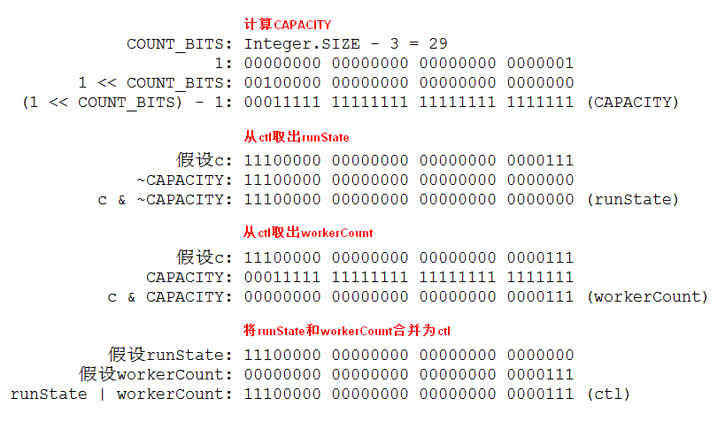
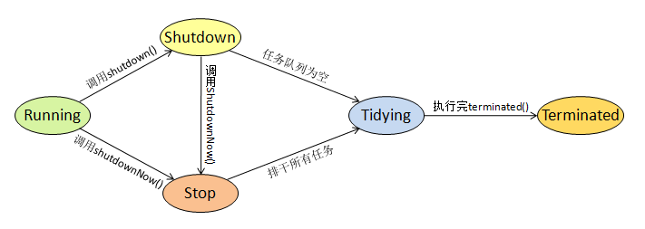

- [Java并发系列[10]----ThreadPoolExecutor源码分析](https://www.cnblogs.com/liuyun1995/p/9305273.html)

在日常的开发调试中，我们经常会直接new一个`Thread`对象来执行某个任务。这种方式在任务数较少的情况下比较简单实用，但是在并发量较大的场景中却有着致命的缺陷。例如在访问量巨大的网站中，如果每个请求都开启一个线程来处理的话，即使是再强大的服务器也支撑不住。一台电脑的CPU资源是有限的，在CPU较为空闲的情况下，新增线程可以提高CPU的利用率，达到提升性能的效果。但是在CPU满载运行的情况下，再继续增加线程不仅不能提升性能，反而因为线程的竞争加大而导致性能下降，甚至导致服务器宕机。因此，在这种情况下我们可以利用线程池来使线程数保持在合理的范围内，使得CPU资源被充分的利用，且避免因过载而导致宕机的危险。在`Executors`中为我们提供了多种静态工厂方法来创建各种特性的线程池，其中大多数是返回`ThreadPoolExecutor`对象。因此本篇我们从`ThreadPoolExecutor`类着手，深入探究线程池的实现机制。

### 1. 线程池状态和线程数的表示

```java
//高3位表示线程池状态, 后29位表示线程个数
private final AtomicInteger ctl = new AtomicInteger(ctlOf(RUNNING, 0));
private static final int COUNT_BITS = Integer.SIZE - 3;
private static final int CAPACITY = (1 << COUNT_BITS) - 1;

//运行状态  例:11100000000000000000000000000000
private static final int RUNNING = -1 << COUNT_BITS;

//关闭状态  例:00000000000000000000000000000000
private static final int SHUTDOWN = 0 << COUNT_BITS;

//停止状态  例:00100000000000000000000000000000
private static final int STOP = 1 << COUNT_BITS;

//整理状态  例:01000000000000000000000000000000
private static final int TIDYING = 2 << COUNT_BITS;

//终止状态  例:01100000000000000000000000000000
private static final int TERMINATED = 3 << COUNT_BITS;

private static int runStateOf(int c) { return c & ~CAPACITY; }
private static int workerCountOf(int c) { return c & CAPACITY; }
private static int ctlOf(int rs, int wc) { return rs | wc; }
```

在继续接下来的探究之前，我们先来搞清楚`ThreadPoolExecutor`是怎样存放状态信息和线程数信息的。`ThreadPoolExecutor`利用原子变量`ctl`来同时存储运行状态和线程数的信息，其中高3位表示线程池的运行状态(`runState`)，后面的29位表示线程池中的线程数(`workerCount`)。上面代码中，`runStateOf`方法是从`ctl`取出状态信息，`workerCountOf`方法是从`ctl`取出线程数信息，`ctlOf`方法是将状态信息和线程数信息糅合进`ctl`中。具体的计算过程如下图所示。



### 2. 线程池各个状态的具体含义

就像人的生老病死一样，线程池也有自己的生命周期，从创建到终止，线程池在每个阶段所做的事情是不一样的。新建一个线程池时它的状态为`Running`，这时它不断的从外部接收并处理任务，当处理不过来时它会把任务放到任务队列中；之后我们可能会调用`shutdown()`来终止线程池，这时线程池的状态从`Running`转为`Shutdown`，它开始拒绝接收从外部传过来的任务，但是会继续处理完任务队列中的任务；我们也可能调用`shutdownNow()`来立刻停止线程池，这时线程池的状态从`Running`转为`Stop`，然后它会快速排空任务队列中的任务并转到`Tidying`状态，处于该状态的线程池需要执行`terminated()`来做相关的扫尾工作，执行完`terminated()`之后线程池就转为`Terminated`状态，表示线程池已终止。这些状态的转换图如下所示。



### 3. 关键成员变量的介绍

```java
//任务队列
private final BlockingQueue<Runnable> workQueue;

//工作者集合
private final HashSet<Worker> workers = new HashSet<Worker>();

//线程达到的最大值
private int largestPoolSize;

//已完成任务总数
private long completedTaskCount;

//线程工厂
private volatile ThreadFactory threadFactory;

//拒绝策略
private volatile RejectedExecutionHandler handler;

//闲置线程存活时间
private volatile long keepAliveTime;

//是否允许核心线程超时
private volatile boolean allowCoreThreadTimeOut;

//核心线程数量
private volatile int corePoolSize;

//最大线程数量
private volatile int maximumPoolSize;

//默认拒绝策略
private static final RejectedExecutionHandler defaultHandler = new AbortPolicy();
```

在深入探究线程池的实现机制之前，我们有必要了解一下各个成员变量的作用。上面列出了主要的成员变量，除了一些用于统计的变量，例如`largestPoolSize`和`completedTaskCount`，其中大部分变量的值都是可以在构造时进行设置的。下面我们就看一下它的核心构造器。

```java
//核心构造器
public ThreadPoolExecutor(int corePoolSize,
                          int maximumPoolSize,
                          long keepAliveTime,
                          TimeUnit unit,
                          BlockingQueue<Runnable> workQueue,
                          ThreadFactory threadFactory,
                          RejectedExecutionHandler handler) {
    if (corePoolSize < 0 || maximumPoolSize <= 0 || maximumPoolSize < corePoolSize || keepAliveTime < 0) {
        throw new IllegalArgumentException();
    }    
    if (workQueue == null || threadFactory == null || handler == null) {
        throw new NullPointerException();
    }
    this.corePoolSize = corePoolSize;                  //设置核心线程数量
    this.maximumPoolSize = maximumPoolSize;            //设置最大线程数量
    this.workQueue = workQueue;                        //设置任务队列
    this.keepAliveTime = unit.toNanos(keepAliveTime);  //设置存活时间
    this.threadFactory = threadFactory;                //设置线程工厂
    this.handler = handler;                            //设置拒绝策略
}
```

`ThreadPoolExecutor`有多个构造器，所有的构造器都会调用上面的核心构造器。通过核心构造器我们可以为线程池设置不同的参数，由此线程池也能表现出不同的特性。因此彻底搞懂这几个参数的含义能使我们更好的使用线程池，下面我们就来详细看一下这几个参数的含义。

- corePoolSize：核心线程数最大值，默认情况下新建线程池时并不创建线程，后续每接收一个任务就新建一个核心线程来处理，直到核心线程数达到corePoolSize。这时后面到来的任务都会被放到任务队列中等待。
- maximumPoolSize：总线程数最大值，当任务队列被放满了之后，将会新建非核心线程来处理后面到来的任务。当总的线程数达到`maximumPoolSize`后，将不再继续创建线程，而是对后面的任务执行拒绝策略。
- workQueue：任务队列，当核心线程数达到`corePoolSize`后，后面到来的任务都会被放到任务队列中，该任务队列是阻塞队列，工作线程可以通过定时或者阻塞方式从任务队列中获取任务。
- keepAliveTime：闲置线程存活时间，该参数默认情况下只在线程数大于`corePoolSize`时起作用，闲置线程在任务队列上等待`keepAliveTime`时间后将会被终止，直到线程数减至`corePoolSize`。也可以通过设置`allowCoreThreadTimeOut`变量为true来使得`keepAliveTime`在任何时候都起作用，这时线程数最后会减至0。

### 4. `execute`方法的执行过程

```java
//核心执行方法
public void execute(Runnable command) {
    if (command == null) throw new NullPointerException();
    int c = ctl.get();
    //线程数若小于corePoolSize则新建核心工作者
    if (workerCountOf(c) < corePoolSize) {
        if (addWorker(command, true)) return;
        c = ctl.get();
    }
    //否则将任务放到任务队列
    if (isRunning(c) && workQueue.offer(command)) {
        int recheck = ctl.get();
        //若不是running状态则将该任务从队列中移除
        if (!isRunning(recheck) && remove(command)) {
            //成功移除后再执行拒绝策略
          reject(command);
        //若线程数为0则新增一个非核心线程
        }else if (workerCountOf(recheck) == 0) {
          addWorker(null, false);
        }
    //若队列已满则新增非核心工作者
    }else if (!addWorker(command, false)) {
        //若新建非核心线程失败则执行拒绝策略
      reject(command);
    }
}
```

`execute`方法是线程池接收任务的入口方法，当创建好一个线程池之后，我们会调用`execute`方法并传入一个`Runnable`交给线程池去执行。从上面代码中可以看到`execute`方法首先会去判断当前线程数是否小于`corePoolSize`，如果小于则调用`addWorker`方法新建一个核心线程去处理该任务，否则调用`workQueue`的`offer`方法将该任务放入到任务队列中。通过`offer`方法添加并不会阻塞线程，如果添加成功会返回`true`，若队列已满则返回`false`。在成功将任务放入到任务队列后，还会再次检查线程池是否是`Running`状态，如果不是则将刚刚添加的任务从队列中移除，然后再执行拒绝策略。如果从队列中移除任务失败，则再检查一下线程数是否为0(有可能刚好全部线程都被终止了)，是的话就新建一个非核心线程去处理。如果任务队列已经满了，此时`offer`方法会返回`false`，接下来会再次调用`addWorker`方法新增一个非核心线程来处理该任务。如果期间创建线程失败，则最后会执行拒绝策略。

### 5. 工作线程的实现

```java
//工作者类
private final class Worker extends AbstractQueuedSynchronizer implements Runnable {
    //关联线程
    final Thread thread;
    //初始任务
    Runnable firstTask;
    //完成任务数
    volatile long completedTasks;

    //构造器
    Worker(Runnable firstTask) {
        //抑制中断直到runWorker
        setState(-1);
        //设置初始任务
        this.firstTask = firstTask;
        //设置关联线程
        this.thread = getThreadFactory().newThread(this);
    }
    
    public void run() {
        runWorker(this);
    }
    
    //判断是否占有锁, 0代表未占用, 1代表已占用
    protected boolean isHeldExclusively() {
        return getState() != 0;
    }

    //尝试获取锁
    protected boolean tryAcquire(int unused) {
        if (compareAndSetState(0, 1)) {
            setExclusiveOwnerThread(Thread.currentThread());
            return true;
        }
        return false;
    }
    
    //尝试释放锁
    protected boolean tryRelease(int unused) {
        setExclusiveOwnerThread(null);
        setState(0);
        return true;
    }

    public void lock() { acquire(1); }
    public boolean tryLock() { return tryAcquire(1); }
    public void unlock() { release(1); }
    public boolean isLocked() { return isHeldExclusively(); }

    //中断关联线程
    void interruptIfStarted() {
        Thread t;
        //将活动线程和闲置线程都中断
        if (getState() >= 0 && (t = thread) != null && !t.isInterrupted()) {
            try {
                t.interrupt();
            } catch (SecurityException ignore) {
                //ignore
            }
        }
    }
}
```

`ThreadPoolExecutor`内部实现了一个`Worker`类，用它来表示工作线程。每个`Worker`对象都持有一个关联线程和分配给它的初始任务。`Worker`类继承自AQS并实现了自己的加锁解锁方法，说明每个`Worker`对象也是一个锁对象。同时`Worker`类还实现了`Runnable`接口，因此每个`Worker`对象都是可以运行的。`Worker`类有一个唯一的构造器，需要传入一个初始任务给它，在构造器里面首先将同步状态设置为-1，这个操作主要是抑制中断直到`runWorker`方法运行，为啥要这样做？我们继续看下去，可以看到在设置完初始任务之后，马上就开始设置关联线程，关联线程是通过线程工厂的`newThread`方法来生成的，这时将`Worker`对象本身当作任务传给关联线程。因此在启动关联线程时(调用`start`方法)，会运行`Worker`对象自身的`run`方法。而`run`方法里面紧接着调用`runWorker`方法，也就是说只有在`runWorker`方法运行时才表明关联线程已启动，这时去中断关联线程才有意义，因此前面要通过设置同步状态为-1来抑制中断。那么为啥将同步状态设置为-1就可以抑制中断？每个`Worker`对象都是通过调用`interruptIfStarted`方法来中断关联线程的，在`interruptIfStarted`方法内部会判断只有同步状态>=0时才会中断关联线程。因此将同步状态设置为-1能起到抑制中断的作用。

### 6. 工作线程的创建

```java
//添加工作线程
private boolean addWorker(Runnable firstTask, boolean core) {
    retry:
    for (;;) {
        int c = ctl.get();
        int rs = runStateOf(c);
        //只有以下两种情况会继续添加线程
        //1.状态为running
        //2.状态为shutdown，首要任务为空，但任务队列中还有任务
        if (rs >= SHUTDOWN && !(rs == SHUTDOWN && firstTask == null && !workQueue.isEmpty())) {
            return false;
        }
        for (;;) {
            int wc = workerCountOf(c);
            //以下三种情况不继续添加线程:
            //1.线程数大于线程池总容量
            //2.当前线程为核心线程，且核心线程数达到corePoolSize
            //3.当前线程非核心线程，且总线程达到maximumPoolSize
            if (wc >= CAPACITY || wc >= (core ? corePoolSize : maximumPoolSize)) {
                return false;
            }
            //否则继续添加线程, 先将线程数加一
            if (compareAndIncrementWorkerCount(c)) {
                //执行成功则跳过外循环
                break retry;
            }
            //CAS操作失败再次检查线程池状态
            c = ctl.get();
            //如果线程池状态改变则继续执行外循环
            if (runStateOf(c) != rs) {
                continue retry;
            }
            //否则表明CAS操作失败是workerCount改变, 继续执行内循环
        }
    }
    boolean workerStarted = false;
    boolean workerAdded = false;
    Worker w = null;
    try {
        final ReentrantLock mainLock = this.mainLock;
        w = new Worker(firstTask);
        final Thread t = w.thread;
        if (t != null) {
            mainLock.lock();
            try {
                int c = ctl.get();
                int rs = runStateOf(c);
                if (rs < SHUTDOWN || (rs == SHUTDOWN && firstTask == null)) {
                    //如果线程已经开启则抛出异常
                    if (t.isAlive()) throw new IllegalThreadStateException();
                    //将工作者添加到集合中
                    workers.add(w);
                    int s = workers.size();
                    //记录线程达到的最大值
                    if (s > largestPoolSize) {
                        largestPoolSize = s;
                    }
                    workerAdded = true;
                }
            } finally {
                mainLock.unlock();
            }
            //将工作者添加到集合后则启动线程
            if (workerAdded) {
                t.start();
                workerStarted = true;
            }
        }
    } finally {
        //如果线程启动失败则回滚操作
        if (!workerStarted) {
            addWorkerFailed(w);
        }
    }
    return workerStarted;
}
```

上面我们知道在`execute`方法里面会调用`addWorker`方法来添加工作线程。通过代码可以看到进入`addWorker`方法里面会有两层自旋循环，在外层循环中获取线程池当前的状态，如果线程池状态不符合就直接`return`，在内层循环中获取线程数，如果线程数超过限定值也直接`return`。只有经过这两重判断之后才会使用`CAS`方式来将线程数加1。成功将线程数加1之后就跳出外层循环去执行后面的逻辑，否则就根据不同条件来进行自旋，如果是线程池状态改变就执行外层循环，如果是线程数改变就执行内层循环。当线程数成功加1之后，后面就是去新建一个`Worker`对象，并在构造时传入初始任务给它。然后将这个`Worker`对象添加到工作者集合当中，添加成功后就调用`start`方法来启动关联线程。

### 7. 工作线程的执行

```java
//运行工作者
final void runWorker(Worker w) {
    //获取当前工作线程
    Thread wt = Thread.currentThread();
    //获取工作者的初始任务
    Runnable task = w.firstTask;
    //将工作者的初始任务置空
    w.firstTask = null;
    //将同步状态从-1设为0
    w.unlock();
    boolean completedAbruptly = true;
    try {
        //初始任务不为空则执行初始任务, 否则从队列获取任务
        while (task != null || (task = getTask()) != null) {
            //确保获取到任务后才加锁
            w.lock(); 
            //若状态大于等于stop, 保证当前线程被中断
            //若状态小于stop, 保证当前线程未被中断
            //在清理中断状态时可能有其他线程在修改, 所以会再检查一次
            if ((runStateAtLeast(ctl.get(), STOP) || 
                (Thread.interrupted() && runStateAtLeast(ctl.get(), STOP))) && !wt.isInterrupted()) {
                wt.interrupt();
            }
            try {
                //任务执行前做些事情
                beforeExecute(wt, task);
                Throwable thrown = null;
                try {
                    //执行当前任务
                    task.run();
                } catch (RuntimeException x) {
                    thrown = x; throw x;
                } catch (Error x) {
                    thrown = x; throw x;
                } catch (Throwable x) {
                    thrown = x; throw new Error(x);
                } finally {
                    //任务执行后做一些事情
                    afterExecute(task, thrown);
                }
            } finally {
                //将执行完的任务置空
                task = null;
                //将完成的任务数加一
                w.completedTasks++;
                w.unlock();
            }
        }
        //设置该线程为正常完成任务
        completedAbruptly = false;
    } finally {
        //执行完所有任务后将线程删除
        processWorkerExit(w, completedAbruptly);
    }
}
```

上面我们知道，将`Worker`对象添加到`workers`集合之后就会去调用关联线程的start方法，由于传给关联线程的`Runnable`就是`Worker`对象本身，因此会调用`Worker`对象实现的`run`方法，最后会调用到`runWorker`方法。我们看到上面代码，进入到`runWorker`方法里面首先获取了`Worker`对象的初始任务，然后调用`unlock`方法将同步状态加1，由于在构造`Worker`对象时将同步状态置为-1了，所以这里同步状态变回0，因此在这之后才可以调用`interruptIfStarted`方法来中断关联线程。如果初始任务不为空就先去执行初始任务，否则就调用`getTask`方法去任务队列中获取任务，可以看到这里是一个while循环，也就是说工作线程在执行完自己的任务之后会不断的从任务队列中获取任务，直到`getTask`方法返回null，然后工作线程退出while循环最后执行`processWorkerExit`方法来移除自己。如果需要在所有任务执行之前或之后做些处理，可以分别实现`beforeExecute`方法和`afterExecute`方法。

### 8. 任务的获取

```java
//从任务队列中获取任务
private Runnable getTask() {
    //上一次获取任务是否超时
    boolean timedOut = false;
    retry:
    //在for循环里自旋
    for (;;) {
        int c = ctl.get();
        int rs = runStateOf(c);
        //以下两种情况会将工作者数减为0并返回null，并直接使该线程终止:
        //1.状态为shutdown并且任务队列为空
        //2.状态为stop, tidying或terminated
        if (rs >= SHUTDOWN && (rs >= STOP || workQueue.isEmpty())) {
            decrementWorkerCount();
            return null;
        }
        
        boolean timed;
        //判断是否要剔除当前线程
        for (;;) {
            int wc = workerCountOf(c);
            //以下两种情况会在限定时间获取任务:
            //1.允许核心线程超时
            //2.线程数大于corePoolSize
            timed = allowCoreThreadTimeOut || wc > corePoolSize;
            //以下两种情况不执行剔除操作：
            //1.上次任务获取未超时
            //2.上次任务获取超时, 但没要求在限定时间获取
            if (wc <= maximumPoolSize && !(timedOut && timed)) {
                break;
            }
            //若上次任务获取超时, 且规定在限定时间获取, 则将线程数减一
            if (compareAndDecrementWorkerCount(c)) {
                //CAS操作成功后直接返回null
                return null;
            }
            //CAS操作失败后再次检查状态
            c = ctl.get();
            //若状态改变就从外层循环重试
            if (runStateOf(c) != rs) {
                continue retry;
            }
            //否则表明是workerCount改变, 继续在内循环重试
        }
        
        try {
            //若timed为true, 则在规定时间内返回
            //若timed为false, 则阻塞直到获取成功
            //注意:闲置线程会一直在这阻塞
            Runnable r = timed ? workQueue.poll(keepAliveTime, TimeUnit.NANOSECONDS) : workQueue.take();
            //获取任务不为空则返回该任务
            if (r != null) {
                return r;
            }
            //否则将超时标志设为true
            timedOut = true;
        } catch (InterruptedException retry) {
            timedOut = false;
        }
    }
}
```

工作线程在while循环里不断的通过`getTask`方法来从任务队列中获取任务，我们看一下`getTask`方法是怎样获取任务的。进入第一个for循环之后有一个if判断，从这里我们可以看到，如果线程池状态为`shutdown`，会继续消费任务队列里面的任务；如果线程池状态为`stop`，则停止消费任务队列里剩余的任务。进入第二个for循环后会给`timed`变量赋值，由于`allowCoreThreadTimeOut`变量默认是`false`，所以`timed`的值取决于线程数是否大于`corePoolSize`，小于为`false`，大于则为`true`。从任务队列里面获取任务的操作在try块里面，如果`timed`为true，则调用`poll`方法进行定时获取；如果`timed`为`flase`，则调用`take`方法进行阻塞获取。也就是说默认情况下，如果线程数小于`corePoolSize`，则调用`take`方法进行阻塞获取，即使任务队列为空，工作线程也会一直等待；如果线程数大于`corePoolSize`，则调用`poll`方法进行定时获取，在`keepAliveTime`时间内获取不到任务则会返回null，对应的工作线程也会被移除，但线程数会保持在`corePoolSize`上。当然如果设置`allowCoreThreadTimeOut`为`true`，则会一直通过调用`poll`方法来从任务队列中获取任务，如果任务队列长时间为空，则工作线程会减少至0。

### 9. 工作线程的退出

```java
//删除工作线程
private void processWorkerExit(Worker w, boolean completedAbruptly) {
    //若非正常完成则将线程数减为0
    if (completedAbruptly) {
        decrementWorkerCount();
    }
    final ReentrantLock mainLock = this.mainLock;
    mainLock.lock();
    try {
        //统计完成的任务总数
        completedTaskCount += w.completedTasks;
        //在这将工作线程移除
        workers.remove(w);
    } finally {
        mainLock.unlock();
    }
    //尝试终止线程池
    tryTerminate();
    //再次检查线程池状态
    int c = ctl.get();
    //若状态为running或shutdown, 则将线程数恢复到最小值
    if (runStateLessThan(c, STOP)) {
        //线程正常完成任务被移除
        if (!completedAbruptly) {
            //允许核心线程超时最小值为0, 否则最小值为核心线程数
            int min = allowCoreThreadTimeOut ? 0 : corePoolSize;
            //如果任务队列还有任务, 则保证至少有一个线程
            if (min == 0 && !workQueue.isEmpty()) {
                min = 1;
            }
            //若线程数大于最小值则不新增了
            if (workerCountOf(c) >= min) {
                return;
            }
        }
        //新增工作线程
        addWorker(null, false);
    }
}
```

工作线程如果从`getTask`方法中获得null，则会退出while循环并随后执行`processWorkerExit`方法，该方法会在这个工作线程终止之前执行一些操作，我们看到它会去统计该工作者完成的任务数，然后将其从`workers`集合中删除，每删除一个工作者之后都会去调用`tryTerminate`方法尝试终止线程池，但并不一定会真的终止线程池。从`tryTerminate`方法返回后再次去检查一遍线程池的状态，如果线程池状态为`running`或者`shutdow`n，并且线程数小于最小值，则恢复一个工作者。这个最小值是怎样计算出来的呢？我们来看看。如果`allowCoreThreadTimeOut`为true则最小值为0，否则最小值为`corePoolSize`。但还有一个例外情况，就是虽然允许核心线程超时了，但是如果任务队列不为空的话，那么必须保证有一个线程存在，因此这时最小值设为1。后面就是判断如果工作线程数大于最小值就不新增线程了，否则就新增一个非核心线程。从这个方法可以看到，每个线程退出时都会去判断要不要再恢复一个线程，因此线程池中的线程总数也是动态增减的。

### 10. 线程池的终止

```java
//平缓关闭线程池
public void shutdown() {
    final ReentrantLock mainLock = this.mainLock;
    mainLock.lock();
    try {
        //检查是否有关闭的权限
        checkShutdownAccess();
        //将线程池状态设为shutdown
        advanceRunState(SHUTDOWN);
        //中断闲置的线程
        interruptIdleWorkers();
        //对外提供的钩子
        onShutdown();
    } finally {
        mainLock.unlock();
    }
    //尝试终止线程池
    tryTerminate();
}

//立刻关闭线程池
public List<Runnable> shutdownNow() {
    List<Runnable> tasks;
    final ReentrantLock mainLock = this.mainLock;
    mainLock.lock();
    try {
        //检查是否有关闭的权限
        checkShutdownAccess();
        //将线程池状态设为stop
        advanceRunState(STOP);
        //中断所有工作线程
        interruptWorkers();
        //排干任务队列
        tasks = drainQueue();
    } finally {
        mainLock.unlock();
    }
    //尝试终止线程池
    tryTerminate();
    return tasks;
}
```

可以通过两个方法来终止线程池，通过调用`shutdown`方法可以平缓的终止线程池，通过调用`shutdownNow`方法可以立即终止线程池。调用`shutdown()`方法后首先会将线程池状态设置为`shutdown`，这时线程池会拒绝接收外部传过来的任务，然后调用`interruptIdleWorkers()`方法中断闲置线程，剩余的线程会继续消费完任务队列里的任务之后才会终止。调用`shutdownNow()`方法会将线程池状态设置为`stop`，这是线程池也不再接收外界的任务，并且马上调用`interruptWorkers()`方法将所有工作线程都中断了，然后排干任务队列里面没有被处理的任务，最后返回未被处理的任务集合。调用`shutdown()`和`shutdownNow()`方法后还未真正终止线程池，这两个方法最后都会调用`tryTerminate()`方法来终止线程池。我们看看该方法的代码。

```java
//尝试终止线程池
final void tryTerminate() {
    for (;;) {
        int c = ctl.get();
        //以下两种情况终止线程池,其他情况直接返回:
        //1.状态为stop
        //2.状态为shutdown且任务队列为空
        if (isRunning(c) || runStateAtLeast(c, TIDYING) ||
            (runStateOf(c) == SHUTDOWN && !workQueue.isEmpty())) {
            return;
        }
        //若线程不为空则中断一个闲置线程后直接返回
        if (workerCountOf(c) != 0) {
            interruptIdleWorkers(ONLY_ONE);
            return;
        }
        final ReentrantLock mainLock = this.mainLock;
        mainLock.lock();
        try {
            //将状态设置为tidying
            if (ctl.compareAndSet(c, ctlOf(TIDYING, 0))) {
                try {
                    //线程池终止后做的事情
                    terminated();
                } finally {
                    //将状态设置为终止状态(TERMINATED)
                    ctl.set(ctlOf(TERMINATED, 0));
                    //唤醒条件队列所有线程
                    termination.signalAll();
                }
                return;
            }
        } finally {
            mainLock.unlock();
        }
        //若状态更改失败则再重试
    }
}
```

`tryTerminate()`方法在其他很多地方也被调用过，比如`processWorkerExit()`和`addWorkerFailed()`。调用该方法来尝试终止线程池，在进入for循环后第一个if判断过滤了不符合条件的终止操作，只有状态为`stop`，或者状态为`shutdown`且任务队列为空这两种情况才能继续执行。第二个if语句判断工作者数量是否为0，不为0的话也直接返回。经过这两重判断之后才符合终止线程池的条件，于是先通过CAS操作将线程池状态设置为`tidying`状态，在`tidying`状态会调用用户自己实现的`terminated()`方法来做一些处理。到了这一步，不管`terminated()`方法是否成功执行最后都会将线程池状态设置为`terminated`，也就标志着线程池真正意义上的终止了。最后会唤醒所有等待线程池终止的线程，让它们继续执行。

### 11. 常用线程池参数配置

`Executors`中有许多静态工厂方法来创建线程池，在平时使用中我们都是通过`Executors`的静态工厂方法来创建线程池的。这其中有几个使用线程池的典型例子我们来看一下。

```java
//固定线程数的线程池
//注：该线程池将corePoolSize和maximumPoolSize都设置为同一数值，线程池刚创建时线程数为0，
//之后每接收一个任务创建一个线程，直到线程数达到nThreads，此后线程数不再增长。如果其中有某个
//线程因为发生异常而终止，线程池将补充一个新的线程。
public static ExecutorService newFixedThreadPool(int nThreads) {
    return new ThreadPoolExecutor(nThreads, nThreads,
                                  0L, TimeUnit.MILLISECONDS,
                                  new LinkedBlockingQueue<Runnable>());
}

//单个线程的线程池
//注：该线程池将corePoolSize和maximumPoolSize都设置为1，因此线程池中永远只有一个线程，
//如果该线程因为不可预知的异常而被终止，线程池将会补充一个新的线程。
public static ExecutorService newSingleThreadExecutor() {
    return new FinalizableDelegatedExecutorService
        (new ThreadPoolExecutor(1, 1,
                                0L, TimeUnit.MILLISECONDS,
                                new LinkedBlockingQueue<Runnable>()));
}

//可缓存的线程池
//注：该线程池将corePoolSize设置为0，将maximumPoolSize设置为Integer.MAX_VALUE，
//空闲线程存活时间设置为60S。也就是说该线程池一开始线程数为0，随着任务数的增加线程数也相应
//增加，线程数的上限为Integer.MAX_VALUE。当任务数减少时线程数也随之减少，最后会减少至0。
public static ExecutorService newCachedThreadPool() {
    return new ThreadPoolExecutor(0, Integer.MAX_VALUE,
                                  60L, TimeUnit.SECONDS,
                                  new SynchronousQueue<Runnable>());
}
```
