- [极致八股文之JVM垃圾回收器G1&ZGC详解](https://mp.weixin.qq.com/s/Ywj3XMws0IIK-kiUllN87Q)

垃圾回收器介绍

## G1(Garbage First)垃圾回收器

G1垃圾收集器在JDK7被开发出来，JDK8功能基本完全实现。并且成功替换掉了`Parallel Scavenge`成为了服务端模式下默认的垃圾收集器。对比起另外一个垃圾回收器CMS，G1不仅能提供能提供规整的内存，而且能够实现可预测的停顿，能够将垃圾回收时间控制在N毫秒内。这种“可预测的停顿”和高吞吐量特性让G1被称为"功能最全的垃圾回收器"。

G1同时回收新生代和老年代，但是分别被称为G1的`Young GC`模式和`Mixed GC`模式。这个特性来源于G1独特的内存布局，内存分配不再严格遵守新生代，老年代的划分，而是以`Region`为单位，G1跟踪各个`Region`的并且维护一个关于`Region`的优先级列表。在合适的时机选择合适的`Region`进行回收。这种基于`Region`的内存划分为一些巧妙的设计思想提供了解决停顿时间和高吞吐的基础。接下来我们将详细讲解G1的详细垃圾回收过程和里面可圈可点的设计。

### Region内存划分
G1将堆划分为一系列大小不等的内存区域，称为Region(单词语义范围，地区，接下来我简述为分区)。每个region为1-32M，都是2的n次幂。在分代垃圾回收算法的思想下，region逻辑上划分为Eden，Survivor和老年代。每个分区都可能是eden区，Survivor区也可能是old区，但在一个时刻只能是一种分区。各种角色的region个数都是不固定的，这说明每个代的内存也是不固定的。这些region在逻辑上是连续的，而不是物理上连续，这点和之前的young/old区物理连续很不一样。

除了前面说的`Eden`区，`Survivor`区，`old`区，G1中还有一种特殊的分区，`Humongous`区。`Humongous`用于存放大对象。当一个对象的容量超过了Region大小的一半，就会把这个对象放进Humongous分区，因为如果对一个短期存在的大对象使用复制算法回收的话，复制成本非常高。而直接放进old区则导致原本应该短期存在的对象占用了老年代的内存，更加不利于回收性能。如果一个对象的大小超过了一个Region的大小，那么就需要找到连续的Humogous分区来存放这个大对象。有时候因为找不到连续的Humogous分区甚至不得不开启Full GC。

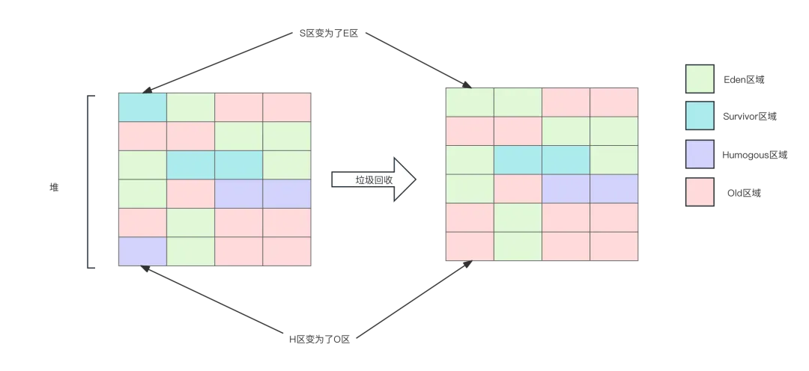

### Region内部结构

#### Card Table卡表

Card Table是Region的内部结构划分。每个region内部被划分为若干的内存块，被称为card。这些card集合被称为card table，卡表。
比如下面的例子，region1中的内存区域被划分为9块card，9块card的集合就是卡表card table。

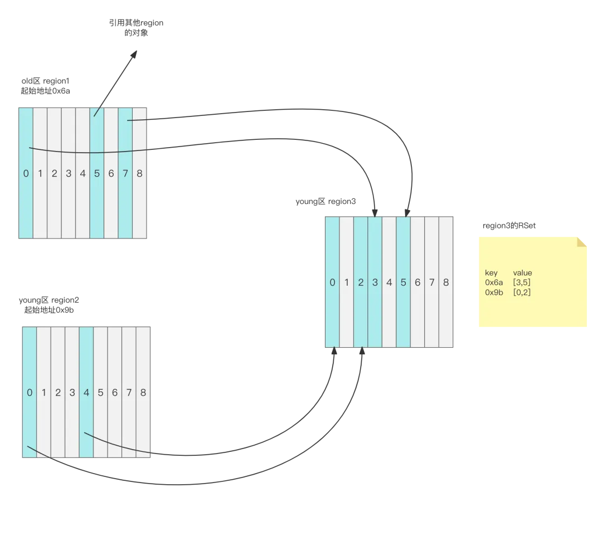

#### Rset记忆集合
除了卡表，每个region中都含有Remember Set，简称RSet。RSet其实是hash表，key为引用本region的其他region起始地址，value为本region中被key对应的region引用的card索引位置。

这里必须讲解一下RSet存在的原因，RSet是为了解决"跨代引用"。想象一下，一个新生代对象被老年代对象引用，那么为了通过引用链找到这个新生代对象，从GC Roots出发遍历对象时必须经过老年代对象。实际上以这种方式遍历时，是把所有对象都遍历了一遍。但是我们的其实只想回收新生代的对象，却把所有对象都遍历了一遍，这无疑很低效。

在YoungGC时，当RSet存在时，顺着引用链查找引用。如果引用链上出现了老年代对象，那么直接放弃查找这条引用链。当整个GC Root Tracing执行完毕后，就知道了除被跨代引用外还存活的新生代对象。紧接着再遍历新生代Region的RSet，如果RSet里存在key为老年代的Region，就将key对应的value代表的card的对象标记为存活，这样就标记到了被跨代引用的新生代对象。

当然这么做会存在一个问题，如果部分老年代对象是应该被回收的对象，但还是跨代引用了新生代，会导致原本应该被回收的新生代对象躲过本轮新生代回收。这部分对象就只能等到后续的老年代的垃圾回收mixed GC来回收掉。这也是为什么G1的回收精度比较低的原因之一。

以这幅图为例，region1和region2都引用了region3中的对象，那么region3的RSet中有两个key，分别是region1的起始地址和region2的起始地址。

在扫描region3的RSet时，发现key为0x6a的region是一个old区region。如果这时第3，5card对应的对象没有被标记为可达，那么这里就会根据RSet再次标记。

同样的，key为0x9b对应的region是一个young区域的region，那么0，2号card的对象则不会被标记。

### Young GC流程
在了解了region的内部结构之后，我们再来看一下G1的young gc的具体流程。

1. stop the world，整个young gc的流程都是在stw里进行的，这也是为什么young gc能回收全部eden区域的原因。控制young gc开销的办法只有减少young region的个数，也就是减少年轻代内存的大小，还有就是并发，多个线程同时进行gc，尽量减少stw时间。
2. 扫描GCRoots，注意这里扫描的GC Roots就是一般意义上的GC Roots，是扫描的直接指向young代的对象，那如果GC Root是直接指向老年代对象的，则会直接停止在这一步，也就是不往下扫描了。被老年代对象指向的young代对象会在接下来的利用Rset中key指向老年代的卡表识别出来，这样就避免了对老年代整个大的heap扫描，提高了效率。这也是为什么Rset能避免对老年代整体扫描的原因。
3. 排空dirty card quene，更新Rset。Rset中记录了哪些对象被老年代跨带引用，也就是当新生代对象被老年代对象引用时，应该更新这个记录到RSet中。但更新RSet记录的时机不是伴随着引用更改马上发生的。每当老年代引用新生代对象时，这个引用记录对应的card地址其实会被放入Dirty Card Queue（线程私有的，当线程私有的dirty card queue满了之后会被转移到全局的dirty card queue，这个全局是唯一的），原因是如果每次更新引用时直接更新Rset会导致多线程竞争，因为赋值操作很频繁，影响性能。所以更新Rset交由Refinement线程来进行。全局DirtyCardQueue的容量变化分为4个阶段

    

   - 白色：无事发生
   - 绿色：Refinement线程被激活，-XX:G1ConcRefinementGreenZone=N指定的线程个数。从（全局和线程私有）队列中拿出dirty card。并更新到对应的Rset中。
   - 黄色：产生dirty card的速度过快，激活全部的Refinement线程，通过参数-XX:G1ConcRefinementYellowZone=N 指定
   - 红色：产生dirty card的速度过快，将应用线程也加入到排空队列的工作中。目的是把应用线程拖慢，减慢dirty card产生。

4. 扫描Rset，扫描所有Rset中Old区到young区的引用。到这一步就确定出了young区域哪些对象是存活的。
5. 拷贝对象到survivor区域或者晋升old区域。
6. 处理引用队列，软引用，弱引用，虚引用

以上就是young gc的全部流程。

### 三色标记算法
知道了Young GC的流程后，接下来我们将学习G1针对老年代的垃圾回收过程Mixed GC，但是在正式开始介绍之前我们先讲解一下可达性分析算法的具体实现，三色标记算法。以及三色标记算法的缺陷以及G1是如何解决这个缺陷的。

在可达性分析的思想指导下，我们需要标记对象是否可达，那么我们采用将对象标记为不同的颜色来区分对象是否可达。可以理解如果一个对象能从GC Roots出发并且遍历到，那么对象就是可达的，这个过程我们称为检查。

- 白色：对象还没被检查。
- 灰色：对象被检查了，但是对象的成员Field(对象中引用的其他对象)还没有被检查。这说明这个对象是可达的。
- 黑色：对象被检查了，对象的成员Fileld也被检查了。

那么整个检测的过程，就是从GC Roots出发不断地遍历对象，并且将可达的对象标记成黑色的过程。当标记结束时，还是白色的对象就是没被遍历到的对象，即不可达的对象。

举个例子

第一轮检查，找到所有的GC Roots，GC Roots被标记为灰色，有的GC Roots因为没有成员Field则被标记为黑色。
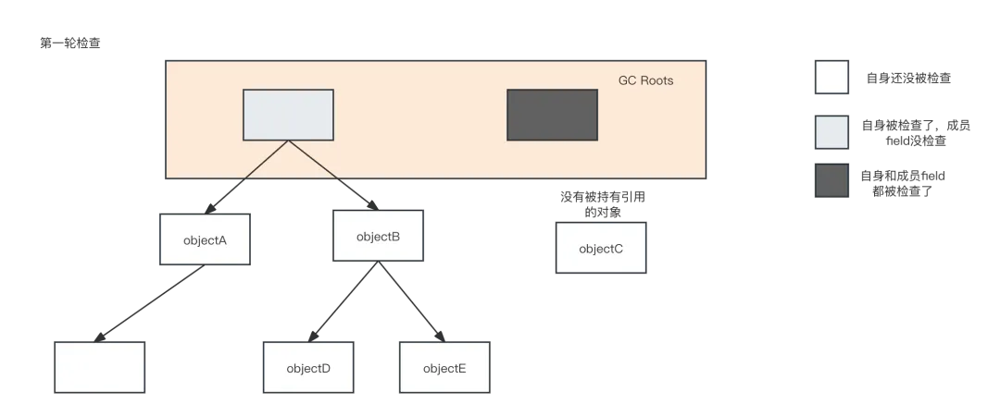

第二轮检查，检查被GC Roots引用的对象，并标记为灰色
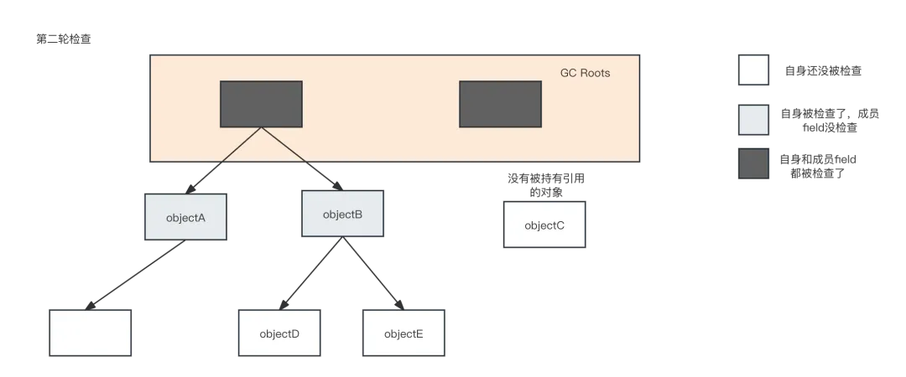

第三轮检查，循环之前的步骤，将被标记为灰色对象的子Field检查。因为这里就假设了3次循环检查的对象，所以是最后一次检查。这一路检查结束，还是白色的对象就是可以被回收的对象。即图例里的objectC
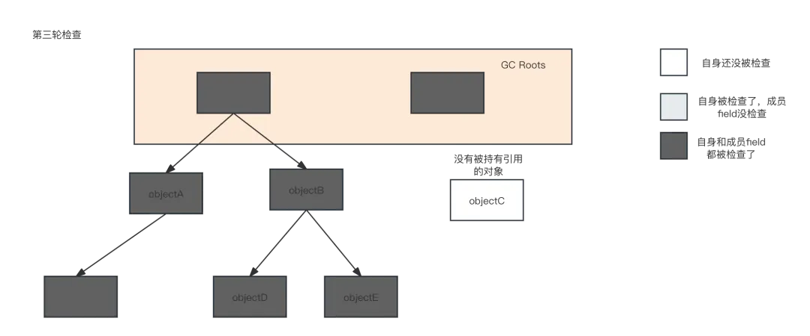

以上描述的是一轮三色标记算法的工作过程，但是这是一个理想情况，因为标记过程中，标记的线程是和用户线程交替运行的，所以可能出现标记过程中引用发生变化的情况。试想一下，在第二轮检查到第三轮检查之间，假设发生了引用的变化，objectD不再被objectB引用，而是被objectA引用，而且此时ObjectA的成员已经被检查完毕了，objectB的成员Field还没被检查。这时，objectD就永远不会再被检查到。这就导致了漏标。

还有一种漏标的情况，就是新产生一个对象，这个对象被已经被标记为黑色的对象持有。比如图例中的newObjectF。因为黑色对象已经被认为是检查完毕了，所以新产生的对象不会再被检查，这也会导致漏标。这两种漏标的解决方式我将仔细讲解一下。

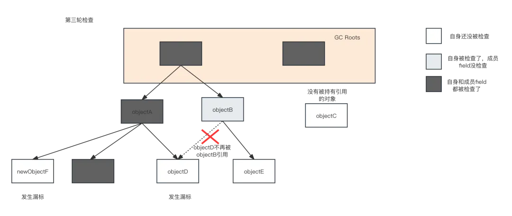

#### 已经存在的对象被漏标
即图例中被漏标的objectD，要向漏标objectD，必须同时满足：
1. 灰色对象不再指向白色对象，即objectB.d = null
2. 黑色对象指向白色对象，即objectA.d = objectD

要解决漏标，只要打破这两个条件的任意一个即可。由此我们引出两个解决方案。原始快照和增量更新。
1. 原始快照(Snapshot At The Beginning，简称SATB)

    当任意的灰色对象到白色对象的引用被删除时，记录下这个被删除的引用，默认这个被删除的引用对象是存活的。这也可以理解为整个检查过程中的引用关系以检查刚开始的那一刻为准。

2. 增量更新(Incremental Update)
    当灰色对象被新增一个白色对象的引用的时候，记录下发生引用变更的黑色对象，并将它重新改变为灰色对象，重新标记。这是CMS采用的解决办法（没错，CMS也是三色标记算法实现的）。

在上面的两种解决方案里，我们发现，无论如何，都要记录下发生更改的引用。所以我们需要一种记录引用发生更改的手段，写屏障(write barrier)。写屏障是一种记录下引用发生变更的手段，效果类似AOP，但是其实现远比我们使用的AOP更加底层，大家可以认为是在JVM代码层面的一段代码。每当任意的引用变更时，就会触发这段代码，并记录下发生变更的引用。

#### 新产生的对象被漏标
新产生的对象被漏标的解决方式则简单一些，在增量更新模式下，这个问题天生就被解决了。在SATB模式下，我们其实是在检查一开始就确定了一个检查范围，所以我们可以将新产生的对象放在检查范围之外，默认新产生的对象是存活的。当然这个过程得实际结合卡表来讲解才会更加具体形象。接下来在Mixed GC的过程里再细说。

#### SATB
Snapshot At The Beginning，G1在分配对象时，会在region中有2个top-at-mark-start（TAMS）指针，分别表示prevTAMS和nextTAMS。对应着卡表上即指向表示卡表范围的的两个编号，GC是分配在nextTAMS位置以上的对象都视为活着的，这是一种隐式的标记（这涉及到G1 MixedGC垃圾回收阶段的细节，很复杂，接下来会详细讨论）。这种解决漏标的方式是有缺陷的，它会造成真正应该被回收的白对象躲过这次GC生存到下一次GC，这就是float garbage(浮动垃圾)。因为SATB的做法精度比较低，所以造成float garbage的情况也会比较多。

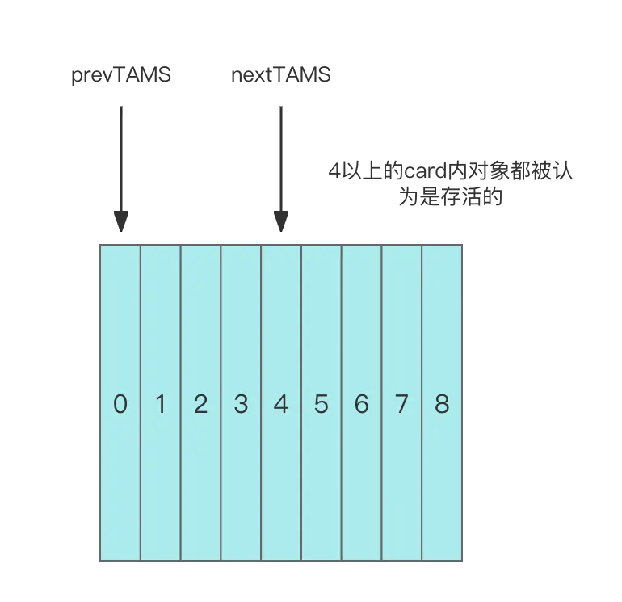

### Mixed GC
通过前面的学习，我们已经认识到了G1采用的标记算法-三色标记算法以及解决里面问题的解决思想，接下来我们将讲解Mixed GC的详细过程，以及怎样利用G1的卡表来解决里面的问题。
Mixed GC从步骤上可以分为两个大步骤，全局并发标记（global concurrent marking），拷贝存活对象（evacuation）。全局并发表的过程涉及到SATB的标记过程，我们将详细讲解。

全局

G1收集器垃圾收集器的全局并发标记（global concurrent marking）分为多个阶段

1. 初始标记（initial marking）

这个阶段会STW，标记从GC Root开始直接可达的对象，这一步伴随着young gc。之所以要young gc是为了处理跨代引用，老年代独享也可能被年轻代跨代引用，但是老年代不能使用RSet来解决跨代引用。还有就是young gc也会stw，在第一步young gc可以共用stw的时间，尽量减少stw时间。

这一步还初始化了一些参数，将bottom指针赋值给prevTAMS指针，top指针赋值给nextTAMS指针，同时清空nextBitMap指针。因为之后的并发标记需要使用到这三个变量。

这里大家可能被这些变量搞晕了，我解释一下，top，prevTAMS，nextTAMS，top都是指向卡表的指针，他们的存在是为了标识哪些对象是可以被回收的，哪些是存活的，这就是SATB机制。而nextBitMap则是记录下卡表中哪些对象是存活的一个数组，当然现在还没开始检查，nextBitMap里的记录都是空。

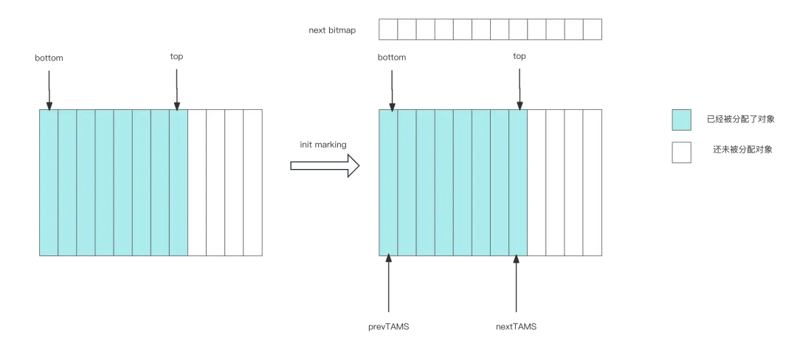

2. 根分区扫描（root region scan）

这个阶段在stw之后，会扫描survivor区域（survivor分区就是根分区），将所有被survivor区域对象引用的老年代对象标记。这也是上一步需要young gc的原因，处理跨代引用时需要知道哪些old区对象被S区对象引用。这个过程因为需要扫描survivor分区，所以不能发生young gc，如果扫描过程中新生代被耗尽，那么必须等待扫描结束才可以开始young gc。这一步耗时很短。

3. 并发标记（Concurrent Marking）

从GC Roots开始对堆中对象进行可达性分析，找出各个region的存活对象信息，耗时较长。粗略过程是这样的，但实际这一步的过程很复杂。因为要考虑在SATB机制之下，各个指针的变化。
假设在根分区扫描后没有引用的改变，那么一个region的分区状态和第一步init marking初始化完一致。此时如果再继续分配对象，那么对象会分配在nextTAMS之后，随着对象的分配，TOP指针会向后移动。

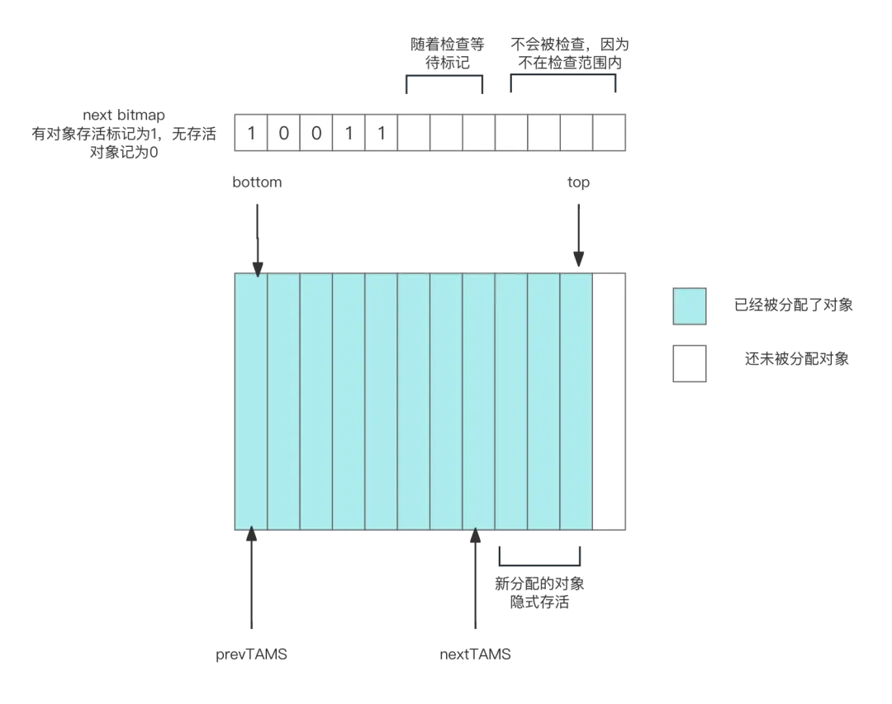

因为这一步是和mutator(用户线程)并发运行的，所以从根节点扫描的时候其实是扫描的一个快照snapshot，快照位置就是prevTAMS到nextTAMS（注意快照位置是不变的，但是prevTAMS到nextTAMS之间的对象在扫描过程中会改变）。

当region中分配新对象时，新对象都会分配在nextTAMS之后，这导致top指向的位置也往后移动，nextTAMS和top之间选哪个都是被认为隐式存活。

还有这期间也有可能应该被扫描的位置prevTAMS和nextTAMS之间的位置引用发生了变化，比如白色对象被黑色对象持有了，这就是三色标记算法的缺陷，需要更改白色对象的状态。这里会将引用被更改的对象放入satb_mark_queue。satb_mark_queue是一个队列，里面记录所有被改变引用关系的白色对象。这里指的satb_mark_queue指的全局的queue。除了全局的queue，每个线程也有自己的satb mark queue，全局的queue的引用是由所有其他线程的satb mark queue合并得来的，线程的satb mark queu满了会被转移到全局satb mark queue。且并发标记阶段会定期检查全局satb mark queue的容量，超过某个容量就concurrent marker线程就会将全局satb mark que和线程satb mark que的对象都取出来全部标记上，当然也会将这些对象的子field全部压栈（marking stack）等待接下来被标记到，这个处理类似于全局dirty card quene。这里注意。

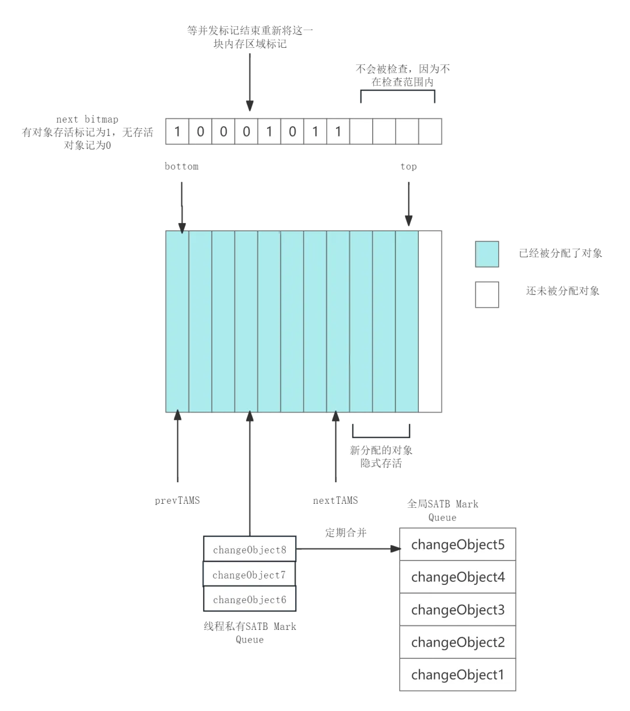

随着并发标记结束nextBitMap里也标记了哪些对象是可以回收的，但注意，不一定每个线程里satb mark queue都被转移到了全局的satb mark queue，因为合并这个过程也是并发的。所以需要下一步

4. 最终标记（remark）

标记那些并发标记阶段发生变化的对象，就是将线程satb mark queue中引用发生更改的对象找出来，放入satb mark queue。这个阶段为了保证标记正确必须STW。

5. 清点垃圾（cleanup）

对各个region的回收价值和成本进行排序，根据用户期待的GC停顿时间指定回收计划，选中部分old region,和全部的young region，这些被选中的分区称为Collection Set（Cset），还会把没有任何对象的region加入到可用来分配对象的region集合中。注意这一步不是清除，是清点出哪些region值得回首，不会复制任何对象。清点执行完，一个全局并发标记周期基本就执行完了。这时还会将nextTAMS指针赋值给prevTAMS，且nextBitMap赋值给prevBitMap。这里是不是很奇怪为什么要记录本轮标记的结果到prevBitMap，难道下次再来检查本region时还可以再复用这个标记结果吗。

我们知道G1是可以根据内存的变化自己调整内存中E区，O区的容量的，如果其中某些分区容量增长比较快，说明这个分区的内存访问更频繁，在未来也可能更快地达到region的容量限制，那么下次复制转移时就会优先将这块region中的对象转移到更大的region中去。

标记结束剩下的就是转移evacuation，拷贝存活对象。就是将活着的对象拷贝到空的region,再回收掉部分region。这一步是采用多线程复制清除，整个过程会STW。这也是G1的优势之一，只要还有一块空闲的region，就可以完成垃圾回收。而不用像CMS那样必须预留太多的内存。

### G1点评
从G1的设计上来看，它使用了大量的额外结构来存储引用关系，并以此来减少垃圾回收中标记的耗时。但是这种额外的结构带来的内存浪费也是存在的，极端情况甚至可以额外占用20%的内存。而基于region的内存划分规则则让内存分配更加复杂，但是这也有好处。就是内存的回收后产生的碎片更少，也就更少触发full gc。
根据经验，在大部分的大型内存(6G以上)服务器上，无论是吞吐量还是STW时间，G1的性能都是要优于CMS。

## ZGC

了解完G1之后，让我们再来看看大名鼎鼎的ZGC，也是目前号称"全程并发，能将停顿时间控制在10ms"内的低延迟垃圾回收器。ZGC全程Z Garbage Collector，这里面的Z不是什么缩写。ZGC在JDK11开始实验性的开放功能，在JDK17开始实装。在讲解ZGC的垃圾回收流程以前，让我们先介绍一下ZGC里面的技术设计，这有助于我们理解ZGC的工作过程。

### Page内存布局
zgc也是将堆内存划分为一系列的内存分区，称为page(深入理解JVM原书上管这种分区叫做region，但是官方文档还是叫做的page，我们这里引用官方文档的称呼以免和G1搞混)，这种管理方式和G1 GC很相似，但是ZGC的page不具备分代，准确的说应该是ZGC目前不具备分代的特点（目前JDK17版本下的ZGC还是没有分代的）。原因是如果将ZGC设计为支持分代的垃圾回收，设计太复杂，所以先将ZGC设计为无分代的GC模式，后续再迭代。ZGC的page有3种类型。

- 小型page(small page)

容量2M，存放小于256k的对象

- 中型page(medium page)

容量32M，存放大于等于256k，但是小于4M的page

- 大型page(large page)

容量不固定，但是必须是2M的整数倍。存放4M以上的对象，且只能存放一个对象。

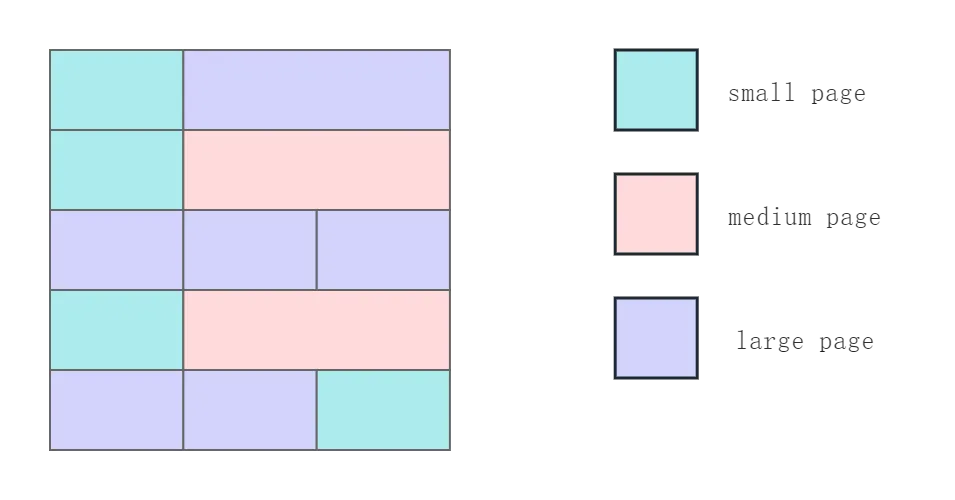

### 内存回收算法
ZGC的回收算法也遵循先找到垃圾，然后回收掉垃圾的步骤，其中最复杂的过程也是找到垃圾这个过程。要理解ZGC的并发回收过程先了解3个概念。

#### 染色指针
Colored Pointer，染色指针是一种让指针存储额外信息的技术。我们知道在64位操作系统里，一个内存的地址总共64位，但是受限于实际物理内存的大小，我们其实并不是真正的使用所有64位。这里如果小伙伴了解linux的虚拟内存管理会很好理解，我这里大概解释一下。我们平时所说操作系统的"物理内存地址"并不是真正的"物理内存地址"，也就是说，并不是物理上，内存颗粒对应的地址。而是操作系统为我们虚拟的一个"虚拟地址"，这个技术被称为虚拟内存管理。虚拟内存基本在所有的linux服务器上都有使用，除了少部分嵌入式设备，因为内存太小不需要使用这种技术。在虚拟内存的帮助下，我们可以做到两个虚拟内存地址对应一个真实的物理地址。虚拟内存的知识不是我们的重点，大家有个印象即可。

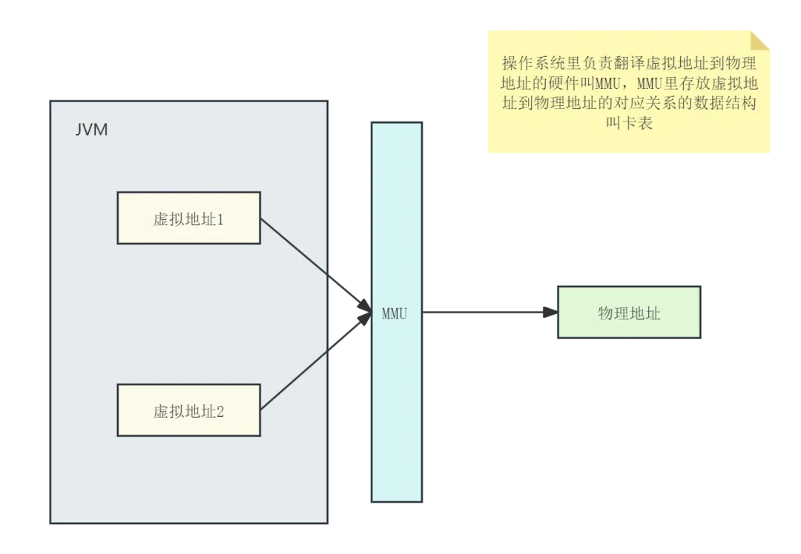

对于JVM来说，一个对象的地址只使用前42位，而第43-46位用来存储额外的信息，即GC对象处于ZGC那个阶段。只使用46位的客观原因是linux系统只支持46位的物理地址空间，即64T的内存，如果一定想要使用更大的内存，需要linux额外的设置。但是这个内存设置在主流的服务器上都够用了。

在引用地址的划分上，对象引用第43位表示marked0标记，44位marked1标记，45位remapped标记，46位finalizable标记。指针染色就是给对应的位置为1,当然这三个位同一个时间只能有一个位生效。这些标记分别表示对象处于GC的那个阶段里。在下面ZGC的详细过程里我们会介绍染色指针怎么帮助GC的。指针的引用地址在各个标记之间切换也被称为指针的自愈。

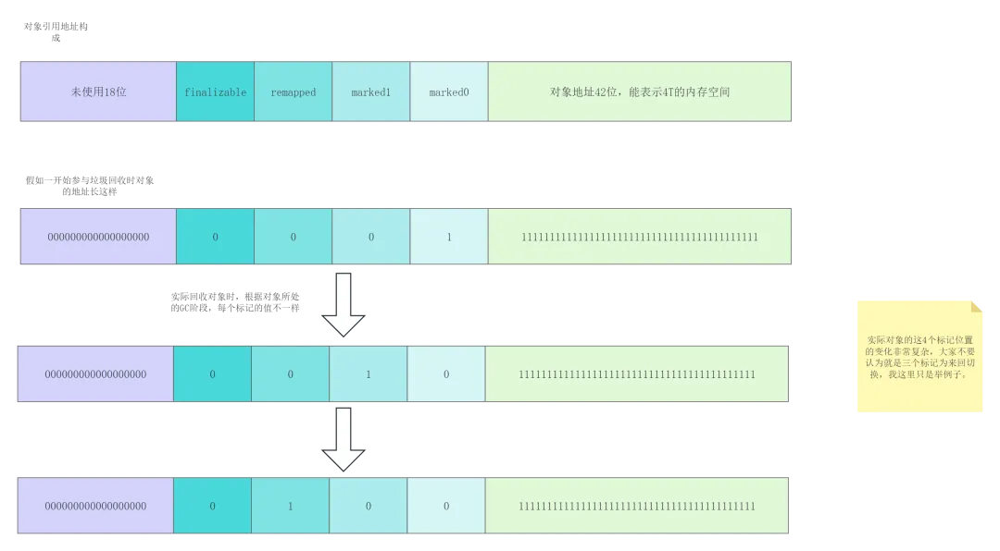

#### 读屏障
read barrier，就是JVM向应用代码插入一小段代码的技术，仅当线程从堆中读取对象引用时触发。效果上类似于写屏障，不过是在对象被读取时触发。
读屏障主要是用来改写每个地址的命名空间。这里还涉及到指针的自愈self healing。指针的自愈是指的当访问一个正处于重分配集中的对象时会被读屏障拦截，然后通过转发记录表forwarding table将访问转发到新复制的对象上，并且修正并更新该引用的值，使其直接指向新对象。也是因为这个能力，ZGC的STW时间大大缩短，其他的GC则需要修复所有指向本对象的指针后才能访问。这里的内容可能看不明白，没关系先放在这里后续看完ZGC的详细流程就会明白。

#### NUMA
numa不是ZGC在垃圾回收器上的创新，但是是ZGC的一大特点。大家了解就可以了。了解NUMA先了解UMA。

- uma(Uniform Memory Access Architeture)

统一内存访问，也是一般电脑的正常架构，即一块内存多个CPU访问，所以在多核CPU在访问一块内存时会出现竞争。操作系统为了为了锁住某一块内存会限制总线上对某个内存的访问，当CPU变多时总线就会变成瓶颈。

- numa(non Uniform Memory Access Architeture)

非统一内存访问，每块CPU都有自己的一块对应内存，一般是距离CPU比较近的，CPU会优先访问这块内存。因为CPU之间访问各自的内存这样就减少了竞争，效率更高。numa技术允许将多台机器组成一个服务供外部使用，这种技术在大型系统上比较流行，也是一种高性能解决方案，而且堆空间也可以由多台机器组成。ZGC对numa的适配就是ZGC能够自己感知numa架构。

### ZGC流程
接下来我们详细学习ZGC的流程，这里引入一个概念，good_mask。good_mask是记录JVM垃圾回收阶段的标志，随着GC进行不断切换，并且让JVM根据good_mask和对象的标记位的关系识别对象是不是本轮GC里产生的，good_mask可以说是记录当前JVM视图空间的变量。ZGC流程如下。

1. 初始标记(Init Mark)
初始标记，这一步和G1类似，也是记录下所有从GC Roots可达的对象。除此之外，还切换了good_mask的值，good_mask初始化出来是remapped，经过这次切换，就变为了marked1(这里很多人认为第一次是切换到0，其实不是的)。需要注意的是，对象的指针，因为还没有参加过GC，所以对象的标志位是出于Remapped。经过这一步，所有GC Roots可达的对象就被标记为了marked1。

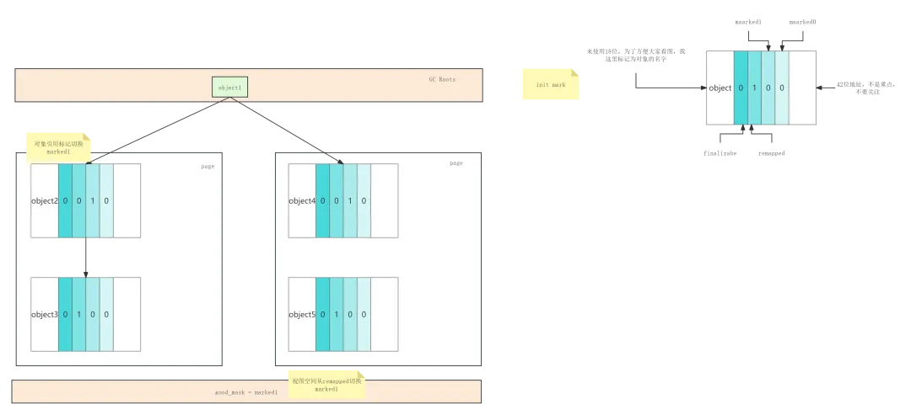

2. 并发标记(Concurrent Mark)

第一执行标记时，视图为marked1，GC线程从GCRoots出发，如果对象被GC线程访问，那么对象的地址视图会被Remapped切换到marked1，在标记结束时，如果对象的地址空间是marked1，那么说明对象是活跃的，如果是Remapped，那么说明对象是不活跃的。同时还会记录下每个内页中存活的对象的字节数大小，以便后续做页面迁移。这个阶段新分配的对象的染色指针会被置为marked1。

这个阶段还有一件事，就是修复上一次GC时被标记的指针，这也是为什么染色指针需要两个命名空间的原因。如果命名空间只有一个，那么本次标记时就区分不出来一个已经被标记过的指针是本次标记还是上次标记的。

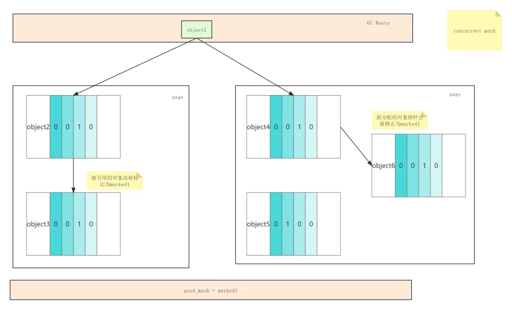

3. 重新标记(Remark)

这个阶段是处理一些并发标记阶段未处理完的任务(少量STW，控制在1ms内)如果没处理完还会再次并发标记，这里其实主要是解决三色标计算法中的漏标的问题,即白色对象被黑色对象持有的问题。并发标记阶段发生引用更改的对象会被记录下来(触发读屏障就会记录)，在这个阶段标记引用被更改的对象。这里我就不画图了，大家理解意思就行。

4. 并发预备重分配(Concurrent Prepare for Relocate)

这一步主要是为了之后的迁移做准备，这一步主要是处理软引用，弱引用，虚引用对象，以及重置page的Forwarding table，收集待回收的page信息到Relocation Set

Forwarding table是记录对象被迁移后的新旧引用的映射表。Relocation Set是存放记录需要回收的存活页集合。这个阶段ZGC会扫描所有的page，将需要迁移的page信息存储到Relocation Set，这一点和G1很不一样，G1是只选择部分需要回收的Region。在记录page信息的同时还会初始化page的Forwarding table，记录下每个page里有哪些需要迁移的对象。这一步耗时很长，因为是全量扫描所有的page，但是因为是和用户线程并发运行的，所以并不会STW，而且对比G1，还省去了维护RSet和SATB的成本。

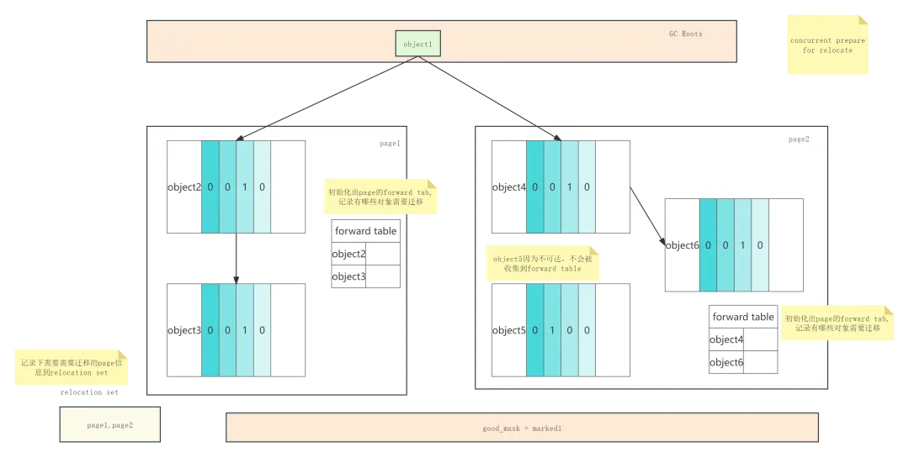

5. 初始迁移(Relocate Start)

这个阶段是为了找出所有GC Roots直接可达的对象，并且切换good_mask到remapped，这一步是STW的。这里注意一个问题，被GC Roots直接引用的对象可能需要迁移。如果需要，则会将该对象复制到新的page里，并且修正GC Roots指向本对象的指针，这个过程就是"指针的自愈"。当然这不是重点重点是切换good_mask。

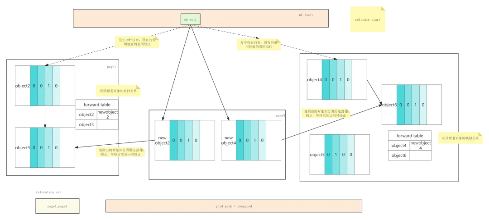

6. 并发迁移(Concurrent Relocate)

这个阶段需要遍历所有的page，并且根据page的forward table将存活的对象复制到其他page，然后再forward table里记录对象的新老引用地址的对应关系。page中的对象被迁移完毕后，page就会被回收，注意这里并不会回收掉forward table，否则新老对象的映射关系就丢失了。

这个阶段如果正好用户线程访问了被迁移后的对象，那么也会根据forward table修正这个对象被持有的引用，这也是"指针的自愈"。

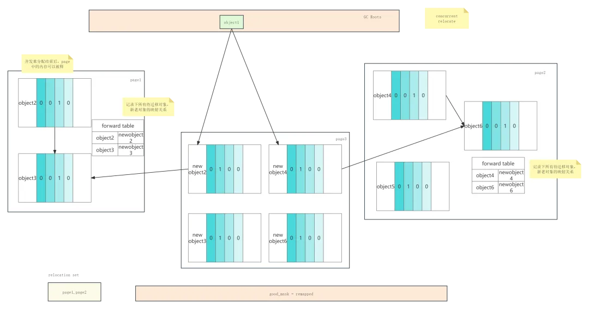

7. 并发重映射(Concurrent Remap)

这个阶段是为了修正所有的被迁移后的对象的引用。严格来说并发重映射并不属于本轮GC阶段要采取的操作。因为在第6步执行后，我们就得到了所有的需要重新映射的对象被迁移前后地址映射关系，有了这个关系，在以后的访问时刻，都可以根据这个映射关系重新修正对象的引用，即"指针自愈"。如果这里直接了当的再重新根据GC Roots遍历所有对象，当然可以完成所有对象的"指针自愈"，但是实际是额外的产生了一次遍历所有对象的操作。所以ZGC采取的办法是将这个阶段推迟到下轮ZGC的并发标记去完成，这样就共用了遍历所有对象的过程。而在下次ZGC开始之前，任何的线程访问被迁移后的对象的引用，则可以触发读屏障，并根据forward table自己识别出对象被迁移后的地址，自行完成"指针自愈"。

### ZGC点评
以我的能力来点评ZGC的设计似乎有点不妥，但是我还是想结合自己的理解，评价一下ZGC的的优缺点。ZGC的优势很明显，几乎全程并发的回收过程带来了无与伦比的低暂停时间，这也是ZGC的设计思路。低暂停时间加上JAVA本身的支持高并发的特点，假以时日ZGC将来一定是能在服务器领域的展现它大杀器级别的威力。但是为了达到这个设计目标，ZGC其实也牺牲了一些东西，比如吞吐量。我知道在很多地方，比如《深入理解JVM》这本书上，都把ZGC描述成全方位碾压G1的姿态。但是并不是的，至少在JDK21之前的不分代的ZGC不是的，具体的测试，大家可以看一下一篇Oracle的文章。链接我贴在下面。

https://cr.openjdk.org/~pliden/slides/ZGC-OracleDevLive-2020.pdf

当然这些缺点随着ZGC的成熟，以及JDK21在ZGC里加入分代的特性，都会一点点的好转。总而言之ZGC还是设计非常优秀的一款垃圾回收器。大家要好好学，尤其是现在ZGC还不是特别流行时，面试时多吹一吹，说不定能唬住一般的面试官。

## END

JVM垃圾回收器的知识实在太多了，写起来非常费劲，关于GC日志相关的知识我就放到后面再讲了，后续应该还有一点点JVM垃圾回收器的收尾知识，有机会会分享给大家。
