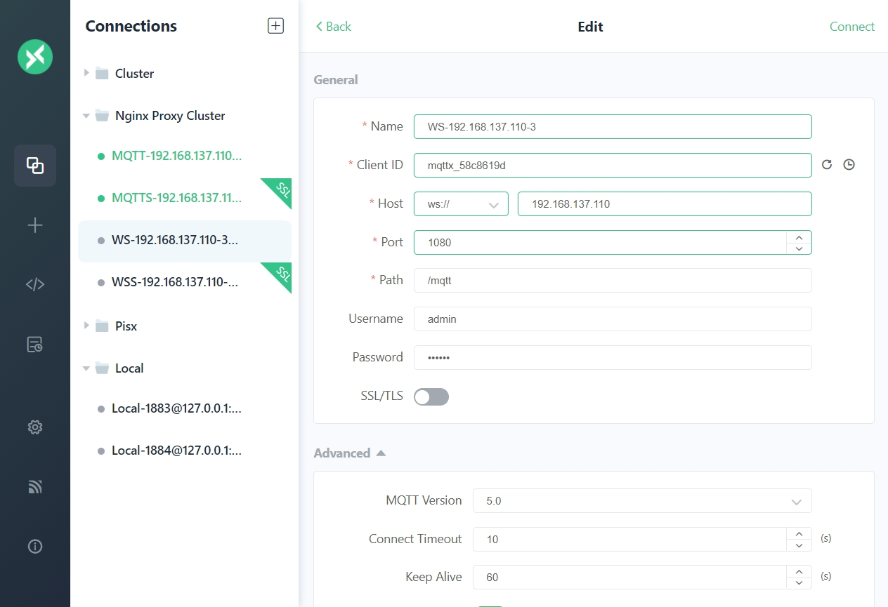

## 一、相关链接
- [CentOS官网](https://www.centos.org/)
- [CentOS下载-阿里云镜像站](https://mirrors.aliyun.com/centos/)
- [Linux依赖包查询 rpm find](https://rpmfind.net/)
- [Linux依赖包查询 pkgs](https://pkgs.org)
- [Linux依赖包查询 aliyun](https://mirrors.aliyun.com/centos/8.5.2111/BaseOS/x86_64/os/Packages/)
- 
- [EMQX 开源版下载](https://www.emqx.com/zh/downloads-and-install/broker?os=RHEL)
- [EMQX 使用指南](https://docs.emqx.com/zh/emqx/latest/)
- [EMQX 集群配置](https://docs.emqx.com/zh/emqx/latest/configuration/cluster.html)
- [EMQX 集群架构](https://docs.emqx.com/zh/emqx/latest/deploy/cluster/mria-introduction.html)
- [EMQX 配置手册](https://docs.emqx.com/zh/emqx/v5.8.5/hocon/)
- 
- [MQTTX 官网](https://mqttx.app/zh/features)
- [Nginx 官网](https://nginx.org/en/download.html)
- [HAProxy官网](https://www.haproxy.org/)

## 二、环境介绍
| 名称       | 版本            | 备注                                                                                            |
| ---------- | --------------- | ----------------------------------------------------------------------------------------------- |
| 操作系统   | CentOS 8.5.2111 | [阿里云镜像站 CentOS 8.5](https://mirrors.aliyun.com/centos/8.5.2111/isos/x86_64/)              |
| CentOS依赖 | -               | [阿里云镜像站 BaseOS Packages](https://mirrors.aliyun.com/centos/8/BaseOS/x86_64/os/Packages/)  |
| EMQX安装包 | EMQX-v5.8.5     | [RHEL 8(CentOS 8) amd64 / tar.gz](https://www.emqx.com/zh/downloads-and-install/broker?os=RHEL) |
| 集群网关   | Nginx-1.26.3    | [nginx-1.26.3](https://nginx.org/en/download.html)                                              |
| 集群网关   | HAproxy-3.1.5   | [haproxy-3.1.5](https://www.haproxy.org/download/3.1/src)                                       |

## 三、准备工作

由于生产服务器无法连接外网，可以先在本地搭建一套与生产版本一致的虚拟机，所有需要离线安装的软件包都预先在虚拟机中进行安装测试，保证兼容性及依赖包的完整性，避免到生产服务器出现不兼容或缺少依赖的请况。

### 1. 系统安装

系统安装与CentOS7之前有较大区别，可以参考[这篇文章](https://blog.csdn.net/wusam/article/details/142619996)
重点是在`安装信息摘要`页面，按照以下顺序设置

1. Root用户密码
2. 网络和主机名 此处的MAC地址需要和虚拟机`设置`-`网络`页面的MAC地址一致
3. 安装目的地
4. 安装源       `http://mirrors.aliyun.com/centos/8/BaseOS/x86_64/os/`
5. 软件选择     最小安装(yum ssh curl ping ip)


如果要设置固定IP，可以修改网络配置文件，手动设置IP、MAC地址、网关、子网掩码、DNS等信息

```shell
# 查看网络配置
cat /etc/sysconfig/network-scripts/ifcfg-enp0s3

# 修改网络配置
vim /etc/sysconfig/network-scripts/ifcfg-enp0s3
BOOTPROTO=static
IPADDR=192.168.137.101
# MACADDR=08:00:27:D7:88:87
HWADDR=08:00:27:D7:88:87
GATEWAY=192.168.137.1
NETMASK=255.255.255.0
DNS1=114.114.114.114

# 重启网络服务
systemctl restart NetworkManager

# 测试与宿主机 公网的网络互通
ping -c4 192.168.137.1
ping -c4 jd.com
```

### 2. 修改yum源

```shell
Errors during downloading metadata for repository 'appstream':
  - Curl error (6): Couldn't resolve host name for http://mirrorlist.centos.org/?release=8&arch=x86_64&repo=AppStream&infra=stock [Could not resolve host: mirrorlist.centos.org]
错误：为仓库 'appstream' 下载元数据失败 : Cannot prepare internal mirrorlist: Curl error (6): Couldn't resolve host name for http://mirrorlist.centos.org/?release=8&arch=x86_64&repo=AppStream&infra=stock [Could not resolve host: mirrorlist.centos.org]
```

由于 CentOS 团队已于 2021 年 12 月 31 日对 CentOS Linux 8 停止更新和维护，并从官方镜像中移除 CentOS 8 的所有包，因此导致在使用 yum 源安装或更新会报上述错误，解决方案可参考[这篇文章](https://blog.csdn.net/huchaoyang123/article/details/144608111)，下面直接用阿里云软件源替换

1. 备份软件源
```shell
# 进入仓库源文件目录下
cd /etc/yum.repos.d/

# 备份
mv /etc/yum.repos.d/CentOS-Linux-AppStream.repo             /etc/yum.repos.d/CentOS-Linux-AppStream.repo.bakup
mv /etc/yum.repos.d/CentOS-Linux-BaseOS.repo                /etc/yum.repos.d/CentOS-Linux-BaseOS.repo.bakup
mv /etc/yum.repos.d/CentOS-Linux-ContinuousRelease.repo     /etc/yum.repos.d/CentOS-Linux-ContinuousRelease.repo.bakup
mv /etc/yum.repos.d/CentOS-Linux-Debuginfo.repo             /etc/yum.repos.d/CentOS-Linux-Debuginfo.repo.bakup
mv /etc/yum.repos.d/CentOS-Linux-Devel.repo                 /etc/yum.repos.d/CentOS-Linux-Devel.repo.bakup
mv /etc/yum.repos.d/CentOS-Linux-Extras.repo                /etc/yum.repos.d/CentOS-Linux-Extras.repo.bakup
mv /etc/yum.repos.d/CentOS-Linux-FastTrack.repo             /etc/yum.repos.d/CentOS-Linux-FastTrack.repo.bakup
mv /etc/yum.repos.d/CentOS-Linux-HighAvailability.repo      /etc/yum.repos.d/CentOS-Linux-HighAvailability.repo.bakup
mv /etc/yum.repos.d/CentOS-Linux-Media.repo                 /etc/yum.repos.d/CentOS-Linux-Media.repo.bakup
mv /etc/yum.repos.d/CentOS-Linux-Plus.repo                  /etc/yum.repos.d/CentOS-Linux-Plus.repo.bakup
mv /etc/yum.repos.d/CentOS-Linux-PowerTools.repo            /etc/yum.repos.d/CentOS-Linux-PowerTools.repo.bakup
mv /etc/yum.repos.d/CentOS-Linux-Sources.repo               /etc/yum.repos.d/CentOS-Linux-Sources.repo.bakup

```

2. 使用阿里云软件源

```shell
# 如果没有wget，可以用curl下载 
# wget http://mirrors.aliyun.com/repo/Centos-8.repo -O /etc/yum.repos.d/CentOS-Linux-BaseOS.repo 
curl http://mirrors.aliyun.com/repo/Centos-8.repo -o /etc/yum.repos.d/CentOS-Linux-BaseOS.repo 

```

4. 更新软件源

```shell
# 清空原有缓存并重新生成
yum clean all && yum makecache

# 更新软件包（可选）
yum update -y
```

### 3. 查找依赖包
由于离线安装时无法在线安装依赖包，故需要提前准备好相关的依赖包，如何查询并安装依赖包可以参考[这篇文章](https://www.cnblogs.com/zw-loser/p/17251908.html)

1. 安装依赖

```shell
# 如果无法在线安装，可以在阿里云镜像站找到 https://mirrors.aliyun.com/centos/8.5.2111/BaseOS/x86_64/os/Packages/
yum -y install yum-utils

# 测试下载依赖
mkdir -p /root/lib/{tar,unzip,wget,vim,net-tools}

yumdownloader --resolve --destdir=/root/lib/tar tar
yumdownloader --resolve --destdir=/root/lib/unzip unzip
yumdownloader --resolve --destdir=/root/lib/wget wget
yumdownloader --resolve --destdir=/root/lib/vim vim
yumdownloader --resolve --destdir=/root/lib/net-tools net-tools

```

2. 查看提供某个命令/value的rpm包
```shell
yum provides unzip

```

3. 查看 rpm 包所需的全部依赖

```shell
yum deplist unzip-6.0-45.el8_4

```

## 四、测试机安装EMQX

### 1. 下载依赖包
```shell

yumdownloader --resolve --destdir=/root/lib/tar tar
yumdownloader --resolve --destdir=/root/lib/unzip unzip
yumdownloader --resolve --destdir=/root/lib/wget wget
yumdownloader --resolve --destdir=/root/lib/vim vim
yumdownloader --resolve --destdir=/root/lib/net-tools net-tools
yumdownloader --resolve --destdir=/root/lib/libatomic libatomic
yumdownloader --resolve --destdir=/root/lib/chrony chrony

# 如果openssl版本低于1.1，需要进行升级 openssl version
yumdownloader --resolve --destdir=/root/lib/epel-release epel-release
yumdownloader --resolve --destdir=/root/lib/openssl11 openssl11 
yumdownloader --resolve --destdir=/root/lib/openssl11-devel openssl11-devel

# 打包为压缩包，方便下载到本地
tar -zcvf lib.tar.gz ./lib/*

# 将依赖同步到其他服务器
scp -r /root/lib/* root@192.168.137.102:/root/lib/

# 上传到服务器之后解压
tar -zxvf lib.tar.gz -C ./

```

### 2. rpm 安装

```shell
# 下载 wget https://www.emqx.com/zh/downloads/broker/5.8.5/emqx-5.8.5-el8-amd64.rpm
curl https://packages.emqx.net/emqx-ce/v5.8.5/emqx-5.8.5-el8-amd64.rpm -o emqx-5.8.5-el8-amd64.rpm

# 安装
sudo yum install -y emqx-5.8.5-el8-amd64.rpm

# 启动 停止命令
sudo systemctl start emqx
sudo systemctl status emqx
sudo systemctl stop emqx
sudo systemctl restart emqx

# 查看配置文件
cat /etc/emqx/emqx.conf

# 查询安装的包
sudo rpm -qa | grep emqx

# 卸载
sudo rpm -e emqx-5.8.5-1.el8.x86_64

```

安装完成后相关文件可以从下面位置找到

- `/usr/lib/emqx` 安装文件路径
- `/usr/bin/emqx` 执行文件路径（软链接）
- `/etc/emqx/`    配置文件路径
- `/var/log/emqx` 日志文件路径

### 3. tar.gz 安装

```shell
# 下载 wget https://www.emqx.com/zh/downloads/broker/5.8.5/emqx-5.8.5-el8-amd64.tar.gz
curl https://packages.emqx.net/emqx-ce/v5.8.5/emqx-5.8.5-el8-amd64.tar.gz -o emqx-5.8.5-el8-amd64.tar.gz

# 安装 tar
rpm -ivh ./lib/tar-1.30-5.el8.x86_64.rpm

# 安装
mkdir -p /opt/emqx && tar -zxvf emqx-5.8.5-el8-amd64.tar.gz -C /opt/emqx

# 启动 停止命令
cd /opt/emqx
./bin/emqx start
./bin/emqx stop
./bin/emqx console

```

安装完成后相关文件可以从下面位置找到

- `/opt/emqx`       安装文件路径
- `/opt/emqx/bin`   执行文件路径
- `/opt/emqx/etc/`  配置文件路径
- `/opt/emqx/log`   日志文件路径


### 4. 将EMQX注册为系统服务
```shell
cat /etc/systemd/system/emqx.service

cat > /etc/systemd/system/emqx.service << 'EOF'
[Unit]
Description=EMQX Broker
After=network.target

[Service]
Type=forking
ExecStart=/opt/emqx/bin/emqx start
ExecStop=/opt/emqx/bin/emqx stop
ExecReload=/opt/emqx/bin/emqx restart
Restart=on-failure
RestartSec=5s

[Install]
WantedBy=multi-user.target

EOF

# 设置开机自启
systemctl enable emqx

# 启停命令
service emqx start
service emqx stop
service emqx restart

```

## 五、集群安装配置

假设现在有三台服务器，其主机名和ip分别如下

| 主机名  | IP              |
| ------- | --------------- |
| emqx-01 | 192.168.137.101 |
| emqx-02 | 192.168.137.102 |
| emqx-03 | 192.168.137.103 |

### 1. 测试节点网络
- [网络与硬件配置](https://docs.emqx.com/zh/emqx/latest/deploy/cluster/mria-introduction.html#网络与硬件配置)

修改hosts文件，确保通过域名（主机名）可以相互访问

```shell
cat >> /etc/hosts << EOF

192.168.137.101        emqx-01
192.168.137.102        emqx-02
192.168.137.103        emqx-03

EOF

```

检查网络互通及延迟情况

```shell
ping -c4 emqx-01

ping -c4 emqx-02

ping -c4 emqx-03

```

**注意** 官方文档要求各节点之间的延迟不高于10ms，过高的延迟可能造成服务不可用

### 2. 开放服务器端口
- [配置网络环境](https://docs.emqx.com/zh/emqx/latest/deploy/cluster/create-cluster.html#配置网络环境)
- [集群内通信端口](https://docs.emqx.com/zh/emqx/latest/deploy/cluster/security.html#集群内通信端口)

为保证集群节点之间的通讯，需要开放以下端口

| 端口  | 描述                              |
| ----- | --------------------------------- |
| 1883  | MQTT监听端口                      |
| 8083  | WebSocket监听端口                 |
| 18083 | Web控制台端口                     |
| 4370  | Erlang 分布式传输端口             |
| 5370  | 集群 RPC 端口，适用于物理机环境   |
| 5369  | 集群 RPC 端口，适用于 Docker 环境 |

```shell
firewall-cmd --zone=public --add-port=1883/tcp --permanent
firewall-cmd --zone=public --add-port=8083/tcp --permanent
firewall-cmd --zone=public --add-port=18083/tcp --permanent

firewall-cmd --zone=public --add-port=4370/tcp --permanent
firewall-cmd --zone=public --add-port=5370/tcp --permanent
firewall-cmd --zone=public --add-port=5369/tcp --permanent

firewall-cmd --reload

firewall-cmd --list-port

```

### 3. 时间同步配置
- [网络与硬件配置](https://docs.emqx.com/zh/emqx/latest/deploy/cluster/mria-introduction.html#网络)
- [CentOS 8时间同步配置详解](https://developer.baidu.com/article/details/3291671)
- [NTP官方网站](https://support.ntp.org/)
- [国内常见时间服务器](https://blog.csdn.net/jiangzhehao520/article/details/144028523)
- [Centos7同步时间(阿里云NTP服务为例)](https://developer.aliyun.com/article/1547193)

由于EMQX集群对服务器的网络延迟有严格要求，所以必须保证各节点之间的时间同步正常且延迟低于10ms，如果服务器上没有时间同步配置，需要安装配置chrony，可以参考[这篇文章](https://developer.baidu.com/article/details/3291671)

1. 安装chrony服务
```shell
# 检查是否有 ntpd 或 chronyd 服务
systemctl status ntpd
systemctl status chronyd

# 安装chrony
rpm -ivh /root/lib/chrony/timedatex-0.5-3.el8.x86_64.rpm
rpm -ivh /root/lib/chrony/chrony-4.1-1.el8.x86_64.rpm

# 配置文件
cat /etc/chrony.conf

```

2. 启动并设置开机自启

```shell
# 启动
systemctl start chronyd
systemctl status chronyd

# 开机自启
systemctl enable chronyd

```

3. 配置chrony

```shell
# 修改配置文件
vim /etc/chrony.conf

# 允许所有客户端同步时间
allow all

# 上游NTP服务
server 210.72.145.44   iburst
server cn.pool.ntp.org iburst
server cn.ntp.org.cn   iburst

# 阿里
pool   ntp.aliyun.com  iburst
server ntp1.aliyun.com iburst
server ntp2.aliyun.com iburst
server ntp3.aliyun.com iburst
server ntp4.aliyun.com iburst
server ntp5.aliyun.com iburst
server ntp6.aliyun.com iburst
server ntp7.aliyun.com iburst

```


4. 状态检查

```shell
# 检查时区
timedatectl
# 修改时区
timedatectl set-timezone Asia/Shanghai

# 查看时间源
chronyc sources -v

# 查看当前时间状态
chronyc tracking

# 手动同步时间
chronyc -a makestep

```


### 4. 检测时钟回拨

时钟回拨会导致Erlang虚拟机退出，在正式部署前可以先执行脚本检测以下，避免正式使用时出现这个问题

实测 `5.8.5` 版本在时钟回拨会退出程序，可以将EMQX版本退回到 `5.0.26`，这个版本不会因为时钟回拨而退出

1. 监测时钟回拨脚本
```shell
# 写入脚本
cat > timestamp.sh << 'EOF'
#!/bin/bash

# 基础配置
LOG_DIR="$(dirname "$0")/logs"        # 日志存储目录
RETENTION_DAYS=7                      # 日志保留天数
MONITOR_INTERVAL=600                  # 性能监控间隔(秒)
NTP_CHECK_INTERVAL=7200               # NTP检查间隔(秒)

# 初始化目录
mkdir -p "$LOG_DIR"

# 动态日志路径管理
current_date=$(date +"%Y-%m-%d")
time_log="${LOG_DIR}/time_info_${current_date}.log"
error_log="${LOG_DIR}/time_error_${current_date}.log"
perf_log="${LOG_DIR}/performance_${current_date}.log"

# 初始化跟踪变量
last_timestamp=0
last_ntp_check=$(date +%s)
last_perf_check=$(date +%s)

# 函数：日志切割检查
check_log_rotation() {
    local today=$(date +"%Y-%m-%d")
    if [ "$today" != "$current_date" ]; then
        current_date="$today"
        time_log="${LOG_DIR}/time_info_${current_date}.log"
        error_log="${LOG_DIR}/time_error_${current_date}.log"
        perf_log="${LOG_DIR}/performance_${current_date}.log"
        echo "[INFO] Rotated log files to ${current_date}" >> "$time_log"
    fi
}

# 函数：性能监控
monitor_performance() {
    local timestamp=$(date +"%Y-%m-%d %H:%M:%S")
    local process_stats=$(ps -p $$ -o %cpu,%mem --no-headers | tr -d ' ')
    local loadavg=$(awk '{print $1,$2,$3}' /proc/loadavg)
    local mem_info=$(free -m | awk '/Mem/{printf "%.2f%%", $3/$2*100}')
    
    echo "[PERF] $timestamp | CPU: ${process_stats%%,*}% | MEM: ${process_stats##*,}% | Load: $loadavg | MemUsage: $mem_info" >> "$perf_log"
}

# 函数：清理旧日志
cleanup_old_logs() {
    find "$LOG_DIR" -maxdepth 1 -type f \( -name "*.log" \) \
        -mtime +$RETENTION_DAYS \
        -exec rm -fv {} \; >> "$time_log" 2>&1
}

# 函数：NTP状态检测
check_ntp_status() {
    # 优先检查ntpstat命令
    if command -v ntpstat >/dev/null 2>&1; then
        if ! ntpstat >/dev/null 2>&1; then
            echo "[WARNING] NTP sync abnormal (ntpstat check failed)" >> "$ERROR_LOG_FILE"
        fi
    # 次选检查chrony服务
    elif systemctl is-active chronyd >/dev/null 2>&1; then
        if ! chronyc tracking >/dev/null 2>&1; then
            echo "[WARNING] Chrony sync abnormal (chronyc check failed)" >> "$ERROR_LOG_FILE"
        fi
    # 最后检查ntpd服务
    elif systemctl is-active ntpd >/dev/null 2>&1; then
        ntpq -pn | grep -q '^+'
        if [ $? -ne 0 ]; then
            echo "[WARNING] NTPD sync abnormal (no reachable servers)" >> "$ERROR_LOG_FILE"
        fi
    else
        echo "[WARNING] No NTP service found (chronyd/ntpd not running)" >> "$ERROR_LOG_FILE"
    fi
}

# 主监控循环
while true; do
    now=$(date +%s)
    
    # ========== 日志切割检查 ==========
    check_log_rotation
    
    # ========== 时间记录与回拨检测 ==========
    current_time=$(date +"%Y-%m-%d %H:%M:%S.%3N")
    now_seconds=$(date +%s)
    now_millis=$(date +%3N | sed 's/^0*//')  # 移除前导零
    
    # 关键修复：显式声明十进制数值
    current_timestamp=$(( now_seconds * 1000 + 10#$now_millis ))  
    
    echo "[TIME] $current_time" >> "$time_log"
    
    # 时钟回拨检测
    if [ $last_timestamp -gt 0 ] && [ $current_timestamp -lt $last_timestamp ]; then
        error_msg="[ERROR] Clock rollback - ${last_timestamp} - ${current_timestamp} ms | Details: $current_time"
        echo "$error_msg" >> "$error_log"
    fi
    last_timestamp=$current_timestamp
    
    # ========== 定期任务调度 ==========
    # 性能监控（每10分钟）
    if [ $((now - last_perf_check)) -ge $MONITOR_INTERVAL ]; then
        monitor_performance
        last_perf_check=$now
    fi
    
    # NTP检查（每2小时）
    if [ $((now - last_ntp_check)) -ge $NTP_CHECK_INTERVAL ]; then
        check_ntp_status
        last_ntp_check=$now
    fi
    
    # 修复点：使用字符串比较代替数值比较
    if [ "$(date +"%H%M")" = "0005" ]; then
        cleanup_old_logs
        sleep 10
    fi
    
    sleep 0.9
done

EOF

```

2. 运行脚本，检查日志
```shell
# 运行脚本
chmod +x ./timestamp.sh
nohup ./timestamp.sh > /dev/null 2>&1 &

# 查看打印记录
tail -f ./logs/time_info_2025-03-13.log

tail -f ./logs/time_error_2025-03-13.log

tail -f ./logs/performance_2025-03-13.log

```

### 5. 试运行EMQX

1. 下载运行EMQX

```shell
# 下载安装包
# curl https://packages.emqx.net/emqx-ce/v5.0.26/emqx-5.0.26-el8-amd64.rpm -o emqx-5.0.26-el8-amd64.rpm
curl https://packages.emqx.net/emqx-ce/v5.0.26/emqx-5.0.26-el8-amd64.tar.gz -o emqx-5.0.26-el8-amd64.tar.gz

# 安装
mkdir -p /opt/emqx && tar -zxvf emqx-5.0.26-el8-amd64.tar.gz -C /opt/emqx

# 控制台启动验证
cd /opt/emqx
./bin/emqx console

# 如果报错缺少 libatomic.so.1，需要手动安装
scp /root/lib/libatomic/* root@192.168.137.102:/root/lib/libatomic/

rpm -ivh /root/lib/libatomic/libatomic-8.5.0-4.el8_5.x86_64.rpm

```


2. 查看EMQX状态
```shell
# 启动停止命令
./bin/emqx start
./bin/emqx stop

# 查看服务运行状态
ps -ef | grep emqx

# 查看集群状态
./emqx/bin/emqx ctl cluster status

```

3. 将EMQX注册为系统服务

```shell
cat /etc/systemd/system/emqx.service

cat > /etc/systemd/system/emqx.service << 'EOF'
[Unit]
Description=EMQX Broker
After=network.target

[Service]
Type=forking
ExecStart=/opt/emqx/bin/emqx start
ExecStop=/opt/emqx/bin/emqx stop
ExecReload=/opt/emqx/bin/emqx restart
Restart=on-failure
RestartSec=5s

[Install]
WantedBy=multi-user.target

EOF

# 设置开机自启
systemctl enable emqx

```

### 6. 集群配置
- [基于 static 节点列表自动集群](https://docs.emqx.com/zh/emqx/latest/deploy/cluster/create-cluster.html#基于-static-节点列表自动集群)
- [基于 DNS 自动集群](https://docs.emqx.com/zh/emqx/latest/deploy/cluster/create-cluster.html#基于-dns-自动集群)
- [配置手册-Cluster](https://docs.emqx.com/zh/emqx/v5.8.5/hocon/#V-cluster)
- [获取真实 IP 和客户端 TSL 证书信息](https://docs.emqx.com/zh/emqx/latest/deploy/cluster/lb.html#获取真实-ip-和客户端-tls-证书信息)
由于[开源版本只能部署core集群](https://docs.emqx.com/zh/emqx/latest/deploy/cluster/mria-introduction.html#部署架构)，所以三个节点 role 都定义为 core，
修改 `node.name` 为当前节点的ip，设置集群发现策略 `discovery_strategy` 为 `static` 以及 节点地址 `static.seeds`

```shell
# 备份配置文件
cp ./etc/emqx.conf ./etc/emqx.conf.bakup

# 修改配置文件
vim ./etc/emqx.conf

# 修改以下内容
node {
  name = "emqx@192.168.137.101"
}

cluster{
  autoheal = true
  discovery_strategy = static
  static {
    seeds = ["emqx@192.168.137.101", "emqx@192.168.137.102", "emqx@192.168.137.103"]
  }
}

listeners.tcp.default {
  bind = "0.0.0.0:1883"
  max_connections = 102400

  proxy_protocol = true
}

```

```shell
rm -rf etc/emqx.conf

cat >> etc/emqx.conf << 'EOF'
## NOTE:
## This config file overrides data/configs/cluster.hocon,
## and is merged with environment variables which start with 'EMQX_' prefix.
##
## Config changes made from EMQX dashboard UI, management HTTP API, or CLI
## are stored in data/configs/cluster.hocon.
## To avoid confusion, please do not store the same configs in both files.
##
## See https://docs.emqx.com/en/enterprise/v5.0/configuration/configuration.html
## Configuration full example can be found in emqx.conf.example

node {
  name = "emqx@192.168.137.101"
  cookie = "emqxsecretcookie"
  data_dir = "data"
}

cluster {
  name = emqxcl
  autoheal = true
  discovery_strategy = static
  static {
    seeds = ["emqx@192.168.137.101", "emqx@192.168.137.102", "emqx@192.168.137.103"]
  }
}

listeners.tcp.default {
  bind = "0.0.0.0:1883"
  max_connections = 102400

  proxy_protocol = true
}

dashboard {
    listeners {
        http.bind = 18083
        # 5.0.26 不能有以下配置
        # https.bind = 18084
        # https {
        #     ssl_options {
        #         certfile = "${EMQX_ETC_DIR}/certs/cert.pem"
        #         keyfile = "${EMQX_ETC_DIR}/certs/key.pem"
        #     }
        # }
    }
}

authorization {
  deny_action = ignore
  no_match = allow
  cache = { enable = true }
}

EOF

```


### 7. 启动EMQX服务
- [管理集群](https://docs.emqx.com/zh/emqx/latest/deploy/cluster/create-cluster.html#管理集群)

配置完成后启动服务

```shell
yum install -y emqx-5.8.5-el8-amd64.rpm

systemctl start emqx

systemctl status emqx

mv /etc/emqx/emqx.conf /etc/emqx/emqx.conf.bakup

mv ./emqx/etc/emqx.conf /etc/emqx/emqx.conf

cat /etc/emqx/emqx.conf

tail -f /var/log/emqx/emqx.log.1

systemctl restart emqx

```


访问 [Dashboard](http://192.168.137.101:18083)
- 账号密码 admin /public


## 六、验证集群发布与订阅
- [中间件系列——EMQX 的集群搭建](https://blog.csdn.net/ITLWJ/article/details/123999219)

1. 打开MQTTX客户端，连接到集群的各个节点


2. 每个节点订阅相同的Topic


3. 从一个节点发出测试消息，可以看到三个节点都收到了订阅消息


## 七、Nginx网关负载均衡
- [集群负载均衡](https://docs.emqx.com/zh/emqx/latest/deploy/cluster/lb.html#集群负载均衡)
- [Nginx 负载均衡方案介绍](https://www.nginx.com/solutions/load-balancing/)
- [Nginx 负载均衡EMQX集群](https://docs.emqx.com/zh/emqx/latest/deploy/cluster/lb-nginx.html)

负载均衡（Load Balancing）用于均衡多个网络组件的负载，从而优化资源的使用，避免由于组件过载造成故障。负载均衡虽然不是集群中的必备组件，但是能给集群带来一些非常有用的特性，例如当配置在 EMQX 集群中时，将能带来如下优势：

- 均衡 EMQX 的负载，避免出现单节点过载的情况；
- 简化客户端配置，客户端只需连接到负载均衡器上，无需关心集群内部伸缩变化；
- TLS/SSL 终结，减轻 EMQX 集群的负担；
- 提高安全性，有了负载均衡在集群前端，能够通过设置阻止不需要的流量，保护 EMQX 集群免受恶意攻击。

本节我们选择用 Nginx 来作为 EMQX 集群的网关，最终搭建的效果如下所示：


### 1. 环境准备

#### 1. 安装编译依赖库

```shell
# 安装nginx必备依赖库
yum install -y gcc glibc-devel pcre pcre-devel zlib zlib-devel openssl openssl-devel

# 下载依赖包
yumdownloader --resolve --destdir=/root/lib/nginx/make make
yumdownloader --resolve --destdir=/root/lib/nginx/gcc gcc
yumdownloader --resolve --destdir=/root/lib/nginx/glibc-devel glibc-devel
yumdownloader --resolve --destdir=/root/lib/nginx/pcre pcre
yumdownloader --resolve --destdir=/root/lib/nginx/pcre-devel pcre-devel
yumdownloader --resolve --destdir=/root/lib/nginx/zlib zlib
yumdownloader --resolve --destdir=/root/lib/nginx/zlib-devel zlib-devel
yumdownloader --resolve --destdir=/root/lib/nginx/openssl openssl
yumdownloader --resolve --destdir=/root/lib/nginx/openssl-devel openssl-devel


# 安装依赖
rpm -ivh /root/lib/nginx/make/*
rpm -ivh /root/lib/nginx/gcc/*
rpm -ivh /root/lib/nginx/glibc-devel/*
rpm -ivh /root/lib/nginx/pcre/*
rpm -ivh /root/lib/nginx/pcre-devel/*
rpm -ivh /root/lib/nginx/zlib/*
rpm -ivh /root/lib/nginx/zlib-devel/*
rpm -ivh /root/lib/nginx/openssl/*
rpm -ivh /root/lib/nginx/openssl-devel/*

```

#### 2. 开放代理所需端口

```shell
firewall-cmd --zone=public --add-port=80/tcp --permanent
firewall-cmd --zone=public --add-port=443/tcp --permanent

firewall-cmd --zone=public --add-port=1883/tcp --permanent
firewall-cmd --zone=public --add-port=8883/tcp --permanent

firewall-cmd --zone=public --add-port=1080/tcp --permanent
firewall-cmd --zone=public --add-port=1443/tcp --permanent

firewall-cmd --reload

firewall-cmd --list-port

```

| 端口 | 描述                            |
| ---- | ------------------------------- |
| 80   | Nginx HTTP端口                  |
| 443  | Nginx HTTPS端口                 |
| 1883 | 反向代理 MQTT端口               |
| 8883 | 反向代理 MQTT SSL端口           |
| 1080 | 反向代理 MQTT WebSocket端口     |
| 1443 | 反向代理 MQTT WebSocket SSL端口 |


### 2. 下载安装Nginx
- [Nginx官网下载](https://nginx.org/en/download.html)
- [Nginx手动编译、安装超超详解](https://blog.csdn.net/A_art_xiang/article/details/133012260)

#### 1. 下载

```shell
# 下载
curl https://nginx.org/download/nginx-1.26.3.tar.gz -o  nginx-1.26.3.tar.gz

# 解压
tar -zxvf nginx-1.26.3.tar.gz
cd nginx-1.26.3

```

#### 2. 编译配置

```shell
# 查看configure 支持的参数，其中包含指定某些路径、开启某些模块、编译中特殊参数
./configure --help | more

# 编译配置
./configure \
  --with-threads \
  --with-http_stub_status_module \
  --with-http_ssl_module \
  --with-http_realip_module \
  --with-stream \
  --with-stream_ssl_module \
  --prefix=/usr/local/nginx

# 输出各种文件的路径
Configuration summary
  + using threads
  + using system PCRE2 library
  + using system OpenSSL library
  + using system zlib library

  nginx path prefix: "/usr/local/nginx"
  nginx binary file: "/usr/local/nginx/sbin/nginx"
  nginx modules path: "/usr/local/nginx/modules"
  nginx configuration prefix: "/usr/local/nginx/conf"
  nginx configuration file: "/usr/local/nginx/conf/nginx.conf"
  nginx pid file: "/usr/local/nginx/logs/nginx.pid"
  nginx error log file: "/usr/local/nginx/logs/error.log"
  nginx http access log file: "/usr/local/nginx/logs/access.log"
  nginx http client request body temporary files: "client_body_temp"
  nginx http proxy temporary files: "proxy_temp"
  nginx http fastcgi temporary files: "fastcgi_temp"
  nginx http uwsgi temporary files: "uwsgi_temp"
  nginx http scgi temporary files: "scgi_temp"

```

- `--with-http_ssl_module` 参数用于添加 SSL 功能支持，
- `--with-stream` 与 `--with-stream_ssl_module` 参数用于添加 TCP 反向代理支持
- `--prefix=/nginx` 指定安装目录

#### 3. 安装
```shell
# 编译
make 

# 安装
make install 

# 创建 Nginx 用户和组
groupadd -r nginx
useradd -s /sbin/nologin -r -g nginx nginx
```

#### 4. 将Nginx注册为服务

```shell
cat > /etc/systemd/system/nginx.service << 'EOF'
[Unit]
Description=The Nginx HTTP and reverse proxy server
After=syslog.target network.target remote-fs.target nss-lookup.target

[Service]
Type=forking
PIDFile=/usr/local/nginx/logs/nginx.pid
ExecStartPre=/usr/local/nginx/sbin/nginx -t -c /usr/local/nginx/conf/nginx.conf
ExecStart=/usr/local/nginx/sbin/nginx -c /usr/local/nginx/conf/nginx.conf
ExecReload=/bin/kill -s HUP $MAINPID
ExecStop=/bin/kill -s QUIT $MAINPID
PrivateTmp=true

[Install]
WantedBy=multi-user.target

EOF

```

#### 5. 启动服务并设置开机自启

```shell
# 启动
service nginx start

# 停止
service nginx stop

# 状态
service nginx status

# 开机自启
systemctl enable nginx

```

#### 6. 前端页面访问

1. 浏览器打开网页 `http://192.168.137.110`


2. 在 `nginx.conf` 中加入监控配置
```conf
# NGINX 状态监控
location /stats {            
  stub_status on;            
  access_log off;            
}
```
浏览器打开网页 `http://192.168.137.110/stats`


### 3. 配置Nginx
- [配置 MQTT 粘性（Sticky）会话负载均衡](https://docs.emqx.com/zh/emqx/latest/deploy/cluster/lb-nginx.html#配置-mqtt-粘性-sticky-会话负载均衡)

#### 1. 创建配置文件夹，生成SSL证书
```shell
mkdir -p /usr/local/nginx/{conf.d,stream,certs}
cd /usr/local/nginx/certs

# 生成私钥，需要输入密码 123456
openssl genrsa -des3 -out emqx.pass.key 2048
# 删除私钥中的密码
openssl rsa -in emqx.pass.key -out emqx.key
# 生成CSR
openssl req -new -key emqx.key -out emqx.csr -subj "/C=CN/ST=Shanghai/L=Shanghai/O=PISX/OU=Diginn/CN=*.example.com"
# 生成证书
openssl x509 -req -days 3650 -in emqx.csr -signkey emqx.key -out emqx.pem

```

#### 2. 主配置文件 `nginx.conf`
```conf
#user  nobody;
worker_processes  1;

#error_log  logs/error.log;
#error_log  logs/error.log  notice;
#error_log  logs/error.log  info;

#pid        logs/nginx.pid;


events {
    worker_connections  1024;
}


http {
    include       mime.types;
    default_type  application/octet-stream;

    #log_format  main  '$remote_addr - $remote_user [$time_local] "$request" '
    #                  '$status $body_bytes_sent "$http_referer" '
    #                  '"$http_user_agent" "$http_x_forwarded_for"';

    #access_log  logs/access.log  main;

    sendfile        on;
    #tcp_nopush     on;

    #keepalive_timeout  0;
    keepalive_timeout  65;

    server {
        listen       80;
        server_name  localhost;

        #charset koi8-r;

        #access_log  logs/host.access.log  main;

        location / {
            root   html;
            index  index.html index.htm;
        }

        # NGINX 状态监控
        location /stats {            
          stub_status on;            
          access_log off;            
        }

        #error_page  404              /404.html;

        # redirect server error pages to the static page /50x.html
        #
        error_page   500 502 503 504  /50x.html;
        location = /50x.html {
            root   html;
        }
    }

    include /usr/local/nginx/conf.d/*.conf;
}

stream {

  log_format  proxy '$remote_addr - [$time_local] '
                 '$protocol $status $bytes_sent $bytes_received '
                 '$session_time - "$upstream_addr" '
                 '"$upstream_bytes_sent" "$upstream_bytes_received" "$upstream_connect_time"';

  access_log  logs/tcp_access.log proxy;
  error_log   logs/tcp_error.log;

  # 引入 stream 配置
  include     /usr/local/nginx/stream.d/*.conf;

}
```

#### 3. MQTT协议配置文件 `/usr/local/nginx/stream/mqtt.conf`
```conf
upstream emqx_servers {
  server 192.168.137.101:1883;
  server 192.168.137.102:1883;
  server 192.168.137.103:1883;
}

server {
  listen                1883;
  proxy_pass            emqx_servers;

  # 启用此项时，对应后端监听器也需要启用 proxy_protocol
  # proxy_protocol        on;
  proxy_connect_timeout 10s;   
  # 默认心跳时间为 10 分钟
  proxy_timeout         60s;
  proxy_buffer_size     3M;
  tcp_nodelay           on;       
}

server {
  listen 8883 ssl;

  ssl_session_cache     shared:TCPSSL:10m;
  ssl_session_timeout   10m;
  ssl_certificate       /usr/local/nginx/certs/emqx.pem;
  ssl_certificate_key   /usr/local/nginx/certs/emqx.key;
  ssl_verify_depth      2;
  ssl_protocols         TLSv1 TLSv1.1 TLSv1.2;
  ssl_ciphers           HIGH:!aNULL:!MD5;

  # 添加 CA 证书及开启验证客户端证书参数即可启用双向认证
  # ssl_client_certificate /usr/local/NGINX/certs/ca.pem;
  # ssl_verify_client on;
  # ssl_verify_depth 1;

  proxy_pass            emqx_servers;

  # 启用此项时，对应后端监听器也需要启用 proxy_protocol
  proxy_protocol        on;
  proxy_connect_timeout 10s;   
  # 默认心跳时间为 10 分钟
  proxy_timeout         1800s;
  proxy_buffer_size     3M;
  tcp_nodelay           on;
}

```

#### 4. WebSocket协议配置文件 `/usr/local/nginx/conf.d/websocket.conf`
```conf
upstream emqx_websocket_servers {
  server 192.168.137.101:8083;
  server 192.168.137.102:8083;
  server 192.168.137.103:8083;
}

server {
  listen                1080;
  server_name           mqtt.example.com;

  location /mqtt {
      proxy_pass            http://emqx_websocket_servers;

      proxy_http_version    1.1;
      proxy_set_header      Upgrade $http_upgrade;
      proxy_set_header      Connection "Upgrade";

      # 禁用缓存             
      proxy_buffering       off;

      proxy_connect_timeout 10s;        
      # WebSocket 连接有效时间
      # 在该时间内没有数据交互的话 WebSocket 连接会自动断开，默认为 60s 
      proxy_send_timeout    3600s;            
      proxy_read_timeout    3600s;            

      # 反向代理真实 IP            
      proxy_set_header      Host $host;            
      proxy_set_header      X-Real-IP $remote_addr;            
      proxy_set_header      REMOTE-HOST $remote_addr;            
      proxy_set_header      X-Forwarded-For $proxy_add_x_forwarded_for;
  }
}

server {
  listen 1443           ssl;
  server_name           mqtt.example.com;

  ssl_session_cache     shared:SSL:10m;
  ssl_session_timeout   10m;
  ssl_certificate       /usr/local/nginx/certs/emqx.pem;
  ssl_certificate_key   /usr/local/nginx/certs/emqx.key;
  ssl_protocols         TLSv1 TLSv1.1 TLSv1.2;
  ssl_ciphers           HIGH:!aNULL:!MD5;

  # 添加 CA 证书及开启验证客户端证书参数即可启用双向认证
  # ssl_client_certificate /usr/local/NGINX/certs/ca.pem;
  # ssl_verify_client on;

  location /mqtt {
      proxy_pass            http://emqx_websocket_servers;

      proxy_http_version    1.1;
      proxy_set_header      Upgrade $http_upgrade;
      proxy_set_header      Connection "Upgrade";

      # 禁用缓存
      proxy_buffering       off;

      proxy_connect_timeout 10s;
      # WebSocket 连接有效时间
      # 在该时间内没有数据交互的话 WebSocket 连接会自动断开，默认为 60s 
      proxy_send_timeout    3600s;            
      proxy_read_timeout    3600s;  

      # 反向代理真实 IP            
      proxy_set_header      Host $host;            
      proxy_set_header      X-Real-IP $remote_addr;            
      proxy_set_header      REMOTE-HOST $remote_addr;            
      proxy_set_header      X-Forwarded-For $proxy_add_x_forwarded_for;      
  }

}

```

#### 5. 重启服务
```shell
# 检测配置文件是否正常
/usr/local/nginx/sbin/nginx -t

# 重启Nginx
service nginx restart

```

### 4. 验证负载均衡
1. 使用MQTTX启动四个客户端，分别连接到 Nginx 1883 8883 1080 1443端口





2. 可以看到，四个连接分别路由到了 101 102 103


3. 订阅和Topic情况如下


4. 发送一条测试消息，四个客户端都正常收到


**注意** 由于使用的是自签名证书，使用 `mqtts` `wss`连接时需要单独配置证书信息

## 八、HAProxy负载均衡
- [【部署篇】Haproxy-01安装部署（源码方式安装）](https://blog.csdn.net/xjstddj/article/details/143100075)
- [CentOS(7,8)上编译安装HaProxy2](https://blog.csdn.net/wjw465150/article/details/128948882)
- [mqtt 分布集群搭建](https://www.cnblogs.com/gmhappy/p/11864112.html)

### 1. 环境准备

#### 1. 安装Lua运行环境
```shell
# 下载
curl https://www.lua.org/ftp/lua-5.4.7.tar.gz -o lua-5.4.7.tar.gz

# 解压
tar -zxvf lua-5.4.7.tar.gz -C /usr/local/

cd /usr/local/lua-5.4.7

# 编译
make linux test

# 测试
src/lua -v

```

#### 2. 修改系统配置

1. 修改进程句柄限制

```shell
vim /etc/security/limits.conf

# 打开 /etc/security/limits.conf 文件，最后面追加:

*               soft    nofile  120000
*               hard    nofile  120000
*               soft    nproc   120000
*               hard    nproc   120000
```

2. 修改系统配置文件
```shell
vim /etc/sysctl.conf

# 打开 /etc/sysctl.conf 文件，最后面追加:

net.ipv4.tcp_tw_reuse = 1    # 表示开启重用.允许将TIME-WAIT sockets重新用于新的TCP连接,默认为0,表示关闭;
net.ipv4.tcp_tw_recycle = 1  # 表示开启TCP连接中TIME-WAIT sockets的快速回收,默认为0,表示关闭.
net.ipv4.tcp_syncookies=1    # 表示开启SYN Cookies.当出现SYN等待队列溢出时,启用cookies来处理,可防范少量SYN攻击,默认为0,表示关闭;
net.ipv4.conf.all.rp_filter = 1  # 过滤反向路由不通的数据包
net.ipv4.ip_local_port_range = 1024 65535  # 表示用于向外连接的端口范围.缺省情况下很小:32768到61000,改为1024到65000.
net.ipv4.tcp_max_syn_backlog = 50000  # 记录的那些尚未收到客户端确认信息的连接请求的最大值,可以容纳更多等待连接的网络连接数. 对于有128M内存的系统而言,缺省值是1024,小内存的系统则是128.
net.ipv4.tcp_max_tw_buckets = 400000  #timewait的数量,默认是180000.
net.ipv4.tcp_max_orphans = 60000  # 系统中最多有多少个TCP套接字不被关联到任何一个用户文件句柄上.如果超过这个数字,孤儿连接将即刻被复位并打印出警告信息.这个限制仅仅是为了防止简单的DoS攻击,不能过分依靠它或者人为地减小这个值,更应该增加这个值(如果增加了内存之后).
net.ipv4.tcp_synack_retries = 3  # 为了打开对端的连接,内核需要发送一个SYN并附带一个回应前面一个SYN的ACK.也就是所谓三次握手中的第二次握手.这个设置决定了内核放弃连接之前发送SYN+ACK包的数量.
net.core.somaxconn = 50000     # web应用中listen函数的backlog默认会给我们内核参数的net.core.somaxconn限制到128
net.core.rmem_max = 16777216  # 系统套接字缓冲区(读), 包含三个整数值，分别是：min，default，max
net.core.wmem_max = 16777216  # 系统套接字缓冲区(写), 包含三个整数值，分别是：min，default，max
net.ipv4.tcp_rmem = 4096 87380 16777216  # TCP接收／发送缓冲区(读)
net.ipv4.tcp_wmem = 4096 65536 16777216  # TCP接收／发送缓冲区(写)
net.ipv4.tcp_no_metrics_save = 1  # 使metrics不保存每个单独的数据包
net.ipv4.tcp_moderate_rcvbuf = 1  # 表示打开了TCP内存自动调整功能
net.core.netdev_max_backlog = 50000 # 每个网络接口接收数据包的速率比内核处理这些包的速率快时,允许送到队列的数据包的最大数目.
fs.file-max=2048000  # 表示系统级别的能够打开的文件句柄①的数量.是对整个系统的限制,并不是针对用户的.

```

3. 执行 `sysctl -p` 命令操作来使我们所做的变更生效.

4. 开放端口

```shell
firewall-cmd --zone=public --add-port=8888/tcp --permanent

firewall-cmd --zone=public --add-port=1883/tcp --permanent
firewall-cmd --zone=public --add-port=8883/tcp --permanent

firewall-cmd --zone=public --add-port=1080/tcp --permanent
firewall-cmd --zone=public --add-port=1443/tcp --permanent

firewall-cmd --reload

firewall-cmd --list-port

```

| 端口 | 描述                            |
| ---- | ------------------------------- |
| 8888 | HAProxy 监控端口                |
| 1883 | 反向代理 MQTT端口               |
| 8883 | 反向代理 MQTT SSL端口           |
| 1080 | 反向代理 MQTT WebSocket端口     |
| 1443 | 反向代理 MQTT WebSocket SSL端口 |


### 2. 下载安装

#### 1. 下载解压
```shell
# 下载解压
curl https://www.haproxy.org/download/3.1/src/haproxy-3.1.5.tar.gz -o haproxy-3.1.5.tar.gz
tar -zxvf haproxy-3.1.5.tar.gz

cd haproxy-3.1.5

# 查看安装方法
less INSTALL

less Makefile

```

#### 2. 编译安装

```shell
make clean

# 编译
make ARCH=x86_64 TARGET=linux-glibc USE_PCRE=1 USE_OPENSSL=1 USE_ZLIB=1 USE_SYSTEMD=1 USE_CPU_AFFINITY=1 USE_LUA=1 LUA_INC=/usr/local/lua-5.4.7/src/ LUA_LIB=/usr/local/lua-5.4.7/src/ PREFIX=/usr/local/haproxy

# 安装
make install PREFIX=/usr/local/haproxy

# 查看目录结构
tree /usr/local/haproxy

# 测试
/usr/local/haproxy/sbin/haproxy -V

# 创建配置目录 日志目录
mkdir -p /usr/local/haproxy/{conf,conf.d,logs,certs}

# 将Nginx证书 key合成一个
cat /usr/local/nginx/certs/emqx.pem /usr/local/nginx/certs/emqx.key > /usr/local/haproxy/certs/server.pem

```

### 3. 配置HAProxy

#### 1. 主配置文件
```shell
cat > /usr/local/haproxy/conf/haproxy.cfg << 'EOF'
global  
  log 127.0.0.1 local3 info 
  daemon  
  maxconn 10000  # FD limit = maxconn * 2 + 18

defaults  
  log global 
  mode tcp 
  option tcplog 
  #option dontlognull  
  timeout connect 10000 
  # timeout > mqtt's keepalive * 1.2  
  timeout client 240s  
  timeout server 240s 
  maxconn 20000

frontend stats
  mode http
  bind *:8888               # 监控访问端口
  stats enable
  stats uri /stats          # 监控访问路径
  stats hide-version        # 隐藏版本号
  stats refresh 10s
  stats realm HAProxy Manager
  stats auth  admin:123456  # 设置管理员帐号和密码
  log 127.0.0.1 local3 err  # [err warning info debug]

EOF

```

#### 2. mqtt协议配置

```shell
cat > /usr/local/haproxy/conf.d/mqtt.cfg << 'EOF'
backend mqtt_backend
  mode tcp
  # 创建粘性会话表
  stick-table type string len 32 size 100k expire 30m

  # 使用客户端 ID 作为键
  stick on req.payload(0,0), mqtt_field_value(connect,client_identifier)

  # 增加 send-proxy 会把真实带给 EMQX，对应后端监听器需要启用 proxy_protocol
  # server emqx1 emqx1-cluster.emqx.io:1883 check send-proxy-v2-ssl-cn
  server emqx1 192.168.137.101:1883 check send-proxy-v2-ssl-cn
  server emqx2 192.168.137.102:1883 check send-proxy-v2-ssl-cn
  server emqx3 192.168.137.103:1883 check send-proxy-v2-ssl-cn

frontend mqtt_frontend
  bind *:1883
  mode tcp
  # 等待缓冲区填满，以便解析 MQTT 报文
  tcp-request inspect-delay 10s
  # 拒绝非 MQTT 连接
  tcp-request content reject unless { req.payload(0,0), mqtt_is_valid }
  default_backend mqtt_backend

backend mqtt_tls_backend
  mode tcp
  balance roundrobin
 
 # 增加 send-proxy 会把真实 IP 带给 EMQX，对应后端监听器需要启用 proxy_protocol
  server emqx1 192.168.137.101:1883 check-send-proxy send-proxy-v2-ssl-cn
  server emqx2 192.168.137.102:1883 check-send-proxy send-proxy-v2-ssl-cn
  server emqx3 192.168.137.103:1883 check-send-proxy send-proxy-v2-ssl-cn

frontend mqtt_tls_frontend
  bind *:8883 ssl crt /usr/local/haproxy/certs/server.pem 
  # 双向认证
  # bind *:8883 ssl ca-file /etc/haproxy/certs/cacert.pem crt /etc/haproxy/certs/server.pem verify required
  mode tcp
  default_backend mqtt_tls_backend

EOF

```


#### 3. websocket协议配置

```shell
cat > /usr/local/haproxy/conf.d/websocket.cfg << 'EOF'
backend mqtt_ws_backend
  mode tcp
  balance roundrobin
  server emqx1 192.168.137.101:8083 check
  server emqx2 192.168.137.102:8083 check
  server emqx3 192.168.137.103:8083 check

frontend mqtt_ws_frontend
  bind *:1080 
  mode tcp
  default_backend mqtt_ws_backend

backend mqtt_ws_tls_backend
  mode tcp
  balance roundrobin
  server emqx1 192.168.137.101:8083 check
  server emqx2 192.168.137.102:8083 check
  server emqx3 192.168.137.103:8083 check

frontend mqtt_ws_tls_frontend
  bind *:1443 ssl crt /usr/local/haproxy/certs/server.pem
  mode tcp 
  default_backend mqtt_ws_tls_backend

EOF

```


### 4. 注册运行

#### 1. 将HAProxy注册为服务
```shell
cat > /usr/lib/systemd/system/haproxy.service << 'EOF'
[Unit]
Description=HAProxy Load Balancer
After=syslog.target network.target
 
[Service]
# 支持多配置文件读取，类似于从侧面是实现配置文件的include功能。
ExecStartPre=/usr/local/haproxy/sbin/haproxy  -f /usr/local/haproxy/conf/haproxy.cfg -f /usr/local/haproxy/conf.d -c -q
ExecStart=/usr/local/haproxy/sbin/haproxy -Ws -f /usr/local/haproxy/conf/haproxy.cfg -f /usr/local/haproxy/conf.d -p /usr/local/haproxy/logs/haproxy.pid
ExecReload=/bin/kill -USR2 $MAINPID
LimitNOFILE=100000

[Install]
WantedBy=multi-user.target

EOF

```

#### 2. 运行

```shell
service haproxy start

service haproxy stop

service haproxy status

systemctl enable haproxy
```

#### 3. 访问

浏览器打开[监控面板](http://192.168.137.110:8888/stats)
- 账号密码 admin / 123456


## 九、集群网关对比
- [HAProxy 与 NGINX：全面比较](https://developer.aliyun.com/article/1592511)
- [HAProxy 高可用](https://www.haproxy.com/documentation/haproxy-enterprise/administration/high-availability/active-standby/)

经过测试，两种网关都能实现EMQX集群节点断开后的自动重连；但是对于已订阅的Topic都不会重新订阅，需要在重连后重新订阅Topic，否则客户端无法收到消息。

Topic订阅属于客户端自身的行为，需要在客户端实现重连之后重新订阅Topic。

相对来说：
- Nginx 拥有更多的用户，更完善的社区文档，上手门槛更低，但是对于MQTT的支持较弱。
- HAProxy 在性能以及高可用上更胜一筹，对MQTT的支持也更好，但是相对用户量少，门槛更高，运维成本高。

## 十、常见问题

### 1. 服务启动失败
使用 `emqx console` 命令启动，可以看到命令行打印如下日志

```shell
[root@emqx-01 emqx]# ./bin/emqx console
WARNING: Default (insecure) Erlang cookie is in use.
WARNING: Configure node.cookie in /opt/emqx/etc/emqx.conf or override from environment variable EMQX_NODE__COOKIE
WARNING: NOTE: Use the same cookie for all nodes in the cluster.
Kernel pid terminated (application_controller) ("{application_start_failure,kernel,{{shutdown,{failed_to_start_child,on_load,{on_load_function_failed,quicer_nif,{error,{load_failed,\"Failed to load NIF library /opt/emqx/lib/quicer-0.1.11/priv/libquicer_nif: 'libatomic.so.1: cannot open shared object file: No such file or directory'\"}}}}},{kernel,start,[normal,[]]}}}")

Crash dump is being written to: /opt/emqx/log/erl_crash.dump...done
```

#### 解决方法

关于此错误，可以参考[这个问题](https://askemq.com/t/topic/8606)

此类异常通常是缺少依赖包，此处是缺少 `libatomic`，安装后再次运行即可

```shell
yum install -y libatomic

```

### 2. 服务启动后过几分钟回自动停止
使用 `emqx console` 命令启动，可以看到命令行打印如下日志

```shell
[root@emqx-01 emqx]# ./bin/emqx console
WARNING: Default (insecure) Erlang cookie is in use.
WARNING: Configure node.cookie in /opt/emqx/etc/emqx.conf or override from environment variable EMQX_NODE__COOKIE
WARNING: NOTE: Use the same cookie for all nodes in the cluster.
Erlang/OTP 26 [erts-14.2.5.2] [emqx] [64-bit] [smp:4:4] [ds:4:4:8] [async-threads:4] [jit:ns]

Listener tcp:default on 0.0.0.0:1883 started.
Listener ssl:default on 0.0.0.0:8883 started.
Listener ws:default on 0.0.0.0:8083 started.
Listener wss:default on 0.0.0.0:8084 started.
Listener http:dashboard on :18083 started.
EMQX 5.8.5 is running now!
Restricted Eshell V14.2.5.2 (press Ctrl+G to abort, type help(). for help)
v5.8.5(emqx@192.168.137.101)1> OS monotonic time stepped backwards! Maybe add '+c false' in vm.args
Previous time: 1019146450559
Current time:  1019146449647
[os_mon] cpu supervisor port (cpu_sup): Erlang has closed
[os_mon] memory supervisor port (memsup): Erlang has closed
已放弃 (核心已转储)

```

#### 解决方法

关于此错误，可以参考[这个问题](https://askemq.com/t/topic/9130)

对于部分版本的 EMQX，在 VirtualBox 中运行时会出现时钟回拨，导致 Erlang 虚拟机退出运行，从而导致 EMQX 退出，使用 `5.0.24` 版本重试


### 3. 集群节点连接失败
- [集群内通信端口](https://docs.emqx.com/zh/emqx/latest/deploy/cluster/security.html#集群内通信端口)

使用 `emqx console` 命令启动，可以看到命令行打印如下日志

```shell
2025-03-12T10:53:53.661061+08:00 [info] Ekka(AutoCluster): discovered nodes are not responding: ['emqx@192.168.137.101']

```

在排除服务原因和网络原因后，检查配置文件中 `node.name` 是否包含数组，如果包含数字，开放的端口需要将这个数字加上

**注意:** 如果节点名称中有数字，则 `Erlang 传输端口`和 `RPC 端口`需要加上数字，例如: 节点名为 `emqx-01` 则需要开放 `4371` 和 `5371` 端口


### 4. HAProxy 启动报错

```shell
[NOTICE]   (15572) : Initializing new worker (15574)
[NOTICE]   (15574) : haproxy version is 3.1.5-076df02
[NOTICE]   (15574) : path to executable is /usr/local/haproxy/sbin/haproxy
[ALERT]    (15574) : [haproxy.main()] Cannot raise FD limit to 2048043, limit is 1024.
[NOTICE]   (15572) : haproxy version is 3.1.5-076df02
[NOTICE]   (15572) : path to executable is /usr/local/haproxy/sbin/haproxy
[WARNING]  (15572) : Failed to load worker!

```

#### 解决方法
系统里的能打开的文件描述符太小，程序里的比较大，需要调整程序的 `maxconn` 或系统的 `ulimit -n`
