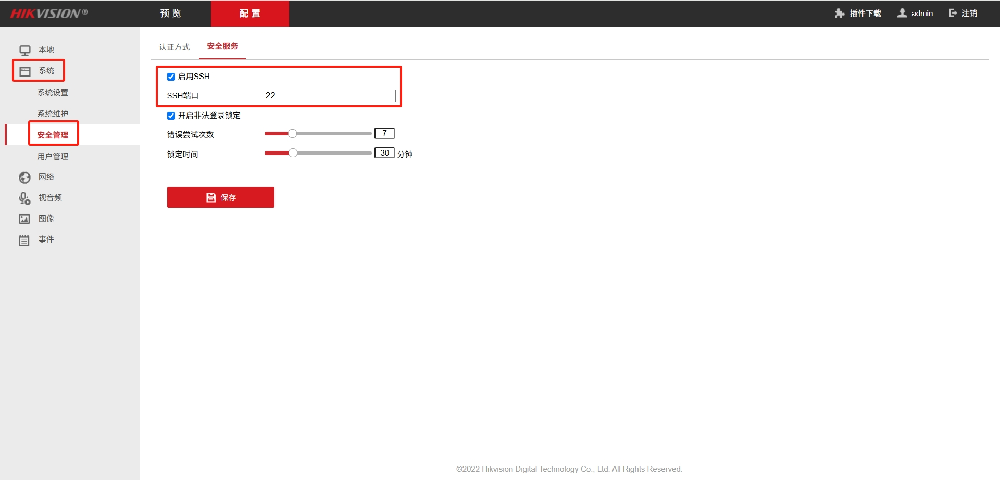

## 一、相关链接

- [ZLMediaKit Github](https://github.com/ZLMediaKit/ZLMediaKit.git)
- [ZLMediaKit Docs](https://docs.zlmediakit.com)

- [Wvp-Pro Github](https://github.com/648540858/wvp-GB28181-pro)
- [Wvp-Pro Docs](https://doc.wvp-pro.cn)

- [Linux依赖搜索](https://pkgs.org/search)
- [Nasm下载](https://www.nasm.us/pub/nasm/releasebuilds/2.14.02/)
- [Yasm下载](https://www.tortall.net/projects/yasm/releases/)
- [X264下载](https://www.videolan.org/developers/x264.html)
- [FFmpeg下载](https://ffmpeg.org/releases/)
- [Perl下载](https://www.cpan.org/src/)
- [OpenSSL下载](https://openssl-library.org/source/old/index.html)
- [libsrtp下载](https://github.com/cisco/libsrtp/releases)
- [libmp4v2下载](http://mp4v2.org/)

## 二、环境介绍

编译机器：

- centos 8.6
- gcc version 8.5.0 (GCC)
- cmake version 3.20.2

| 名称       | 版本     | 备注 |
| ---------- | -------- | ---- |
| CentOS     | 8.5.2111 |      |
| ZLMediaKit | 7.0      |      |
| WVP-Pro    | 2.7.2    |      |
| gcc        | 8.5.0    |      |
| g++        | 8.5.0    |      |
| cmake      | 3.20.2   |      |
| nasm       | 2.14.02  |      |
| yasm       | 1.3.0    |      |
| x264       | 0.165.x  |      |
| libmp4v2   |          |      |
| faac       | 1.29.9.2 |      |
| perl       | v5.32.1  |      |
| openssl    | 1.1.1w   |      |
| libsrtp    | 2.5.0    |      |
| FFmpeg     | 7.1.1    |      |

## 三、准备工作

本文档所有操作在一台与内网服务器同版本的虚拟机上执行，在内网机器部署时，只需要执行标题包含【离线】字样的内容

### 3.1 系统安装

系统安装与CentOS7之前有较大区别，可以参考[这篇文章](https://blog.csdn.net/wusam/article/details/142619996)
重点是在`安装信息摘要`页面，按照以下顺序设置

1. Root用户密码
2. 网络和主机名 此处的MAC地址需要和虚拟机`设置`-`网络`页面的MAC地址一致
3. 安装目的地
4. 安装源       `http://mirrors.aliyun.com/centos/8/BaseOS/x86_64/os/`
5. 软件选择     最小安装(yum ssh curl ping ip)
6. 时间和日期   将时区改为 Asia/Shanghai


### 3.2 设置静态IP

如果要设置固定IP，可以修改网络配置文件，手动设置IP、MAC地址、网关、子网掩码、DNS等信息

```shell
# 查看网络配置
cat /etc/sysconfig/network-scripts/ifcfg-enp0s3

# 修改网络配置
vi /etc/sysconfig/network-scripts/ifcfg-enp0s3
BOOTPROTO=static
IPADDR=192.168.137.101
# MACADDR=08:00:27:D7:88:87
HWADDR=08:00:27:D7:88:87
GATEWAY=192.168.137.1
NETMASK=255.255.255.0
DNS1=114.114.114.114

# 重启网络服务
systemctl restart NetworkManager

# 测试与宿主机 公网的网络互通
ping -c4 192.168.137.1
ping -c4 jd.com
```

### 3.3 修改yum源

```shell
Errors during downloading metadata for repository 'appstream':
  - Curl error (6): Couldn't resolve host name for http://mirrorlist.centos.org/?release=8&arch=x86_64&repo=AppStream&infra=stock [Could not resolve host: mirrorlist.centos.org]
错误：为仓库 'appstream' 下载元数据失败 : Cannot prepare internal mirrorlist: Curl error (6): Couldn't resolve host name for http://mirrorlist.centos.org/?release=8&arch=x86_64&repo=AppStream&infra=stock [Could not resolve host: mirrorlist.centos.org]
```

由于 CentOS 团队已于 2021 年 12 月 31 日对 CentOS Linux 8 停止更新和维护，并从官方镜像中移除 CentOS 8 的所有包，因此导致在使用 yum 源安装或更新会报上述错误，解决方案可参考[这篇文章](https://blog.csdn.net/huchaoyang123/article/details/144608111)，下面直接用阿里云软件源替换

1. 备份软件源

```shell
# 进入仓库源文件目录下
cd /etc/yum.repos.d/

# 备份
mv /etc/yum.repos.d/CentOS-Linux-AppStream.repo             /etc/yum.repos.d/CentOS-Linux-AppStream.repo.bakup
mv /etc/yum.repos.d/CentOS-Linux-BaseOS.repo                /etc/yum.repos.d/CentOS-Linux-BaseOS.repo.bakup
mv /etc/yum.repos.d/CentOS-Linux-ContinuousRelease.repo     /etc/yum.repos.d/CentOS-Linux-ContinuousRelease.repo.bakup
mv /etc/yum.repos.d/CentOS-Linux-Debuginfo.repo             /etc/yum.repos.d/CentOS-Linux-Debuginfo.repo.bakup
mv /etc/yum.repos.d/CentOS-Linux-Devel.repo                 /etc/yum.repos.d/CentOS-Linux-Devel.repo.bakup
mv /etc/yum.repos.d/CentOS-Linux-Extras.repo                /etc/yum.repos.d/CentOS-Linux-Extras.repo.bakup
mv /etc/yum.repos.d/CentOS-Linux-FastTrack.repo             /etc/yum.repos.d/CentOS-Linux-FastTrack.repo.bakup
mv /etc/yum.repos.d/CentOS-Linux-HighAvailability.repo      /etc/yum.repos.d/CentOS-Linux-HighAvailability.repo.bakup
mv /etc/yum.repos.d/CentOS-Linux-Media.repo                 /etc/yum.repos.d/CentOS-Linux-Media.repo.bakup
mv /etc/yum.repos.d/CentOS-Linux-Plus.repo                  /etc/yum.repos.d/CentOS-Linux-Plus.repo.bakup
mv /etc/yum.repos.d/CentOS-Linux-PowerTools.repo            /etc/yum.repos.d/CentOS-Linux-PowerTools.repo.bakup
mv /etc/yum.repos.d/CentOS-Linux-Sources.repo               /etc/yum.repos.d/CentOS-Linux-Sources.repo.bakup

```

2. 使用阿里云软件源

```shell
# 如果没有wget，可以用curl下载 
# wget http://mirrors.aliyun.com/repo/Centos-8.repo -O /etc/yum.repos.d/CentOS-Linux-BaseOS.repo

curl http://mirrors.aliyun.com/repo/Centos-8.repo -o /etc/yum.repos.d/CentOS-Linux-BaseOS.repo

```

3. 安装epel源、rpmfusion源

- [阿里云epel源](https://developer.aliyun.com/mirror/epel)
- [阿里云rpmfusion源](https://developer.aliyun.com/mirror/rpmfusion)

```shell
# 下载阿里云epel源、rpmfusion源
mkdir -p /root/lib/{epel,rpmfusion}
curl https://mirrors.aliyun.com/epel/epel-release-latest-8.noarch.rpm -o /root/lib/epel/epel-release-latest-8.noarch.rpm 
curl https://mirrors.aliyun.com/rpmfusion/free/el/rpmfusion-free-release-8.noarch.rpm -o /root/lib/rpmfusion/rpmfusion-free-release-8.noarch.rpm
curl https://mirrors.aliyun.com/rpmfusion/nonfree/el/rpmfusion-nonfree-release-8.noarch.rpm -o /root/lib/rpmfusion/rpmfusion-nonfree-release-8.noarch.rpm

# 安装
rpm -ivh /root/lib/epel/*.rpm
rpm -ivh /root/lib/rpmfusion/*.rpm

# 查看
ll /etc/yum.repos.d/epel*
ll /etc/yum.repos.d/rpmfusion*

# 刷新源
dnf repolist epel -v
dnf repolist rpmfusion -v

```

4. 更新软件源

```shell
# 清空原有缓存并重新生成
yum clean all && yum makecache

# 更新软件包（可选）
yum update -y

```

### 3.4 创建操作用户

如果没有专门的操作用户，可以按下面的操作创建新的用户，后续操作均使用此新用户来执行

```shell
# 1. 创建用户
sudo useradd -m diginn

# 2. 设置密码
sudo passwd diginn

# 3. 赋予root权限
sudo visudo
# 添加如下内容
diginn   ALL=(ALL)   ALL

# 4. 测试权限
su - diginn
sudo whoami

# 显示 root 即表示diginn用户有 sudo 权限
```

### 3.5 安装基础依赖

由于离线安装时无法在线安装依赖包，故需要提前准备好相关的依赖包，如何查询并安装依赖包可以参考[这篇文章](https://www.cnblogs.com/zw-loser/p/17251908.html)

#### 3.5.1 【在线】在线下载和安装

1. 安装依赖

```shell
# 1. 下载 yum-utils https://mirrors.aliyun.com/centos/8.5.2111/BaseOS/x86_64/os/Packages/
mkdir -p /root/lib/yum-utils
curl https://mirrors.aliyun.com/centos/8.5.2111/BaseOS/x86_64/os/Packages/yum-utils-4.0.21-3.el8.noarch.rpm -o /root/lib/yum-utils/yum-utils-4.0.21-3.el8.noarch.rpm

# 2. 安装 yum-utils
rpm -ivh /root/lib/yum-utils/*.rpm

# 3. 下载RPM包
mkdir -p /root/lib/{tar,bzip2,unzip,vim,wget,net-tools,yum-utils}
# yumdownloader --arch=x86_64 --resolve --destdir=/root/lib/tar tar
dnf download --archlist=x86_64,noarch --resolve --destdir=/root/lib/tar tar
dnf download --archlist=x86_64,noarch --resolve --destdir=/root/lib/bzip2 bzip2
dnf download --archlist=x86_64,noarch --resolve --destdir=/root/lib/unzip unzip
dnf download --archlist=x86_64,noarch --resolve --destdir=/root/lib/vim vim
dnf download --archlist=x86_64,noarch --resolve --destdir=/root/lib/wget wget
dnf download --archlist=x86_64,noarch --resolve --destdir=/root/lib/net-tools net-tools
dnf download --archlist=x86_64,noarch --resolve --destdir=/root/lib/yum-utils yum-utils

# 4. 安装RPM包
rpm -ivh /root/lib/tar/*.rpm
rpm -ivh /root/lib/bzip2/*.rpm
rpm -ivh /root/lib/unzip/*.rpm
rpm -ivh /root/lib/vim/*.rpm
rpm -ivh /root/lib/wget/*.rpm
rpm -ivh /root/lib/net-tools/*.rpm
rpm -ivh /root/lib/yum-utils/*.rpm

```

- `--resolve` 下载依赖包
- `--arch` 指定平台架构 `x86_64` `aarch64`
- `--releasever`指定系统版本 `CentOS7` 的 `7` 或 `CentOS8` 的 `8`
- `--destdir` 指定保存路径

2. 查看提供某个命令/value的rpm包

```shell
yum provides unzip

```

3. 查看 rpm 包所需的全部依赖

```shell
yum deplist unzip-6.0-45.el8_4

```

#### 3.5.2 【离线】离线安装

```shell
# 1. 安装解压工具
rpm -ivh tar-1.30-5.el8.x86_64.rpm

# 2. 解压离线安装包
tar -zxvf lib.tar.gz            # RPM依赖包
tar -zxvf resource.tar.gz       # 源码安装包
tar -zxvf ZLMediaKit.tar.gz     # ZLMediaKit源码包

# 3. 安装基础依赖
rpm -ivh /root/lib/tar/*.rpm
rpm -ivh /root/lib/bzip2/*.rpm
rpm -ivh /root/lib/unzip/*.rpm
rpm -ivh /root/lib/vim/*.rpm
rpm -ivh /root/lib/wget/*.rpm
rpm -ivh /root/lib/net-tools/*.rpm
rpm -ivh /root/lib/yum-utils/*.rpm

```

## 四、安装编译依赖

按照[快速开始](https://github.com/ZLMediaKit/ZLMediaKit/wiki/快速开始)和[zlm启用webrtc编译指南](https://github.com/ZLMediaKit/ZLMediaKit/wiki/zlm启用webrtc编译指南)来准备编译环境

### 4.1 开发工具包依赖安装

#### 4.1.1 【在线】在线下载和安装
```shell
# 1. 查看开发工具包所包含的依赖
dnf group info "Development Tools"
# dnf group install "Development Tools"
# dnf group remove "Development Tools"
# dnf install perl-IPC-Cmd  perl-Pod-Html

# 2. 下载安装包及依赖
dnf download --archlist=x86_64,noarch --resolve --destdir=/root/lib/development/autoconf autoconf
dnf download --archlist=x86_64,noarch --resolve --destdir=/root/lib/development/automake automake
dnf download --archlist=x86_64,noarch --resolve --destdir=/root/lib/development/binutils binutils
dnf download --archlist=x86_64,noarch --resolve --destdir=/root/lib/development/bison bison
dnf download --archlist=x86_64,noarch --resolve --destdir=/root/lib/development/flex flex
dnf download --archlist=x86_64,noarch --resolve --destdir=/root/lib/development/gcc gcc
dnf download --archlist=x86_64,noarch --resolve --destdir=/root/lib/development/gcc-c++ gcc-c++
dnf download --archlist=x86_64,noarch --resolve --destdir=/root/lib/development/gdb gdb
dnf download --archlist=x86_64,noarch --resolve --destdir=/root/lib/development/glibc-devel glibc-devel
dnf download --archlist=x86_64,noarch --resolve --destdir=/root/lib/development/libtool libtool
dnf download --archlist=x86_64,noarch --resolve --destdir=/root/lib/development/make make
dnf download --archlist=x86_64,noarch --resolve --destdir=/root/lib/development/pkgconf pkgconf
dnf download --archlist=x86_64,noarch --resolve --destdir=/root/lib/development/pkgconf-m4 pkgconf-m4
dnf download --archlist=x86_64,noarch --resolve --destdir=/root/lib/development/pkgconf-pkg-config pkgconf-pkg-config
dnf download --archlist=x86_64,noarch --resolve --destdir=/root/lib/development/redhat-rpm-config redhat-rpm-config
dnf download --archlist=x86_64,noarch --resolve --destdir=/root/lib/development/rpm-build rpm-build
dnf download --archlist=x86_64,noarch --resolve --destdir=/root/lib/development/rpm-sign rpm-sign
dnf download --archlist=x86_64,noarch --resolve --destdir=/root/lib/development/strace strace
dnf download --archlist=x86_64,noarch --resolve --destdir=/root/lib/development/asciidoc asciidoc
dnf download --archlist=x86_64,noarch --resolve --destdir=/root/lib/development/byacc byacc
dnf download --archlist=x86_64,noarch --resolve --destdir=/root/lib/development/ctags ctags
dnf download --archlist=x86_64,noarch --resolve --destdir=/root/lib/development/diffstat diffstat
dnf download --archlist=x86_64,noarch --resolve --destdir=/root/lib/development/elfutils-libelf-devel elfutils-libelf-devel
dnf download --archlist=x86_64,noarch --resolve --destdir=/root/lib/development/git git
dnf download --archlist=x86_64,noarch --resolve --destdir=/root/lib/development/intltool intltool
dnf download --archlist=x86_64,noarch --resolve --destdir=/root/lib/development/jna jna
dnf download --archlist=x86_64,noarch --resolve --destdir=/root/lib/development/ltrace ltrace
dnf download --archlist=x86_64,noarch --resolve --destdir=/root/lib/development/patchutils patchutils
dnf download --archlist=x86_64,noarch --resolve --destdir=/root/lib/development/perl-Fedora-VSP perl-Fedora-VSP
dnf download --archlist=x86_64,noarch --resolve --destdir=/root/lib/development/perl-Sys-Syslog perl-Sys-Syslog
dnf download --archlist=x86_64,noarch --resolve --destdir=/root/lib/development/perl-generators perl-generators
dnf download --archlist=x86_64,noarch --resolve --destdir=/root/lib/development/pesign pesign
dnf download --archlist=x86_64,noarch --resolve --destdir=/root/lib/development/source-highlight source-highlight
dnf download --archlist=x86_64,noarch --resolve --destdir=/root/lib/development/systemtap systemtap
dnf download --archlist=x86_64,noarch --resolve --destdir=/root/lib/development/valgrind valgrind
dnf download --archlist=x86_64,noarch --resolve --destdir=/root/lib/development/valgrind-devel valgrind-devel
dnf download --archlist=x86_64,noarch --resolve --destdir=/root/lib/development/cmake cmake
dnf download --archlist=x86_64,noarch --resolve --destdir=/root/lib/development/expect expect
dnf download --archlist=x86_64,noarch --resolve --destdir=/root/lib/development/rpmdevtools rpmdevtools
dnf download --archlist=x86_64,noarch --resolve --destdir=/root/lib/development/rpmlint rpmlint

dnf download --archlist=x86_64,noarch --resolve --destdir=/root/lib/perl-ipc perl-IPC-Cmd
dnf download --archlist=x86_64,noarch --resolve --destdir=/root/lib/perl-pod perl-Pod-Html

# 3. 安装
dnf install -y /root/lib/development/autoconf/*.rpm
dnf install -y /root/lib/development/automake/*.rpm
dnf install -y /root/lib/development/binutils/*.rpm
dnf install -y /root/lib/development/bison/*.rpm
dnf install -y /root/lib/development/flex/*.rpm
dnf install -y /root/lib/development/gcc/*.rpm
dnf install -y /root/lib/development/gcc-c++/*.rpm
dnf install -y /root/lib/development/gdb/*.rpm
dnf install -y /root/lib/development/glibc-devel/*.rpm
dnf install -y /root/lib/development/libtool/*.rpm
dnf install -y /root/lib/development/make/*.rpm
dnf install -y /root/lib/development/pkgconf/*.rpm
dnf install -y /root/lib/development/pkgconf-m4/*.rpm
dnf install -y /root/lib/development/pkgconf-pkg-config/*.rpm
dnf install -y /root/lib/development/redhat-rpm-config/*.rpm
dnf install -y /root/lib/development/rpm-build/*.rpm
dnf install -y /root/lib/development/rpm-sign/*.rpm
dnf install -y /root/lib/development/strace/*.rpm
dnf install -y /root/lib/development/asciidoc/*.rpm
dnf install -y /root/lib/development/byacc/*.rpm
dnf install -y /root/lib/development/ctags/*.rpm
dnf install -y /root/lib/development/diffstat/*.rpm
dnf install -y /root/lib/development/elfutils-libelf-devel/*.rpm
dnf install -y /root/lib/development/git/*.rpm
dnf install -y /root/lib/development/intltool/*.rpm
dnf install -y /root/lib/development/jna/*.rpm
dnf install -y /root/lib/development/ltrace/*.rpm
dnf install -y /root/lib/development/patchutils/*.rpm
dnf install -y /root/lib/development/perl-Fedora-VSP/*.rpm
dnf install -y /root/lib/development/perl-Sys-Syslog/*.rpm
dnf install -y /root/lib/development/perl-generators/*.rpm
dnf install -y /root/lib/development/pesign/*.rpm
dnf install -y /root/lib/development/source-highlight/*.rpm
dnf install -y /root/lib/development/systemtap/*.rpm
dnf install -y /root/lib/development/valgrind/*.rpm
dnf install -y /root/lib/development/valgrind-devel/*.rpm
dnf install -y /root/lib/development/cmake/*.rpm
dnf install -y /root/lib/development/expect/*.rpm
dnf install -y /root/lib/development/rpmdevtools/*.rpm
dnf install -y /root/lib/development/rpmlint/*.rpm

dnf install -y /root/lib/perl-ipc/*.rpm
dnf install -y /root/lib/perl-pod/*.rpm

```

#### 4.1.2 【离线】离线安装

```shell
# 由于上面步骤已解压离线安装包，这里直接安装即可

# 1. 安装开发工具包
dnf install -y /root/lib/development/autoconf/*.rpm
dnf install -y /root/lib/development/automake/*.rpm
dnf install -y /root/lib/development/binutils/*.rpm
dnf install -y /root/lib/development/bison/*.rpm
dnf install -y /root/lib/development/flex/*.rpm
dnf install -y /root/lib/development/gcc/*.rpm
dnf install -y /root/lib/development/gcc-c++/*.rpm
dnf install -y /root/lib/development/gdb/*.rpm
dnf install -y /root/lib/development/glibc-devel/*.rpm
dnf install -y /root/lib/development/libtool/*.rpm
dnf install -y /root/lib/development/make/*.rpm
dnf install -y /root/lib/development/pkgconf/*.rpm
dnf install -y /root/lib/development/pkgconf-m4/*.rpm
dnf install -y /root/lib/development/pkgconf-pkg-config/*.rpm
dnf install -y /root/lib/development/redhat-rpm-config/*.rpm
dnf install -y /root/lib/development/rpm-build/*.rpm
dnf install -y /root/lib/development/rpm-sign/*.rpm
dnf install -y /root/lib/development/strace/*.rpm
dnf install -y /root/lib/development/asciidoc/*.rpm
dnf install -y /root/lib/development/byacc/*.rpm
dnf install -y /root/lib/development/ctags/*.rpm
dnf install -y /root/lib/development/diffstat/*.rpm
dnf install -y /root/lib/development/elfutils-libelf-devel/*.rpm
dnf install -y /root/lib/development/git/*.rpm
dnf install -y /root/lib/development/intltool/*.rpm
dnf install -y /root/lib/development/jna/*.rpm
dnf install -y /root/lib/development/ltrace/*.rpm
dnf install -y /root/lib/development/patchutils/*.rpm
dnf install -y /root/lib/development/perl-Fedora-VSP/*.rpm
dnf install -y /root/lib/development/perl-Sys-Syslog/*.rpm
dnf install -y /root/lib/development/perl-generators/*.rpm
dnf install -y /root/lib/development/pesign/*.rpm
dnf install -y /root/lib/development/source-highlight/*.rpm
dnf install -y /root/lib/development/systemtap/*.rpm
dnf install -y /root/lib/development/valgrind/*.rpm
dnf install -y /root/lib/development/valgrind-devel/*.rpm
dnf install -y /root/lib/development/cmake/*.rpm
dnf install -y /root/lib/development/expect/*.rpm
dnf install -y /root/lib/development/rpmdevtools/*.rpm
dnf install -y /root/lib/development/rpmlint/*.rpm

dnf install -y /root/lib/perl-ipc/*.rpm
dnf install -y /root/lib/perl-pod/*.rpm

```

### 4.2 安装基础依赖 gcc gcc-c++ cmake

#### 4.2.1 【在线】在线下载和安装

```shell
# 在线安装
# yum -y install gcc gcc-c++ cmake

# 1. 下载安装包
mkdir -p /root/lib/{gcc,gcc-c++,cmake}
dnf download --archlist=x86_64,noarch --resolve --destdir=/root/lib/gcc gcc
dnf download --archlist=x86_64,noarch --resolve --destdir=/root/lib/gcc-c++ gcc-c++
dnf download --archlist=x86_64,noarch --resolve --destdir=/root/lib/cmake cmake

# 2. 安装
rpm -ivh /root/lib/gcc/*rpm
rpm -ivh /root/lib/gcc-c++/*rpm
rpm -ivh /root/lib/cmake/*.rpm
# yum localinstall *.rpm

# 3. 检查版本
gcc --version
g++ --version
cmake --version

# 如果g++找不到命令，手动安装，缺少g++编译ZLMediaKit会报错：No CMAKE_CXX_COMPILER could be found.
rpm -ivh /root/lib/gcc-c++/libstdc++-devel-8.5.0-4.el8_5.x86_64.rpm
rpm -ivh /root/lib/gcc-c++/gcc-c++-8.5.0-4.el8_5.x86_64.rpm

```

#### 4.2.2 【离线】离线安装

```shell
# 1. 安装
rpm -ivh /root/lib/gcc/*rpm
rpm -ivh /root/lib/gcc-c++/*rpm
rpm -ivh /root/lib/cmake/*.rpm

# 2. 检查版本
gcc --version
g++ --version
cmake --version

# 3. 如果g++找不到命令，手动安装
# 缺少g++编译ZLMediaKit会报错：No CMAKE_CXX_COMPILER could be found.
rpm -ivh /root/lib/gcc-c++/libstdc++-devel-8.5.0-4.el8_5.x86_64.rpm
rpm -ivh /root/lib/gcc-c++/gcc-c++-8.5.0-4.el8_5.x86_64.rpm

```

### 4.3 安装 Nasm Yasm

#### 4.3.1 【在线】在线下载和安装
1. 安装Nasm

```shell
# 1. 下载
wget https://www.nasm.us/pub/nasm/releasebuilds/2.14.02/nasm-2.14.02.tar.bz2 -O /root/resource/nasm-2.14.02.tar.bz2
tar -jxvf nasm-2.14.02.tar.bz2
cd nasm-2.14.02/

# 2. 编译安装
./configure --prefix=/usr/local/nasm
make -j$(nproc) && make install

# 3. 检查版本
/usr/local/nasm/bin/nasm -version

```

2. 安装Yasm

```shell
# 1. 下载
wget https://www.tortall.net/projects/yasm/releases/yasm-1.3.0.tar.gz -O /root/resource/yasm-1.3.0.tar.gz
tar -zxvf yasm-1.3.0.tar.gz
cd yasm-1.3.0

# 2. 编译安装
./configure --prefix=/usr/local/yasm
make -j$(nproc) && make install

# 3. 检查版本
/usr/local/yasm/bin/yasm --version

```

#### 4.3.2 【离线】离线安装

1. 安装Nasm

```shell
# 1. 解压
cd /root/resource
tar -jxvf nasm-2.14.02.tar.bz2
cd nasm-2.14.02/

# 2. 编译安装
./configure --prefix=/usr/local/nasm
make -j$(nproc) && make install

# 3. 检查版本
/usr/local/nasm/bin/nasm -version

```

2. 安装Yasm

```shell
# 1. 解压
cd /root/resource
tar -zxvf yasm-1.3.0.tar.gz
cd yasm-1.3.0

# 2. 编译安装
./configure --prefix=/usr/local/yasm
make -j$(nproc) && make install

# 3. 检查版本
/usr/local/yasm/bin/yasm --version

```

#### 4.3.3 设置环境变量

```shell
# 设置环境变量
vim /etc/profile

# 加入以下内容
NASM_HOME=/usr/local/nasm
YASM_HOME=/usr/local/yasm
PATH=$PATH:$NASM_HOME/bin:$YASM_HOME/bin
export NASM_HOME YASM_HOME PATH

# 刷新配置
source /etc/profile

# 测试
nasm --version
yasm --version

```

### 4.4 安装 x264 libmp4v2 faac

#### 4.4.1 【在线】在线下载和安装
1. 安装x264

```shell
# 1. 下载
wget https://code.videolan.org/videolan/x264/-/archive/master/x264-master.tar.bz2 -O /root/resource/x264-master.tar.bz2
tar -jxvf x264-master.tar.bz2
cd x264-master

# 2. 编译安装
./configure --prefix=/usr/local/x264 --enable-shared --enable-static
make -j$(nproc) && make install

# 3. 检查版本
/usr/local/x264/bin/x264 --version

# 4. 配置动态链接库
vim /etc/ld.so.conf

# 加入以下内容
/usr/local/x264/lib/

# 加载动态链接库
ldconfig -v

# 5. 配置 pkgconfig
# ERROR: x264 not found using pkg-config
# pkg-config会搜索指定路径下的.pc文件，所以将.pc文件移动到指定目录下即可
cp /usr/local/x264/lib/pkgconfig/x264.pc /usr/share/pkgconfig/
```

2. 设置环境变量

```shell
# 设置环境变量
vim /etc/profile

# 加入以下内容
NASM_HOME=/usr/local/nasm
YASM_HOME=/usr/local/yasm
X264_HOME=/usr/local/x264
PATH=$PATH:$NASM_HOME/bin:$YASM_HOME/bin:$X264_HOME/bin
export NASM_HOME YASM_HOME X264_HOME PATH

# 刷新配置
source /etc/profile

# 检测
x264 --version

```

3. 安装libmp4v2、faac

```shell
# 1. 下载
mkdir -p /root/lib/{libmp4v2,faac}
dnf download --archlist=x86_64,noarch --resolve --destdir=/root/lib/libmp4v2 libmp4v2
dnf download --archlist=x86_64,noarch --resolve --destdir=/root/lib/libmp4v2 libmp4v2-devel
dnf download --archlist=x86_64,noarch --resolve --destdir=/root/lib/faac faac
dnf download --archlist=x86_64,noarch --resolve --destdir=/root/lib/faac faac-devel

# 2. 安装
rpm -ivh /root/lib/libmp4v2/*.rpm
rpm -ivh /root/lib/faac/*.rpm

```

#### 4.4.2 【离线】离线安装
1. 安装x264

```shell
# 1. 解压
cd /root/resource
tar -jxvf x264-master.tar.bz2
cd x264-master

# 2. 编译安装
./configure --prefix=/usr/local/x264 --enable-shared --enable-static
make -j$(nproc) && make install

# 3. 检查版本
/usr/local/x264/bin/x264 --version

# 4. 配置动态链接库
vim /etc/ld.so.conf

# 加入以下内容
/usr/local/x264/lib/

# 加载动态链接库
ldconfig -v

# 5. 配置 pkgconfig
# ERROR: x264 not found using pkg-config
# pkg-config会搜索指定路径下的.pc文件，所以将.pc文件移动到指定目录下即可
cp /usr/local/x264/lib/pkgconfig/x264.pc /usr/share/pkgconfig/

```

2. 设置环境变量

```shell
# 设置环境变量
vim /etc/profile

# 加入以下内容
NASM_HOME=/usr/local/nasm
YASM_HOME=/usr/local/yasm
X264_HOME=/usr/local/x264
PATH=$PATH:$NASM_HOME/bin:$YASM_HOME/bin:$X264_HOME/bin
export NASM_HOME YASM_HOME X264_HOME PATH

# 刷新配置
source /etc/profile

# 检测
x264 --version

```

3. 安装libmp4v2、faac

```shell
# 1. 安装
rpm -ivh /root/lib/libmp4v2/*.rpm
rpm -ivh /root/lib/faac/*.rpm

```

### 4.5 编译安装Openssl(perl zlib)

#### 4.5.1 目前 CentOS 8.5.2111 自带的Openssl版本为 1.1.1k，满足ZLMediaKit的要求（> 1.1.0），不建议安装升级高版本的OpenSSL，可能会导致一些意外的错误，例如 openssl yum openssh 不可用等

- [LINUX下载编译OpenSSL](https://blog.csdn.net/quantum7/article/details/104086731)
- [LINUX下载编译libsrtp-2.3.0](https://blog.csdn.net/quantum7/article/details/104807212)
- [linux openssl 升级](https://blog.csdn.net/qq_39187750/article/details/123569704)
- [OepnSSL报错处理](https://blog.csdn.net/hzcm1984/article/details/115958795)
- [centos8 OpenSSL升级版本到最新](https://blog.csdn.net/yiyihuazi/article/details/116000480)
- [在 Rocky/AlmaLinux/CentOS/RHEL 8 上安装 OpenSSL 3.x](https://cn.linux-console.net/?p=31592)

**经测试，安装openssl 3.0.12 不替换默认的 openssl 1.1 ，在后续也会报错**

#### 4.5.2 【在线】【RPM安装】RPM安装 OpenSSL

```shell
# 1. 下载YUM仓库的Openssl
mkdir -p /root/lib/{openssl,openssl11,libsdl}
dnf download --archlist=x86_64,noarch --resolve --destdir=/root/lib/openssl openssl
dnf download --archlist=x86_64,noarch --resolve --destdir=/root/lib/openssl-devel openssl-devel
dnf download --archlist=x86_64,noarch --resolve --destdir=/root/lib/openssl11 openssl11
dnf download --archlist=x86_64,noarch --resolve --destdir=/root/lib/openssl11-devel openssl11-devel
dnf download --archlist=x86_64,noarch --resolve --destdir=/root/lib/libsdl SDL-devel

# 2. 安装
dnf install -y /root/lib/openssl/*.rpm
dnf install -y /root/lib/openssl-devel/*.rpm
dnf install -y /root/lib/openssl11/*.rpm
dnf install -y /root/lib/openssl11-devel/*.rpm
dnf install -y /root/lib/libsdl/*.rpm

```

#### 4.5.3 【在线】【手动编译】在线下载和安装

1. 安装zlib（编译openssl需要）

```shell
# 1. 下载
mkdir -p /root/lib/zlib
dnf download --archlist=x86_64,noarch --resolve --destdir=/root/lib/zlib zlib
dnf download --archlist=x86_64,noarch --resolve --destdir=/root/lib/zlib zlib-devel

# 2. 安装
rpm -ivh /root/lib/zlib/*.rpm

# 如果openssl编译报错，单独安装 zlib zlib-devel
rpm -ivh /root/lib/zlib/zlib-1.2.11-17.el8.x86_64.rpm
rpm -ivh /root/lib/zlib/zlib-devel-1.2.11-17.el8.x86_64.rpm

```

2. 手动编译 perl5 (编译openssl需要)

```shell
# 1. 下载
wget https://www.cpan.org/src/5.0/perl-5.32.1.tar.gz      -O /root/resource/perl-5.32.1.tar.gz
tar -zxvf perl-5.32.1.tar.gz
cd perl-5.32.1

# 2. 编译安装
./Configure -des -Dprefix=/usr/local/perl
make -j$(nproc) && make install

# 3. 检查版本
perl --version

# 下面两个命令是由这两条安装的
# dnf install -y /root/lib/perl-ipc/*.rpm
# dnf install -y /root/lib/perl-pod/*.rpm
pod2man --help
pod2html --help

```

3. 手动编译 openssl (openssl版本要求1.1.0以上)

```shell
# 1. 下载
wget https://www.openssl.org/source/openssl-3.0.16.tar.gz -O /root/resource/openssl-3.0.16.tar.gz
tar -xvzf openssl-3.0.16.tar.gz
cd openssl-3.0.16

# 2. 编译安装
./config shared zlib --openssldir=/usr/local/openssl --prefix=/usr/local/openssl
make depend && make -j$(nproc) && make install

# 3. 配置和更新动态链接器运行时绑定
ldconfig

# 4. 检查版本
/usr/local/openssl/bin/openssl version -a

```

#### 4.5.4 【离线】【手动编译】离线安装

1. 安装zlib（编译openssl需要）

```shell
# 1. 安装
rpm -ivh /root/lib/zlib/*.rpm

# 如果openssl编译报错，单独安装 zlib zlib-devel
rpm -ivh /root/lib/zlib/zlib-1.2.11-17.el8.x86_64.rpm
rpm -ivh /root/lib/zlib/zlib-devel-1.2.11-17.el8.x86_64.rpm

```

2. 手动编译 perl5 (编译openssl需要)

```shell
# 1. 解压
cd /root/resource
tar -zxvf perl-5.32.1.tar.gz
cd perl-5.32.1

# 2. 编译安装
./Configure -des -Dprefix=/usr/local/perl
make -j$(nproc) && make install

# 3. 检查版本
perl --version

# 下面两个命令是由这两条安装的
# dnf install -y /root/lib/perl-ipc/*.rpm
# dnf install -y /root/lib/perl-pod/*.rpm
pod2man --help
pod2html --help

```

3. 手动编译 openssl (openssl版本要求1.1.0以上)

```shell
# 1. 解压
cd /root/resource
tar -xvzf openssl-3.0.16.tar.gz
cd openssl-3.0.16

# 2. 编译安装
./config shared zlib --openssldir=/usr/local/openssl --prefix=/usr/local/openssl
make depend && make -j$(nproc) && make install

# 3. 配置和更新动态链接器运行时绑定
ldconfig

# 4. 检查版本
/usr/local/openssl/bin/openssl version -a

```

#### 4.5.5 配置动态链接库和环境变量
1. 配置动态链接库

```shell
# 配置动态链接库
vim /etc/ld.so.conf

# 加入以下内容
/usr/local/lib64/
/usr/local/openssl/lib/
/usr/local/openssl/lib64/

# 加载动态链接库
ldconfig -v

```

2. 设置环境变量

```shell
# 设置环境变量
vim /etc/profile

# 加入以下内容
NASM_HOME=/usr/local/nasm
YASM_HOME=/usr/local/yasm
X264_HOME=/usr/local/x264
OPENSSL_HOME=/usr/local/openssl
PATH=$PATH:$NASM_HOME/bin:$YASM_HOME/bin:$X264_HOME/bin:$OPENSSL_HOME/bin
export NASM_HOME YASM_HOME X264_HOME OPENSSL_HOME PATH

# 刷新配置
source /etc/profile

# 检测
openssl version -a

```

3. 替换原Openssl

**redhat8自己开发了一套函数，会打包在自己的libopenssl rpm包里，有些redhat提供的应用使用到这些函数；
在official的openssl源代码里没有这些函数；
所以如果是用redhat提供的openssl 最好不要自己build openssl**

**替换会导致部分依赖openssl的程序不可用，例如yum openssh等**

```shell
# 备份原openssl
mv /usr/bin/openssl     /usr/bin/openssl_bak
mv /usr/include/openssl /usr/include/openssl_bak
mv /usr/lib64/openssl   /usr/lib64/openssl_bak
mv /usr/lib64/libssl.so /usr/lib64/libssl.so_bak

# 创建软链接
ln -sf /usr/local/openssl/bin/openssl           /usr/bin/openssl # 替换系统openssl，非必须
ln -sf /usr/local/openssl/include/openssl       /usr/include/openssl
ln -sf /usr/local/openssl/lib/libssl.so         /usr/lib64/libssl.so
ln -sf /usr/local/openssl/lib/libssl.so.1.1     /usr/lib64/libssl.so.1.1
ln -sf /usr/local/openssl/lib/libcrypto.so      /usr/lib64/libcrypto.so
ln -sf /usr/local/openssl/lib/libcrypto.so.1.1  /usr/lib64/libcrypto.so.1.1


rm -rf /usr/lib64/libcrypto.so.1.1
ln -sf /usr/local/openssl/lib64/libcrypto.so.3  /usr/lib64/libcrypto.so.3

ll /usr/lib64/libssl*
ll /usr/lib64/libcrypt*

[root@centos openssl-1.1.1w]# ll /usr/lib64/libssl*
lrwxrwxrwx. 1 root root     16 12月  3 2021 /usr/lib64/libssl.so.1.1 -> libssl.so.1.1.1k
-rwxr-xr-x. 1 root root 615704 12月  3 2021 /usr/lib64/libssl.so.1.1.1k
[root@centos openssl-1.1.1w]# ll /usr/lib64/libcrypt*
lrwxrwxrwx. 1 root root      19 12月  3 2021 /usr/lib64/libcrypto.so.1.1 -> libcrypto.so.1.1.1k
-rwxr-xr-x. 1 root root 3079664 12月  3 2021 /usr/lib64/libcrypto.so.1.1.1k
lrwxrwxrwx. 1 root root      23 2月  19 2021 /usr/lib64/libcryptsetup.so.12 -> libcryptsetup.so.12.6.0
-rwxr-xr-x. 1 root root  510096 2月  19 2021 /usr/lib64/libcryptsetup.so.12.6.0
lrwxrwxrwx. 1 root root      17 5月   6 2021 /usr/lib64/libcrypt.so -> libcrypt.so.1.1.0
lrwxrwxrwx. 1 root root      17 5月   6 2021 /usr/lib64/libcrypt.so.1 -> libcrypt.so.1.1.0
-rwxr-xr-x. 1 root root  136040 5月   6 2021 /usr/lib64/libcrypt.so.1.1.0

# 检查版本
openssl version -a

```

### 4.6 安装 libsrtp FFmpeg

- [CentOS7离线部署ZLMediaKit](https://blog.csdn.net/weixin_42899203/article/details/115201520)
- [FFmpeg在Centos服务器上离线安装(包含所需依赖)并实现拉取rtsp流与推送至rtmp服务器](https://blog.51cto.com/BADAOLIUMANGQZ/8776336)
- [Linux ffmpeg 离线安装](https://blog.csdn.net/qq_39835480/article/details/112886780)
- [如何在 CentOS 8 上安装 FFmpeg](https://zhuanlan.zhihu.com/p/120866438)

#### 4.6.1 【在线】在线下载和安装
1. 手动编译 libsrtp

```shell
# 1. 下载
wget https://github.com/cisco/libsrtp/archive/refs/tags/v2.5.0.tar.gz -O /root/resource/libsrtp-2.5.0.tar.gz
tar -xvzf libsrtp-2.5.0.tar.gz
cd libsrtp-2.5.0

# 2. 编译配置
# 默认openssl，需要安装 openssl-devel
./configure --enable-openssl

# 手动编译的openssl
# ./configure --enable-openssl --with-openssl-dir=/usr/local/openssl

# 3. 编译安装
make -j$(nproc) && make install

```

2. 安装FFmpeg

```shell
# 1. 下载  
# ffmpeg-4.4 是最后一个支持openssl 1.1.1的版本，ffmpeg-4.4.5开始需要openssl 3.0
# wget https://ffmpeg.org/releases/ffmpeg-7.1.1.tar.gz -O /root/resource/ffmpeg-7.1.1.tar.gz
wget https://ffmpeg.org/releases/ffmpeg-4.4.tar.gz -O /root/resource/ffmpeg-4.4.tar.gz
tar -xvf ffmpeg-4.4.tar.gz
cd ffmpeg-4.4

# 2. 编译安装
# ./configure --prefix=/usr/local/ffmpeg
./configure --prefix=/usr/local/ffmpeg --enable-gpl --enable-libx264 --enable-static --disable-shared --extra-libs=-ldl --enable-encoder=libx264 --enable-openssl --enable-nonfree
# ./configure --prefix=/usr/local/ffmpeg --enable-gpl --enable-libx264 --enable-static --disable-shared --extra-libs=-ldl  --enable-openssl --extra-cflags="-I/usr/local/openssl/include" --extra-ldflags="-L/usr/local/openssl/lib" --enable-encoder=libx264 --extra-ldflags="-L/usr/local/x264/lib" --enable-nonfree
make -j$(nproc) && make install

# 3. 检查版本
/usr/local/ffmpeg/bin/ffmpeg -version

```

#### 4.6.2 【离线】离线安装

1. 手动编译 libsrtp

```shell
# 1. 解压
cd /root/resource
tar -xvzf libsrtp-2.5.0.tar.gz
cd libsrtp-2.5.0

# 2. 编译配置
# 默认openssl，需要安装 openssl-devel
./configure --enable-openssl

# 手动编译的openssl
# ./configure --enable-openssl --with-openssl-dir=/usr/local/openssl

# 3. 编译安装
make -j$(nproc) && make install

```

2. 安装FFmpeg

```shell
# 1. 解压
cd /root/resource  
tar -xvf ffmpeg-4.4.tar.gz
cd ffmpeg-4.4

# 2. 编译安装
./configure --prefix=/usr/local/ffmpeg --enable-gpl --enable-libx264 --enable-static --disable-shared --extra-libs=-ldl --enable-encoder=libx264 --enable-openssl --enable-nonfree
make -j$(nproc) && make install

# 3. 检查版本
/usr/local/ffmpeg/bin/ffmpeg -version

```

#### 4.6.3 配置动态链接库和环境变量

1. 配置动态链接库

```shell
# 配置动态链接库
vim /etc/ld.so.conf

# 加入以下内容
/usr/local/ffmpeg/lib/

# 加载动态链接库
ldconfig -v

```

2. 设置环境变量

```shell
# 设置环境变量
vim /etc/profile

# 加入以下内容
NASM_HOME=/usr/local/nasm
YASM_HOME=/usr/local/yasm
X264_HOME=/usr/local/x264
FFMPEG_HOME=/usr/local/ffmpeg
PATH=$PATH:$NASM_HOME/bin:$YASM_HOME/bin:$X264_HOME/bin:$FFMPEG_HOME/bin
export NASM_HOME YASM_HOME X264_HOME FFMPEG_HOME PATH

# 刷新配置
source /etc/profile

# 检查版本
ffmpeg -version

```

## 五、安装ZLMediaKit

### 5.1 下载ZLMediaKit源码

```shell
# 国内用户推荐从同步镜像网站gitee下载 
git clone --depth 1 https://gitee.com/xia-chu/ZLMediaKit

cd ZLMediaKit

# 千万不要忘记执行这句命令
git submodule update --init

```

### 5.2 编译安装ZLMediaKit

1. 检查依赖

```shell
# 检查依赖
gcc --version
g++ --version
cmake --version
openssl version
ffmpeg -version

```

2. 编译

```shell
mkdir -p /root/ZLMediaKit/build
cd /root/ZLMediaKit/build

# 不启用webrtc编译
# cmake .. && make -j4

# 启用webrtc编译
cmake .. -DENABLE_WEBRTC=true -DOPENSSL_ROOT_DIR=/usr/local/openssl -DOPENSSL_LIBRARIES=/usr/local/openssl/lib
cmake --build . --target MediaServer

```

### 5.3 修改配置文件

配置文件在 `/root/ZLMediaKit/release/linux/Debug/config.ini`

#### 5.3.1 WVP集成配置
```shell
[api]
apiDebug=1
defaultSnap=./www/logo.png
# 修改和记录秘钥，与WVP中匹配
secret=035c73f7-bb6b-4889-a715-d9eb2d1925cc
snapRoot=./www/snap/

[general]
check_nvidia_dev=1
enableVhost=0
enable_ffmpeg_log=0
flowThreshold=1024
maxStreamWaitMS=15000
# 修改和记录MediaServerId，与WVP中匹配
mediaServerId=FQ3TF8yT83wh5Wvz
mergeWriteMS=0
resetWhenRePlay=1
streamNoneReaderDelayMS=20000
unready_frame_cache=100
wait_add_track_ms=3000
wait_track_ready_ms=10000

```

#### 5.3.1 WebRTC配置
由于webrtc协议需要告知播放器服务器所在ip，如果该ip对播放器不可见，会导致webrtc无法联通。请修改配置文件中`rtc.externIP`为播放器可见ip，如果不设置该配置项，zlmediakit将获取网卡ip(一般是内网ip)，那么将无法跨域nat使用webrtc。


```ini
[rtc]
#rtc播放推流、播放超时时间
timeoutSec=15
#本机对rtc客户端的可见ip，作为服务器时一般为公网ip，置空时，会自动获取网卡ip
externIP=192.168.137.126
#rtc udp服务器监听端口号，所有rtc客户端将通过该端口传输stun/dtls/srtp/srtcp数据，
#该端口是多线程的，同时支持客户端网络切换导致的连接迁移
#需要注意的是，如果服务器在nat内，需要做端口映射时，必须确保外网映射端口跟该端口一致
port=8000
#设置remb比特率，非0时关闭twcc并开启remb。该设置在rtc推流时有效，可以控制推流画质
rembBitRate=1000000

```

### 5.4 防火墙配置
```shell
# 开放端口
firewall-cmd --permanent --zone=public --add-port=80/tcp          # http (hls http-ts)
firewall-cmd --permanent --zone=public --add-port=443/tcp         # https
firewall-cmd --permanent --zone=public --add-port=1935/tcp        # rtmp
firewall-cmd --permanent --zone=public --add-port=10000/tcp       # rtp_proxy
firewall-cmd --permanent --zone=public --add-port=10000/udp       # rtp_proxy
firewall-cmd --permanent --zone=public --add-port=30000-35000/udp # rtp 推送端口，至少36个端口
firewall-cmd --permanent --zone=public --add-port=8000/tcp        # rtc
firewall-cmd --permanent --zone=public --add-port=8000/udp        # rtc
firewall-cmd --permanent --zone=public --add-port=9000/udp        # srt
firewall-cmd --permanent --zone=public --add-port=554/tcp         # rtsp
firewall-cmd --permanent --zone=public --add-port=554/udp         # rtsp
firewall-cmd --permanent --zone=public --add-port=18080/tcp       # WVP http端口
firewall-cmd --permanent --zone=public --add-port=18081/tcp       # 录像管理端口

# 刷新配置
firewall-cmd --reload

# 查看开放的端口
firewall-cmd --list-port

# 查看所有防火墙规则
firewall-cmd --list-all

```

### 5.4 运行

```shell
cd /root/ZLMediaKit/release/linux/Debug

# 通过-h可以了解启动参数
./MediaServer -h

#以守护进程模式启动
./MediaServer -d &

```

### 5.5 测试

最新的zlmediakit源码自带有效的ssl证书default.pem,对应的域名是default.zlmediakit.com,该域名解析到的ip为127.0.0.1,用户在浏览器中打开[测试链接](https://default.zlmediakit.com/webrtc/) 即可开始测试。请先推流后，再测试播放。如果webrtc无法播放， 请参考此[issue](https://github.com/ZLMediaKit/ZLMediaKit/issues/1277)

## 六、编译安装WVP-Pro

### 6.1 前端编译安装

1. 拉取代码
```shell
# 1. 拉取代码
git clone http://113.57.121.225:3001/Pi-Diginn/wvp-front.git
cd wvp-front

# 2. 安装依赖
npm --registry=https://registry.npmmirror.com install

```

2. 修改环境配置 `config/prod.env.js`
```js
'use strict'
module.exports = {
  NODE_ENV: '"production"',
  // pi-diginn-web地址
  PI_DIGINN_WEB_URL: '"diginn.pisx.local:9096"',
  // PI_DIGINN_WEB_URL: '"113.57.121.225:9096"',
  // PI_DIGINN_WEB_URL: '"114.55.234.250:9096"',
  WVP_WEB_URL: '"diginn.pisx.local:9096"'
  // WVP_WEB_URL: '"113.57.121.225:9096"'
  // WVP_WEB_URL: '"114.55.234.250:9096"'
}

```
测试地址需要修改主机hosts文件 `192.168.137.1  diginn.pisx.local`

3. 打包静态文件 
```shell
# 打包静态文件
npm run build

```

4. 将得到的dist目录放到nginx下 `html/wvp`

添加配置文件 `conf.d/diginn.conf`

```conf
upstream diginn_nginx {
  server 192.168.137.1:9096;
}

upstream diginn_oauth {
  server 192.168.137.1:31888;
}

upstream diginn_system {
  server 192.168.137.1:31112;
}

upstream diginn_thing {
  server 192.168.137.1:31111;
}

upstream diginn_message {
  server 192.168.137.1:31890;
}

upstream diginn_plugin {
  server 192.168.137.1:31116;
}

upstream diginn_workflow {
  server 192.168.137.1:31113;
}

upstream diginn_usability {
  server 192.168.137.1:31789;
}

upstream diginn_wvp {
  server 192.168.137.1:31117;
}

upstream diginn_demo {
  server 192.168.137.1:31112;
}

# websocket
map $http_upgrade $connection_upgrade {
  default upgrade;
  '' close;
}

server {
  listen       9096;
  listen  [::]:9096;
  server_name  diginn.pisx.local;

  #access_log  /var/log/nginx/host.access.log  main;

  location / {
    root   html/diginn;
    index  index.html index.htm;
    if (!-e $request_filename) {
      rewrite ^(.*)$ /index.html?s=$1 last;
      break;
    }
  }

  location /monitor {
      alias   html/wvp;
      index  index.html index.htm;
      if (!-e $request_filename) {
        rewrite ^(.*)$ /index.html?s=$1 last;
        break;
      }
  }

  location ^~ /oauth/ {
    proxy_pass              http://diginn_oauth/oauth/;
    proxy_http_version      1.1;
    proxy_read_timeout      30s;
    proxy_set_header        Host $http_host;
    proxy_set_header        X-Real-IP $remote_addr;
    proxy_set_header        X-Forwarded-For $proxy_add_x_forwarded_for;
    proxy_set_header        X-NginX-Proxy true;
    proxy_set_header        Upgrade $http_upgrade;
    proxy_set_header        Connection "$connection_upgrade";
  }

  location ^~ /system/ {
    proxy_pass              http://diginn_system;
    proxy_http_version      1.1;
    proxy_read_timeout      30s;
    proxy_set_header        Host $http_host;
    proxy_set_header        X-Real-IP $remote_addr;
    proxy_set_header        X-Forwarded-For $proxy_add_x_forwarded_for;
    proxy_set_header        X-NginX-Proxy true;
    proxy_set_header        Upgrade $http_upgrade;
    proxy_set_header        Connection "$connection_upgrade";
  }

  location ^~ /thing/ {
    proxy_pass              http://diginn_thing;
    proxy_http_version      1.1;
    proxy_read_timeout      30s;
    proxy_set_header        Host $http_host;
    proxy_set_header        X-Real-IP $remote_addr;
    proxy_set_header        X-Forwarded-For $proxy_add_x_forwarded_for;
    proxy_set_header        X-NginX-Proxy true;
    proxy_set_header        Upgrade $http_upgrade;
    proxy_set_header        Connection "$connection_upgrade";
  }

  location ^~ /message/ {
    proxy_pass              http://diginn_message;
    proxy_http_version      1.1;
    proxy_read_timeout      30s;
    proxy_set_header        Host $http_host;
    proxy_set_header        X-Real-IP $remote_addr;
    proxy_set_header        X-Forwarded-For $proxy_add_x_forwarded_for;
    proxy_set_header        X-NginX-Proxy true;
    proxy_set_header        Upgrade $http_upgrade;
    proxy_set_header        Connection "$connection_upgrade";
  }

  location ^~ /plugin/ {
    proxy_pass              http://diginn_plugin;
    proxy_http_version      1.1;
    proxy_read_timeout      30s;
    proxy_set_header        Host $http_host;
    proxy_set_header        X-Real-IP $remote_addr;
    proxy_set_header        X-Forwarded-For $proxy_add_x_forwarded_for;
    proxy_set_header        X-NginX-Proxy true;
    proxy_set_header        Upgrade $http_upgrade;
    proxy_set_header        Connection "$connection_upgrade";
  }
  
  location ^~ /workflow/ {
    proxy_pass              http://diginn_workflow;
    proxy_http_version      1.1;
    proxy_read_timeout      30s;
    proxy_set_header        Host $http_host;
    proxy_set_header        X-Real-IP $remote_addr;
    proxy_set_header        X-Forwarded-For $proxy_add_x_forwarded_for;
    proxy_set_header        X-NginX-Proxy true;
    proxy_set_header        Upgrade $http_upgrade;
    proxy_set_header        Connection "$connection_upgrade";
  }
  
  location ^~ /usability/ {
    proxy_pass              http://diginn_usability;
    proxy_http_version      1.1;
    proxy_read_timeout      30s;
    proxy_set_header        Host $http_host;
    proxy_set_header        X-Real-IP $remote_addr;
    proxy_set_header        X-Forwarded-For $proxy_add_x_forwarded_for;
    proxy_set_header        X-NginX-Proxy true;
    proxy_set_header        Upgrade $http_upgrade;
    proxy_set_header        Connection "$connection_upgrade";
  }

  location ^~ /wvp/ {
    proxy_pass              http://diginn_wvp;
    proxy_http_version      1.1;
    proxy_read_timeout      30s;
    proxy_set_header        Host $http_host;
    proxy_set_header        X-Real-IP $remote_addr;
    proxy_set_header        X-Forwarded-For $proxy_add_x_forwarded_for;
    proxy_set_header        X-NginX-Proxy true;
    proxy_set_header        Upgrade $http_upgrade;
    proxy_set_header        Connection "$connection_upgrade";
  }


  # 使用捕获组 $1 来传递剩余路径 /demo/123 -> /123
  location ~ ^/demo(/.*)$ {
    proxy_pass http://diginn_demo$1;
  }

  #error_page  404              /404.html;

  # redirect server error pages to the static page /50x.html
  #
  error_page   500 502 503 504  /50x.html;
  location = /50x.html {
      root   /usr/share/nginx/html;
  }

  # 图片防盗链
  location ~* \.(gif|jpg|jpeg|png|bmp|swf)$ {
    valid_referers none blocked 192.168.9.21; # 只允许本机IP外链引用
    if ($invalid_referer){
      return 403;
    }
  }

  # proxy the PHP scripts to Apache listening on 127.0.0.1:80
  #
  #location ~ \.php$ {
  #    proxy_pass   http://127.0.0.1;
  #}

  # pass the PHP scripts to FastCGI server listening on 127.0.0.1:9000
  #
  #location ~ \.php$ {
  #    root           html;
  #    fastcgi_pass   127.0.0.1:9000;
  #    fastcgi_index  index.php;
  #    fastcgi_param  SCRIPT_FILENAME  /scripts$fastcgi_script_name;
  #    include        fastcgi_params;
  #}

  # deny access to .htaccess files, if Apache's document root
  # concurs with nginx's one
  #
  #location ~ /\.ht {
  #    deny  all;
  #}
}
```

### 6.2 运行 wvp-pro 后端服务

修改 `application-wvp-local.yaml` 配置，设置 `media.ip` `media.hook-ip` `media.sdp-ip` 等
```yaml
spring:
  # [可选]上传文件大小限制
  servlet:
    multipart:
      max-file-size: 10MB
      max-request-size: 100MB
#  # REDIS数据库配置
#  redis:
#    # [必须修改] Redis服务器IP, REDIS安装在本机的,使用127.0.0.1
#    host: 127.0.0.1
#    # [必须修改] 端口号
#    port: 6379
#    # [可选] 数据库 DB
#    database: 6
#    # [可选] 访问密码,若你的redis服务器没有设置密码，就不需要用密码去连接
#    password: 62g@A71u2sx
#    # [可选] 超时时间
#    timeout: 10000
#    # mysql数据源
#  datasource:
#    type: com.alibaba.druid.pool.DruidDataSource
#    driver-class-name: com.mysql.cj.jdbc.Driver
#    url: jdbc:mysql://127.0.0.1:3306/wvp?useUnicode=true&characterEncoding=UTF8&rewriteBatchedStatements=true&serverTimezone=PRC&useSSL=false&allowMultiQueries=true
#    username: root
#    password: pisx@mysql
#    druid:
#      initialSize: 10                       # 连接池初始化连接数
#      maxActive: 200                        # 连接池最大连接数
#      minIdle: 5                            # 连接池最小空闲连接数
#      maxWait: 60000                        # 获取连接时最大等待时间，单位毫秒。配置了maxWait之后，缺省启用公平锁，并发效率会有所下降，如果需要可以通过配置useUnfairLock属性为true使用非公平锁。
#      keepAlive: true                       # 连接池中的minIdle数量以内的连接，空闲时间超过minEvictableIdleTimeMillis，则会执行keepAlive操作。
#      validationQuery: select 1             # 检测连接是否有效sql，要求是查询语句，常用select 'x'。如果validationQuery为null，testOnBorrow、testOnReturn、testWhileIdle都不会起作用。
#      testWhileIdle: true                   # 建议配置为true，不影响性能，并且保证安全性。申请连接的时候检测，如果空闲时间大于timeBetweenEvictionRunsMillis，执行validationQuery检测连接是否有效。
#      testOnBorrow: false                   # 申请连接时执行validationQuery检测连接是否有效，做了这个配置会降低性能。
#      testOnReturn: false                   # 归还连接时执行validationQuery检测连接是否有效，做了这个配置会降低性能。
#      poolPreparedStatements: false         # 是否開啟PSCache，並且指定每個連線上PSCache的大小
#      timeBetweenEvictionRunsMillis: 60000  # 配置間隔多久才進行一次檢測，檢測需要關閉的空閒連線，單位是毫秒
#      minEvictableIdleTimeMillis: 300000    # 配置一個連線在池中最小生存的時間，單位是毫秒
#      filters: stat,slf4j             # 配置监控统计拦截的filters，监控统计用的filter:sta, 日志用的filter:log4j
#      useGlobalDataSourceStat: true         # 合并多个DruidDataSource的监控数据
#      # 通过connectProperties属性来打开mergeSql功能；慢SQL记录
#      connectionProperties: druid.stat.mergeSql=true;druid.stat.slowSqlMillis=1000
#      #stat-view-servlet.url-pattern: /admin/druid/*

#[可选] WVP监听的HTTP端口, 网页和接口调用都是这个端口
server:
  port: 31117

# 作为28181服务器的配置
sip:
  # [必须修改] 本机的IP
  ip: 0.0.0.0
  # [可选] 28181服务监听的端口
  port: 30405
  # 根据国标6.1.2中规定，domain宜采用ID统一编码的前十位编码。国标附录D中定义前8位为中心编码（由省级、市级、区级、基层编号组成，参照GB/T 2260-2007）
  # 后两位为行业编码，定义参照附录D.3
  # 4201110000标识湖北省武汉市洪山区 信息行业接入
  # [可选]
  domain: 3402000000
  # [可选]
  id: 34020000002000000001
  # [可选] 默认设备认证密码，后续扩展使用设备单独密码, 移除密码将不进行校验
  password: pisx@2023

#zlm 默认服务器配置
media:
  id: FQ3TF8yT83wh5Wvz
  # [必须修改] zlm服务器的内网IP
  ip: 192.168.9.30
  # [可选] zlm服务器的hook所使用的IP, 默认使用sip.ip
  hook-ip: 192.168.8.119
  # [可选] wvp在国标信令中使用的ip，此ip为摄像机可以访问到的ip， 置空使用 media.ip
  sdp-ip: 192.168.8.119
  # [可选] 返回流地址时的ip，置空使用 media.ip
  stream-ip: 192.168.9.30
  # [必须修改] zlm服务器的http.port
  http-port: 80
  # [可选] zlm服务器的hook.admin_params=secret
  secret: GVuK9EAuuNujz6xU5DzQOKexFvblb0YV
  # 启用多端口模式, 多端口模式使用端口区分每路流，兼容性更好。 单端口使用流的ssrc区分， 点播超时建议使用多端口测试
  rtp:
    # [可选] 是否启用多端口模式, 开启后会在portRange范围内选择端口用于媒体流传输
    enable: true
    # [可选] 在此范围内选择端口用于媒体流传输, 必须提前在zlm上配置该属性，不然自动配置此属性可能不成功
    port-range: 30000,30500 # 端口范围
    # [可选] 国标级联在此范围内选择端口发送媒体流,
    send-port-range: 30000,30500 # 端口范围
  # 录像辅助服务， 部署此服务可以实现zlm录像的管理与下载， 0 表示不使用
  record-assist-port: 18081
  # [自定义] ZLM 映射的IP地址
  public-stream-ip: 192.168.9.30
# [可选] 日志配置, 一般不需要改
logging:
  config: classpath:logback-spring-local.xml


# 作为oauth客户端接入第三方登录
oauth:
  clients:
    # 创新平台登录配置
    pi-diginn:
      client-id: wvp
      client-secret: 7mevh7atoq23f9xcqgqsmr4ny8v2ufp0rsg7z2p2bidnvj7tsq
      redirect-uri: http://diginn.pisx.local:9096/monitor/
      authorize-url: http://diginn.pisx.local:9096/oauth/oauth/authorize
      token-url: http://diginn.pisx.local:9096/oauth/oauth/token
      userinfo-url: http://diginn.pisx.local:9096/oauth/user
      scope: all
    pi-diginn-test:
      client-id: wvp-local
      client-secret: 7mevh7atoq23f9xcqgqsmr4ny8v2ufp0rsg7z2p2bidnvj7tsq
      redirect-uri: http://diginn.pisx.local:9006/
      authorize-url: http://diginn.pisx.local:9096/oauth/oauth/authorize
      token-url: http://diginn.pisx.local:9096/oauth/oauth/token
      userinfo-url: http://diginn.pisx.local:9096/oauth/user
      scope: all

pd:
  wvp:
    # wvp的访问地址
    url: http://diginn.pisx.local:9096/wvp

```

## 七、OBS推流

### 1. 新建场景


### 2. 新建媒体源


新建源


选择本地MP4文件


### 3. 设置推流信息


生成推流链接
[MD5在线加密/解密/破解—MD5在线](https://www.sojson.com/md5/)
需要修改的地方 ip 端口(默认1935) sign(用户表里找pushkey然后MD5小写加密)
- 服务器： `rtmp://192.168.137.126:1935/obs`。 ZLM的IP + rtmp端口 + APP名称
- 推流码： `push_mp4?sign=41db35390ddad33f83944f44b8b75ded` wvp_user表查pushKey。 流ID + `sign=md5(pushKey)`


开始推流


### 4. 播放视频流
Jessibuca播放


WebRTC播放


PortPlayer播放


## 八、接入国标摄像头

### 8.1 摄像头配置
- [接入国标28181设备](https://doc.wvp-pro.cn/#/_content/ability/device)


| 参数             | 示例值               | 对应wvp配置属性 | 属性说明                           |
| ---------------- | -------------------- | --------------- | ---------------------------------- |
| SIP服务器ID      | 34020000002000000001 | sip.id          |                                    |
| SIP服务器域      | 3402000000           | sip.domain      |                                    |
| SIP服务器地址    | 192.168.8.119        | sip.ip          | 多个网卡时要指定为摄像头可访问的ip |
| SIP服务器端口    | 30405                | sip.port        |                                    |
| SIP用户名        | 34020000001320000013 |                 | 自定义                             |
| SIP用户认证ID    | 34020000001320000013 |                 | 自定义                             |
| 密码             | ••••••               | sip.password    |                                    |
| 密码确认         | ••••••               | sip.password    |                                    |
| 注册有效期       | 3600 秒              |                 | 自定义                             |
| 注册状态         | 在线                 |                 | 自定义                             |
| 心跳周期         | 10 秒                |                 | 自定义                             |
| 28181码流索引    | 主码流（定时）       |                 | 自定义                             |
| 注册间隔         | 60 秒                |                 | 自定义                             |
| 最大心跳超时次数 | 3                    |                 | 自定义                             |

### 8.2 启动wvp

启动WVP，可以看到主动连接ZLM，并接收到了设备的注册信息


查看ZLM的日志，可以看到先调用了 `/index/api/getServerConfig` `/index/api/getMediaList` 获取ZLM的配置信息


再调用了 `/index/api/setServerConfig` 设置hook回调地址信息


### 8.3 WEB端查看摄像头信息
可以看到自动注册的设备信息


打开通道列表


点击播放按钮


切换WenRTC播放


查看ZLM日志，可以看到收到两个请求 `/index/api/getRtpInfo` `/index/api/webrtc?app=rtp&stream=34020000001320000013_34020000001320000013&type=play`，分别对应Jessibuca和webrtc播放


## 常见问题
### 点播收流超时 [Github issue#289](https://github.com/648540858/wvp-GB28181-pro/issues/289)
这通常是摄像头网络无法联通ZLMediaServer导致的

在摄像头配置中开启SSH


测试摄像头与ZLM WVP的网络互通情况


然后检查ZLM的防火墙是否关闭（或者端口放行规则是否配置）
