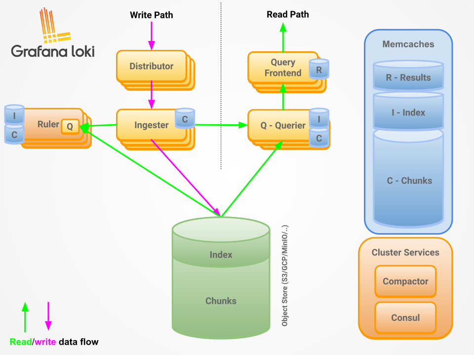

## 相关链接

- [Grafana 文档](https://grafana.com/docs/grafana/latest/#grafana-oss-and-enterprise)
- [Grafana 安装](https://grafana.com/docs/grafana/latest/setup-grafana/installation/)
- [Loki 文档](https://grafana.com/docs/loki/latest/)
- [Loki 安装](https://grafana.com/docs/loki/latest/setup/install/?pg=get&plcmt=selfmanaged-box2-cta1)
- [Promtail 文档](https://grafana.com/docs/loki/latest/send-data/promtail/)
- [Promtail 安装](https://grafana.com/docs/loki/latest/send-data/promtail/installation/)
- 

- [日志收集系统loki+promtail+Grafana 部署](https://cloud.tencent.com/developer/article/1932107)
- [使用 Loki 和 Grafana 进行实时日志监控原创](https://cloud.tencent.com/developer/article/2516108)
- [Loki+promtail+Grafana可视化日志收集](https://blog.csdn.net/weihaoyue/article/details/147096698)
- [再见笨重的ELK！这套轻量级日志收集方案要火！](https://zhuanlan.zhihu.com/p/391302537)
- [探索 Loki：分布式系统的日志聚合解决方案](https://my.oschina.net/emacs_9406799/blog/18506693)
- [LPG（Loki+Promtail+Grafana） 日志收集系统实践和踩坑经历](https://blog.csdn.net/csdnyf/article/details/125723027)
- [现代化日志解决方案 PLG （Promtail +Loki + Grafana ）](https://cloud.tencent.com/developer/article/2345258)
- [现代化日志解决方案 PLG （Promtail +Loki + Grafana ）](https://developer.aliyun.com/article/1353016)
- [运维-6-采用LPG搭建轻量级日志收集系统](https://blog.csdn.net/qq_20466211/article/details/140696271)
- [搭建一个 Grafana 全家桶集群（四）：日志收集](https://zhuanlan.zhihu.com/p/594332765)
- [轻量级的日志聚合和可视化查询分析系统Grafana+Loki+Promtail](https://zhuanlan.zhihu.com/p/964849570)

- [Docker上部署LPG（loki+promtail+grafana）踩坑复盘](https://blog.csdn.net/Sky_True/article/details/136570914)
- [LPG（Loki+Promtail+Grafana） 日志收集系统实践和踩坑经历](https://blog.csdn.net/csdnYF/article/details/125723027)
- [日志收集系统loki+promtail+Grafana部署](https://zhuanlan.zhihu.com/p/639304209)
- [Loki + Promtail + Grafana完成分布式日志收集](http://yunxue521.top/archives/lokipromtailgrafana-wan-cheng-fen-bu-shi-ri-zhi-shou-ji)

## 整体架构
Loki是受Prometheus启发由Grafana Labs团队开源的水平可扩展，高度可用的多租户日志聚合系统。 开发语言: Google Go。它的设计具有很高的成本效益，并且易于操作。使用标签来作为索引，而不是对全文进行检索，也就是说，你通过这些标签既可以查询日志的内容也可以查询到监控的数据签，极大地降低了日志索引的存储。

Loki系统架构十分简单，由以下3个部分组成 ：

- Promtail 是代理，负责收集日志并将其发送给 loki 。

- Loki 是主服务器，负责存储日志和处理查询 。

- Grafana 用于 UI 展示。


只要在应用程序服务器上安装promtail来收集日志然后发送给Loki存储，就可以在Grafana UI界面通过添加Loki为数据源进行日志查询（如果Loki服务器性能不够，可以部署多个Loki进行存储及查询）。

作为一个日志系统不光只有查询分析日志的能力，还能对日志进行监控和报警。



## 环境准备

| 名称       | IP              | 服务                           |
| ---------- | --------------- | ------------------------------ |
| 日志服务器 | 192.168.137.121 | Grafana + Loki                 |
| 应用服务器 | 192.168.137.132 | Spring Boot Service + Promtail |
| 应用服务器 | 192.168.137.132 | Nginx  + Promtail              |

| 应用               | 版本   |
| ------------------ | ------ |
| Loki               | 3.5.1  |
| Promtail           | 3.5.1  |
| Grafana            | 12.0.1 |
| Grafana-Enterprise | 12.0.1 |

## 二进制安装
- [日志收集系统PLG（Promtail+Loki+Grafana）介绍及部署](https://www.cnblogs.com/xiangpeng/p/18127120)
- [Grafana 二进制安装](https://grafana.com/docs/grafana/latest/setup-grafana/installation/redhat-rhel-fedora/#install-grafana-as-a-standalone-binary)
- [Loki 二进制安装](https://grafana.com/docs/loki/latest/setup/install/local/#install-manually)
- [Promtail 二进制安装](https://grafana.com/docs/loki/latest/send-data/promtail/installation/#install-the-binary)

### 1. 下载二进制源码包
```shell
mkdir -p /root/grafana && cd /root/grafana

# 下载二进制包
wget https://github.com/grafana/loki/releases/download/v3.5.1/loki-linux-amd64.zip          -O loki-linux-amd64.zip
wget https://github.com/grafana/loki/releases/download/v3.5.1/promtail-linux-amd64.zip      -O promtail-linux-amd64.zip
wget https://dl.grafana.com/enterprise/release/grafana-enterprise-12.0.1.linux-amd64.tar.gz -O grafana-enterprise-12.0.1.linux-amd64.tar.gz

# 下载配置文件
wget https://raw.githubusercontent.com/grafana/loki/v3.5.1/cmd/loki/loki-local-config.yaml -O loki-local-config.yaml
wget https://raw.githubusercontent.com/grafana/loki/v3.5.1/clients/cmd/promtail/promtail-local-config.yaml -O promtail-local-config.yaml

```

### 2. Loki安装

1. 安装运行

```shell
# 创建安装目录及数据目录
mkdir -p /usr/local/loki
mkdir -p /data/loki/{index,chunks,rules}

# 解压
unzip /root/grafana/loki-linux-amd64.zip -d /usr/local/loki

# 配置文件
cp /root/grafana/loki-local-config.yaml /usr/local/loki/loki-config.yaml

# 测试运行
cd /usr/local/loki
./loki-linux-amd64 -config.file=loki-local-config.yaml

# 官方仓库中 v3.5.1 的配置文件有问题，无法运行

```

2. 配置文件 `loki-config.yaml`

```yaml
auth_enabled: false

server:
  http_listen_port: 3100
  grpc_listen_port: 9096
  log_level: debug
  grpc_server_max_concurrent_streams: 1000

common:
  instance_addr: 127.0.0.1
  path_prefix: /tmp/loki
  storage:
    filesystem:
      chunks_directory: /tmp/loki/chunks
      rules_directory: /tmp/loki/rules
  replication_factor: 1
  ring:
    kvstore:
      store: inmemory

query_range:
  results_cache:
    cache:
      embedded_cache:
        enabled: true
        max_size_mb: 100

limits_config:
  metric_aggregation_enabled: true
  enable_multi_variant_queries: true

schema_config:
  configs:
    - from: 2020-10-24
      store: tsdb
      object_store: filesystem
      schema: v13
      index:
        prefix: index_
        period: 24h

pattern_ingester:
  enabled: true
  metric_aggregation:
    loki_address: localhost:3100

ruler:
  alertmanager_url: http://localhost:9093

frontend:
  encoding: protobuf


# By default, Loki will send anonymous, but uniquely-identifiable usage and configuration
# analytics to Grafana Labs. These statistics are sent to https://stats.grafana.org/
#
# Statistics help us better understand how Loki is used, and they show us performance
# levels for most users. This helps us prioritize features and documentation.
# For more information on what's sent, look at
# https://github.com/grafana/loki/blob/main/pkg/analytics/stats.go
# Refer to the buildReport method to see what goes into a report.
#
# If you would like to disable reporting, uncomment the following lines:
#analytics:
#  reporting_enabled: false

```

3. 启停脚本

```shell
# 启动脚本
cat > startup.sh << 'EOF'
#!/bin/bash
nohup ./loki-linux-amd64 -config.file=./loki-config.yaml >./loki.log 2>&1 &
echo "$!" > pid
EOF

# 停止脚本
cat > shutdown.sh << 'EOF'
#!/bin/bash
kill -9 `cat pid`
echo "关闭成功!"
EOF

# 脚本添加执行权限
chmod +x startup.sh shutdown.sh

```

4. 可以用浏览器打开Loki指标页面 
- http://192.168.137.141:3100/metrics


### 3. Promtail安装

1. 安装运行

```shell
# 创建安装目录及数据目录
mkdir -p /usr/local/promtail
mkdir -p /data/promtail/

# 解压
unzip /root/grafana/promtail-linux-amd64.zip -d /usr/local/promtail

# 配置文件
cp /root/grafana/promtail-local-config.yaml /usr/local/promtail/promtail-config.yaml

# 运行
cd /usr/local/promtail
./promtail-linux-amd64 -config.file=promtail-config.yaml

```

2. 配置文件 `promtail-config.yaml`

```yaml
server:
  http_listen_port: 9080
  grpc_listen_port: 0

positions:
  filename: /tmp/positions.yaml

clients:
  - url: http://localhost:3100/loki/api/v1/push

scrape_configs:
- job_name: system
  static_configs:
  - targets:
      - localhost
    labels:
      job: varlogs
      __path__: /var/log/*log
      stream: stdout

```

3. 启停脚本

```shell
# 启动脚本
cat > startup.sh << 'EOF'
#!/bin/bash
nohup ./promtail-linux-amd64 -config.file=promtail-config.yaml >./promtail.log 2>&1 &
echo "$!" > pid
EOF

# 停止脚本
cat > shutdown.sh << 'EOF'
#!/bin/bash
kill -9 `cat pid`
echo "关闭成功!"
EOF

# 脚本添加执行权限
chmod +x startup.sh shutdown.sh

```

### 4. Grafana安装

```shell
# 创建安装目录及数据目录
mkdir -p /usr/local/grafana
mkdir -p /data/grafana/

# 解压
tar -zxvf /root/grafana/grafana-enterprise-12.0.1.linux-amd64.tar.gz -C /usr/local/grafana

# 运行
cd /usr/local/grafana/grafana-v12.0.1
./bin/grafana server --config=./conf/defaults.ini --pidfile=./grafana.pid

```

2. 配置文件 `conf/default.ini`

3. 启停脚本

```shell
# 启动脚本
cat > startup.sh << 'EOF'
#!/bin/bash
nohup ./bin/grafana server --config=./conf/defaults.ini --pidfile=./grafana.pid >./grafana.log 2>&1 &
echo "$!" > pid
EOF

# 停止脚本
cat > shutdown.sh << 'EOF'
#!/bin/bash
kill -9 `cat pid`
echo "关闭成功!"
EOF

# 脚本添加执行权限
chmod +x startup.sh shutdown.sh

```

4. 可以用浏览器打开Grafana指标页面 
- http://192.168.137.141:3000
- admin / admin


### 5. 测试
1. 添加 Loki 数据源，配置Loki的http地址


2. 点击 `Save & test` 测试连接，按钮上方弹出连接成功提示


3. 打开Explore，测试数据查询


## Docker安装

- [Grafana Docker安装](https://grafana.com/docs/grafana/latest/setup-grafana/installation/docker/)
- [Loki Docker安装](https://grafana.com/docs/loki/latest/setup/install/docker/)
- [Promtail Docker安装](https://grafana.com/docs/loki/latest/send-data/promtail/installation/#install-using-docker)

### 1. 拉取Docker镜像

```shell
# 拉取镜像
docker pull grafana/loki:3.5.1
docker pull grafana/promtail:3.5.1
docker pull grafana/grafana:12.0.1
docker pull grafana/grafana-enterprise:12.0.1

# 导出镜像
docker save grafana/loki:3.5.1      -o ./grafana_loki_3.5.1.tar
docker save grafana/promtail:3.5.1  -o ./grafana_promtail_3.5.1.tar
docker save grafana/grafana:12.0.1  -o ./grafana_grafana_12.0.1.tar
docker save grafana/grafana-enterprise:12.0.1 -o ./grafana_grafana-enterprise_12.0.1.tar

# 加载镜像
docker load -i ./grafana_loki_3.5.1.tar
docker load -i ./grafana_promtail_3.5.1.tar
docker load -i ./grafana_grafana_12.0.1.tar
docker load -i ./grafana_grafana-enterprise_12.0.1.tar

```

### 2. 下载默认配置文件
```shell
# 下载配置文件
mkdir -p /root/grafana && cd /root/grafana
wget https://raw.githubusercontent.com/grafana/loki/v3.5.1/cmd/loki/loki-local-config.yaml -O loki-local-config.yaml
wget https://raw.githubusercontent.com/grafana/loki/v3.5.1/clients/cmd/promtail/promtail-docker-config.yaml -O promtail-docker-config.yaml
wget https://raw.githubusercontent.com/grafana/loki/v3.5.1/production/docker-compose.yaml -O docker-compose.yaml

# 复制配置文件到目标路径
mkdir -p /etc/{loki,promtail,grafana}
cp /root/grafana/loki-local-config.yaml       /etc/loki/local-config.yaml
cp /root/grafana/promtail-docker-config.yaml  /etc/promtail/config.yaml

```

### 3. 准备配置文件
1. Loki配置文件 `/etc/loki/local-config.yaml`

```yaml
auth_enabled: false

server:
  http_listen_port: 3100
  grpc_listen_port: 9096
  log_level: debug
  grpc_server_max_concurrent_streams: 1000

common:
  instance_addr: 127.0.0.1
  path_prefix: /tmp/loki
  storage:
    filesystem:
      chunks_directory: /tmp/loki/chunks
      rules_directory: /tmp/loki/rules
  replication_factor: 1
  ring:
    kvstore:
      store: inmemory

query_range:
  results_cache:
    cache:
      embedded_cache:
        enabled: true
        max_size_mb: 100

limits_config:
  metric_aggregation_enabled: true
  enable_multi_variant_queries: true

schema_config:
  configs:
    - from: 2020-10-24
      store: tsdb
      object_store: filesystem
      schema: v13
      index:
        prefix: index_
        period: 24h

pattern_ingester:
  enabled: true
  metric_aggregation:
    loki_address: localhost:3100

ruler:
  alertmanager_url: http://localhost:9093

frontend:
  encoding: protobuf


# By default, Loki will send anonymous, but uniquely-identifiable usage and configuration
# analytics to Grafana Labs. These statistics are sent to https://stats.grafana.org/
#
# Statistics help us better understand how Loki is used, and they show us performance
# levels for most users. This helps us prioritize features and documentation.
# For more information on what's sent, look at
# https://github.com/grafana/loki/blob/main/pkg/analytics/stats.go
# Refer to the buildReport method to see what goes into a report.
#
# If you would like to disable reporting, uncomment the following lines:
#analytics:
#  reporting_enabled: false

```

2. Promtail配置文件 `/etc/promtail/config.yaml`

```yaml
server:
  http_listen_port: 9080
  grpc_listen_port: 0

positions:
  filename: /tmp/positions.yaml

clients:
  - url: http://loki:3100/loki/api/v1/push

scrape_configs:
- job_name: system
  static_configs:
  - targets:
      - localhost
    labels:
      job: varlogs
      __path__: /var/log/*log

```

### 4. Docker Compose文件

```yaml
version: "3.3"

networks:
  loki:

services:
  loki:
    image: grafana/loki:3.5.1
    ports:
      - "3100:3100"
    volumes:
      - /etc/loki/local-config.yaml:/etc/loki/local-config.yaml
    command: -config.file=/etc/loki/local-config.yaml
    networks:
      - loki

  promtail:
    image: grafana/promtail:3.5.1
    volumes:
      - /var/log:/var/log
      - /etc/promtail/config.yml:/etc/promtail/config.yml
    command: -config.file=/etc/promtail/config.yml
    networks:
      - loki

  grafana:
    environment:
      - GF_PATHS_PROVISIONING=/etc/grafana/provisioning
      - GF_AUTH_ANONYMOUS_ENABLED=true
      - GF_AUTH_ANONYMOUS_ORG_ROLE=Admin
      - GF_FEATURE_TOGGLES_ENABLE=alertingSimplifiedRouting,alertingQueryAndExpressionsStepMode
    entrypoint:
      - sh
      - -euc
      - |
        mkdir -p /etc/grafana/provisioning/datasources
        cat <<EOF > /etc/grafana/provisioning/datasources/ds.yaml
        apiVersion: 1
        datasources:
        - name: Loki
          type: loki
          access: proxy 
          orgId: 1
          url: http://loki:3100
          basicAuth: false
          isDefault: true
          version: 1
          editable: false
        EOF
        /run.sh
    image: grafana/grafana:12.0.1
    ports:
      - "3000:3000"
    networks:
      - loki

```

### 5. 启动容器
```shell
# 启动
docker compose -f docker-compose.yaml up -d 

# 停止
docker compose -f docker-compose.yaml down

```

### 6. 测试
1. 查看Loki监控指标
- http://192.168.137.142:3100/metrics


2. 查看Grafana数据源
- http://192.168.137.142:3000/
- admin / admin


## Kubernetes安装
- [Loki使用示例：针对部署在K8s中的Java应用的日志捕获Promtail配置示例](https://blog.csdn.net/a772304419/article/details/136977086)
- [Grafana Kubernetes安装](https://grafana.com/docs/grafana/latest/setup-grafana/installation/kubernetes/)
- [Loki Helm安装](https://grafana.com/docs/loki/latest/setup/install/helm/install-monolithic/)
- [Promtail Kubernetes daemonSet 安装](https://grafana.com/docs/loki/latest/send-data/promtail/installation/#install-as-kubernetes-daemonset-recommended)

K8s安装Loki + Promtail + Grafana 所需资源较多(对于一个3节点的K8s集群，需要启动11个Loki相关Pod)，对于低负载的场景，建议直接使用Docker部署Loki和Grafana，仅将Promtail部署到K8s Daemonset。

### 1. Kubernetes安装Loki
由于微服务形式(16节点或服务)和自动伸缩式（12个节点或服务）的所需Loki节点较多，此处采用单片模式

#### 单副本部署配置文件 `loki-values.yaml`
- Loki (1 replica)
- Loki Canary (1 DaemonSet)
- Loki Gateway (1 NGINX replica)
- Loki Chunk and Result Cache (1 DaemonSet)
- Minio (optional, if `minio.enabled=true`)

```yaml
loki:
  commonConfig:
    replication_factor: 1
  schemaConfig:
    configs:
      - from: "2024-04-01"
        store: tsdb
        object_store: s3
        schema: v13
        index:
          prefix: loki_index_
          period: 24h
  pattern_ingester:
      enabled: true
  limits_config:
    allow_structured_metadata: true
    volume_enabled: true
  ruler:
    enable_api: true

minio:
  enabled: true
      
deploymentMode: SingleBinary

singleBinary:
  replicas: 1

# Zero out replica counts of other deployment modes
backend:
  replicas: 0
read:
  replicas: 0
write:
  replicas: 0

ingester:
  replicas: 0
querier:
  replicas: 0
queryFrontend:
  replicas: 0
queryScheduler:
  replicas: 0
distributor:
  replicas: 0
compactor:
  replicas: 0
indexGateway:
  replicas: 0
bloomCompactor:
  replicas: 0
bloomGateway:
  replicas: 0

```

#### 多副本部署配置文件 `loki-values.yaml`
- Loki (3 replicas)
- Loki Canary (1 DaemonSet)
- Loki Gateway (1 NGINX replica)
- Loki Chunk and Result Cache (1 DaemonSet)
- Minio (optional, if `minio.enabled=true`)

```yaml
loki:
  commonConfig:
    replication_factor: 3
  schemaConfig:
    configs:
      - from: "2024-04-01"
        store: tsdb
        object_store: s3
        schema: v13
        index:
          prefix: loki_index_
          period: 24h
  pattern_ingester:
      enabled: true
  limits_config:
    allow_structured_metadata: true
    volume_enabled: true
  ruler:
    enable_api: true

minio:
  enabled: true

# 修改 memcached 的内存，避免因内存不足导致启动失败（values.yaml中默认配置为8192）
chunksCache:
  allocatedMemory: 1024

deploymentMode: SingleBinary

singleBinary:
  replicas: 3

# Zero out replica counts of other deployment modes
backend:
  replicas: 0
read:
  replicas: 0
write:
  replicas: 0

ingester:
  replicas: 0
querier:
  replicas: 0
queryFrontend:
  replicas: 0
queryScheduler:
  replicas: 0
distributor:
  replicas: 0
compactor:
  replicas: 0
indexGateway:
  replicas: 0
bloomCompactor:
  replicas: 0
bloomGateway:
  replicas: 0

```

#### 添加Grafana Chart到Helm

```shell
# 查看helm版本
helm version

# 如果添加仓库失败可以添加代理
export http_proxy=http://192.168.137.1:4780
export https_proxy=http://192.168.137.1:4780

# 添加chart仓库
helm repo add grafana https://grafana.github.io/helm-charts

# 更新chart仓库
helm repo update

# 查看添加完成后的仓库
helm repo list

# 查询loki的chart
helm search repo loki

# 新建文件夹用于保存chart
mkdir loki-chart && cd loki-chart

# 拉取chart
helm pull grafana/loki
# 拉取较慢，可以直接从github下载
# wget https://github.com/grafana/helm-charts/releases/download/helm-loki-6.30.1/loki-6.30.1.tgz
# wget https://github.com/minio/minio/blob/master/helm-releases/minio-5.4.0.tgz

# 此时会有一个压缩包，默认下载的是最新版本，可能与Grafana版本不兼容，需要去github确认
tar -zxvf loki-6.30.1.tgz -C ~/

# 进入到解压后的文件夹
cd ~/loki

# 查看默认的配置文件
vim values.yaml

```

#### 安装Loki
由于默认的配置文件属性较多，这里安装时使用 `loki-values.yaml` 来覆盖部分默认的配置项，其余的属性依然是默认配置文件 `values.yaml` 中的 

**注意**
如果启用了minio，则会从 `https://github.com/minio/minio/blob/master/helm/minio/values.yaml` 仓库加载minio的配置

```shell
# 安装时需要从docker仓库拉取镜像，可以提前准备好
docker pull grafana/loki:3.5.0
docker pull grafana/loki-canary:3.5.0
docker pull grafana/enterprise-logs:3.5.1
docker pull grafana/loki-helm-test:ewelch-distributed-helm-chart-17db5ee
docker pull nginxinc/nginx-unprivileged:1.28-alpine
docker pull quay.io/minio/minio:RELEASE.2024-12-18T13-15-44Z
docker pull memcached:1.6.38-alpine
docker pull prom/memcached-exporter:v0.15.2
docker pull kiwigrid/k8s-sidecar:1.30.3

# 拉取镜像较慢，可以设置本地代理
export HTTP_PROXY=http://192.168.137.1:4780
export HTTPS_PROXY=http://192.168.137.1:4780

# 安装Loki，在 loki-values.yaml 所在目录执行，从服务器下载 loki-6.30.1.tgz 安装包
# helm install loki grafana/loki --create-namespace --namespace loki -f loki-values.yaml

# 安装Loki，在 loki-6.30.1.tgz 解压目录执行，需要将 loki-values.yaml 复制到改目录
helm install loki . --create-namespace --namespace loki -f loki-values.yaml

# 升级Loki
helm upgrade loki grafana/loki -f loki-values.yaml

# 查看Helm部署的资源
helm ls --namespace loki

```

#### 检查Loki状态

```shell
# 查看Loki pod
kubectl get pods -n loki -o wide

# 查看服务端口信息
kubectl get svc -n loki

# 查看节点Pending原因
kubectl describe pod loki-0 -n loki
kubectl describe pod loki-minio-0 -n loki
kubectl describe pod loki-chunks-cache-0 -n loki

# 卸载Loki
helm uninstall loki --namespace loki

```

### 2. 将Promtail安装为Kubernetes Daemonset
- [什么是Kubernetes DaemonSet，如何使用？](https://www.51cto.com/article/782444.html)
将Promtail安装为Kubernetes Daemonset将会在K8s集群的每个节点上部署 Promtail

这个DaemonSet会收集K8s集群中所有容器的日志，这是单租户模型的最佳解决方案。将其中的 `{YOUR_LOKI_ENDPOINT}` 替换为上面部署的Loki端点地址

```yaml
--- # Daemonset.yaml
apiVersion: apps/v1
kind: DaemonSet
metadata:
  name: promtail-daemonset
spec:
  selector:
    matchLabels:
      name: promtail
  template:
    metadata:
      labels:
        name: promtail
    spec:
      serviceAccount: promtail-serviceaccount
      containers:
      - name: promtail-container
        image: grafana/promtail
        args:
        - -config.file=/etc/promtail/promtail.yaml
        env: 
        - name: 'HOSTNAME' # needed when using kubernetes_sd_configs
          valueFrom:
            fieldRef:
              fieldPath: 'spec.nodeName'
        volumeMounts:
        - name: logs
          mountPath: /var/log
        - name: promtail-config
          mountPath: /etc/promtail
        - mountPath: /var/lib/docker/containers
          name: varlibdockercontainers
          readOnly: true
      volumes:
      - name: logs
        hostPath:
          path: /var/log
      - name: varlibdockercontainers
        hostPath:
          path: /var/lib/docker/containers
      - name: promtail-config
        configMap:
          name: promtail-config
--- # configmap.yaml
apiVersion: v1
kind: ConfigMap
metadata:
  name: promtail-config
data:
  promtail.yaml: |
    server:
      http_listen_port: 9080
      grpc_listen_port: 0

    clients:
    - url: https://{YOUR_LOKI_ENDPOINT}/loki/api/v1/push

    positions:
      filename: /tmp/positions.yaml
    target_config:
      sync_period: 10s
    scrape_configs:
    - job_name: pod-logs
      kubernetes_sd_configs:
        - role: pod
      pipeline_stages:
        - docker: {}
      relabel_configs:
        - source_labels:
            - __meta_kubernetes_pod_node_name
          target_label: __host__
        - action: labelmap
          regex: __meta_kubernetes_pod_label_(.+)
        - action: replace
          replacement: $1
          separator: /
          source_labels:
            - __meta_kubernetes_namespace
            - __meta_kubernetes_pod_name
          target_label: job
        - action: replace
          source_labels:
            - __meta_kubernetes_namespace
          target_label: namespace
        - action: replace
          source_labels:
            - __meta_kubernetes_pod_name
          target_label: pod
        - action: replace
          source_labels:
            - __meta_kubernetes_pod_container_name
          target_label: container
        - replacement: /var/log/pods/*$1/$2/*.log # $1=pod_uid, $2=container_name
          separator: /
          source_labels:
            - __meta_kubernetes_pod_uid
            - __meta_kubernetes_pod_container_name
          target_label: __path__

--- # Clusterrole.yaml
apiVersion: rbac.authorization.k8s.io/v1
kind: ClusterRole
metadata:
  name: promtail-clusterrole
rules:
  - apiGroups: [""]
    resources:
    - nodes
    - services
    - pods
    verbs:
    - get
    - watch
    - list

--- # ServiceAccount.yaml
apiVersion: v1
kind: ServiceAccount
metadata:
  name: promtail-serviceaccount

--- # Rolebinding.yaml
apiVersion: rbac.authorization.k8s.io/v1
kind: ClusterRoleBinding
metadata:
  name: promtail-clusterrolebinding
subjects:
    - kind: ServiceAccount
      name: promtail-serviceaccount
      namespace: default
roleRef:
    kind: ClusterRole
    name: promtail-clusterrole
    apiGroup: rbac.authorization.k8s.io

```

部署和查询Daemonset
```shell
# 部署 Promtail DaemonSet 
kubectl apply -f promtail-daemonset.yaml

# 查询出 Pod 以及它们部署到的节点
kubectl get pods -l name=promtail -o wide

# 查询DaemonSet 的信息
kubectl get daemonset

# 删除Daemonset
kubectl delete daemonset/promtail-daemonset

# 查看Daemonset状态及异常原因
kubectl describe pod promtail-daemonset-8d5gv

# 查看配置文件
kubectl exec -it promtail-daemonset-8d5gv -n default -- cat /etc/promtail/promtail.yaml

```

### 3. Kubernetes安装Grafana

1. 创建命名空间

```shell
# 创建命名空间
kubectl create namespace grafana

# 查看
kubectl get namespace grafana

```

2. 创建部署配置文件 `grafana.yaml`

```yaml
---
apiVersion: v1
kind: PersistentVolumeClaim
metadata:
  name: grafana-pvc
spec:
  accessModes:
    - ReadWriteOnce
  resources:
    requests:
      storage: 1Gi
---
apiVersion: apps/v1
kind: Deployment
metadata:
  labels:
    app: grafana
  name: grafana
spec:
  selector:
    matchLabels:
      app: grafana
  template:
    metadata:
      labels:
        app: grafana
    spec:
      securityContext:
        fsGroup: 472
        supplementalGroups:
          - 0
      containers:
        - name: grafana
          image: grafana/grafana:latest
          imagePullPolicy: IfNotPresent
          ports:
            - containerPort: 3000
              name: http-grafana
              protocol: TCP
          readinessProbe:
            failureThreshold: 3
            httpGet:
              path: /robots.txt
              port: 3000
              scheme: HTTP
            initialDelaySeconds: 10
            periodSeconds: 30
            successThreshold: 1
            timeoutSeconds: 2
          livenessProbe:
            failureThreshold: 3
            initialDelaySeconds: 30
            periodSeconds: 10
            successThreshold: 1
            tcpSocket:
              port: 3000
            timeoutSeconds: 1
          resources:
            requests:
              cpu: 250m
              memory: 750Mi
          volumeMounts:
            - mountPath: /var/lib/grafana
              name: grafana-pv
      volumes:
        - name: grafana-pv
          persistentVolumeClaim:
            claimName: grafana-pvc
---
apiVersion: v1
kind: Service
metadata:
  name: grafana
spec:
  ports:
    - port: 3000
      protocol: TCP
      targetPort: http-grafana
  selector:
    app: grafana
  sessionAffinity: None
  type: LoadBalancer

```

3. 部署服务，创建PVC Deployment Services

| Object                        | Description                                                                                                                   |
| ----------------------------- | ----------------------------------------------------------------------------------------------------------------------------- |
| Persistent Volume Claim (PVC) | This object stores the data.                                                                                                  |
| Service                       | This object provides network access to the Pod defined in the deployment.                                                     |
| Deployment                    | This object is responsible for creating the pods, ensuring they stay up to date, and managing Replicaset and Rolling updates. |

```shell
# 部署
kubectl apply -f grafana.yaml --namespace=grafana

# 查看
kubectl get pvc --namespace=grafana -o wide
kubectl get deployments --namespace=grafana -o wide
kubectl get svc --namespace=grafana -o wide

```

```shell
# 查看服务部署情况，记录 EXTERNAL-IP，即Grafana的访问地址
kubectl get all --namespace=grafana

# 如果不想使用 EXTERNAL-IP ，执行下面命令将端口转发到节点端口上
kubectl port-forward service/grafana 3000:3000 --namespace=grafana

```

## 项目日志收集实操
1. Docker Compose 部署 Loki + Grafana
2. K8s DaemonSet 部署 Promtail
3. K8s 部署Spring Boot应用
4. 本地部署 Spring Boot Jar包
5. 本地部署 Nginx
6. Promtail 收集本地日志
7. Grafana 面板查看日志

### 1. 部署Loki + Grafana

#### Docker Compose 部署
Docker Compose配置文件 `docker-compose.yaml`

```yaml
version: "3.3"

networks:
  loki:

services:
  loki:
    image: grafana/loki:3.5.1
    ports:
      - "3100:3100"
    command: -config.file=/etc/loki/local-config.yaml
    environment:
      - TZ=Asia/Shanghai
    networks:
      - loki
    
#  promtail:
#    image: grafana/promtail:3.5.1
#    volumes:
#      - /var/log:/var/log
#    command: -config.file=/etc/promtail/config.yml
#    networks:
#      - loki

  grafana:
    environment:
      - GF_PATHS_PROVISIONING=/etc/grafana/provisioning
      - GF_AUTH_ANONYMOUS_ENABLED=true
      - GF_AUTH_ANONYMOUS_ORG_ROLE=Admin
      - GF_FEATURE_TOGGLES_ENABLE=alertingSimplifiedRouting,alertingQueryAndExpressionsStepMode
      - TZ=Asia/Shanghai
    entrypoint:
      - sh
      - -euc
      - |
        mkdir -p /etc/grafana/provisioning/datasources
        cat <<EOF > /etc/grafana/provisioning/datasources/ds.yaml
        apiVersion: 1
        datasources:
        - name: Loki
          type: loki
          access: proxy 
          orgId: 1
          url: http://loki:3100
          basicAuth: false
          isDefault: true
          version: 1
          editable: false
        EOF
        /run.sh
    image: grafana/grafana:12.0.1
    ports:
      - "3000:3000"
    networks:
      - loki

```

部署Loki Grafana

```shell
# 启动
docker compose -f docker-compose.yaml up -d

# 停止
docker compose -f docker-compose.yaml down

```

- 浏览器访问Loki监控指标页面 
  - `http://192.168.137.121:3100/metrics`
- 浏览器访问Grafana页面 
  - `http://192.168.137.121:3000`
  - `admin` / `admin`

#### K8s部署
- [Kubernetes平台部署Grafana Loki Promtail系统](https://blog.csdn.net/ichen820/article/details/134287977)
- [在k8s中利用Helm部署Prometheus+Grafana和Loki日志系统](https://blog.csdn.net/sinat_30893849/article/details/145747445)

Kubernetes 资源定义文件 `loki-grafana.yaml`

```yaml
# Namespace定义
apiVersion: v1
kind: Namespace
metadata:
  name: lpg
---

# Grafana 服务定义
apiVersion: v1
kind: Service
metadata:
  name: grafana
  labels:
    app: grafana
  namespace: lpg
spec:
  type: NodePort
  ports:
  - port: 3000
    targetPort: http-grafana
    nodePort: 30300
  selector:
    app: grafana
---

# Grafana 部署定义
apiVersion: apps/v1
kind: Deployment
metadata:
  name: grafana
  labels:
    app: grafana
  namespace: lpg
spec:
  replicas: 1
  selector:
    matchLabels:
      app: grafana
  template:
    metadata:
      labels:
        app: grafana
    spec:
      containers:
      - name: grafana
        image: grafana/grafana:12.0.1
        imagePullPolicy: IfNotPresent
        ports:
          - containerPort: 3000
            name: http-grafana
            protocol: TCP
        # 添加安全上下文 0 为 root用户
        securityContext:
          runAsUser: 0
        env:
        - name: GF_AUTH_BASIC_ENABLED
          value: "true"
        - name: GF_AUTH_ANONYMOUS_ENABLED
          value: "false"
        readinessProbe:
          failureThreshold: 3
          httpGet:
            path: /robots.txt
            port: 3000
            scheme: HTTP
          initialDelaySeconds: 10
          periodSeconds: 30
          successThreshold: 1
          timeoutSeconds: 2
        livenessProbe:
          failureThreshold: 3
          initialDelaySeconds: 30
          periodSeconds: 10
          successThreshold: 1
          tcpSocket:
            port: 3000
          timeoutSeconds: 1
        resources:
          requests:
            cpu: 250m
            memory: 250Mi
          limits:
            cpu: '1'
            memory: 2Gi
        volumeMounts:
        - name: storage
          mountPath: /var/lib/grafana
      volumes:
      - name: storage
        hostPath:
          path: /home/diginn/lpg/grafana
---

# Loki 账号定义
apiVersion: v1
kind: ServiceAccount
metadata:
  name: loki
  namespace: lpg
---

# Loki 角色定义
apiVersion: rbac.authorization.k8s.io/v1
kind: Role
metadata:
  name: loki
  namespace: lpg
rules:
- apiGroups: ["extensions"]
  resources: ["podsecuritypolicies"]
  verbs: ["use"]
  resourceNames: [loki]
---

# Loki 角色绑定定义
apiVersion: rbac.authorization.k8s.io/v1
kind: RoleBinding
metadata:
  name: loki
  namespace: lpg
roleRef:
  apiGroup: rbac.authorization.k8s.io
  kind: Role
  name: loki
subjects:
- kind: ServiceAccount
  name: loki
---

# Loki配置文件
apiVersion: v1
kind: ConfigMap
metadata:
  name: loki
  namespace: lpg
  labels:
    app: loki
data:
  loki.yaml: |
    auth_enabled: false

    server:
      http_listen_port: 3100

    common:
      instance_addr: 127.0.0.1
      path_prefix: /data/loki
      storage:
        filesystem:
          chunks_directory: /data/loki/chunks
          rules_directory: /data/loki/rules
      replication_factor: 1
      ring:
        kvstore:
          store: inmemory

    schema_config:
      configs:
        - from: 2020-10-24
          store: tsdb
          object_store: filesystem
          schema: v13
          index:
            prefix: index_
            period: 24h

    ruler:
      alertmanager_url: http://localhost:9093

---

# Loki 服务定义
apiVersion: v1
kind: Service
metadata:
  name: loki
  namespace: lpg
  labels:
    app: loki
spec:
  type: NodePort
  ports:
    - port: 3100
      protocol: TCP
      name: http-metrics
      targetPort: http-metrics
      nodePort: 30310
  selector:
    app: loki
---

# Loki StatefulSet定义
apiVersion: apps/v1
kind: StatefulSet
metadata:
  name: loki
  namespace: lpg
  labels:
    app: loki
spec:
  podManagementPolicy: OrderedReady
  replicas: 1
  selector:
    matchLabels:
      app: loki
  serviceName: loki
  updateStrategy:
    type: RollingUpdate
  template:
    metadata:
      labels:
        app: loki
    spec:
      serviceAccountName: loki
      initContainers:
      - name: chmod-data
        image: busybox:1.28.4
        imagePullPolicy: IfNotPresent
        command: ["chmod","-R","777","/loki/data"]
        volumeMounts:
        - name: storage
          mountPath: /loki/data
      containers:
        - name: loki
          image: grafana/loki:3.5.1
          imagePullPolicy: IfNotPresent
          args:
            - -config.file=/etc/loki/loki.yaml
          ports:
            - name: http-metrics
              containerPort: 3100
              protocol: TCP
          # 添加安全上下文 id
          securityContext:
            runAsUser: 1000
            runAsGroup: 1000
          livenessProbe:
            httpGet: 
              path: /ready
              port: http-metrics
              scheme: HTTP
            initialDelaySeconds: 45
          readinessProbe:
            httpGet: 
              path: /ready
              port: http-metrics
              scheme: HTTP
            initialDelaySeconds: 45
          volumeMounts:
            - name: config
              mountPath: /etc/loki
            - name: storage
              mountPath: /data
      terminationGracePeriodSeconds: 4800
      volumes:
        - name: config
          configMap:
            name: loki
        - name: storage
          hostPath:
            path: /home/diginn/lpg/loki

```

- `*.namespace: lpg`
- `grafana.hostPath.path: /home/diginn/lpg/grafana`
- `grafana.ports[*].port.nodePort: 30300`
- `loki.hostPath.path: /home/diginn/lpg/loki`
- `loki.ports[*].port.nodePort: 30310`

部署资源

```shell
# 创建命名空间
kubectl get ns lpg
kubectl create ns lpg

# 部署
kubectl apply -f loki-grafana.yaml

# 删除
kubectl delete -f loki-grafana.yaml

# 检查 Pod 状态
kubectl get pods -l 'app in (loki, grafana)' -n lpg -o wide 
kubectl get services -n lpg -o wide 

# 查看日志
kubectl logs loki-0 -n lpg
kubectl logs grafana-756cfd5f8f-qdr4k -n lpg

```

- 浏览器访问Loki监控指标页面 
  - `http://192.168.137.121:30310/metrics`
- 浏览器访问Grafana页面 
  - `http://192.168.137.121:30300`
  - `admin` / `admin`

### 2. K8s DaemonSet部署Promtail

Promtail DaemonSet配置文件 `promtail-daemonset.yaml`

```yaml
--- # Daemonset.yaml
apiVersion: apps/v1
kind: DaemonSet
metadata:
  name: promtail-daemonset
spec:
  selector:
    matchLabels:
      name: promtail
  template:
    metadata:
      labels:
        name: promtail
    spec:
      serviceAccount: promtail-serviceaccount
      containers:
      - name: promtail-container
        image: grafana/promtail
        args:
        - -config.file=/etc/promtail/promtail.yaml
        env: 
        - name: 'HOSTNAME' # needed when using kubernetes_sd_configs
          valueFrom:
            fieldRef:
              fieldPath: 'spec.nodeName'
        volumeMounts:
        - name: logs
          mountPath: /var/log
        - name: promtail-config
          mountPath: /etc/promtail
        - mountPath: /var/lib/docker/containers
          name: varlibdockercontainers
          readOnly: true
      volumes:
      - name: logs
        hostPath:
          path: /var/log
      - name: varlibdockercontainers
        hostPath:
          path: /var/lib/docker/containers
      - name: promtail-config
        configMap:
          name: promtail-config
--- # configmap.yaml
apiVersion: v1
kind: ConfigMap
metadata:
  name: promtail-config
data:
  promtail.yaml: |
    server:
      http_listen_port: 9080
      grpc_listen_port: 0

    clients:
    - url: http://192.168.137.121:3100/loki/api/v1/push  # 注意这里的协议为 HTTP，IP 端口为Loki映射的物理机IP 端口
    - url: http://loki.lpg:3100/loki/api/v1/push  # 如果是在同一个K8s中，可以使用 <服务名.命名空间> 例如: loki.lpg

    positions:
      filename: /tmp/positions.yaml
    target_config:
      sync_period: 10s
    scrape_configs:
    - job_name: pod-logs
      kubernetes_sd_configs:
        - role: pod
      pipeline_stages:
        - docker: {}
      relabel_configs:
        # 检查是否有标注为promtail.io/scrape=true的注解，没有注解的pod不采集
        - source_labels: [__meta_kubernetes_pod_annotation_promtail_io_scrape]
          action: keep
          regex: true
        - source_labels:
            - __meta_kubernetes_pod_node_name
          target_label: __host__
        - action: labelmap
          regex: __meta_kubernetes_pod_label_(.+)
        - action: replace
          replacement: $1
          separator: /
          source_labels:
            - __meta_kubernetes_namespace
            - __meta_kubernetes_pod_name
          target_label: job
        - action: replace
          source_labels:
            - __meta_kubernetes_namespace
          target_label: namespace
        - action: replace
          source_labels:
            - __meta_kubernetes_pod_name
          target_label: pod
        - action: replace
          source_labels:
            - __meta_kubernetes_pod_container_name
          target_label: container
        - replacement: /var/log/pods/*$1/$2/*.log # $1=pod_uid, $2=container_name
          separator: /
          source_labels:
            - __meta_kubernetes_pod_uid
            - __meta_kubernetes_pod_container_name
          target_label: __path__

--- # Clusterrole.yaml
apiVersion: rbac.authorization.k8s.io/v1
kind: ClusterRole
metadata:
  name: promtail-clusterrole
rules:
  - apiGroups: [""]
    resources:
    - nodes
    - services
    - pods
    verbs:
    - get
    - watch
    - list

--- # ServiceAccount.yaml
apiVersion: v1
kind: ServiceAccount
metadata:
  name: promtail-serviceaccount

--- # Rolebinding.yaml
apiVersion: rbac.authorization.k8s.io/v1
kind: ClusterRoleBinding
metadata:
  name: promtail-clusterrolebinding
subjects:
    - kind: ServiceAccount
      name: promtail-serviceaccount
      namespace: default
roleRef:
    kind: ClusterRole
    name: promtail-clusterrole
    apiGroup: rbac.authorization.k8s.io

```

Promtail DaemonSet部署

```shell
# 部署 Promtail DaemonSet 
kubectl apply -f promtail-daemonset.yaml

# 删除
kubectl delete -f promtail-daemonset.yaml

# 查询出 Pod 以及它们部署到的节点
kubectl get pods -l name=promtail -o wide

# 查询DaemonSet 的信息
kubectl get daemonset

```

DaemonSet其他相关命令

```shell
# 删除Daemonset
kubectl delete daemonset/promtail-daemonset

# 查看Daemonset状态及异常原因
kubectl describe pod promtail-daemonset-99bhj

# 查看配置文件
kubectl exec -it promtail-daemonset-99bhj -- cat /etc/promtail/promtail.yaml


# 列出所有的 ConfigMap 
kubectl get cm

# 查看 ConfigMap 配置详情
kubectl describe cm promtail-config

# 删除 ConfigMap
kubectl delete cm promtail-config

```

### 3. K8s 部署Spring Boot应用

构建Docker镜像的 `Dockerfile`

```Dockerfile
FROM 192.168.1.210:5000/azul/zulu-openjdk-centos:17-jre-latest
VOLUME /tmp
ADD pd-service-hzpublic.jar /
ENV JAVA_OPTS="-Xms1g -Xmx1g -XX:MetaspaceSize=512m -XX:MaxMetaspaceSize=512m \
           -Duser.timezone=Asia/Shanghai \
           -Dfile.encoding=UTF-8 \
           -Dsun.jnu.encoding=UTF-8 \
           -Djava.awt.headless=true \
           --add-modules java.se \
           --add-opens java.base/java.lang=ALL-UNNAMED \
           --add-opens java.base/sun.nio.ch=ALL-UNNAMED \
           --add-opens java.management/sun.management=ALL-UNNAMED \
           --add-opens jdk.management/com.sun.management.internal=ALL-UNNAMED \
           --add-exports java.base/jdk.internal.ref=ALL-UNNAMED"
ENTRYPOINT java ${JAVA_OPTS} -jar /pd-service-hzpublic.jar

```

应用部署的 `k8s-dev.yaml`

```yaml
apiVersion: v1
kind: Service
metadata:
  name: svc-dz-service-hzpublic
  namespace: hz-dev-service
spec:
  type: NodePort
  selector:
    app: hz-service-hzpublic
  ports:
    - name: http
      port: 31121
      targetPort: 31121
      nodePort: 30121

---
apiVersion: apps/v1
kind: Deployment
metadata:
  name: hz-dev-service-hzpublic
  namespace: hz-dev-service
spec:
  minReadySeconds: 50
  revisionHistoryLimit: 3
  strategy:
    rollingUpdate:
      maxSurge: 1
      maxUnavailable: 0
  replicas: 1
  selector:
    matchLabels:
      app: hz-service-hzpublic
      version: "1.0.0"
  template:
    metadata:
      labels:
        app: hz-service-hzpublic
        version: "1.0.0"
      annotations:
        promtail.io/scrape: "true" # promtail筛选标签，需要设置scrape为true
        promtail.io/path: "/logs/pd-service-hzpublic-all.log" # 日志文件的路径名称
    spec:
      imagePullSecrets:
        - name: pisxdocker
      containers:
        - name: hz-service-hzpublic
          image: 192.168.1.210:5000/library/pd-service-hzpublic:lpg-1.0.0
          imagePullPolicy: IfNotPresent
          ports:
            - containerPort: 31121
          volumeMounts:
            - name: logs-hz-service-hzpublic
              mountPath: /logs
          # 启动探针，检测系统是否启动成功
          startupProbe:
            httpGet:
              path: /hzpublic/actuator/health/readiness
              port: 31121
            periodSeconds: 10 # 探测时间间隔
            timeoutSeconds: 5 # 超时时间
            failureThreshold: 30 # 重试次数
          # 存活探针，检测系统是否存活
          livenessProbe:
            httpGet:
              path: /hzpublic/actuator/health/liveness
              port: 31121
            initialDelaySeconds: 30
            periodSeconds: 10
            timeoutSeconds: 20
            failureThreshold: 5
          resources:
            limits:
              cpu: "2"
              memory: "2048Mi"
              ephemeral-storage: "2Gi"
            requests:
              cpu: "0.2"
              memory: "1024Mi"
          env:
            - name: TZ
              value: 'Asia/Shanghai'
      volumes:
        - name: logs-hz-service-hzpublic
          hostPath:
            path: /data/logs

```

编译镜像并使用K8s部署应用

```shell
# 拉取基础镜像
docker pull azul/zulu-openjdk-centos:17-jre-latest

# 重新打tag
docker tag azul/zulu-openjdk-centos:17-jre-latest 192.168.1.210:5000/azul/zulu-openjdk-centos:17-jre-latest

# 构建镜像
docker build -t 192.168.1.210:5000/library/pd-service-hzpublic:lpg-1.0.0 .

# 导出镜像
docker save 192.168.1.210:5000/library/pd-service-hzpublic:lpg-1.0.0 -o pd-service-hzpublic_lpg-1.0.0.tar

# 发送到集群其他节点
scp zulu-openjdk-centos_17-jre-latest.tar diginn@192.168.137.122:/home/diginn
scp pd-service-hzpublic_lpg-1.0.0.tar diginn@192.168.137.122:/home/diginn

# 在集群其他节点导入镜像
docker load -i zulu-openjdk-centos_17-jre-latest.tar
docker load -i pd-service-hzpublic_lpg-1.0.0.tar

# 创建命名空间
kubectl create namespace hz-dev-service
kubectl get namespace hz-dev-service

# 如有需要，先删除再部署服务
kubectl delete -f k8s-dev.yaml
kubectl apply -f k8s-dev.yaml

# 查询Pod
kubectl get pods -n hz-dev-service -o wide

# 查询pod详细信息
kubectl describe pod hz-dev-service-hzpublic-78b6f468cd-x6zjb -n hz-dev-service

# 进入命令行交互模式，查看日志文件的位置
kubectl exec -it hz-dev-service-hzpublic-78b6f468cd-x6zjb -n hz-dev-service -- /bin/bash

```

### 4. 本地部署 Spring Boot Jar包

配置环境变量

```shell
# 配置环境变量
cat >> ~/.bashrc << 'EOF'
export JAVA_HOME=/home/diginn/jdk-17.0.0.1
export PATH=$JAVA_HOME/bin:$PATH

EOF

# 加载环境变量
source ~/.bashrc
java --version

# 运行jar包
nohup java -jar pd-service-hzctm.jar > /dev/null 2>&1 &

# 日志位置
/home/diginn/logs/pd-service-hzctm-all.log

```

启停脚本
```shell
# 启动脚本
cat > startup.sh << 'EOF'
#!/bin/bash
nohup java -jar pd-service-hzctm.jar > /dev/null 2>&1 &
echo "$!" > pid
EOF

# 停止脚本
cat > shutdown.sh << 'EOF'
#!/bin/bash
kill -9 `cat pid`
echo "关闭成功!"
EOF

# 脚本添加执行权限
chmod +x startup.sh shutdown.sh

```

启动服务
```shell
./startup.sh

```

如果要输出JSON格式的日志，可参考下面文章

- [Get Log Output in JSON](https://www.baeldung.com/java-log-json-output)
- [springboot 中 logback 配置输出 json格式 的日志](https://blog.csdn.net/qq_38046739/article/details/120324838)
- [Logback输出日志格式](https://logback.qos.ch/manual/layouts.html)

```xml
<dependency>
    <groupId>net.logstash.logback</groupId>
    <artifactId>logstash-logback-encoder</artifactId>
    <version>7.4</version>
</dependency>

```

修改logback配置:
```xml
<appender name="console" class="ch.qos.logback.core.ConsoleAppender">
    <encoder charset="UTF-8" class="net.logstash.logback.encoder.LoggingEventCompositeJsonEncoder">
        <providers>
            <pattern>
                <pattern>
                    {
                    <!--服务名称-->
                    "appName": "${appName}",
                    <!--打印时间-->
                    "time": "%date{yyyy-MM-dd HH:mm:ss.SSS}",
                    <!--日志级别-->
                    "level": "%level",
                    <!--进程ID-->
                    "pid": "${PID:-}",
                    <!--线程名-->
                    "thread": "%thread",
                    <!--全限定类名-->
                    "class": "%logger",
                    <!--类中的哪个方法-->
                    "method": "%method",
                    <!--类中的第几行-->
                    "line": "%line",
                    <!--日志打印的信息-->
                    "message": "%message",
                    <!--堆栈异常信息-->
                    "statck_trace":"%xEx"
                    }
                </pattern>
            </pattern>
        </providers>
    </encoder>
</appender>

```

### 5. 本地部署 Nginx

```shell
# 在线安装编译依赖
# sudo yum install gcc gcc-c++ make zlib zlib-devel pcre pcre-devel openssl openssl-devel

# 下载依赖包
dnf download --archlist=x86_64,noarch --resolve --destdir=./lib/gcc gcc
dnf download --archlist=x86_64,noarch --resolve --destdir=./lib/gcc-c++ gcc-c++
dnf download --archlist=x86_64,noarch --resolve --destdir=./lib/make make
dnf download --archlist=x86_64,noarch --resolve --destdir=./lib/pcre pcre
dnf download --archlist=x86_64,noarch --resolve --destdir=./lib/pcre pcre-devel
dnf download --archlist=x86_64,noarch --resolve --destdir=./lib/zlib zlib
dnf download --archlist=x86_64,noarch --resolve --destdir=./lib/zlib zlib-devel
dnf download --archlist=x86_64,noarch --resolve --destdir=./lib/openssl openssl
dnf download --archlist=x86_64,noarch --resolve --destdir=./lib/openssl openssl-devel

# 安装依赖
sudo dnf install -y ./lib/gcc/*.rpm
sudo dnf install -y ./lib/gcc-c++/*.rpm
sudo dnf install -y ./lib/make/*.rpm
sudo dnf install -y ./lib/pcre/*.rpm
sudo dnf install -y ./lib/zlib/*.rpm
sudo dnf install -y ./lib/openssl/*.rpm

# 下载
wget https://nginx.org/download/nginx-1.28.0.tar.gz

# 解压
tar -zxvf nginx-1.28.0.tar.gz
cd nginx-1.28.0

# 编译配置
sudo mkdir -p /var/temp/nginx

./configure \
--prefix=/usr/local/nginx \
--conf-path=/usr/local/nginx/conf/nginx.conf \
--pid-path=/usr/local/nginx/conf/nginx.pid \
--lock-path=/var/lock/nginx.lock \
--error-log-path=/var/log/nginx/error.log \
--http-log-path=/var/log/nginx/access.log \
--with-http_gzip_static_module \
--http-client-body-temp-path=/var/temp/nginx/client \
--http-proxy-temp-path=/var/temp/nginx/proxy \
--http-fastcgi-temp-path=/var/temp/nginx/fastcgi \
--http-uwsgi-temp-path=/var/temp/nginx/uwsgi \
--http-scgi-temp-path=/var/temp/nginx/scgi

# 编译安装
sudo make
sudo make install

# 启动
sudo /usr/local/nginx/sbin/nginx

# 测试
curl http://192.168.137.132

# 注册为服务
cat >> /etc/systemd/system/nginx.service << EOF
[Unit]
Description=The NGINX HTTP and reverse proxy server
After=network-online.target remote-fs.target nss-lookup.target
Wants=network-online.target
 
[Service]
Type=forking
PIDFile=/usr/local/nginx/conf/nginx.pid
ExecStartPre=/usr/local/nginx/sbin/nginx -t -q -g 'daemon on; master_process on;'
ExecStart=/usr/local/nginx/sbin/nginx -g 'daemon on; master_process on;'
ExecReload=/usr/local/nginx/sbin/nginx -s reload
KillMode=process
Restart=on-failure
RestartSec=5s
PrivateTmp=true
 
[Install]
WantedBy=multi-user.target

EOF

# 设置开机运行
sudo systemctl daemon-reload
sudo systemctl start nginx.service
sudo systemctl enable nginx.service  # 使Nginx在启动时自动运行
sudo systemctl status nginx.service

# 日志位置
/var/log/nginx/access.log
/var/log/nginx/error.log

```

可以在nginx配置文件 `/usr/local/nginx/conf/nginx.conf` 中添加如下内容，将nginx日志改为json格式
```conf
    ##
    # Logging Settings
    ##
    log_format access_json escape=json
      '{'
        '"@timestamp":"$time_iso8601",'
        '"host":"$server_addr",'
        '"clientip":"$remote_addr",'
        '"size":$body_bytes_sent,'
        '"responsetime":$request_time,'
        '"upstreamtime":"$upstream_response_time",'
        '"upstreamhost":"$upstream_addr",'
        '"request":"$request",'
        '"uri":"$uri",'
        '"domain":"$host",'
        '"x_forwarded_for":"$http_x_forwarded_for",'
        '"referer":"$http_referer",'
        '"tcp_xff":"$proxy_protocol_addr",'
        '"http_user_agent":"$http_user_agent",'
        '"status":"$status"'
      '}';

    access_log /var/log/nginx/access.log access_json;

```

### 6. Promtail 收集本地日志
- [Promtail配置pipeline stage json](https://grafana.com/docs/loki/latest/send-data/promtail/stages/json/)
- [Promtail配置pipeline stage timestamp](https://grafana.com/docs/loki/latest/send-data/promtail/stages/timestamp/)
- [promtail解析json tag](https://stackoverflow.com/questions/58564836/how-to-promtail-parse-json-to-label-and-timestamp)
- [Grafana Loki笔记06: 使用Promtail收集Java应用日志发送给Loki](https://blog.frognew.com/2023/05/loki-06-promtail-java-logs.html)
- [Loki系统中使用Promtail处理解析SpringBoot的Log日志](https://www.oneearmouse.com/posts/loki-promtail-spring-log/)

收集本地日志采用二进制的方式安装，步骤参考上面章节

修改配置文件，采集SpringBoot及Nginx日志 `promtail-local-config.yaml`

```yaml
server:
  http_listen_port: 9080
  grpc_listen_port: 0

positions:
  filename: /tmp/positions.yaml

clients:
  - url: http://192.168.137.121:3100/loki/api/v1/push

scrape_configs:
- job_name: nginx-json
  # 抓取本地Nginx日志
  static_configs:
  - targets:
      - localhost
    labels:
      job: nginx
      __path__: /var/log/nginx/*.log
  # 给文件打标签，不同类型的文件采用不同的解析策略
  relabel_configs:
  - source_labels: [__path__]
    regex: .*
    action: replace
    target_label: log_type
    replacement: text  # 默认类型
  - source_labels: [__path__]
    regex: .*(access).* # accesslog格式改为json了，使用json解析
    replacement: json
    target_label: log_type
  pipeline_stages:
  # 解析普通文本
  - match:
      selector: '{log_type="text"}'
      stages:
        # - debug:
        #   message: 'File: {{ .__path__ }} | Log type: {{ .log_type }} | __Log type__: {{ .__log_type__ }}' 
        - regex:
            expression: '^(?P<timestamp>\d{4}/\d{2}/\d{2} \d{2}:\d{2}:\d{2}) \[(?P<level>\w+)\] (?P<pid>\d+)\#(?P<tid>\d+): \*(?P<message>.*)$'
        - json:
            output: log
            expressions:
              timestamp: timestamp
              level: level
              process_id: pid
              thread_id: tid
              message: message
        # 3. 设置日志时间戳
        - timestamp:
            source: timestamp
            format: "2006/01/02 15:04:05"
            location: Asia/Shanghai   # 如果日志时间字符串是北京时间（UTC+8）
          
        # 4. 将关键字段转为标签（低基数字段）
        - labels:
            level:
          
        # 5. 添加结构化元数据（高基数字段）
        - structured_metadata:
            process_id:
            thread_id:
  # 解析json
  - match:
      selector: '{log_type="json"}'
      stages:
        - json:
            expressions: 
              timestamp: '"@timestamp"'
              host: host
              clientip: clientip
              size: size
              responsetime: responsetime
              upstreamtime: upstreamtime
              upstreamhost: upstreamhost
              request: request
              uri: uri
              domain: domain
              x_forwarded_for: x_forwarded_for
              referer: referer
              tcp_xff: tcp_xff
              http_user_agent: http_user_agent
              status: status
            max_depth: 3  # 防止深层嵌套消耗资源
            drop_malformed: true  # 丢弃无效JSON
        # 2. 设置时间戳
        - timestamp:
            source: timestamp
            format: "2006-01-02 15:04:05.000"
            location: Asia/Shanghai   # 如果日志时间字符串是北京时间（UTC+8）
        # 3. 添加结构化元数据（使字段显示在 Parsed Fields）
        - structured_metadata:
            clientip:
            x_forwarded_for:
            request:
            domain:
            uri:
            status:
- job_name: pd-service
  # 抓取本地SpringBoot日志
  static_configs:
  - targets:
      - localhost
    labels:
      job: pd-service
      __path__: /home/diginn/logs/*.log
  # 给文件打标签，不同类型的文件采用不同的解析策略
  relabel_configs:
  - source_labels: [__path__]
    regex: .*
    action: replace
    target_label: log_type
    replacement: text  # 默认类型
  - source_labels: [__path__]
    regex: .*(json).* # json格式的日志名称中包含 json
    replacement: json
    target_label: log_type
  pipeline_stages:
  # 解析普通文本
  - match:
      selector: '{log_type="text"}'
      stages:
        # - debug:
        #   message: 'File: {{ .__path__ }} | Log type: {{ .log_type }} | __Log type__: {{ .__log_type__ }}' 
        # 1. 使用正则提取所有字段 %d{yyyy-MM-dd HH:mm:ss.SSS} [%thread] [%X{requestId}] [%-5level] %C.%M[%L line] - %m%n
        - regex:
            expression: '^(?P<timestamp>\d{4}-\d{2}-\d{2} \d{2}:\d{2}:\d{2}\.\d{3}) \[(?P<thread>[^\]]*)\] \[(?P<request_id>[^\]]*)\] \[(?P<level>\w+)\s*\] (?P<class>\w+(?:\.\w+)*)\.(?P<method>\w+)\[(?P<line>\d+) line\] - (?P<message>.*)$'
          
        # 2. 清理 level 字段的空格（Log4j2 左对齐补空格）
        - replace:
            source: level
            expression: '\s+$'
            replace: ''
          
        # 3. 设置日志时间戳
        - timestamp:
            source: timestamp
            format: "2006-01-02 15:04:05.000"
            location: Asia/Shanghai   # 如果日志时间字符串是北京时间（UTC+8）
          
        # 4. 将关键字段转为标签（低基数字段）
        - labels:
            level:
            request_id:
          
        # 5. 添加结构化元数据（高基数字段）
        - structured_metadata:
            thread: thread  # 引用 regex 提取的字段
            class: class
            method: method
            line: line
        # - template:
        #     source: new_line
        #     template: 'logger={{ .class }} threadName={{ .thread }} methodName={{ .method }} line={{ .line }} | {{ or .message .stack_trace }}'
        # - output:
        #     source: new_line
  # 解析json
  - match:
      selector: '{log_type="json"}'
      stages:
        # 1. 解析 JSON 并提取字段
        - json:
            expressions: 
              thread: thread
              threadId: threadId
              level: level
              loggerName: loggerName
              message: message
              requestId: requestId
              timestamp: timestamp
            max_depth: 3  # 防止深层嵌套消耗资源
            drop_malformed: true  # 丢弃无效JSON
        # 2. 设置时间戳
        - timestamp:
            source: timestamp
            format: "2006-01-02 15:04:05.000"
            location: Asia/Shanghai   # 如果日志时间字符串是北京时间（UTC+8）
        # 3. 添加结构化元数据（使字段显示在 Parsed Fields）
        - structured_metadata:
            thread:
            threadId:
            level:
            loggerName:
            requestId:

```

启停脚本
```shell
# 启动脚本
cat > startup.sh << 'EOF'
#!/bin/bash
nohup ./promtail-linux-amd64 -config.file=promtail-local-config.yaml >./promtail.log 2>&1 &
echo "$!" > pid
EOF

# 停止脚本
cat > shutdown.sh << 'EOF'
#!/bin/bash
kill -9 `cat pid`
echo "关闭成功!"
EOF

# 脚本添加执行权限
chmod +x startup.sh shutdown.sh

```

启动Promtail
```shell
./startup.sh

```

浏览器访问 `http://192.168.137.132:9080/targets`


### 7. 效果展示
可以使用 promtail job, service_name, filename 等维度对日志进行筛选


对于K8s部署的服务，还能使用 pod名称 namespace，container等维度进行筛选


### 8. 创建监控面板

## 常见问题
### 1. 使用官方文档提供的配置文件启动Loki报错
1. 报错信息
```shell
failed parsing config: ./loki-local-config.yaml: yaml: unmarshal errors:
  line 54: field enable_multi_variant_queries not found in type logql.EngineOpts. Use `-config.expand-env=true` flag if you want to expand environment variables in your config file

```

2. 异常原因
- [Deprecated fields in loki-local-config causing unmarshal error](https://github.com/grafana/loki/issues/16990)
如Issue中描述的，最新版本中 `enable_multi_variant_queries` 配置从 `querier.engine` 移动到了 `limits_config` 下，修改配置文件，

3. 解决方案

```diff
limits_config:
   metric_aggregation_enabled: true
# 添加下面行 
+  enable_multi_variant_queries: true

# 删除下面行
-querier:
-  engine:
-    enable_multi_variant_queries: true
```


### 2. 使用K8s部署Loki时部分容器启动失败 `pod has unbound immediate PersistentVolumeClaims`

1. 报错信息
```shell
# Loki启动失败
kubectl describe pod loki-0 -n loki
# Minio启动失败
kubectl describe pod loki-minio-0 -n loki

# 错误信息
Type     Reason            Age                From               Message
----     ------            ----               ----               -------
Warning  FailedScheduling  11m (x4 over 22m)  default-scheduler  0/6 nodes are available: pod has unbound immediate PersistentVolumeClaims. preemption: 0/6 nodes are available: 6 Preemption is not helpful for scheduling.
Warning  FailedScheduling  85s (x5 over 10m)  default-scheduler  0/6 nodes are available: pod has unbound immediate PersistentVolumeClaims. preemption: 0/6 nodes are available: 6 Preemption is not helpful for scheduling.
```

2. 错误原因
- 未绑定的 PVC：Pod 依赖的持久卷声明没有找到匹配的持久卷
- 无法抢占：调度器无法通过驱逐其他 Pod 来解决此问题（因为存储问题无法通过抢占解决）
- 所有节点不可用：所有节点都报告此问题（但实际是存储问题，不是节点问题）


3. 解决方案
```shell
# 识别未绑定的 PVC
kubectl get pvc -n loki

# 检查 PVC 详情
kubectl describe pvc storage-loki-0 -n loki

# 检查 PV 可用性
kubectl get pv

# 检查 StorageClass
kubectl get storageclass
kubectl describe storageclass <sc-name>

# 上面  kubectl get pv 和 kubectl get storageclass 都无返回信息
# 需要安装持久化存储系统

```

4. 安装持久化存储系统
```shell
# 添加 Rook 仓库
helm repo add rook-release https://charts.rook.io/release

# 拉取chart安装包
helm pull rook-release/rook-ceph

# 下载ceph-chart文件
wget https://raw.githubusercontent.com/rook/rook/master/deploy/examples/cluster.yaml rook-ceph-cluster.yaml

# 安装 Rook Ceph
helm install rook-ceph rook-release/rook-ceph --create-namespace --namespace rook-ceph

# 创建 Ceph 集群
kubectl apply -f rook-ceph-cluster.yaml

# 查看Ceph Pod
kubectl get pods -n rook-ceph -o wide

# 卸载 ceph
helm uninstall rook-ceph --namespace rook-ceph

```

### 3. 使用K8s部署Loki时部分容器启动失败 `Insufficient memory`

1. 报错信息
```shell
# 分片缓存启动失败
kubectl describe pod loki-chunks-cache-0 -n loki

# 错误信息
Type     Reason            Age                  From               Message
----     ------            ----                 ----               -------
Warning  FailedScheduling  7m24s (x7 over 18m)  default-scheduler  0/6 nodes are available: 6 Insufficient memory. preemption: 0/6 nodes are available: 6 No preemption victims found for incoming pod.
Warning  FailedScheduling  2m (x2 over 7m)      default-scheduler  0/6 nodes are available: 6 Insufficient memory. preemption: 0/6 nodes are available: 6 No preemption victims found for incoming pod.
```

2. 错误原因
- 核心问题：所有 6 个节点都没有足够内存来运行 Pod
- 调度器尝试：Kubernetes 调度器尝试通过"抢占"(preemption)释放资源（驱逐低优先级 Pod），但没有找到合适的候选
- 根本原因：该 Pod 请求的内存超过了集群中任何节点的可用内存

3. 解决方案
- `values.yaml` 中 `memcached` 默认内存设置为 `chunksCache.allocatedMemory: 8192`
- 在 `loki-values.yaml` 中配置 `chunksCache.allocatedMemory: 1024` 来覆盖默认配置

```yaml
chunksCache:
  allocatedMemory: 8192

# 改为
chunksCache:
  allocatedMemory: 1024

```
