# 相关链接
- [Prometheus 官网文档](https://prometheus.io/docs/introduction/overview/)
- [Prometheus 下载](https://prometheus.io/download/)
- [PromQL 学习](https://prometheus.io/docs/prometheus/latest/querying/examples/)
- [Prometheus Operator 文档](https://prometheus-operator.dev/)
- [Prometheus Operator Github](https://github.com/prometheus-operator/prometheus-operator)
- [Prometheus 社区Exporter组件](https://prometheus.io/docs/instrumenting/exporters/)

- 

- [Grafana官方监控面板](https://grafana.com/grafana/dashboards)
- [监控面板-服务器节点信息](https://grafana.com/grafana/dashboards/1860-node-exporter-full/)
- [监控面板-K8s集群](https://grafana.com/grafana/dashboards/6417-kubernetes-cluster-prometheus/)
- [监控面板-K8s节点](https://grafana.com/grafana/dashboards/8171-kubernetes-nodes/)
- [监控面板-节点视图的K8s集群](https://grafana.com/grafana/dashboards/15759-kubernetes-views-nodes/)
- [监控面板-JVM监控大盘](https://grafana.com/grafana/dashboards/12856-jvm-micrometer/)
- [监控面板-Spring Boot 2.x应用](https://grafana.com/grafana/dashboards/10280-microservices-spring-boot-2-1/)
- [监控面板-Spring Boot 3.x应用](https://grafana.com/grafana/dashboards/19004-spring-boot-statistics/)

- 

- [使用 Docker 部署 Prometheus + Grafana 监控平台](https://developer.aliyun.com/article/935461)
- [【使用docker-compose方式部署Prometheus+Grafana】](https://blog.csdn.net/yygabcd/article/details/147677521)
- [【Monitoring】Prometheus工作原理以及Prometheus架构介绍](https://juejin.cn/post/7354929098099146764)
- [【k8s学习】Kubernetes Operator简单介绍](https://www.jianshu.com/p/ce1e90dbd5ba)
- [【Monitoring】使用Helm和Prometheus Operator在Kubernetes中安装Prometheus](https://juejin.cn/post/7356906581780742185)
- [【Monitoring】在Kubernetes中Spring Boot集成Prometheus和Grafana](https://juejin.cn/post/7357144204243976233)
- [使用 Prometheus + Grafana 监控 k8s 上的 Spring Boot 应用](https://developer.aliyun.com/article/836300)
- [Spring Boot × K8s 监控实战-集成 Prometheus 与 Grafana](https://blog.csdn.net/weixin_46619605/article/details/147603418)
- [如何使用 Helm 在 K8s 上集成 Prometheus 和 Grafana｜Part 3](https://juejin.cn/post/7326355171901554723)
- [Prometheus如何与Spring Boot集成实现监控、告警和日志功能](https://www.imooc.com/article/371443)
- [部署Prometheus Operator完整流程及踩坑解决思路](https://www.cnblogs.com/wxwbblog/p/18185045)

# 整体架构
Prometheus是一款用来做监控和预警的开源的项目，最早是SoundCloud公司的项目，始于2012年。Prometheus不仅可以工作在传统的模式上（即部署在服务器），也可以工作在容器应用中，如Kubernetes。

下面是官方发布的系统架构图


从架构图可以看出，Prometheus Server主要由三个部分组成：

- **数据的拉取（Retrieval）**：从应用中（或是其它目标服务器）拉取metrics数据，然后存入到它自己的数据库中。
- **存储（Storage）**：主要用来存储metrics（指标相关）数据，是基于时间序列的数据库(TSDB 即 Time Series DataBase)。
- **Web服务（HTTP Server）**：使用`PromQL`，从它自己的数据库中检索数据，入口可以是Promethous Web UI或是其它的UI展示平台如Grafana。

过去几年，在容器端，Prometheus作为Monitoring工具尤其重要。原因是容器化的服务使得DevOps工作变得复杂，假设我们有很多很多个pod运行在多个Prod clusters上，那么这些pod的健康情况的监控就显得很重要，如：有没有出现响应延迟，负载过重，资源不足，出现了Error等等。

具体举例，如Prod上的某个pod的out of memory错误，间接的导致了数据库的两个pod出问题了，然后这两个db pod为用户登陆验证提供服务，那么从而使得用户在UI上无法登陆，在这种情况下，我们需要快速定位哪里出了问题？但问题的关键是如果我们有监控系统，那么就可以快速知道哪些pod是不健康的，甚至如果有某种预警系统，当某个pod快出现资源枯竭的问题时，就可以先发出警报（预警功能）。

# 环境准备

| 名称       | IP              | 服务                                    |
| ---------- | --------------- | --------------------------------------- |
| 日志服务器 | 192.168.137.121 | Grafana + Loki                          |
| 应用服务器 | 192.168.137.122 |                                         |
| 应用服务器 | 192.168.137.123 |                                         |
| 应用服务器 | 192.168.137.131 |                                         |
| 应用服务器 | 192.168.137.132 | Spring Boot Service + Nginx  + Promtail |
| 应用服务器 | 192.168.137.133 |                                         |

| 应用               | 版本   |
| ------------------ | ------ |
| Loki               | 3.5.1  |
| Promtail           | 3.5.1  |
| Grafana            | 12.0.1 |
| Grafana-Enterprise | 12.0.1 |
| Prometheus         | 3.4.1    |

# 二进制安装
- [Prometheus及组件下载地址](https://prometheus.io/download/)
更多组件可以查询[Prometheus 社区Exporter组件](https://prometheus.io/docs/instrumenting/exporters/)，所有的官方组件及部分高质量的社区组件都有罗列，基本可以涵盖主流的服务器、操作系统、中间件监控指标的采集推送

## 下载安装包
```shell
wget https://github.com/prometheus/prometheus/releases/download/v3.4.1/prometheus-3.4.1.linux-amd64.tar.gz
wget https://github.com/prometheus/alertmanager/releases/download/v0.28.1/alertmanager-0.28.1.linux-amd64.tar.gz
wget https://github.com/prometheus/node_exporter/releases/download/v1.9.1/node_exporter-1.9.1.linux-amd64.tar.gz

```

## 安装 Prometheus
1. 解压

```shell
# 解压
tar -zxvf prometheus-3.4.1.linux-amd64.tar.gz
cd prometheus-3.4.1.linux-amd64

# 测试
./prometheus --config.file="prometheus.yml"

```

2. 配置文件 `prometheus.yml`

```yaml
# my global config
global:
  scrape_interval: 15s # Set the scrape interval to every 15 seconds. Default is every 1 minute.
  evaluation_interval: 15s # Evaluate rules every 15 seconds. The default is every 1 minute.
  # scrape_timeout is set to the global default (10s).

# Alertmanager configuration
alerting:
  alertmanagers:
    - static_configs:
        - targets:
          # - alertmanager:9093

# Load rules once and periodically evaluate them according to the global 'evaluation_interval'.
rule_files:
  # - "first_rules.yml"
  # - "second_rules.yml"

# A scrape configuration containing exactly one endpoint to scrape:
# Here it's Prometheus itself.
scrape_configs:
  # The job name is added as a label `job=<job_name>` to any timeseries scraped from this config.
  - job_name: "prometheus"

    # metrics_path defaults to '/metrics'
    # scheme defaults to 'http'.

    static_configs:
      - targets: ["localhost:9090"]
       # The label name is added as a label `label_name=<label_value>` to any timeseries scraped from this config.
        labels:
          app: "prometheus"

```

3. 启停脚本

```shell
# 启动脚本
cat > startup.sh << 'EOF'
#!/bin/bash
nohup ./prometheus --config.file="prometheus.yml" >./prometheus.log 2>&1 &
echo "$!" > pid
EOF

# 停止脚本
cat > shutdown.sh << 'EOF'
#!/bin/bash
kill -9 `cat pid`
echo "关闭成功!"
EOF

# 脚本添加执行权限
chmod +x startup.sh shutdown.sh

```

## 安装 AlertManager
1. 解压

```shell
# 解压
tar -zxvf alertmanager-0.28.1.linux-amd64.tar.gz
cd alertmanager-0.28.1.linux-amd64

# 测试
./alertmanager --config.file="alertmanager.yml"

```

2. 配置文件 `alertmanager.yml`

```yaml
route:
  group_by: ['alertname']
  group_wait: 30s
  group_interval: 5m
  repeat_interval: 1h
  receiver: 'web.hook'
receivers:
  - name: 'web.hook'
    webhook_configs:
      - url: 'http://127.0.0.1:5001/'
inhibit_rules:
  - source_match:
      severity: 'critical'
    target_match:
      severity: 'warning'
    equal: ['alertname', 'dev', 'instance']

```

3. 启停脚本

```shell
# 启动脚本
cat > startup.sh << 'EOF'
#!/bin/bash
nohup ./alertmanager --config.file="alertmanager.yml" >./alertmanager.log 2>&1 &
echo "$!" > pid
EOF

# 停止脚本
cat > shutdown.sh << 'EOF'
#!/bin/bash
kill -9 `cat pid`
echo "关闭成功!"
EOF

# 脚本添加执行权限
chmod +x startup.sh shutdown.sh

```

## 安装 Node Exporter
1. 解压

```shell
# 解压
tar -zxvf node_exporter-1.9.1.linux-amd64.tar.gz
cd node_exporter-1.9.1.linux-amd64

# 测试
./node_exporter

```

2. 启停脚本

```shell
# 启动脚本
cat > startup.sh << 'EOF'
#!/bin/bash
nohup ./node_exporter >./node_exporter.log 2>&1 &
echo "$!" > pid
EOF

# 停止脚本
cat > shutdown.sh << 'EOF'
#!/bin/bash
kill -9 `cat pid`
echo "关闭成功!"
EOF

# 脚本添加执行权限
chmod +x startup.sh shutdown.sh

```

## 访问测试

- 浏览器访问Prometheus监控指标页面 
  - Prometheus 主界面 `http://192.168.137.122:9090`
  - Prometheus 自身指标 `http://192.168.137.122:9090/metrics`
- 浏览器访问 NodeExporter 采集指标页面
  - NodeExporter 采集指标 `http://192.168.137.122:9100/metrics`

# Docker安装

## 下载镜像

```shell
# 拉取镜像
docker pull prom/prometheus:v3.4.1
docker pull prom/alertmanager:v0.28.1
docker pull prom/node-exporter:v1.9.1

# 导出镜像
docker save -o prom_prometheus_v3.4.1.tar prom/prometheus:v3.4.1
docker save -o prom_alertmanager_v0.28.1.tar prom/alertmanager:v0.28.1
docker save -o prom_node-exporter_v1.9.1.tar prom/node-exporter:v1.9.1

# 导入镜像
docker load -i prom_prometheus_v3.4.1.tar
docker load -i prom_alertmanager_v0.28.1.tar
docker load -i prom_node-exporter_v1.9.1.tar

```

## 初始化配置

可以在官方代码仓库找到一些配置示例文件 [prometheus documentation examples](https://github.com/prometheus/prometheus/blob/main/documentation/examples/prometheus-docker.yml)
```shell
# 创建文件
sudo mkdir -p /etc/{prometheus,alertmanager}

# Prometheus文件
sudo vim /etc/prometheus/prometheus.yaml

# 告警规则文件
sudo vim /etc/prometheus/rules.yaml

# 告警配置文件
sudo vim /etc/alertmanager/alertmanager.yaml

# 查询当前用户的uid gid，防止挂载目录时容器无权限写入某些目录
id -u $USER  # 显示UID
id -g $USER  # 显示GID

```

Prometheus文件  `prometheus.yaml`
```yaml
# 全局配置
global:
  scrape_interval: 15s
  evaluation_interval: 15s
  # scrape_timeout is set to the global default (10s).
# 告警配置
alerting:
  alertmanagers:
    - static_configs:
        - targets: ['alertmanager:9093']

# 加载一次规则，并根据全局“评估间隔”定期评估它们。
rule_files:
  - "/etc/prometheus/rules.yaml"
# 控制Prometheus监视哪些资源
# 默认配置中，有一个名为prometheus的作业，它会收集Prometheus服务器公开的时间序列数据。
scrape_configs:
  # 作业名称将作为标签“job=<job_name>`添加到此配置中获取的任何数据。
  - job_name: 'prometheus'
    static_configs:
      - targets: ['localhost:9090']
  - job_name: 'node'
    static_configs:
      - targets: ['localhost:9100']
        labels:
          env: dev
          role: docker
  - job_name: 'linux'
    static_configs:
      - targets: ['192.168.137.122:9100']

```

告警规则文件 `rules.yaml`
```yaml
groups:
- name: example
  rules:
 # Alert for any instance that is unreachable for > 5 minutes.
  - alert: InstanceDown
    expr: up == 0
    for: 5m
    labels:
      serverity: page
    annotations:
      summary: "Instance {{ $labels.instance }} down"
      description: "{{ $labels.instance }} of job {{ $labels.job }} has been down for more than 5 minutes."

```

AlertManager告警配置文件 `alertmanager.yml`
```yaml
global:
  resolve_timeout: 5m
  smtp_smarthost: 'smtp.qiye.aliyun.com:465'
  smtp_from: 'hliu@pisx.com'
  smtp_auth_username: 'hliu@pisx.com'
  smtp_auth_password: 'Liuhui1993'
  smtp_require_tls: true

route:
  group_by: ['alertname']
  group_wait: 10s
  group_interval: 10s
  repeat_interval: 1h
  receiver: 'test-mails'

receivers:
- name: 'test-mails'
  email_configs:
  - to: 'hliu@pisx.com'

```

## 部署Prometheus Grafana

Docker Compose文件 `docker-compose.yaml`
```yaml
services:
  prometheus:
    # image: docker.io/prom/prometheus:v3.4.1
    image: quay.io/prometheus/prometheus:v3.4.1
    container: prometheus
    volumes:
      - ./prometheus/config:/etc/prometheus
      - ./prometheus/data:/prometheus
    command:
      - '--config.file=/etc/prometheus/prometheus.yaml'
      - '--storage.tsdb.path=/prometheus'
      - '--web.console.libraries=/usr/share/prometheus/console_libraries'
      - '--web.console.templates=/usr/share/prometheus/consoles'
      - '--web.external-url=http://192.168.137.122:9090/'
      - '--web.enable-lifecycle'
    ports:
      - 9090:9090
    restart: always
    # 添加用户权限配置，替换为宿主机用户UID:GID
    user: "1000:1000"

  alertmanager:
    # image: docker.io/prom/alertmanager:v0.28.1
    image: quay.io/prometheus/alertmanager:v0.28.1
    container: alertmanager
    ports:
      - 9093:9093
    volumes:
      - ./alertmanager/config:/etc/alertmanager
      - ./alertmanager/data:/alertmanager
    command:
      - '--config.file=/etc/alertmanager/alertmanager.yaml'
      - '--storage.path=/alertmanager'
    restart: always
    # 添加用户权限配置
    user: "1000:1000"

  node-exporter:
    # image: docker.io/prom/node-exporter:v1.9.1
    image: quay.io/prometheus/node-exporter:v1.9.1
    container: node-exporter
    ports:
      - 9100:9100
    volumes:
      - /proc:/host/proc:ro
      - /sys:/host/sys:ro
      - /:/host:ro,rslave
    command:
      - '--path.rootfs=/host'
    restart: always
    # node-exporter需要特殊权限
    privileged: true

  grafana:
    image: grafana/grafana:12.0.1
    container: grafana
    ports:
      - 3000:3000
    volumes:
      - ./grafana/provisioning:/etc/grafana/provisioning
      - ./grafana/data:/var/lib/grafana
    environment:
      - GF_INSTALL_PLUGINS=camptocamp-prometheus-alertmanager-datasource
      # 添加Grafana权限配置
      - GF_PATHS_PLUGINS=/var/lib/grafana/plugins
      - GF_PATHS_DATA=/var/lib/grafana
      - GF_PATHS_LOGS=/var/log/grafana
    restart: always
    # 添加用户权限配置
    user: "1000:1000"

```

启停指令
```shell
# 启动
docker compose -f docker-compose.yaml up -d

# 查询容器
docker container ls

# 查询日志
docker logs prometheus

# 停止
docker compose -f docker-compose.yaml down

```

- 浏览器访问Prometheus监控指标页面 
  - Prometheus 主界面 `http://192.168.137.122:9090`
  - Prometheus 自身指标 `http://192.168.137.122:9090/metrics`
- 浏览器访问 NodeExporter 采集指标页面
  - NodeExporter 采集指标 `http://192.168.137.122:9100/metrics`
- 浏览器访问Grafana页面 
  - Grafana 主界面 `http://192.168.137.122:3000`
  - `admin` / `admin`

## 测试
1. 打开 Prometheus 主界面 `http://192.168.137.122:9090`
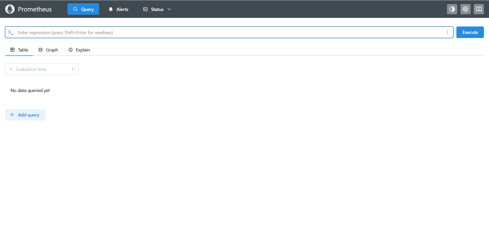

2. 打开 Prometheus 自身指标页面 `http://192.168.137.122:9090/metrics`
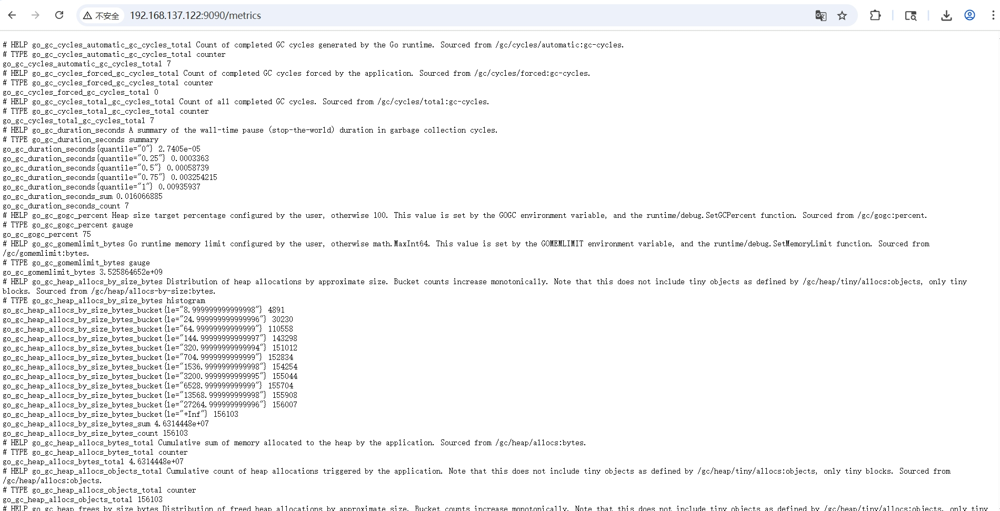

3. 打开 NodeExporter 采集指标页面 `http://192.168.137.122:9100/metrics`
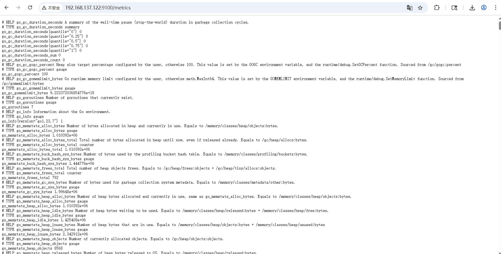

4. 打开 Grafana 主界面 `http://192.168.137.122:3000`，在数据源中添加 Prometheus 和 AlertManager数据源
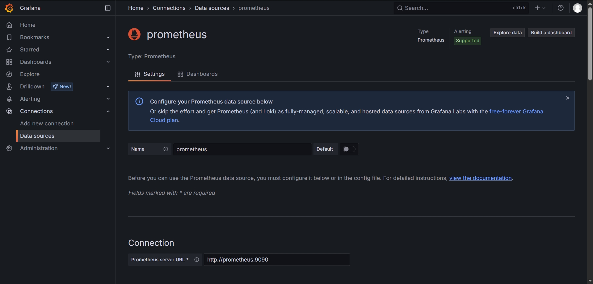
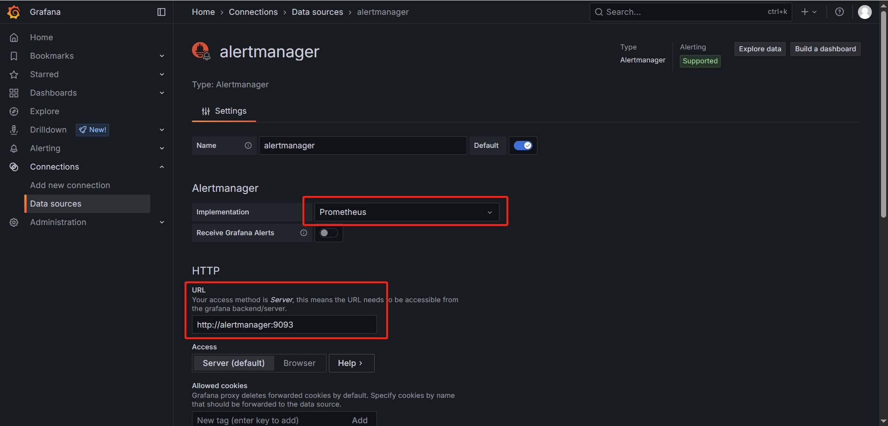

5. 从Grafana官方提供模板地址下载监控面板模板: `https://grafana.com/grafana/dashboards`
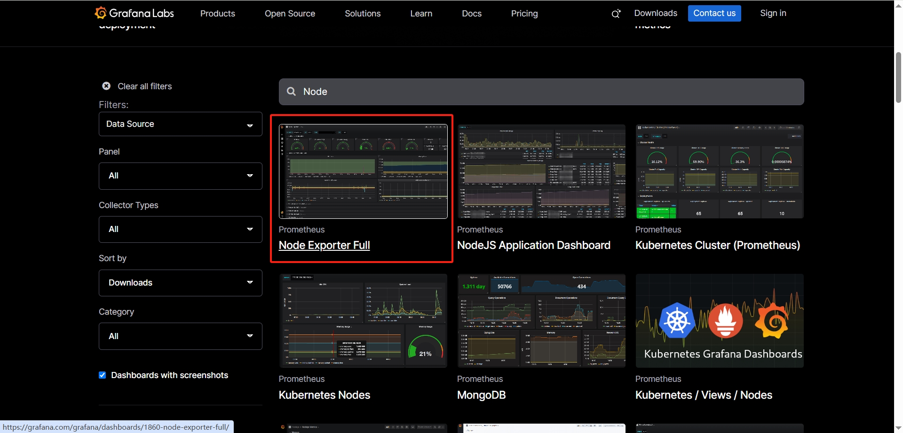
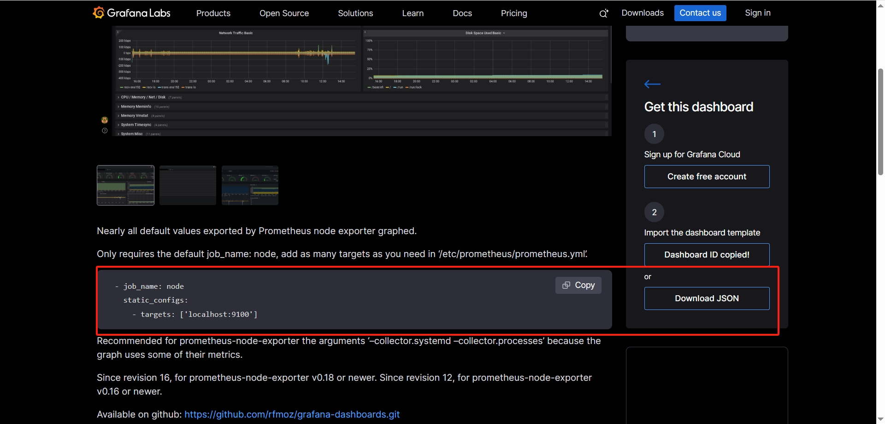
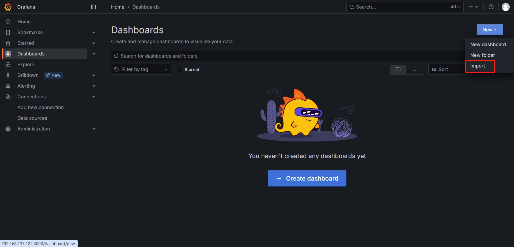
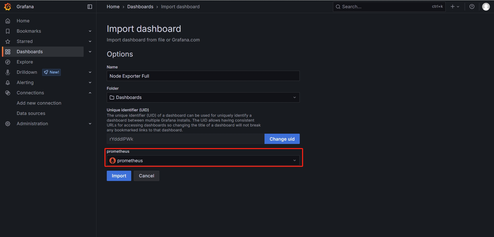

6. 服务器监控效果展示
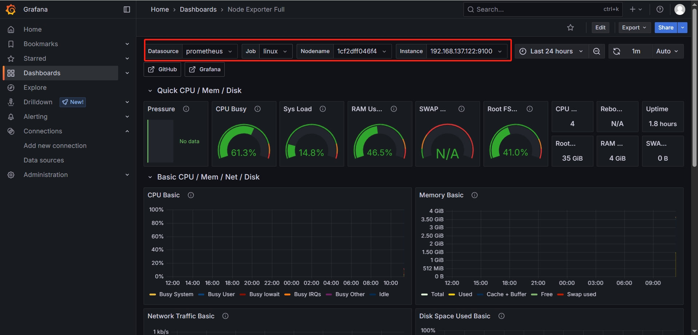

# Kubernetes安装
这里将采用 Helm chart 来安装 Prometheus Operator，因为Operator可以帮助我们布署、管理、恢复Prometheus（因为Prometheus是有状态的应用，不同于无状态的Java项目（Kubernetes可以自动化管理无状态应用），有状态的应用运维比较麻烦，所以需要特定的Operator来管理。具体可以看文章开头的前置文章。
- [【Monitoring】使用Helm和Prometheus Operator在Kubernetes中安装Prometheus](https://juejin.cn/post/7356906581780742185)

## 添加Prometheus Chart到Helm

```shell
# 查看helm版本
helm version

# 如果添加仓库失败可以添加代理
export http_proxy=http://192.168.137.1:4780
export https_proxy=http://192.168.137.1:4780

# 添加chart仓库
helm repo add prometheus-community https://prometheus-community.github.io/helm-charts

# 更新chart仓库
helm repo update

# 查看添加完成后的仓库
helm repo list

# 查询prometheus的chart
helm search repo prometheus-community/kube-prometheus-stack

# 拉取chart
helm pull prometheus-community/kube-prometheus-stack
# 拉取较慢，可以直接从github下载
# wget https://github.com/prometheus-community/helm-charts/releases/download/kube-prometheus-stack-73.2.0/kube-prometheus-stack-73.2.0.tgz

# 此时会有一个压缩包，默认下载的是最新版本，可能与Grafana版本不兼容，需要去github确认
tar -zxvf kube-prometheus-stack-73.2.0.tgz -C ~/

# 进入到解压后的文件夹
cd ~/kube-prometheus-stack

# 查看默认的配置文件
vim values.yaml

```

## 安装Prometheus Operator

```shell
# 安装时需要从docker仓库拉取镜像，可以提前准备好
docker pull quay.io/prometheus/prometheus:v3.4.1
docker pull quay.io/prometheus/alertmanager:v0.28.1
docker pull quay.io/prometheus/node-exporter:v1.9.1
docker pull quay.io/prometheus-operator/admission-webhook:v0.82.2
docker pull quay.io/prometheus-operator/prometheus-operator:v0.82.2
docker pull quay.io/prometheus-operator/prometheus-config-reloader:v0.82.2
docker pull quay.io/thanos/thanos:v0.38.0
docker pull registry.k8s.io/ingress-nginx/kube-webhook-certgen:v1.5.3
docker pull registry.k8s.io/kube-state-metrics/kube-state-metrics:v2.15.0

# registry.k8s.io 拉取失败，使用代理拉取，拉取成功后重新打tag即可
docker pull k8s.mirror.nju.edu.cn/ingress-nginx/kube-webhook-certgen:v1.5.3
docker tag  k8s.mirror.nju.edu.cn/ingress-nginx/kube-webhook-certgen:v1.5.3 registry.k8s.io/ingress-nginx/kube-webhook-certgen:v1.5.3
docker pull k8s.mirror.nju.edu.cn/kube-state-metrics/kube-state-metrics:v2.15.0
docker tag  k8s.mirror.nju.edu.cn/kube-state-metrics/kube-state-metrics:v2.15.0 registry.k8s.io/kube-state-metrics/kube-state-metrics:v2.15.0

# 拉取镜像较慢，可以设置本地代理
export HTTP_PROXY=http://192.168.137.1:4780
export HTTPS_PROXY=http://192.168.137.1:4780

# 安装prometheus，从服务器下载 kube-prometheus-stack-73.2.0.tgz 安装包
# 如果想要修改部分配置，可以新增一个配置文件 prometheus-values.yaml，在install时带上参数即可 -f prometheus-values.yaml
# helm install prometheus prometheus-community/kube-prometheus-stack --create-namespace --namespace monitoring

# 安装prometheus，在 kube-prometheus-stack-73.2.0.tgz 解压目录执行，如有需要可以带上 -f prometheus-values.yaml
cd ~/kube-prometheus-stack
helm install prometheus . --create-namespace --namespace monitoring

# 升级
helm upgrade prometheus prometheus-community/kube-prometheus-stack

# 查看Helm部署的资源
helm ls --namespace monitoring

```

部署成功后输出的提示信息如下
```shell
[diginn@k8s-master-01 kube-prometheus-stack]$ helm install prometheus . --create-namespace --namespace monitoring
NAME: prometheus
LAST DEPLOYED: Thu Jun 12 14:50:19 2025
NAMESPACE: monitoring
STATUS: deployed
REVISION: 1
NOTES:
kube-prometheus-stack has been installed. Check its status by running:
  kubectl --namespace monitoring get pods -l "release=prometheus"

Get Grafana 'admin' user password by running:

  kubectl --namespace monitoring get secrets prometheus-grafana -o jsonpath="{.data.admin-password}" | base64 -d ; echo

Access Grafana local instance:

  export POD_NAME=$(kubectl --namespace monitoring get pod -l "app.kubernetes.io/name=grafana,app.kubernetes.io/instance=prometheus" -oname)
  kubectl --namespace monitoring port-forward $POD_NAME 3000

Visit https://github.com/prometheus-operator/kube-prometheus for instructions on how to create & configure Alertmanager and Prometheus instances using the Operator.

```

## 检查Prometheus Operator状态

```shell
# 查看 pod
kubectl get pods -n monitoring -o wide

# 查看服务端口信息
kubectl get svc -n monitoring

# 查看节点Pending原因
kubectl describe pod alertmanager-prometheus-kube-prometheus-alertmanager-0 -n monitoring
kubectl describe pod prometheus-kube-prometheus-operator-5cfd684899-hdqf8 -n monitoring
kubectl describe pod prometheus-kube-state-metrics-74b7dc4795-sx7bv -n monitoring
kubectl describe pod prometheus-prometheus-kube-prometheus-prometheus-0 -n monitoring

# 卸载
helm uninstall prometheus --namespace monitoring

```

通过 `kubectl get pods -n monitoring -o wide` 的输出确定pod的状态，并通过 `kubectl describe pod <pod-name> -n monitoring` 定位具体的失败原因

```shell
[diginn@k8s-master-01 kube-prometheus-stack]$ kubectl get pods -n monitoring -o wide
NAME                                                     READY   STATUS        RESTARTS   AGE     IP                NODE            NOMINATED NODE   READINESS GATES
alertmanager-prometheus-kube-prometheus-alertmanager-0   2/2     Running       0          3m20s   10.244.44.211     k8s-node-02     <none>           <none>
prometheus-grafana-76cd8bb66b-gwwp8                      3/3     Running       0          3m23s   10.244.151.143    k8s-master-01   <none>           <none>
prometheus-kube-prometheus-operator-5cfd684899-hdqf8     1/1     Running       0          3m23s   10.244.151.144    k8s-master-01   <none>           <none>
prometheus-kube-state-metrics-74b7dc4795-sx7bv           1/1     Running       0          3m23s   10.244.44.208     k8s-node-02     <none>           <none>
prometheus-prometheus-kube-prometheus-prometheus-0       2/2     Running       0          3m19s   10.244.95.47      k8s-master-02   <none>           <none>
prometheus-prometheus-node-exporter-9chcv                0/1     Pending       0          3m23s   <none>            <none>          <none>           <none>
prometheus-prometheus-node-exporter-c7lhf                0/1     Terminating   0          18m     <none>            k8s-node-03     <none>           <none>
prometheus-prometheus-node-exporter-dt8n4                0/1     Terminating   0          18m     <none>            k8s-master-03   <none>           <none>
prometheus-prometheus-node-exporter-jql69                0/1     Terminating   0          18m     <none>            k8s-node-01     <none>           <none>
prometheus-prometheus-node-exporter-mv5t4                1/1     Running       0          3m23s   192.168.137.132   k8s-node-02     <none>           <none>
prometheus-prometheus-node-exporter-n2bv8                0/1     Pending       0          3m23s   <none>            <none>          <none>           <none>
prometheus-prometheus-node-exporter-r9sgg                1/1     Running       0          3m23s   192.168.137.121   k8s-master-01   <none>           <none>
prometheus-prometheus-node-exporter-vt6sg                0/1     Pending       0          3m23s   <none>            <none>          <none>           <none>
prometheus-prometheus-node-exporter-zcmql                1/1     Running       0          3m23s   192.168.137.122   k8s-master-02   <none>           <none>
```

## 访问Prometheus 和 Grafana Dashboards

### 临时方案，K8s 端口转发
```shell
# 先查看service的端点
kubectl get service -n monitoring

# 然后使用port-forward进行转发以便kubernetes群体外可以访问内部的service
nohup kubectl port-forward --address 0.0.0.0 service/prometheus-kube-prometheus-prometheus -n monitoring 39090:9090 > portforward-9090.log 2>&1 < /dev/null &
nohup kubectl port-forward --address 0.0.0.0 service/prometheus-grafana -n monitoring 33000:80 > portforward-3000.log 2>&1 < /dev/null &

# 查看访问端点
kubectl get svc -n monitoring | grep -E 'prometheus-kube-prometheus-prometheus|prometheus-grafana'

```

- 浏览器访问Prometheus监控指标页面 
  - Prometheus 主界面 `http://192.168.137.121:9090`
  - Prometheus 自身指标 `http://192.168.137.121:9090/metrics`

- 浏览器访问Grafana页面 
  - Grafana 主界面 `http://192.168.137.121:3000`
  - 账号 `admin` / `prom-operator`
  - 密码 使用安装后的指令获取 `kubectl --namespace monitoring get secrets prometheus-grafana -o jsonpath="{.data.admin-password}" | base64 -d ; echo`

### 使用 NodePort 暴露服务

```shell
# 1. 修改 Prometheus 服务为 NodePort
kubectl patch svc prometheus-kube-prometheus-prometheus -n monitoring -p '{"spec": {"type": "NodePort"}}'

# 2. 修改 Grafana 服务为 NodePort
kubectl patch svc prometheus-grafana -n monitoring -p '{"spec": {"type": "NodePort"}}'

# 3. 获取实际端口号
kubectl get svc -n monitoring

[diginn@k8s-master-01 kube-prometheus-stack]$ kubectl get svc -n monitoring
NAME                                      TYPE        CLUSTER-IP       EXTERNAL-IP   PORT(S)                         AGE
alertmanager-operated                     ClusterIP   None             <none>        9093/TCP,9094/TCP,9094/UDP      55m
prometheus-grafana                        NodePort    10.101.166.78    <none>        80:31145/TCP                    55m
prometheus-kube-prometheus-alertmanager   ClusterIP   10.96.67.209     <none>        9093/TCP,8080/TCP               55m
prometheus-kube-prometheus-operator       ClusterIP   10.99.164.53     <none>        443/TCP                         55m
prometheus-kube-prometheus-prometheus     NodePort    10.101.131.197   <none>        9090:30203/TCP,8080:31517/TCP   55m
prometheus-kube-state-metrics             ClusterIP   10.108.139.180   <none>        8080/TCP                        55m
prometheus-operated                       ClusterIP   None             <none>        9090/TCP                        55m
prometheus-prometheus-node-exporter       ClusterIP   10.100.224.184   <none>        9100/TCP                        55m

# 获取Grafana密码
# 1. 查看命名空间内所有Secret
kubectl get secrets -n monitoring

# 2. 查看Secret内容
kubectl get secret prometheus-grafana -n monitoring -o yaml

# 3. 复制admin-user admin-password，用base64 decode下：
echo "YWRtaW4=" | base64 -d; echo               # 账号 admin-user
echo "cHJvbS1vcGVyYXRvcg==" | base64 -d; echo   # 密码 admin-password

# 一条指令获取用户名密码
kubectl --namespace monitoring get secrets prometheus-grafana -o jsonpath="{.data.admin-user}" | base64 -d ; echo
kubectl --namespace monitoring get secrets prometheus-grafana -o jsonpath="{.data.admin-password}" | base64 -d ; echo

```

- 浏览器访问Prometheus监控指标页面 
  - Prometheus 主界面 `http://192.168.137.121:30203`
  - Prometheus 自身指标 `http://192.168.137.121:30203/metrics`

## 测试
1. 访问 Prometheus 主界面
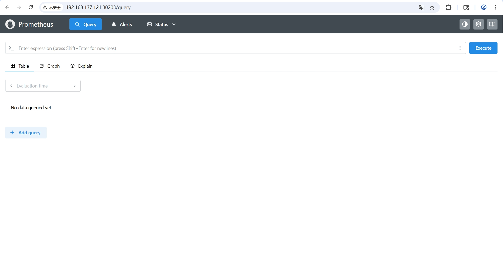

2. 访问 Prometheus 自身指标页面
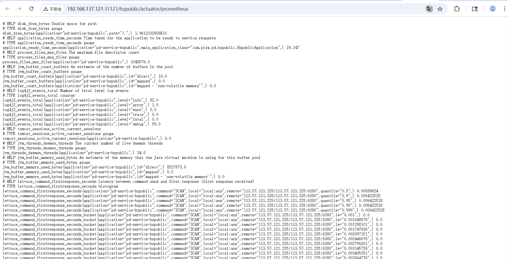

3. 在 `Status > Configuration` 页签查看当前的prometheus.yaml
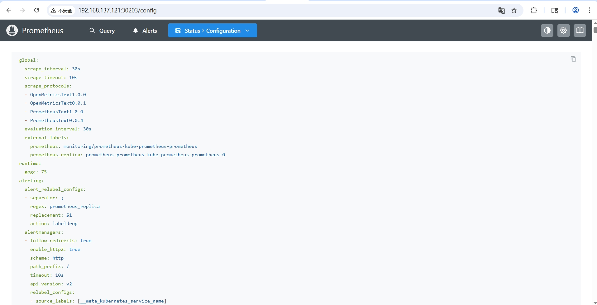

4. 在 `Status > Target Health` 页签查看当前的Targets，即从哪里抓取数据
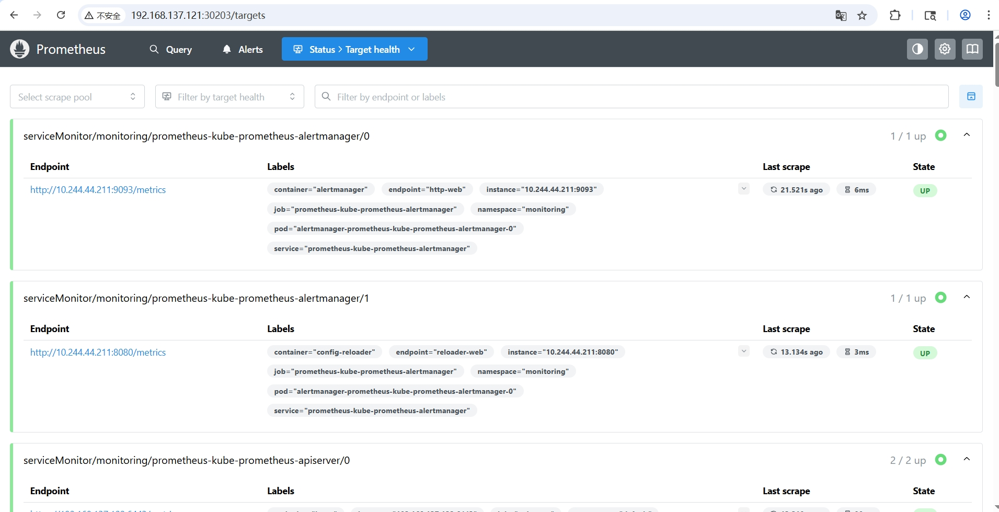

5. 在 `Status > Rule Health` 页签查看当前配置的规则
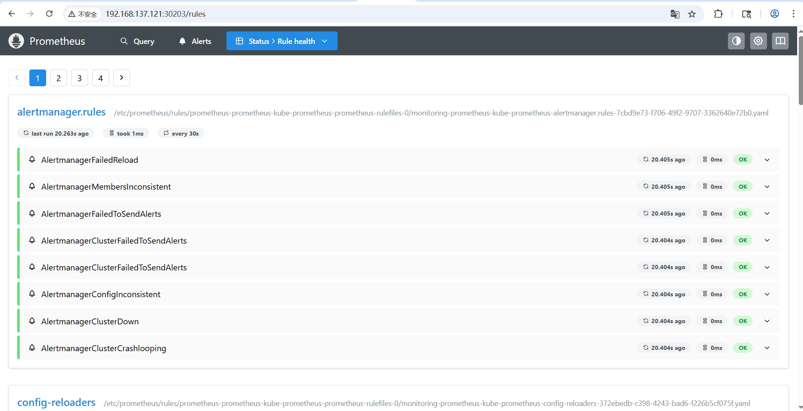

6. 访问 Grafana 主界面 `http://192.168.137.121:31145`
  - 账号 `admin` / `prom-operator` （密码需要读Secret文件获取）

7. 在Datasource页面可以看到默认将 Prometheus 及 AlertManger 添加进来了
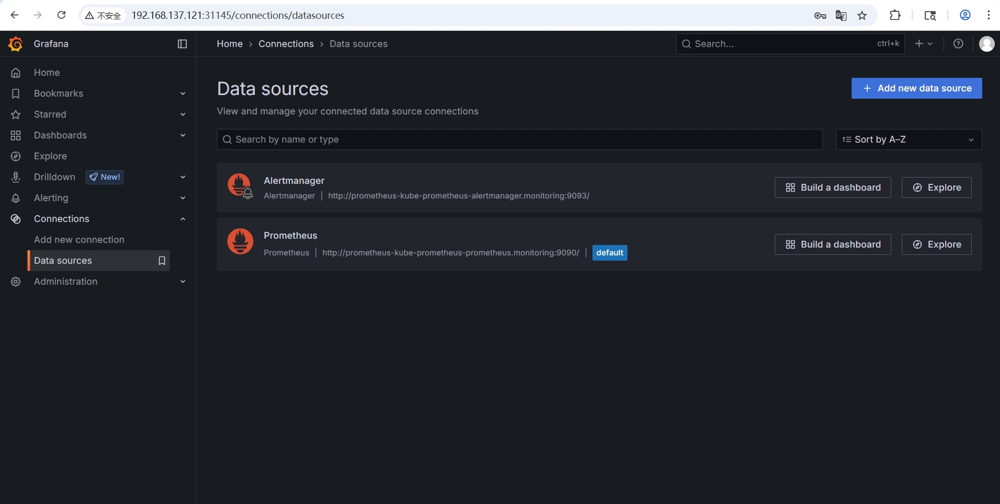

8. 切换到Dashboards菜单，可以看到默认prometheus会抓取kubenetes components的metrics如Pod等
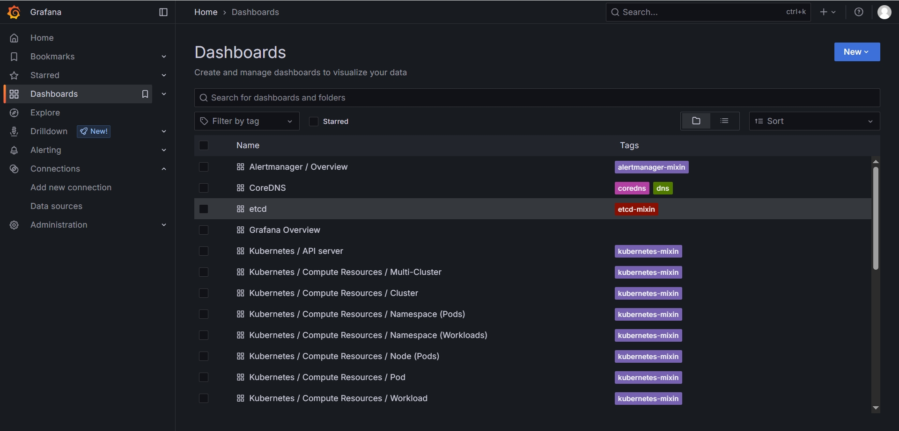

9. 在 `Node Exporter / Nodes` 面板中可以看到服务器的相关信息
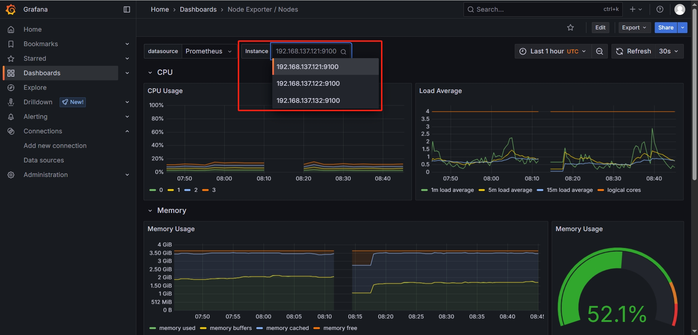

10. 在`Kubernetes / Kubelet` 可以看到K8s集群的整体统计信息
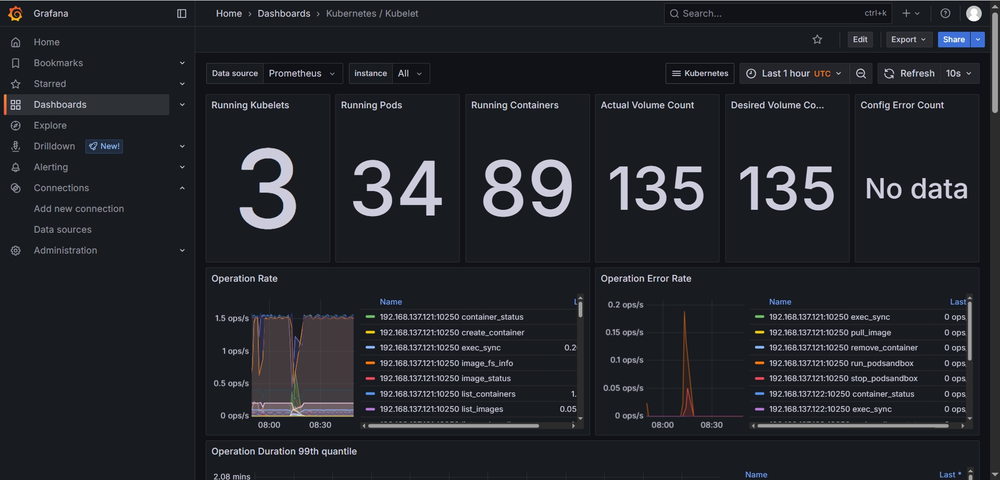

## 相关服务 资源的解析

列出命名空间下的所有资源，包括：Pod，Service，Deployment等：
```shell
kubectl get all -n monitoring

# 输出结果
[diginn@k8s-master-01 ~]$  kubectl get all -n monitoring
NAME                                                         READY   STATUS    RESTARTS       AGE
pod/alertmanager-prometheus-kube-prometheus-alertmanager-0   2/2     Running   2 (19h ago)    20h
pod/prometheus-grafana-76cd8bb66b-gwwp8                      3/3     Running   9 (17h ago)    20h
pod/prometheus-kube-prometheus-operator-5cfd684899-hdqf8     1/1     Running   3 (17h ago)    20h
pod/prometheus-kube-state-metrics-74b7dc4795-sx7bv           1/1     Running   16 (65m ago)   20h
pod/prometheus-prometheus-kube-prometheus-prometheus-0       2/2     Running   6 (17h ago)    20h
pod/prometheus-prometheus-node-exporter-9chcv                1/1     Running   0              20h
pod/prometheus-prometheus-node-exporter-mv5t4                1/1     Running   1 (19h ago)    20h
pod/prometheus-prometheus-node-exporter-n2bv8                1/1     Running   0              20h
pod/prometheus-prometheus-node-exporter-r9sgg                1/1     Running   3 (17h ago)    20h
pod/prometheus-prometheus-node-exporter-vt6sg                1/1     Running   0              20h
pod/prometheus-prometheus-node-exporter-zcmql                1/1     Running   5 (17h ago)    20h

NAME                                              TYPE        CLUSTER-IP       EXTERNAL-IP   PORT(S)                         AGE
service/alertmanager-operated                     ClusterIP   None             <none>        9093/TCP,9094/TCP,9094/UDP      20h
service/prometheus-grafana                        NodePort    10.101.166.78    <none>        80:31145/TCP                    20h
service/prometheus-kube-prometheus-alertmanager   ClusterIP   10.96.67.209     <none>        9093/TCP,8080/TCP               20h
service/prometheus-kube-prometheus-operator       ClusterIP   10.99.164.53     <none>        443/TCP                         20h
service/prometheus-kube-prometheus-prometheus     NodePort    10.101.131.197   <none>        9090:30203/TCP,8080:31517/TCP   20h
service/prometheus-kube-state-metrics             ClusterIP   10.108.139.180   <none>        8080/TCP                        20h
service/prometheus-operated                       ClusterIP   None             <none>        9090/TCP                        20h
service/prometheus-prometheus-node-exporter       ClusterIP   10.100.224.184   <none>        9100/TCP                        20h

NAME                                                 DESIRED   CURRENT   READY   UP-TO-DATE   AVAILABLE   NODE SELECTOR            AGE
daemonset.apps/prometheus-prometheus-node-exporter   6         6         4       6            4           kubernetes.io/os=linux   20h

NAME                                                  READY   UP-TO-DATE   AVAILABLE   AGE
deployment.apps/prometheus-grafana                    1/1     1            1           20h
deployment.apps/prometheus-kube-prometheus-operator   1/1     1            1           20h
deployment.apps/prometheus-kube-state-metrics         1/1     1            1           20h

NAME                                                             DESIRED   CURRENT   READY   AGE
replicaset.apps/prometheus-grafana-76cd8bb66b                    1         1         1       20h
replicaset.apps/prometheus-kube-prometheus-operator-5cfd684899   1         1         1       20h
replicaset.apps/prometheus-kube-state-metrics-74b7dc4795         1         1         1       20h

NAME                                                                    READY   AGE
statefulset.apps/alertmanager-prometheus-kube-prometheus-alertmanager   1/1     20h
statefulset.apps/prometheus-prometheus-kube-prometheus-prometheus       1/1     20h

NAME                            STATUS   COMPLETIONS   DURATION   AGE
job.batch/loki-minio-post-job   Failed   0/1           63m        63m
[diginn@k8s-master-01 ~]$

```

### statefulset，deployment，daemonset
其中statefulset资源有两个：

- `statefulset.apps/prometheus-prometheus-kube-prometheus-prometheus`，是Prometheus三个server（即Retrival，Storage，HTTP Server），名字中间有operator，表示这个prometheus归operator管理。
- `statefulset.apps/alertmanager-prometheus-kube-prometheus-alertmanager`，顾名思议是alert manager，也是归operator管理。

deployment三个：

- `deployment.apps/prometheus-kube-prometheus-operator` prometheus operator自己的安装清单，通过它创建了Prometheus和Alertmanager的statefulset（也就是上面两个statefulset）。
- `deployment.apps/prometheus-grafana` grafana相关的安装清单，
- `deployment.apps/prometheus-kube-state-metrics` 当前这个Helm chart相关的，它用来抓取k8s当前的cluster本身component相关的metrics，用来测检当前deployment, statefulset, pod的是否健康，这些metrics数据可以在prometheus中被展示出来。

Daemonset会在每个kubernetes的Worker节点上运行。当前的这个prometheus daemenset的作用是会把Worker节点上的数据（比如cpu使用率等）转化为Prometheus的metrics格式的数据。

**注：** 这个Daemonset还需要和`pod=pod/prometheus-prometheus-node-exporter-9chcv`合作进行工作。

### configmap, secret

除了上述的资源，还安装了一些configmap，这些配置有些是operator相关的，配置了默认的metrics连接等等。
```shell
kubectl get configmap -n monitoring

# 输出结果
[diginn@k8s-master-01 ~]$ kubectl get configmap -n monitoring
NAME                                                           DATA   AGE
kube-root-ca.crt                                               1      20h
prometheus-grafana                                             1      20h
prometheus-grafana-config-dashboards                           1      20h
prometheus-kube-prometheus-alertmanager-overview               1      20h
prometheus-kube-prometheus-apiserver                           1      20h
prometheus-kube-prometheus-cluster-total                       1      20h
prometheus-kube-prometheus-controller-manager                  1      20h
prometheus-kube-prometheus-etcd                                1      20h
prometheus-kube-prometheus-grafana-datasource                  1      20h
prometheus-kube-prometheus-grafana-overview                    1      20h
prometheus-kube-prometheus-k8s-coredns                         1      20h
prometheus-kube-prometheus-k8s-resources-cluster               1      20h
prometheus-kube-prometheus-k8s-resources-multicluster          1      20h
prometheus-kube-prometheus-k8s-resources-namespace             1      20h
prometheus-kube-prometheus-k8s-resources-node                  1      20h
prometheus-kube-prometheus-k8s-resources-pod                   1      20h
prometheus-kube-prometheus-k8s-resources-workload              1      20h
prometheus-kube-prometheus-k8s-resources-workloads-namespace   1      20h
prometheus-kube-prometheus-kubelet                             1      20h
prometheus-kube-prometheus-namespace-by-pod                    1      20h
prometheus-kube-prometheus-namespace-by-workload               1      20h
prometheus-kube-prometheus-node-cluster-rsrc-use               1      20h
prometheus-kube-prometheus-node-rsrc-use                       1      20h
prometheus-kube-prometheus-nodes                               1      20h
prometheus-kube-prometheus-nodes-aix                           1      20h
prometheus-kube-prometheus-nodes-darwin                        1      20h
prometheus-kube-prometheus-persistentvolumesusage              1      20h
prometheus-kube-prometheus-pod-total                           1      20h
prometheus-kube-prometheus-prometheus                          1      20h
prometheus-kube-prometheus-proxy                               1      20h
prometheus-kube-prometheus-scheduler                           1      20h
prometheus-kube-prometheus-workload-total                      1      20h
prometheus-prometheus-kube-prometheus-prometheus-rulefiles-0   35     20h

```

secrets相关的资源，存放Grafana, Prometheus, Operator相关的敏感数据（username, password等）：
```shell
kubectl get secret -n monitoring

# 输出结果
[diginn@k8s-master-01 ~]$ kubectl get secret -n monitoring
NAME                                                                                  TYPE                 DATA   AGE
alertmanager-prometheus-kube-prometheus-alertmanager                                  Opaque               1      20h
alertmanager-prometheus-kube-prometheus-alertmanager-cluster-tls-config               Opaque               1      20h
alertmanager-prometheus-kube-prometheus-alertmanager-generated                        Opaque               1      20h
alertmanager-prometheus-kube-prometheus-alertmanager-tls-assets-0                     Opaque               0      20h
alertmanager-prometheus-kube-prometheus-alertmanager-web-config                       Opaque               1      20h
prometheus-grafana                                                                    Opaque               3      20h
prometheus-kube-prometheus-admission                                                  Opaque               3      20h
prometheus-prometheus-kube-prometheus-prometheus                                      Opaque               1      20h
prometheus-prometheus-kube-prometheus-prometheus-thanos-prometheus-http-client-file   Opaque               1      20h
prometheus-prometheus-kube-prometheus-prometheus-tls-assets-0                         Opaque               1      20h
prometheus-prometheus-kube-prometheus-prometheus-web-config                           Opaque               1      20h
sh.helm.release.v1.prometheus.v1                                                      helm.sh/release.v1   1      20h

```

### CRDs

可以看到还创建了不少的CRD：

```shell
kubectl get crd -n monitoring

# 输出结果
[diginn@k8s-master-01 ~]$ kubectl get crd -n monitoring
NAME                                                  CREATED AT
alertmanagerconfigs.monitoring.coreos.com             2025-06-10T06:50:22Z
alertmanagers.monitoring.coreos.com                   2025-06-10T06:50:22Z
bgpconfigurations.crd.projectcalico.org               2025-04-01T02:59:52Z
bgppeers.crd.projectcalico.org                        2025-04-01T02:59:52Z
blockaffinities.crd.projectcalico.org                 2025-04-01T02:59:52Z
caliconodestatuses.crd.projectcalico.org              2025-04-01T02:59:52Z
cephblockpoolradosnamespaces.ceph.rook.io             2025-06-04T07:20:00Z
cephblockpools.ceph.rook.io                           2025-06-04T07:20:00Z
cephbucketnotifications.ceph.rook.io                  2025-06-04T07:20:00Z
cephbuckettopics.ceph.rook.io                         2025-06-04T07:20:00Z
cephclients.ceph.rook.io                              2025-06-04T07:20:00Z
cephclusters.ceph.rook.io                             2025-06-04T07:20:00Z
cephcosidrivers.ceph.rook.io                          2025-06-04T07:20:00Z
cephfilesystemmirrors.ceph.rook.io                    2025-06-04T07:20:00Z
cephfilesystems.ceph.rook.io                          2025-06-04T07:20:00Z
cephfilesystemsubvolumegroups.ceph.rook.io            2025-06-04T07:20:00Z
cephnfses.ceph.rook.io                                2025-06-04T07:20:00Z
cephobjectrealms.ceph.rook.io                         2025-06-04T07:20:00Z
cephobjectstores.ceph.rook.io                         2025-06-04T07:20:00Z
cephobjectstoreusers.ceph.rook.io                     2025-06-04T07:20:00Z
cephobjectzonegroups.ceph.rook.io                     2025-06-04T07:20:00Z
cephobjectzones.ceph.rook.io                          2025-06-04T07:20:00Z
cephrbdmirrors.ceph.rook.io                           2025-06-04T07:20:00Z
clusterinformations.crd.projectcalico.org             2025-04-01T02:59:52Z
felixconfigurations.crd.projectcalico.org             2025-04-01T02:59:52Z
globalnetworkpolicies.crd.projectcalico.org           2025-04-01T02:59:53Z
globalnetworksets.crd.projectcalico.org               2025-04-01T02:59:53Z
hostendpoints.crd.projectcalico.org                   2025-04-01T02:59:53Z
ingressclassparameterses.configuration.konghq.com     2025-04-01T03:08:43Z
ipamblocks.crd.projectcalico.org                      2025-04-01T02:59:53Z
ipamconfigs.crd.projectcalico.org                     2025-04-01T02:59:53Z
ipamhandles.crd.projectcalico.org                     2025-04-01T02:59:53Z
ippools.crd.projectcalico.org                         2025-04-01T02:59:53Z
ipreservations.crd.projectcalico.org                  2025-04-01T02:59:54Z
kongclusterplugins.configuration.konghq.com           2025-04-01T03:08:43Z
kongconsumergroups.configuration.konghq.com           2025-04-01T03:08:43Z
kongconsumers.configuration.konghq.com                2025-04-01T03:08:43Z
kongingresses.configuration.konghq.com                2025-04-01T03:08:43Z
konglicenses.configuration.konghq.com                 2025-04-01T03:08:43Z
kongplugins.configuration.konghq.com                  2025-04-01T03:08:43Z
kongupstreampolicies.configuration.konghq.com         2025-04-01T03:08:43Z
kongvaults.configuration.konghq.com                   2025-04-01T03:08:43Z
kubecontrollersconfigurations.crd.projectcalico.org   2025-04-01T02:59:54Z
networkpolicies.crd.projectcalico.org                 2025-04-01T02:59:54Z
networksets.crd.projectcalico.org                     2025-04-01T02:59:54Z
objectbucketclaims.objectbucket.io                    2025-06-04T07:20:00Z
objectbuckets.objectbucket.io                         2025-06-04T07:20:00Z
podmonitors.monitoring.coreos.com                     2025-06-10T06:50:22Z
probes.monitoring.coreos.com                          2025-06-10T06:50:22Z
prometheusagents.monitoring.coreos.com                2025-06-10T06:50:23Z
prometheuses.monitoring.coreos.com                    2025-06-10T06:50:23Z
prometheusrules.monitoring.coreos.com                 2025-06-10T06:50:23Z
scrapeconfigs.monitoring.coreos.com                   2025-06-10T06:50:24Z
servicemonitors.monitoring.coreos.com                 2025-06-10T06:50:24Z
tcpingresses.configuration.konghq.com                 2025-04-01T03:08:43Z
thanosrulers.monitoring.coreos.com                    2025-06-10T06:50:24Z
udpingresses.configuration.konghq.com                 2025-04-01T03:08:43Z

```

其中`prometheuses.monitoring.coreos.com`与是`ServiceMonitor`定义的API，与Target自动发现有关。比如我们需要与Spring Boot项目集成，就可能需要创建自己的ServiceMonitor。


## 查看Prometheus配置
导出上述的statefulset的具体描述以及operator deployment的描述：
```shell
kubectl describe statefulset prometheus-prometheus-kube-prometheus-prometheus -n monitoring > prometheus.yaml

```

先看statefulset为prometheus的配置，可以看到使用的是v3.4.1版本的prometheus，端口为9090。
```yaml
Containers:
  prometheus:
    Image:      quay.io/prometheus/prometheus:v3.4.1
    Port:       9090/TCP

```

另外还有一些mount目录，比如在rules目录下有一些规则的文件：
```yaml
Mounts:
  /etc/prometheus/certs from tls-assets (ro)
  /etc/prometheus/config_out from config-out (ro)
  /etc/prometheus/rules/prometheus-prometheus-kube-prometheus-prometheus-rulefiles-0 from prometheus-prometheus-kube-prometheus-prometheus-rulefiles-0 (rw)
  /etc/prometheus/web_config/web-config.yaml from web-config (ro,path="web-config.yaml")
  /prometheus from prometheus-prometheus-kube-prometheus-prometheus-db (rw)

```

如果prometheus相关的配置有改动，config-reloader负责重新加载这些config，可以看到config通过pod内的目录文件`/etc/prometheus/config/prometheus.yaml`读取进来的：

```yaml
config-reloader:
  Image:      quay.io/prometheus-operator/prometheus-config-reloader:v0.82.2
  Port:       8080/TCP
  Host Port:  0/TCP
  Command:
    /bin/prometheus-config-reloader
  Args:
    --listen-address=:8080
    --reload-url=http://127.0.0.1:9090/-/reload
    --config-file=/etc/prometheus/config/prometheus.yaml.gz
    --config-envsubst-file=/etc/prometheus/config_out/prometheus.env.yaml
    --watched-dir=/etc/prometheus/rules/prometheus-prometheus-kube-prometheus-prometheus-rulefiles-0
```

至于`prometheus.yaml`是怎么被加载到prometheus pod内部目录`/etc/prometheus/config`的，可以查看config-reloader的Mounts配置：
```yaml
Mounts:
  /etc/prometheus/config from config (rw)
  /etc/prometheus/config_out from config-out (rw)
  /etc/prometheus/rules/prometheus-prometheus-kube-prometheus-prometheus-rulefiles-0 from prometheus-prometheus-kube-prometheus-prometheus-rulefiles-0 (rw)
```

可以看到`/etc/prometheus/config`是从`volumn=config`加载来的。查看volumn配置，volumn `name=config`的，type是`secret`，`name=prometheus-prometheus-kube-prometheus-prometheus`：
```yaml
Volumes:
  config:
    Type:        Secret (a volume populated by a Secret)
    SecretName:  prometheus-prometheus-kube-prometheus-prometheus
    Optional:    false

```

通过命令查看`secret=prometheus-prometheus-kube-prometheus-prometheus`，以yaml格式导出，可以查看该secret相关的配置：
```shell
kubectl get secret prometheus-prometheus-kube-prometheus-prometheus -o yaml -n monitoring > secret.yaml

kubectl --namespace monitoring get secrets prometheus-prometheus-kube-prometheus-prometheus -o jsonpath="{.data.prometheus.yaml.gz}" | base64 -d ; echo
```

同样的，也可以对另外两个主要的配置进行导出查看：
```shell
kubectl describe statefulset alertmanager-prometheus-kube-prometheus-alertmanager -n monitoring > alertmanager.yaml


kubectl describe deployment prometheus-kube-prometheus-operator -n monitoring > operator.yaml
```

# 项目监控实操

## 安装Prometheus + Grafana

步骤省略，参考前面【Kubernetes安装】章节

## Spring Boot项目修改

### 添加依赖
```xml
<!-- 开启 Spring Boot Actuator -->
<dependency>
  <groupId>org.springframework.boot</groupId>
  <artifactId>spring-boot-starter-actuator</artifactId>
</dependency>
<!-- 将 Actuator 指标转换为 Prometheus 格式 -->
<dependency>
  <groupId>io.micrometer</groupId>
  <artifactId>micrometer-registry-prometheus</artifactId>
  <version>${micrometer.version}</version>
</dependency>
```

### 修改 `application.yaml` 中添加 Spring Boot Actuator 相关配置
```yaml
spring:
  application:
    name: pd-service-hzctm

# 开放 Actuator 管理端点
management:
  endpoints:
    web:
      exposure:
        include: "*"
    health:
      show-details: always
  metrics:
    export:
      prometheus:
        enable: true
    tags:
      application: ${spring.application.name}

```

### 通过 `/actuator/prometheus` 测试配置是否正确：
```shell
curl -X GET -i 'http://localhost:31121/hzpublic/actuator/prometheus'
curl -X GET -i 'http://localhost:31122/hzctm/actuator/prometheus'

```

查询结果如下图所示，将所有暴露的端点数据都展示出来了
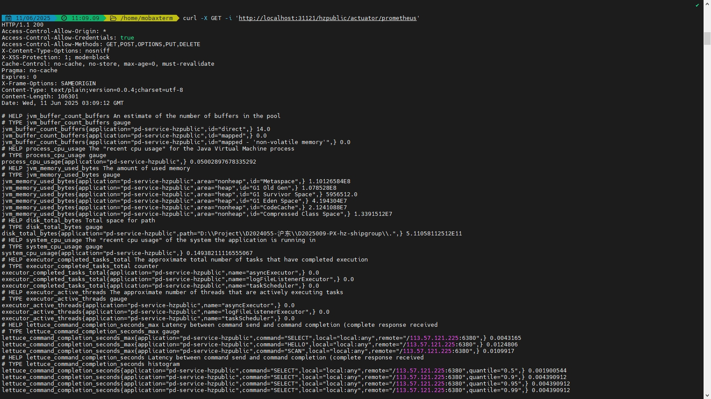

### K8s 部署配置文件修改，主要是 `Service` 和 `Deployment` 中标签的对应
```diff
apiVersion: v1
kind: Service
metadata:
  name: svc-dz-service-hzpublic
  namespace: hz-dev-service
+  labels:
+    app: hz-service-hzpublic
+    job: hz-service-hzpublic-job
spec:
  type: NodePort
  selector:
    app: hz-service-hzpublic
  ports:
    - name: http
      port: 31121
      targetPort: 31121
-      nodePort: 30121
+      nodePort: 31121

+ ---
+ apiVersion: monitoring.coreos.com/v1
+ kind: ServiceMonitor
+ metadata:
+   name: svc-dz-service-hzpublic
+   namespace: hz-dev-service
+   labels:
+     app: hz-service-hzpublic
+     release: prometheus
+ spec:
+   jobLabel: job
+   endpoints:
+     - interval: 5s
+       path: /hzpublic/actuator/prometheus
+       port: http
+   namespaceSelector:
+     any: true
+   selector:
+     matchLabels:
+       app: hz-service-hzpublic
+       job: hz-service-hzpublic-job

---
apiVersion: apps/v1
kind: Deployment
metadata:
  name: hz-dev-service-hzpublic
  namespace: hz-dev-service
spec:
  minReadySeconds: 50
  revisionHistoryLimit: 3
  strategy:
    rollingUpdate:
      maxSurge: 1
      maxUnavailable: 0
  replicas: 1
  selector:
    matchLabels:
      app: hz-service-hzpublic
      version: "1.0.0"
  template:
    metadata:
      labels:
        app: hz-service-hzpublic
        version: "1.0.0"
+      annotations:
+        promtail.io/scrape: "true" # promtail筛选标签，需要设置scrape为true
+        promtail.io/path: "/logs/pd-service-hzpublic-all.log" # 日志文件的路径名称
    spec:
      imagePullSecrets:
        - name: pisxdocker
      containers:
        - name: hz-service-hzpublic
-          image: 192.168.1.210:5000/library/pd-service-hzpublic:1.0.0
-          imagePullPolicy: Always
+          image: 192.168.1.210:5000/library/pd-service-hzpublic:prom-1.0.0
+          imagePullPolicy: IfNotPresent
          ports:
            - containerPort: 31121
          volumeMounts:
            - name: logs-hz-service-hzpublic
              mountPath: /logs
          # 启动探针，检测系统是否启动成功
          startupProbe:
            httpGet:
              path: /hzpublic/actuator/health/readiness
              port: 31121
            periodSeconds: 10 # 探测时间间隔
            timeoutSeconds: 5 # 超时时间
            failureThreshold: 30 # 重试次数
          # 存活探针，检测系统是否存活
          livenessProbe:
            httpGet:
              path: /hzpublic/actuator/health/liveness
              port: 31121
            initialDelaySeconds: 30
            periodSeconds: 10
            timeoutSeconds: 20
            failureThreshold: 5
          resources:
            limits:
              cpu: "2"
              memory: "2048Mi"
              ephemeral-storage: "2Gi"
            requests:
              cpu: "0.2"
              memory: "1024Mi"
          env:
            - name: TZ
              value: 'Asia/Shanghai'
      volumes:
        - name: logs-hz-service-hzpublic
          hostPath:
            path: /data/logs

```

需要注意 `spec.selector` 需要与 `Pod` 的标签对应。例如使用 `Deployment` 部署应用，则需要与 `Deployment` 的 `spec.template.metadata.labels` 对应，这样 `Service` 才能知道对应的 `Pod`

### 构建容器镜像并部署到K8s

构建Docker镜像的 `Dockerfile`
```Dockerfile
FROM 192.168.1.210:5000/azul/zulu-openjdk-centos:17-jre-latest
VOLUME /tmp
ADD pd-service-hzpublic.jar /
ENV JAVA_OPTS="-Xms1g -Xmx1g -XX:MetaspaceSize=512m -XX:MaxMetaspaceSize=512m \
           -Duser.timezone=Asia/Shanghai \
           -Dfile.encoding=UTF-8 \
           -Dsun.jnu.encoding=UTF-8 \
           -Djava.awt.headless=true \
           --add-modules java.se \
           --add-opens java.base/java.lang=ALL-UNNAMED \
           --add-opens java.base/sun.nio.ch=ALL-UNNAMED \
           --add-opens java.management/sun.management=ALL-UNNAMED \
           --add-opens jdk.management/com.sun.management.internal=ALL-UNNAMED \
           --add-exports java.base/jdk.internal.ref=ALL-UNNAMED"
ENTRYPOINT java ${JAVA_OPTS} -jar /pd-service-hzpublic.jar

```

应用部署的 `k8s-dev.yaml`
```yaml
apiVersion: v1
kind: Service
metadata:
  name: svc-hz-service-hzpublic
  namespace: hz-dev-service
  labels:
    app: hz-service-hzpublic
    job: hz-service-hzpublic-job
spec:
  type: NodePort
  selector:
    app: hz-service-hzpublic
  ports:
    - name: http
      port: 31121
      targetPort: 31121
      nodePort: 31121

---
apiVersion: monitoring.coreos.com/v1
kind: ServiceMonitor
metadata:
  name: svc-dz-service-hzpublic
  namespace: hz-dev-service
  labels:
    app: hz-service-hzpublic
    release: prometheus
spec:
  jobLabel: job
  endpoints:
    - interval: 5s
      path: /hzpublic/actuator/prometheus
      port: http
  namespaceSelector:
    any: true
  selector:
    matchLabels:
      app: hz-service-hzpublic
      job: hz-service-hzpublic-job

---
apiVersion: apps/v1
kind: Deployment
metadata:
  name: hz-dev-service-hzpublic
  namespace: hz-dev-service
spec:
  minReadySeconds: 50
  revisionHistoryLimit: 3
  strategy:
    rollingUpdate:
      maxSurge: 1
      maxUnavailable: 0
  replicas: 1
  selector:
    matchLabels:
      app: hz-service-hzpublic
      version: "1.0.0"
  template:
    metadata:
      labels:
        app: hz-service-hzpublic
        version: "1.0.0"
      annotations:
        promtail.io/scrape: "true" # promtail筛选标签，需要设置scrape为true
        promtail.io/path: "/logs/pd-service-hzpublic-all.log" # 日志文件的路径名称
    spec:
      imagePullSecrets:
        - name: pisxdocker
      containers:
        - name: hz-service-hzpublic
          image: 192.168.1.210:5000/library/pd-service-hzpublic:prom-1.0.0
          imagePullPolicy: IfNotPresent
          ports:
            - containerPort: 31121
          volumeMounts:
            - name: logs-hz-service-hzpublic
              mountPath: /logs
          # 启动探针，检测系统是否启动成功
          startupProbe:
            httpGet:
              path: /hzpublic/actuator/health/readiness
              port: 31121
            periodSeconds: 10 # 探测时间间隔
            timeoutSeconds: 5 # 超时时间
            failureThreshold: 30 # 重试次数
          # 存活探针，检测系统是否存活
          livenessProbe:
            httpGet:
              path: /hzpublic/actuator/health/liveness
              port: 31121
            initialDelaySeconds: 30
            periodSeconds: 10
            timeoutSeconds: 20
            failureThreshold: 5
          resources:
            limits:
              cpu: "2"
              memory: "2048Mi"
              ephemeral-storage: "2Gi"
            requests:
              cpu: "0.2"
              memory: "1024Mi"
          env:
            - name: TZ
              value: 'Asia/Shanghai'
      volumes:
        - name: logs-hz-service-hzpublic
          hostPath:
            path: /data/logs

```

编译镜像并使用K8s部署应用
```shell
# 拉取基础镜像
docker pull azul/zulu-openjdk-centos:17-jre-latest

# 重新打tag
docker tag azul/zulu-openjdk-centos:17-jre-latest 192.168.1.210:5000/azul/zulu-openjdk-centos:17-jre-latest

# 构建镜像
docker build -t 192.168.1.210:5000/library/pd-service-hzpublic:prom-1.0.0 .

# 导出镜像
docker save 192.168.1.210:5000/library/pd-service-hzpublic:prom-1.0.0 -o pd-service-hzpublic_prom-1.0.0.tar

# 发送到集群其他节点
scp zulu-openjdk-centos_17-jre-latest.tar diginn@192.168.137.122:/home/diginn
scp pd-service-hzpublic_prom-1.0.0.tar diginn@192.168.137.122:/home/diginn

# 在集群其他节点导入镜像
docker load -i zulu-openjdk-centos_17-jre-latest.tar
docker load -i pd-service-hzpublic_prom-1.0.0.tar

# 创建命名空间
kubectl create namespace hz-dev-service
kubectl get namespace hz-dev-service

# 如有需要，先删除再部署服务
kubectl delete -f k8s-dev.yaml
kubectl apply -f k8s-dev.yaml

# 查询Pod
kubectl get pods -n hz-dev-service -o wide

# 查询pod详细信息
kubectl describe pod hz-dev-service-hzpublic-85d4549b5f-w9vd2 -n hz-dev-service

# 查看Pod日志
kubectl logs hz-dev-service-hzpublic-85d4549b5f-w9vd2 -n hz-dev-service

# 进入命令行交互模式，查看日志文件的位置
kubectl exec -it hz-dev-service-hzpublic-85d4549b5f-w9vd2 -n hz-dev-service -- /bin/bash

```

测试调用prometheus端点 `/actuator/prometheus` 获取状态信息 
```shell
# 获取服务的运行端口信息
kubectl get services -n hz-dev-service -o wide

# 输出结果
[diginn@k8s-master-01 services]$ kubectl get services -n hz-dev-service -o wide
NAME                      TYPE       CLUSTER-IP     EXTERNAL-IP   PORT(S)           AGE     SELECTOR
svc-dz-service-hzpublic   NodePort   10.101.31.91   <none>        31121:31121/TCP   7m13s   app=hz-service-hzpublic

# 调用端点
curl -X GET -i 'http://192.168.137.121:31121/hzpublic/actuator/prometheus'

```

可以看到和本地运行测试一致，获取到了开发的指标信息
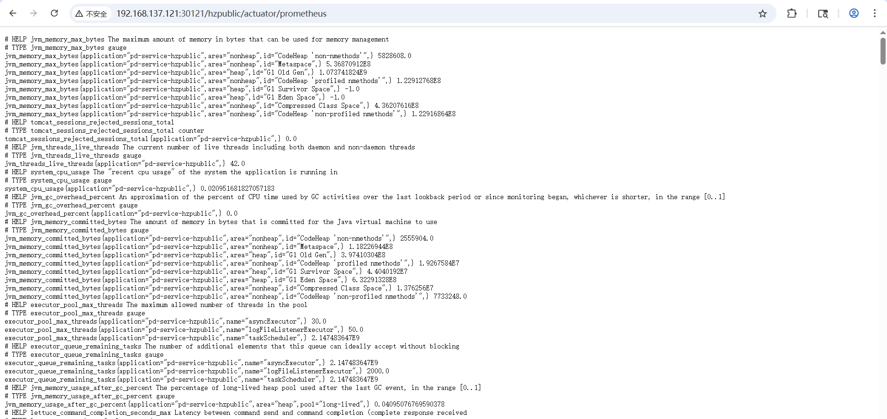

## Prometheus配置修改

### 配置文件修改（针对手动映射配置到容器场景）
如果是手动映射本地配置文件到prometheus容器中，则直接修改本地的配置文件即可，在 `prometheus.yaml` 中添加上 Service 对应的任务

```yaml
scrape_configs:
  # ...
  -  job_name: 'pd-service-hzpublic' # Prometheus 任务名称，自定义
     metrics_path: '/hzpublic/actuator/prometheus' # 指标获取路径
     scrape_interval: 5s # 抓取指标的间隔时间
     static_configs:
       - targets: ['svc-dz-service-hzpublic:31121'] # 指标访问入口，即 k8s 集群的 Service
  -  job_name: 'pd-service-hzctm' # Prometheus 任务名称，自定义
     metrics_path: '/hzctm/actuator/prometheus' # 指标获取路径
     scrape_interval: 5s # 抓取指标的间隔时间
     static_configs:
       - targets: ['192.168.137.132:31122'] # 指标访问入口，本地服务的IP 端口

```

### K8s部署文件修改（针对Prometheus Operator部署的场景）
- [k8s prometheus 配置文件 修改 k8s prometheus operator](https://blog.51cto.com/u_16213689/10372943)

使用Prometheus Operator部署时，数据采集是依赖于 `ServiceMonitor` 的，需要在服务部署信息中添加 `ServiceMonitor` 信息

```diff
apiVersion: v1
kind: Service
metadata:
  name: svc-hz-service-hzpublic
  namespace: hz-dev-service
# 用于匹配 ServiceMonitor spec.selector.matchLabels
+  labels:
+    app: hz-service-hzpublic
+    job: hz-service-hzpublic-job
spec:
  type: NodePort
  selector:
    app: hz-service-hzpublic
  ports:
    - name: http
      port: 31121
      targetPort: 31121
      nodePort: 31121

---
# 定义 ServiceMonitor
+ apiVersion: monitoring.coreos.com/v1
+ kind: ServiceMonitor
+ metadata:
+  # 元数据中 name 和 namespace 与 Service 中保持一致 metadata.name metadata.namespace
+  name: svc-dz-service-hzpublic
+  namespace: hz-dev-service
+  labels:
+    app: hz-service-hzpublic
+    # 这里的label release 是固定的，取值见下方详细说明
+    release: prometheus
+spec:
+  jobLabel: job
+  # 采集监控指标节点的配置： 采集间隔，采集端点，对应的服务端口名称(spec.port[*].name)
+  endpoints:
+    - interval: 5s
+      path: /hzpublic/actuator/prometheus
+      port: http
+  namespaceSelector:
+    any: true
+  selector:
+    matchLabels:
+      # 这里匹配的是Service 的Metadata中的label，从Service中复制即可 metadata.labels
+      app: hz-service-hzpublic
+      job: hz-service-hzpublic-job

---
# ...
# 后方的不需要修改，保持原样即可

```

在Dashboard中添加Dashboard[Spring Boot 2.1 System Monitor](https://grafana.com/grafana/dashboards/11378-justai-system-monitor/)
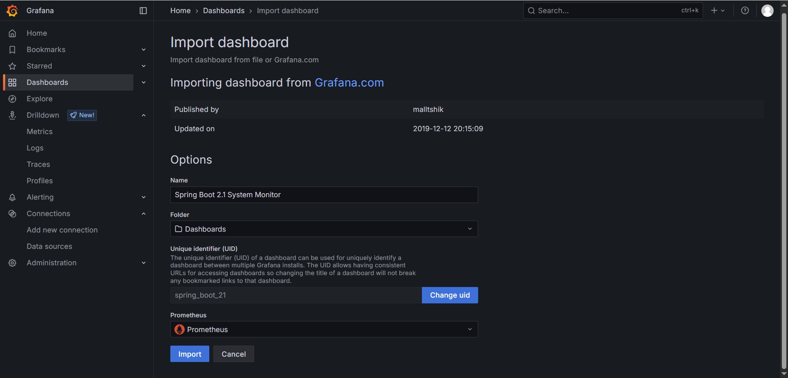
打开查看效果
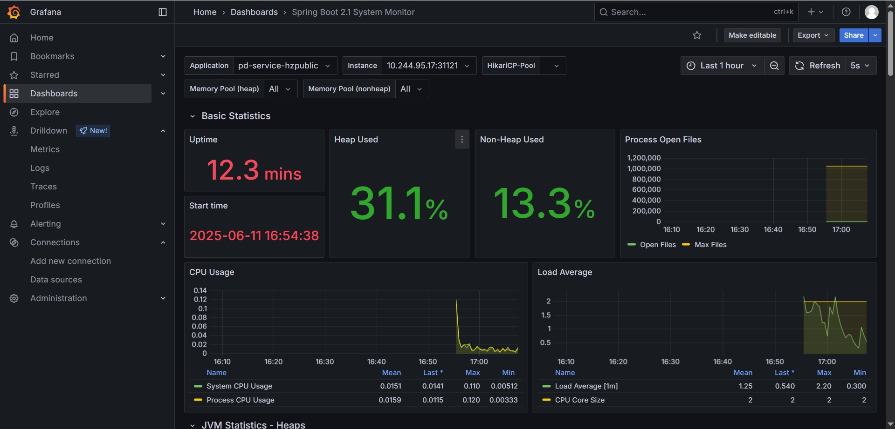

### ServiceMonitor中的 `metadata.labels.realease: prometheus` 说明

```shell
# 一键查询 ServiceMonitor 下 metadata.labels 的 K-V值
kubectl get prometheuses.monitoring.coreos.com -n monitoring -o jsonpath="{.items[0].spec.serviceMonitorSelector.matchLabels}"

# 全量信息见
kubectl get prometheuses.monitoring.coreos.com -n monitoring -o yaml

```

#### 查看ServiceMonitor
通地命令查看ServiceMonitor，是Kubernetes定制的Kubernetes component，正是以下这些ServiceMonitor产生了上述Prometheus的Targets：

```shell
kubectl get servicemonitor -n monitoring

# 输出结果
[diginn@k8s-master-01 services]$ kubectl get servicemonitor -n monitoring
NAME                                                 AGE
prometheus-grafana                                   25h
prometheus-kube-prometheus-alertmanager              25h
prometheus-kube-prometheus-apiserver                 25h
prometheus-kube-prometheus-coredns                   25h
prometheus-kube-prometheus-kube-controller-manager   25h
prometheus-kube-prometheus-kube-etcd                 25h
prometheus-kube-prometheus-kube-proxy                25h
prometheus-kube-prometheus-kube-scheduler            25h
prometheus-kube-prometheus-kubelet                   25h
prometheus-kube-prometheus-operator                  25h
prometheus-kube-prometheus-prometheus                25h
prometheus-kube-state-metrics                        25h
prometheus-prometheus-node-exporter                  25h

```

#### 查看ServiceMonitor详细信息
我们查看其中一个servicemonitor，以yaml形式展示：

```shell
kubectl get servicemonitor prometheus-grafana -n monitoring -o yaml

# 输出结果
[diginn@k8s-master-01 services]$ kubectl get servicemonitor prometheus-grafana -n monitoring -o yaml
apiVersion: monitoring.coreos.com/v1
kind: ServiceMonitor
metadata:
  annotations:
    meta.helm.sh/release-name: prometheus
    meta.helm.sh/release-namespace: monitoring
  creationTimestamp: "2025-06-10T07:32:22Z"
  generation: 1
  labels:
    app.kubernetes.io/instance: prometheus
    app.kubernetes.io/managed-by: Helm
    app.kubernetes.io/name: grafana
    app.kubernetes.io/version: 12.0.0-security-01
    helm.sh/chart: grafana-9.2.1
  name: prometheus-grafana
  namespace: monitoring
  resourceVersion: "198613"
  uid: 53d3048f-ca33-47bc-8387-acfc357b99ed
spec:
  endpoints:
  - honorLabels: true
    path: /metrics
    port: http-web
    scheme: http
    scrapeTimeout: 30s
  jobLabel: prometheus
  namespaceSelector:
    matchNames:
    - monitoring
  selector:
    matchLabels:
      app.kubernetes.io/instance: prometheus
      app.kubernetes.io/name: grafana

```
可以看到资源类型是`ServiceMonitor`，`endpoints`的端点是`/metrics`，其中一个`label`是`app.kubernetes.io/instance: prometheus`，这里的`label`为什么是`prometheus`呢？

其实是我们chart的name，我们在install prometheus的时候用的命令是`helm install prometheus prometheus-community/kube-prometheus-stack -n monitoring`，那么这里的`release-name`就是prometheus，如果我们换成abc，这里的`release-name`也会是abc，只要**和CRD中的matchLabels对应起来就可以了**

#### 查看CRD
要想看具体内部是怎么关联的，我们需要再查看CRD。上述ServiceMonitor的apiVersion为：`apiVersion: monitoring.coreos.com/v1`，我们查看下CRD，首先列出所有CRDs：

```shell
kubectl get crd -n monitoring | grep prometheuses.monitoring.coreos.com

# 输出结果
[diginn@k8s-master-01 services]$ kubectl get crd -n monitoring | grep prometheuses.monitoring.coreos.com
prometheuses.monitoring.coreos.com                    2025-06-10T06:50:23Z
```

#### 查看CRD详细信息
具体查看CRD=prometheuses.monitoring.coreos.com，以yaml格式展示：
```shell
kubectl get prometheuses.monitoring.coreos.com -n monitoring -o yaml

# 输出结果，重点关注PodMonitor ServiceMonitor

# PodMonitor 匹配的规则
podMonitorSelector:
  matchLabels:
    release: prometheus

# ServiceMonitor 匹配的规则，这里显示的label名称和值就是上面 ServiceMonitor需要添加的
serviceMonitorSelector:
  matchLabels:
    release: prometheus

```
资源定义很长，其中一段定义，所以我们创建的ServiceMonitor，需要加上这个Label，否则就不会被关联上并发现，如果我们chart name为其它名字，如abc，那么在安装生成CRD的时候这里的release就会是abc，而不是prometheus

## 本地部署 Spring Boot Jar包

配置环境变量

```shell
# 配置环境变量
cat >> ~/.bashrc << 'EOF'
export JAVA_HOME=/home/diginn/jdk-17.0.0.1
export PATH=$JAVA_HOME/bin:$PATH

EOF

# 加载环境变量
source ~/.bashrc
java --version

# 运行jar包
java -jar pd-service-hzctm.jar

# 日志位置
/home/diginn/logs/pd-service-hzctm-all.log

```

启停脚本
```shell
# 启动脚本
cat > startup.sh << 'EOF'
#!/bin/bash
nohup java -jar pd-service-hzctm.jar > /dev/null 2>&1 &
echo "$!" > pid
EOF

# 停止脚本
cat > shutdown.sh << 'EOF'
#!/bin/bash
kill -9 `cat pid`
echo "关闭成功!"
EOF

# 脚本添加执行权限
chmod +x startup.sh shutdown.sh

```

启动服务
```shell
./startup.sh

```

## 使用Prometheus Operator配置采集本地服务指标
- [使用Prometheus监控非K8S集群内机器](https://www.modb.pro/db/392899)

### 创建K8s部署资源文件
首先我们新建一个`ServiceMonitor`，用来统一监控非k8s集群内的服务，名称就定为 `spring-boot-exporter`。
另外我们还需要定义一个被监控机器的`Service`和`Endpoint`。将endpoint中的port设置为服务的运行端口。

以下是K8s资源部署文件的示例: `k8s-local.yaml`

```yaml
apiVersion: v1
kind: Service
metadata:
  name: spring-boot-exporter
  namespace: monitoring
  # 这里的labels要和 ServiceMonitor 的 spec.selector.matchLabels 一致
  labels:
    app: hz-service-hzctm
    job: hz-service-hzctm-job
spec:
 clusterIP: None
 type: ClusterIP

---

apiVersion: v1
kind: Endpoints
metadata:
  name: spring-boot-exporter
  namespace: monitoring
subsets:
  # 这里IP端口为本地服务的IP 和端口
  - addresses:
      - ip: 192.168.137.132
    ports:
      - name: http-metrics
        port: 31122
        protocol: TCP

---

apiVersion: monitoring.coreos.com/v1
kind: ServiceMonitor
metadata:
  name: spring-boot-exporter
  namespace: monitoring
  labels:
    app: hz-service-hzctm
    # 这个标签必须要有，key和value的取值见上面章节【ServiceMonitor中的 `metadata.labels.realease: prometheus` 说明】
    release: prometheus
spec:
  jobLabel: job
  endpoints:
    # 指标采集的端点信息，端口引用上面Endpoints中定义的port，path为指标端点的访问地址，需要包含服务的contextpath
    - port: http-metrics
      interval: 5s
      honorLabels: true
      scheme: http
      path: /hzctm/actuator/prometheus
  selector:
    # 这里的取值要和Service 的 metadata.labels 一致
    matchLabels:
      app: hz-service-hzctm
      job: hz-service-hzctm-job

```

### 部署资源服务

```shell
# 部署
kubectl apply -f k8s-local.yaml

# 删除
kubectl apply -f k8s-local.yaml

```

### 访问页面
部署完成后访问Prometheus 的服务发现页 `http://192.168.137.121:30203/service-discovery`
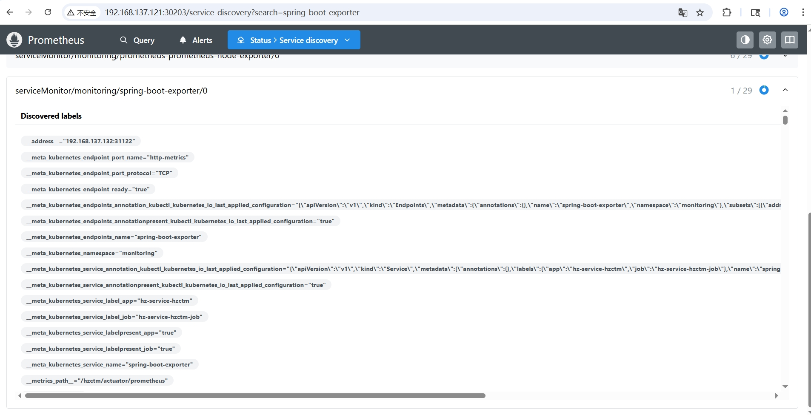
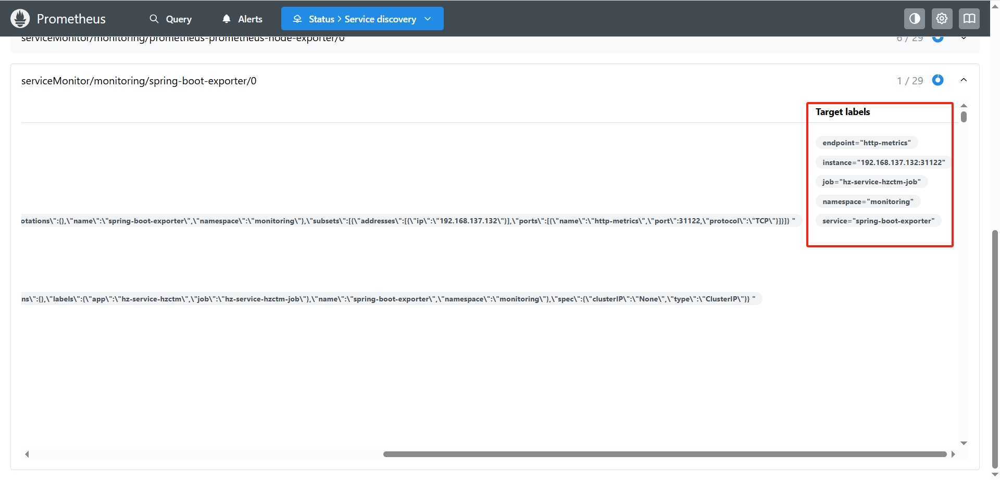
可以看到Prometheus已经有了本地服务的信息，如果`Target labels`显示 `dropped due to relabeling rules` 表示服务的配置存在错误，参考常见问题来解决

访问Grafana 监控面板页面 `http://192.168.137.121:31145/dashboards` 打开 `Spring Boot 2.1 System Monitor`
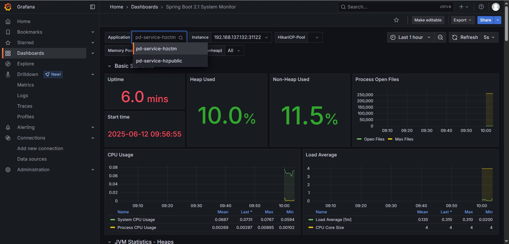
在这里已经有了本地服务的信息

# 常见问题

## Prometheus Service Discovery 中显示目标服务的检测指标数据被删除 【dropped due to relabeling rules】
访问Prometheus 服务发现页面: `http://192.168.137.121:30203/service-discovery?search=svc-dz-service-hzpublic`
- [Prometheus 中显示指标被删除](https://stackoverflow.com/questions/67818375/prometheus-target-discovery-dropped-target-labels)
- [在线校验K8s服务labels与Prometheus Relabeling rules](https://relabeler.promlabs.com/)

1. 错误信息
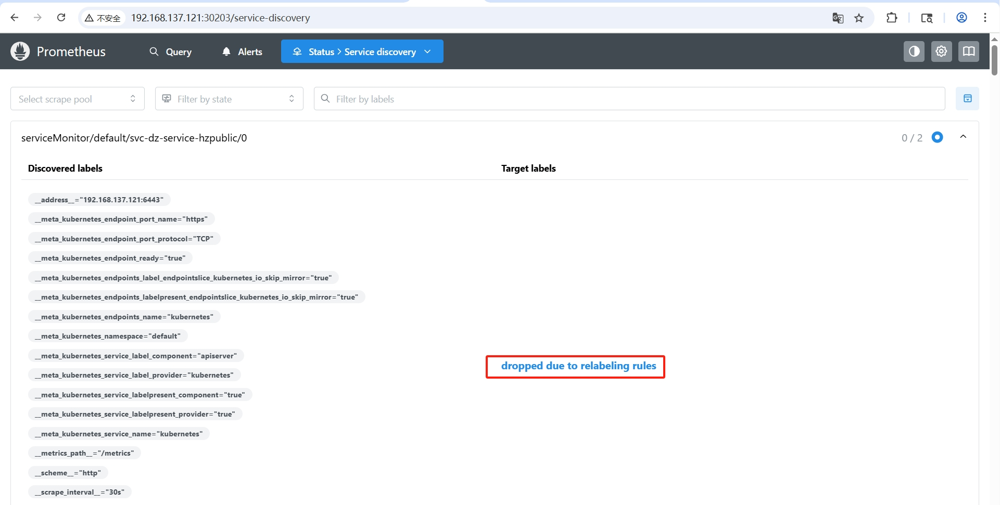

2. 异常原因
- namespace错误，如ServiceMonitor 的 namespace 与service的不一致

3. 解决方案

从 `Service Discovery` 复制 `Discovered labels` 与 `Configuraitons` 的指定job的 `relabel_configs` [比对校验](https://relabeler.promlabs.com/)
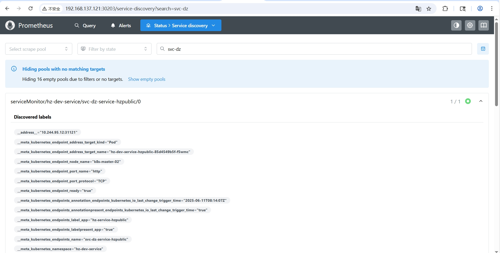
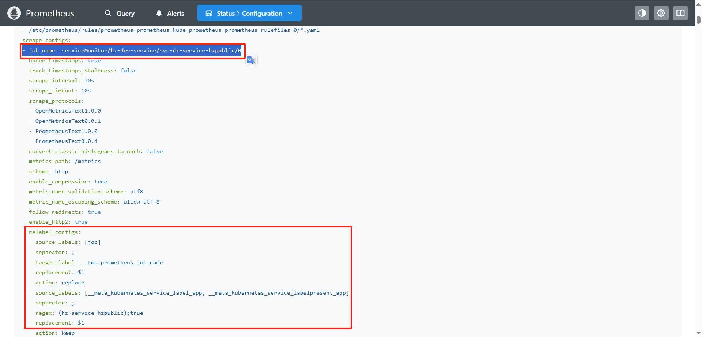
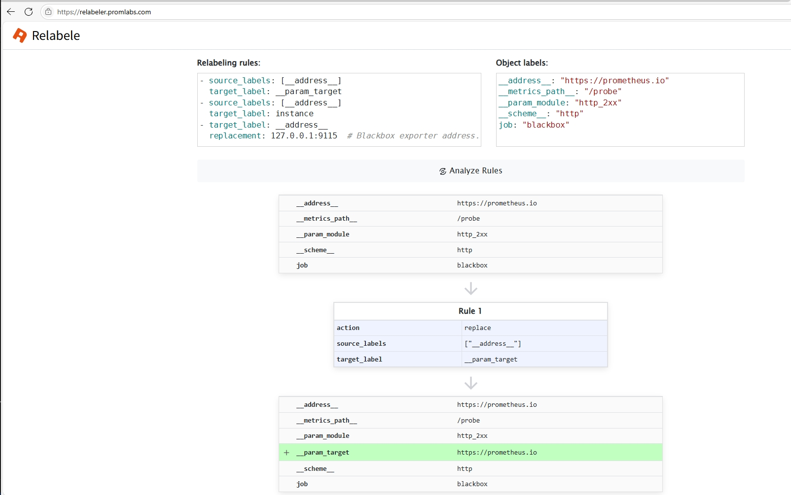

确认匹配规则是在哪一步失败的，然后针对这一步比对的tag修改服务部署配置
