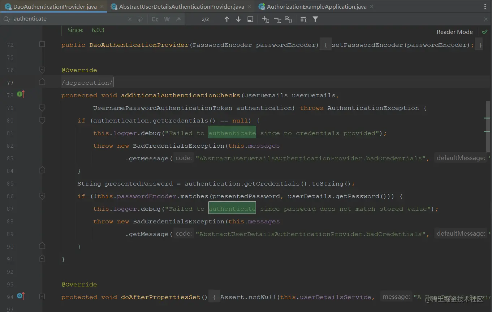
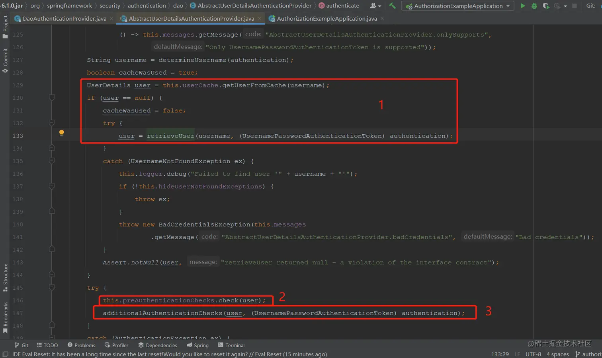
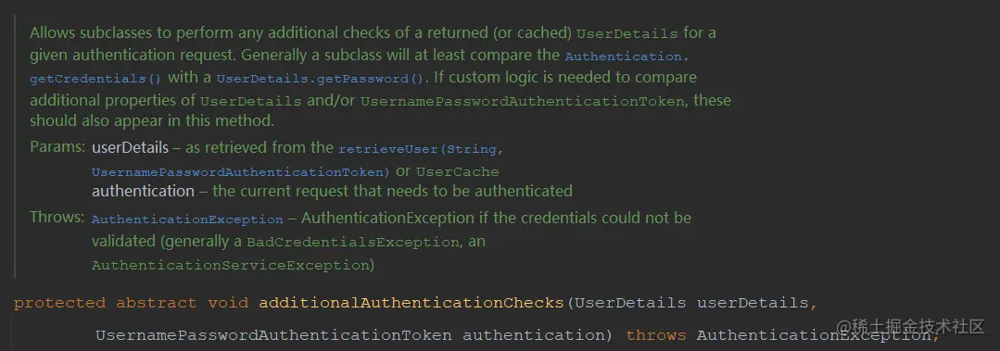
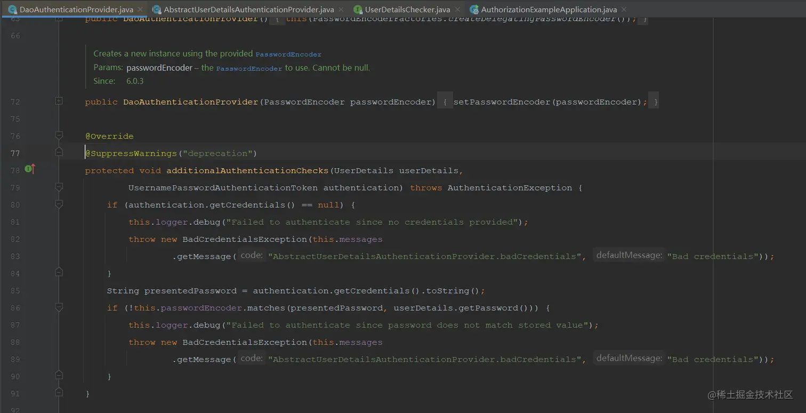
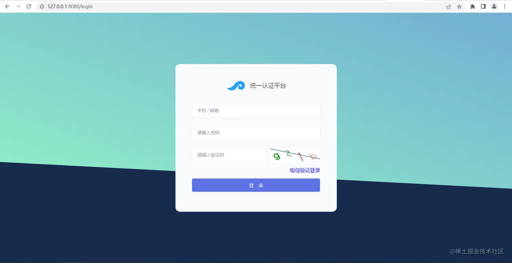
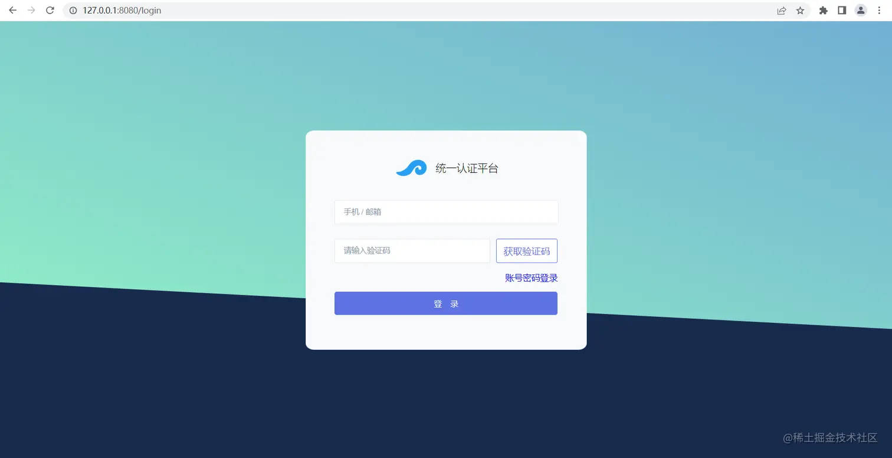
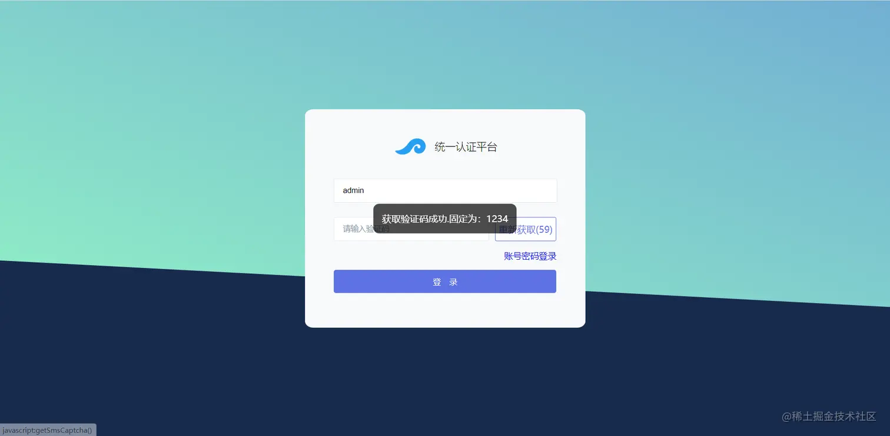
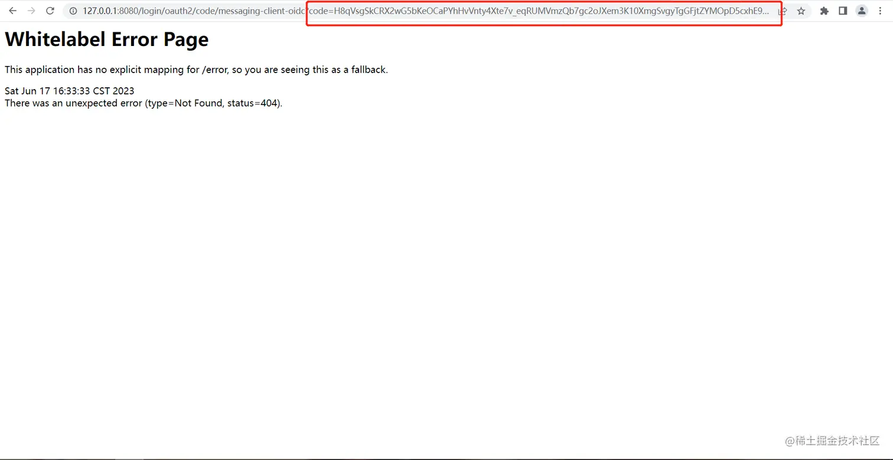
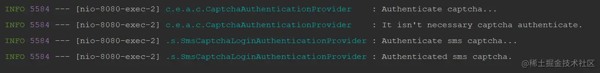

- [Spring Authorization Server入门 (十) 添加短信验证码方式登录](https://juejin.cn/post/7245538214114492474)

## 一、前言
各种网站应用的登录方式一直在往一个简单、方便且安全的方向发展，传统的账号密码已经不能满足需求了，现在通常都是短信验证码登录、扫码登录、刷脸登录等等，今天这篇文章就写一下如何使用Spring Authorization Server实现短信验证码登录；实际上这些也都是Spring security的内容。

## 二、实现思路
在[Spring Authorization Server入门 (七) 登录添加图形验证码](https://juejin.cn/post/7242476048005709879)一文中本人带各位读者了解了一下登录时框架所做的处理，当页面发起post方式的`/login`请求时会由`UsernamePasswordAuthenticationFilter`拦截处理，之后从请求参数中获取账号密码生成一个`UsernamePasswordAuthenticationToken`，然后交由`ProviderManager`处理，`ProviderManager`会根据token找到`DaoAuthenticationProvider`去处理账号密码的认证，上文中添加图形验证码去拦截非法请求的逻辑便是通过继承`DaoAuthenticationProvider`并重写认证方法实现的。今天就来了解一下`DaoAuthenticationProvider`中的认证逻辑，找到校验密码的地方，然后尝试重写校验方式。

## 三、账号密码认证逻辑分析
在`DaoAuthenticationProvider`中搜索`authenticate`方法没有搜索到



看一下父类`AbstractUserDetailsAuthenticationProvider`中的`authenticate`方法实现




1. 获取用户信息
2. 检查密码是否过期
3. 检查密码是否正确

着重看一下`additionalAuthenticationChecks`方法



这是一个抽象方法，方法注释中说明了该方法的用处，允许子类使用`userDetails`做任何附加校验，如果需要实现自定义逻辑实现应该要重写该方法以提供认证。那就说明`DaoAuthenticationProvider`也实现了该方法，来看下子类实现。



这里边做了两个校验，一个判断密码是否为空，一个判断数据库中的密码是否匹配用户输入的密码，到这里就很清晰了，写一个子类来重写该方法实现短信验证码的校验。

## 四、代码实现

### 1. 在`AuthorizationController`接口中添加一个获取验证码的接口
现在是demo就先固定1234
```java
@ResponseBody
@GetMapping("/getSmsCaptcha")
public Map<String,Object> getSmsCaptcha(String phone, HttpSession session) {
    // 这里应该返回一个统一响应类，暂时使用map代替
    Map<String,Object> result = new HashMap<>();
    result.put("code", HttpStatus.OK.value());
    result.put("success", true);
    result.put("message", "获取短信验证码成功.");
    // 固定1234
    result.put("data", "1234");
    // 存入session中
    session.setAttribute(phone, "1234");
    return result;
}
```

### 2. `AuthorizationConfig`中放行`/getSmsCaptcha`
```java
/**
 * 配置认证相关的过滤器链
 *
 * @param http spring security核心配置类
 * @return 过滤器链
 * @throws Exception 抛出
 */
@Bean
public SecurityFilterChain defaultSecurityFilterChain(HttpSecurity http) throws Exception {
    http.authorizeHttpRequests((authorize) -> authorize
                    // 放行静态资源
                    .requestMatchers("/assets/**", "/webjars/**", "/login", "/getCaptcha", "/getSmsCaptcha").permitAll()
                    .anyRequest().authenticated()
            )
            // 指定登录页面
            .formLogin(formLogin ->
                    formLogin.loginPage("/login")
            );
    // 添加BearerTokenAuthenticationFilter，将认证服务当做一个资源服务，解析请求头中的token
    http.oauth2ResourceServer((resourceServer) -> resourceServer
            .jwt(Customizer.withDefaults())
            .accessDeniedHandler(SecurityUtils::exceptionHandler)
            .authenticationEntryPoint(SecurityUtils::exceptionHandler)
    );

    return http.build();
}
```

### 3. 继承`CaptchaAuthenticationProvider`并重写`additionalAuthenticationChecks`方法
这里没有修改默认的key，如果想自定义key可以重写`authenticate`方法然后构建一个`UsernamePasswordAuthencationToken`再调用父类的`authenticate`方法就行，下方代码中有示例
```java
package com.example.authorization.sms;

import com.example.authorization.captcha.CaptchaAuthenticationProvider;
import com.example.constant.SecurityConstants;
import com.example.exception.InvalidCaptchaException;
import jakarta.servlet.http.HttpServletRequest;
import lombok.extern.slf4j.Slf4j;
import org.springframework.security.authentication.BadCredentialsException;
import org.springframework.security.authentication.UsernamePasswordAuthenticationToken;
import org.springframework.security.core.AuthenticationException;
import org.springframework.security.core.userdetails.UserDetails;
import org.springframework.security.core.userdetails.UserDetailsService;
import org.springframework.security.crypto.password.PasswordEncoder;
import org.springframework.stereotype.Component;
import org.springframework.web.context.request.RequestAttributes;
import org.springframework.web.context.request.RequestContextHolder;
import org.springframework.web.context.request.ServletRequestAttributes;

import java.util.Objects;

/**
 * 短信验证码校验实现
 *
 * @author vains
 */
@Slf4j
@Component
public class SmsCaptchaLoginAuthenticationProvider extends CaptchaAuthenticationProvider {

    /**
     * 利用构造方法在通过{@link Component}注解初始化时
     * 注入UserDetailsService和passwordEncoder，然后
     * 设置调用父类关于这两个属性的set方法设置进去
     *
     * @param userDetailsService 用户服务，给框架提供用户信息
     * @param passwordEncoder    密码解析器，用于加密和校验密码
     */
    public SmsCaptchaLoginAuthenticationProvider(UserDetailsService userDetailsService, PasswordEncoder passwordEncoder) {
        super(userDetailsService, passwordEncoder);
    }

    /*@Override
    public Authentication authenticate(Authentication authentication) throws AuthenticationException {
        // 获取当前request
        RequestAttributes requestAttributes = RequestContextHolder.getRequestAttributes();
        if (requestAttributes == null) {
            throw new InvalidCaptchaException("Failed to get the current request.");
        }
        HttpServletRequest request = ((ServletRequestAttributes) requestAttributes).getRequest();
        
        // 获取手机号与验证码
        String phone = request.getParameter("phone");
        String smsCaptcha = request.getParameter("smsCaptcha");
        // 非空校验
        if (ObjectUtils.isEmpty(phone) || ObjectUtils.isEmpty(smsCaptcha)) {
            throw new BadCredentialsException("账号密码不能为空.");
        }

        // 构建UsernamePasswordAuthenticationToken
        UsernamePasswordAuthenticationToken unauthenticated = UsernamePasswordAuthenticationToken.unauthenticated(phone, smsCaptcha);
        unauthenticated.setDetails(new WebAuthenticationDetails(request));

        return super.authenticate(unauthenticated);
    }*/

    @Override
    protected void additionalAuthenticationChecks(UserDetails userDetails, UsernamePasswordAuthenticationToken authentication) throws AuthenticationException {
        log.info("Authenticate sms captcha...");

        if (authentication.getCredentials() == null) {
            this.logger.debug("Failed to authenticate since no credentials provided");
            throw new BadCredentialsException("The sms captcha cannot be empty.");
        }

        // 获取当前request
        RequestAttributes requestAttributes = RequestContextHolder.getRequestAttributes();
        if (requestAttributes == null) {
            throw new InvalidCaptchaException("Failed to get the current request.");
        }
        HttpServletRequest request = ((ServletRequestAttributes) requestAttributes).getRequest();

        // 获取当前登录方式
        String loginType = request.getParameter("loginType");
        if (Objects.equals(loginType, SecurityConstants.SMS_LOGIN_TYPE)) {
            // 获取存入session的验证码(UsernamePasswordAuthenticationToken的principal中现在存入的是手机号)
            String smsCaptcha = (String) request.getSession(Boolean.FALSE).getAttribute((String) authentication.getPrincipal());
            // 校验输入的验证码是否正确(UsernamePasswordAuthenticationToken的credentials中现在存入的是输入的验证码)
            if (!Objects.equals(smsCaptcha, authentication.getCredentials())) {
                throw new BadCredentialsException("The sms captcha is incorrect.");
            }
        // 在这里也可以拓展其它登录方式，比如邮箱登录什么的
        } else {
            log.info("Not sms captcha loginType, exit.");
            // 其它调用父类默认实现的密码方式登录
            super.additionalAuthenticationChecks(userDetails, authentication);
        }

        log.info("Authenticated sms captcha.");
    }
}
```

该类继承自`CaptchaAuthenticationProvider`类, 这样就会保留图形验证码的校验流程，如果同时注入两个`DaoAuthenticationProvider`的子类则都不会生效，所以需要去除`CaptchaAuthenticationProvider`类的`Component`注解，短信验证码登录时不需要图形验证码校验的可以在`CaptchaAuthenticationProvider`类中添加一个校验，判断一下登录类型，如下
```java
package com.example.authorization.captcha;

import com.example.constant.SecurityConstants;
import com.example.exception.InvalidCaptchaException;
import jakarta.servlet.http.HttpServletRequest;
import lombok.extern.slf4j.Slf4j;
import org.springframework.security.authentication.dao.DaoAuthenticationProvider;
import org.springframework.security.core.Authentication;
import org.springframework.security.core.AuthenticationException;
import org.springframework.security.core.userdetails.UserDetailsService;
import org.springframework.security.crypto.password.PasswordEncoder;
import org.springframework.stereotype.Component;
import org.springframework.util.ObjectUtils;
import org.springframework.web.context.request.RequestAttributes;
import org.springframework.web.context.request.RequestContextHolder;
import org.springframework.web.context.request.ServletRequestAttributes;

import java.util.Objects;

/**
 * 验证码校验
 * 注入ioc中替换原先的DaoAuthenticationProvider
 * 在authenticate方法中添加校验验证码的逻辑
 * 最后调用父类的authenticate方法并返回
 *
 * @author vains
 */
@Slf4j
public class CaptchaAuthenticationProvider extends DaoAuthenticationProvider {

    /**
     * 利用构造方法在通过{@link Component}注解初始化时
     * 注入UserDetailsService和passwordEncoder，然后
     * 设置调用父类关于这两个属性的set方法设置进去
     *
     * @param userDetailsService 用户服务，给框架提供用户信息
     * @param passwordEncoder    密码解析器，用于加密和校验密码
     */
    public CaptchaAuthenticationProvider(UserDetailsService userDetailsService, PasswordEncoder passwordEncoder) {
        super.setPasswordEncoder(passwordEncoder);
        super.setUserDetailsService(userDetailsService);
    }

    @Override
    public Authentication authenticate(Authentication authentication) throws AuthenticationException {
        log.info("Authenticate captcha...");

        // 获取当前request
        RequestAttributes requestAttributes = RequestContextHolder.getRequestAttributes();
        if (requestAttributes == null) {
            throw new InvalidCaptchaException("Failed to get the current request.");
        }
        HttpServletRequest request = ((ServletRequestAttributes) requestAttributes).getRequest();

        // 获取当前登录方式
        String loginType = request.getParameter("loginType");
        if (Objects.equals(loginType, SecurityConstants.SMS_LOGIN_TYPE)) {
            log.info("It isn't necessary captcha authenticate.");
            return super.authenticate(authentication);
        }

        // 获取参数中的验证码
        String code = request.getParameter("code");
        if (ObjectUtils.isEmpty(code)) {
            throw new InvalidCaptchaException("The captcha cannot be empty.");
        }

        // 获取session中存储的验证码
        Object sessionCaptcha = request.getSession(Boolean.FALSE).getAttribute("captcha");
        if (sessionCaptcha instanceof String sessionCode) {
            if (!sessionCode.equalsIgnoreCase(code)) {
                throw new InvalidCaptchaException("The captcha is incorrect.");
            }
        } else {
            throw new InvalidCaptchaException("The captcha is abnormal. Obtain it again.");
        }

        log.info("Captcha authenticated.");
        return super.authenticate(authentication);
    }
}
```

### 4. 修改登录页面，添加短信验证码方式登录
登录页面写的比较粗糙，大家使用自己的登录页面就好，主要的就是使用短信验证码登录时提交的表单数据的key与后端对应上就行。

`login.html`
```html
<!DOCTYPE html>
<html lang="zh-CN">

<head>
    <meta charset="UTF-8">
    <meta http-equiv="X-UA-Compatible" content="IE=edge">
    <meta name="viewport"
          content="width=device-width, initial-scale=1 minimum-scale=1 maximum-scale=1 user-scalable=no"/>
    <link rel="stylesheet" href="./assets/css/style.css" type="text/css"/>
    <title>统一认证平台</title>
</head>

<body>
<div class="bottom-container">
</div>
<!-- <div th:if="${error}" class="alert" id="alert">
<div class="error-alert">

<div th:text="${error}">

</div>
</div>
</div> -->
<div id="error_box">
</div>
<div class="form-container">

    <form class="form-signin" method="post" th:action="@{/login}">
        <input type="hidden" id="loginType" name="loginType" value="passwordLogin"/>
        <!-- <div th:if="${param.error}" class="alert alert-danger" role="alert" th:text="${param}">
Invalid username or password.
</div>
<div th:if="${param.logout}" class="alert alert-success" role="alert">
你已经登出成功.
</div> -->

        <!--        <div class="text-placeholder" style="padding-bottom: 20px;">-->
        <!--            平台登录-->
        <!--        </div>-->
        <div class="welcome-text">
            
            <span>
                    统一认证平台
                </span>
        </div>
        <div>
            <input type="text" id="username" name="username" class="form-control" placeholder="手机 / 邮箱"
                   autofocus onblur="leave()"/>
        </div>
        <div id="passContainer">
            <input type="password" id="password" name="password" class="form-control" placeholder="请输入密码"
                   onblur="leave()"/>
        </div>
        <div class="code-container" id="codeContainer">
            <input type="text" id="code" name="code" class="form-control" placeholder="请输入验证码"
                   onblur="leave()"/>
            
        </div>
        <div style="display: none; margin-bottom: 0" class="code-container" id="smsContainer">
            <input type="text" name="" class="form-control" placeholder="请输入验证码" onblur="leave()"/>
            <a id="getSmsCaptchaBtn" class="btn btn-light btn-block bg-white getCaptcha"
               href="javascript:getSmsCaptcha()">获取验证码</a>
        </div>
        <div class="change-login-type">
            <div></div>
            <a id="changeLoginType" href="javascript:showSmsCaptchaPage()">短信验证登录</a>
        </div>
        <button class="btn btn-lg btn-primary btn-block" type="submit">登&nbsp;&nbsp;&nbsp;&nbsp;录</button>
        <!--<a class="btn btn-light btn-block bg-white" href="/oauth2/authorization/gitee" role="link" style="text-transform: none;">
Sign in with Gitee
</a>-->
        <!--        <div class="text-placeholder">-->
        <!--            第三方登录-->
        <!--        </div>-->
        <!--        <div>-->
        <!--            <a class="btn btn-light btn-block bg-white" href="/oauth2/authorization/github-idp" role="link"-->
        <!--               style="text-transform: none;">-->
        <!--                
        <!--                     src="https://github.githubassets.com/images/modules/logos_page/GitHub-Mark.png" />-->
        <!--                Github-->
        <!--            </a>-->
        <!--        </div>-->
    </form>
</div>
</body>

</html>
<script>
    function showSmsCaptchaPage() {
        // 隐藏密码框
        let passContainer = document.getElementById('passContainer');
        passContainer.style.display = 'none';
        // 设置password输入框的name为空
        passContainer.children[0].setAttribute('name', '')
        // 隐藏验证码框
        let codeContainer = document.getElementById('codeContainer');
        codeContainer.style.display = 'none';
        // 设置登录类型为短信验证码
        let loginType = document.getElementById('loginType');
        loginType.value = 'smsCaptcha';
        // 显示获取短信验证码按钮与输入框
        let smsContainer = document.getElementById('smsContainer');
        smsContainer.style.display = '';
        smsContainer.children[0].setAttribute('name', 'password')
        // 设置切换按钮文字与点击效果
        let changeLoginType = document.getElementById('changeLoginType');
        changeLoginType.innerText = '账号密码登录';
        changeLoginType.setAttribute('href', 'javascript:showPasswordPage()')
        changeLoginType.style.paddingTop = '25px';
        changeLoginType.style.paddingBottom = '5px';
    }

    function showPasswordPage() {
        // 显示密码框
        let passContainer = document.getElementById('passContainer');
        passContainer.style.display = '';
        // 设置password输入框
        passContainer.children[0].setAttribute('name', 'password')
        // 显示验证码框
        let codeContainer = document.getElementById('codeContainer');
        codeContainer.style.display = '';
        // 设置登录类型为账号密码
        let loginType = document.getElementById('loginType');
        loginType.value = 'passwordLogin';
        // 隐藏获取短信验证码按钮与输入框
        let smsContainer = document.getElementById('smsContainer');
        smsContainer.style.display = 'none';
        smsContainer.children[0].setAttribute('name', '')
        // 设置切换按钮文字与点击效果
        let changeLoginType = document.getElementById('changeLoginType');
        changeLoginType.innerText = '短信验证登录'
        changeLoginType.setAttribute('href', 'javascript:showSmsCaptchaPage()')
        changeLoginType.style.paddingTop = '0';
    }

    function leave() {
        document.body.scrollTop = document.documentElement.scrollTop = 0;
    }

    function getVerifyCode() {
        let requestOptions = {
            method: 'GET',
            redirect: 'follow'
        };

        fetch(`${window.location.origin}/getCaptcha`, requestOptions)
            .then(response => response.text())
            .then(r => {
                if (r) {
                    let result = JSON.parse(r);
                    document.getElementById('code-image').src = result.data
                }
            })
            .catch(error => console.log('error', error));
    }

    function getSmsCaptcha() {

        let phone = document.getElementById('username').value;
        if (phone === null || phone === '' || typeof phone === 'undefined') {
            showError('手机号码不能为空.')
            return;
        }

        // 禁用按钮
        let getSmsCaptchaBtn = document.getElementById('getSmsCaptchaBtn');
        getSmsCaptchaBtn.style.pointerEvents = 'none';
        // 开始1分钟倒计时
        resetBtn(getSmsCaptchaBtn);

        let requestOptions = {
            method: 'GET',
            redirect: 'follow'
        };

        fetch(`${window.location.origin}/getSmsCaptcha?phone=${phone}`, requestOptions)
            .then(response => response.text())
            .then(r => {
                if (r) {
                    let result = JSON.parse(r);
                    if (result.success) {
                        showError('获取验证码成功.固定为：' + result.data)
                    }
                }
            })
            .catch(error => console.log('error', error));
    }

    /**
     * 1分钟倒计时
     */
    function resetBtn(getSmsCaptchaBtn) {
        let s = 60;
        getSmsCaptchaBtn.innerText = `重新获取(${--s})`
        // 定时器 每隔一秒变化一次（1000ms = 1s）
        let t = setInterval(() => {
            getSmsCaptchaBtn.innerText = `重新获取(${--s})`
            if (s === 0) {
                clearInterval(t)
                getSmsCaptchaBtn.innerText = '获取验证码'
                getSmsCaptchaBtn.style.pointerEvents = '';
            }
        }, 1000);

    }

    getVerifyCode();
</script>
<script th:inline="javascript">

    function showError(message) {
        let errorBox = document.getElementById("error_box");
        errorBox.innerHTML = message;
        errorBox.style.display = "block";
        setTimeout(() => {
            closeError();
        }, 3000)
    }

    function closeError() {
        let errorBox = document.getElementById("error_box");
        errorBox.style.display = "none";
    }

    let error = [[${ error }]]
    if (error) {
        if (window.Notification) {
            Notification.requestPermission(function () {
                if (Notification.permission === 'granted') {
                    // 用户点击了允许
                    let n = new Notification('登录失败', {
                        body: error,
                        icon: './assets/img/logo.png'
                    })

                    setTimeout(() => {
                        n.close();
                    }, 3000)
                } else {
                    showError(error);
                }
            })
        }
    }
</script>
```

`style.css`
```css
* {
    margin: 0;
    padding: 0;
}

body {
    height: 100vh;
    overflow: hidden;
    background: linear-gradient(200deg, #72afd3, #96fbc4);
}

/* 上方欢迎语 */
.welcome-text {
    color: black;
    display: flex;
    font-size: 18px;
    font-weight: 300;
    line-height: 1.7;
    align-items: center;
    justify-content: center;
}

.welcome-text img {
    margin-right: 12px !important;
}

/* 提示文字 */
.text-placeholder {
    display: flex;
    font-size: 80%;
    color: #909399;
    justify-content: center;
}

/* 下方背景颜色 */
.bottom-container {
    width: 100%;
    height: 50vh;
    bottom: -15vh;
    position: absolute;
    transform: skew(0, 3deg);
    background: rgb(23, 43, 77);
}

/* 表单卡片样式 */
.form-container {
    width: 100vw;
    display: flex;
    height: 100vh;
    align-items: center;
    justify-content: center;
}

/* 表单样式 */
.form-signin {
    z-index: 20;
    width: 25vw;
    display: flex;
    border-radius: 3%;
    padding: 35px 50px;
    flex-direction: column;
    background: rgb(247, 250, 252);
}

/* 按钮样式 */
.btn-primary {
    height: 40px;
    color: white;
    cursor: pointer;
    border-radius: 0.25rem;
    background: #5e72e4;
    border: 1px #5e72e4 solid;
    transition: all 0.15s ease;
    /* -webkit-box-shadow: 0 4px 6px rgb(50 50 93 / 11%), 0 1px 3px rgb(0 0 0 / 8%);
    box-shadow: 0 4px 6px rgb(50 50 93 / 11%), 0 1px 3px rgb(0 0 0 / 8%); */
}

.btn-primary:hover {
    transform: translateY(-3%);
    -webkit-box-shadow: 0 4px 6px rgb(50 50 93 / 11%), 0 1px 3px rgb(0 0 0 / 8%);
    box-shadow: 0 4px 6px rgb(50 50 93 / 11%), 0 1px 3px rgb(0 0 0 / 8%);
}

/* 表单间距 */
.form-signin div, button {
    margin-bottom: 25px;
}

/* 表单输入框 */
.form-signin input {
    width: 100%;
    height: 40px;
    outline: none;
    text-indent: 15px;
    border-radius: 3px;
    border: 1px #e4e7ed solid;
}

/* 表单验证码容器 */
.code-container {
    display: flex;
    justify-content: space-between;
}

/* 表单验证码容器 */
.code-container input {
    margin-right: 10px;
}

#code-image {
    width: 150px;
    height: 40px;
}

.code-btn {
    width: 150px;
    height: 40px;
}

/* 表单超链接 */
.btn-light {
    height: 40px;
    display: flex;
    color: #5e72e4;
    border-radius: 3px;
    align-items: center;
    justify-content: center;
    border: 1px #5e72e4 solid;
}

.form-signin img {
    margin: 0;
}

.form-signin a {
    text-decoration: none;
}

.btn-light:hover {
    transform: translateY(-3%);
    -webkit-box-shadow: 0 4px 6px rgb(50 50 93 / 11%), 0 1px 3px rgb(0 0 0 / 8%);
    box-shadow: 0 4px 6px rgb(50 50 93 / 11%), 0 1px 3px rgb(0 0 0 / 8%);
}

.form-signin input:focus {
    border: 1px solid rgb(41, 50, 225);
}

.alert {
    top: 20px;
    width: 100%;
    z-index: 50;
    display: flex;
    position: absolute;
    align-items: center;
    justify-content: center;
}

/* 弹框样式 */
#error_box {
    background-color: rgba(0, 0, 0, 0.7);
    color: #fff;
    position: fixed;
    top: 50%;
    left: 50%;
    transform: translate(-50%, -50%);
    border-radius: 10px;
    padding: 15px;
    display: none;
    z-index: 500;
    animation: shake 0.2s;
}

/* 切换登录方式按钮 */
.change-login-type {
    display: flex;
    font-size: 15px;
    justify-content: space-between;
    margin-top: -10px !important;
    margin-bottom: 10px !important;
}

.getCaptcha {
    width: 150px;
    background-color: white;
}

#error_message {
    padding-left: 10px;
}

@keyframes shake {
    0% {
        transform: translate(-50%, -50%);
    }

    25% {
        transform: translate(-45%, -50%);
    }

    50% {
        transform: translate(-50%, -50%);
    }

    75% {
        transform: translate(-45%, -50%);
    }

    100% {
        transform: translate(-50%, -50%);
    }
}

/*修改提示信息的文本颜色*/
input::-webkit-input-placeholder {
    /* WebKit browsers */
    color: #8898aa;
}

input::-moz-placeholder {
    /* Mozilla Firefox 19+ */
    color: #8898aa;
}

input:-ms-input-placeholder {
    /* Internet Explorer 10+ */
    color: #8898aa;
}

/* 移动端css */
@media screen and (orientation: portrait) {
    .form-signin {
        width: 100%;
    }

    .form-container {
        width: auto;
        height: 90vh;
        padding: 20px;
    }

    .welcome-text {
        top: 9vh;
        flex-direction: column;
    }
}

/* 宽度 */
/* 屏幕 > 666px && < 800px */
@media (min-width: 667px) and (max-width: 800px) {
    .form-signin {
        width: 50vw;
    }

    .welcome-text {
        top: 18vh;
    }
}

/* 屏幕 > 800px */
@media (min-width: 800px) and (max-width: 1000px) {
    .form-signin {
        width: 500px;
    }
}

/* 高度 */
@media (min-height: 600px) and (max-height: 600px) {
    .welcome-text {
        top: 6%;
    }
}

@media (min-height: 800px) and (max-height: 1000px) {
    .welcome-text {
        top: 12%;
    }
}
```

### 5. 测试
到这里编码部分就完成了，接下来测试下看看

#### 1. 访问请求授权接口
```shell
http://127.0.0.1:8080/oauth2/authorize?response_type=code&client_id=pkce-message-client&redirect_uri=http://127.0.0.1:8080/login/oauth2/code/messaging-client-oidc&scope=message.read&code_challenge=kfis_wJYpmCAPO-Ap1Sc6GXyz_x2dhhMsm9FOA7eEWY&code_challenge_method=S256
```

#### 2. 重定向至登录页面



#### 3. 点击短信验证登录，切换短信登录



#### 4. 输入手机号，点击获取验证码
因为没有重写UserDetailsService的loadByUsername方法，所以这里用账号模拟手机号。



获取成功，开始倒数
#### 5. 输入验证码提交登录
携带token重定向至回调地址



#### 6. 查看控制台日志
观察日志可以发现自定义的短信验证码校验已生效



## 五、SecurityConstants.java
新建一个constant包
```java
package com.example.constant;

/**
 * security 常量类
 *
 * @author vains
 */
public class SecurityConstants {

    /**
     * 登录方式——短信验证码
     */
    public static final String SMS_LOGIN_TYPE = "smsCaptcha";

    /**
     * 权限在token中的key
     */
    public static final String AUTHORITIES_KEY = "authorities";

}
```

代码已提交至Gitee：https://gitee.com/vains-Sofia/authorization-example
