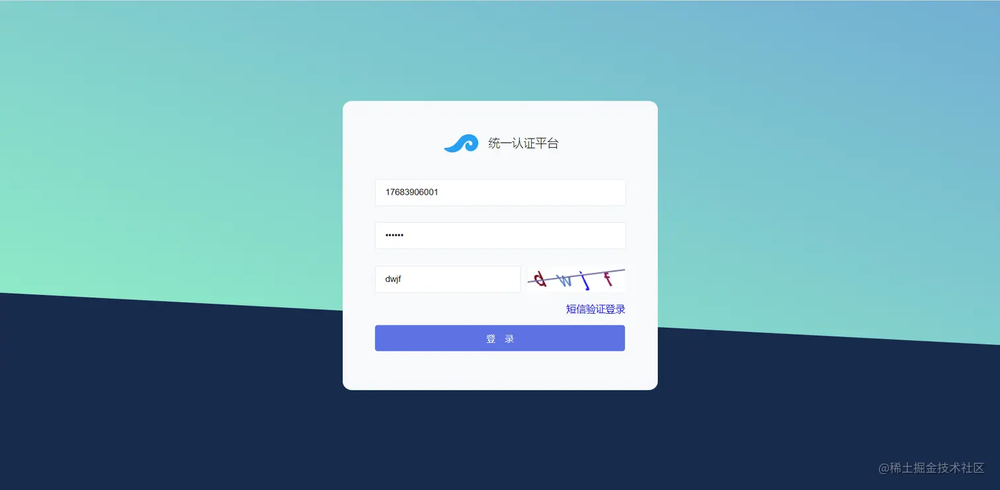
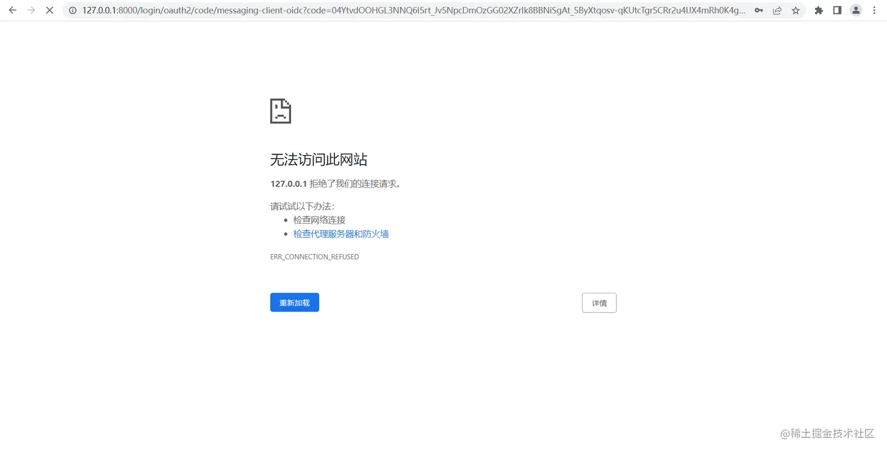
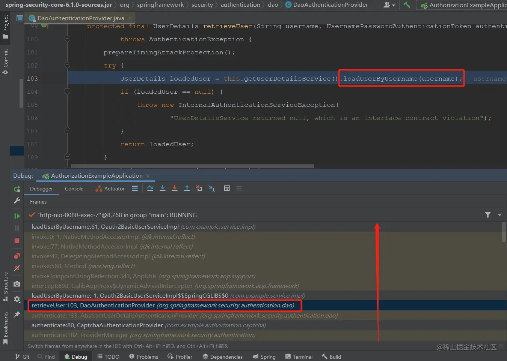

- [Spring Authorization Server优化篇：自定义UserDetailsService实现从数据库获取用户信息](https://juejin.cn/post/7252251628090294309)

## 一、前言
本篇文章会带大家实现自定义的`UserDetailsService`，从数据库获取用户及权限信息；也会带大家了解一下框架是怎么获取用户信息的。

## 二、实现步骤

- 初始化数据库表结构
- 编写相关表的实体、mapper接口和mapper文件
- 实现`UserDetailsService`接口，实现`loadUserByUsername`抽象方法。

## 三、初始化数据库表结构
数据库表结构使用经典的RBAC模型，一共有五张表：用户、角色、权限、用户角色关联和角色权限关联表；关于三方登录账户信息表需要的可以加一下，该表主要存储三方登录获取到的用户信息。因为只是示例，所以表中字段都很简陋，大家替换成自己的用户表即可。
```sql
SET NAMES utf8mb4;
SET
FOREIGN_KEY_CHECKS = 0;

-- ----------------------------
-- Table structure for oauth2_basic_user
-- ----------------------------
DROP TABLE IF EXISTS `oauth2_basic_user`;
CREATE TABLE `oauth2_basic_user`
(
    `id`          int(11) NOT NULL AUTO_INCREMENT COMMENT '自增id',
    `name`        varchar(255) CHARACTER SET utf8mb4 COLLATE utf8mb4_bin NULL DEFAULT NULL COMMENT '用户名、昵称',
    `account`     varchar(255) CHARACTER SET utf8mb4 COLLATE utf8mb4_bin NULL DEFAULT NULL COMMENT '账号',
    `password`    varchar(255) CHARACTER SET utf8mb4 COLLATE utf8mb4_bin NULL DEFAULT NULL COMMENT '密码',
    `mobile`      varchar(11) CHARACTER SET utf8mb4 COLLATE utf8mb4_bin NULL DEFAULT NULL COMMENT '手机号',
    `email`       varchar(50) CHARACTER SET utf8mb4 COLLATE utf8mb4_bin NULL DEFAULT NULL COMMENT '邮箱',
    `avatar_url`  varchar(255) CHARACTER SET utf8mb4 COLLATE utf8mb4_bin NULL DEFAULT NULL COMMENT '头像地址',
    `deleted`     tinyint(1) NULL DEFAULT NULL COMMENT '是否已删除',
    `source_from` varchar(255) CHARACTER SET utf8mb4 COLLATE utf8mb4_bin NULL DEFAULT NULL COMMENT '用户来源',
    `create_time` datetime(0) NULL DEFAULT NULL COMMENT '创建时间',
    `update_time` datetime(0) NULL DEFAULT NULL COMMENT '修改时间',
    PRIMARY KEY (`id`) USING BTREE
) ENGINE = InnoDB AUTO_INCREMENT = 2 CHARACTER SET = utf8mb4 COLLATE = utf8mb4_bin COMMENT = '基础用户信息表';

-- ----------------------------
-- Records of oauth2_basic_user
-- ----------------------------
BEGIN;
INSERT INTO `oauth2_basic_user`
VALUES (1, '云逸', 'admin', '$2a$10$K7nVcC.75YZSZU1Fq6G6buYujG.dolGYGPboh7eQbtkdFmB0EfN5K', '17683906991',
        '17683906991@163.com', NULL, 0, 'system', '2023-06-20 15:20:42', '2023-06-20 15:20:42');
COMMIT;

-- ----------------------------
-- Table structure for oauth2_third_Account
-- ----------------------------
DROP TABLE IF EXISTS `oauth2_third_Account`;
CREATE TABLE `oauth2_third_account`
(
    `id`          int(11) NOT NULL AUTO_INCREMENT COMMENT '自增id',
    `user_id`     int(11) NULL DEFAULT NULL COMMENT '用户表主键',
    `unique_id`   varchar(255) CHARACTER SET utf8mb4 COLLATE utf8mb4_bin NULL DEFAULT NULL COMMENT '三方登录唯一id',
    `type`        varchar(255) CHARACTER SET utf8mb4 COLLATE utf8mb4_bin NULL DEFAULT NULL COMMENT '三方登录类型',
    `blog`        varchar(255) CHARACTER SET utf8mb4 COLLATE utf8mb4_bin NULL DEFAULT NULL COMMENT '博客地址',
    `location`    varchar(255) CHARACTER SET utf8mb4 COLLATE utf8mb4_bin NULL DEFAULT NULL COMMENT '地址',
    `create_time` datetime(0) NULL DEFAULT NULL COMMENT '绑定时间',
    `update_time` datetime(0) NULL DEFAULT NULL COMMENT '修改时间',
    PRIMARY KEY (`id`) USING BTREE
) ENGINE = InnoDB AUTO_INCREMENT = 1 CHARACTER SET = utf8mb4 COLLATE = utf8mb4_bin COMMENT = '三方登录账户信息表';

-- ----------------------------
-- Table structure for sys_authority
-- ----------------------------
DROP TABLE IF EXISTS `sys_authority`;
CREATE TABLE `sys_authority`
(
    `id`             int(11) NOT NULL AUTO_INCREMENT COMMENT '菜单自增ID',
    `name`           varchar(16) CHARACTER SET utf8mb4 COLLATE utf8mb4_bin NOT NULL COMMENT '菜单名称',
    `menu_pid`       int(11) NOT NULL COMMENT '父菜单ID',
    `url`            varchar(64) CHARACTER SET utf8mb4 COLLATE utf8mb4_bin NOT NULL COMMENT '跳转URL',
    `authority`      varchar(255) CHARACTER SET utf8mb4 COLLATE utf8mb4_bin NULL DEFAULT NULL COMMENT '所需权限',
    `sort`           tinyint(4) NULL DEFAULT NULL COMMENT '排序',
    `type`           tinyint(4) NOT NULL COMMENT '0:菜单,1:接口',
    `deleted`        tinyint(1) NOT NULL COMMENT '0:启用,1:删除',
    `create_time`    datetime(0) NOT NULL COMMENT '创建时间',
    `create_user_id` int(11) NOT NULL COMMENT '创建人',
    PRIMARY KEY (`id`) USING BTREE
) ENGINE = InnoDB AUTO_INCREMENT = 4 CHARACTER SET = utf8mb4 COLLATE = utf8mb4_bin COMMENT = '系统菜单表';

-- ----------------------------
-- Records of sys_authority
-- ----------------------------
BEGIN;
INSERT INTO `sys_authority`
VALUES (1, '系统管理', 0, '/system', 'system', 0, 0, 0, '2022-03-25 23:52:03', 1),
       (2, 'app', 0, '/**', 'app', 1, 1, 0, '2023-06-20 15:18:49', 1),
       (3, 'web', 0, '/**', 'web', 2, 1, 0, '2023-06-20 15:19:12', 1);
COMMIT;

-- ----------------------------
-- Table structure for sys_role
-- ----------------------------
DROP TABLE IF EXISTS `sys_role`;
CREATE TABLE `sys_role`
(
    `id`             int(11) NOT NULL AUTO_INCREMENT COMMENT '角色自增ID',
    `role_name`      varchar(16) CHARACTER SET utf8 COLLATE utf8_general_ci NOT NULL COMMENT '角色名',
    `deleted`        tinyint(1) NULL DEFAULT NULL COMMENT '0:启用,1:删除',
    `sort`           int(11) NULL DEFAULT NULL COMMENT '排序',
    `create_time`    datetime(0) NOT NULL COMMENT '创建时间',
    `create_user_id` int(11) NOT NULL COMMENT '创建人',
    PRIMARY KEY (`id`) USING BTREE
) ENGINE = InnoDB AUTO_INCREMENT = 2 CHARACTER SET = utf8 COLLATE = utf8_general_ci COMMENT = '系统角色表';

-- ----------------------------
-- Records of sys_role
-- ----------------------------
BEGIN;
INSERT INTO `sys_role`
VALUES (1, '管理员', 0, 0, '2022-03-25 23:51:04', 1);
COMMIT;

-- ----------------------------
-- Table structure for sys_role_authority
-- ----------------------------
DROP TABLE IF EXISTS `sys_role_authority`;
CREATE TABLE `sys_role_authority`
(
    `id`           int(11) NOT NULL AUTO_INCREMENT COMMENT '角色菜单关联表自增ID',
    `role_id`      int(16) NOT NULL COMMENT '角色ID',
    `authority_id` int(11) NOT NULL COMMENT '权限菜单ID',
    PRIMARY KEY (`id`) USING BTREE
) ENGINE = InnoDB AUTO_INCREMENT = 4 CHARACTER SET = utf8 COLLATE = utf8_general_ci COMMENT = '角色菜单多对多关联表';

-- ----------------------------
-- Records of sys_role_authority
-- ----------------------------
BEGIN;
INSERT INTO `sys_role_authority`
VALUES (1, 1, 1),
       (2, 1, 2),
       (3, 1, 3);
COMMIT;

-- ----------------------------
-- Table structure for sys_user_role
-- ----------------------------
DROP TABLE IF EXISTS `sys_user_role`;
CREATE TABLE `sys_user_role`
(
    `id`      int(11) NOT NULL AUTO_INCREMENT,
    `role_id` int(16) NULL DEFAULT NULL COMMENT '角色ID',
    `user_id` int(18) NULL DEFAULT NULL COMMENT '用户ID',
    PRIMARY KEY (`id`) USING BTREE
) ENGINE = InnoDB AUTO_INCREMENT = 2 CHARACTER SET = utf8 COLLATE = utf8_general_ci;

-- ----------------------------
-- Records of sys_user_role
-- ----------------------------
BEGIN;
INSERT INTO `sys_user_role`
VALUES (1, 1, 1);
COMMIT;

SET
FOREIGN_KEY_CHECKS = 1;
```

## 四、通过代码生成器生成entity、mapper、mapper文件
这些东西在使用MybatisPlus时基本是固定的，所以没必要去浪费时间，直接通过生成器生成代码。
[文档地址](https://www.baomidou.com/pages/779a6e/#%E5%BF%AB%E9%80%9F%E5%85%A5%E9%97%A8)

### 1. 项目中引入生成器依赖
```xml
<dependency>
    <groupId>com.baomidou</groupId>
    <artifactId>mybatis-plus-generator</artifactId>
    <version>3.5.3.1</version>
</dependency>
<dependency>
    <groupId>org.apache.velocity</groupId>
    <artifactId>velocity-engine-core</artifactId>
    <version>2.3</version>
</dependency>
```

### 2. 编写生成代码
```java
package com.example;

import com.baomidou.mybatisplus.generator.FastAutoGenerator;
import com.baomidou.mybatisplus.generator.config.DataSourceConfig;

import java.util.Arrays;
import java.util.Collections;
import java.util.List;

/**
 * 代码生成测试
 *
 * @author vains
 */
public class CodeGeneratorTest {

    private static final DataSourceConfig.Builder DATA_SOURCE_CONFIG = new DataSourceConfig.Builder("jdbc:mysql://localhost:3306/authorization-example?serverTimezone=UTC&userUnicode=true&characterEncoding=utf-8", "root", "root");

    public static void main(String[] args) {
        FastAutoGenerator.create(DATA_SOURCE_CONFIG)
                // 全局配置
                .globalConfig((scanner, builder) -> builder.author(scanner.apply("请输入作者名称？")).fileOverride())
                // 包配置
                .packageConfig((scanner, builder) -> builder.parent(scanner.apply("请输入包名？")))
                // 策略配置
                .strategyConfig((scanner, builder) -> builder.addInclude(getTables(scanner.apply("请输入表名，多个英文逗号分隔？所有输入 all")))
                        .controllerBuilder().enableRestStyle().enableHyphenStyle()
                        .entityBuilder().enableLombok()
//                        .addTableFills(
//                                new Column("create_time", FieldFill.INSERT)
//                        )
                        .build())
                /*
                    模板引擎配置，默认 Velocity 可选模板引擎 Beetl 或 Freemarker
                   .templateEngine(new BeetlTemplateEngine())
                   .templateEngine(new FreemarkerTemplateEngine())
                 */
                .execute();
    }

    protected static List<String> getTables(String tables) {
        return "all".equals(tables) ? Collections.emptyList() : Arrays.asList(tables.split(","));
    }

}
```

### 3. 说明
生成后代码会在D盘根目录下，按照控制台提示输入包名、作者和表名就会在d盘根目录生成对应的持久层代码，生成的代码就不贴出来了，太长了，后边会贴出核心代码；结构如下

## 五、实现自定义的`UserDetailsService`
### 1. `Oauth2BasicUser`实体类实现`UserDetails`接口
实现该接口的原因有两个，
- 一是可以用自己的用户属性替换框架默认的用户属性，
- 二是因为`UserDetailsService`的`loadUserByUsername`方法返回的类型只能是`UserDetails`及其子类。

有就是要注意非数据库字段要添加注解`@TableField(exist = false)`声明该字段非数据库列，如下边代码中的`authorities`属性
```java
package com.example.entity;

import com.baomidou.mybatisplus.annotation.*;

import java.io.Serial;
import java.io.Serializable;
import java.time.LocalDateTime;
import java.util.Collection;

import com.fasterxml.jackson.annotation.JsonIgnoreProperties;
import com.fasterxml.jackson.databind.annotation.JsonSerialize;
import lombok.Getter;
import lombok.Setter;
import org.springframework.security.core.GrantedAuthority;
import org.springframework.security.core.userdetails.UserDetails;

/**
 * <p>
 * 基础用户信息表
 * </p>
 *
 * @author vains
 */
@Getter
@Setter
@JsonSerialize
@TableName("oauth2_basic_user")
@JsonIgnoreProperties(ignoreUnknown = true)
public class Oauth2BasicUser implements UserDetails, Serializable {

    @Serial
    private static final long serialVersionUID = 1L;

    /**
     * 自增id
     */
    @TableId(value = "id", type = IdType.AUTO)
    private Integer id;

    /**
     * 用户名、昵称
     */
    private String name;

    /**
     * 账号
     */
    private String account;

    /**
     * 密码
     */
    private String password;

    /**
     * 手机号
     */
    private String mobile;

    /**
     * 邮箱
     */
    private String email;

    /**
     * 头像地址
     */
    private String avatarUrl;

    /**
     * 是否已删除
     */
    private Boolean deleted;

    /**
     * 用户来源
     */
    private String sourceFrom;

    /**
     * 创建时间
     */
    @TableField(fill = FieldFill.INSERT)
    private LocalDateTime createTime;

    /**
     * 修改时间
     */
    @TableField(fill = FieldFill.INSERT_UPDATE)
    private LocalDateTime updateTime;

    /**
     * 权限信息
     *  非数据库字段
     */
    @TableField(exist = false)
    private Collection<? extends GrantedAuthority> authorities;

    @Override
    public Collection<? extends GrantedAuthority> getAuthorities() {
        return this.authorities;
    }

    @Override
    public String getUsername() {
        return this.account;
    }

    @Override
    public boolean isAccountNonExpired() {
        return true;
    }

    @Override
    public boolean isAccountNonLocked() {
        return true;
    }

    @Override
    public boolean isCredentialsNonExpired() {
        return true;
    }

    @Override
    public boolean isEnabled() {
        return !this.deleted;
    }
}
```

### 2. `Oauth2BasicUserServiceImpl`实现`UserDetailsService`接口
```java
package com.example.service.impl;

import com.baomidou.mybatisplus.core.conditions.query.LambdaQueryWrapper;
import com.baomidou.mybatisplus.core.toolkit.ObjectUtils;
import com.baomidou.mybatisplus.core.toolkit.Wrappers;
import com.baomidou.mybatisplus.extension.service.impl.ServiceImpl;
import com.example.entity.Oauth2BasicUser;
import com.example.entity.SysAuthority;
import com.example.entity.SysRoleAuthority;
import com.example.entity.SysUserRole;
import com.example.mapper.Oauth2BasicUserMapper;
import com.example.mapper.SysAuthorityMapper;
import com.example.mapper.SysRoleAuthorityMapper;
import com.example.mapper.SysUserRoleMapper;
import com.example.service.IOauth2BasicUserService;
import lombok.RequiredArgsConstructor;
import org.springframework.security.core.authority.SimpleGrantedAuthority;
import org.springframework.security.core.userdetails.UserDetails;
import org.springframework.security.core.userdetails.UserDetailsService;
import org.springframework.security.core.userdetails.UsernameNotFoundException;
import org.springframework.stereotype.Service;

import java.util.Collections;
import java.util.List;
import java.util.Optional;
import java.util.Set;
import java.util.stream.Collectors;

/**
 * <p>
 * 基础用户信息表 服务实现类
 * </p>
 *
 * @author vains
 */
@Service
@RequiredArgsConstructor
public class Oauth2BasicUserServiceImpl extends ServiceImpl<Oauth2BasicUserMapper, Oauth2BasicUser> implements IOauth2BasicUserService, UserDetailsService {

    private final SysUserRoleMapper sysUserRoleMapper;

    private final SysAuthorityMapper sysAuthorityMapper;

    private final SysRoleAuthorityMapper sysRoleAuthorityMapper;

    @Override
    public UserDetails loadUserByUsername(String username) throws UsernameNotFoundException {
        // 在Security中“username”就代表了用户登录时输入的账号，在重写该方法时它可以代表以下内容：账号、手机号、邮箱、姓名等
        // “username”在数据库中不一定非要是一样的列，它可以是手机号、邮箱，也可以都是，最主要的目的就是根据输入的内容获取到对应的用户信息，如下方所示
        // 通过传入的账号信息查询对应的用户信息
        LambdaQueryWrapper<Oauth2BasicUser> wrapper = Wrappers.lambdaQuery(Oauth2BasicUser.class)
                .or(o -> o.eq(Oauth2BasicUser::getEmail, username))
                .or(o -> o.eq(Oauth2BasicUser::getMobile, username))
                .or(o -> o.eq(Oauth2BasicUser::getAccount, username));
        Oauth2BasicUser basicUser = baseMapper.selectOne(wrapper);
        if (basicUser == null) {
            throw new UsernameNotFoundException("账号不存在");
        }

        // 通过用户角色关联表查询对应的角色
        List<SysUserRole> userRoles = sysUserRoleMapper.selectList(Wrappers.lambdaQuery(SysUserRole.class).eq(SysUserRole::getUserId, basicUser.getId()));
        List<Integer> rolesId = Optional.ofNullable(userRoles).orElse(Collections.emptyList()).stream().map(SysUserRole::getRoleId).collect(Collectors.toList());
        if (ObjectUtils.isEmpty(rolesId)) {
            return basicUser;
        }
        // 通过角色菜单关联表查出对应的菜单
        List<SysRoleAuthority> roleMenus = sysRoleAuthorityMapper.selectList(Wrappers.lambdaQuery(SysRoleAuthority.class).in(SysRoleAuthority::getRoleId, rolesId));
        List<Integer> menusId = Optional.ofNullable(roleMenus).orElse(Collections.emptyList()).stream().map(SysRoleAuthority::getAuthorityId).collect(Collectors.toList());
        if (ObjectUtils.isEmpty(menusId)) {
            return basicUser;
        }

        // 根据菜单ID查出菜单
        List<SysAuthority> menus = sysAuthorityMapper.selectBatchIds(menusId);
        Set<SimpleGrantedAuthority> authorities = Optional.ofNullable(menus).orElse(Collections.emptyList()).stream().map(SysAuthority::getUrl).map(SimpleGrantedAuthority::new).collect(Collectors.toSet());
        basicUser.setAuthorities(authorities);
        return basicUser;
    }
}
```

### 3. 编写MybatisPlus配置类
```java
package com.example.config;

import com.baomidou.mybatisplus.annotation.DbType;
import com.baomidou.mybatisplus.core.handlers.MetaObjectHandler;
import com.baomidou.mybatisplus.extension.plugins.MybatisPlusInterceptor;
import com.baomidou.mybatisplus.extension.plugins.inner.PaginationInnerInterceptor;
import org.apache.ibatis.reflection.MetaObject;
import org.mybatis.spring.annotation.MapperScan;
import org.springframework.context.annotation.Bean;
import org.springframework.context.annotation.Configuration;

import java.time.LocalDateTime;

/**
 * MybatisPlus分页插件
 *
 * @author vains
 */
@Configuration
// Mapper接口的包路径，记得替换为自己的mapper接口包路径
@MapperScan("com.example.mapper")
public class MybatisPlusConfig {

    /**
     * 新的分页插件,一缓和二缓遵循mybatis的规则,
     * 需要设置 MybatisConfiguration#useDeprecatedExecutor = false
     * 避免缓存出现问题(该属性会在旧插件移除后一同移除)
     */
    @Bean
    public MybatisPlusInterceptor mybatisPlusInterceptor() {
        MybatisPlusInterceptor interceptor = new MybatisPlusInterceptor();
        interceptor.addInnerInterceptor(new PaginationInnerInterceptor(DbType.MYSQL));
        return interceptor;
    }

    /**
     * 这里对应的是实体类中的`@TableField(fill = FieldFill.INSERT_UPDATE)`注解
     * fill的值可以是INSERT、UPDATE和INSERT_UPDATE
     * INSERT：插入时填充字段
     * UPDATE：修改时填充字段
     * INSERT_UPDATE：插入与修改时都触发
     */
    @Bean
    public MetaObjectHandler metaObjectHandler() {
        return new MetaObjectHandler() {

            @Override
            public void insertFill(MetaObject metaObject) {
                // 添加自动填充逻辑
                this.strictInsertFill(metaObject, "createTime", LocalDateTime::now, LocalDateTime.class);
                this.strictInsertFill(metaObject, "updateTime", LocalDateTime::now, LocalDateTime.class);
            }

            @Override
            public void updateFill(MetaObject metaObject) {
                // 修改自动填充逻辑
                this.strictUpdateFill(metaObject, "updateTime", LocalDateTime::now, LocalDateTime.class);
            }

        };
    }

}
```

### 4. `application.yml`中添加配置
```yml
spring:
  datasource:
    driver-class-name: com.mysql.cj.jdbc.Driver
    url: jdbc:mysql://localhost:3306/authorization-example?serverTimezone=UTC&userUnicode=true&characterEncoding=utf-8
    username: root
    password: root

# Mybatis-Plus 配置
mybatis-plus:
  # 扫描mapper文件
  mapper-locations:
    - classpath:com/vains/mapper/xml/*Mapper.xml
```

### 5. 移除`AuthorizationConfig`的用户配置
完整代码如下
```java
package com.example.config;

import com.example.authorization.device.DeviceClientAuthenticationConverter;
import com.example.authorization.device.DeviceClientAuthenticationProvider;
import com.example.authorization.sms.SmsCaptchaGrantAuthenticationConverter;
import com.example.authorization.sms.SmsCaptchaGrantAuthenticationProvider;
import com.example.constant.SecurityConstants;
import com.example.util.SecurityUtils;
import com.nimbusds.jose.jwk.JWKSet;
import com.nimbusds.jose.jwk.RSAKey;
import com.nimbusds.jose.jwk.source.ImmutableJWKSet;
import com.nimbusds.jose.jwk.source.JWKSource;
import com.nimbusds.jose.proc.SecurityContext;
import lombok.SneakyThrows;
import org.springframework.context.annotation.Bean;
import org.springframework.context.annotation.Configuration;
import org.springframework.http.MediaType;
import org.springframework.jdbc.core.JdbcTemplate;
import org.springframework.security.access.annotation.Secured;
import org.springframework.security.authentication.AuthenticationManager;
import org.springframework.security.config.Customizer;
import org.springframework.security.config.annotation.authentication.configuration.AuthenticationConfiguration;
import org.springframework.security.config.annotation.method.configuration.EnableMethodSecurity;
import org.springframework.security.config.annotation.web.builders.HttpSecurity;
import org.springframework.security.config.annotation.web.configuration.EnableWebSecurity;
import org.springframework.security.core.GrantedAuthority;
import org.springframework.security.core.userdetails.UserDetails;
import org.springframework.security.crypto.bcrypt.BCryptPasswordEncoder;
import org.springframework.security.crypto.password.PasswordEncoder;
import org.springframework.security.oauth2.core.AuthorizationGrantType;
import org.springframework.security.oauth2.core.ClientAuthenticationMethod;
import org.springframework.security.oauth2.core.oidc.OidcScopes;
import org.springframework.security.oauth2.jwt.JwtClaimsSet;
import org.springframework.security.oauth2.jwt.JwtDecoder;
import org.springframework.security.oauth2.server.authorization.JdbcOAuth2AuthorizationConsentService;
import org.springframework.security.oauth2.server.authorization.JdbcOAuth2AuthorizationService;
import org.springframework.security.oauth2.server.authorization.OAuth2AuthorizationConsentService;
import org.springframework.security.oauth2.server.authorization.OAuth2AuthorizationService;
import org.springframework.security.oauth2.server.authorization.client.JdbcRegisteredClientRepository;
import org.springframework.security.oauth2.server.authorization.client.RegisteredClient;
import org.springframework.security.oauth2.server.authorization.client.RegisteredClientRepository;
import org.springframework.security.oauth2.server.authorization.config.annotation.web.configuration.OAuth2AuthorizationServerConfiguration;
import org.springframework.security.oauth2.server.authorization.config.annotation.web.configurers.OAuth2AuthorizationServerConfigurer;
import org.springframework.security.oauth2.server.authorization.settings.AuthorizationServerSettings;
import org.springframework.security.oauth2.server.authorization.settings.ClientSettings;
import org.springframework.security.oauth2.server.authorization.token.JwtEncodingContext;
import org.springframework.security.oauth2.server.authorization.token.OAuth2TokenCustomizer;
import org.springframework.security.oauth2.server.authorization.token.OAuth2TokenGenerator;
import org.springframework.security.oauth2.server.resource.authentication.JwtAuthenticationConverter;
import org.springframework.security.oauth2.server.resource.authentication.JwtGrantedAuthoritiesConverter;
import org.springframework.security.web.DefaultSecurityFilterChain;
import org.springframework.security.web.SecurityFilterChain;
import org.springframework.security.web.authentication.LoginUrlAuthenticationEntryPoint;
import org.springframework.security.web.util.matcher.MediaTypeRequestMatcher;

import java.security.KeyPair;
import java.security.KeyPairGenerator;
import java.security.interfaces.RSAPrivateKey;
import java.security.interfaces.RSAPublicKey;
import java.util.*;
import java.util.stream.Collectors;

/**
 * 认证配置
 * {@link EnableMethodSecurity} 开启全局方法认证，启用JSR250注解支持，启用注解 {@link Secured} 支持，
 * 在Spring Security 6.0版本中将@Configuration注解从@EnableWebSecurity, @EnableMethodSecurity, @EnableGlobalMethodSecurity
 * 和 @EnableGlobalAuthentication 中移除，使用这些注解需手动添加 @Configuration 注解
 * {@link EnableWebSecurity} 注解有两个作用:
 * 1. 加载了WebSecurityConfiguration配置类, 配置安全认证策略。
 * 2. 加载了AuthenticationConfiguration, 配置了认证信息。
 *
 * @author vains
 */
@Configuration
@EnableWebSecurity
@EnableMethodSecurity(jsr250Enabled = true, securedEnabled = true)
public class AuthorizationConfig {

    private static final String CUSTOM_CONSENT_PAGE_URI = "/oauth2/consent";

    /**
     * 配置端点的过滤器链
     *
     * @param http spring security核心配置类
     * @return 过滤器链
     * @throws Exception 抛出
     */
    @Bean
    public SecurityFilterChain authorizationServerSecurityFilterChain(HttpSecurity http,
                                                                      RegisteredClientRepository registeredClientRepository,
                                                                      AuthorizationServerSettings authorizationServerSettings) throws Exception {
        // 配置默认的设置，忽略认证端点的csrf校验
        OAuth2AuthorizationServerConfiguration.applyDefaultSecurity(http);

        // 新建设备码converter和provider
        DeviceClientAuthenticationConverter deviceClientAuthenticationConverter =
                new DeviceClientAuthenticationConverter(
                        authorizationServerSettings.getDeviceAuthorizationEndpoint());
        DeviceClientAuthenticationProvider deviceClientAuthenticationProvider =
                new DeviceClientAuthenticationProvider(registeredClientRepository);


        http.getConfigurer(OAuth2AuthorizationServerConfigurer.class)
                // 开启OpenID Connect 1.0协议相关端点
                .oidc(Customizer.withDefaults())
                // 设置自定义用户确认授权页
                .authorizationEndpoint(authorizationEndpoint -> authorizationEndpoint.consentPage(CUSTOM_CONSENT_PAGE_URI))
                // 设置设备码用户验证url(自定义用户验证页)
                .deviceAuthorizationEndpoint(deviceAuthorizationEndpoint ->
                        deviceAuthorizationEndpoint.verificationUri("/activate")
                )
                // 设置验证设备码用户确认页面
                .deviceVerificationEndpoint(deviceVerificationEndpoint ->
                        deviceVerificationEndpoint.consentPage(CUSTOM_CONSENT_PAGE_URI)
                )
                .clientAuthentication(clientAuthentication ->
                        // 客户端认证添加设备码的converter和provider
                        clientAuthentication
                                .authenticationConverter(deviceClientAuthenticationConverter)
                                .authenticationProvider(deviceClientAuthenticationProvider)
                );
        http
                // 当未登录时访问认证端点时重定向至login页面
                .exceptionHandling((exceptions) -> exceptions
                        .defaultAuthenticationEntryPointFor(
                                new LoginUrlAuthenticationEntryPoint("/login"),
                                new MediaTypeRequestMatcher(MediaType.TEXT_HTML)
                        )
                )
                // 处理使用access token访问用户信息端点和客户端注册端点
                .oauth2ResourceServer((resourceServer) -> resourceServer
                        .jwt(Customizer.withDefaults()));

        // 自定义短信认证登录转换器
        SmsCaptchaGrantAuthenticationConverter converter = new SmsCaptchaGrantAuthenticationConverter();
        // 自定义短信认证登录认证提供
        SmsCaptchaGrantAuthenticationProvider provider = new SmsCaptchaGrantAuthenticationProvider();
        http.getConfigurer(OAuth2AuthorizationServerConfigurer.class)
                // 让认证服务器元数据中有自定义的认证方式
                .authorizationServerMetadataEndpoint(metadata -> metadata.authorizationServerMetadataCustomizer(customizer -> customizer.grantType(SecurityConstants.GRANT_TYPE_SMS_CODE)))
                // 添加自定义grant_type——短信认证登录
                .tokenEndpoint(tokenEndpoint -> tokenEndpoint
                        .accessTokenRequestConverter(converter)
                        .authenticationProvider(provider));

        DefaultSecurityFilterChain build = http.build();

        // 从框架中获取provider中所需的bean
        OAuth2TokenGenerator<?> tokenGenerator = http.getSharedObject(OAuth2TokenGenerator.class);
        AuthenticationManager authenticationManager = http.getSharedObject(AuthenticationManager.class);
        OAuth2AuthorizationService authorizationService = http.getSharedObject(OAuth2AuthorizationService.class);
        // 以上三个bean在build()方法之后调用是因为调用build方法时框架会尝试获取这些类，
        // 如果获取不到则初始化一个实例放入SharedObject中，所以要在build方法调用之后获取
        // 在通过set方法设置进provider中，但是如果在build方法之后调用authenticationProvider(provider)
        // 框架会提示unsupported_grant_type，因为已经初始化完了，在添加就不会生效了
        provider.setTokenGenerator(tokenGenerator);
        provider.setAuthorizationService(authorizationService);
        provider.setAuthenticationManager(authenticationManager);

        return build;
    }

    /**
     * 配置认证相关的过滤器链
     *
     * @param http spring security核心配置类
     * @return 过滤器链
     * @throws Exception 抛出
     */
    @Bean
    public SecurityFilterChain defaultSecurityFilterChain(HttpSecurity http) throws Exception {
        http.authorizeHttpRequests((authorize) -> authorize
                        // 放行静态资源
                        .requestMatchers("/assets/**", "/webjars/**", "/login", "/getCaptcha", "/getSmsCaptcha").permitAll()
                        .anyRequest().authenticated()
                )
                // 指定登录页面
                .formLogin(formLogin ->
                        formLogin.loginPage("/login")
                );
        // 添加BearerTokenAuthenticationFilter，将认证服务当做一个资源服务，解析请求头中的token
        http.oauth2ResourceServer((resourceServer) -> resourceServer
                .jwt(Customizer.withDefaults())
                .accessDeniedHandler(SecurityUtils::exceptionHandler)
                .authenticationEntryPoint(SecurityUtils::exceptionHandler)
        );

        return http.build();
    }

    /**
     * 自定义jwt，将权限信息放至jwt中
     *
     * @return OAuth2TokenCustomizer的实例
     */
    @Bean
    public OAuth2TokenCustomizer<JwtEncodingContext> oAuth2TokenCustomizer() {
        return context -> {
            // 检查登录用户信息是不是UserDetails，排除掉没有用户参与的流程
            if (context.getPrincipal().getPrincipal() instanceof UserDetails user) {
                // 获取申请的scopes
                Set<String> scopes = context.getAuthorizedScopes();
                // 获取用户的权限
                Collection<? extends GrantedAuthority> authorities = user.getAuthorities();
                // 提取权限并转为字符串
                Set<String> authoritySet = Optional.ofNullable(authorities).orElse(Collections.emptyList()).stream()
                        // 获取权限字符串
                        .map(GrantedAuthority::getAuthority)
                        // 去重
                        .collect(Collectors.toSet());

                // 合并scope与用户信息
                authoritySet.addAll(scopes);

                JwtClaimsSet.Builder claims = context.getClaims();
                // 将权限信息放入jwt的claims中（也可以生成一个以指定字符分割的字符串放入）
                claims.claim(SecurityConstants.AUTHORITIES_KEY, authoritySet);
                // 放入其它自定内容
                // 角色、头像...
            }
        };
    }

    /**
     * 自定义jwt解析器，设置解析出来的权限信息的前缀与在jwt中的key
     *
     * @return jwt解析器 JwtAuthenticationConverter
     */
    @Bean
    public JwtAuthenticationConverter jwtAuthenticationConverter() {
        JwtGrantedAuthoritiesConverter grantedAuthoritiesConverter = new JwtGrantedAuthoritiesConverter();
        // 设置解析权限信息的前缀，设置为空是去掉前缀
        grantedAuthoritiesConverter.setAuthorityPrefix("");
        // 设置权限信息在jwt claims中的key
        grantedAuthoritiesConverter.setAuthoritiesClaimName(SecurityConstants.AUTHORITIES_KEY);

        JwtAuthenticationConverter jwtAuthenticationConverter = new JwtAuthenticationConverter();
        jwtAuthenticationConverter.setJwtGrantedAuthoritiesConverter(grantedAuthoritiesConverter);
        return jwtAuthenticationConverter;
    }


    /**
     * 将AuthenticationManager注入ioc中，其它需要使用地方可以直接从ioc中获取
     * @param authenticationConfiguration 导出认证配置
     * @return AuthenticationManager 认证管理器
     */
    @Bean
    @SneakyThrows
    public AuthenticationManager authenticationManager(AuthenticationConfiguration authenticationConfiguration) {
        return authenticationConfiguration.getAuthenticationManager();
    }

    /**
     * 配置密码解析器，使用BCrypt的方式对密码进行加密和验证
     *
     * @return BCryptPasswordEncoder
     */
    @Bean
    public PasswordEncoder passwordEncoder() {
        return new BCryptPasswordEncoder();
    }

    /**
     * 配置客户端Repository
     *
     * @param jdbcTemplate    db 数据源信息
     * @param passwordEncoder 密码解析器
     * @return 基于数据库的repository
     */
    @Bean
    public RegisteredClientRepository registeredClientRepository(JdbcTemplate jdbcTemplate, PasswordEncoder passwordEncoder) {
        RegisteredClient registeredClient = RegisteredClient.withId(UUID.randomUUID().toString())
                // 客户端id
                .clientId("messaging-client")
                // 客户端秘钥，使用密码解析器加密
                .clientSecret(passwordEncoder.encode("123456"))
                // 客户端认证方式，基于请求头的认证
                .clientAuthenticationMethod(ClientAuthenticationMethod.CLIENT_SECRET_BASIC)
                // 配置资源服务器使用该客户端获取授权时支持的方式
                .authorizationGrantType(AuthorizationGrantType.AUTHORIZATION_CODE)
                .authorizationGrantType(AuthorizationGrantType.REFRESH_TOKEN)
                .authorizationGrantType(AuthorizationGrantType.CLIENT_CREDENTIALS)
                // 客户端添加自定义认证
                .authorizationGrantType(new AuthorizationGrantType(SecurityConstants.GRANT_TYPE_SMS_CODE))
                // 授权码模式回调地址，oauth2.1已改为精准匹配，不能只设置域名，并且屏蔽了localhost，本机使用127.0.0.1访问
                .redirectUri("http://127.0.0.1:8080/login/oauth2/code/messaging-client-oidc")
                .redirectUri("https://www.baidu.com")
                // 该客户端的授权范围，OPENID与PROFILE是IdToken的scope，获取授权时请求OPENID的scope时认证服务会返回IdToken
                .scope(OidcScopes.OPENID)
                .scope(OidcScopes.PROFILE)
                // 自定scope
                .scope("message.read")
                .scope("message.write")
                // 客户端设置，设置用户需要确认授权
                .clientSettings(ClientSettings.builder().requireAuthorizationConsent(true).build())
                .build();

        // 基于db存储客户端，还有一个基于内存的实现 InMemoryRegisteredClientRepository
        JdbcRegisteredClientRepository registeredClientRepository = new JdbcRegisteredClientRepository(jdbcTemplate);

        // 初始化客户端
        RegisteredClient repositoryByClientId = registeredClientRepository.findByClientId(registeredClient.getClientId());
        if (repositoryByClientId == null) {
            registeredClientRepository.save(registeredClient);
        }
        // 设备码授权客户端
        RegisteredClient deviceClient = RegisteredClient.withId(UUID.randomUUID().toString())
                .clientId("device-message-client")
                // 公共客户端
                .clientAuthenticationMethod(ClientAuthenticationMethod.NONE)
                // 设备码授权
                .authorizationGrantType(AuthorizationGrantType.DEVICE_CODE)
                .authorizationGrantType(AuthorizationGrantType.REFRESH_TOKEN)
                // 自定scope
                .scope("message.read")
                .scope("message.write")
                .build();
        RegisteredClient byClientId = registeredClientRepository.findByClientId(deviceClient.getClientId());
        if (byClientId == null) {
            registeredClientRepository.save(deviceClient);
        }

        // PKCE客户端
        RegisteredClient pkceClient = RegisteredClient.withId(UUID.randomUUID().toString())
                .clientId("pkce-message-client")
                // 公共客户端
                .clientAuthenticationMethod(ClientAuthenticationMethod.NONE)
                // 授权码模式，因为是扩展授权码流程，所以流程还是授权码的流程，改变的只是参数
                .authorizationGrantType(AuthorizationGrantType.AUTHORIZATION_CODE)
                .authorizationGrantType(AuthorizationGrantType.REFRESH_TOKEN)
                // 授权码模式回调地址，oauth2.1已改为精准匹配，不能只设置域名，并且屏蔽了localhost，本机使用127.0.0.1访问
                .redirectUri("http://127.0.0.1:8080/login/oauth2/code/messaging-client-oidc")
                .clientSettings(ClientSettings.builder().requireProofKey(Boolean.TRUE).build())
                // 自定scope
                .scope("message.read")
                .scope("message.write")
                .build();
        RegisteredClient findPkceClient = registeredClientRepository.findByClientId(pkceClient.getClientId());
        if (findPkceClient == null) {
            registeredClientRepository.save(pkceClient);
        }
        return registeredClientRepository;
    }

    /**
     * 配置基于db的oauth2的授权管理服务
     *
     * @param jdbcTemplate               db数据源信息
     * @param registeredClientRepository 上边注入的客户端repository
     * @return JdbcOAuth2AuthorizationService
     */
    @Bean
    public OAuth2AuthorizationService authorizationService(JdbcTemplate jdbcTemplate, RegisteredClientRepository registeredClientRepository) {
        // 基于db的oauth2认证服务，还有一个基于内存的服务实现InMemoryOAuth2AuthorizationService
        return new JdbcOAuth2AuthorizationService(jdbcTemplate, registeredClientRepository);
    }

    /**
     * 配置基于db的授权确认管理服务
     *
     * @param jdbcTemplate               db数据源信息
     * @param registeredClientRepository 客户端repository
     * @return JdbcOAuth2AuthorizationConsentService
     */
    @Bean
    public OAuth2AuthorizationConsentService authorizationConsentService(JdbcTemplate jdbcTemplate, RegisteredClientRepository registeredClientRepository) {
        // 基于db的授权确认管理服务，还有一个基于内存的服务实现InMemoryOAuth2AuthorizationConsentService
        return new JdbcOAuth2AuthorizationConsentService(jdbcTemplate, registeredClientRepository);
    }

    /**
     * 配置jwk源，使用非对称加密，公开用于检索匹配指定选择器的JWK的方法
     *
     * @return JWKSource
     */
    @Bean
    public JWKSource<SecurityContext> jwkSource() {
        KeyPair keyPair = generateRsaKey();
        RSAPublicKey publicKey = (RSAPublicKey) keyPair.getPublic();
        RSAPrivateKey privateKey = (RSAPrivateKey) keyPair.getPrivate();
        RSAKey rsaKey = new RSAKey.Builder(publicKey)
                .privateKey(privateKey)
                .keyID(UUID.randomUUID().toString())
                .build();
        JWKSet jwkSet = new JWKSet(rsaKey);
        return new ImmutableJWKSet<>(jwkSet);
    }

    /**
     * 生成rsa密钥对，提供给jwk
     *
     * @return 密钥对
     */
    private static KeyPair generateRsaKey() {
        KeyPair keyPair;
        try {
            KeyPairGenerator keyPairGenerator = KeyPairGenerator.getInstance("RSA");
            keyPairGenerator.initialize(2048);
            keyPair = keyPairGenerator.generateKeyPair();
        } catch (Exception ex) {
            throw new IllegalStateException(ex);
        }
        return keyPair;
    }

    /**
     * 配置jwt解析器
     *
     * @param jwkSource jwk源
     * @return JwtDecoder
     */
    @Bean
    public JwtDecoder jwtDecoder(JWKSource<SecurityContext> jwkSource) {
        return OAuth2AuthorizationServerConfiguration.jwtDecoder(jwkSource);
    }

    /**
     * 添加认证服务器配置，设置jwt签发者、默认端点请求地址等
     *
     * @return AuthorizationServerSettings
     */
    @Bean
    public AuthorizationServerSettings authorizationServerSettings() {
        return AuthorizationServerSettings.builder()
                /*
                    设置token签发地址(http(s)://{ip}:{port}/context-path, http(s)://domain.com/context-path)
                    如果需要通过ip访问这里就是ip，如果是有域名映射就填域名，通过什么方式访问该服务这里就填什么
                 */
                .issuer("http://192.168.120.33:8080")
                .build();
    }

}
```

到这里就完成了自定义的`UserDetailsService`

## 六、测试

### 1. 访问`/oauth2/authorize`接口
```shell
http://127.0.0.1:8080/oauth2/authorize?response_type=code&client_id=pkce-message-client&redirect_uri=http://127.0.0.1:8000/login/oauth2/code/messaging-client-oidc&scope=message.read&code_challenge=kfis_wJYpmCAPO-Ap1Sc6GXyz_x2dhhMsm9FOA7eEWY&code_challenge_method=S256
```

重定向至登录页面


### 2. 输入数据库中的手机号或者邮箱


### 3. 登录成功后携带code重定向至回调地址



## 七、框架在什么时候调用自定义的`UserDetailsService`
在`loadUserByUsername`方法中打一个断点，查看请求执行经过的类，发现是在`DaoAuthenticationProvider`中调用的`loadUserByUsername`方法；所以在上边为了符合框架的规则去实现`UserDetails`与`UserDetailsService`接口，这样注入ioc中后不需要别的配置即可生效。如果看过我之前文章的读者可能就比较熟悉了，这一快儿的东西在之前的文章中也有提到过，特别是在登录添加图形验证码一文中有过详细的说明。



代码已提交至码云[authorization-example](https://gitee.com/vains-Sofia/authorization-example)

如果有什么问题请在评论区指出，以防误人子弟
