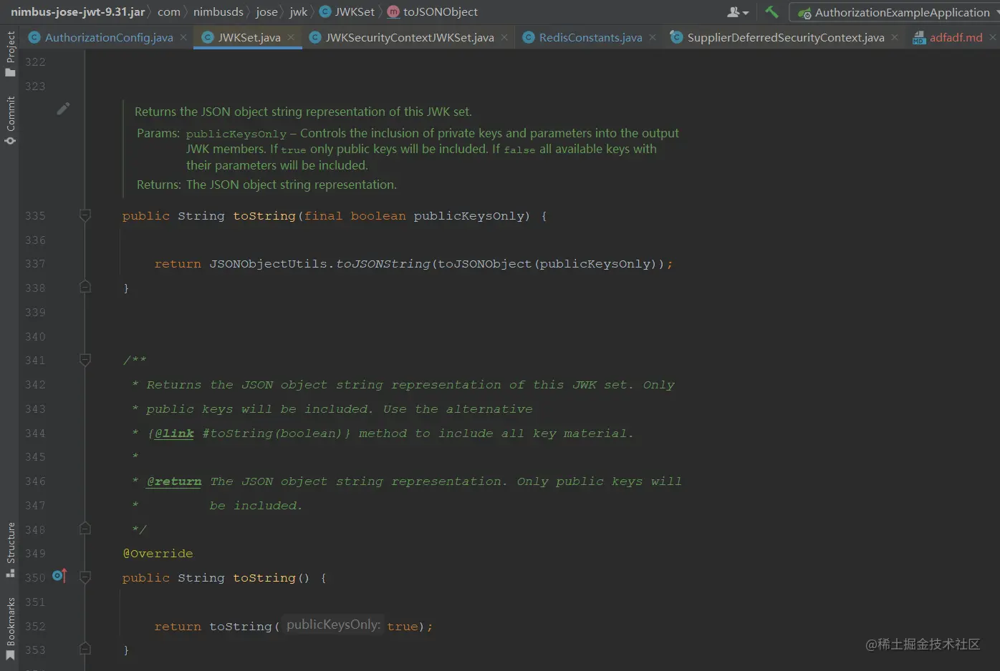
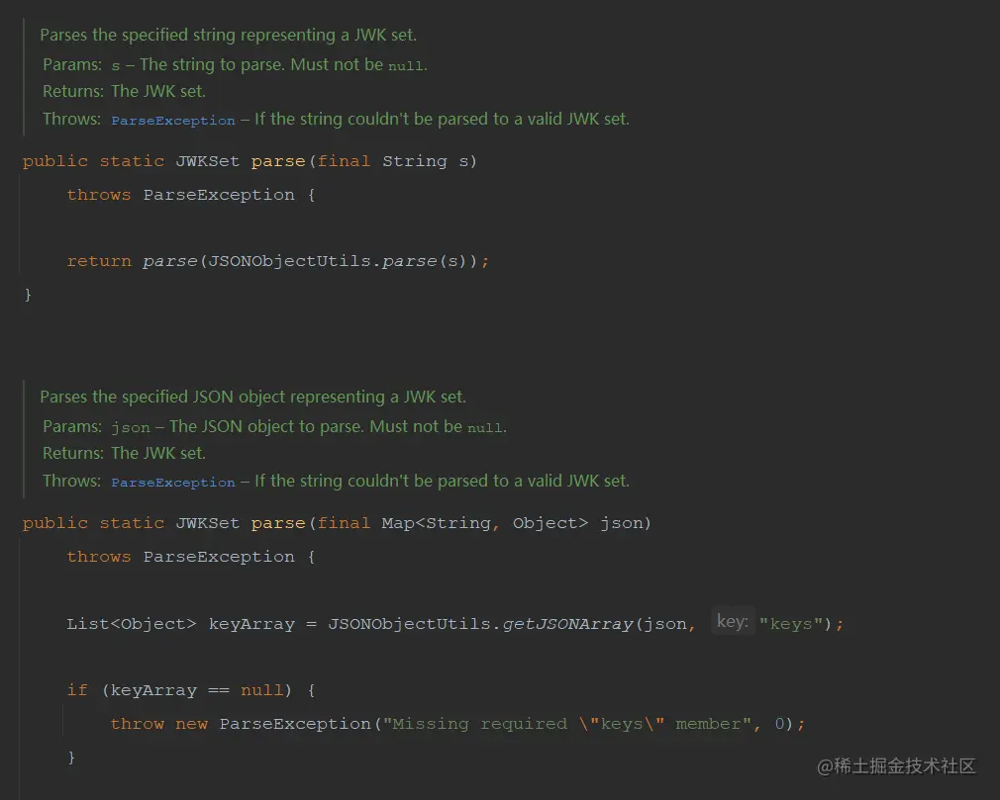

- [Spring Authorization Server优化篇：持久化JWKSource，解决重启后无法解析AccessToken问题](https://juejin.cn/post/7254836247290216503)

## 一、问题描述
自从第二章将认证服务搭建起来以后就很少更改基础配置了，直到今天有位读者提了一个问题，对我发出了灵魂拷问：**重启后jwks的配置发生了变化，无法正确解析token，那Auth服务重启后有办法规避这种情况吗？**假如生产环境这样，服务重新部署后之前所有登录的用户必须重新登陆。原问题见下方附图


## 二、解决方案分析
当时本人想到的是将生成的`JWKSource`保存至redis，每次重启从redis中获取，这样不管重不重启生成的都是同一个，也就不会出现服务重启后无法解析在有效期内的`AccessToken`问题了，但是又怕不能序列化，就去查看代码了，最终功夫不负有心人，经过一番查找后发现最主要的配置是来自`JWKSet`的实例，在`JWKSet`找到了`toString`方法和对应的`parse`方法，`toString`方法是将`jwks`的信息转为json字符串，而parse就是读取并解析json字符串，将其转为`JWKSet`实例

### 1. `JWKSet`中的`toString`方法



方法内部将`jwks`转为一个json字符串返回

### 2. `JWKSet`中的`parse`方法



方法内部根据给定的字符串解析并返回一个`JWKSet`。

## 三、编码解决问题
根据上边的分析得出解决方案，在配置`JWKSource`之前先从redis中尝试获取一下，获取不到就生成并存入redis；获取到直接解析并生成一个`JWKSet`；修改`AuthorizationConfig`类中的`JWKSource`配置，如下所示
```java
/**
 * 配置jwk源，使用非对称加密，公开用于检索匹配指定选择器的JWK的方法
 *
 * @return JWKSource
 */
@Bean
@SneakyThrows
public JWKSource<SecurityContext> jwkSource() {
    // 先从redis获取
    String jwkSetCache = redisOperator.get(RedisConstants.AUTHORIZATION_JWS_PREFIX_KEY);
    if (ObjectUtils.isEmpty(jwkSetCache)) {
        KeyPair keyPair = generateRsaKey();
        RSAPublicKey publicKey = (RSAPublicKey) keyPair.getPublic();
        RSAPrivateKey privateKey = (RSAPrivateKey) keyPair.getPrivate();
        RSAKey rsaKey = new RSAKey.Builder(publicKey)
                .privateKey(privateKey)
                .keyID(UUID.randomUUID().toString())
                .build();
        // 生成jws
        JWKSet jwkSet = new JWKSet(rsaKey);
        // 转为json字符串
        String jwkSetString = jwkSet.toString(Boolean.FALSE);
        // 存入redis
        redisOperator.set(RedisConstants.AUTHORIZATION_JWS_PREFIX_KEY, jwkSetString);
        return new ImmutableJWKSet<>(jwkSet);
    }
    // 解析存储的jws
    JWKSet jwkSet = JWKSet.parse(jwkSetCache);
    return new ImmutableJWKSet<>(jwkSet);
}
```

附一下`RedisConstants`类中的`AUTHORIZATION_JWS_PREFIX_KEY`常量
```java
/**
 * jwk set缓存前缀
 */
public static final String AUTHORIZATION_JWS_PREFIX_KEY = "authorization_jws";
```

修改配置后启动认证服务，使用oauth2的几种方式获取一下token，然后重启服务携带token请求一下看看认证服务能否解析`AccessToken`，如果有什么问题可以在评论区中提出。

代码已提交至[Gitee](https://gitee.com/vains-Sofia/authorization-example)
