- [Spring Authorization Server入门 (十二) 实现授权码模式使用前后端分离的登录页面](https://juejin.cn/post/7254096495184134181)

> 2023-12-01修改：在[session-data-redis(Github)](https://gitee.com/vains-Sofia/authorization-example/tree/session-data-redis)分支中添加了基于`spring-session-data-redis`的实现，无需借助`nonceId`来保持认证状态，该分支已去除所有`nonceId`相关内容，需要注意的是`axios`在初始化时需要添加配置`withCredentials: true`，让请求携带`cookie`。当然一些响应json的处理还是使用下方的内容。

今天的主题就是使用单独部署的登录页面替换认证服务器默认的登录页面(前后端分离时使用前端的登录页面)，目前在网上能搜到的很多都是理论，没有很好的一个示例，我就按照我自己的想法写了一个实现，给大家提供一个思路，如果有什么问题或者更好的想法可以在评论区提出，谢谢。

## 一、实现思路分析
### 1. 先看一下在默认情况下请求在框架中的跳转情况
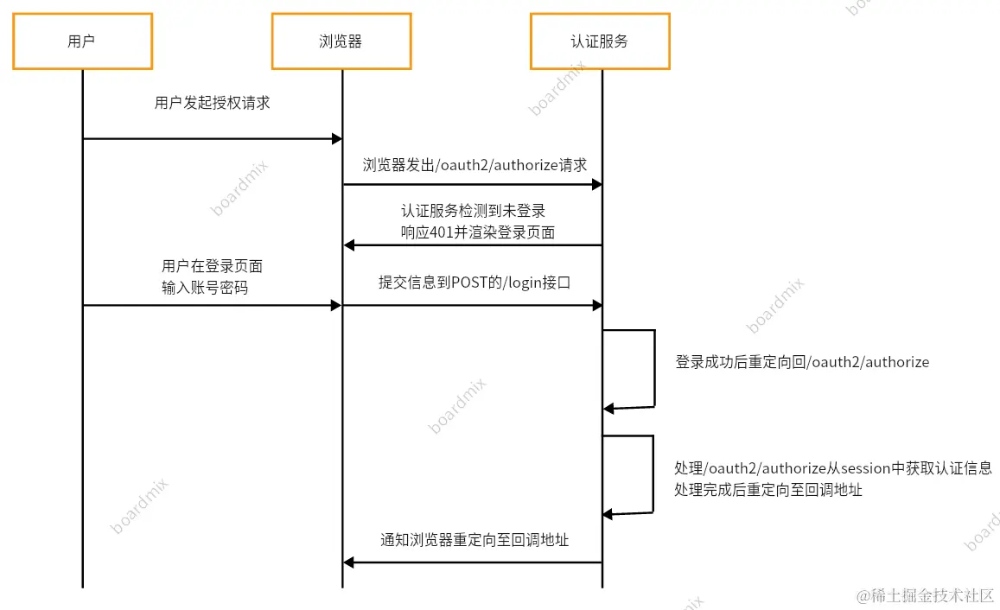

    Spring Authorization Server(Spring Security)框架默认使用session存储用户的认证信息，这样在登录以后重定向回请求授权接口时(`/oauth2/authorize`)处理该请求的过滤器可以从`session`中获取到认证信息，从而走后边的流程，但是当这一套放在单独部署的登录页面中就不行了，在请求授权时哪怕登录过也无法获取到认证信息，因为他们不再是同一个`session`中了；所以关键点就在于怎么存储、获取认证信息。

### 2. 先查看下框架怎么获取认证信息
    在处理`/oauth2/authorize`接口的过滤器`OAuth2AuthorizationEndpointFilter`中看一下实现逻辑，看一下对于认证信息的处理，如下图

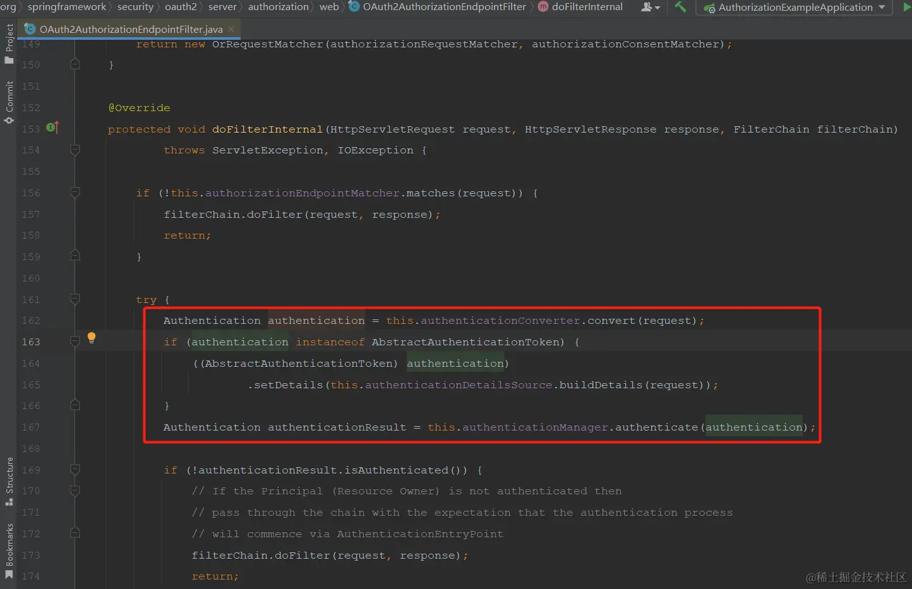

先由`converter`处理，之后再由`provider`处理，之后判断认证信息是否已经认证过了，没认证过不处理，交给后边的过滤器处理，接下来看一下`converter`中的逻辑，如下图所示

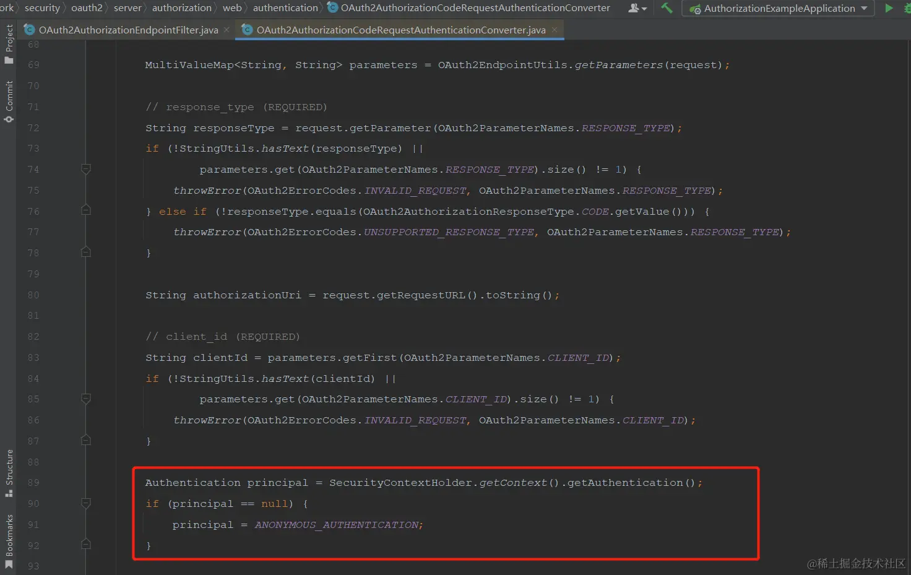

    如图所示，这里直接从`SecurityContextHolder`中获取的认证信息，那么接下来就需要找一下它是怎么获取认证信息并放入`SecurityContextHolder`中的。
在`OAuth2AuthorizationEndpointFilter`中打一个断点，请求一下`/oauth2/authorize`接口，

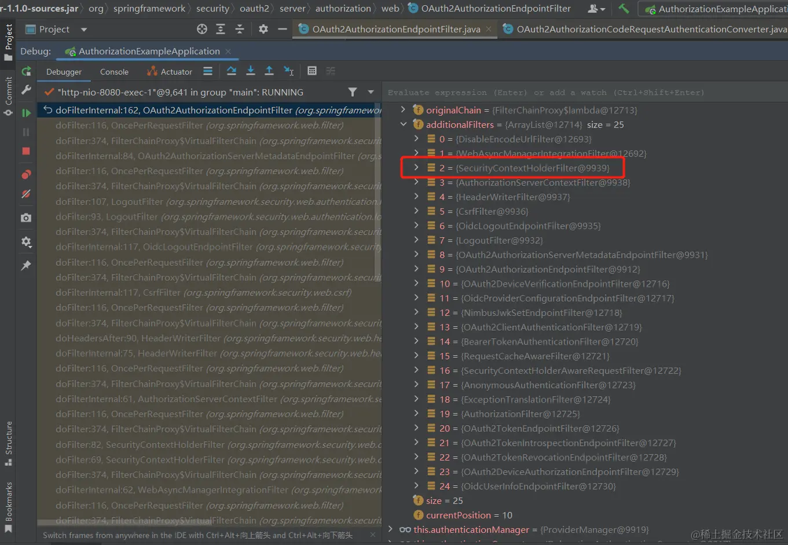

断点断住以后查看一下过滤器链，发现在`OAuth2AuthorizationEndpointFilter`之前有一个`SecurityContextHolderFilter`过滤器，名字表达的特征很明显，接下来看一下这个过滤器中的逻辑。

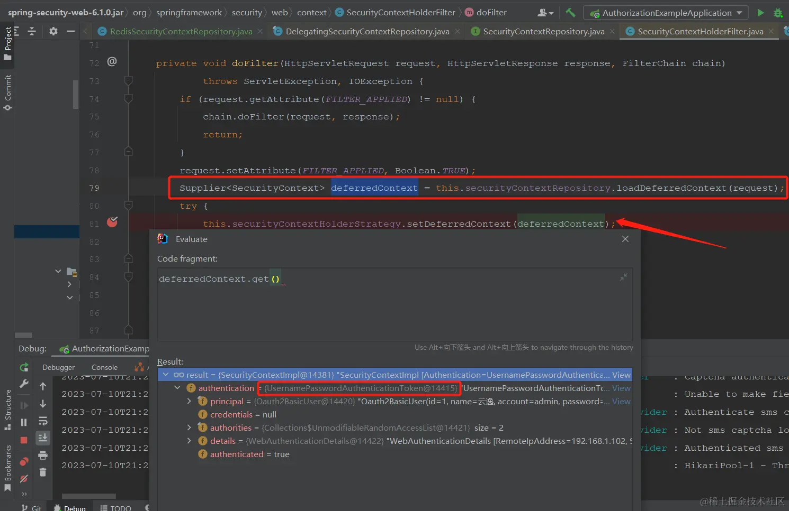

从断点截图中可以看出是从`securityContextRepository`中获取的认证信息，然后通过`securityContextHolderStrategy`保存，看一下是不是在这里设置的认证信息。

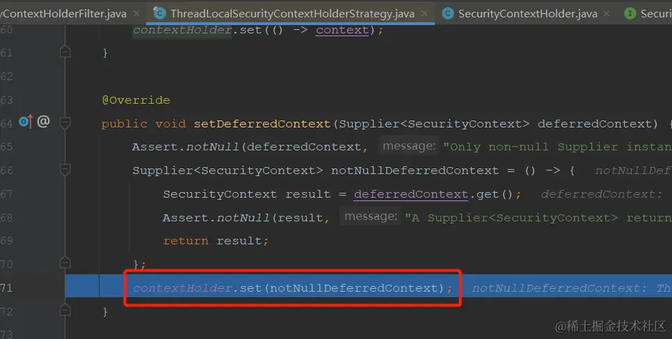

断点进入方法后发现将认证信息的`context`设置到了`contextHolder`中，那这里和`SecurityContextHolder`是同一个东西吗？请接着往下看

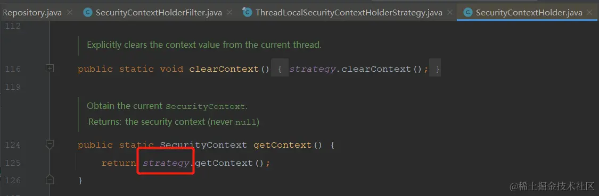

`SecurityContextHolder`的`getContext`方法是从当前类中的属性获取，接下来看一下`securityContextHolderStrategy`的定义

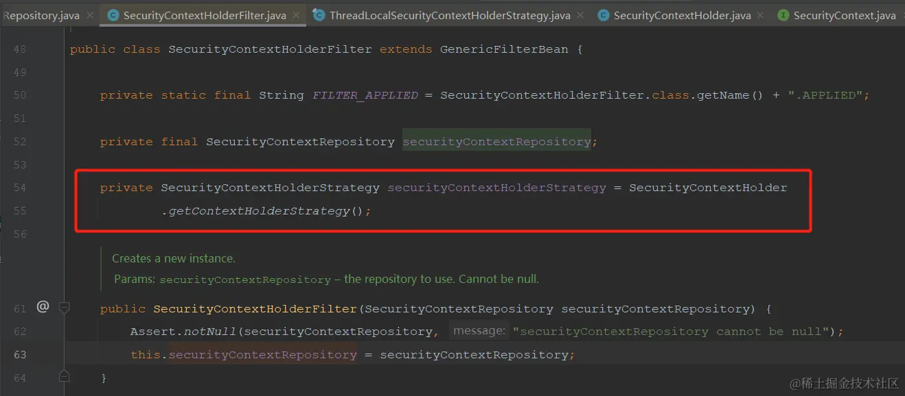

它是通过调用`SecurityContextHolder`的`getContextHolderStrategy`方法完成实例化的，看下这个方法

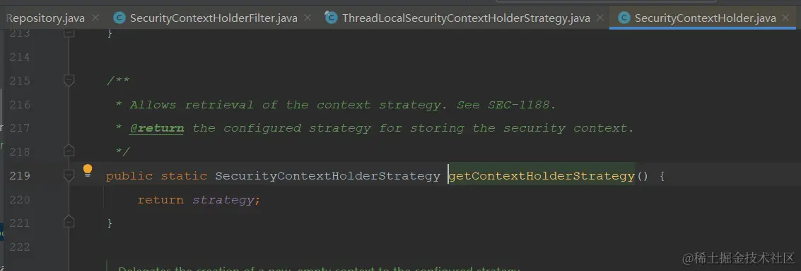

    追踪到这里应该就差不多了，框架从`securityContextRepository`中获取认证信息，然后通过`securityContextHolderStrategy`放入`SecurityContextHolder`中，让后边的过滤器可以直接从`SecurityContextHolder`中获取认证信息。

获取认证信息的地方结束了，接下来看一下存储认证信息的地方，分析完获取的地方，存储的地方就很简单了。

### 3. 存储认证信息
    看过之前文章或者其它关于登录分析的文章应该知道，框架对于登录的处理是基于`UsernamePasswordAuthenticationFilter`和父类`AbstractAuthenticationProcessingFilter`，在父类中调用子类的校验，重点是认证成功后的处理，如下图

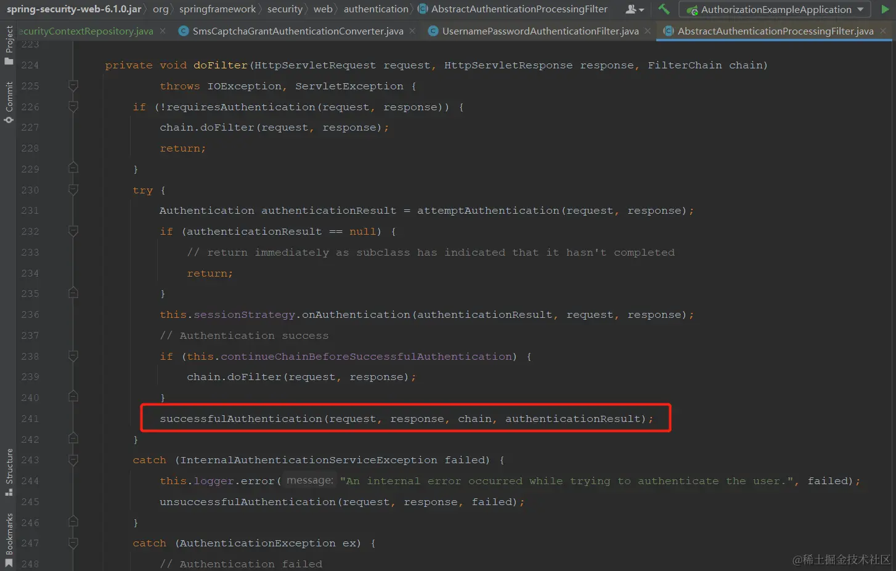

认证成功后调用了`successfulAuthentication`方法，看一下该方法的实现

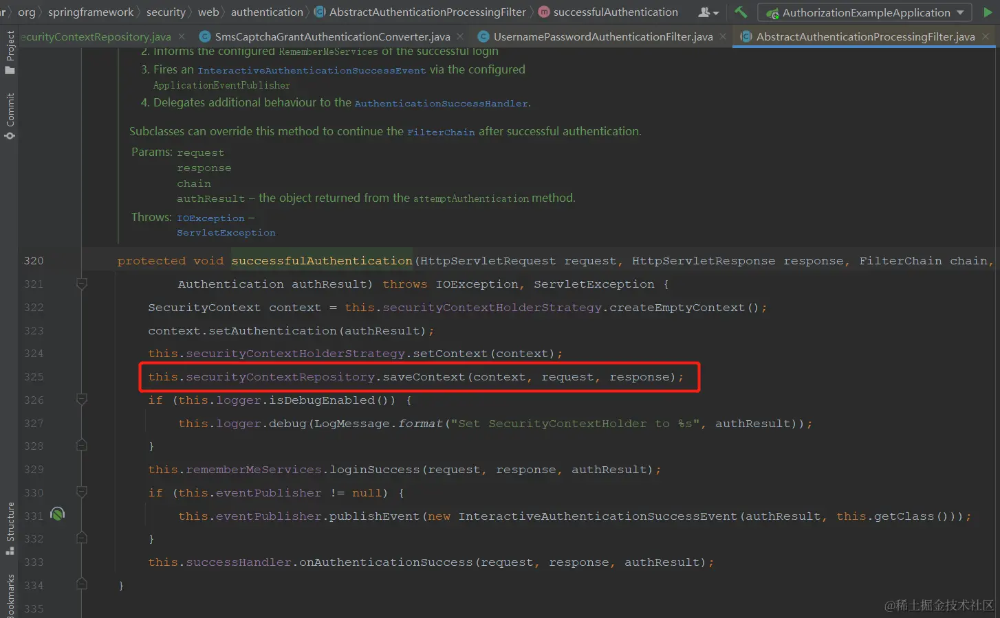

    其它的不是本篇文章的重点，主要是红框中的代码，这里将登陆后的认证信息存储在`securityContextRepository`中。

    到这里逻辑就通了，登录后将认证信息存储在`securityContextRepository`中，访问时从`securityContextRepository`中取出认证信息并放在`SecurityContextHolder`中，这样就保持了登陆状态。

## 二、改造分析
    使用前后端分离的登录页面，那么登录接口就需要响应json了，不能再使用默认的成功/失败处理了，所以要重写登录成功和失败的处理器；重定向也不能由认证服务来重定向了，应该由前端重定向；存储认证信息的容器也不能以`session`为主了，使用redis来替换`session`。 

     ~~使用redis后没有`session`了，也就不能确定请求是哪一个，本人拙见是在登录时携带一个唯一字符串，请求成功后前端重定向至需要认证的请求时携带该唯一字符串，这样请求时可以根据这个唯一字符串获取到认证信息。~~ 

> 2023-07-11修改：只要用户在浏览器中访问认证服务就会生成一个`session`，所以当请求授权时或者访问其它需要登录的接口时，通过未登录处理重定向至登录页面时获取当前请求的`sessionId`，放入重定向地址的参数中；浏览器中在登录页面输入账号密码提交时携带地址栏中的`sessionId`；存取认证信息时获取`sessionId`的顺序为：请求头 --->>> 请求参数 --->>> 当前`session`；这样一来就可以通过`session`将认证服务和单独部署的登录页面中的请求串联起来了，详细实现请看下方代码

主要就是重定向时将当前请求放入`target`参数中，当前`sessionId`放入`nonceId`参数中 

> 2023-07-21修改内容：oauth协议中有`nonce`参数，为防止冲突，`nonce`参数改为`nonceId`

思路清晰以后编码就很快了

- 重写登录成功处理(响应json)。
- 重写登录失败处理(响应json)。
- 重写未登录处理，重定向到登录页面时携带当前请求url。
- 重写认证信息存取逻辑，使用redis存储认证信息。
- 将以上内容添加到Spring Authorization Server配置中，使其在过滤器链中生效
- 前端代码编写，按照要求传递唯一字符串并在登录成功后重定向至参数中携带的地址

## 三、代码实现
### 1. 创建`LoginSuccessHandler`类并实现`AuthenticationSuccessHandler`接口
```java
package com.example.authorization.handler;  
  
import com.example.model.Result;  
import com.example.util.JsonUtils;  
import jakarta.servlet.http.HttpServletRequest;  
import jakarta.servlet.http.HttpServletResponse;  
import org.springframework.http.MediaType;  
import org.springframework.security.core.Authentication;  
import org.springframework.security.web.authentication.AuthenticationSuccessHandler;  
  
import java.io.IOException;  
import java.nio.charset.StandardCharsets;  
  
/**  
* 登录成功处理类  
*  
* @author vains  
*/  
public class LoginSuccessHandler implements AuthenticationSuccessHandler {  
  
    @Override  
    public void onAuthenticationSuccess(HttpServletRequest request, HttpServletResponse response, Authentication authentication) throws IOException {  
        Result<String> success = Result.success();  
        response.setCharacterEncoding(StandardCharsets.UTF_8.name());  
        response.setContentType(MediaType.APPLICATION_JSON_VALUE);  
        response.getWriter().write(JsonUtils.objectCovertToJson(success));  
        response.getWriter().flush();  
    }  
  
}
```

### 2. 创建`LoginFailureHandler`类并实现`AuthenticationFailureHandler`接口
```java
package com.example.authorization.handler;  
  
import com.example.model.Result;  
import com.example.util.JsonUtils;  
import jakarta.servlet.http.HttpServletRequest;  
import jakarta.servlet.http.HttpServletResponse;  
import org.springframework.http.HttpStatus;  
import org.springframework.http.MediaType;  
import org.springframework.security.core.AuthenticationException;  
import org.springframework.security.web.authentication.AuthenticationFailureHandler;  
  
import java.io.IOException;  
import java.nio.charset.StandardCharsets;  
  
/**  
* 登录失败处理类  
*  
* @author vains  
*/  
public class LoginFailureHandler implements AuthenticationFailureHandler {  
  
    @Override  
    public void onAuthenticationFailure(HttpServletRequest request, HttpServletResponse response, AuthenticationException exception) throws IOException {  
        // 登录失败，写回401与具体的异常  
        Result<String> success = Result.error(HttpStatus.UNAUTHORIZED.value(), exception.getMessage());  
        response.setCharacterEncoding(StandardCharsets.UTF_8.name());  
        response.setContentType(MediaType.APPLICATION_JSON_VALUE);  
        response.getWriter().write(JsonUtils.objectCovertToJson(success));  
        response.getWriter().flush();  
    }  
  
}
```

### 3. 创建`LoginTargetAuthenticationEntryPoint`类并继承`LoginUrlAuthenticationEntryPoint`类

> 2023-07-11添加逻辑：重定向地址添加`nonce`参数，该参数的值为`sessionId`，详情请查看代码
```java
package com.example.authorization.handler;

import com.example.constant.SecurityConstants;
import jakarta.servlet.ServletException;
import jakarta.servlet.http.HttpServletRequest;
import jakarta.servlet.http.HttpServletResponse;
import lombok.extern.slf4j.Slf4j;
import org.springframework.security.core.AuthenticationException;
import org.springframework.security.web.DefaultRedirectStrategy;
import org.springframework.security.web.RedirectStrategy;
import org.springframework.security.web.authentication.LoginUrlAuthenticationEntryPoint;
import org.springframework.security.web.util.UrlUtils;
import org.springframework.util.ObjectUtils;

import java.io.IOException;
import java.net.URLEncoder;
import java.nio.charset.StandardCharsets;

/**
 * 重定向至登录处理
 *
 * @author vains
 */
@Slf4j
public class LoginTargetAuthenticationEntryPoint extends LoginUrlAuthenticationEntryPoint {

    private final RedirectStrategy redirectStrategy = new DefaultRedirectStrategy();

    /**
     * @param loginFormUrl URL where the login page can be found. Should either be
     *                     relative to the web-app context path (include a leading {@code /}) or an absolute
     *                     URL.
     */
    public LoginTargetAuthenticationEntryPoint(String loginFormUrl) {
        super(loginFormUrl);
    }

    @Override
    public void commence(HttpServletRequest request, HttpServletResponse response, AuthenticationException authException) throws IOException, ServletException {

        // 获取登录表单的地址
        String loginForm = determineUrlToUseForThisRequest(request, response, authException);
        if (!UrlUtils.isAbsoluteUrl(loginForm)) {
            // 不是绝对路径调用父类方法处理
            super.commence(request, response, authException);
            return;
        }

        StringBuffer requestUrl = request.getRequestURL();
        if (!ObjectUtils.isEmpty(request.getQueryString())) {
            requestUrl.append("?").append(request.getQueryString());
        }

        // 2023-07-11添加逻辑：重定向地址添加nonce参数，该参数的值为sessionId
        // 绝对路径在重定向前添加target参数
        String targetParameter = URLEncoder.encode(requestUrl.toString(), StandardCharsets.UTF_8);
        String targetUrl = loginForm + "?target=" + targetParameter + "&" + SecurityConstants.NONCE_HEADER_NAME + "=" + request.getSession(Boolean.FALSE).getId();
        log.debug("重定向至前后端分离的登录页面：{}", targetUrl);
        this.redirectStrategy.sendRedirect(request, response, targetUrl);

    }
}
```

#### 1. 在`SecurityConstants`中添加`NONCE_HEADER_NAME`
2023-07-21修改内容：oauth协议中有`nonce`参数，为防止冲突，`nonce`参数改为`nonceId`
```java
/**
 * 随机字符串请求头名字
 */
public static final String NONCE_HEADER_NAME = "nonceId";
```

### 4. 在support包下创建`RedisSecurityContextRepository`并实现`SecurityContextRepository`
> 2023-07-11新增逻辑：如果请求头与请求参数中获取不到随机字符串nonce则获取当前session的sessionId，详情请查看代码
```java
package com.example.support;

import com.example.model.security.SupplierDeferredSecurityContext;
import jakarta.servlet.http.HttpServletRequest;
import jakarta.servlet.http.HttpServletResponse;
import jakarta.servlet.http.HttpSession;
import lombok.RequiredArgsConstructor;
import org.springframework.security.core.context.DeferredSecurityContext;
import org.springframework.security.core.context.SecurityContext;
import org.springframework.security.core.context.SecurityContextHolder;
import org.springframework.security.core.context.SecurityContextHolderStrategy;
import org.springframework.security.web.context.HttpRequestResponseHolder;
import org.springframework.security.web.context.SecurityContextRepository;
import org.springframework.stereotype.Component;
import org.springframework.util.ObjectUtils;

import java.util.function.Supplier;

import static com.example.constant.RedisConstants.DEFAULT_TIMEOUT_SECONDS;
import static com.example.constant.RedisConstants.SECURITY_CONTEXT_PREFIX_KEY;
import static com.example.constant.SecurityConstants.NONCE_HEADER_NAME;

/**
 * 基于redis存储认证信息
 *
 * @author vains
 */
@Component
@RequiredArgsConstructor
public class RedisSecurityContextRepository implements SecurityContextRepository {

    private final RedisOperator<SecurityContext> redisOperator;

    private final SecurityContextHolderStrategy securityContextHolderStrategy = SecurityContextHolder
            .getContextHolderStrategy();


    @Override
    public SecurityContext loadContext(HttpRequestResponseHolder requestResponseHolder) {
//        HttpServletRequest request = requestResponseHolder.getRequest();
//        return readSecurityContextFromRedis(request);
        // 方法已过时，使用 loadDeferredContext 方法
        throw new UnsupportedOperationException("Method deprecated.");
    }

    @Override
    public void saveContext(SecurityContext context, HttpServletRequest request, HttpServletResponse response) {
        String nonce = getNonce(request);
        if (ObjectUtils.isEmpty(nonce)) {
            return;
        }

        // 如果当前的context是空的，则移除
        SecurityContext emptyContext = this.securityContextHolderStrategy.createEmptyContext();
        if (emptyContext.equals(context)) {
            redisOperator.delete((SECURITY_CONTEXT_PREFIX_KEY + nonce));
        } else {
            // 保存认证信息
            redisOperator.set((SECURITY_CONTEXT_PREFIX_KEY + nonce), context, DEFAULT_TIMEOUT_SECONDS);
        }
    }

    @Override
    public boolean containsContext(HttpServletRequest request) {
        String nonce = getNonce(request);
        if (ObjectUtils.isEmpty(nonce)) {
            return false;
        }
        // 检验当前请求是否有认证信息
        return redisOperator.get((SECURITY_CONTEXT_PREFIX_KEY + nonce)) != null;
    }

    @Override
    public DeferredSecurityContext loadDeferredContext(HttpServletRequest request) {
        Supplier<SecurityContext> supplier = () -> readSecurityContextFromRedis(request);
        return new SupplierDeferredSecurityContext(supplier, this.securityContextHolderStrategy);
    }

    /**
     * 从redis中获取认证信息
     *
     * @param request 当前请求
     * @return 认证信息
     */
    private SecurityContext readSecurityContextFromRedis(HttpServletRequest request) {
        if (request == null) {
            return null;
        }

        String nonce = getNonce(request);
        if (ObjectUtils.isEmpty(nonce)) {
            return null;
        }

        // 根据缓存id获取认证信息
        return redisOperator.get((SECURITY_CONTEXT_PREFIX_KEY + nonce));
    }

    /**
     * 先从请求头中找，找不到去请求参数中找，找不到获取当前session的id
     *  2023-07-11新增逻辑：获取当前session的sessionId
     *
     * @param request 当前请求
     * @return 随机字符串(sessionId)，这个字符串本来是前端生成，现在改为后端获取的sessionId
     */
    private String getNonce(HttpServletRequest request) {
        String nonce = request.getHeader(NONCE_HEADER_NAME);
        if (ObjectUtils.isEmpty(nonce)) {
            nonce = request.getParameter(NONCE_HEADER_NAME);
            HttpSession session = request.getSession(Boolean.FALSE);
            if (ObjectUtils.isEmpty(nonce) && session != null) {
                nonce = session.getId();
            }
        }
        return nonce;
    }

}
```

#### 1. 补充`SupplierDeferredSecurityContext`类
该类默认包外无法访问，将框架中的复制一份暴露出来
```java
package com.example.model.security;

import java.util.function.Supplier;

import org.apache.commons.logging.Log;
import org.apache.commons.logging.LogFactory;

import org.springframework.core.log.LogMessage;
import org.springframework.security.core.context.DeferredSecurityContext;
import org.springframework.security.core.context.SecurityContext;
import org.springframework.security.core.context.SecurityContextHolderStrategy;

/**
 * @author Steve Riesenberg
 * @since 5.8
 */
public final class SupplierDeferredSecurityContext implements DeferredSecurityContext {

    private static final Log logger = LogFactory.getLog(SupplierDeferredSecurityContext.class);

    private final Supplier<SecurityContext> supplier;

    private final SecurityContextHolderStrategy strategy;

    private SecurityContext securityContext;

    private boolean missingContext;

    public SupplierDeferredSecurityContext(Supplier<SecurityContext> supplier, SecurityContextHolderStrategy strategy) {
        this.supplier = supplier;
        this.strategy = strategy;
    }

    @Override
    public SecurityContext get() {
        init();
        return this.securityContext;
    }

    @Override
    public boolean isGenerated() {
        init();
        return this.missingContext;
    }

    private void init() {
        if (this.securityContext != null) {
            return;
        }

        this.securityContext = this.supplier.get();
        this.missingContext = (this.securityContext == null);
        if (this.missingContext) {
            this.securityContext = this.strategy.createEmptyContext();
            if (logger.isTraceEnabled()) {
                logger.trace(LogMessage.format("Created %s", this.securityContext));
            }
        }
    }

}
```

### 5. 将以上自己创建的类添加至security配置中
#### 1. 配置认证服务配置
```java
// 主要是以下两处配置
// 使用redis存储、读取登录的认证信息 
http.securityContext(context -> context.securityContextRepository(redisSecurityContextRepository));
// 这里使用自定义的未登录处理，并设置登录地址为前端的登录地址
http
        // 当未登录时访问认证端点时重定向至login页面
        .exceptionHandling((exceptions) -> exceptions
                .defaultAuthenticationEntryPointFor(
                // 这里使用自定义的未登录处理，并设置登录地址为前端的登录地址
                        new LoginTargetAuthenticationEntryPoint("http://127.0.0.1:5173"),
                        new MediaTypeRequestMatcher(MediaType.TEXT_HTML)
                )
        )
```

```java
/**
 * 配置端点的过滤器链
 *
 * @param http spring security核心配置类
 * @return 过滤器链
 * @throws Exception 抛出
 */
@Bean
public SecurityFilterChain authorizationServerSecurityFilterChain(HttpSecurity http,
                                                                  RegisteredClientRepository registeredClientRepository,
                                                                  AuthorizationServerSettings authorizationServerSettings) throws Exception {
    // 配置默认的设置，忽略认证端点的csrf校验
    OAuth2AuthorizationServerConfiguration.applyDefaultSecurity(http);

    // 新建设备码converter和provider
    DeviceClientAuthenticationConverter deviceClientAuthenticationConverter =
            new DeviceClientAuthenticationConverter(
                    authorizationServerSettings.getDeviceAuthorizationEndpoint());
    DeviceClientAuthenticationProvider deviceClientAuthenticationProvider =
            new DeviceClientAuthenticationProvider(registeredClientRepository);

    // 使用redis存储、读取登录的认证信息
    http.securityContext(context -> context.securityContextRepository(redisSecurityContextRepository));

    http.getConfigurer(OAuth2AuthorizationServerConfigurer.class)
            // 开启OpenID Connect 1.0协议相关端点
            .oidc(Customizer.withDefaults())
            // 设置自定义用户确认授权页
            .authorizationEndpoint(authorizationEndpoint -> authorizationEndpoint.consentPage(CUSTOM_CONSENT_PAGE_URI))
            // 设置设备码用户验证url(自定义用户验证页)
            .deviceAuthorizationEndpoint(deviceAuthorizationEndpoint ->
                    deviceAuthorizationEndpoint.verificationUri("/activate")
            )
            // 设置验证设备码用户确认页面
            .deviceVerificationEndpoint(deviceVerificationEndpoint ->
                    deviceVerificationEndpoint.consentPage(CUSTOM_CONSENT_PAGE_URI)
            )
            .clientAuthentication(clientAuthentication ->
                    // 客户端认证添加设备码的converter和provider
                    clientAuthentication
                            .authenticationConverter(deviceClientAuthenticationConverter)
                            .authenticationProvider(deviceClientAuthenticationProvider)
            );
    http
            // 当未登录时访问认证端点时重定向至login页面
            .exceptionHandling((exceptions) -> exceptions
                    .defaultAuthenticationEntryPointFor(
                            new LoginTargetAuthenticationEntryPoint("http://127.0.0.1:5173"),
                            new MediaTypeRequestMatcher(MediaType.TEXT_HTML)
                    )
            )
            // 处理使用access token访问用户信息端点和客户端注册端点
            .oauth2ResourceServer((resourceServer) -> resourceServer
                    .jwt(Customizer.withDefaults()));

    // 自定义短信认证登录转换器
    SmsCaptchaGrantAuthenticationConverter converter = new SmsCaptchaGrantAuthenticationConverter();
    // 自定义短信认证登录认证提供
    SmsCaptchaGrantAuthenticationProvider provider = new SmsCaptchaGrantAuthenticationProvider();
    http.getConfigurer(OAuth2AuthorizationServerConfigurer.class)
            // 让认证服务器元数据中有自定义的认证方式
            .authorizationServerMetadataEndpoint(metadata -> metadata.authorizationServerMetadataCustomizer(customizer -> customizer.grantType(SecurityConstants.GRANT_TYPE_SMS_CODE)))
            // 添加自定义grant_type——短信认证登录
            .tokenEndpoint(tokenEndpoint -> tokenEndpoint
                    .accessTokenRequestConverter(converter)
                    .authenticationProvider(provider));

    DefaultSecurityFilterChain build = http.build();

    // 从框架中获取provider中所需的bean
    OAuth2TokenGenerator<?> tokenGenerator = http.getSharedObject(OAuth2TokenGenerator.class);
    AuthenticationManager authenticationManager = http.getSharedObject(AuthenticationManager.class);
    OAuth2AuthorizationService authorizationService = http.getSharedObject(OAuth2AuthorizationService.class);
    // 以上三个bean在build()方法之后调用是因为调用build方法时框架会尝试获取这些类，
    // 如果获取不到则初始化一个实例放入SharedObject中，所以要在build方法调用之后获取
    // 在通过set方法设置进provider中，但是如果在build方法之后调用authenticationProvider(provider)
    // 框架会提示unsupported_grant_type，因为已经初始化完了，在添加就不会生效了
    provider.setTokenGenerator(tokenGenerator);
    provider.setAuthorizationService(authorizationService);
    provider.setAuthenticationManager(authenticationManager);

    return build;
}
```

#### 2. 配置认证相关的过滤器链(资源服务器配置)
配置地方跟上边差不多，自定义登录成功/失败处理，使用redis替换session的存储，因为前后端分离了，还要配置解决跨域问题的过滤器，并禁用cors与csrf。

- 跨域过滤器一定要添加至security配置中，不然只注入ioc中对于security端点不生效！
- 跨域过滤器一定要添加至security配置中，不然只注入ioc中对于security端点不生效！
- 跨域过滤器一定要添加至security配置中，不然只注入ioc中对于security端点不生效！

```java
/**
 * 配置认证相关的过滤器链
 *
 * @param http spring security核心配置类
 * @return 过滤器链
 * @throws Exception 抛出
 */
@Bean
public SecurityFilterChain defaultSecurityFilterChain(HttpSecurity http) throws Exception {
    // 添加跨域过滤器
    http.addFilter(corsFilter());
    // 禁用 csrf 与 cors
    http.csrf(AbstractHttpConfigurer::disable);
    http.cors(AbstractHttpConfigurer::disable);
    http.authorizeHttpRequests((authorize) -> authorize
                    // 放行静态资源
                    .requestMatchers("/assets/**", "/webjars/**", "/login", "/getCaptcha", "/getSmsCaptcha").permitAll()
                    .anyRequest().authenticated()
            )
            // 指定登录页面
            .formLogin(formLogin ->
                    formLogin.loginPage("/login")
                            // 登录成功和失败改为写回json，不重定向了
                            .successHandler(new LoginSuccessHandler())
                            .failureHandler(new LoginFailureHandler())
            );
    // 添加BearerTokenAuthenticationFilter，将认证服务当做一个资源服务，解析请求头中的token
    http.oauth2ResourceServer((resourceServer) -> resourceServer
            .jwt(Customizer.withDefaults())
            .accessDeniedHandler(SecurityUtils::exceptionHandler)
            .authenticationEntryPoint(SecurityUtils::exceptionHandler)
    );
    http
            // 当未登录时访问认证端点时重定向至login页面
            .exceptionHandling((exceptions) -> exceptions
                    .defaultAuthenticationEntryPointFor(
                            new LoginTargetAuthenticationEntryPoint("http://127.0.0.1:5173"),
                            new MediaTypeRequestMatcher(MediaType.TEXT_HTML)
                    )
            );

    // 使用redis存储、读取登录的认证信息
    http.securityContext(context -> context.securityContextRepository(redisSecurityContextRepository));

    return http.build();
}
```

#### 3. 在AuthorizationConfig中添加跨域过滤器
```java
/**
 * 跨域过滤器配置
 *
 * @return CorsFilter
 */
@Bean
public CorsFilter corsFilter() {

    // 初始化cors配置对象
    CorsConfiguration configuration = new CorsConfiguration();

    // 设置允许跨域的域名,如果允许携带cookie的话,路径就不能写*号, *表示所有的域名都可以跨域访问
    configuration.addAllowedOrigin("http://127.0.0.1:5173");
    // 设置跨域访问可以携带cookie
    configuration.setAllowCredentials(true);
    // 允许所有的请求方法 ==> GET POST PUT Delete
    configuration.addAllowedMethod("*");
    // 允许携带任何头信息
    configuration.addAllowedHeader("*");

    // 初始化cors配置源对象
    UrlBasedCorsConfigurationSource configurationSource = new UrlBasedCorsConfigurationSource();

    // 给配置源对象设置过滤的参数
    // 参数一: 过滤的路径 == > 所有的路径都要求校验是否跨域
    // 参数二: 配置类
    configurationSource.registerCorsConfiguration("/**", configuration);

    // 返回配置好的过滤器
    return new CorsFilter(configurationSource);
}
```

#### 4. RedisConstants中添加常量
```java
/**  
 * 认证信息存储前缀  
 */  
public static final String SECURITY_CONTEXT_PREFIX_KEY = "security_context:";
```

#### 5. 如果没有RedisOperator可以看下我之前的[优化篇](https://juejin.cn/post/7253331974050299963)

#### 6. 完整的AuthorizationConfig如下
```java
package com.example.config;

import com.example.authorization.device.DeviceClientAuthenticationConverter;
import com.example.authorization.device.DeviceClientAuthenticationProvider;
import com.example.authorization.handler.LoginFailureHandler;
import com.example.authorization.handler.LoginSuccessHandler;
import com.example.authorization.handler.LoginTargetAuthenticationEntryPoint;
import com.example.authorization.sms.SmsCaptchaGrantAuthenticationConverter;
import com.example.authorization.sms.SmsCaptchaGrantAuthenticationProvider;
import com.example.constant.SecurityConstants;
import com.example.support.RedisSecurityContextRepository;
import com.example.util.SecurityUtils;
import com.nimbusds.jose.jwk.JWKSet;
import com.nimbusds.jose.jwk.RSAKey;
import com.nimbusds.jose.jwk.source.ImmutableJWKSet;
import com.nimbusds.jose.jwk.source.JWKSource;
import com.nimbusds.jose.proc.SecurityContext;
import lombok.RequiredArgsConstructor;
import lombok.SneakyThrows;
import org.springframework.context.annotation.Bean;
import org.springframework.context.annotation.Configuration;
import org.springframework.http.MediaType;
import org.springframework.jdbc.core.JdbcTemplate;
import org.springframework.security.access.annotation.Secured;
import org.springframework.security.authentication.AuthenticationManager;
import org.springframework.security.config.Customizer;
import org.springframework.security.config.annotation.authentication.configuration.AuthenticationConfiguration;
import org.springframework.security.config.annotation.method.configuration.EnableMethodSecurity;
import org.springframework.security.config.annotation.web.builders.HttpSecurity;
import org.springframework.security.config.annotation.web.configuration.EnableWebSecurity;
import org.springframework.security.config.annotation.web.configurers.AbstractHttpConfigurer;
import org.springframework.security.core.GrantedAuthority;
import org.springframework.security.core.userdetails.UserDetails;
import org.springframework.security.crypto.bcrypt.BCryptPasswordEncoder;
import org.springframework.security.crypto.password.PasswordEncoder;
import org.springframework.security.oauth2.core.AuthorizationGrantType;
import org.springframework.security.oauth2.core.ClientAuthenticationMethod;
import org.springframework.security.oauth2.core.oidc.OidcScopes;
import org.springframework.security.oauth2.jwt.JwtClaimsSet;
import org.springframework.security.oauth2.jwt.JwtDecoder;
import org.springframework.security.oauth2.server.authorization.JdbcOAuth2AuthorizationConsentService;
import org.springframework.security.oauth2.server.authorization.JdbcOAuth2AuthorizationService;
import org.springframework.security.oauth2.server.authorization.OAuth2AuthorizationConsentService;
import org.springframework.security.oauth2.server.authorization.OAuth2AuthorizationService;
import org.springframework.security.oauth2.server.authorization.client.JdbcRegisteredClientRepository;
import org.springframework.security.oauth2.server.authorization.client.RegisteredClient;
import org.springframework.security.oauth2.server.authorization.client.RegisteredClientRepository;
import org.springframework.security.oauth2.server.authorization.config.annotation.web.configuration.OAuth2AuthorizationServerConfiguration;
import org.springframework.security.oauth2.server.authorization.config.annotation.web.configurers.OAuth2AuthorizationServerConfigurer;
import org.springframework.security.oauth2.server.authorization.settings.AuthorizationServerSettings;
import org.springframework.security.oauth2.server.authorization.settings.ClientSettings;
import org.springframework.security.oauth2.server.authorization.token.JwtEncodingContext;
import org.springframework.security.oauth2.server.authorization.token.OAuth2TokenCustomizer;
import org.springframework.security.oauth2.server.authorization.token.OAuth2TokenGenerator;
import org.springframework.security.oauth2.server.resource.authentication.JwtAuthenticationConverter;
import org.springframework.security.oauth2.server.resource.authentication.JwtGrantedAuthoritiesConverter;
import org.springframework.security.web.DefaultSecurityFilterChain;
import org.springframework.security.web.SecurityFilterChain;
import org.springframework.security.web.util.matcher.MediaTypeRequestMatcher;
import org.springframework.web.cors.CorsConfiguration;
import org.springframework.web.cors.UrlBasedCorsConfigurationSource;
import org.springframework.web.filter.CorsFilter;

import java.security.KeyPair;
import java.security.KeyPairGenerator;
import java.security.interfaces.RSAPrivateKey;
import java.security.interfaces.RSAPublicKey;
import java.util.*;
import java.util.stream.Collectors;

/**
 * 认证配置
 * {@link EnableMethodSecurity} 开启全局方法认证，启用JSR250注解支持，启用注解 {@link Secured} 支持，
 * 在Spring Security 6.0版本中将@Configuration注解从@EnableWebSecurity, @EnableMethodSecurity, @EnableGlobalMethodSecurity
 * 和 @EnableGlobalAuthentication 中移除，使用这些注解需手动添加 @Configuration 注解
 * {@link EnableWebSecurity} 注解有两个作用:
 * 1. 加载了WebSecurityConfiguration配置类, 配置安全认证策略。
 * 2. 加载了AuthenticationConfiguration, 配置了认证信息。
 *
 * @author vains
 */
@Configuration
@EnableWebSecurity
@RequiredArgsConstructor
@EnableMethodSecurity(jsr250Enabled = true, securedEnabled = true)
public class AuthorizationConfig {

    private static final String CUSTOM_CONSENT_PAGE_URI = "/oauth2/consent";

    private final RedisSecurityContextRepository redisSecurityContextRepository;

    /**
     * 配置端点的过滤器链
     *
     * @param http spring security核心配置类
     * @return 过滤器链
     * @throws Exception 抛出
     */
    @Bean
    public SecurityFilterChain authorizationServerSecurityFilterChain(HttpSecurity http,
                                                                      RegisteredClientRepository registeredClientRepository,
                                                                      AuthorizationServerSettings authorizationServerSettings) throws Exception {
        // 配置默认的设置，忽略认证端点的csrf校验
        OAuth2AuthorizationServerConfiguration.applyDefaultSecurity(http);

        // 新建设备码converter和provider
        DeviceClientAuthenticationConverter deviceClientAuthenticationConverter =
                new DeviceClientAuthenticationConverter(
                        authorizationServerSettings.getDeviceAuthorizationEndpoint());
        DeviceClientAuthenticationProvider deviceClientAuthenticationProvider =
                new DeviceClientAuthenticationProvider(registeredClientRepository);

        // 使用redis存储、读取登录的认证信息
        http.securityContext(context -> context.securityContextRepository(redisSecurityContextRepository));

        http.getConfigurer(OAuth2AuthorizationServerConfigurer.class)
                // 开启OpenID Connect 1.0协议相关端点
                .oidc(Customizer.withDefaults())
                // 设置自定义用户确认授权页
                .authorizationEndpoint(authorizationEndpoint -> authorizationEndpoint.consentPage(CUSTOM_CONSENT_PAGE_URI))
                // 设置设备码用户验证url(自定义用户验证页)
                .deviceAuthorizationEndpoint(deviceAuthorizationEndpoint ->
                        deviceAuthorizationEndpoint.verificationUri("/activate")
                )
                // 设置验证设备码用户确认页面
                .deviceVerificationEndpoint(deviceVerificationEndpoint ->
                        deviceVerificationEndpoint.consentPage(CUSTOM_CONSENT_PAGE_URI)
                )
                .clientAuthentication(clientAuthentication ->
                        // 客户端认证添加设备码的converter和provider
                        clientAuthentication
                                .authenticationConverter(deviceClientAuthenticationConverter)
                                .authenticationProvider(deviceClientAuthenticationProvider)
                );
        http
                // 当未登录时访问认证端点时重定向至login页面
                .exceptionHandling((exceptions) -> exceptions
                        .defaultAuthenticationEntryPointFor(
                                new LoginTargetAuthenticationEntryPoint("http://127.0.0.1:5173"),
                                new MediaTypeRequestMatcher(MediaType.TEXT_HTML)
                        )
                )
                // 处理使用access token访问用户信息端点和客户端注册端点
                .oauth2ResourceServer((resourceServer) -> resourceServer
                        .jwt(Customizer.withDefaults()));

        // 自定义短信认证登录转换器
        SmsCaptchaGrantAuthenticationConverter converter = new SmsCaptchaGrantAuthenticationConverter();
        // 自定义短信认证登录认证提供
        SmsCaptchaGrantAuthenticationProvider provider = new SmsCaptchaGrantAuthenticationProvider();
        http.getConfigurer(OAuth2AuthorizationServerConfigurer.class)
                // 让认证服务器元数据中有自定义的认证方式
                .authorizationServerMetadataEndpoint(metadata -> metadata.authorizationServerMetadataCustomizer(customizer -> customizer.grantType(SecurityConstants.GRANT_TYPE_SMS_CODE)))
                // 添加自定义grant_type——短信认证登录
                .tokenEndpoint(tokenEndpoint -> tokenEndpoint
                        .accessTokenRequestConverter(converter)
                        .authenticationProvider(provider));

        DefaultSecurityFilterChain build = http.build();

        // 从框架中获取provider中所需的bean
        OAuth2TokenGenerator<?> tokenGenerator = http.getSharedObject(OAuth2TokenGenerator.class);
        AuthenticationManager authenticationManager = http.getSharedObject(AuthenticationManager.class);
        OAuth2AuthorizationService authorizationService = http.getSharedObject(OAuth2AuthorizationService.class);
        // 以上三个bean在build()方法之后调用是因为调用build方法时框架会尝试获取这些类，
        // 如果获取不到则初始化一个实例放入SharedObject中，所以要在build方法调用之后获取
        // 在通过set方法设置进provider中，但是如果在build方法之后调用authenticationProvider(provider)
        // 框架会提示unsupported_grant_type，因为已经初始化完了，在添加就不会生效了
        provider.setTokenGenerator(tokenGenerator);
        provider.setAuthorizationService(authorizationService);
        provider.setAuthenticationManager(authenticationManager);

        return build;
    }

    /**
     * 配置认证相关的过滤器链
     *
     * @param http spring security核心配置类
     * @return 过滤器链
     * @throws Exception 抛出
     */
    @Bean
    public SecurityFilterChain defaultSecurityFilterChain(HttpSecurity http) throws Exception {
        // 添加跨域过滤器
        http.addFilter(corsFilter());
        // 禁用 csrf 与 cors
        http.csrf(AbstractHttpConfigurer::disable);
        http.cors(AbstractHttpConfigurer::disable);
        http.authorizeHttpRequests((authorize) -> authorize
                        // 放行静态资源
                        .requestMatchers("/assets/**", "/webjars/**", "/login", "/getCaptcha", "/getSmsCaptcha").permitAll()
                        .anyRequest().authenticated()
                )
                // 指定登录页面
                .formLogin(formLogin ->
                        formLogin.loginPage("/login")
                                // 登录成功和失败改为写回json，不重定向了
                                .successHandler(new LoginSuccessHandler())
                                .failureHandler(new LoginFailureHandler())
                );
        // 添加BearerTokenAuthenticationFilter，将认证服务当做一个资源服务，解析请求头中的token
        http.oauth2ResourceServer((resourceServer) -> resourceServer
                .jwt(Customizer.withDefaults())
                .accessDeniedHandler(SecurityUtils::exceptionHandler)
                .authenticationEntryPoint(SecurityUtils::exceptionHandler)
        );
        http
                // 当未登录时访问认证端点时重定向至login页面
                .exceptionHandling((exceptions) -> exceptions
                        .defaultAuthenticationEntryPointFor(
                                new LoginTargetAuthenticationEntryPoint("http://127.0.0.1:5173"),
                                new MediaTypeRequestMatcher(MediaType.TEXT_HTML)
                        )
                );

        // 使用redis存储、读取登录的认证信息
        http.securityContext(context -> context.securityContextRepository(redisSecurityContextRepository));

        return http.build();
    }

    /**
     * 跨域过滤器配置
     *
     * @return CorsFilter
     */
    @Bean
    public CorsFilter corsFilter() {

        // 初始化cors配置对象
        CorsConfiguration configuration = new CorsConfiguration();

        // 设置允许跨域的域名,如果允许携带cookie的话,路径就不能写*号, *表示所有的域名都可以跨域访问
        configuration.addAllowedOrigin("http://127.0.0.1:5173");
        // 设置跨域访问可以携带cookie
        configuration.setAllowCredentials(true);
        // 允许所有的请求方法 ==> GET POST PUT Delete
        configuration.addAllowedMethod("*");
        // 允许携带任何头信息
        configuration.addAllowedHeader("*");

        // 初始化cors配置源对象
        UrlBasedCorsConfigurationSource configurationSource = new UrlBasedCorsConfigurationSource();

        // 给配置源对象设置过滤的参数
        // 参数一: 过滤的路径 == > 所有的路径都要求校验是否跨域
        // 参数二: 配置类
        configurationSource.registerCorsConfiguration("/**", configuration);

        // 返回配置好的过滤器
        return new CorsFilter(configurationSource);
    }

    /**
     * 自定义jwt，将权限信息放至jwt中
     *
     * @return OAuth2TokenCustomizer的实例
     */
    @Bean
    public OAuth2TokenCustomizer<JwtEncodingContext> oAuth2TokenCustomizer() {
        return context -> {
            // 检查登录用户信息是不是UserDetails，排除掉没有用户参与的流程
            if (context.getPrincipal().getPrincipal() instanceof UserDetails user) {
                // 获取申请的scopes
                Set<String> scopes = context.getAuthorizedScopes();
                // 获取用户的权限
                Collection<? extends GrantedAuthority> authorities = user.getAuthorities();
                // 提取权限并转为字符串
                Set<String> authoritySet = Optional.ofNullable(authorities).orElse(Collections.emptyList()).stream()
                        // 获取权限字符串
                        .map(GrantedAuthority::getAuthority)
                        // 去重
                        .collect(Collectors.toSet());

                // 合并scope与用户信息
                authoritySet.addAll(scopes);

                JwtClaimsSet.Builder claims = context.getClaims();
                // 将权限信息放入jwt的claims中（也可以生成一个以指定字符分割的字符串放入）
                claims.claim(SecurityConstants.AUTHORITIES_KEY, authoritySet);
                // 放入其它自定内容
                // 角色、头像...
            }
        };
    }

    /**
     * 自定义jwt解析器，设置解析出来的权限信息的前缀与在jwt中的key
     *
     * @return jwt解析器 JwtAuthenticationConverter
     */
    @Bean
    public JwtAuthenticationConverter jwtAuthenticationConverter() {
        JwtGrantedAuthoritiesConverter grantedAuthoritiesConverter = new JwtGrantedAuthoritiesConverter();
        // 设置解析权限信息的前缀，设置为空是去掉前缀
        grantedAuthoritiesConverter.setAuthorityPrefix("");
        // 设置权限信息在jwt claims中的key
        grantedAuthoritiesConverter.setAuthoritiesClaimName(SecurityConstants.AUTHORITIES_KEY);

        JwtAuthenticationConverter jwtAuthenticationConverter = new JwtAuthenticationConverter();
        jwtAuthenticationConverter.setJwtGrantedAuthoritiesConverter(grantedAuthoritiesConverter);
        return jwtAuthenticationConverter;
    }


    /**
     * 将AuthenticationManager注入ioc中，其它需要使用地方可以直接从ioc中获取
     *
     * @param authenticationConfiguration 导出认证配置
     * @return AuthenticationManager 认证管理器
     */
    @Bean
    @SneakyThrows
    public AuthenticationManager authenticationManager(AuthenticationConfiguration authenticationConfiguration) {
        return authenticationConfiguration.getAuthenticationManager();
    }

    /**
     * 配置密码解析器，使用BCrypt的方式对密码进行加密和验证
     *
     * @return BCryptPasswordEncoder
     */
    @Bean
    public PasswordEncoder passwordEncoder() {
        return new BCryptPasswordEncoder();
    }

    /**
     * 配置客户端Repository
     *
     * @param jdbcTemplate    db 数据源信息
     * @param passwordEncoder 密码解析器
     * @return 基于数据库的repository
     */
    @Bean
    public RegisteredClientRepository registeredClientRepository(JdbcTemplate jdbcTemplate, PasswordEncoder passwordEncoder) {
        RegisteredClient registeredClient = RegisteredClient.withId(UUID.randomUUID().toString())
                // 客户端id
                .clientId("messaging-client")
                // 客户端秘钥，使用密码解析器加密
                .clientSecret(passwordEncoder.encode("123456"))
                // 客户端认证方式，基于请求头的认证
                .clientAuthenticationMethod(ClientAuthenticationMethod.CLIENT_SECRET_BASIC)
                // 配置资源服务器使用该客户端获取授权时支持的方式
                .authorizationGrantType(AuthorizationGrantType.AUTHORIZATION_CODE)
                .authorizationGrantType(AuthorizationGrantType.REFRESH_TOKEN)
                .authorizationGrantType(AuthorizationGrantType.CLIENT_CREDENTIALS)
                // 客户端添加自定义认证
                .authorizationGrantType(new AuthorizationGrantType(SecurityConstants.GRANT_TYPE_SMS_CODE))
                // 授权码模式回调地址，oauth2.1已改为精准匹配，不能只设置域名，并且屏蔽了localhost，本机使用127.0.0.1访问
                .redirectUri("http://127.0.0.1:8080/login/oauth2/code/messaging-client-oidc")
                .redirectUri("https://www.baidu.com")
                // 该客户端的授权范围，OPENID与PROFILE是IdToken的scope，获取授权时请求OPENID的scope时认证服务会返回IdToken
                .scope(OidcScopes.OPENID)
                .scope(OidcScopes.PROFILE)
                // 自定scope
                .scope("message.read")
                .scope("message.write")
                // 客户端设置，设置用户需要确认授权
                .clientSettings(ClientSettings.builder().requireAuthorizationConsent(true).build())
                .build();

        // 基于db存储客户端，还有一个基于内存的实现 InMemoryRegisteredClientRepository
        JdbcRegisteredClientRepository registeredClientRepository = new JdbcRegisteredClientRepository(jdbcTemplate);

        // 初始化客户端
        RegisteredClient repositoryByClientId = registeredClientRepository.findByClientId(registeredClient.getClientId());
        if (repositoryByClientId == null) {
            registeredClientRepository.save(registeredClient);
        }
        // 设备码授权客户端
        RegisteredClient deviceClient = RegisteredClient.withId(UUID.randomUUID().toString())
                .clientId("device-message-client")
                // 公共客户端
                .clientAuthenticationMethod(ClientAuthenticationMethod.NONE)
                // 设备码授权
                .authorizationGrantType(AuthorizationGrantType.DEVICE_CODE)
                .authorizationGrantType(AuthorizationGrantType.REFRESH_TOKEN)
                // 自定scope
                .scope("message.read")
                .scope("message.write")
                .build();
        RegisteredClient byClientId = registeredClientRepository.findByClientId(deviceClient.getClientId());
        if (byClientId == null) {
            registeredClientRepository.save(deviceClient);
        }

        // PKCE客户端
        RegisteredClient pkceClient = RegisteredClient.withId(UUID.randomUUID().toString())
                .clientId("pkce-message-client")
                // 公共客户端
                .clientAuthenticationMethod(ClientAuthenticationMethod.NONE)
                // 授权码模式，因为是扩展授权码流程，所以流程还是授权码的流程，改变的只是参数
                .authorizationGrantType(AuthorizationGrantType.AUTHORIZATION_CODE)
                .authorizationGrantType(AuthorizationGrantType.REFRESH_TOKEN)
                // 授权码模式回调地址，oauth2.1已改为精准匹配，不能只设置域名，并且屏蔽了localhost，本机使用127.0.0.1访问
                .redirectUri("http://127.0.0.1:8080/login/oauth2/code/messaging-client-oidc")
                .clientSettings(ClientSettings.builder().requireProofKey(Boolean.TRUE).build())
                // 自定scope
                .scope("message.read")
                .scope("message.write")
                .build();
        RegisteredClient findPkceClient = registeredClientRepository.findByClientId(pkceClient.getClientId());
        if (findPkceClient == null) {
            registeredClientRepository.save(pkceClient);
        }
        return registeredClientRepository;
    }

    /**
     * 配置基于db的oauth2的授权管理服务
     *
     * @param jdbcTemplate               db数据源信息
     * @param registeredClientRepository 上边注入的客户端repository
     * @return JdbcOAuth2AuthorizationService
     */
    @Bean
    public OAuth2AuthorizationService authorizationService(JdbcTemplate jdbcTemplate, RegisteredClientRepository registeredClientRepository) {
        // 基于db的oauth2认证服务，还有一个基于内存的服务实现InMemoryOAuth2AuthorizationService
        return new JdbcOAuth2AuthorizationService(jdbcTemplate, registeredClientRepository);
    }

    /**
     * 配置基于db的授权确认管理服务
     *
     * @param jdbcTemplate               db数据源信息
     * @param registeredClientRepository 客户端repository
     * @return JdbcOAuth2AuthorizationConsentService
     */
    @Bean
    public OAuth2AuthorizationConsentService authorizationConsentService(JdbcTemplate jdbcTemplate, RegisteredClientRepository registeredClientRepository) {
        // 基于db的授权确认管理服务，还有一个基于内存的服务实现InMemoryOAuth2AuthorizationConsentService
        return new JdbcOAuth2AuthorizationConsentService(jdbcTemplate, registeredClientRepository);
    }

    /**
     * 配置jwk源，使用非对称加密，公开用于检索匹配指定选择器的JWK的方法
     *
     * @return JWKSource
     */
    @Bean
    public JWKSource<SecurityContext> jwkSource() {
        KeyPair keyPair = generateRsaKey();
        RSAPublicKey publicKey = (RSAPublicKey) keyPair.getPublic();
        RSAPrivateKey privateKey = (RSAPrivateKey) keyPair.getPrivate();
        RSAKey rsaKey = new RSAKey.Builder(publicKey)
                .privateKey(privateKey)
                .keyID(UUID.randomUUID().toString())
                .build();
        JWKSet jwkSet = new JWKSet(rsaKey);
        return new ImmutableJWKSet<>(jwkSet);
    }

    /**
     * 生成rsa密钥对，提供给jwk
     *
     * @return 密钥对
     */
    private static KeyPair generateRsaKey() {
        KeyPair keyPair;
        try {
            KeyPairGenerator keyPairGenerator = KeyPairGenerator.getInstance("RSA");
            keyPairGenerator.initialize(2048);
            keyPair = keyPairGenerator.generateKeyPair();
        } catch (Exception ex) {
            throw new IllegalStateException(ex);
        }
        return keyPair;
    }

    /**
     * 配置jwt解析器
     *
     * @param jwkSource jwk源
     * @return JwtDecoder
     */
    @Bean
    public JwtDecoder jwtDecoder(JWKSource<SecurityContext> jwkSource) {
        return OAuth2AuthorizationServerConfiguration.jwtDecoder(jwkSource);
    }

    /**
     * 添加认证服务器配置，设置jwt签发者、默认端点请求地址等
     *
     * @return AuthorizationServerSettings
     */
    @Bean
    public AuthorizationServerSettings authorizationServerSettings() {
        return AuthorizationServerSettings.builder()
                /*
                    设置token签发地址(http(s)://{ip}:{port}/context-path, http(s)://domain.com/context-path)
                    如果需要通过ip访问这里就是ip，如果是有域名映射就填域名，通过什么方式访问该服务这里就填什么
                 */
                .issuer("http://192.168.120.33:8080")
                .build();
    }

}
```

### 6. 编写登录页面
前端有以下几点要求

~~1. 请求登录接口时需要附加一个key为nonce的参数，请求头或请求体中都可以~~

1. 请求登录接口之前获取当前地址栏中的noncenonceId参数，将其添加至请求头或请求体中。
2. 请求成功后获取当前页面地址栏中的target的参数，重定向到该地址 ，~~并携带刚才登录时携带的nonce参数~~
3. 登录时区分密码模式登录与短信认证登录

> 2023-07-11修改内容：在请求登录接口时携带的~~nonce~~ `nonceId`值从前端自己生成的随机字符串改为后端重定向过来时携带的~~nonce~~ `nonceId`参数

> 2023-07-21修改内容：oauth协议中有`nonce`参数，为防止冲突，`nonce`参数改为`nonceId`

新建一个vue项目，引入axios和naive ui，这里只给出登录页面的代码，稍后我会将前端的代码上传至gitee
```vue
<script setup lang="ts">
import { ref } from 'vue'
import HelloWorld from './components/HelloWorld.vue'
import axios from 'axios'
import { type CountdownProps, createDiscreteApi } from 'naive-ui'

const { message } = createDiscreteApi(['message'])

// 定义登录提交的对象
const loginModel = ref({
  code: '',
  username: '',
  password: '',
  loginType: '',
  captchaId: '',
  nonce: getQueryString('nonceId')
})

// 图形验证码的base64数据
let captchaImage = ref('')
// 图形验证码的值
let captchaCode = ''
// 是否开始倒计时
const counterActive = ref(false)

/**
 * 获取图形验证码
 */
const getCaptcha = () => {
  axios({
    method: 'GET',
    url: 'http://192.168.1.102:8080/getCaptcha'
  }).then((r) => {
    let result = r.data
    if (result.success) {
      captchaCode = result.data.code
      captchaImage.value = result.data.imageData
      loginModel.value.captchaId = result.data.captchaId
    } else {
      message.warning(result.message)
    }
  })
}

/**
 * 提交登录表单
 */
const submitLogin = () => {
  loginModel.value.loginType = 'passwordLogin'
  axios({
    method: 'post',
    url: 'http://192.168.1.102:8080/login',
    headers: {
      nonceId: loginModel.value.nonce,
      'Content-Type': 'application/x-www-form-urlencoded'
    },
    data: loginModel.value
  }).then((r) => {
    let result = r.data
    if (result.success) {
      // message.info(`登录成功`)
      let target = getQueryString('target')
      if (target) {
        window.location.href = target
      }
    } else {
      message.warning(result.message)
    }
  })
}

/**
 * 提交短信登录表单
 */
const submitSmsLogin = () => {
  loginModel.value.loginType = 'smsCaptcha'
  axios({
    method: 'post',
    url: 'http://192.168.1.102:8080/login',
    headers: {
      nonceId: loginModel.value.nonce,
      'Content-Type': 'application/x-www-form-urlencoded'
    },
    data: loginModel.value
  }).then((r) => {
    let result = r.data
    if (result.success) {
      message.info(`登录成功`)
      let target = getQueryString('target')
      if (target) {
        window.location.href = target
      }
    } else {
      message.warning(result.message)
    }
  })
}

/**
 * 获取短信验证码
 */
const getSmsCaptcha = () => {
  if (!loginModel.value.username) {
    message.warning('请先输入手机号.')
    return
  }
  if (!loginModel.value.code) {
    message.warning('请先输入验证码.')
    return
  }
  if (loginModel.value.code !== captchaCode) {
    message.warning('验证码错误.')
    return
  }
  axios({
    method: 'get',
    url: `http://192.168.1.102:8080/getSmsCaptcha?phone=${loginModel.value.username}`
  }).then((r) => {
    let result = r.data
    if (result.success) {
      message.info(`获取短信验证码成功，固定为：${result.data}`)
      counterActive.value = true
    } else {
      message.warning(result.message)
    }
  })
}

/**
 * 切换时更新验证码
 */
const handleUpdateValue = () => {
  getCaptcha()
}

/**
 * 倒计时结束
 */
const onFinish = () => {
  counterActive.value = false
}

/**
 * 倒计时显示内容
 */
const renderCountdown: CountdownProps['render'] = ({ hours, minutes, seconds }) => {
  return `${seconds}`
}

/**
 * 获取地址栏参数
 * @param name 地址栏参数的key
 */
function getQueryString(name: string) {
  var reg = new RegExp('(^|&)' + name + '=([^&]*)(&|$)', 'i')

  var r = window.location.search.substr(1).match(reg)

  if (r != null) {
    return unescape(r[2])
  }

  return null
}

getCaptcha()
</script>

<template>
  <header>
    

    <div class="wrapper">
      <HelloWorld msg="统一认证平台" />
    </div>
  </header>

  <main>
    <n-card title="">
      <n-tabs
        default-value="signin"
        size="large"
        justify-content="space-evenly"
        @update:value="handleUpdateValue"
      >
        <n-tab-pane name="signin" tab="账号登录">
          <n-form>
            <n-form-item-row label="用户名">
              <n-input v-model:value="loginModel.username" placeholder="手机号 / 邮箱" />
            </n-form-item-row>
            <n-form-item-row label="密码">
              <n-input
                v-model:value="loginModel.password"
                type="password"
                show-password-on="mousedown"
                placeholder="密码"
              />
            </n-form-item-row>
            <n-form-item-row label="验证码">
              <n-input-group>
                <n-input v-model:value="loginModel.code" placeholder="请输入验证码" />
                <n-image
                  @click="getCaptcha"
                  width="130"
                  height="34"
                  :src="captchaImage"
                  preview-disabled
                />
              </n-input-group>
            </n-form-item-row>
          </n-form>
          <n-button type="info" @click="submitLogin" block strong> 登录 </n-button>
        </n-tab-pane>
        <n-tab-pane name="signup" tab="短信登录">
          <n-form>
            <n-form-item-row label="手机号">
              <n-input v-model:value="loginModel.username" placeholder="手机号 / 邮箱" />
            </n-form-item-row>
            <n-form-item-row label="验证码">
              <n-input-group>
                <n-input v-model:value="loginModel.code" placeholder="请输入验证码" />
                <n-image
                  @click="getCaptcha"
                  width="130"
                  height="34"
                  :src="captchaImage"
                  preview-disabled
                />
              </n-input-group>
            </n-form-item-row>
            <n-form-item-row label="验证码">
              <n-input-group>
                <n-input v-model:value="loginModel.password" placeholder="请输入验证码" />
                <n-button
                  type="info"
                  @click="getSmsCaptcha"
                  style="width: 130px"
                  :disabled="counterActive"
                >
                  获取验证码
                  <span v-if="counterActive">
                    (
                    <n-countdown
                      :render="renderCountdown"
                      :on-finish="onFinish"
                      :duration="59 * 1000"
                      :active="counterActive"
                    />
                    )</span
                  >
                </n-button>
              </n-input-group>
            </n-form-item-row>
          </n-form>
          <n-button type="info" @click="submitSmsLogin" block strong> 登录 </n-button>
        </n-tab-pane>
      </n-tabs>
    </n-card>
  </main>
</template>

<style scoped>
header {
  line-height: 1.5;
}

.logo {
  display: block;
  margin: 0 auto 2rem;
}

@media (min-width: 1024px) {
  header {
    display: flex;
    place-items: center;
    padding-right: calc(var(--section-gap) / 2);
  }

  .logo {
    margin: 0 2rem 0 0;
  }

  header .wrapper {
    display: flex;
    place-items: flex-start;
    flex-wrap: wrap;
  }
}
</style>
```

**示例项目只是一个很简陋的页面，大家使用自己的页面即可(如果有前端大佬整个漂亮的登录页面就好了，求一个漂亮的登录页面)** 

到此为止，编码部分就结束了，接下来就该测试了(老三样了，理论、编码、测试)

## 四、测试
### 1. 组装url发起授权请求
```shell
http://192.168.1.102:8080/oauth2/authorize?client_id=messaging-client&response_type=code&scope=message.read&redirect_uri=http%3A%2F%2F127.0.0.1%3A8000%2Flogin%2Foauth2%2Fcode%2Fmessaging-client-oidc
```

### 2. 检测到未登录，重定向至vue项目的登录页面
~~重定向时将当前请求放入target参数中~~

重定向时将当前请求放入target参数中，当前`sessionId`放入`nonce`参数中

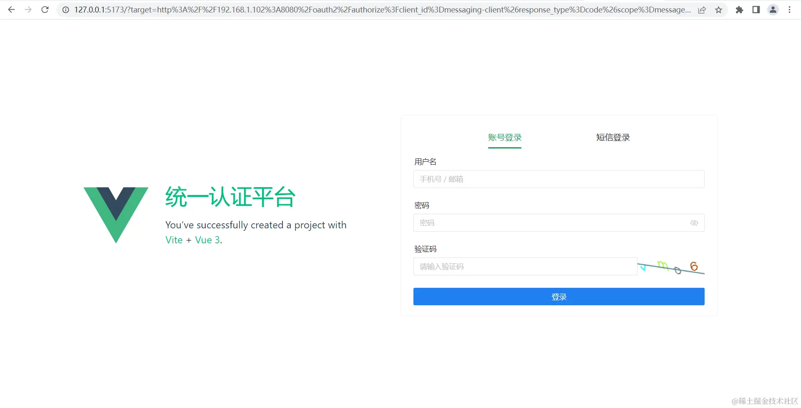

查看一下network，认证服务按规则携带target与nonce参数重定向，没有问题

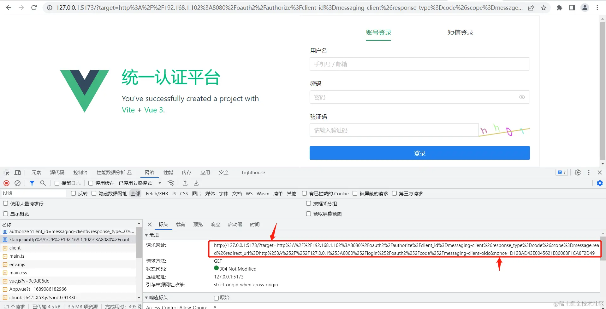

### 3. 输入账号密码提交

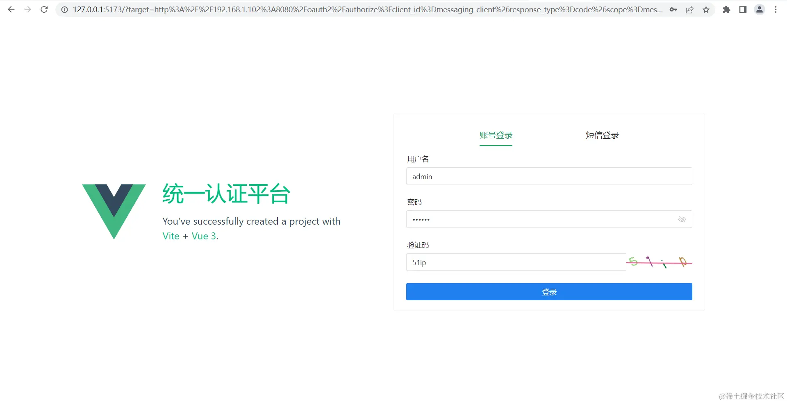

查看network

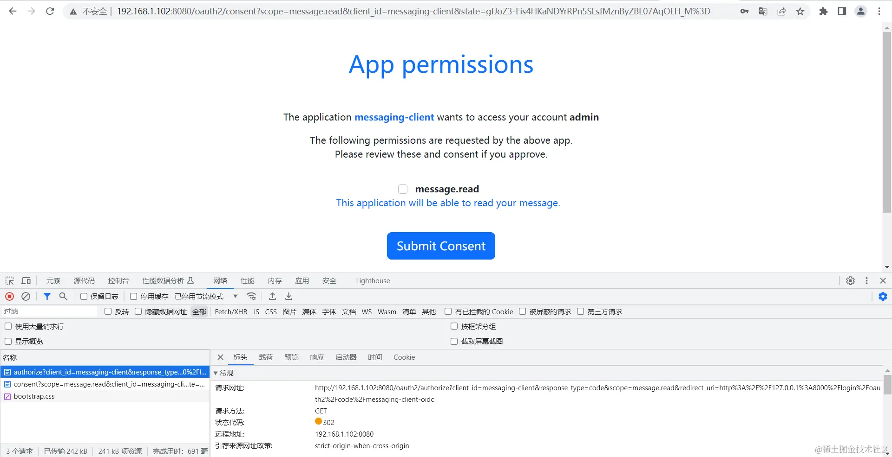

      ~~登录成功后会重定向回`/oauth2/authorize`接口并携带`nonce`参数，`/oauth2/authorize`根据`nonce`获取到认证信息后会生成一个`code`，然后携带`code`跳转至回调地址。~~
      不需要携带任何参数，因为在重定向至登录之前已经获取到`sessionId`，并根据`sessionId`存储登录时的认证信息，所以重定向回`/oauth2/authorize`接口时能够根据`sessionId`获取到认证信息。获取到认证信息后检测到未授权确认，重定向至授权确认页面。

#### 4. 授权确认提交

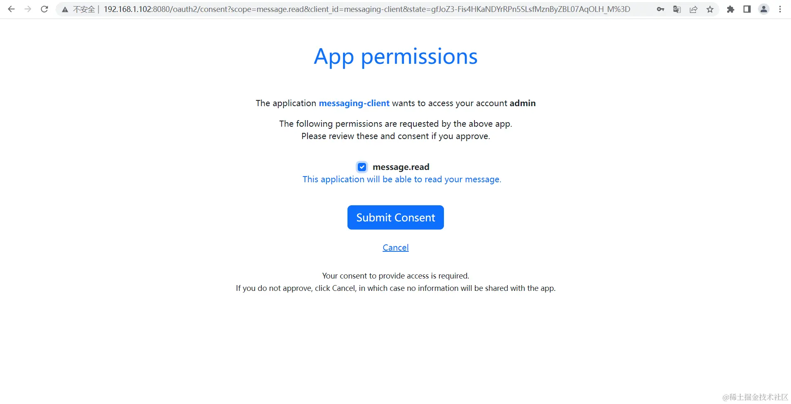

授权确认后生成code并携带code重定向至回调地址(`redirect_uri`)

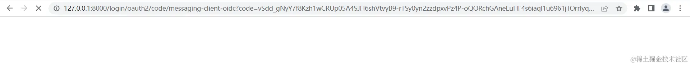

## 五、写在最后
   ~~在踩了不知道多少坑以后终于算是实现了这个东西，但是目前只支持不需要授权确认的客户端，如果需要授权确认那么就会在重定向至授权确认页面时因为获取不到登录信息而重定向至登录页面，这里也比较坑，没有能够更改授权确认请求的地方，只能另辟蹊径修改现在的`RedisSecurityContextRepository`从而使授权确认请求也能获取到认证信息，就是在获取认证信息后存入`session`中一份，因为从`/oauth2/authorize`重定向至授权确认页面是同一个`session`，所以存入`session`后就可以获取了，但是我觉得既然都已经前后端分离了，也就没必要在加授权确认了；当然也不排除有需要这东西的人，后期看看有没有需要的，如果有需要的我会写一下扩展篇。~~

        现在改为通过`sessionId`串联认证服务与单独部署的登录页面的请求，也就不会出现只能获取一次认证信息的问题了，只要在同一个浏览器中访问认证服务，那么使用的`session`就只会是同一个，当从其它系统跳转至认证服务时只要登录过就不需要在登录了，可以直接根据浏览器与认证服务之间产生的`session`的id获取到对应的认证信息，认证信息的存活时间就是在redis中设置的key的存活时间。        虽然现在也是靠`session`关联，但现在将原先存储在`session`中的认证信息存储到了redis中，缩小了服务器存储`session`所需的空间，也可以通过`sessionId`将其关联起来，解决了认证服务与登录页面不在同一域从而因为`session`的不同而获取不到认证信息的问题。这也符合sso的特点，其它域名下的服务需要认证时需要跳转到登录页面登录，登录后另外的服务再次请求认证服务认证时就不需要认证了，可以直接获取到认证信息。 

        本来想写点基础的东西，但是兄弟们太相信我了，净整些高端操作，唉 (╯°Д°)╯︵ ┻━┻ 

要是有问题请在评论区提出，以防误人子弟 

代码已提交至Gitee的`授权码模式前后端分离的登录页面`分支，如果有遗漏内容大家也可以拉取一下完整代码看看。

[仓库地址](https://gitee.com/vains-Sofia/authorization-example/tree/%E6%8E%88%E6%9D%83%E7%A0%81%E6%A8%A1%E5%BC%8F%E5%89%8D%E5%90%8E%E7%AB%AF%E5%88%86%E7%A6%BB%E7%9A%84%E7%99%BB%E5%BD%95%E9%A1%B5%E9%9D%A2/)
