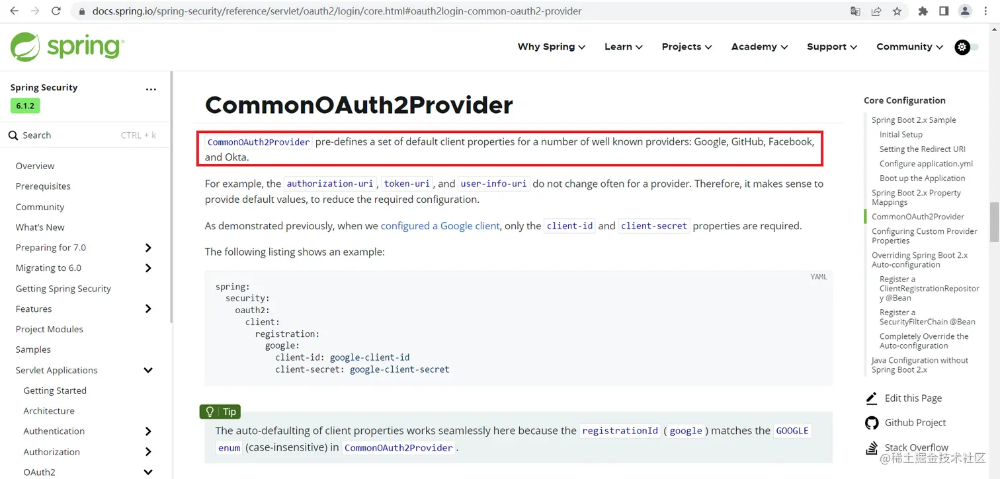

- [Spring Authorization Server入门 (十三) 实现联合身份认证，集成Github与Gitee的OAuth登录](https://juejin.cn/post/7258466145653096504)

## 一、前言
### 1. 什么是联合身份认证？
      通过Spring Security OAuth2 Client（Login）模块集成第三方登录至自己的认证服务中，使用联合身份认证只需要请求认证服务，不通过前端来跳转三方的授权申请链接，而是统一通过认证服务来跳转，只需要维护Spring Authorization Server中身份认证提供商的关系即可。

### 2. 为什么要使用联合身份认证？
      现在项目中都会集成一些三方登录，如Github、Gitee、微信、QQ平台提供的授权登录，如果手动集成则每种三方登录都要提供一个回调接口，自己实现通过code换取token，再用token获取用户信息的一个过程，但是这些内容Security OAuth2 Client都已经实现了，只要符合OAuth2的标准都可以使用这一套实现，不需要自己再造轮子了。

关于Security OAuth2 Client的对接过程及原理已经在[Spring Authorization Server入门 (八) Spring Boot引入Security OAuth2 Client对接认证服务](https://juejin.cn/post/7243725197911834683)中说过了，今天就不细讲了，会重点讲一下如何获取和处理用户信息。
先来看一下[文档](https://docs.spring.io/spring-security/reference/servlet/oauth2/login/advanced.html)，文档中说明了OAuth2 Login的一些配置，其中就有设置获取用户信息的服务，如下


      再来详细看一下关于`OAuth2UserService`的[详细介绍](https://docs.spring.io/spring-security/reference/servlet/oauth2/login/advanced.html#oauth2login-advanced-oauth2-user-service)


      发现`OAuth2UserService`有一个默认实现`DefaultOAuth2UserService`，它是通过RestOperations的实例请求用户的基础信息，也说明了该类中可自定义的一些配置，例如请求参数转换、响应数据处理。
虽然上边说明了如何自定义`OAuth2UserService`，但是本人在查看源码时发现框架会先从配置中获取，获取不到会从ioc中获取，ioc中没有就初始化一个，如下所示


所以也支持以注入ioc中的方式去配置一个`OAuth2UserService`。
再来看一下`OAuth2UserService`中`loadUser`方法被调用的地方


`OidcAuthorizationCodeAuthenticationProvider`和`OAuth2LoginAuthenticationProvider`中都有调用，分别看一下这两个`provider`之间的逻辑，看看它们的区别


发现Oidc是需要有`openid`的`scope`才会被处理，而OAuth2开头的这个是在`scope`中未包含`openid`才会去处理。细看之后发现它们里边注入的`OAuth2UserService`的实例不一样，处理oidc登录的实例是`OidcUserService`，处理普通oauth登录的是`DefaultOAuth2UserService`，这是Security OAuth2 Client针对OAuth与OpenId connect两种登录方式的处理，在之前也有提到过，当scope中包含openid时本次就是openid connect登录，获取token后会响应idToken，里边包含了用户信息，所以这里会有两种处理。同理，如果我们要自定义这两个service的话也需要实现这两个service，提高兼容性。

## 二、编码

### 1. 前期准备说明

1. 今天主要演示Gitee与GitHub的oauth登录，所以需要先在各平台注册好所需的第三方应用。

   - [Github的OAuth登录文档](https://docs.github.com/zh/apps/oauth-apps/building-oauth-apps/authorizing-oauth-apps)
   - [Gitee的OAuth登录文档](https://gitee.com/api/v5/oauth_doc#/)

2. 初始化三方用户账号表


### 2. 编码流程说明

1. 引入Security OAuth2 Client依赖，给认证服务添加一个“客户端”的身份
2. 编写自定义`OAuth2UserService`，来处理三方登录的用户信息
3. 使用策略模式编写一套用户信息转换类，将三方用户信息转成自己系统里的用户信息并储存
4. 编写联合身份认证自定义token处理，当使用openId Connect登录时将用户信息写入idToken中
5. 更新认证服务配置类，添加联合身份认证配置
6. 登录页面添加三方登录入口

开始编码之前放一下官方的[联合身份认证示例](https://github.com/spring-projects/spring-authorization-server/tree/main/samples/demo-authorizationserver/src/main/java/sample/federation)

### 3. 初始化三方用户账号表
如果之前引入过需重新引入，表结构有变化
```sql
DROP TABLE IF EXISTS `oauth2_third_account`;
CREATE TABLE `oauth2_third_account`
(
    `id`                     int(11) NOT NULL AUTO_INCREMENT COMMENT '自增id',
    `user_id`                int(11) NULL DEFAULT NULL COMMENT '用户表主键',
    `unique_id`              varchar(255) CHARACTER SET utf8mb4 COLLATE utf8mb4_bin NULL DEFAULT NULL COMMENT '三方登录唯一id',
    `third_username`         varchar(255) CHARACTER SET utf8mb4 COLLATE utf8mb4_bin NULL DEFAULT NULL COMMENT '三方用户的账号',
    `credentials`            varchar(255) CHARACTER SET utf8mb4 COLLATE utf8mb4_bin NULL DEFAULT NULL COMMENT '三方登录获取的认证信息(token)',
    `credentials_expires_at` datetime(0) NULL DEFAULT NULL COMMENT '三方登录获取的认证信息过期时间',
    `avatar`                 varchar(255) CHARACTER SET utf8mb4 COLLATE utf8mb4_bin NULL DEFAULT NULL COMMENT '三方账号头像url',
    `type`                   varchar(255) CHARACTER SET utf8mb4 COLLATE utf8mb4_bin NULL DEFAULT NULL COMMENT '三方登录类型',
    `blog`                   varchar(255) CHARACTER SET utf8mb4 COLLATE utf8mb4_bin NULL DEFAULT NULL COMMENT '博客地址',
    `location`               varchar(255) CHARACTER SET utf8mb4 COLLATE utf8mb4_bin NULL DEFAULT NULL COMMENT '地址',
    `create_time`            datetime(0) NULL DEFAULT NULL COMMENT '绑定时间',
    `update_time`            datetime(0) NULL DEFAULT NULL COMMENT '修改时间',
    PRIMARY KEY (`id`) USING BTREE
) ENGINE = InnoDB AUTO_INCREMENT = 1 CHARACTER SET = utf8mb4 COLLATE = utf8mb4_bin COMMENT = '三方登录账户信息表' ROW_FORMAT = Dynamic;
```

### 4. 开始编码
#### 1. 引入Security OAuth2 Client
引入依赖
```xml
<dependency>  
    <groupId>org.springframework.boot</groupId>  
    <artifactId>spring-boot-starter-oauth2-client</artifactId>  
</dependency>
```

添加yml配置

完整OAuth2 Client配置详见[文档](https://docs.spring.io/spring-security/reference/servlet/oauth2/client/core.html)
```yaml
spring:
  datasource:
    driver-class-name: com.mysql.cj.jdbc.Driver
    url: jdbc:mysql://localhost:3306/authorization-example?serverTimezone=UTC&userUnicode=true&characterEncoding=utf-8
    username: root
    password: root
  security:
    oauth2:
      client:
        registration:
          # 这个'gitee'就是registrationId
          gitee:
            # 指定oauth登录提供者，该oauth登录由provider中的gitee来处理
            provider: gitee
            # 客户端名字
            client-name: Sign in with Gitee
            # 认证方式
            authorization-grant-type: authorization_code
            # 客户端id，使用自己的gitee的客户端id
            client-id: 
            # 客户端秘钥，使用自己的gitee的客户端秘钥
            client-secret: 
            # 回调地址
            redirect-uri: http://192.168.1.102:8080/login/oauth2/code/gitee
            # 申请scope列表
            scope:
              - emails
              - projects
          github:
            # security client默认实现了GitHub提供的oauth2登录
            provider: github
            client-id: 88c69e87b2e50d2dab4d
            client-secret: 350b351e8287fc142d01082bcf0dc5c6df7c21ae
        # oauth登录提供商
        provider:
          # gitee的OAuth2端点配置
          gitee:
            # 设置用户信息响应体中账号的字段
            user-name-attribute: id
            # 获取token的地址
            token-uri: https://gitee.com/oauth/token
            # 获取用户信息的地址
            user-info-uri: https://gitee.com/api/v5/user
            # 发起授权申请的地址
            authorization-uri: https://gitee.com/oauth/authorize

# Mybatis-Plus 配置
mybatis-plus:
  # 扫描mapper文件
  mapper-locations:
    - classpath:com/vains/mapper/xml/*Mapper.xml
```

OAuth2 Client默认提供了一些平台的实现，不用添加配置，如下
[文档](https://docs.spring.io/spring-security/reference/servlet/oauth2/login/core.html#oauth2login-common-oauth2-provider)



#### 2. 编写自定义`OAuth2UserService`
**说明：** 本人实现默认的两个service是因为想获取三方用户信息的来源，然后根据来源去区分用户信息，如果只有一个三方登录或不需要区分用户信息的来源则可以使用官方示例中的代码，直接从`LoginSuccessHandler`中获取用户信息

在service包下的impl包下创建`CustomOauth2UserService`类并继承`DefaultOAuth2UserService`

```java
package com.example.service.impl;

import com.example.entity.Oauth2ThirdAccount;
import com.example.service.IOauth2ThirdAccountService;
import com.example.strategy.context.Oauth2UserConverterContext;
import lombok.RequiredArgsConstructor;
import org.springframework.security.oauth2.client.userinfo.DefaultOAuth2UserService;
import org.springframework.security.oauth2.client.userinfo.OAuth2UserRequest;
import org.springframework.security.oauth2.core.OAuth2AuthenticationException;
import org.springframework.security.oauth2.core.user.DefaultOAuth2User;
import org.springframework.security.oauth2.core.user.OAuth2User;
import org.springframework.stereotype.Service;

import java.util.LinkedHashMap;

/**
 * 自定义三方oauth2登录获取用户信息服务
 *
 * @author vains
 */
@Service
@RequiredArgsConstructor
public class CustomOauth2UserService extends DefaultOAuth2UserService {

    private final IOauth2ThirdAccountService thirdAccountService;

    private final Oauth2UserConverterContext userConverterContext;

    @Override
    public OAuth2User loadUser(OAuth2UserRequest userRequest) throws OAuth2AuthenticationException {
        OAuth2User oAuth2User = super.loadUser(userRequest);
        // 转为项目中的三方用户信息
        Oauth2ThirdAccount oauth2ThirdAccount = userConverterContext.convert(userRequest, oAuth2User);
        // 检查用户信息
        thirdAccountService.checkAndSaveUser(oauth2ThirdAccount);
        // 将loginType设置至attributes中
        LinkedHashMap<String, Object> attributes = new LinkedHashMap<>(oAuth2User.getAttributes());
        // 将yml配置的RegistrationId当做登录类型
        attributes.put("loginType", userRequest.getClientRegistration().getRegistrationId());
        String userNameAttributeName = userRequest.getClientRegistration().getProviderDetails().getUserInfoEndpoint()
                .getUserNameAttributeName();
        return new DefaultOAuth2User(oAuth2User.getAuthorities(), attributes, userNameAttributeName);
    }
}
```

在service包下的impl包下创建`CustomOidcUserService`并继承`OidcUserService`
```java
package com.example.service.impl;

import com.example.entity.Oauth2ThirdAccount;
import com.example.service.IOauth2ThirdAccountService;
import com.example.strategy.context.Oauth2UserConverterContext;
import lombok.RequiredArgsConstructor;
import org.springframework.security.oauth2.client.oidc.userinfo.OidcUserRequest;
import org.springframework.security.oauth2.client.oidc.userinfo.OidcUserService;
import org.springframework.security.oauth2.core.OAuth2AuthenticationException;
import org.springframework.security.oauth2.core.oidc.OidcIdToken;
import org.springframework.security.oauth2.core.oidc.user.DefaultOidcUser;
import org.springframework.security.oauth2.core.oidc.user.OidcUser;
import org.springframework.stereotype.Service;
import org.springframework.util.StringUtils;

import java.util.LinkedHashMap;

/**
 * 自定义三方oidc登录用户信息服务
 *
 * @author vains
 */
@Service
@RequiredArgsConstructor
public class CustomOidcUserService extends OidcUserService {

    private final IOauth2ThirdAccountService thirdAccountService;

    private final Oauth2UserConverterContext userConverterContext;

    @Override
    public OidcUser loadUser(OidcUserRequest userRequest) throws OAuth2AuthenticationException {
        // 获取三方用户信息
        OidcUser oidcUser = super.loadUser(userRequest);
        // 转为项目中的三方用户信息
        Oauth2ThirdAccount oauth2ThirdAccount = userConverterContext.convert(userRequest, oidcUser);
        // 检查用户信息
        thirdAccountService.checkAndSaveUser(oauth2ThirdAccount);
        OidcIdToken oidcIdToken = oidcUser.getIdToken();
        // 将loginType设置至attributes中
        LinkedHashMap<String, Object> attributes = new LinkedHashMap<>(oidcIdToken.getClaims());
        // 将RegistrationId当做登录类型
        attributes.put("loginType", userRequest.getClientRegistration().getRegistrationId());
        // 重新生成一个idToken
        OidcIdToken idToken = new OidcIdToken(oidcIdToken.getTokenValue(), oidcIdToken.getIssuedAt(), oidcIdToken.getExpiresAt(), attributes);
        String userNameAttributeName = userRequest.getClientRegistration().getProviderDetails().getUserInfoEndpoint()
                .getUserNameAttributeName();
        // 重新生成oidcUser
        if (StringUtils.hasText(userNameAttributeName)) {
            return new DefaultOidcUser(oidcUser.getAuthorities(), idToken, oidcUser.getUserInfo(), userNameAttributeName);
        }
        return new DefaultOidcUser(oidcUser.getAuthorities(), idToken, oidcUser.getUserInfo());
    }
}
```

#### 3. 使用策略模式编写一套用户信息转换类，将三方用户信息转成自己系统里的用户信息并储存
新建strategy包，在包下创建策略模式的接口`Oauth2UserConverterStrategy`，创建抽象方法`convert`
```java
package com.example.strategy;

import com.example.entity.Oauth2ThirdAccount;
import org.springframework.security.oauth2.core.user.OAuth2User;

/**
 * oauth2 三方登录获取到的用户信息转换策略接口
 *
 * @author vains
 */
public interface Oauth2UserConverterStrategy {

    /**
     * 将oauth2登录的认证信息转为 {@link Oauth2ThirdAccount}
     *
     * @param oAuth2User oauth2登录获取的用户信息
     * @return 项目中的用户信息
     */
    Oauth2ThirdAccount convert(OAuth2User oAuth2User);

}
```

创建三方平台对应的用户信息处理实现

在`com.example.strategy.impl`包下创建`GiteeUserConverter`处理Gitee的用户信息

**注意：** 要指定bean在ioc中的名字，我这里是和配置文件中三方登录应用在配置时设置的`RegistrationId`
```java
package com.example.strategy.impl;

import com.example.entity.Oauth2ThirdAccount;
import com.example.strategy.Oauth2UserConverterStrategy;
import org.springframework.security.oauth2.core.user.OAuth2User;
import org.springframework.stereotype.Component;

import java.util.Map;

import static com.example.constant.SecurityConstants.THIRD_LOGIN_GITEE;

/**
 * 转换通过码云登录的用户信息
 *
 * @author vains
 */
@Component(THIRD_LOGIN_GITEE)
public class GiteeUserConverter implements Oauth2UserConverterStrategy {


    @Override
    public Oauth2ThirdAccount convert(OAuth2User oAuth2User) {
        // 获取三方用户信息
        Map<String, Object> attributes = oAuth2User.getAttributes();
        // 转换至Oauth2ThirdAccount
        Oauth2ThirdAccount thirdAccount = new Oauth2ThirdAccount();
        thirdAccount.setUniqueId(oAuth2User.getName());
        thirdAccount.setThirdUsername(String.valueOf(attributes.get("login")));
        thirdAccount.setType(THIRD_LOGIN_GITEE);
        thirdAccount.setBlog(String.valueOf(attributes.get("blog")));
        // 设置基础用户信息
        thirdAccount.setName(String.valueOf(attributes.get("name")));
        thirdAccount.setAvatarUrl(String.valueOf(attributes.get("avatar_url")));
        return thirdAccount;
    }
}
```

在`com.example.strategy.impl`包下创建`GithubUserConverter`处理Github的用户信息
```java
package com.example.strategy.impl;

import com.example.entity.Oauth2ThirdAccount;
import com.example.strategy.Oauth2UserConverterStrategy;
import lombok.RequiredArgsConstructor;
import org.springframework.security.oauth2.core.user.OAuth2User;
import org.springframework.stereotype.Component;

import static com.example.constant.SecurityConstants.THIRD_LOGIN_GITHUB;

/**
 * 转换通过Github登录的用户信息
 *
 * @author vains
 */
@RequiredArgsConstructor
@Component(THIRD_LOGIN_GITHUB)
public class GithubUserConverter implements Oauth2UserConverterStrategy {

    private final GiteeUserConverter userConverter;

    protected static final String LOGIN_TYPE = THIRD_LOGIN_GITHUB;

    @Override
    public Oauth2ThirdAccount convert(OAuth2User oAuth2User) {
        // github与gitee目前所取字段一致，直接调用gitee的解析
        Oauth2ThirdAccount thirdAccount = userConverter.convert(oAuth2User);
        // 提取location
        Object location = oAuth2User.getAttributes().get("location");
        thirdAccount.setLocation(String.valueOf(location));
        // 设置登录类型
        thirdAccount.setType(LOGIN_TYPE);
        return thirdAccount;
    }
}
```

`SecurityConstants`中添加常量
```java
/**  
 * 三方登录类型——Gitee
 */  
public static final String THIRD_LOGIN_GITEE = "gitee";  
  
/**  
 * 三方登录类型——Github
 */  
public static final String THIRD_LOGIN_GITHUB = "github";
```

在strategy包下创建context包，创建`Oauth2UserConverterContext`类，在该类中注入所有用户信息转换策略，根据传入的type(RegistrationId)获取对应的解析类
```java
package com.example.strategy.context;

import com.example.entity.Oauth2ThirdAccount;
import com.example.strategy.Oauth2UserConverterStrategy;
import lombok.RequiredArgsConstructor;
import org.springframework.security.oauth2.client.userinfo.OAuth2UserRequest;
import org.springframework.security.oauth2.core.OAuth2AccessToken;
import org.springframework.security.oauth2.core.user.OAuth2User;
import org.springframework.stereotype.Component;
import org.springframework.util.ObjectUtils;

import java.time.Instant;
import java.time.LocalDateTime;
import java.time.ZoneId;
import java.util.Map;

/**
 * 三方oauth2登录获取的用户信息转换处理
 *
 * @author vains
 */
@Component
@RequiredArgsConstructor
public class Oauth2UserConverterContext {

    /**
     * 注入所有实例，map的key是实例在ioc中的名字
     *  这里通过构造器注入所有Oauth2UserConverterStrategy的实例，实例名之前在编写时已经通过
     *  {@link Component }注解指定过bean的名字，可以根据给定bean名称从map中获取对应的实例(如果存在)
     */
    private final Map<String, Oauth2UserConverterStrategy> userConverterStrategyMap;

    /**
     * 获取转换器实例
     *
     * @param loginType 三方登录方式
     * @return 转换器实例 {@link Oauth2UserConverterStrategy}
     */
    public Oauth2UserConverterStrategy getInstance(String loginType) {
        if (ObjectUtils.isEmpty(loginType)) {
            throw new UnsupportedOperationException("登录方式不能为空.");
        }
        Oauth2UserConverterStrategy userConverterStrategy = userConverterStrategyMap.get(loginType);
        if (userConverterStrategy == null) {
            throw new UnsupportedOperationException("不支持[" + loginType + "]登录方式获取用户信息转换器");
        }
        return userConverterStrategy;
    }

    /**
     * 根据登录方式获取转换器实例，使用转换器获取用户信息
     *
     * @param userRequest  获取三方用户信息入参
     * @param oAuth2User 三方登录获取到的认证信息
     * @return {@link Oauth2ThirdAccount}
     */
    public Oauth2ThirdAccount convert(OAuth2UserRequest userRequest, OAuth2User oAuth2User) {
        // 获取三方登录配置的registrationId，这里将他当做登录方式
        String registrationId = userRequest.getClientRegistration().getRegistrationId();
        // 转换用户信息
        Oauth2ThirdAccount oauth2ThirdAccount = this.getInstance(registrationId).convert(oAuth2User);
        // 获取AccessToken
        OAuth2AccessToken accessToken = userRequest.getAccessToken();
        // 设置token
        oauth2ThirdAccount.setCredentials(accessToken.getTokenValue());
        // 设置账号的方式
        oauth2ThirdAccount.setType(registrationId);
        Instant expiresAt = accessToken.getExpiresAt();
        if (expiresAt != null) {
            LocalDateTime tokenExpiresAt = expiresAt.atZone(ZoneId.of("UTC")).toLocalDateTime();
            // token过期时间
            oauth2ThirdAccount.setCredentialsExpiresAt(tokenExpiresAt);
        }
        return oauth2ThirdAccount;
    }

}
```

三方账号实体类添加昵称、头像字段

为了省事儿就写在一个类中了
```java
package com.example.entity;

import com.baomidou.mybatisplus.annotation.*;
import lombok.Getter;
import lombok.Setter;

import java.io.Serial;
import java.io.Serializable;
import java.time.LocalDateTime;

/**
 * <p>
 * 三方登录账户信息表
 * </p>
 *
 * @author vains
 * @since 2023-07-04
 */
@Getter
@Setter
@TableName("oauth2_third_Account")
public class Oauth2ThirdAccount implements Serializable {

    @Serial
    private static final long serialVersionUID = 1L;

    /**
     * 自增id
     */
    @TableId(value = "id", type = IdType.AUTO)
    private Integer id;

    /**
     * 用户表主键
     */
    private Integer userId;

    /**
     * 三方登录唯一id
     */
    private String uniqueId;

    /**
     * 三方登录用户名
     */
    private String thirdUsername;

    /**
     * 三方登录获取的认证信息
     */
    private String credentials;

    /**
     * 三方登录获取的认证信息的过期时间
     */
    private LocalDateTime credentialsExpiresAt;

    /**
     * 三方登录类型
     */
    private String type;

    /**
     * 博客地址
     */
    private String blog;

    /**
     * 地址
     */
    private String location;

    /**
     * 绑定时间
     */
    @TableField(fill = FieldFill.INSERT)
    private LocalDateTime createTime;

    /**
     * 修改时间
     */
    @TableField(fill = FieldFill.INSERT_UPDATE)
    private LocalDateTime updateTime;

    /**
     * 用户名、昵称
     */
    @TableField(exist = false)
    private String name;

    /**
     * 头像地址
     */
    @TableField(exist = false)
    private String avatarUrl;
}
```

service添加检查并添加三方用户信息的实现
```java
package com.example.service.impl;

import com.baomidou.mybatisplus.extension.service.impl.ServiceImpl;
import com.example.entity.Oauth2ThirdAccount;
import com.example.mapper.Oauth2ThirdAccountMapper;
import com.example.service.IOauth2BasicUserService;
import com.example.service.IOauth2ThirdAccountService;
import lombok.RequiredArgsConstructor;
import org.springframework.stereotype.Service;
import org.springframework.util.ObjectUtils;

/**
 * <p>
 * 三方登录账户信息表 服务实现类
 * </p>
 *
 * @author vains
 * @since 2023-07-04
 */
@Service
@RequiredArgsConstructor
public class Oauth2ThirdAccountServiceImpl extends ServiceImpl<Oauth2ThirdAccountMapper, Oauth2ThirdAccount> implements IOauth2ThirdAccountService {

    private final IOauth2BasicUserService basicUserService;

    @Override
    public void checkAndSaveUser(Oauth2ThirdAccount thirdAccount) {
        // 构建三方唯一id和三方登录方式的查询条件
        Oauth2ThirdAccount oauth2ThirdAccount = this.lambdaQuery().eq(Oauth2ThirdAccount::getType, thirdAccount.getType())
                .eq(Oauth2ThirdAccount::getUniqueId, thirdAccount.getUniqueId()).one();
        if (oauth2ThirdAccount == null) {
            // 生成用户信息
            Integer userId = basicUserService.saveByThirdAccount(thirdAccount);
            thirdAccount.setUserId(userId);
            // 不存在保存用户信息
            this.save(thirdAccount);
        } else {
            // 校验是否需要生成基础用户信息
            if (ObjectUtils.isEmpty(oauth2ThirdAccount.getUserId())) {
                // 生成用户信息
                Integer userId = basicUserService.saveByThirdAccount(thirdAccount);
                oauth2ThirdAccount.setUserId(userId);
            }
            // 存在更新用户的认证信息
            oauth2ThirdAccount.setCredentials(thirdAccount.getCredentials());
            oauth2ThirdAccount.setCredentialsExpiresAt(thirdAccount.getCredentialsExpiresAt());
            // 设置空， 让MybatisPlus自动填充
            oauth2ThirdAccount.setUpdateTime(null);
            this.updateById(oauth2ThirdAccount);
        }
    }

}
```

基础用户信息service添加根据三方用户信息添加用户信息类
```java
package com.example.service.impl;

import com.baomidou.mybatisplus.core.conditions.query.LambdaQueryWrapper;
import com.baomidou.mybatisplus.core.toolkit.ObjectUtils;
import com.baomidou.mybatisplus.core.toolkit.Wrappers;
import com.baomidou.mybatisplus.extension.service.impl.ServiceImpl;
import com.example.entity.*;
import com.example.mapper.Oauth2BasicUserMapper;
import com.example.mapper.SysAuthorityMapper;
import com.example.mapper.SysRoleAuthorityMapper;
import com.example.mapper.SysUserRoleMapper;
import com.example.model.security.CustomGrantedAuthority;
import com.example.service.IOauth2BasicUserService;
import lombok.RequiredArgsConstructor;
import org.springframework.security.core.userdetails.UserDetails;
import org.springframework.security.core.userdetails.UserDetailsService;
import org.springframework.security.core.userdetails.UsernameNotFoundException;
import org.springframework.stereotype.Service;

import java.util.Collections;
import java.util.List;
import java.util.Optional;
import java.util.Set;
import java.util.stream.Collectors;

/**
 * <p>
 * 基础用户信息表 服务实现类
 * </p>
 *
 * @author vains
 */
@Service
@RequiredArgsConstructor
public class Oauth2BasicUserServiceImpl extends ServiceImpl<Oauth2BasicUserMapper, Oauth2BasicUser> implements IOauth2BasicUserService, UserDetailsService {

    private final SysUserRoleMapper sysUserRoleMapper;

    private final SysAuthorityMapper sysAuthorityMapper;

    private final SysRoleAuthorityMapper sysRoleAuthorityMapper;

    @Override
    public UserDetails loadUserByUsername(String username) throws UsernameNotFoundException {
        // 在Security中“username”就代表了用户登录时输入的账号，在重写该方法时它可以代表以下内容：账号、手机号、邮箱、姓名等
        // “username”在数据库中不一定非要是一样的列，它可以是手机号、邮箱，也可以都是，最主要的目的就是根据输入的内容获取到对应的用户信息，如下方所示
        // 通过传入的账号信息查询对应的用户信息
        LambdaQueryWrapper<Oauth2BasicUser> wrapper = Wrappers.lambdaQuery(Oauth2BasicUser.class)
                .or(o -> o.eq(Oauth2BasicUser::getEmail, username))
                .or(o -> o.eq(Oauth2BasicUser::getMobile, username))
                .or(o -> o.eq(Oauth2BasicUser::getAccount, username));
        Oauth2BasicUser basicUser = baseMapper.selectOne(wrapper);
        if (basicUser == null) {
            throw new UsernameNotFoundException("账号不存在");
        }

        // 通过用户角色关联表查询对应的角色
        List<SysUserRole> userRoles = sysUserRoleMapper.selectList(Wrappers.lambdaQuery(SysUserRole.class).eq(SysUserRole::getUserId, basicUser.getId()));
        List<Integer> rolesId = Optional.ofNullable(userRoles).orElse(Collections.emptyList()).stream().map(SysUserRole::getRoleId).collect(Collectors.toList());
        if (ObjectUtils.isEmpty(rolesId)) {
            return basicUser;
        }
        // 通过角色菜单关联表查出对应的菜单
        List<SysRoleAuthority> roleMenus = sysRoleAuthorityMapper.selectList(Wrappers.lambdaQuery(SysRoleAuthority.class).in(SysRoleAuthority::getRoleId, rolesId));
        List<Integer> menusId = Optional.ofNullable(roleMenus).orElse(Collections.emptyList()).stream().map(SysRoleAuthority::getAuthorityId).collect(Collectors.toList());
        if (ObjectUtils.isEmpty(menusId)) {
            return basicUser;
        }

        // 根据菜单ID查出菜单
        List<SysAuthority> menus = sysAuthorityMapper.selectBatchIds(menusId);
        Set<CustomGrantedAuthority> authorities = Optional.ofNullable(menus).orElse(Collections.emptyList()).stream().map(SysAuthority::getUrl).map(CustomGrantedAuthority::new).collect(Collectors.toSet());
        basicUser.setAuthorities(authorities);
        return basicUser;
    }

    @Override
    public Integer saveByThirdAccount(Oauth2ThirdAccount thirdAccount) {
        Oauth2BasicUser basicUser = new Oauth2BasicUser();
        basicUser.setName(thirdAccount.getName());
        basicUser.setAvatarUrl(thirdAccount.getAvatarUrl());
        basicUser.setDeleted(Boolean.FALSE);
        basicUser.setSourceFrom(thirdAccount.getType());
        this.save(basicUser);
        return basicUser.getId();
    }
}
```

调用三方登录后初始化用户信息的逻辑就根据具体的业务来做，我这里只是一个简单的示例，而且三方用户信息表只是存储了几个字段，读者可根据实际情况选择保存的属性，直接在`Oauth2UserConverterStrategy`的`convert`方法中映射。

### 4. 编写联合身份认证自定义token处理，当使用openId Connect登录时将用户信息写入idToken中
参考官方示例编写，并且将之前的自定义逻辑整合在了一块
```java
package com.example.authorization.federation;

import com.example.constant.SecurityConstants;
import org.springframework.security.core.Authentication;
import org.springframework.security.core.GrantedAuthority;
import org.springframework.security.core.userdetails.UserDetails;
import org.springframework.security.oauth2.core.oidc.IdTokenClaimNames;
import org.springframework.security.oauth2.core.oidc.OidcIdToken;
import org.springframework.security.oauth2.core.oidc.endpoint.OidcParameterNames;
import org.springframework.security.oauth2.core.oidc.user.OidcUser;
import org.springframework.security.oauth2.core.user.OAuth2User;
import org.springframework.security.oauth2.jwt.JwtClaimsSet;
import org.springframework.security.oauth2.server.authorization.token.JwtEncodingContext;
import org.springframework.security.oauth2.server.authorization.token.OAuth2TokenCustomizer;

import java.util.*;
import java.util.stream.Collectors;

/**
 * An {@link OAuth2TokenCustomizer} to map claims from a federated identity to
 * the {@code id_token} produced by this authorization server.
 *
 * @author vains
 */
public final class FederatedIdentityIdTokenCustomizer implements OAuth2TokenCustomizer<JwtEncodingContext> {

    private static final Set<String> ID_TOKEN_CLAIMS = Set.of(
            IdTokenClaimNames.ISS,
            IdTokenClaimNames.SUB,
            IdTokenClaimNames.AUD,
            IdTokenClaimNames.EXP,
            IdTokenClaimNames.IAT,
            IdTokenClaimNames.AUTH_TIME,
            IdTokenClaimNames.NONCE,
            IdTokenClaimNames.ACR,
            IdTokenClaimNames.AMR,
            IdTokenClaimNames.AZP,
            IdTokenClaimNames.AT_HASH,
            IdTokenClaimNames.C_HASH
    );

    @Override
    public void customize(JwtEncodingContext context) {
        if (OidcParameterNames.ID_TOKEN.equals(context.getTokenType().getValue())) {
            Map<String, Object> thirdPartyClaims = extractClaims(context.getPrincipal());
            context.getClaims().claims(existingClaims -> {
                // Remove conflicting claims set by this authorization server
                existingClaims.keySet().forEach(thirdPartyClaims::remove);

                // Remove standard id_token claims that could cause problems with clients
                ID_TOKEN_CLAIMS.forEach(thirdPartyClaims::remove);

                // Add all other claims directly to id_token
                existingClaims.putAll(thirdPartyClaims);
            });
        }

        // 检查登录用户信息是不是OAuth2User，在token中添加loginType属性
        if (context.getPrincipal().getPrincipal() instanceof OAuth2User user) {
            JwtClaimsSet.Builder claims = context.getClaims();
            Object loginType = user.getAttribute("loginType");
            if (loginType instanceof String) {
                // 同时检验是否为String和是否不为空
                claims.claim("loginType", loginType);
            }
        }

        // 检查登录用户信息是不是UserDetails，排除掉没有用户参与的流程
        if (context.getPrincipal().getPrincipal() instanceof UserDetails user) {
            // 获取申请的scopes
            Set<String> scopes = context.getAuthorizedScopes();
            // 获取用户的权限
            Collection<? extends GrantedAuthority> authorities = user.getAuthorities();
            // 提取权限并转为字符串
            Set<String> authoritySet = Optional.ofNullable(authorities).orElse(Collections.emptyList()).stream()
                    // 获取权限字符串
                    .map(GrantedAuthority::getAuthority)
                    // 去重
                    .collect(Collectors.toSet());

            // 合并scope与用户信息
            authoritySet.addAll(scopes);

            JwtClaimsSet.Builder claims = context.getClaims();
            // 将权限信息放入jwt的claims中（也可以生成一个以指定字符分割的字符串放入）
            claims.claim(SecurityConstants.AUTHORITIES_KEY, authoritySet);
            // 放入其它自定内容
            // 角色、头像...
        }
    }

    private Map<String, Object> extractClaims(Authentication principal) {
        Map<String, Object> claims;
        if (principal.getPrincipal() instanceof OidcUser oidcUser) {
            OidcIdToken idToken = oidcUser.getIdToken();
            claims = idToken.getClaims();
        } else if (principal.getPrincipal() instanceof OAuth2User oauth2User) {
            claims = oauth2User.getAttributes();
        } else {
            claims = Collections.emptyMap();
        }

        return new HashMap<>(claims);
    }


}
```

### 5. 更新认证服务配置类，添加联合身份认证配置
```java
package com.example.config;

import com.example.authorization.device.DeviceClientAuthenticationConverter;
import com.example.authorization.device.DeviceClientAuthenticationProvider;
import com.example.authorization.federation.FederatedIdentityIdTokenCustomizer;
import com.example.authorization.handler.LoginFailureHandler;
import com.example.authorization.handler.LoginSuccessHandler;
import com.example.authorization.handler.LoginTargetAuthenticationEntryPoint;
import com.example.authorization.sms.SmsCaptchaGrantAuthenticationConverter;
import com.example.authorization.sms.SmsCaptchaGrantAuthenticationProvider;
import com.example.constant.RedisConstants;
import com.example.constant.SecurityConstants;
import com.example.support.RedisOperator;
import com.example.support.RedisSecurityContextRepository;
import com.example.util.SecurityUtils;
import com.nimbusds.jose.jwk.JWKSet;
import com.nimbusds.jose.jwk.RSAKey;
import com.nimbusds.jose.jwk.source.ImmutableJWKSet;
import com.nimbusds.jose.jwk.source.JWKSource;
import com.nimbusds.jose.proc.SecurityContext;
import lombok.RequiredArgsConstructor;
import lombok.SneakyThrows;
import org.springframework.context.annotation.Bean;
import org.springframework.context.annotation.Configuration;
import org.springframework.http.MediaType;
import org.springframework.jdbc.core.JdbcTemplate;
import org.springframework.security.access.annotation.Secured;
import org.springframework.security.authentication.AuthenticationManager;
import org.springframework.security.config.Customizer;
import org.springframework.security.config.annotation.authentication.configuration.AuthenticationConfiguration;
import org.springframework.security.config.annotation.method.configuration.EnableMethodSecurity;
import org.springframework.security.config.annotation.web.builders.HttpSecurity;
import org.springframework.security.config.annotation.web.configuration.EnableWebSecurity;
import org.springframework.security.config.annotation.web.configurers.AbstractHttpConfigurer;
import org.springframework.security.crypto.bcrypt.BCryptPasswordEncoder;
import org.springframework.security.crypto.password.PasswordEncoder;
import org.springframework.security.oauth2.core.AuthorizationGrantType;
import org.springframework.security.oauth2.core.ClientAuthenticationMethod;
import org.springframework.security.oauth2.core.oidc.OidcScopes;
import org.springframework.security.oauth2.jwt.JwtDecoder;
import org.springframework.security.oauth2.server.authorization.JdbcOAuth2AuthorizationConsentService;
import org.springframework.security.oauth2.server.authorization.JdbcOAuth2AuthorizationService;
import org.springframework.security.oauth2.server.authorization.OAuth2AuthorizationConsentService;
import org.springframework.security.oauth2.server.authorization.OAuth2AuthorizationService;
import org.springframework.security.oauth2.server.authorization.client.JdbcRegisteredClientRepository;
import org.springframework.security.oauth2.server.authorization.client.RegisteredClient;
import org.springframework.security.oauth2.server.authorization.client.RegisteredClientRepository;
import org.springframework.security.oauth2.server.authorization.config.annotation.web.configuration.OAuth2AuthorizationServerConfiguration;
import org.springframework.security.oauth2.server.authorization.config.annotation.web.configurers.OAuth2AuthorizationServerConfigurer;
import org.springframework.security.oauth2.server.authorization.settings.AuthorizationServerSettings;
import org.springframework.security.oauth2.server.authorization.settings.ClientSettings;
import org.springframework.security.oauth2.server.authorization.token.JwtEncodingContext;
import org.springframework.security.oauth2.server.authorization.token.OAuth2TokenCustomizer;
import org.springframework.security.oauth2.server.authorization.token.OAuth2TokenGenerator;
import org.springframework.security.oauth2.server.resource.authentication.JwtAuthenticationConverter;
import org.springframework.security.oauth2.server.resource.authentication.JwtGrantedAuthoritiesConverter;
import org.springframework.security.web.DefaultSecurityFilterChain;
import org.springframework.security.web.SecurityFilterChain;
import org.springframework.security.web.util.UrlUtils;
import org.springframework.security.web.util.matcher.MediaTypeRequestMatcher;
import org.springframework.util.ObjectUtils;
import org.springframework.web.cors.CorsConfiguration;
import org.springframework.web.cors.UrlBasedCorsConfigurationSource;
import org.springframework.web.filter.CorsFilter;

import java.security.KeyPair;
import java.security.KeyPairGenerator;
import java.security.interfaces.RSAPrivateKey;
import java.security.interfaces.RSAPublicKey;
import java.util.UUID;

/**
 * 认证配置
 * {@link EnableMethodSecurity} 开启全局方法认证，启用JSR250注解支持，启用注解 {@link Secured} 支持，
 * 在Spring Security 6.0版本中将@Configuration注解从@EnableWebSecurity, @EnableMethodSecurity, @EnableGlobalMethodSecurity
 * 和 @EnableGlobalAuthentication 中移除，使用这些注解需手动添加 @Configuration 注解
 * {@link EnableWebSecurity} 注解有两个作用:
 * 1. 加载了WebSecurityConfiguration配置类, 配置安全认证策略。
 * 2. 加载了AuthenticationConfiguration, 配置了认证信息。
 *
 * @author vains
 */
@Configuration
@EnableWebSecurity
@RequiredArgsConstructor
@EnableMethodSecurity(jsr250Enabled = true, securedEnabled = true)
public class AuthorizationConfig {

    private final RedisOperator<String> redisOperator;

    /**
     * 登录地址，前后端分离就填写完整的url路径，不分离填写相对路径
     */
    private final String LOGIN_URL = "/login";

    private static final String CUSTOM_CONSENT_PAGE_URI = "/oauth2/consent";

    private final RedisSecurityContextRepository redisSecurityContextRepository;

    /**
     * 配置端点的过滤器链
     *
     * @param http spring security核心配置类
     * @return 过滤器链
     * @throws Exception 抛出
     */
    @Bean
    public SecurityFilterChain authorizationServerSecurityFilterChain(HttpSecurity http,
                                                                      RegisteredClientRepository registeredClientRepository,
                                                                      AuthorizationServerSettings authorizationServerSettings) throws Exception {
        // 配置默认的设置，忽略认证端点的csrf校验
        OAuth2AuthorizationServerConfiguration.applyDefaultSecurity(http);

        // 新建设备码converter和provider
        DeviceClientAuthenticationConverter deviceClientAuthenticationConverter =
                new DeviceClientAuthenticationConverter(
                        authorizationServerSettings.getDeviceAuthorizationEndpoint());
        DeviceClientAuthenticationProvider deviceClientAuthenticationProvider =
                new DeviceClientAuthenticationProvider(registeredClientRepository);

        // 使用redis存储、读取登录的认证信息
        http.securityContext(context -> context.securityContextRepository(redisSecurityContextRepository));

        http.getConfigurer(OAuth2AuthorizationServerConfigurer.class)
                // 开启OpenID Connect 1.0协议相关端点
                .oidc(Customizer.withDefaults())
                // 设置自定义用户确认授权页
                .authorizationEndpoint(authorizationEndpoint -> authorizationEndpoint.consentPage(CUSTOM_CONSENT_PAGE_URI))
                // 设置设备码用户验证url(自定义用户验证页)
                .deviceAuthorizationEndpoint(deviceAuthorizationEndpoint ->
                        deviceAuthorizationEndpoint.verificationUri("/activate")
                )
                // 设置验证设备码用户确认页面
                .deviceVerificationEndpoint(deviceVerificationEndpoint ->
                        deviceVerificationEndpoint.consentPage(CUSTOM_CONSENT_PAGE_URI)
                )
                .clientAuthentication(clientAuthentication ->
                        // 客户端认证添加设备码的converter和provider
                        clientAuthentication
                                .authenticationConverter(deviceClientAuthenticationConverter)
                                .authenticationProvider(deviceClientAuthenticationProvider)
                );
        http
                // 当未登录时访问认证端点时重定向至login页面
                .exceptionHandling((exceptions) -> exceptions
                        .defaultAuthenticationEntryPointFor(
                                new LoginTargetAuthenticationEntryPoint(LOGIN_URL),
                                new MediaTypeRequestMatcher(MediaType.TEXT_HTML)
                        )
                )
                // 处理使用access token访问用户信息端点和客户端注册端点
                .oauth2ResourceServer((resourceServer) -> resourceServer
                        .jwt(Customizer.withDefaults()));

        // 自定义短信认证登录转换器
        SmsCaptchaGrantAuthenticationConverter converter = new SmsCaptchaGrantAuthenticationConverter();
        // 自定义短信认证登录认证提供
        SmsCaptchaGrantAuthenticationProvider provider = new SmsCaptchaGrantAuthenticationProvider();
        http.getConfigurer(OAuth2AuthorizationServerConfigurer.class)
                // 让认证服务器元数据中有自定义的认证方式
                .authorizationServerMetadataEndpoint(metadata -> metadata.authorizationServerMetadataCustomizer(customizer -> customizer.grantType(SecurityConstants.GRANT_TYPE_SMS_CODE)))
                // 添加自定义grant_type——短信认证登录
                .tokenEndpoint(tokenEndpoint -> tokenEndpoint
                        .accessTokenRequestConverter(converter)
                        .authenticationProvider(provider));

        DefaultSecurityFilterChain build = http.build();

        // 从框架中获取provider中所需的bean
        OAuth2TokenGenerator<?> tokenGenerator = http.getSharedObject(OAuth2TokenGenerator.class);
        AuthenticationManager authenticationManager = http.getSharedObject(AuthenticationManager.class);
        OAuth2AuthorizationService authorizationService = http.getSharedObject(OAuth2AuthorizationService.class);
        // 以上三个bean在build()方法之后调用是因为调用build方法时框架会尝试获取这些类，
        // 如果获取不到则初始化一个实例放入SharedObject中，所以要在build方法调用之后获取
        // 在通过set方法设置进provider中，但是如果在build方法之后调用authenticationProvider(provider)
        // 框架会提示unsupported_grant_type，因为已经初始化完了，在添加就不会生效了
        provider.setTokenGenerator(tokenGenerator);
        provider.setAuthorizationService(authorizationService);
        provider.setAuthenticationManager(authenticationManager);

        return build;
    }

    /**
     * 配置认证相关的过滤器链
     *
     * @param http spring security核心配置类
     * @return 过滤器链
     * @throws Exception 抛出
     */
    @Bean
    public SecurityFilterChain defaultSecurityFilterChain(HttpSecurity http) throws Exception {
        // 添加跨域过滤器
        http.addFilter(corsFilter());
        // 禁用 csrf 与 cors
        http.csrf(AbstractHttpConfigurer::disable);
        http.cors(AbstractHttpConfigurer::disable);
        http.authorizeHttpRequests((authorize) -> authorize
                        // 放行静态资源
                        .requestMatchers("/assets/**", "/webjars/**", "/login", "/getCaptcha", "/getSmsCaptcha", "/error").permitAll()
                        .anyRequest().authenticated()
                )
                // 指定登录页面
                .formLogin(formLogin -> {
                            formLogin.loginPage("/login");
                            if (UrlUtils.isAbsoluteUrl(LOGIN_URL)) {
                                // 绝对路径代表是前后端分离，登录成功和失败改为写回json，不重定向了
                                formLogin.successHandler(new LoginSuccessHandler());
                                formLogin.failureHandler(new LoginFailureHandler());
                            }
                        }
                );
        // 添加BearerTokenAuthenticationFilter，将认证服务当做一个资源服务，解析请求头中的token
        http.oauth2ResourceServer((resourceServer) -> resourceServer
                .jwt(Customizer.withDefaults())
                .accessDeniedHandler(SecurityUtils::exceptionHandler)
                .authenticationEntryPoint(SecurityUtils::exceptionHandler)
        );
        // 兼容前后端分离与不分离配置
        if (UrlUtils.isAbsoluteUrl(LOGIN_URL)) {
            http
                    // 当未登录时访问认证端点时重定向至login页面
                    .exceptionHandling((exceptions) -> exceptions
                            .defaultAuthenticationEntryPointFor(
                                    new LoginTargetAuthenticationEntryPoint(LOGIN_URL),
                                    new MediaTypeRequestMatcher(MediaType.TEXT_HTML)
                            )
                    );
        }
        // 联合登录配置
        http.oauth2Login(oauth2Login ->
                oauth2Login
                        .loginPage(LOGIN_URL)
        );

        // 使用redis存储、读取登录的认证信息
        http.securityContext(context -> context.securityContextRepository(redisSecurityContextRepository));

        return http.build();
    }

    /**
     * 跨域过滤器配置
     *
     * @return CorsFilter
     */
    @Bean
    public CorsFilter corsFilter() {

        // 初始化cors配置对象
        CorsConfiguration configuration = new CorsConfiguration();

        // 设置允许跨域的域名,如果允许携带cookie的话,路径就不能写*号, *表示所有的域名都可以跨域访问
        configuration.addAllowedOrigin("http://127.0.0.1:5173");
        // 设置跨域访问可以携带cookie
        configuration.setAllowCredentials(true);
        // 允许所有的请求方法 ==> GET POST PUT Delete
        configuration.addAllowedMethod("*");
        // 允许携带任何头信息
        configuration.addAllowedHeader("*");

        // 初始化cors配置源对象
        UrlBasedCorsConfigurationSource configurationSource = new UrlBasedCorsConfigurationSource();

        // 给配置源对象设置过滤的参数
        // 参数一: 过滤的路径 == > 所有的路径都要求校验是否跨域
        // 参数二: 配置类
        configurationSource.registerCorsConfiguration("/**", configuration);

        // 返回配置好的过滤器
        return new CorsFilter(configurationSource);
    }

    /**
     * 自定义jwt，将权限信息放至jwt中
     *
     * @return OAuth2TokenCustomizer的实例
     */
    @Bean
    public OAuth2TokenCustomizer<JwtEncodingContext> oAuth2TokenCustomizer() {
        return new FederatedIdentityIdTokenCustomizer();
    }

    /**
     * 自定义jwt解析器，设置解析出来的权限信息的前缀与在jwt中的key
     *
     * @return jwt解析器 JwtAuthenticationConverter
     */
    @Bean
    public JwtAuthenticationConverter jwtAuthenticationConverter() {
        JwtGrantedAuthoritiesConverter grantedAuthoritiesConverter = new JwtGrantedAuthoritiesConverter();
        // 设置解析权限信息的前缀，设置为空是去掉前缀
        grantedAuthoritiesConverter.setAuthorityPrefix("");
        // 设置权限信息在jwt claims中的key
        grantedAuthoritiesConverter.setAuthoritiesClaimName(SecurityConstants.AUTHORITIES_KEY);

        JwtAuthenticationConverter jwtAuthenticationConverter = new JwtAuthenticationConverter();
        jwtAuthenticationConverter.setJwtGrantedAuthoritiesConverter(grantedAuthoritiesConverter);
        return jwtAuthenticationConverter;
    }


    /**
     * 将AuthenticationManager注入ioc中，其它需要使用地方可以直接从ioc中获取
     *
     * @param authenticationConfiguration 导出认证配置
     * @return AuthenticationManager 认证管理器
     */
    @Bean
    @SneakyThrows
    public AuthenticationManager authenticationManager(AuthenticationConfiguration authenticationConfiguration) {
        return authenticationConfiguration.getAuthenticationManager();
    }

    /**
     * 配置密码解析器，使用BCrypt的方式对密码进行加密和验证
     *
     * @return BCryptPasswordEncoder
     */
    @Bean
    public PasswordEncoder passwordEncoder() {
        return new BCryptPasswordEncoder();
    }

    /**
     * 配置客户端Repository
     *
     * @param jdbcTemplate    db 数据源信息
     * @param passwordEncoder 密码解析器
     * @return 基于数据库的repository
     */
    @Bean
    public RegisteredClientRepository registeredClientRepository(JdbcTemplate jdbcTemplate, PasswordEncoder passwordEncoder) {
        RegisteredClient registeredClient = RegisteredClient.withId(UUID.randomUUID().toString())
                // 客户端id
                .clientId("messaging-client")
                // 客户端秘钥，使用密码解析器加密
                .clientSecret(passwordEncoder.encode("123456"))
                // 客户端认证方式，基于请求头的认证
                .clientAuthenticationMethod(ClientAuthenticationMethod.CLIENT_SECRET_BASIC)
                // 配置资源服务器使用该客户端获取授权时支持的方式
                .authorizationGrantType(AuthorizationGrantType.AUTHORIZATION_CODE)
                .authorizationGrantType(AuthorizationGrantType.REFRESH_TOKEN)
                .authorizationGrantType(AuthorizationGrantType.CLIENT_CREDENTIALS)
                // 客户端添加自定义认证
                .authorizationGrantType(new AuthorizationGrantType(SecurityConstants.GRANT_TYPE_SMS_CODE))
                // 授权码模式回调地址，oauth2.1已改为精准匹配，不能只设置域名，并且屏蔽了localhost，本机使用127.0.0.1访问
                .redirectUri("http://127.0.0.1:8080/login/oauth2/code/messaging-client-oidc")
                .redirectUri("https://www.baidu.com")
                // 该客户端的授权范围，OPENID与PROFILE是IdToken的scope，获取授权时请求OPENID的scope时认证服务会返回IdToken
                .scope(OidcScopes.OPENID)
                .scope(OidcScopes.PROFILE)
                // 自定scope
                .scope("message.read")
                .scope("message.write")
                // 客户端设置，设置用户需要确认授权
                .clientSettings(ClientSettings.builder().requireAuthorizationConsent(true).build())
                .build();

        // 基于db存储客户端，还有一个基于内存的实现 InMemoryRegisteredClientRepository
        JdbcRegisteredClientRepository registeredClientRepository = new JdbcRegisteredClientRepository(jdbcTemplate);

        // 初始化客户端
        RegisteredClient repositoryByClientId = registeredClientRepository.findByClientId(registeredClient.getClientId());
        if (repositoryByClientId == null) {
            registeredClientRepository.save(registeredClient);
        }
        // 设备码授权客户端
        RegisteredClient deviceClient = RegisteredClient.withId(UUID.randomUUID().toString())
                .clientId("device-message-client")
                // 公共客户端
                .clientAuthenticationMethod(ClientAuthenticationMethod.NONE)
                // 设备码授权
                .authorizationGrantType(AuthorizationGrantType.DEVICE_CODE)
                .authorizationGrantType(AuthorizationGrantType.REFRESH_TOKEN)
                // 自定scope
                .scope("message.read")
                .scope("message.write")
                .build();
        RegisteredClient byClientId = registeredClientRepository.findByClientId(deviceClient.getClientId());
        if (byClientId == null) {
            registeredClientRepository.save(deviceClient);
        }

        // PKCE客户端
        RegisteredClient pkceClient = RegisteredClient.withId(UUID.randomUUID().toString())
                .clientId("pkce-message-client")
                // 公共客户端
                .clientAuthenticationMethod(ClientAuthenticationMethod.NONE)
                // 授权码模式，因为是扩展授权码流程，所以流程还是授权码的流程，改变的只是参数
                .authorizationGrantType(AuthorizationGrantType.AUTHORIZATION_CODE)
                .authorizationGrantType(AuthorizationGrantType.REFRESH_TOKEN)
                // 授权码模式回调地址，oauth2.1已改为精准匹配，不能只设置域名，并且屏蔽了localhost，本机使用127.0.0.1访问
                .redirectUri("http://127.0.0.1:8080/login/oauth2/code/messaging-client-oidc")
                .clientSettings(ClientSettings.builder().requireProofKey(Boolean.TRUE).build())
                // 自定scope
                .scope("message.read")
                .scope("message.write")
                .build();
        RegisteredClient findPkceClient = registeredClientRepository.findByClientId(pkceClient.getClientId());
        if (findPkceClient == null) {
            registeredClientRepository.save(pkceClient);
        }
        return registeredClientRepository;
    }

    /**
     * 配置基于db的oauth2的授权管理服务
     *
     * @param jdbcTemplate               db数据源信息
     * @param registeredClientRepository 上边注入的客户端repository
     * @return JdbcOAuth2AuthorizationService
     */
    @Bean
    public OAuth2AuthorizationService authorizationService(JdbcTemplate jdbcTemplate, RegisteredClientRepository registeredClientRepository) {
        // 基于db的oauth2认证服务，还有一个基于内存的服务实现InMemoryOAuth2AuthorizationService
        return new JdbcOAuth2AuthorizationService(jdbcTemplate, registeredClientRepository);
    }

    /**
     * 配置基于db的授权确认管理服务
     *
     * @param jdbcTemplate               db数据源信息
     * @param registeredClientRepository 客户端repository
     * @return JdbcOAuth2AuthorizationConsentService
     */
    @Bean
    public OAuth2AuthorizationConsentService authorizationConsentService(JdbcTemplate jdbcTemplate, RegisteredClientRepository registeredClientRepository) {
        // 基于db的授权确认管理服务，还有一个基于内存的服务实现InMemoryOAuth2AuthorizationConsentService
        return new JdbcOAuth2AuthorizationConsentService(jdbcTemplate, registeredClientRepository);
    }

    /**
     * 配置jwk源，使用非对称加密，公开用于检索匹配指定选择器的JWK的方法
     *
     * @return JWKSource
     */
    @Bean
    @SneakyThrows
    public JWKSource<SecurityContext> jwkSource() {
        // 先从redis获取
        String jwkSetCache = redisOperator.get(RedisConstants.AUTHORIZATION_JWS_PREFIX_KEY);
        if (ObjectUtils.isEmpty(jwkSetCache)) {
            KeyPair keyPair = generateRsaKey();
            RSAPublicKey publicKey = (RSAPublicKey) keyPair.getPublic();
            RSAPrivateKey privateKey = (RSAPrivateKey) keyPair.getPrivate();
            RSAKey rsaKey = new RSAKey.Builder(publicKey)
                    .privateKey(privateKey)
                    .keyID(UUID.randomUUID().toString())
                    .build();
            // 生成jws
            JWKSet jwkSet = new JWKSet(rsaKey);
            // 转为json字符串
            String jwkSetString = jwkSet.toString(Boolean.FALSE);
            // 存入redis
            redisOperator.set(RedisConstants.AUTHORIZATION_JWS_PREFIX_KEY, jwkSetString);
            return new ImmutableJWKSet<>(jwkSet);
        }
        // 解析存储的jws
        JWKSet jwkSet = JWKSet.parse(jwkSetCache);
        return new ImmutableJWKSet<>(jwkSet);
    }

    /**
     * 生成rsa密钥对，提供给jwk
     *
     * @return 密钥对
     */
    private static KeyPair generateRsaKey() {
        KeyPair keyPair;
        try {
            KeyPairGenerator keyPairGenerator = KeyPairGenerator.getInstance("RSA");
            keyPairGenerator.initialize(2048);
            keyPair = keyPairGenerator.generateKeyPair();
        } catch (Exception ex) {
            throw new IllegalStateException(ex);
        }
        return keyPair;
    }

    /**
     * 配置jwt解析器
     *
     * @param jwkSource jwk源
     * @return JwtDecoder
     */
    @Bean
    public JwtDecoder jwtDecoder(JWKSource<SecurityContext> jwkSource) {
        return OAuth2AuthorizationServerConfiguration.jwtDecoder(jwkSource);
    }

    /**
     * 添加认证服务器配置，设置jwt签发者、默认端点请求地址等
     *
     * @return AuthorizationServerSettings
     */
    @Bean
    public AuthorizationServerSettings authorizationServerSettings() {
        return AuthorizationServerSettings.builder()
                /*
                    设置token签发地址(http(s)://{ip}:{port}/context-path, http(s)://domain.com/context-path)
                    如果需要通过ip访问这里就是ip，如果是有域名映射就填域名，通过什么方式访问该服务这里就填什么
                 */
                .issuer("http://192.168.1.102:8080")
                .build();
    }

}
```

### 6. 登录页面添加三方登录入口
页面无所谓，但是一定要跳转至认证服务的`/oauth2/authorization/{RegistrationId}`，它会自动引导请求至三方登录的申请授权接口
```html
<div class="third-box">
    <a href="/oauth2/authorization/gitee" title="Gitee登录">
        <svg width="32" height="32" xmlns="http://www.w3.org/2000/svg" name="zi_tmGitee"
             viewBox="0 0 2000 2000">
            <path fill="red"
                  d="M898 1992q183 0 344-69.5t283-191.5q122-122 191.5-283t69.5-344q0-183-69.5-344T1525 477q-122-122-283-191.5T898 216q-184 0-345 69.5T270 477Q148 599 78.5 760T9 1104q0 183 69.5 344T270 1731q122 122 283 191.5t345 69.5zm199-400H448q-17 0-30.5-14t-13.5-30V932q0-89 43.5-163.5T565 649q74-45 166-45h616q17 0 30.5 14t13.5 31v111q0 16-13.5 30t-30.5 14H731q-54 0-93.5 39.5T598 937v422q0 17 14 30.5t30 13.5h416q55 0 94.5-39.5t39.5-93.5v-22q0-17-14-30.5t-31-13.5H842q-17 0-30.5-14t-13.5-31v-111q0-16 13.5-30t30.5-14h505q17 0 30.5 14t13.5 30v250q0 121-86.5 207.5T1097 1592z"/>
        </svg>
    </a>
    
    <a href="/oauth2/authorization/github" title="GitHub登录">
        
    </a>
</div>
```

改造认证服务之前编写的用户信息接口，适配三方用户
```java
@ResponseBody
@GetMapping("/user")
public Oauth2UserinfoResult user(Principal principal) {
    Oauth2UserinfoResult result = new Oauth2UserinfoResult();
    if (!(principal instanceof JwtAuthenticationToken jwtAuthenticationToken)) {
        return result;
    }
    // 获取jwt解析内容
    Jwt token = jwtAuthenticationToken.getToken();
    // 获取当前用户的账号
    String account = token.getClaim(JwtClaimNames.SUB);
    // 获取scope
    List<String> scopes = token.getClaimAsStringList("scope");
    List<String> claimAsStringList = token.getClaimAsStringList(SecurityConstants.AUTHORITIES_KEY);
    if (!ObjectUtils.isEmpty(claimAsStringList)) {
        scopes = null;
    }
    LambdaQueryWrapper<Oauth2BasicUser> accountWrapper = Wrappers.lambdaQuery(Oauth2BasicUser.class)
            .eq(Oauth2BasicUser::getAccount, account);
    Oauth2BasicUser basicUser = basicUserService.getOne(accountWrapper);
    if (basicUser != null) {
        // 填充用户的权限信息
        this.fillUserAuthority(claimAsStringList, basicUser, scopes);
        BeanUtils.copyProperties(basicUser, result);
        // 根据用户信息查询三方登录信息
        LambdaQueryWrapper<Oauth2ThirdAccount> userIdWrapper =
                Wrappers.lambdaQuery(Oauth2ThirdAccount.class)
                        .eq(Oauth2ThirdAccount::getUserId, basicUser.getId());
        Oauth2ThirdAccount oauth2ThirdAccount = thirdAccountService.getOne(userIdWrapper);
        if (oauth2ThirdAccount == null) {
            return result;
        }
        result.setCredentials(oauth2ThirdAccount.getCredentials());
        result.setThirdUsername(oauth2ThirdAccount.getThirdUsername());
        result.setCredentialsExpiresAt(oauth2ThirdAccount.getCredentialsExpiresAt());
        return result;
    }
    // 根据当前sub去三方登录表去查
    LambdaQueryWrapper<Oauth2ThirdAccount> wrapper = Wrappers.lambdaQuery(Oauth2ThirdAccount.class)
            .eq(Oauth2ThirdAccount::getUniqueId, account)
            .eq(Oauth2ThirdAccount::getType, token.getClaim("loginType"));
    Oauth2ThirdAccount oauth2ThirdAccount = thirdAccountService.getOne(wrapper);
    if (oauth2ThirdAccount == null) {
        return result;
    }
    // 查到之后反查基础用户表
    Oauth2BasicUser oauth2BasicUser = basicUserService.getById(oauth2ThirdAccount.getUserId());
    BeanUtils.copyProperties(oauth2BasicUser, result);
    // 填充用户的权限信息
    this.fillUserAuthority(claimAsStringList, oauth2BasicUser, scopes);
    // 复制基础用户信息
    BeanUtils.copyProperties(oauth2BasicUser, result);
    // 设置三方用户信息
    result.setLocation(oauth2ThirdAccount.getLocation());
    result.setCredentials(oauth2ThirdAccount.getCredentials());
    result.setThirdUsername(oauth2ThirdAccount.getThirdUsername());
    result.setCredentialsExpiresAt(oauth2ThirdAccount.getCredentialsExpiresAt());
    return result;
}
```

## 三、测试
### 1. Gitee

#### 1. 访问申请授权接口
```shell
http://192.168.1.102:8080/oauth2/authorize?client_id=messaging-client&response_type=code&scope=message.read&redirect_uri=http://127.0.0.1:8000/login/oauth2/code/messaging-client-oidc
```

#### 2. 重定向至登录页面


#### 3. 选择Gitee三方登录方式进行登录
重定向到Gitee的登录页面(如果没有登录)


#### 4. 登录之后提交会重定向至授权确认页面
前提是三方应用的回调地址要配置为认证服务的`/login/oauth2/code/{RegistionId}`，这里的`RegistionId`要跟yml中配置的id要一致


#### 5. 确认授权以后重定向至认证服务授权确认页面


#### 6. 确认授权以后携带code跳转至请求授权时携带的`redirect_uri`地址


#### 7. 使用POSTMAN模拟客户端使用`code`换取`access token`


#### 8. 解析`access token`，查看自定义内容是否生效


通过截图可以看出设置的`loginType`已经成功设置了，但是因为不是`openid connect`登录，所以没有返回`idToken`，这里也无法看出是否将三方用户信息放入了`IDToken`中

### 2. Github

#### 1. 访问申请授权接口

访问时记得重启认证服务清理一下认证信息，并且记得scope中要包含openid
```shell
http://192.168.1.102:8080/oauth2/authorize?client_id=messaging-client&response_type=code&scope=message.read%20openid&redirect_uri=http://127.0.0.1:8000/login/oauth2/code/messaging-client-oidc
```

#### 2. 重定向至登录页面
图略

#### 3. 选择三方登录中的Github登录

#### 4. 重定向至Github登录(如果未登录)


(这一步很有可能会显示无法访问，原因懂得都懂)


#### 5. 提交登录以后重定向至Github的授权确认页面
(我之前确认过，所以不会再确认了)

#### 6. 确认后重定向至认证服务的授权确认页面
图略

#### 7. 授权确认以后携带code重定向至回调地址
图略

#### 8. 使用POSTMAN模拟客户端使用code换取`access token`


可以看到响应了`idToken`，并且`idToken`巨长，解析一下看看jwt中的内容


解析后发现Github返回的用户信息很全，都可以在里边找到，这也是`idToken`的作用，不用访问服务器通过解析token的方式获取用户信息，减少客户端与服务端的交互次数。

#### 9. 刷新token


#### 10. 使用`access token`获取一下用户信息看下
这里将三方登录获取的`token`也返回了，根据实际需要决定是否返回


#### 11. 查看数据库的用户信息

基础用户信息表(第一个云逸是手动添加的，剩下两个是因为Gitee和Github都是这个昵称)


三方用户信息表


## 四、写在最后
这次是先完成的代码、后写的文章，写的也比较乱，如果有缺少代码或者哪里没写清楚大家可以在评论区中指出，**联合身份认证它这个东西不是Spring Authorization Server自带的东西，而是借助Security OAuth2 Client实现的一个功能**，大家要注意这一点。

## 五、附录

1. 代码地址：代码已提交至Gitee的[federation分支](https://gitee.com/vains-Sofia/authorization-example/tree/federation)
2. Security OAuth2 Client[文档地址](https://docs.spring.io/spring-security/reference/servlet/oauth2/index.html)
3. Gitee的OAuth2[文档地址](https://gitee.com/api/v5/oauth_doc#/list-item-2)
4. Github的OAuth2[文档地址](https://docs.github.com/zh/apps/oauth-apps/building-oauth-apps/authorizing-oauth-apps#1-request-a-users-github-identity)
5. [JWT在线解析地址](https://www.box3.cn/tools/jwt.html)
6. Gitee的三方应用示例


7. Github三方应用示例


