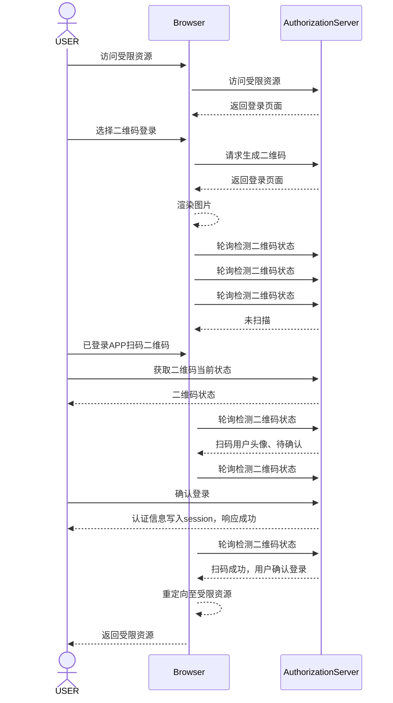
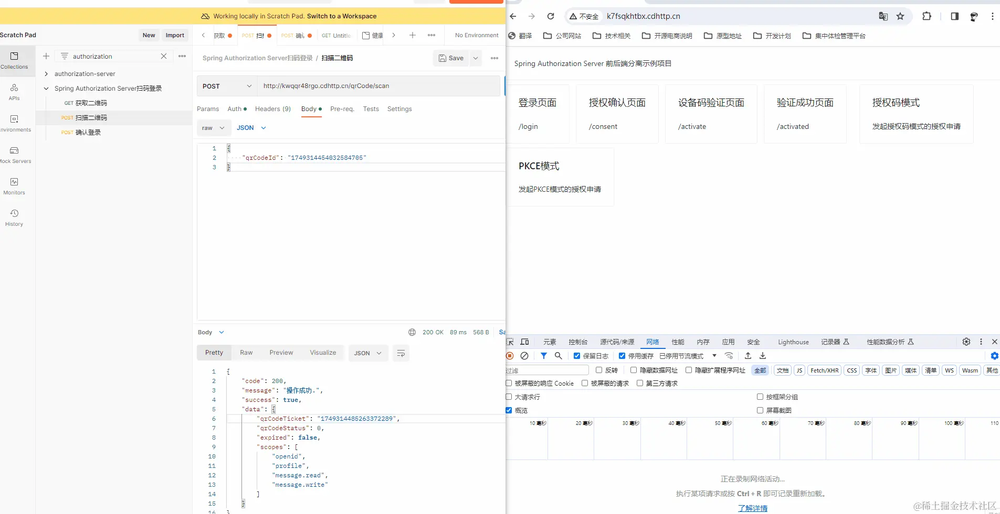

- [Spring Authorization Server入门 (二十) 实现二维码扫码登录](https://juejin.cn/post/7326546769981603866)

## 实现原理

- 打开网页，发起授权申请/未登录被重定向到登录页面
- 选择二维码登录，页面从后端请求二维码
- 页面渲染二维码图片，并轮询请求，获取二维码的状态
- 事先登录过APP的手机扫描二维码，然后APP请求服务器端的API接口，把用户认证信息传递到服务器中
- 后端收到APP的请求后更改二维码状态，并把用户认证信息写入session
- 页面得到扫码确认的响应，并跳转回之前未登录的地址

[Sequence Diagram Syntax](https://mermaid.js.org/syntax/sequenceDiagram.html)



在这个流程中 `用户认证信息写入session` 后前端在重定向时能获取到认证信息是因为现在的认证服务引入了`spring session data redis`依赖，并且在`application.yml`中配置了`server.servlet.session.cookie.domain: cdhttp.cn`属性(演示环境域名)，这里是指定spring session的顶级域名，在该域名下的子域名服务共享session，如果你是在开发阶段可以配置为`server.servlet.session.cookie.domain: 127.0.0.1`，这时候前端访问使用`127.0.0.1:5173`，认证服务使用`127.0.0.1:8080`，端口可以不一样，但是认证服务和前端必须使用同一域名。

## 二、代码实现
### 1. 后端实现
#### 1. 引入二维码依赖
```xml
<dependency>
    <groupId>com.google.zxing</groupId>
    <artifactId>core</artifactId>
    <version>3.3.0</version>
</dependency>
<dependency>
    <groupId>com.google.zxing</groupId>
    <artifactId>javase</artifactId>
    <version>3.3.0</version>
</dependency>
```

`hutool-captcha`改为`hutool-all`
```xml
<dependency>
    <groupId>cn.hutool</groupId>
    <artifactId>hutool-all</artifactId>
    <version>${hutool.version}</version>
</dependency>
```

#### 2. 添加二维码登录接口
提供四个接口，分别处理生成二维码、轮询、app扫码和app确认登录的逻辑。
```java 
package com.example.controller;

import com.example.model.Result;
import com.example.model.request.qrcode.QrCodeLoginConsentRequest;
import com.example.model.request.qrcode.QrCodeLoginScanRequest;
import com.example.model.response.qrcode.QrCodeGenerateResponse;
import com.example.model.response.qrcode.QrCodeLoginFetchResponse;
import com.example.model.response.qrcode.QrCodeLoginScanResponse;
import com.example.service.IQrCodeLoginService;
import lombok.AllArgsConstructor;
import org.springframework.web.bind.annotation.GetMapping;
import org.springframework.web.bind.annotation.PathVariable;
import org.springframework.web.bind.annotation.PostMapping;
import org.springframework.web.bind.annotation.RequestBody;
import org.springframework.web.bind.annotation.RequestMapping;
import org.springframework.web.bind.annotation.RestController;

/**
 * 二维码登录接口
 *
 * @author vains
 */
@RestController
@AllArgsConstructor
@RequestMapping("/qrCode")
public class QrCodeLoginController {

    private final IQrCodeLoginService iQrCodeLoginService;

    @GetMapping("/login/generateQrCode")
    public Result<QrCodeGenerateResponse> generateQrCode() {
        // 生成二维码
        return Result.success(iQrCodeLoginService.generateQrCode());
    }

    @GetMapping("/login/fetch/{qrCodeId}")
    public Result<QrCodeLoginFetchResponse> fetch(@PathVariable String qrCodeId) {
        // 轮询二维码状态
        return Result.success(iQrCodeLoginService.fetch(qrCodeId));
    }


    @PostMapping("/scan")
    public Result<QrCodeLoginScanResponse> scan(@RequestBody QrCodeLoginScanRequest loginScan) {
        // app 扫码二维码
        return Result.success(iQrCodeLoginService.scan(loginScan));
    }

    @PostMapping("/consent")
    public Result<String> consent(@RequestBody QrCodeLoginConsentRequest loginConsent) {

        // app 确认登录
        iQrCodeLoginService.consent(loginConsent);

        return Result.success();
    }

}
```

#### 3. yml中放行前端访问的接口
添加匹配规则`/qrCode/login/**`
```yml
custom:
  # 自定义认证配置
  security:
    # 登录页面路径
    login-url: http://k7fsqkhtbx.cdhttp.cn/login
    # 授权确认页面路径
    consent-page-uri: http://k7fsqkhtbx.cdhttp.cn/consent
    # 设备码验证页面
    device-activate-uri: http://k7fsqkhtbx.cdhttp.cn/activate
    # 设备码验证成功页面
    device-activated-uri: http://k7fsqkhtbx.cdhttp.cn/activated
    # 不需要认证的地址
    ignore-uri-list: assets/**, /webjars/**, /login, /getCaptcha, /getSmsCaptcha, /error, /oauth2/consent/parameters, /test03, /favicon.ico, /qrCode/login/**
```

#### 4. 编写二维码登录服务接口
编写登录service接口
```java
package com.example.service;

import com.example.model.request.qrcode.QrCodeLoginConsentRequest;
import com.example.model.request.qrcode.QrCodeLoginScanRequest;
import com.example.model.response.qrcode.QrCodeGenerateResponse;
import com.example.model.response.qrcode.QrCodeLoginFetchResponse;
import com.example.model.response.qrcode.QrCodeLoginScanResponse;

/**
 * 二维码登录服务接口
 *
 * @author vains
 */
public interface IQrCodeLoginService {

    /**
     * 生成二维码
     *
     * @return 二维码
     */
    QrCodeGenerateResponse generateQrCode();

    /**
     * 扫描二维码响应
     *
     * @param loginScan 二维码id
     * @return 二维码信息
     */
    QrCodeLoginScanResponse scan(QrCodeLoginScanRequest loginScan);

    /**
     * 二维码登录确认入参
     *
     * @param loginConsent 二维码id
     */
    void consent(QrCodeLoginConsentRequest loginConsent);

    /**
     * web端轮询二维码状态处理
     *
     * @param qrCodeId 二维码id
     * @return 二维码信息
     */
    QrCodeLoginFetchResponse fetch(String qrCodeId);

}
```

#### 5. 编写生成二维码响应类
生成二维码图片时返回二维码id和图片
```java
package com.example.model.response.qrcode;

import lombok.AllArgsConstructor;
import lombok.Data;
import lombok.NoArgsConstructor;

/**
 * 生成二维码响应
 *
 * @author vains
 */
@Data
@NoArgsConstructor
@AllArgsConstructor
public class QrCodeGenerateResponse {

    /**
     * 二维码id
     */
    private String qrCodeId;

    /**
     * 二维码base64值(这里响应一个链接好一些)
     */
    private String imageData;

}
```

#### 6. 编写web前端轮询二维码状态出参
前端根据二维码id轮询二维码状态时返回二维码状态，如果已扫描也会返回扫描者的头像、昵称。
```java
package com.example.model.response.qrcode;

import lombok.Data;

import java.util.Set;

/**
 * web前端轮询二维码状态出参
 *
 * @author vains
 */
@Data
public class QrCodeLoginFetchResponse {

    /**
     * 二维码状态
     * 0:待扫描，1:已扫描，2:已确认
     */
    private Integer qrCodeStatus;

    /**
     * 是否已过期
     */
    private Boolean expired;

    /**
     * 扫描人头像
     */
    private String avatarUrl;

    /**
     * 扫描人昵称
     */
    private String name;

    /**
     * 待确认scope
     */
    private Set<String> scopes;

    /**
     * 跳转登录之前请求的接口
     */
    private String beforeLoginRequestUri;

    /**
     * 跳转登录之前请求参数
     */
    private String beforeLoginQueryString;

}
```

#### 7. 编写扫描二维码入参
app扫描二维码时传入二维码id
```java
package com.example.model.request.qrcode;

import lombok.Data;

/**
 * 扫描二维码入参
 *
 * @author vains
 */
@Data
public class QrCodeLoginScanRequest {

    /**
     * 二维码id
     */
    private String qrCodeId;

}
```

#### 8. 编写二维码响应bean
扫描二维码时生成一个临时票据返回，同时返回scope和二维码状态。
```java
package com.example.model.response.qrcode;

import lombok.Data;

import java.util.Set;

/**
 * 扫描二维码响应bean
 *
 * @author vains
 */
@Data
public class QrCodeLoginScanResponse {

    /**
     * 扫描临时票据
     */
    private String qrCodeTicket;

    /**
     * 二维码状态
     */
    private Integer qrCodeStatus;

    /**
     * 是否已过期
     */
    private Boolean expired;

    /**
     * 待确认scope
     */
    private Set<String> scopes;

}
```

#### 9. 编写二维码登录确认登录入参类
确认登录时传入二维码id和上一步生成的临时票据防篡改。
```java
package com.example.model.request.qrcode;

import lombok.Data;

/**
 * 二维码登录确认入参
 *
 * @author vains
 */
@Data
public class QrCodeLoginConsentRequest {

    /**
     * 二维码id
     */
    private String qrCodeId;

    /**
     * 扫码二维码后产生的临时票据(仅一次有效)
     */
    private String qrCodeTicket;

}
```

#### 10. 编写二维码信息类
生成二维码时生成的数据bean，存入redis中，等到前端轮询或app端操作时使用。
```java
package com.example.model.qrcode;

import lombok.AllArgsConstructor;
import lombok.Builder;
import lombok.Data;
import lombok.NoArgsConstructor;

import java.time.LocalDateTime;
import java.util.Set;

/**
 * 二维码信息
 *
 * @author vains
 */
@Data
@Builder
@NoArgsConstructor
@AllArgsConstructor
public class QrCodeInfo {

    /**
     * 二维码id
     */
    private String qrCodeId;

    /**
     * 二维码状态
     * 0:待扫描，1:已扫描，2:已确认
     */
    private Integer qrCodeStatus;

    /**
     * 二维码过期时间
     */
    private LocalDateTime expiresTime;

    /**
     * 扫描人头像
     */
    private String avatarUrl;

    /**
     * 扫描人昵称
     */
    private String name;

    /**
     * 待确认的scope
     */
    private Set<String> scopes;

    /**
     * 跳转登录之前请求的接口
     */
    private String beforeLoginRequestUri;

    /**
     * 跳转登录之前请求参数
     */
    private String beforeLoginQueryString;

}
```

#### 11. 编写二维码登录接口实现
扫码登录实现，具体逻辑请看代码中的注释。
```java
package com.example.service.impl;

import cn.hutool.extra.qrcode.QrCodeUtil;
import cn.hutool.extra.qrcode.QrConfig;
import com.baomidou.mybatisplus.core.toolkit.IdWorker;
import com.example.entity.Oauth2BasicUser;
import com.example.model.qrcode.QrCodeInfo;
import com.example.model.request.qrcode.QrCodeLoginConsentRequest;
import com.example.model.request.qrcode.QrCodeLoginScanRequest;
import com.example.model.response.qrcode.QrCodeGenerateResponse;
import com.example.model.response.qrcode.QrCodeLoginFetchResponse;
import com.example.model.response.qrcode.QrCodeLoginScanResponse;
import com.example.property.CustomSecurityProperties;
import com.example.service.IQrCodeLoginService;
import com.example.support.RedisOperator;
import jakarta.servlet.http.HttpServletRequest;
import jakarta.servlet.http.HttpServletResponse;
import jakarta.servlet.http.HttpSession;
import lombok.RequiredArgsConstructor;
import lombok.extern.slf4j.Slf4j;
import org.springframework.security.authentication.InsufficientAuthenticationException;
import org.springframework.security.authentication.UsernamePasswordAuthenticationToken;
import org.springframework.security.core.Authentication;
import org.springframework.security.core.context.SecurityContextHolder;
import org.springframework.security.core.context.SecurityContextImpl;
import org.springframework.security.oauth2.core.OAuth2AuthenticationException;
import org.springframework.security.oauth2.core.OAuth2Error;
import org.springframework.security.oauth2.core.OAuth2ErrorCodes;
import org.springframework.security.oauth2.server.authorization.OAuth2Authorization;
import org.springframework.security.oauth2.server.authorization.OAuth2TokenType;
import org.springframework.security.oauth2.server.resource.authentication.JwtAuthenticationToken;
import org.springframework.security.web.savedrequest.DefaultSavedRequest;
import org.springframework.security.web.savedrequest.HttpSessionRequestCache;
import org.springframework.security.web.savedrequest.RequestCache;
import org.springframework.security.web.util.UrlUtils;
import org.springframework.stereotype.Service;
import org.springframework.util.Assert;
import org.springframework.util.ObjectUtils;
import org.springframework.web.context.request.RequestAttributes;
import org.springframework.web.context.request.RequestContextHolder;
import org.springframework.web.context.request.ServletRequestAttributes;

import java.security.Principal;
import java.time.LocalDateTime;
import java.util.Objects;
import java.util.Set;

import static org.springframework.security.web.context.HttpSessionSecurityContextRepository.SPRING_SECURITY_CONTEXT_KEY;

/**
 * 二维码登录接口实现
 *
 * @author vains
 */
@Slf4j
@Service
@RequiredArgsConstructor
public class QrCodeLoginServiceImpl implements IQrCodeLoginService {

	private final RedisOperator<QrCodeInfo> redisOperator;

	private final RedisOperator<String> stringRedisOperator;

	private final CustomSecurityProperties customSecurityProperties;

	private final RedisOAuth2AuthorizationService authorizationService;

	private final RedisOperator<UsernamePasswordAuthenticationToken> authenticationRedisOperator;

	/**
     * 过期时间
     */
    private final long QR_CODE_INFO_TIMEOUT = 60 * 10;

	/**
     * 二维码信息前缀
     */
    private final String QR_CODE_PREV = "login:qrcode:";

	private final RequestCache requestCache = new HttpSessionRequestCache();

	@Override
    public QrCodeGenerateResponse generateQrCode() {
		// 生成二维码唯一id
		String qrCodeId = IdWorker.getIdStr();
		// 生成二维码并转为base64
		String pngQrCode = QrCodeUtil.generateAsBase64(qrCodeId, new QrConfig(), "png");
		QrCodeInfo info = QrCodeInfo.builder()
                .qrCodeId(qrCodeId)
                // 待扫描状态
                .qrCodeStatus(0)
                // 1分钟后过期
                .expiresTime(LocalDateTime.now().plusMinutes(2L))
                .build();

		// 获取当前request
		RequestAttributes requestAttributes = RequestContextHolder.getRequestAttributes();
		if (requestAttributes != null) {
			// 获取当前session
			HttpServletRequest request = ((ServletRequestAttributes) requestAttributes).getRequest();
			HttpServletResponse response = ((ServletRequestAttributes) requestAttributes).getResponse();
			DefaultSavedRequest savedRequest = (DefaultSavedRequest) this.requestCache.getRequest(request, response);
			if (savedRequest != null) {
				if (!UrlUtils.isAbsoluteUrl(customSecurityProperties.getLoginUrl())) {
					// 获取查询参数与请求路径
					String queryString = savedRequest.getQueryString();
					String requestUri = savedRequest.getRequestURI();
					// 前后端不分离根据请求路径和请求参数跳转
					info.setBeforeLoginRequestUri(requestUri);
					info.setBeforeLoginQueryString(queryString);
				}

				// 获取跳转登录之前访问url的query parameter
				String[] scopes = savedRequest.getParameterValues("scope");
				if (!ObjectUtils.isEmpty(scopes)) {
					// 不为空获取第一个并设置进二维码信息中
					info.setScopes(Set.of(scopes[0].split(" ")));
				}
				// 前端可以根据scope显示要获取的信息，或固定显示要获取的信息
			}
		}

		// 因为上边设置的过期时间是2分钟，这里设置10分钟过期，可根据业务自行调整过期时间
		redisOperator.set(QR_CODE_PREV + qrCodeId, info, QR_CODE_INFO_TIMEOUT);
		return new QrCodeGenerateResponse(qrCodeId, pngQrCode);
	}

	@Override
    public QrCodeLoginScanResponse scan(QrCodeLoginScanRequest loginScan) {
		// 应该用validation的
		Assert.hasLength(loginScan.getQrCodeId(), "二维码Id不能为空.");

		// 校验二维码状态
		QrCodeInfo info = redisOperator.get(QR_CODE_PREV + loginScan.getQrCodeId());
		if (info == null) {

			throw new RuntimeException("无效二维码.");
		}

		// 验证状态
		if (!Objects.equals(info.getQrCodeStatus(), 0)) {

			throw new RuntimeException("二维码已被其他人扫描，无法重复扫描.");
		}

		// 二维码是否过期
		boolean qrCodeExpire = info.getExpiresTime().isBefore(LocalDateTime.now());
		if (qrCodeExpire) {
			throw new RuntimeException("二维码已过期.");
		}

		QrCodeLoginScanResponse loginScanResponse = new QrCodeLoginScanResponse();

		// 获取登录用户信息
		OAuth2Authorization oAuth2Authorization = this.getOAuth2Authorization();
		if (oAuth2Authorization == null) {
			throw new OAuth2AuthenticationException(
					new OAuth2Error(OAuth2ErrorCodes.INVALID_TOKEN, "登录已过期.", null));
		}
		// app端使用密码模式、手机认证登录，不使用三方登录的情况
		UsernamePasswordAuthenticationToken usernamePasswordAuthenticationToken =
                oAuth2Authorization.getAttribute(Principal.class.getName());
		if (usernamePasswordAuthenticationToken.getPrincipal() instanceof Oauth2BasicUser basicUser) {
			// 生成临时票据
			String qrCodeTicket = IdWorker.getIdStr();
			// 根据二维码id和临时票据存储，确认时根据临时票据认证
			String redisQrCodeTicketKey = String.format("%s%s:%s", QR_CODE_PREV, loginScan.getQrCodeId(), qrCodeTicket);
			stringRedisOperator.set(redisQrCodeTicketKey, qrCodeTicket, QR_CODE_INFO_TIMEOUT);

			// 更新二维码信息的状态
			info.setQrCodeStatus(1);
			info.setName(basicUser.getName());
			info.setAvatarUrl(basicUser.getAvatarUrl());
			redisOperator.set(QR_CODE_PREV + loginScan.getQrCodeId(), info, QR_CODE_INFO_TIMEOUT);

			// 封装响应
			loginScanResponse.setQrCodeTicket(qrCodeTicket);
			loginScanResponse.setQrCodeStatus(0);
			loginScanResponse.setExpired(Boolean.FALSE);
			loginScanResponse.setScopes(info.getScopes());
		}

		// 其它登录方式暂不处理
		return loginScanResponse;
	}

	@Override
    public void consent(QrCodeLoginConsentRequest loginConsent) {
		// 应该用validation的
		Assert.hasLength(loginConsent.getQrCodeId(), "二维码Id不能为空.");

		// 校验二维码状态
		QrCodeInfo info = redisOperator.get(QR_CODE_PREV + loginConsent.getQrCodeId());
		if (info == null) {
			throw new RuntimeException("无效二维码或二维码已过期.");
		}

		// 验证临时票据
		String qrCodeTicketKey =
                String.format("%s%s:%s", QR_CODE_PREV, loginConsent.getQrCodeId(), loginConsent.getQrCodeTicket());
		String redisQrCodeTicket = stringRedisOperator.get(qrCodeTicketKey);
		if (!Objects.equals(redisQrCodeTicket, loginConsent.getQrCodeTicket())) {
			// 临时票据有误、临时票据失效(超过redis存活时间后确认)、redis数据有误
			if (log.isDebugEnabled()) {
				log.debug("临时票据有误、临时票据失效(超过redis存活时间后确认)、redis数据有误.");
			}
			throw new RuntimeException("登录确认失败，请重新扫描.");
		}
		// 使用后删除
		stringRedisOperator.delete(qrCodeTicketKey);

		// 获取登录用户信息
		OAuth2Authorization authorization = this.getOAuth2Authorization();
		if (authorization == null) {
			throw new OAuth2AuthenticationException(
					new OAuth2Error(OAuth2ErrorCodes.INVALID_TOKEN, "登录已过期.", null));
		}

		// app端使用密码模式、手机认证登录，不使用三方登录的情况
		UsernamePasswordAuthenticationToken authenticationToken = authorization.getAttribute(Principal.class.getName());

		// 根据二维码id存储用户信息
		String redisUserinfoKey = String.format("%s%s:%s", QR_CODE_PREV, "userinfo", loginConsent.getQrCodeId());
		// 存储用户信息
		authenticationRedisOperator.set(redisUserinfoKey, authenticationToken, QR_CODE_INFO_TIMEOUT);

		// 更新二维码信息的状态
		info.setQrCodeStatus(2);
		redisOperator.set(QR_CODE_PREV + loginConsent.getQrCodeId(), info, QR_CODE_INFO_TIMEOUT);
	}

	@Override
    public QrCodeLoginFetchResponse fetch(String qrCodeId) {
		// 校验二维码状态
		QrCodeInfo info = redisOperator.get(QR_CODE_PREV + qrCodeId);
		if (info == null) {
			throw new RuntimeException("无效二维码或二维码已过期.");
		}

		QrCodeLoginFetchResponse loginFetchResponse = new QrCodeLoginFetchResponse();
		// 设置二维码是否过期、状态
		loginFetchResponse.setQrCodeStatus(info.getQrCodeStatus());
		loginFetchResponse.setExpired(info.getExpiresTime().isBefore(LocalDateTime.now()));

		if (!Objects.equals(info.getQrCodeStatus(), 0)) {
			// 如果是已扫描/已确认
			loginFetchResponse.setName(info.getName());
			loginFetchResponse.setAvatarUrl(info.getAvatarUrl());
		}

		// 如果是已确认，将之前扫码确认的用户信息放入当前session中
		if (Objects.equals(info.getQrCodeStatus(), 2)) {

			// 根据二维码id从redis获取用户信息
			String redisUserinfoKey = String.format("%s%s:%s", QR_CODE_PREV, "userinfo", qrCodeId);
			UsernamePasswordAuthenticationToken authenticationToken = authenticationRedisOperator.get(redisUserinfoKey);
			if (authenticationToken != null) {
				// 获取当前request
				RequestAttributes requestAttributes = RequestContextHolder.getRequestAttributes();
				if (requestAttributes == null) {
					throw new RuntimeException("获取当前Request失败.");
				}
				// 获取当前session
				HttpServletRequest request = ((ServletRequestAttributes) requestAttributes).getRequest();
				HttpSession session = request.getSession(Boolean.FALSE);
				if (session != null) {
					// 获取到认证信息后将之前扫码确认的用户信息放入当前session中。
					session.setAttribute(SPRING_SECURITY_CONTEXT_KEY, new SecurityContextImpl(authenticationToken));

					// 操作成功后移除缓存
					redisOperator.delete(QR_CODE_PREV + qrCodeId);
					// 删除用户信息，防止其它人重放请求
					authenticationRedisOperator.delete(redisUserinfoKey);

					// 填充二维码数据，设置跳转到登录之前的请求路径、查询参数和是否授权申请请求
					loginFetchResponse.setBeforeLoginRequestUri(info.getBeforeLoginRequestUri());
					loginFetchResponse.setBeforeLoginQueryString(info.getBeforeLoginQueryString());
				}
			} else {
				throw new RuntimeException("获取登录确认用户信息失败.");
			}
		}

		return loginFetchResponse;
	}

	/**
     * 获取当前使用token对应的认证信息
     *
     * @return oauth2认证信息
     */
    private OAuth2Authorization getOAuth2Authorization() {
		// 校验登录状态
		Authentication authentication = SecurityContextHolder.getContext().getAuthentication();
		if (authentication == null) {
			throw new InsufficientAuthenticationException("未登录.");
		}
		if (authentication instanceof JwtAuthenticationToken jwtToken) {
			// jwt处理
			String tokenValue = jwtToken.getToken().getTokenValue();
			// 根据token获取授权登录时的认证信息(登录用户)
			return authorizationService.findByToken(tokenValue, OAuth2TokenType.ACCESS_TOKEN);
		}
		return null;
	}

}
```

到此后端部分就完成了，全局根据二维码id将整个流程串联起来，前端轮询、app端扫码和登录确认都是通过二维码id来的，中间借助redis来缓存二维码的信息，以确保每个端都可以获取到二维码信息，这样就算集群部署也不影响。

现在默认是将app端当做oauth2登录的，扫码和确认登录都是通过`access_token`来获取认证信息的，根据请求的token获取oauth2流程中'登录'生成的认证信息。

### 2. 前端实现
#### 1. 编写二维码登录请求api
编写`src/api/QrCodeLogin.ts`文件
```ts
import loginRequest from '../util/http/LoginRequest'

/**
 * 生成二维码
 */
export function generateQrCode() {
    return loginRequest.get<any>({
        url: '/qrCode/login/generateQrCode'
    })
}

/**
 * 获取二维码信息
 * @param qrCodeId 二维码id
 */
export function fetch(qrCodeId: string) {
    return loginRequest.get<any>({
        url: `/qrCode/login/fetch/${qrCodeId}`
    })
}
```

#### 2. 在登录页面添加二维码登录入口
前端页轮询时如果发现二维码状态变为确认登录则会重定向到之前被拦截后跳转到登录的地址，例如：访问`/a`发现未登录然后跳转到登录`/login`，之后扫码登录流程走完以后会重定向至`/a`。
```vue
<script setup lang="ts">
import { ref } from 'vue'
import router from '../../router'
import { getQueryString } from '@/util/GlobalUtils'
import { generateQrCode, fetch } from '@/api/QrCodeLogin'
import { type CountdownProps, createDiscreteApi } from 'naive-ui'
import {
  getImageCaptcha,
  getSmsCaptchaByPhone,
  loginSubmit
} from '@/api/Login'

const { message } = createDiscreteApi(['message'])

// 登录按钮加载状态
const loading = ref(false)

// 定义登录提交的对象
const loginModel = ref({
  code: '',
  username: '',
  password: '',
  loginType: '',
  captchaId: ''
})

// 图形验证码的base64数据
let captchaImage = ref('')
// 图形验证码的值
let captchaCode = ''
// 是否开始倒计时
const counterActive = ref(false)
// 是否显示三方登录
const showThirdLogin = ref(true)

// 定义二维码信息的对象
const qrCodeInfo = ref({
  qrCodeStatus: 0,
  expired: false,
  avatarUrl: '',
  name: '',
  scopes: []
})

// 生成二维码响应数据
const getQrCodeInfo = ref({
  qrCodeId: '',
  imageData: ''
})

// 是否自动提交授权确认(二维码登录自动提交)
const autoConsentKey: string = 'autoConsent'

/**
 * 获取图形验证码
 */
const getCaptcha = () => {
  getImageCaptcha()
    .then((result: any) => {
      if (result.success) {
        captchaCode = result.data.code
        captchaImage.value = result.data.imageData
        loginModel.value.captchaId = result.data.captchaId
      } else {
        message.warning(result.message)
      }
    })
    .catch((e: any) => {
      message.warning(`获取图形验证码失败：${e.message}`)
    })
}

/**
 * 提交登录表单
 * @param type 登录类型，passwordLogin是密码模式，smsCaptcha短信登录
 */
const submitLogin = (type: string) => {
  loading.value = true
  loginModel.value.loginType = type
  loginSubmit(loginModel.value)
    .then((result: any) => {
      if (result.success) {
        // 移除自动提交缓存
        localStorage.removeItem(autoConsentKey)
        // message.info(`登录成功`)
        let target = getQueryString('target')
        if (target) {
          window.location.href = target
        } else {
          // 跳转到首页
          router.push({ path: '/' })
        }
      } else {
        message.warning(result.message)
      }
    })
    .catch((e: any) => {
      message.warning(`登录失败：${e.message}`)
    })
    .finally(() => {
      loading.value = false
    })
}

/**
 * 获取短信验证码
 */
const getSmsCaptcha = () => {
  if (!loginModel.value.username) {
    message.warning('请先输入手机号.')
    return
  }
  if (!loginModel.value.code) {
    message.warning('请先输入验证码.')
    return
  }
  if (loginModel.value.code !== captchaCode) {
    message.warning('验证码错误.')
    return
  }
  getSmsCaptchaByPhone({ phone: loginModel.value.username })
    .then((result: any) => {
      if (result.success) {
        message.info(`获取短信验证码成功，固定为：${result.data}`)
        counterActive.value = true
      } else {
        message.warning(result.message)
      }
    })
    .catch((e: any) => {
      message.warning(`获取短信验证码失败：${e.message}`)
    })
}

/**
 * 切换时更新验证码
 * @param name tab的名字
 */
const handleUpdateValue = (name: string) => {
  // 二维码登录时隐藏三方登录
  showThirdLogin.value = name !== 'qrcode'
  if (!showThirdLogin.value) {
    refreshQrCode()
  } else {
    getCaptcha()
  }
}

/**
 * 生成二维码
 */
const refreshQrCode = () => {
  generateQrCode()
    .then((r) => {
      getQrCodeInfo.value.qrCodeId = r.data.qrCodeId
      getQrCodeInfo.value.imageData = r.data.imageData
      // 开始轮询获取二维码信息
      fetchQrCodeInfo(r.data.qrCodeId);
    })
    .catch((e: any) => {
      message.warning(`生成二维码失败：${e.message}`)
    })
}

/**
 * 根据二维码id轮询二维码信息
 * @param qrCodeId 二维码id
 */
const fetchQrCodeInfo = (qrCodeId: string) => {
  fetch(qrCodeId)
    .then((r: any) => {
      if (r.success) {
        qrCodeInfo.value = r.data
        if (qrCodeInfo.value.qrCodeStatus !== 0 && qrCodeInfo.value.avatarUrl) {
          // 只要不是待扫描并且头像不为空
          getQrCodeInfo.value.imageData = qrCodeInfo.value.avatarUrl
        }

        if (r.data.qrCodeStatus !== 2 && !qrCodeInfo.value.expired) {
          if (!showThirdLogin.value) {
            // 显示三方登录代表不是二维码登录，不轮询；否则继续轮询
            // 1秒后重复调用
            setTimeout(() => {
              fetchQrCodeInfo(qrCodeId)
            }, 1000);
          }
          return
        }
        if (qrCodeInfo.value.expired) {
          // 二维码过期
          return
        }
        if (qrCodeInfo.value.qrCodeStatus === 2) {
          // 已确认
          let href = getQueryString('target')
          if (href) {
            // 确认后将地址重定向
            window.location.href = href
          } else {
            // 跳转到首页
            router.push({ path: '/' })
          }
        }
      } else {
        message.warning(r.message)
      }
    })
    .catch((e: any) => {
      message.warning(`获取二维码信息失败：${e.message || e.statusText}`)
    })
}

/**
 * 倒计时结束
 */
const onFinish = () => {
  counterActive.value = false
}

/**
 * 倒计时显示内容
 */
const renderCountdown: CountdownProps['render'] = ({ hours, minutes, seconds }) => {
  return `${seconds}`
}

/**
 * 根据类型发起OAuth2授权申请
 * @param type 三方OAuth2登录提供商类型
 */
const thirdLogin = (type: string) => {
  window.location.href = `${import.meta.env.VITE_OAUTH_ISSUER}/oauth2/authorization/${type}`
}

getCaptcha()
</script>

<template>
  <header>
    

    <div class="wrapper">
      <HelloWorld msg="统一认证平台" />
    </div>
  </header>

  <main>
    <n-card title="">
      <n-tabs default-value="signin" size="large" justify-content="space-evenly" @update:value="handleUpdateValue">
        <n-tab-pane name="signin" tab="账号登录">
          <n-form>
            <n-form-item-row label="用户名">
              <n-input v-model:value="loginModel.username" placeholder="手机号 / 邮箱" />
            </n-form-item-row>
            <n-form-item-row label="密码">
              <n-input v-model:value="loginModel.password" type="password" show-password-on="mousedown"
                placeholder="密码" />
            </n-form-item-row>
            <n-form-item-row label="验证码">
              <n-input-group>
                <n-input v-model:value="loginModel.code" placeholder="请输入验证码" />
                <n-image @click="getCaptcha" width="130" height="34" :src="captchaImage" preview-disabled />
              </n-input-group>
            </n-form-item-row>
          </n-form>
          <n-button type="info" :loading="loading" @click="submitLogin('passwordLogin')" block strong>
            登录
          </n-button>
        </n-tab-pane>
        <n-tab-pane name="signup" tab="短信登录">
          <n-form>
            <n-form-item-row label="手机号">
              <n-input v-model:value="loginModel.username" placeholder="手机号 / 邮箱" />
            </n-form-item-row>
            <n-form-item-row label="验证码">
              <n-input-group>
                <n-input v-model:value="loginModel.code" placeholder="请输入验证码" />
                <n-image @click="getCaptcha" width="130" height="34" :src="captchaImage" preview-disabled />
              </n-input-group>
            </n-form-item-row>
            <n-form-item-row label="验证码">
              <n-input-group>
                <n-input v-model:value="loginModel.password" placeholder="请输入验证码" />
                <n-button type="info" @click="getSmsCaptcha" style="width: 130px" :disabled="counterActive">
                  获取验证码
                  <span v-if="counterActive">
                    (
                    <n-countdown :render="renderCountdown" :on-finish="onFinish" :duration="59 * 1000"
                      :active="counterActive" />
                    )</span>
                </n-button>
              </n-input-group>
            </n-form-item-row>
          </n-form>
          <n-button type="info" :loading="loading" @click="submitLogin('smsCaptcha')" block strong>
            登录
          </n-button>
        </n-tab-pane>
        <n-tab-pane name="qrcode" tab="扫码登录" style="text-align: center">
          <div style="margin: 5.305px">
            <n-image width="300" :src="getQrCodeInfo.imageData" preview-disabled />
          </div>
        </n-tab-pane>
      </n-tabs>
      <n-divider style="font-size: 80%; color: #909399">
        {{ showThirdLogin ? '其它登录方式' : '使用app扫描二维码登录' }}
      </n-divider>
      <div class="other_login_icon" v-if="showThirdLogin">
        <IconGitee :size="32" @click="thirdLogin('gitee')" class="icon_item" />
        
        
      </div>
    </n-card>
  </main>
</template>

<style scoped>
.other_login_icon {
  display: flex;
  align-items: center;
  justify-content: center;
  gap: 0 10px;
  position: relative;
  margin-top: -5px;
}

.icon_item {
  cursor: pointer;
}

header {
  line-height: 1.5;
}

.logo {
  display: block;
  margin: 0 auto 2rem;
}

@media (min-width: 1024px) {
  header {
    display: flex;
    place-items: center;
    padding-right: calc(var(--section-gap) / 2);
  }

  .logo {
    margin: 0 2rem 0 0;
  }

  header .wrapper {
    display: flex;
    place-items: flex-start;
    flex-wrap: wrap;
  }
}
</style>
```

具体修改内容请看代码仓库[qrcode_login](https://gitee.com/vains-Sofia/authorization-example/tree/qrcode_login/)分支的[二维码登录前端登录页面实现](https://gitee.com/vains-Sofia/authorization-example/commit/8552c2c19d0040d8081b5da9fb0dfd31169c274b)。
## 三、效果


```shell
# 1. 先获取一个Token备用

# 2. 浏览器访问登录页，切换到扫码登录页签
http://127.0.0.1:5173/login

# 3. F12 打开控制台复制二维码的ID 1760855300433031170

# 4. 携带二维码ID调用扫描二维码接口 (需携带Bearer Token)
# POST http://127.0.0.1:8080/qrCode/scan

# 5. 携带二维码ID和扫描返回的ticket调用确认登录接口 (需携带Bearer Token)
# POST http://127.0.0.1:8080/qrCode/consent

```

扫码登录是使用【一台已经登录系统账号的设备】来扫描一个新的登录页面，所以需要提前准备一个Token，进行后面的操作

## 四、附录
代码仓库：[Gitee](https://gitee.com/vains-Sofia/authorization-example)、[Github](https://github.com/vains-Sofia/authorization-example)

## 五、参考资料
- [SpringBoot二维码登录(中)](https://www.cnblogs.com/GoodHelper/p/8643071.html)
- [反向工程解析QQ扫码登录的OAuth2流程](https://blog.51cto.com/solarboy/2154188)
- [聊一聊二维码扫描登录原理](https://juejin.cn/post/6844904111398191117)
