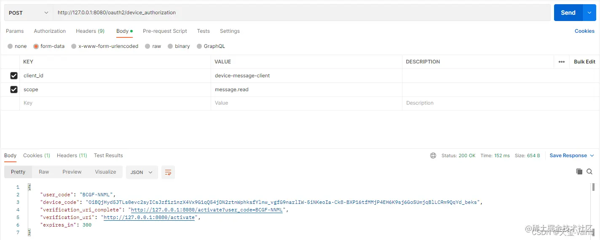
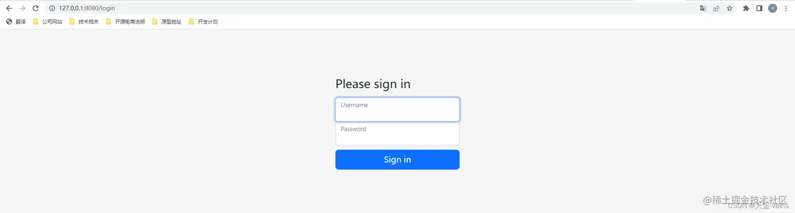
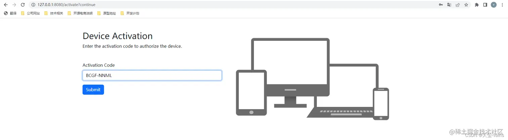
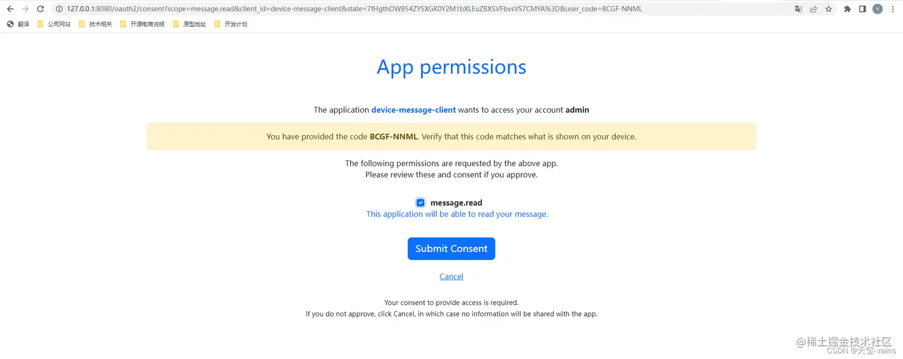
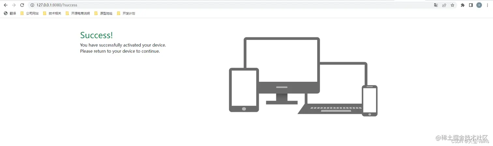
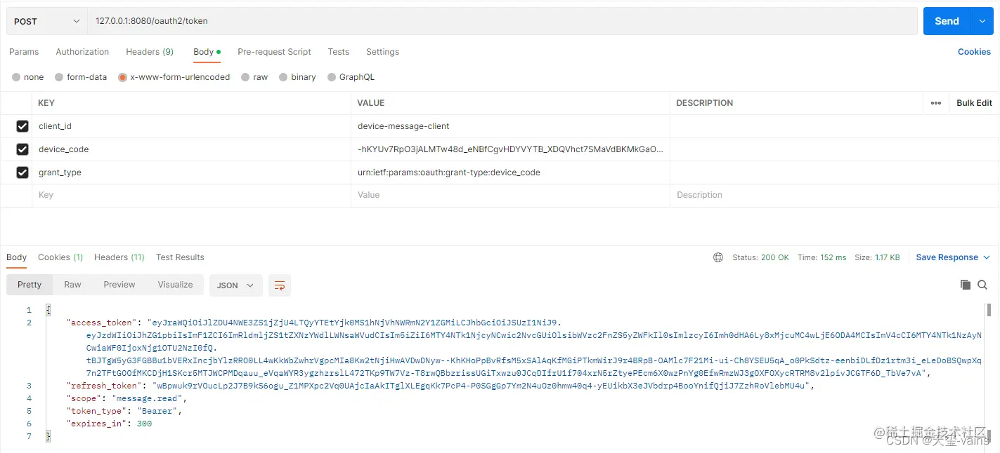
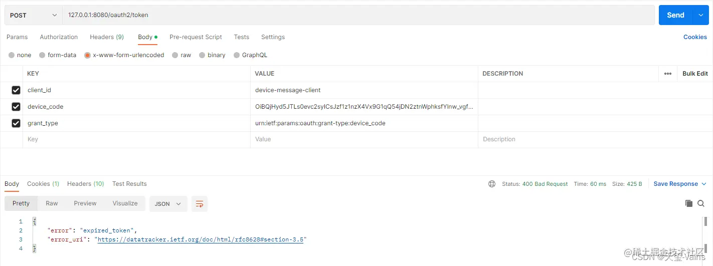
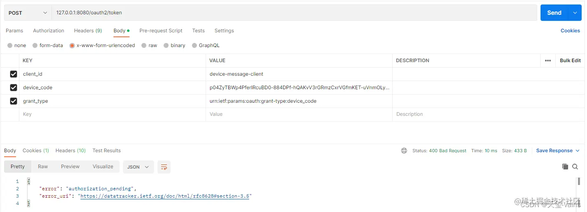

- [Spring Authorization Server入门 (四) 自定义设备码授权](https://juejin.cn/post/7241101553712283707)

## 一、代码集成
添加一个authorization包，文件都放在该包下，代码参考[官方示例](https://github.com/spring-projects/spring-authorization-server/blob/main/samples/demo-authorizationserver)

### 1. 添加DeviceClientAuthenticationToken
```java
package com.example.authorization;

import java.util.Map;

import org.springframework.lang.Nullable;
import org.springframework.security.core.Transient;
import org.springframework.security.oauth2.core.ClientAuthenticationMethod;
import org.springframework.security.oauth2.server.authorization.authentication.OAuth2ClientAuthenticationToken;
import org.springframework.security.oauth2.server.authorization.client.RegisteredClient;

/**
 * 设备码模式token
 *
 * @author Joe Grandja
 * @author Steve Riesenberg
 * @since 1.1
 */
@Transient
public class DeviceClientAuthenticationToken extends OAuth2ClientAuthenticationToken {

    public DeviceClientAuthenticationToken(String clientId, ClientAuthenticationMethod clientAuthenticationMethod,
                                           @Nullable Object credentials, @Nullable Map<String, Object> additionalParameters) {
        super(clientId, clientAuthenticationMethod, credentials, additionalParameters);
    }

    public DeviceClientAuthenticationToken(RegisteredClient registeredClient, ClientAuthenticationMethod clientAuthenticationMethod,
                                           @Nullable Object credentials) {
        super(registeredClient, clientAuthenticationMethod, credentials);
    }

}
```

### 2. 添加DeviceClientAuthenticationConverter
```java
package com.example.authorization;

import jakarta.servlet.http.HttpServletRequest;

import org.springframework.http.HttpMethod;
import org.springframework.lang.Nullable;
import org.springframework.security.core.Authentication;
import org.springframework.security.oauth2.core.AuthorizationGrantType;
import org.springframework.security.oauth2.core.ClientAuthenticationMethod;
import org.springframework.security.oauth2.core.OAuth2AuthenticationException;
import org.springframework.security.oauth2.core.OAuth2ErrorCodes;
import org.springframework.security.oauth2.core.endpoint.OAuth2ParameterNames;
import org.springframework.security.web.authentication.AuthenticationConverter;
import org.springframework.security.web.util.matcher.AndRequestMatcher;
import org.springframework.security.web.util.matcher.AntPathRequestMatcher;
import org.springframework.security.web.util.matcher.RequestMatcher;
import org.springframework.util.StringUtils;

/**
 * 获取请求中参数转化为DeviceClientAuthenticationToken
 *
 * @author Joe Grandja
 * @author Steve Riesenberg
 * @since 1.1
 */
public final class DeviceClientAuthenticationConverter implements AuthenticationConverter {
    private final RequestMatcher deviceAuthorizationRequestMatcher;
    private final RequestMatcher deviceAccessTokenRequestMatcher;

    public DeviceClientAuthenticationConverter(String deviceAuthorizationEndpointUri) {
        RequestMatcher clientIdParameterMatcher = request ->
                request.getParameter(OAuth2ParameterNames.CLIENT_ID) != null;
        this.deviceAuthorizationRequestMatcher = new AndRequestMatcher(
                new AntPathRequestMatcher(
                        deviceAuthorizationEndpointUri, HttpMethod.POST.name()),
                clientIdParameterMatcher);
        this.deviceAccessTokenRequestMatcher = request ->
                AuthorizationGrantType.DEVICE_CODE.getValue().equals(request.getParameter(OAuth2ParameterNames.GRANT_TYPE)) &&
                        request.getParameter(OAuth2ParameterNames.DEVICE_CODE) != null &&
                        request.getParameter(OAuth2ParameterNames.CLIENT_ID) != null;
    }

    @Nullable
    @Override
    public Authentication convert(HttpServletRequest request) {
        if (!this.deviceAuthorizationRequestMatcher.matches(request) &&
                !this.deviceAccessTokenRequestMatcher.matches(request)) {
            return null;
        }

        // client_id (REQUIRED)
        String clientId = request.getParameter(OAuth2ParameterNames.CLIENT_ID);
        if (!StringUtils.hasText(clientId) ||
                request.getParameterValues(OAuth2ParameterNames.CLIENT_ID).length != 1) {
            throw new OAuth2AuthenticationException(OAuth2ErrorCodes.INVALID_REQUEST);
        }

        return new DeviceClientAuthenticationToken(clientId, ClientAuthenticationMethod.NONE, null, null);
    }

}
```

### 3. 添加DeviceClientAuthenticationProvider
```java
package com.example.authorization;

import lombok.RequiredArgsConstructor;
import lombok.extern.slf4j.Slf4j;
import org.springframework.security.authentication.AuthenticationProvider;
import org.springframework.security.core.Authentication;
import org.springframework.security.core.AuthenticationException;
import org.springframework.security.oauth2.core.ClientAuthenticationMethod;
import org.springframework.security.oauth2.core.OAuth2AuthenticationException;
import org.springframework.security.oauth2.core.OAuth2Error;
import org.springframework.security.oauth2.core.OAuth2ErrorCodes;
import org.springframework.security.oauth2.core.endpoint.OAuth2ParameterNames;
import org.springframework.security.oauth2.server.authorization.client.RegisteredClient;
import org.springframework.security.oauth2.server.authorization.client.RegisteredClientRepository;
import org.springframework.security.oauth2.server.authorization.web.OAuth2ClientAuthenticationFilter;

/**
 * 设备码认证提供者
 *
 * @author Joe Grandja
 * @author Steve Riesenberg
 * @author vains
 * @since 1.1
 * @see DeviceClientAuthenticationToken
 * @see DeviceClientAuthenticationConverter
 * @see OAuth2ClientAuthenticationFilter
 */
@Slf4j
@RequiredArgsConstructor
public final class DeviceClientAuthenticationProvider implements AuthenticationProvider {

    private final RegisteredClientRepository registeredClientRepository;

    /**
     * 异常说明地址
     */
    private static final String ERROR_URI = "https://datatracker.ietf.org/doc/html/rfc6749#section-3.2.1";


    @Override
    public Authentication authenticate(Authentication authentication) throws AuthenticationException {
        // 执行时肯定是设备码流程
        DeviceClientAuthenticationToken deviceClientAuthentication =
                (DeviceClientAuthenticationToken) authentication;

        // 只支持公共客户端
        if (!ClientAuthenticationMethod.NONE.equals(deviceClientAuthentication.getClientAuthenticationMethod())) {
            return null;
        }

        // 获取客户端id并查询
        String clientId = deviceClientAuthentication.getPrincipal().toString();
        RegisteredClient registeredClient = this.registeredClientRepository.findByClientId(clientId);
        if (registeredClient == null) {
            throwInvalidClient(OAuth2ParameterNames.CLIENT_ID);
        }

        if (log.isTraceEnabled()) {
            log.trace("Retrieved registered client");
        }

        // 校验客户端
        if (!registeredClient.getClientAuthenticationMethods().contains(
                deviceClientAuthentication.getClientAuthenticationMethod())) {
            throwInvalidClient("authentication_method");
        }

        if (log.isTraceEnabled()) {
            log.trace("Validated device client authentication parameters");
        }

        if (log.isTraceEnabled()) {
            log.trace("Authenticated device client");
        }

        return new DeviceClientAuthenticationToken(registeredClient,
                deviceClientAuthentication.getClientAuthenticationMethod(), null);
    }

    @Override
    public boolean supports(Class<?> authentication) {
        // 只处理设备码请求
        return DeviceClientAuthenticationToken.class.isAssignableFrom(authentication);
    }

    private static void throwInvalidClient(String parameterName) {
        OAuth2Error error = new OAuth2Error(
                OAuth2ErrorCodes.INVALID_CLIENT,
                "Device client authentication failed: " + parameterName,
                ERROR_URI
        );
        throw new OAuth2AuthenticationException(error);
    }

}
```

### 4. 在登录页面同路径下添加device-activate.html
```html
<!DOCTYPE html>
<html lang="en" xmlns="http://www.w3.org/1999/xhtml" xmlns:th="https://www.thymeleaf.org">
<head>
    <meta charset="utf-8" />
    <meta name="viewport" content="width=device-width, initial-scale=1">
    <title>Spring Authorization Server sample</title>
    <link rel="stylesheet" href="/webjars/bootstrap/css/bootstrap.css" th:href="@{/webjars/bootstrap/css/bootstrap.css}" />
</head>
<body>
<div class="container">
    <div class="row py-5">
        <div class="col-md-5">
            <h2>Device Activation</h2>
            <p>Enter the activation code to authorize the device.</p>
            <div class="mt-5">
                <form th:action="@{/oauth2/device_verification}" method="post">
                    <div class="mb-3">
                        <label for="user_code" class="form-label">Activation Code</label>
                        <input type="text" id="user_code" name="user_code" class="form-control" required autofocus>
                    </div>
                    <div class="mb-3">
                        <button type="submit" class="btn btn-primary">Submit</button>
                    </div>
                </form>
            </div>
        </div>
        <div class="col-md-7">
            
        </div>
    </div>
</div>
</body>
</html>
```

### 5. 在登录页面同路径下添加device-activated.html
```html
<!DOCTYPE html>
<html lang="en" xmlns="http://www.w3.org/1999/xhtml" xmlns:th="https://www.thymeleaf.org">
<head>
    <meta charset="utf-8" />
    <meta name="viewport" content="width=device-width, initial-scale=1">
    <title>Spring Authorization Server sample</title>
    <link rel="stylesheet" href="/webjars/bootstrap/css/bootstrap.css" th:href="@{/webjars/bootstrap/css/bootstrap.css}" />
</head>
<body>
<div class="container">
    <div class="row py-5">
        <div class="col-md-5">
            <h2 class="text-success">Success!</h2>
            <p>
                You have successfully activated your device.<br/>
                Please return to your device to continue.
            </p>
        </div>
        <div class="col-md-7">
            
        </div>
    </div>
</div>
</body>
</html>
```

### 6. 复制devices.png至resources\static\assets\img下
device-activate.html页面中有用到该图片


### 7. AuthorizationController接口添加转发接口
```java
@GetMapping("/activate")
public String activate(@RequestParam(value = "user_code", required = false) String userCode) {
	if (userCode != null) {
		return "redirect:/oauth2/device_verification?user_code=" + userCode;
	}
	return "device-activate";
}

@GetMapping("/activated")
public String activated() {
	return "device-activated";
}

@GetMapping(value = "/", params = "success")
public String success() {
	return "device-activated";
}
```

完整代码如下
```java
package com.example.controller;

import lombok.Data;
import lombok.RequiredArgsConstructor;
import org.springframework.security.oauth2.core.endpoint.OAuth2ParameterNames;
import org.springframework.security.oauth2.core.oidc.OidcScopes;
import org.springframework.security.oauth2.server.authorization.OAuth2AuthorizationConsent;
import org.springframework.security.oauth2.server.authorization.OAuth2AuthorizationConsentService;
import org.springframework.security.oauth2.server.authorization.client.RegisteredClient;
import org.springframework.security.oauth2.server.authorization.client.RegisteredClientRepository;
import org.springframework.stereotype.Controller;
import org.springframework.ui.Model;
import org.springframework.util.StringUtils;
import org.springframework.web.bind.annotation.GetMapping;
import org.springframework.web.bind.annotation.RequestParam;

import java.security.Principal;
import java.util.Collections;
import java.util.HashMap;
import java.util.HashSet;
import java.util.Map;
import java.util.Set;

/**
 * 认证服务器相关自定接口
 *
 * @author vains
 */
@Controller
@RequiredArgsConstructor
public class AuthorizationController {

    private final RegisteredClientRepository registeredClientRepository;

    private final OAuth2AuthorizationConsentService authorizationConsentService;

    @GetMapping("/activate")
    public String activate(@RequestParam(value = "user_code", required = false) String userCode) {
        if (userCode != null) {
            return "redirect:/oauth2/device_verification?user_code=" + userCode;
        }
        return "device-activate";
    }

    @GetMapping("/activated")
    public String activated() {
        return "device-activated";
    }

    @GetMapping(value = "/", params = "success")
    public String success() {
        return "device-activated";
    }

    @GetMapping("/login")
    public String login() {
        return "login";
    }

    @GetMapping(value = "/oauth2/consent")
    public String consent(Principal principal, Model model,
                          @RequestParam(OAuth2ParameterNames.CLIENT_ID) String clientId,
                          @RequestParam(OAuth2ParameterNames.SCOPE) String scope,
                          @RequestParam(OAuth2ParameterNames.STATE) String state,
                          @RequestParam(name = OAuth2ParameterNames.USER_CODE, required = false) String userCode) {

        // Remove scopes that were already approved
        Set<String> scopesToApprove = new HashSet<>();
        Set<String> previouslyApprovedScopes = new HashSet<>();
        RegisteredClient registeredClient = this.registeredClientRepository.findByClientId(clientId);
        if (registeredClient == null) {
            throw new RuntimeException("客户端不存在");
        }
        OAuth2AuthorizationConsent currentAuthorizationConsent =
                this.authorizationConsentService.findById(registeredClient.getId(), principal.getName());
        Set<String> authorizedScopes;
        if (currentAuthorizationConsent != null) {
            authorizedScopes = currentAuthorizationConsent.getScopes();
        } else {
            authorizedScopes = Collections.emptySet();
        }
        for (String requestedScope : StringUtils.delimitedListToStringArray(scope, " ")) {
            if (OidcScopes.OPENID.equals(requestedScope)) {
                continue;
            }
            if (authorizedScopes.contains(requestedScope)) {
                previouslyApprovedScopes.add(requestedScope);
            } else {
                scopesToApprove.add(requestedScope);
            }
        }

        model.addAttribute("clientId", clientId);
        model.addAttribute("state", state);
        model.addAttribute("scopes", withDescription(scopesToApprove));
        model.addAttribute("previouslyApprovedScopes", withDescription(previouslyApprovedScopes));
        model.addAttribute("principalName", principal.getName());
        model.addAttribute("userCode", userCode);
        if (StringUtils.hasText(userCode)) {
            model.addAttribute("requestURI", "/oauth2/device_verification");
        } else {
            model.addAttribute("requestURI", "/oauth2/authorize");
        }

        return "consent";
    }

    private static Set<ScopeWithDescription> withDescription(Set<String> scopes) {
        Set<ScopeWithDescription> scopeWithDescriptions = new HashSet<>();
        for (String scope : scopes) {
            scopeWithDescriptions.add(new ScopeWithDescription(scope));

        }
        return scopeWithDescriptions;
    }

    @Data
    public static class ScopeWithDescription {
        private static final String DEFAULT_DESCRIPTION = "UNKNOWN SCOPE - We cannot provide information about this permission, use caution when granting this.";
        private static final Map<String, String> scopeDescriptions = new HashMap<>();
        static {
            scopeDescriptions.put(
                    OidcScopes.PROFILE,
                    "This application will be able to read your profile information."
            );
            scopeDescriptions.put(
                    "message.read",
                    "This application will be able to read your message."
            );
            scopeDescriptions.put(
                    "message.write",
                    "This application will be able to add new messages. It will also be able to edit and delete existing messages."
            );
            scopeDescriptions.put(
                    "other.scope",
                    "This is another scope example of a scope description."
            );
        }

        public final String scope;
        public final String description;

        ScopeWithDescription(String scope) {
            this.scope = scope;
            this.description = scopeDescriptions.getOrDefault(scope, DEFAULT_DESCRIPTION);
        }
    }

}
```

### 8. AuthorizationConfig文件中添加相关配置，将provider和converter添加至端点配置中
`authorizationServerSettings`和`registeredClientRepository`是在`authorizationServerSecurityFilterChain`方法的入参中注入的
```java
// 新建设备码converter和provider
DeviceClientAuthenticationConverter deviceClientAuthenticationConverter =
        new DeviceClientAuthenticationConverter(
                authorizationServerSettings.getDeviceAuthorizationEndpoint());
DeviceClientAuthenticationProvider deviceClientAuthenticationProvider =
        new DeviceClientAuthenticationProvider(registeredClientRepository);


http.getConfigurer(OAuth2AuthorizationServerConfigurer.class)
        // 设置设备码用户验证url(自定义用户验证页)
        .deviceAuthorizationEndpoint(deviceAuthorizationEndpoint ->
                deviceAuthorizationEndpoint.verificationUri("/activate")
        )
        // 设置验证设备码用户确认页面
        .deviceVerificationEndpoint(deviceVerificationEndpoint ->
                deviceVerificationEndpoint.consentPage(CUSTOM_CONSENT_PAGE_URI)
        )
        .clientAuthentication(clientAuthentication ->
                // 客户端认证添加设备码的converter和provider
                clientAuthentication
                        .authenticationConverter(deviceClientAuthenticationConverter)
                        .authenticationProvider(deviceClientAuthenticationProvider)
        );
```

完整`AuthorizationConfig.java`内容如下
```java
package com.example.config;

import com.example.authorization.DeviceClientAuthenticationConverter;
import com.example.authorization.DeviceClientAuthenticationProvider;
import com.nimbusds.jose.jwk.JWKSet;
import com.nimbusds.jose.jwk.RSAKey;
import com.nimbusds.jose.jwk.source.ImmutableJWKSet;
import com.nimbusds.jose.jwk.source.JWKSource;
import com.nimbusds.jose.proc.SecurityContext;
import org.springframework.context.annotation.Bean;
import org.springframework.context.annotation.Configuration;
import org.springframework.http.MediaType;
import org.springframework.jdbc.core.JdbcTemplate;
import org.springframework.security.access.annotation.Secured;
import org.springframework.security.config.Customizer;
import org.springframework.security.config.annotation.method.configuration.EnableMethodSecurity;
import org.springframework.security.config.annotation.web.builders.HttpSecurity;
import org.springframework.security.config.annotation.web.configuration.EnableWebSecurity;
import org.springframework.security.core.userdetails.User;
import org.springframework.security.core.userdetails.UserDetails;
import org.springframework.security.core.userdetails.UserDetailsService;
import org.springframework.security.crypto.bcrypt.BCryptPasswordEncoder;
import org.springframework.security.crypto.password.PasswordEncoder;
import org.springframework.security.oauth2.core.AuthorizationGrantType;
import org.springframework.security.oauth2.core.ClientAuthenticationMethod;
import org.springframework.security.oauth2.core.oidc.OidcScopes;
import org.springframework.security.oauth2.jwt.JwtDecoder;
import org.springframework.security.oauth2.server.authorization.JdbcOAuth2AuthorizationConsentService;
import org.springframework.security.oauth2.server.authorization.JdbcOAuth2AuthorizationService;
import org.springframework.security.oauth2.server.authorization.OAuth2AuthorizationConsentService;
import org.springframework.security.oauth2.server.authorization.OAuth2AuthorizationService;
import org.springframework.security.oauth2.server.authorization.client.JdbcRegisteredClientRepository;
import org.springframework.security.oauth2.server.authorization.client.RegisteredClient;
import org.springframework.security.oauth2.server.authorization.client.RegisteredClientRepository;
import org.springframework.security.oauth2.server.authorization.config.annotation.web.configuration.OAuth2AuthorizationServerConfiguration;
import org.springframework.security.oauth2.server.authorization.config.annotation.web.configurers.OAuth2AuthorizationServerConfigurer;
import org.springframework.security.oauth2.server.authorization.settings.AuthorizationServerSettings;
import org.springframework.security.oauth2.server.authorization.settings.ClientSettings;
import org.springframework.security.provisioning.InMemoryUserDetailsManager;
import org.springframework.security.web.SecurityFilterChain;
import org.springframework.security.web.authentication.LoginUrlAuthenticationEntryPoint;
import org.springframework.security.web.util.matcher.MediaTypeRequestMatcher;

import java.security.KeyPair;
import java.security.KeyPairGenerator;
import java.security.interfaces.RSAPrivateKey;
import java.security.interfaces.RSAPublicKey;
import java.util.UUID;

/**
 * 认证配置
 * {@link EnableMethodSecurity} 开启全局方法认证，启用JSR250注解支持，启用注解 {@link Secured} 支持，
 * 在Spring Security 6.0版本中将@Configuration注解从@EnableWebSecurity, @EnableMethodSecurity, @EnableGlobalMethodSecurity
 * 和 @EnableGlobalAuthentication 中移除，使用这些注解需手动添加 @Configuration 注解
 * {@link EnableWebSecurity} 注解有两个作用:
 * 1. 加载了WebSecurityConfiguration配置类, 配置安全认证策略。
 * 2. 加载了AuthenticationConfiguration, 配置了认证信息。
 *
 * @author vains
 */
@Configuration
@EnableWebSecurity
@EnableMethodSecurity(jsr250Enabled = true, securedEnabled = true)
public class AuthorizationConfig {

    private static final String CUSTOM_CONSENT_PAGE_URI = "/oauth2/consent";

    /**
     * 配置端点的过滤器链
     *
     * @param http spring security核心配置类
     * @return 过滤器链
     * @throws Exception 抛出
     */
    @Bean
    public SecurityFilterChain authorizationServerSecurityFilterChain(HttpSecurity http,
                                                                      RegisteredClientRepository registeredClientRepository,
                                                                      AuthorizationServerSettings authorizationServerSettings) throws Exception {
        // 配置默认的设置，忽略认证端点的csrf校验
        OAuth2AuthorizationServerConfiguration.applyDefaultSecurity(http);

        // 新建设备码converter和provider
        DeviceClientAuthenticationConverter deviceClientAuthenticationConverter =
                new DeviceClientAuthenticationConverter(
                        authorizationServerSettings.getDeviceAuthorizationEndpoint());
        DeviceClientAuthenticationProvider deviceClientAuthenticationProvider =
                new DeviceClientAuthenticationProvider(registeredClientRepository);


        http.getConfigurer(OAuth2AuthorizationServerConfigurer.class)
                // 开启OpenID Connect 1.0协议相关端点
                .oidc(Customizer.withDefaults())
                // 设置自定义用户确认授权页
                .authorizationEndpoint(authorizationEndpoint -> authorizationEndpoint.consentPage(CUSTOM_CONSENT_PAGE_URI))
                // 设置设备码用户验证url(自定义用户验证页)
                .deviceAuthorizationEndpoint(deviceAuthorizationEndpoint ->
                        deviceAuthorizationEndpoint.verificationUri("/activate")
                )
                // 设置验证设备码用户确认页面
                .deviceVerificationEndpoint(deviceVerificationEndpoint ->
                        deviceVerificationEndpoint.consentPage(CUSTOM_CONSENT_PAGE_URI)
                )
                .clientAuthentication(clientAuthentication ->
                        // 客户端认证添加设备码的converter和provider
                        clientAuthentication
                                .authenticationConverter(deviceClientAuthenticationConverter)
                                .authenticationProvider(deviceClientAuthenticationProvider)
                );
        http
                // 当未登录时访问认证端点时重定向至login页面
                .exceptionHandling((exceptions) -> exceptions
                        .defaultAuthenticationEntryPointFor(
                                new LoginUrlAuthenticationEntryPoint("/login"),
                                new MediaTypeRequestMatcher(MediaType.TEXT_HTML)
                        )
                )
                // 处理使用access token访问用户信息端点和客户端注册端点
                .oauth2ResourceServer((resourceServer) -> resourceServer
                        .jwt(Customizer.withDefaults()));

        return http.build();
    }

    /**
     * 配置认证相关的过滤器链
     *
     * @param http spring security核心配置类
     * @return 过滤器链
     * @throws Exception 抛出
     */
    @Bean
    public SecurityFilterChain defaultSecurityFilterChain(HttpSecurity http) throws Exception {
        http.authorizeHttpRequests((authorize) -> authorize
                        // 放行静态资源
                        .requestMatchers("/assets/**", "/webjars/**", "/login").permitAll()
                        .anyRequest().authenticated()
                )
                // 指定登录页面
                .formLogin(formLogin ->
                        formLogin.loginPage("/login")
                );
        // 添加BearerTokenAuthenticationFilter，将认证服务当做一个资源服务，解析请求头中的token
        http.oauth2ResourceServer((resourceServer) -> resourceServer
                .jwt(Customizer.withDefaults()));

        return http.build();
    }

    /**
     * 配置密码解析器，使用BCrypt的方式对密码进行加密和验证
     *
     * @return BCryptPasswordEncoder
     */
    @Bean
    public PasswordEncoder passwordEncoder() {
        return new BCryptPasswordEncoder();
    }

    /**
     * 配置客户端Repository
     *
     * @param jdbcTemplate    db 数据源信息
     * @param passwordEncoder 密码解析器
     * @return 基于数据库的repository
     */
    @Bean
    public RegisteredClientRepository registeredClientRepository(JdbcTemplate jdbcTemplate, PasswordEncoder passwordEncoder) {
        RegisteredClient registeredClient = RegisteredClient.withId(UUID.randomUUID().toString())
                // 客户端id
                .clientId("messaging-client")
                // 客户端秘钥，使用密码解析器加密
                .clientSecret(passwordEncoder.encode("123456"))
                // 客户端认证方式，基于请求头的认证
                .clientAuthenticationMethod(ClientAuthenticationMethod.CLIENT_SECRET_BASIC)
                // 配置资源服务器使用该客户端获取授权时支持的方式
                .authorizationGrantType(AuthorizationGrantType.AUTHORIZATION_CODE)
                .authorizationGrantType(AuthorizationGrantType.REFRESH_TOKEN)
                .authorizationGrantType(AuthorizationGrantType.CLIENT_CREDENTIALS)
                // 授权码模式回调地址，oauth2.1已改为精准匹配，不能只设置域名，并且屏蔽了localhost，本机使用127.0.0.1访问
                .redirectUri("http://127.0.0.1:8080/login/oauth2/code/messaging-client-oidc")
                .redirectUri("https://www.baidu.com")
                // 该客户端的授权范围，OPENID与PROFILE是IdToken的scope，获取授权时请求OPENID的scope时认证服务会返回IdToken
                .scope(OidcScopes.OPENID)
                .scope(OidcScopes.PROFILE)
                // 自定scope
                .scope("message.read")
                .scope("message.write")
                // 客户端设置，设置用户需要确认授权
                .clientSettings(ClientSettings.builder().requireAuthorizationConsent(true).build())
                .build();

        // 基于db存储客户端，还有一个基于内存的实现 InMemoryRegisteredClientRepository
        JdbcRegisteredClientRepository registeredClientRepository = new JdbcRegisteredClientRepository(jdbcTemplate);

        // 初始化客户端
        RegisteredClient repositoryByClientId = registeredClientRepository.findByClientId(registeredClient.getClientId());
        if (repositoryByClientId == null) {
            registeredClientRepository.save(registeredClient);
        }
        // 设备码授权客户端
        RegisteredClient deviceClient = RegisteredClient.withId(UUID.randomUUID().toString())
                .clientId("device-message-client")
                // 公共客户端
                .clientAuthenticationMethod(ClientAuthenticationMethod.NONE)
                // 设备码授权
                .authorizationGrantType(AuthorizationGrantType.DEVICE_CODE)
                .authorizationGrantType(AuthorizationGrantType.REFRESH_TOKEN)
                // 自定scope
                .scope("message.read")
                .scope("message.write")
                .build();
        RegisteredClient byClientId = registeredClientRepository.findByClientId(deviceClient.getClientId());
        if (byClientId == null) {
            registeredClientRepository.save(deviceClient);
        }

        // PKCE客户端
        RegisteredClient pkceClient = RegisteredClient.withId(UUID.randomUUID().toString())
                .clientId("pkce-message-client")
                // 公共客户端
                .clientAuthenticationMethod(ClientAuthenticationMethod.NONE)
                // 授权码模式，因为是扩展授权码流程，所以流程还是授权码的流程，改变的只是参数
                .authorizationGrantType(AuthorizationGrantType.AUTHORIZATION_CODE)
                .authorizationGrantType(AuthorizationGrantType.REFRESH_TOKEN)
                // 授权码模式回调地址，oauth2.1已改为精准匹配，不能只设置域名，并且屏蔽了localhost，本机使用127.0.0.1访问
                .redirectUri("http://127.0.0.1:8080/login/oauth2/code/messaging-client-oidc")
                .clientSettings(ClientSettings.builder().requireProofKey(Boolean.TRUE).build())
                // 自定scope
                .scope("message.read")
                .scope("message.write")
                .build();
        RegisteredClient findPkceClient = registeredClientRepository.findByClientId(pkceClient.getClientId());
        if (findPkceClient == null) {
            registeredClientRepository.save(pkceClient);
        }
        return registeredClientRepository;
    }

    /**
     * 配置基于db的oauth2的授权管理服务
     *
     * @param jdbcTemplate               db数据源信息
     * @param registeredClientRepository 上边注入的客户端repository
     * @return JdbcOAuth2AuthorizationService
     */
    @Bean
    public OAuth2AuthorizationService authorizationService(JdbcTemplate jdbcTemplate, RegisteredClientRepository registeredClientRepository) {
        // 基于db的oauth2认证服务，还有一个基于内存的服务实现InMemoryOAuth2AuthorizationService
        return new JdbcOAuth2AuthorizationService(jdbcTemplate, registeredClientRepository);
    }

    /**
     * 配置基于db的授权确认管理服务
     *
     * @param jdbcTemplate               db数据源信息
     * @param registeredClientRepository 客户端repository
     * @return JdbcOAuth2AuthorizationConsentService
     */
    @Bean
    public OAuth2AuthorizationConsentService authorizationConsentService(JdbcTemplate jdbcTemplate, RegisteredClientRepository registeredClientRepository) {
        // 基于db的授权确认管理服务，还有一个基于内存的服务实现InMemoryOAuth2AuthorizationConsentService
        return new JdbcOAuth2AuthorizationConsentService(jdbcTemplate, registeredClientRepository);
    }

    /**
     * 配置jwk源，使用非对称加密，公开用于检索匹配指定选择器的JWK的方法
     *
     * @return JWKSource
     */
    @Bean
    public JWKSource<SecurityContext> jwkSource() {
        KeyPair keyPair = generateRsaKey();
        RSAPublicKey publicKey = (RSAPublicKey) keyPair.getPublic();
        RSAPrivateKey privateKey = (RSAPrivateKey) keyPair.getPrivate();
        RSAKey rsaKey = new RSAKey.Builder(publicKey)
                .privateKey(privateKey)
                .keyID(UUID.randomUUID().toString())
                .build();
        JWKSet jwkSet = new JWKSet(rsaKey);
        return new ImmutableJWKSet<>(jwkSet);
    }

    /**
     * 生成rsa密钥对，提供给jwk
     *
     * @return 密钥对
     */
    private static KeyPair generateRsaKey() {
        KeyPair keyPair;
        try {
            KeyPairGenerator keyPairGenerator = KeyPairGenerator.getInstance("RSA");
            keyPairGenerator.initialize(2048);
            keyPair = keyPairGenerator.generateKeyPair();
        } catch (Exception ex) {
            throw new IllegalStateException(ex);
        }
        return keyPair;
    }

    /**
     * 配置jwt解析器
     *
     * @param jwkSource jwk源
     * @return JwtDecoder
     */
    @Bean
    public JwtDecoder jwtDecoder(JWKSource<SecurityContext> jwkSource) {
        return OAuth2AuthorizationServerConfiguration.jwtDecoder(jwkSource);
    }

    /**
     * 添加认证服务器配置，设置jwt签发者、默认端点请求地址等
     *
     * @return AuthorizationServerSettings
     */
    @Bean
    public AuthorizationServerSettings authorizationServerSettings() {
        return AuthorizationServerSettings.builder().build();
    }

    /**
     * 先暂时配置一个基于内存的用户，框架在用户认证时会默认调用
     * {@link UserDetailsService#loadUserByUsername(String)} 方法根据
     * 账号查询用户信息，一般是重写该方法实现自己的逻辑
     *
     * @param passwordEncoder 密码解析器
     * @return UserDetailsService
     */
    @Bean
    public UserDetailsService users(PasswordEncoder passwordEncoder) {
        UserDetails user = User.withUsername("admin")
                .password(passwordEncoder.encode("123456"))
                .roles("admin", "normal", "unAuthentication")
                .authorities("app", "web", "/test2", "/test3")
                .build();
        return new InMemoryUserDetailsManager(user);
    }

}
```

至此，自定义的设备码的流程就结束了，接下来开始测试一下。

## 二、测试设备码流程
授权码流程详见[rfc8628](https://datatracker.ietf.org/doc/html/rfc8628)

首先，用户请求`/oauth2/device_authorization`接口，获取`user_code`、设备码和给用户在浏览器访问的地址，用户在浏览器打开地址，输入`user_code`，如果用户尚未登录则需要进行登录；输入`user_code`之后如果该客户端当前用户尚未授权则重定向至授权确认页面；授权完成后设备通过设备码换取token，设备一般是在给出用户验证地址后轮训携带设备码访问`/oauth2/token`接口，如果用户尚未验证时访问则会响应"authorization_pending"，详见：[rfc8628#section-3.5](https://datatracker.ietf.org/doc/html/rfc8628#section-3.5)

### 1. 设备发起授权请求，携带要求的参数请求`/oauth2/device_authorization`接口


请求参数说明

- `client_id`: 客户端id 
- `scope`: 设备请求授权的范围

响应参数说明

- `user_code`: 用户在浏览器打开验证地址时输入的内容 
- `device_code`：设备码，用该值换取token 
- `verification_uri_complete`：用户在浏览器打开的验证地址，页面会自动获取参数并提交表单 
- `verification_uri`：验证地址，需要用户输入`user_code` 
- `expires_in`：过期时间，单位（秒）

### 2. 访问verification_uri或者verification_uri_complete
未登录，跳转至登录页



### 3. 输入user_code并提交


### 4. 重定向至用户授权确认页面
该客户端用户尚未确认过，重定向至授权确认页面，勾选scope后提交



### 5. 授权成功后跳转至成功页面


### 6. 设备发起请求用设备码换取token，请求`/oauth2/token`接口
老样子，使用postman模拟设备请求



这里我是重新获取了一个，之前的过期了，使用过期设备码请求如下所示



用户尚未验证时使用设备码请求如下



参数解释

- `client_id`：客户端id 
- `device_code`：请求`/oauth2/device_authorization`接口返回的设备码(`device_code`) 
- `grant_type`：在设备码模式固定是`urn:ietf:params:oauth:grant-type:device_code`

至此，自定义设备码流程结束，项目结构如下图所示

## 三、写在最后
设备码流程一般使用在不便输入的设备上，设备提供一个链接给用户验证，用户在其它设备的浏览器中认证；其它的三方服务需要接入时就比较适合授权码模式，桌面客户端、移动app和前端应用就比较适合pkce流程，pkce靠随机生成的`Code Verifier`和`Code Challenge`来保证流程的安全，无法让他人拆包获取clientId和`clientSecret`来伪造登录信息；至于用户登录时输入的账号和密码只能通过升级https来防止拦截请求获取用户密码。
