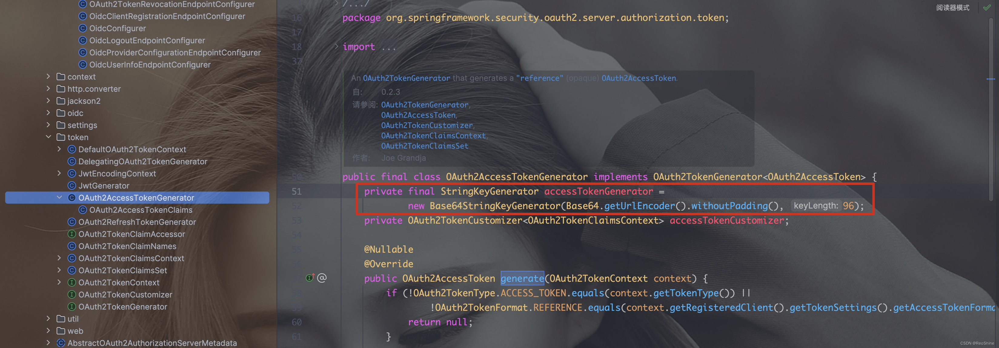

- [spring-security-oauth2-authorization-server（一）SpringBoot3.1.3整合](https://blog.csdn.net/weixin_42229668/article/details/132912917)
- [spring-security-oauth2-authorization-server（二）Token生成分析之JWT Token和Opaque Token](https://blog.csdn.net/weixin_42229668/article/details/132925597)

## 写在前面的话
因为 `Spring Boot 3.x` 是目前最新的版本，整合`spring-security-oauth2-authorization-server`的资料很少，所以产生了这篇文章，主要为想尝试`Spring Boot`高版本，想整合最新的`spring-security-oauth2-authorization-server`的初学者，旨在为大家提供一个简单上手的参考，如果哪里写得不对或可以优化的还请大家踊跃评论指正。

前面一篇文章[《spring-security-oauth2-authorization-server（一）SpringBoot3.1.3整合》](https://blog.csdn.net/weixin_42229668/article/details/132912917)主要介绍了如何简单搭建一个认证服务器，这一篇算番外篇主要结合官网的描述简单分析一下`Token`的几种生成策略，以及如何自定义`Token`生成器来生成我们在`OAuth2.0`中常见的形如这样：`Bearer 237d224d-1bdc-4d48-855a-f6abb37e378f`的不透明`OpaqueToken`。

**整个项目的配置还是复用的上一篇。**

## Token的生成的官方描述
取自官方文档：

> `OAuth2TokenGenerator`负责从所提供的`OAuth2TokenContext`中的信息生成 `OAuth2Token`，生成的 `OAuth2Token` 主要取决于在 `OAuth2TokenContext` 中指定的 `OAuth2TokenType`。

当 `OAuth2TokenType` 的 `value` 为：

- `code`，则生成 `OAuth2AuthorizationCode`
- `access_token`，则生成 `OAuth2AccessToken`
- `refresh_token`，则生成 `OAuth2RefreshToken`
- `id_token`，则生成 `OidcIdToken`

所以我们用到的授权码，`access-token`，`refresh-token`，设备码等都是由`OAuth2TokenGenerator`的子类实现的。

## 1. `JWT Token`（透明`Token`）
`spring-security-oauth2-authorization-server`默认生成的`Token`是`JWT`类型的，生成的 `OAuth2AccessToken` 的格式是不同的，取决于为 `RegisteredClient` 配置的 `TokenSettings.getAccessTokenFormat()`。如果格式是 `OAuth2TokenFormat.SELF_CONTAINED`（默认），那么就会生成一个 `JWT`。如果格式是 `OAuth2TokenFormat.REFERENCE`，那么就会生成一个 `opaque`不透明`Token`。

官网上还有这么一句话：

> `OAuth2TokenGenerator` 是一个可选的组件，默认为由 `OAuth2AccessTokenGenerator` 和 `OAuth2RefreshTokenGenerator` 组成的 `DelegatingOAuth2TokenGenerator`。

> 如果注册了 `JwtEncoder` `@Bean` 或 `JWKSource` `@Bean`，那么在 `DelegatingOAuth2TokenGenerator` 中还会额外组成一个 `JwtGenerator`。

可以在源码找到出处。
`DelegatingOAuth2TokenGenerator`实例化的时候将`tokenGenerators`塞进去的，那么再往上找何处实例化的


因为我们注册了相应的`JWKSource`、`JwtEncoder`的`Bean`，所以Token的生成会实现在`JwtGenerator`上。

如果我们不注册`JWT`相关的`Bean`就是将上一篇文章中的`3.3.5`节的`JWT`相关`Bean`全部去掉，debug会发现还是默认加进来了`JwtGenerator`。


原因应该是在我们在注册`RegisteredClientRepository` `Bean`时默认为我们指定了`tokenSettings`。


所以`oauth2_registered_client`表的`token_settings`也会看到`org.springframework.security.oauth2.server.authorization.settings.OAuth2TokenFormat`类型为`self-contained`


## 2. `Opaque Token`（不透明`Token`）
### 2.1 默认128位字符的`Opaque Token`
既然官网都告诉我们`Token`的形式是取决于为 `RegisteredClient` 配置的 `TokenSettings.getAccessTokenFormat()`，那我们改成`OAuth2TokenFormat.REFERENCE` 就好了。

**先把上一篇文章中3.3.5节与JWT相关的Bean删掉**，而后添加如下代码

```java
.tokenSettings(TokenSettings.builder()
    .accessTokenFormat(OAuth2TokenFormat.REFERENCE)
    .build())
```

```java
@Bean
public RegisteredClientRepository registeredClientRepository(JdbcTemplate jdbcTemplate, PasswordEncoder passwordEncoder) {
    RegisteredClient registeredClient = RegisteredClient.withId(UUID.randomUUID().toString())
            .clientId("oauth2-client")
            .clientSecret(passwordEncoder.encode("123456"))
            // 客户端认证基于请求头
            .clientAuthenticationMethod(ClientAuthenticationMethod.CLIENT_SECRET_BASIC)
            // 配置授权的支持方式
            .authorizationGrantType(AuthorizationGrantType.AUTHORIZATION_CODE)
            .authorizationGrantType(AuthorizationGrantType.REFRESH_TOKEN)
            .authorizationGrantType(AuthorizationGrantType.CLIENT_CREDENTIALS)
            .redirectUri("https://www.baidu.com")
            .scope("user")
            .scope("admin")
            // 客户端设置，设置用户需要确认授权
            .clientSettings(ClientSettings.builder().requireAuthorizationConsent(true).build())
            // 添加tokenSettings，将accessTokenFormat改为REFERENCE即可获取Opaque Token
            .tokenSettings(TokenSettings.builder().accessTokenFormat(OAuth2TokenFormat.REFERENCE).build())
            .build();
    JdbcRegisteredClientRepository registeredClientRepository = new JdbcRegisteredClientRepository(jdbcTemplate);
    RegisteredClient repositoryByClientId = registeredClientRepository.findByClientId(registeredClient.getClientId());
    if (repositoryByClientId == null) {
        registeredClientRepository.save(registeredClient);
    }
    return registeredClientRepository;
}
```


生成`Token`的全类名如下：
`org.springframework.security.oauth2.server.authorization.token.OAuth2AccessTokenGenerator#generate`


默认是`Base64`将一个96位长度的随机串编码后生成的128位字符串



我们发现此时的`Token`是一个极长的字符串，与我们在`OAuth2.0`生成`Bearer 237d224d-1bdc-4d48-855a-f6abb37e378f`相差甚远。
我们又发现`accessTokenGenerator`的设置是写死的，没有提供一个方法让我们重新设置，那么只能重写一个实现。

### 2.2 自定义`Token`生成器，生成一个`UUID`类型的`OpaqueToken`
官方文档说：

> `OAuth2TokenGenerator` 提供了极大的灵活性，因为它可以为 `access_token` 和 `refresh_token` 支持任何自定义的 `token` 格式。

那我们就自定义一个`UUIDOAuth2TokenGenerator`，用`UUID`生成一个`OpaqueToken`。在此之前需要先定义一个`StringKeyGenerator`的实现，因为Token生成器需要用到`this.accessTokenGenerator.generateKey()`来生成串。

```java
/**
 * @author roshine
 * @version 1.0.0
 */
public class UUIDKeyGenerator implements StringKeyGenerator {
    @Override
    public String generateKey() {
        return UUID.randomUUID().toString().toLowerCase();
    }
}
```

由于我们只需要将`Token`的生成改为`UUID`其他逻辑不变，所以将`org.springframework.security.oauth2.server.authorization.token.OAuth2AccessTokenGenerator#generate`
复刻一份，把多余的部分去掉，比如定制化器`accessTokenCustomizer`，如下所示：

```java
/**
 * @author roshine
 * @version 1.0.0
 */
public class UUIDOAuth2TokenGenerator implements OAuth2TokenGenerator<OAuth2AccessToken> {
    private final StringKeyGenerator accessTokenGenerator = new UUIDKeyGenerator();

    @Override
    public OAuth2AccessToken generate(OAuth2TokenContext context) {
        if (!OAuth2TokenType.ACCESS_TOKEN.equals(context.getTokenType()) ||
                !OAuth2TokenFormat.REFERENCE.equals(context.getRegisteredClient().getTokenSettings().getAccessTokenFormat())) {
            return null;
        }
        String issuer = null;
        if (context.getAuthorizationServerContext() != null) {
            issuer = context.getAuthorizationServerContext().getIssuer();
        }
        RegisteredClient registeredClient = context.getRegisteredClient();

        Instant issuedAt = Instant.now();
        Instant expiresAt = issuedAt.plus(registeredClient.getTokenSettings().getAccessTokenTimeToLive());

        // @formatter:off
        OAuth2TokenClaimsSet.Builder claimsBuilder = OAuth2TokenClaimsSet.builder();
        if (StringUtils.hasText(issuer)) {
            claimsBuilder.issuer(issuer);
        }
        claimsBuilder
                .subject(context.getPrincipal().getName())
                .audience(Collections.singletonList(registeredClient.getClientId()))
                .issuedAt(issuedAt)
                .expiresAt(expiresAt)
                .notBefore(issuedAt)
                .id(UUID.randomUUID().toString());
        if (!CollectionUtils.isEmpty(context.getAuthorizedScopes())) {
            claimsBuilder.claim(OAuth2ParameterNames.SCOPE, context.getAuthorizedScopes());
        }
        OAuth2TokenClaimsSet accessTokenClaimsSet = claimsBuilder.build();

        return new OAuth2AccessTokenClaims(OAuth2AccessToken.TokenType.BEARER,
                this.accessTokenGenerator.generateKey(), accessTokenClaimsSet.getIssuedAt(), accessTokenClaimsSet.getExpiresAt(),
                context.getAuthorizedScopes(), accessTokenClaimsSet.getClaims());
    }

    private static final class OAuth2AccessTokenClaims extends OAuth2AccessToken implements ClaimAccessor {
        private final Map<String, Object> claims;

        private OAuth2AccessTokenClaims(TokenType tokenType, String tokenValue,
                                        Instant issuedAt, Instant expiresAt, Set<String> scopes, Map<String, Object> claims) {
            super(tokenType, tokenValue, issuedAt, expiresAt, scopes);
            this.claims = claims;
        }

        @Override
        public Map<String, Object> getClaims() {
            return this.claims;
        }

    }
}
```

然后在我们的`AuthorizationServerConfig`添加
```java
    /**
     * 自定义Token生成器
     *
     * @return OAuth2TokenGenerator
     */
    @Bean
    public OAuth2TokenGenerator<?> tokenGenerator() {
        UUIDOAuth2TokenGenerator uuidoAuth2TokenGenerator = new UUIDOAuth2TokenGenerator();
        return new DelegatingOAuth2TokenGenerator(uuidoAuth2TokenGenerator);
    }
```

获取token时报错：

```json
{
"error_description": "The token generator failed to generate the refresh token.",
"error": "server_error",
"error_uri": "https://datatracker.ietf.org/doc/html/rfc6749#section-5.2"
}
```

那我们就再定义一个`UUIDOAuth2RefreshTokenGenerator`来生成 `refresh-token`。
```java
/**
 * @author roshine
 * @version 1.0.0
 * @date 2023-09-15 23:16
 */
public class UUIDOAuth2RefreshTokenGenerator implements OAuth2TokenGenerator<OAuth2RefreshToken> {

    private final StringKeyGenerator refreshTokenGenerator = new UUIDKeyGenerator();

    @Nullable
    @Override
    public OAuth2RefreshToken generate(OAuth2TokenContext context) {
        if (!OAuth2TokenType.REFRESH_TOKEN.equals(context.getTokenType())) {
            return null;
        }
        Instant issuedAt = Instant.now();
        Instant expiresAt = issuedAt.plus(context.getRegisteredClient().getTokenSettings().getRefreshTokenTimeToLive());
        return new OAuth2RefreshToken(this.refreshTokenGenerator.generateKey(), issuedAt, expiresAt);
    }
}
```

在`tokenGenerator()`里添加上`UUIDOAuth2RefreshTokenGenerator`
```java
/**
 * 自定义Token生成器
 *
 * @return OAuth2TokenGenerator
 */
@Bean
public OAuth2TokenGenerator<?> tokenGenerator() {
    UUIDOAuth2TokenGenerator uuidoAuth2TokenGenerator = new UUIDOAuth2TokenGenerator();
    UUIDOAuth2RefreshTokenGenerator refreshTokenGenerator = new UUIDOAuth2RefreshTokenGenerator();
    return new DelegatingOAuth2TokenGenerator(uuidoAuth2TokenGenerator, refreshTokenGenerator);
}
```


终于对味儿了。

以上就是简单的分析了一下`spring-security-oauth2-authorization-server`生成`Token`的策略以及如何自定义`Token`生成器来生成我们在`OAuth2.0`中熟悉的形如：`8f9e0b4b-6696-4424-aa2a-550398a0a685`这样的`Token`。

## 遗留思考的问题：
- 生成了三张表，另外两张`oauth2_authorization`、`oauth2_authorization_consent`一直没有数据什么原因？
- 为什么每次调用`/oauth2/authorize`接口都需要重新授权？
- 如何自定义登录页面，自定义表单提交请求、自定义回调地址等。

下一篇文章会一一解答。
