- [Spring Security OAuth2整合企业微信扫码登录](https://felord.cn/wwechat-scan-login.html)
- [Spring Security OAuth2整合企业微信扫码登录](https://mp.weixin.qq.com/s/S7NNeiPJAEtNQtypxrWcmw)

现在很多企业都接入了企业微信，作为私域社群工具，企业微信开放了很多API，可以打通很多自有的应用。既然是应用，那肯定需要做登录。正好企业微信提供了[企业微信扫码授权登录](https://developer.work.weixin.qq.com/document/path/91025)功能，而且号称使用了OAuth，正好拿这个检验一下Spring Security OAuth2专栏的威力。

正当我兴致勃勃打开文档学习的时候，脸上笑容逐渐消失，这确定是OAuth的吗？

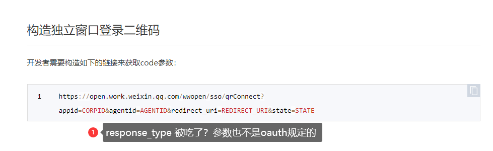

参数都变了，跟OAuth（不管是1.0还是2.0）规定不一样，然而这还不是最离谱的。按正常OAuth2的要求，拿到`code`之后就可以换`access_token`了是吧？企业微信的`access_token`居然和上面扫码获取`code`这一步完全无关，甚至获取`access_token`才是第一步！

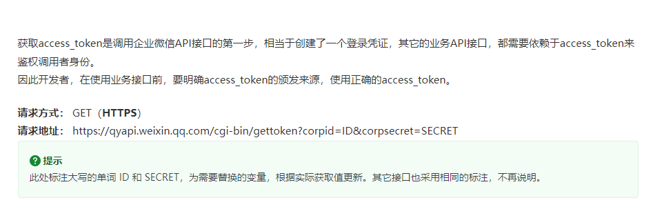

> 而且这个`access_token`接口，你还不能频繁调用，要缓存起来公用。

那费了半天劲儿去拿`code`有啥用呢？

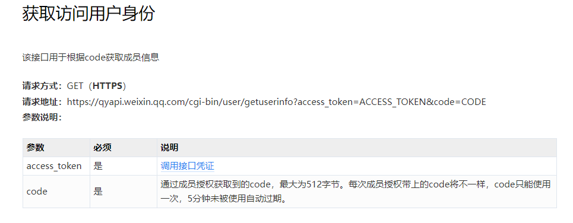
居然这个`code`是拿用户信息的，不得不说，我服了！这也就算了，命名上能不能走点心，一会儿下划线，一会儿驼峰：

```json
{
   "errcode": 0,
   "errmsg": "ok",
   "OpenId":"OPENID",
   "DeviceId":"DEVICEID",
   "external_userid":"EXTERNAL_USERID"
}
```

这个JSON风格，果然是大厂，讲究人，一个JSON要三个人来写才体面图片！反序列化的时候我还得给你写一个兼容，这是要拉满我的KPI是吧？算了，忍忍吧，老板就要这个功能，它就是一坨翔，做开发的也得含泪吃下去，干图片！

## 环境准备
### 准备一个内网穿透
开发微信相关的应用都需要搞一个内网穿透，在我往期的文章都有介绍。搞一个映射域名出来，就像下面这样：
```shell
http://invybj.natappfree.cc -> 127.0.0.1:8082 
```

`invybj.natappfree.cc` 会映射到我本地的8082端口，也就是我本地要开发应用的端口。

### 创建应用
首先去企业微信管理后台创建一个应用，如图：

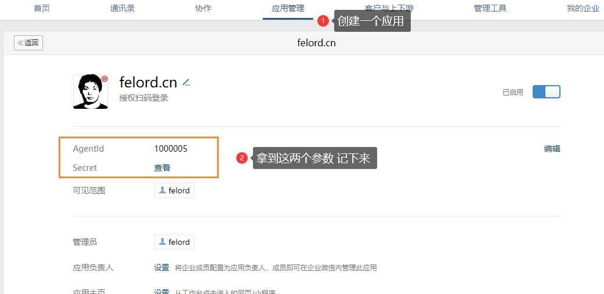

> 图里的参数AgentId和Secret要记下来备用。

还有一个企业微信的corpid，你可以从下面这个位置拿到，也要记下来备用。

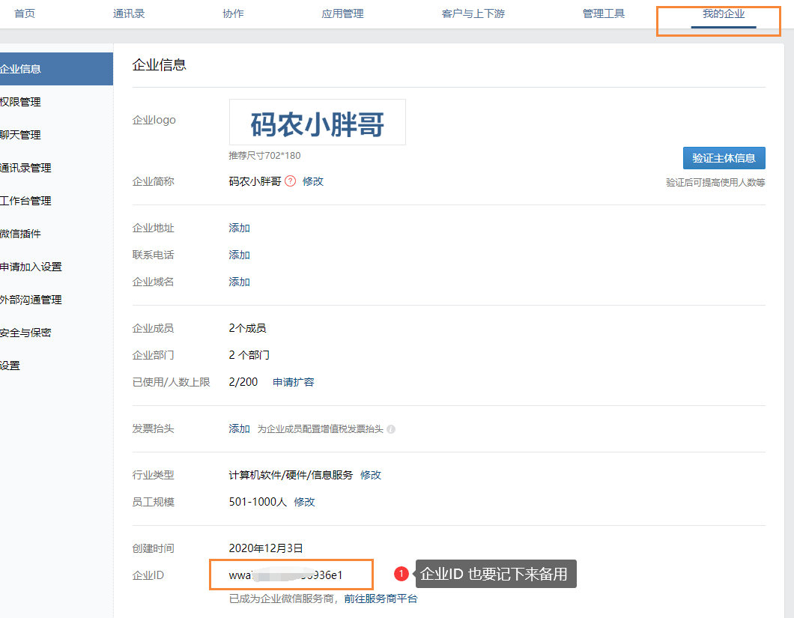

### 配置内网穿透域名
在创建应用这一页往下拉到页面底端，你会看到：

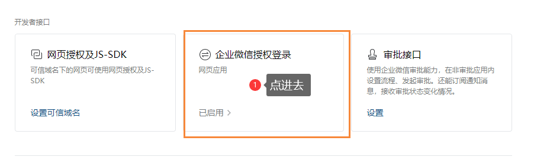
点击`已启用`进入下面这个页面：

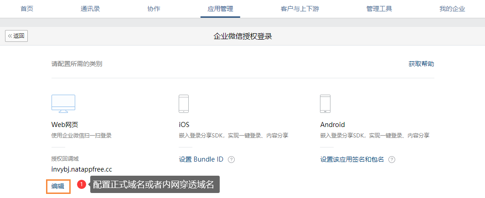
这里配置你`授权登录应用`生产的正式域名或者上面内网穿透的域名，注意只配置域名，而且不能使用`localhost`。


> 其实我感觉改写`hosts`文件也能用啊，你可以试一试。

到这里环境就搞定了，接下来就开始写Spring Security兼容代码吧。

## Spring Security兼容企业微信扫码登录
写起来太恶心了，不过对比文档和OAuth2的流程之后其实也没那么麻烦。我先放出我调试好的配置：
```yaml
spring:
  security:
    oauth2:
      client:
        registration:
          work-wechat-scan:
            # client-id为企业微信 的企业ID
            # 下面client-id是假的，你用你自己的企业ID
            client-id: wwaxxxxxx
            # client-secret企业微信对应应用的secret，
            # 每个企业微信应用都有独立的secret，不要搞错
            # 下面client-secret假的，你用你自己创建的企业微信应用secret
            client-secret:  nvzGI4Alp3zxxxxxxxKbnfTEets5W8
            authorization-grant-type: authorization_code
            redirect-uri: '{baseUrl}/login/oauth2/code/{registrationId}'
        provider:
          work-wechat-scan:
            authorization-uri: https://open.work.weixin.qq.com/wwopen/sso/qrConnect
            token-uri: https://qyapi.weixin.qq.com/cgi-bin/gettoken
            user-info-uri: https://qyapi.weixin.qq.com/cgi-bin/user/getuserinfo
```

这里`client-id`使用你企业微信的企业ID，`client-secret`使用上面创建应用的secret值。


> 这里的`work-wechat-scan`是客户端的r`egistrationId`

### 封装企业微信拉起二维码URL
我们期望的是保持Spring Security OAuth2的风格，当我访问：
```shell
http://invybj.natappfree.cc/oauth2/authorization/work-wechat-scan
```

会重定向到企业微信扫码登录链接，格式为：
```shell
https://open.work.weixin.qq.com/wwopen/sso/qrConnect?appid=CORPID&agentid=AGENTID&redirect_uri=REDIRECT_URI&state=STATE
```

这个和以前胖哥实现微信网页授权的原理差不多，都是通过改造`OAuth2AuthorizationRequestResolver`接口来实现，只需要实现一个`Consumer<OAuth2AuthorizationRequest.Builder>`就行了。

**逻辑是：** 把`client_id`替换为`appid`，增加一个`agentid`参数，连带`redirect_uri`和`state`四个参数之外的其它OAuth2参数全干掉，拼接成上面的URL。

这么写：

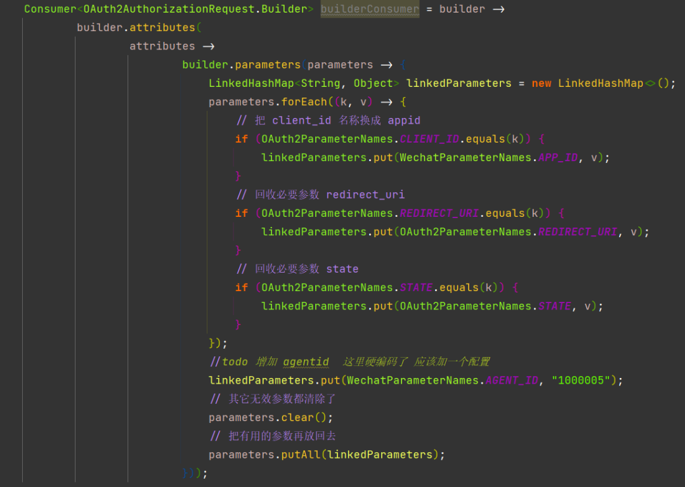

把这个`Consumer`配置到`DefaultOAuth2AuthorizationRequestResolver`就行了。

### 适配OAuth2获取`access_token`
经过这一步扫码拿到`code`就不成问题了，按照OAuth2该拿`access_token`了，需要自定义一个函数式接口:
```java
Converter<OAuth2AuthorizationCodeGrantRequest, RequestEntity<?>>
```

也就是利用`OAuth2AuthorizationCodeGrantRequest`生成`RestTemplate`需要的请求对象`RequestEntity<?>`。按照企业微信获取`access_token`的文档，这样自定义：

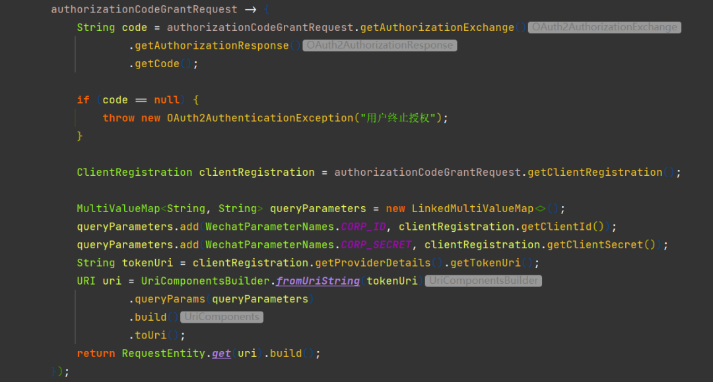

把这个配置到`DefaultAuthorizationCodeTokenResponseClient`就行了。

`access_token`的缓存，我放在了下一步进行解决。

### 适配获取用户信息
`code`和`access_token`都拿到了，最后一步获取用户的信息。这里是比较麻烦的因为获取`access_token`后并没有直接提供将`code`传递给`OAuth2UserService`的方法。最后发现`OAuth2AccessTokenResponse`的`additionalParameters`属性可以传递到`OAuth2UserService`，于是就利用代理模式改造了`OAuth2AccessTokenResponseClient`来实现：

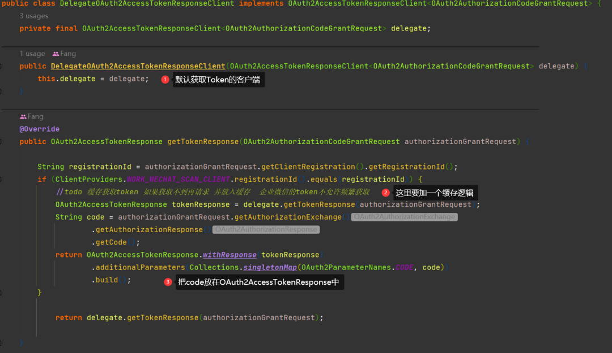

### 自定义企业微信`OAuth2UserService`
这个和微信网页授权我封装的差不多，改下参数封装成URI交给`RestTemplate`请求企业微信API。恶心的是要反序列化兼容三个微信研发工程师写的一个JSON：
```java
@Data
public class WorkWechatOAuth2User implements OAuth2User {
    private Set<GrantedAuthority> authorities;
    private Integer errcode;
    private String errmsg;
    @JsonAlias("OpenId")
    private String openId;
    @JsonAlias("UserId")
    private String userId;
}
```

### 收尾
拿到用户信息后，就结束了，你实现一个`AuthenticationSuccessHandler`来保证登录凭证和你平台一致，无论是cookie还是JWT，最后把它配置到这里：
```java
httpSecurity.oauth2Login()
    .successHandler(AuthenticationSuccessHandler successHandler)
```

## 试一下效果

> 务必使用域名进行访问，不要使用`localhost`或者IP。

访问`http://invybj.natappfree.cc/login`，这里是内网穿透域名，出现：

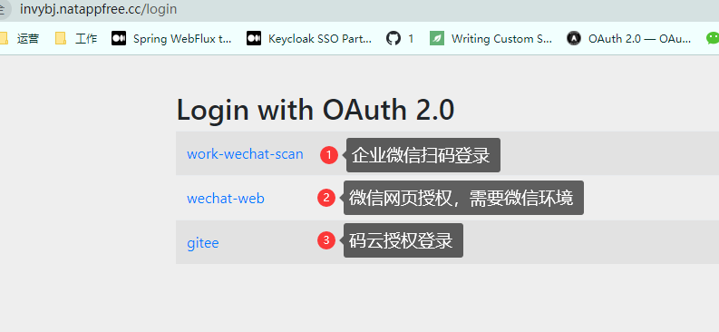

企业微信扫码登录的地址其实就是`http://invybj.natappfree.cc/oauth2/authorization/work-wechat-scan`。点击跳转到扫码页面：

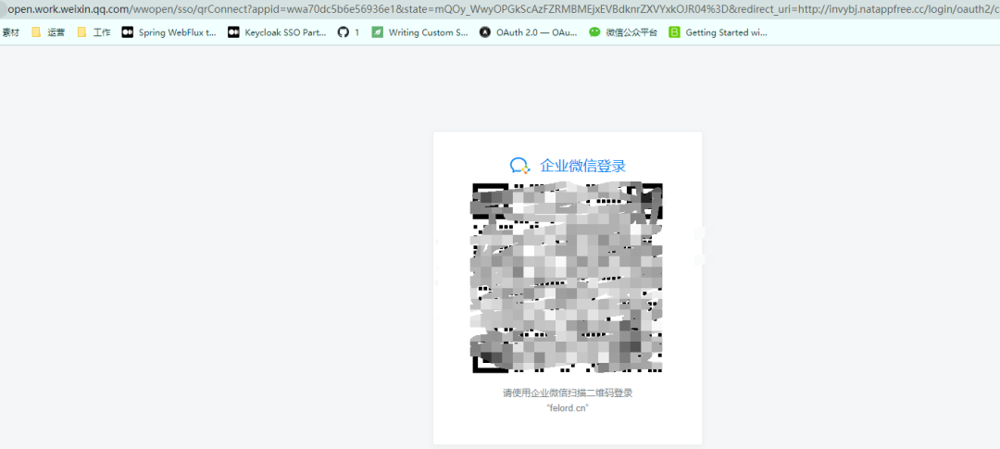

然后用你对应的企业微信APP扫码，企业和用户要和申请应用的一致。扫码后：

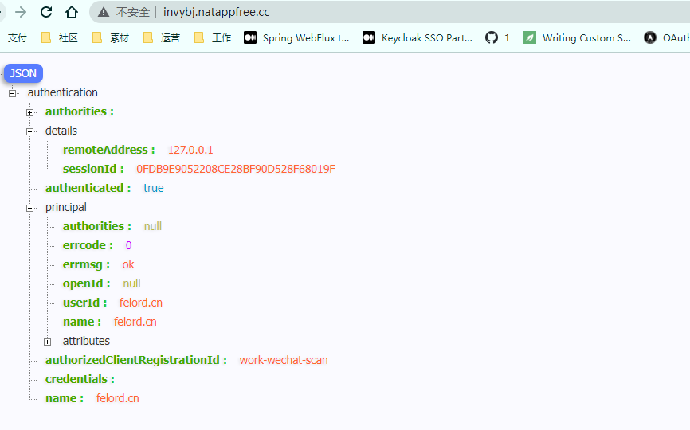

这个就是Spring Security 封装的用户认证信息`Authentication`对象，是真正的登录，这里我没有注入权限，你需要在企业微信的`OAuth2UserService`实现中注入权限和更多的信息。


errmsg -> not allow to access from your ip, hint: [1709402398118372241469842], from ip: 117.152.88.49, more info at https://open.work.weixin.qq.com/devtool/query?e=60020