- [Spring Authorization Server入门 (九) Spring Boot引入Resource Server对接认证服务](https://juejin.cn/post/7244043482772029498)

## 一、前言
书接上文，本次来对接一下资源服务，在本篇文章中会带领大家去构建一个资源服务器，通过注解校验token中的权限，怎么放行一个接口，使其不需要认证也可访问。

## 二、流程解析
[文档](https://docs.spring.io/spring-security/reference/servlet/oauth2/resource-server/index.html)

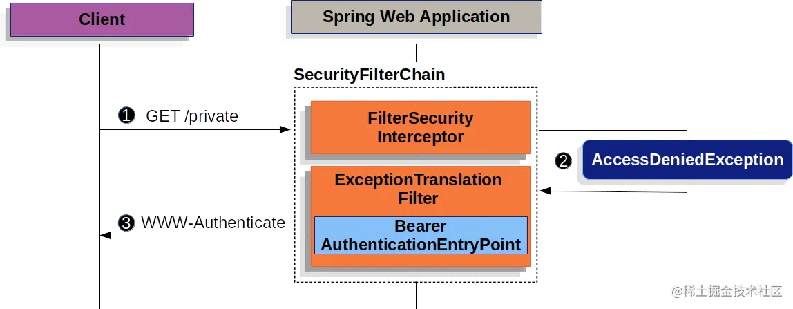

没有携带token访问认证信息会抛出`AccessDeniedException`异常，并且会调用`BearerAuthenticationEntryPoint`去处理。

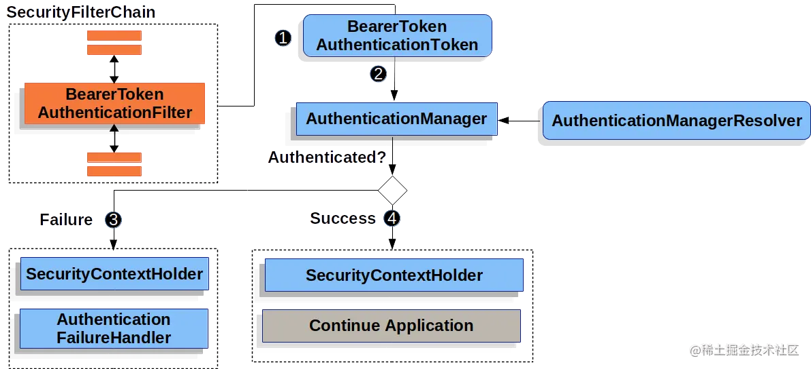

请求携带token到达资源服务器后会使用`BearerTokenAuthenticationFilter`去解析和校验token，成功会将认证信息存入`SecurityContextHolder`中并继续往下执行，失败则调用`AuthenticationEntryPoint`返回异常信息。以上两种异常处理默认都是在响应头中添加，响应头是`WWW-Authenticate`，值就是具体的异常信息。

## 三、整合过程

1. 创建项目
2. 添加resource server和web依赖
3. 添加yml配置

resource server和oauth2 client一样，是一个单独的服务，不需要跟认证服务器的版本保持一致，读者可自选springboot版本，它们之间通过oauth2的协议可以无缝对接。

### 1. 创建项目
通过IDEA或[Spring Initializr](https://start.spring.io)创建一个项目，同时选择web和OAuth2 Resource Server依赖。

pom.xml如下
```xml
<?xml version="1.0" encoding="UTF-8"?>
<project xmlns="http://maven.apache.org/POM/4.0.0" xmlns:xsi="http://www.w3.org/2001/XMLSchema-instance"
         xsi:schemaLocation="http://maven.apache.org/POM/4.0.0 https://maven.apache.org/xsd/maven-4.0.0.xsd">
    <modelVersion>4.0.0</modelVersion>
    <parent>
        <groupId>org.springframework.boot</groupId>
        <artifactId>spring-boot-starter-parent</artifactId>
        <version>3.1.0</version>
        <relativePath/> <!-- lookup parent from repository -->
    </parent>
    <groupId>com.example</groupId>
    <artifactId>resource-server-example</artifactId>
    <version>0.0.1-SNAPSHOT</version>
    <name>resource-server-example</name>
    <description>resource-server-example</description>
    <properties>
        <java.version>17</java.version>
    </properties>
    <dependencies>
        <dependency>
            <groupId>org.springframework.boot</groupId>
            <artifactId>spring-boot-starter-oauth2-resource-server</artifactId>
        </dependency>
        <dependency>
            <groupId>org.springframework.boot</groupId>
            <artifactId>spring-boot-starter-web</artifactId>
        </dependency>

        <dependency>
            <groupId>org.springframework.boot</groupId>
            <artifactId>spring-boot-starter-test</artifactId>
            <scope>test</scope>
        </dependency>
    </dependencies>

    <build>
        <plugins>
            <plugin>
                <groupId>org.springframework.boot</groupId>
                <artifactId>spring-boot-maven-plugin</artifactId>
            </plugin>
        </plugins>
    </build>

</project>
```

### 2. 添加yml配置
[资源服务器配置文档](https://docs.spring.io/spring-security/reference/servlet/oauth2/resource-server/jwt.html)
```yaml
server:
  # 设置资源服务器端口
  port: 8100

spring:
  security:
    oauth2:
      # 资源服务器配置
      resourceserver:
        jwt:
          # Jwt中claims的iss属性，也就是jwt的签发地址，即认证服务器的根路径
          # 资源服务器会进一步的配置，通过该地址获取公钥以解析jwt
          issuer-uri: http://192.168.120.33:8080
```

至此，一个简易的资源服务就搭建完毕了，资源服务比客户端服务的逻辑稍微简单些，就是从认证服务获取公钥，然后解析jwt类型的token。

## 四、测试

### 1. 添加测试接口
照例，从认证服务copy一下`TestController`
```java
package com.example.controller;

import org.springframework.security.access.prepost.PreAuthorize;
import org.springframework.web.bind.annotation.GetMapping;
import org.springframework.web.bind.annotation.RestController;

/**
 * 测试接口
 *
 * @author vains
 */
@RestController
public class TestController {

    @GetMapping("/test01")
    @PreAuthorize("hasAuthority('SCOPE_message.read')")
    public String test01() {
        return "test01";
    }

    @GetMapping("/test02")
    @PreAuthorize("hasAuthority('SCOPE_message.write')")
    public String test02() {
        return "test02";
    }

    @GetMapping("/app")
    @PreAuthorize("hasAuthority('app')")
    public String app() {
        return "app";
    }

}
```

添加完成后启动认证服务和资源服务

### 2. 页面访问test01

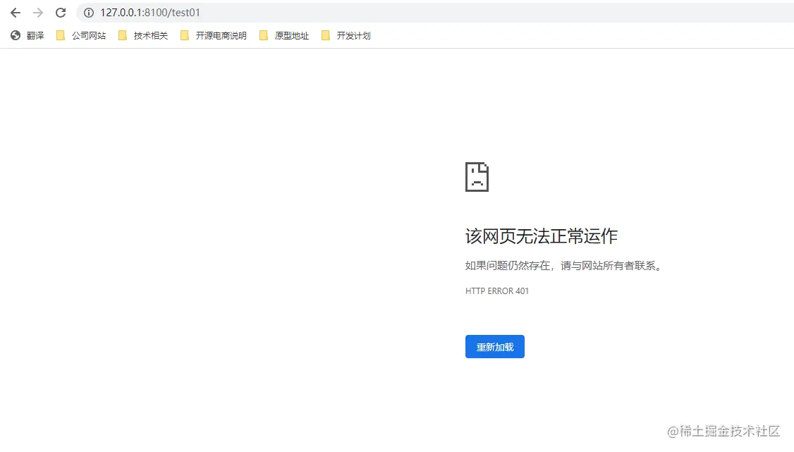

http状态码401代表尚未认证，可见已经生效，需要携带`token`访问接口。

### 3. Postman访问test01
从认证服务器获取一个`access_token`，放入请求头中。

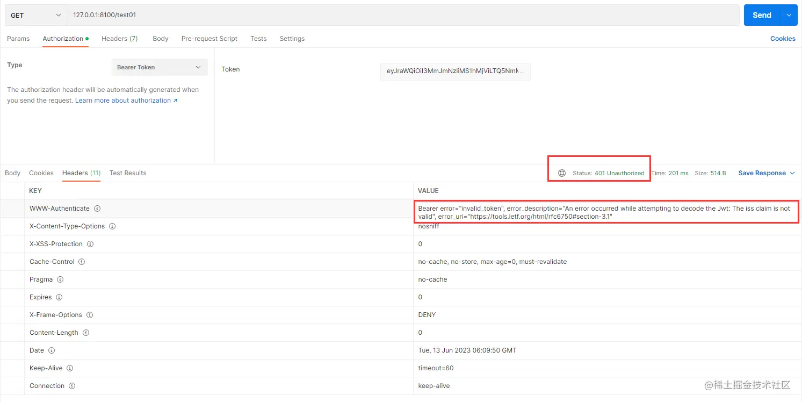

携带`token`却依然响应了401，通过异常描述发现是`iss`属性与代码中配置的不一致；使用[在线解析jwt](https://www.box3.cn/tools/jwt.html)的网站解析一下`access token`查看一下`iss`属性

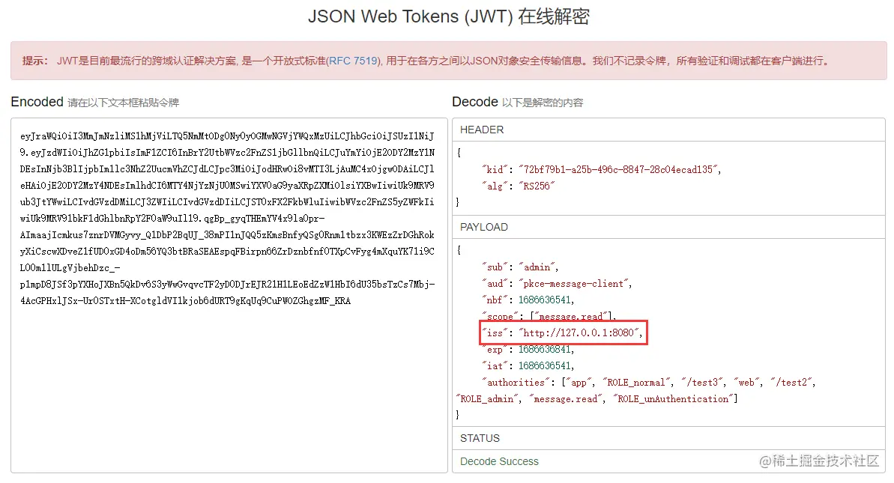

jwt中的`iss`是`127.0.0.1:8080`，但是资源服务器中配置的是`192.168.120.33:8080`，如果只是开发阶段则`spring.security.oauth2.resourceserver.jwt.issuer-uri`配置为`127.0.0.1:8080`的也没什么问题，但如果认证服务要部署至公网或者其它测试机中，这时候就要设置认证服务的`iss`属性了。

## 五、设置认证服务生成的jwt中的iss属性
更改认证服务中的`AuthorizationConfig.java`，修改`AuthorizationServerSettings`的配置，设置`jwt`签发地址
```java
/**
 * 添加认证服务器配置，设置jwt签发者、默认端点请求地址等
 *
 * @return AuthorizationServerSettings
 */
@Bean
public AuthorizationServerSettings authorizationServerSettings() {
    return AuthorizationServerSettings.builder()
            /*
                设置token签发地址(http(s)://{ip}:{port}/context-path, http(s)://domain.com/context-path)
                如果需要通过ip访问这里就是ip，如果是有域名映射就填域名，通过什么方式访问该服务这里就填什么
             */
            .issuer("http://192.168.120.33:8080")
            .build();
}
```

重启认证服务与资源服务

## 六、重新测试
从认证服务器申请一个token，通过postman对资源服务发起请求。

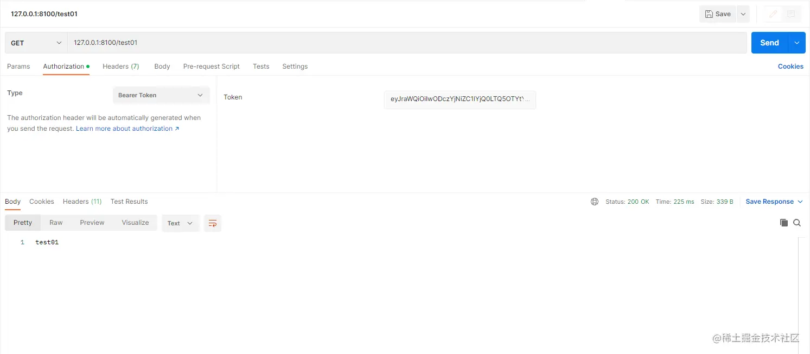

这时候就没有什么问题，说明资源服务可以正确解析token了，并且提取出了认证信息，来解析一下token看看

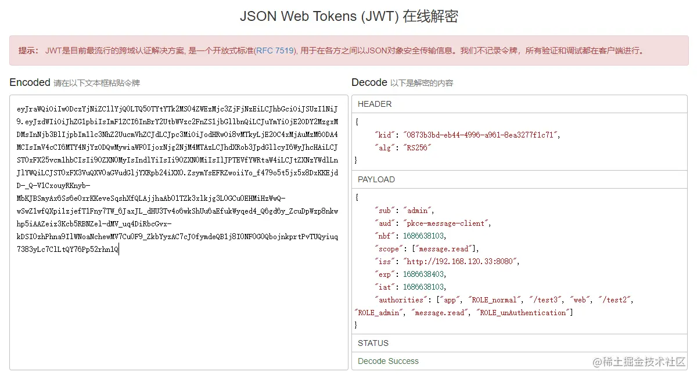

大家可以看到这里的iss属性是之前在认证服务中配置的地址。

接下来测试下test02接口

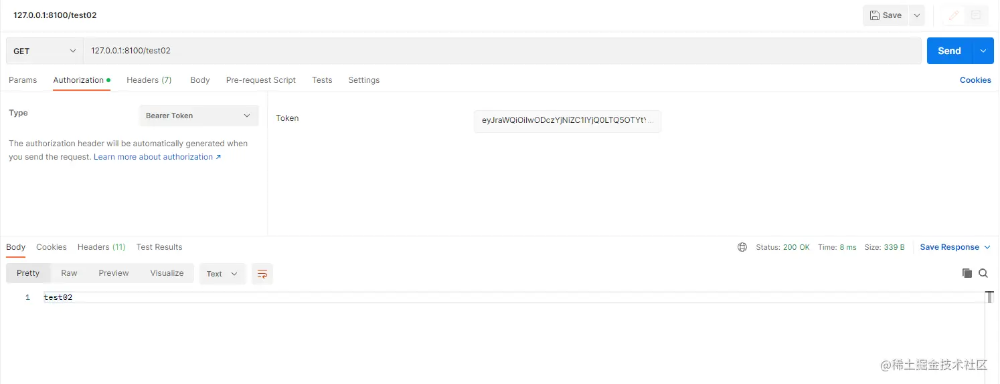

也请求成功了

## 七、添加注解使鉴权注解生效
大家应该也注意到了，测试接口上是有权限校验注解的，请求test01时`token`中`message.read`的`scope`，但是请求test02时token中并没有`message.write`的`scope`，请求成功说明注解尚未生效，这时候就需要添加注解了，也就是该系列文章的[第三篇](https://juejin.cn/post/7241058098974720037#heading-1)中提到的`@EnableWebSecurity`和`@EnableMethodSecurity`

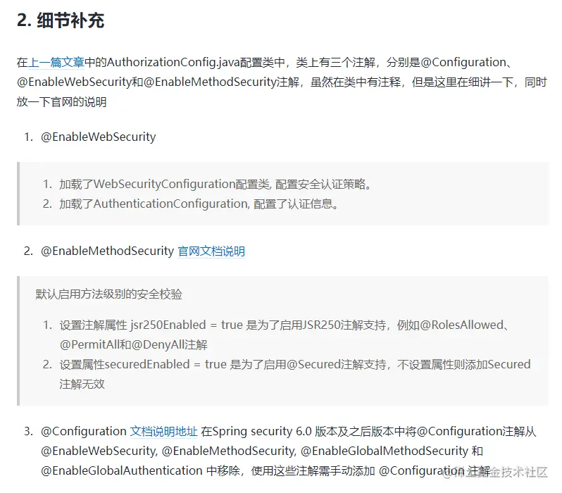

### 1. 在config包下创建ResourceServerConfig类
```java
package com.example.config;

import org.springframework.context.annotation.Bean;
import org.springframework.context.annotation.Configuration;
import org.springframework.security.config.Customizer;
import org.springframework.security.config.annotation.method.configuration.EnableMethodSecurity;
import org.springframework.security.config.annotation.web.builders.HttpSecurity;
import org.springframework.security.config.annotation.web.configuration.EnableWebSecurity;
import org.springframework.security.web.SecurityFilterChain;

/**
 * OAuth2 Resource Server
 *
 * @author Yu jin xiang 2023/6/13
 */
@Configuration
@EnableWebSecurity
@EnableMethodSecurity(jsr250Enabled = true, securedEnabled = true)
public class ResourceServerConfig {

    @Bean
    public SecurityFilterChain defaultSecurityFilterChain(HttpSecurity http) throws Exception {
        http.authorizeHttpRequests(authorize -> authorize
                        // 下边一行是放行接口的配置，被放行的接口上不能有权限注解，e.g. @PreAuthorize，否则无效
                        // .requestMatchers("/test02").permitAll()
                        .anyRequest().authenticated()
                )
                .oauth2ResourceServer(oauth2 -> oauth2
                        // 可在此处添加自定义解析设置
                        .jwt(Customizer.withDefaults())
                        // 添加未携带token和权限不足异常处理(已在第五篇文章中说过)
//                        .accessDeniedHandler(SecurityUtils::exceptionHandler)
//                        .authenticationEntryPoint(SecurityUtils::exceptionHandler)
                );
        return http.build();
    }

    // 添加自定义解析token配置，注入一个JwtAuthenticationConverter
    // (已在第六章中说过，这里就不重复实现了)

}
```

资源服务的异常处理已在第五章讲过，这一章就不详细说了，按照代码中的位置配置即可，第六章中也讲解过如何配置一个`JwtAuthenticationConverter`去自定义解析token。

### 2. 测试
申请一个token访问接口test02接口

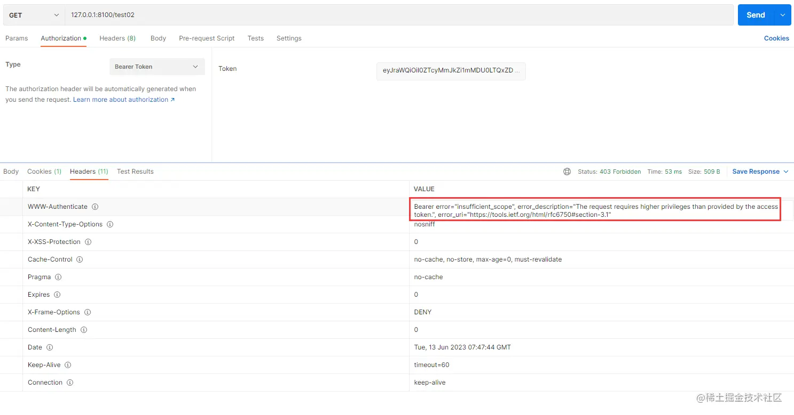

权限不足

访问test接口

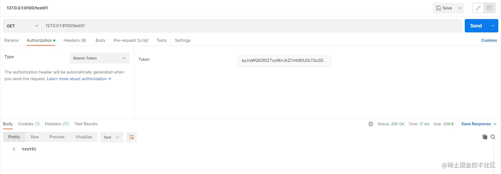

这样基本就已经完成了，如果有啥问题请在评论区留言。

代码已提交至Gitee：https://gitee.com/vains-Sofia/authorization-example
