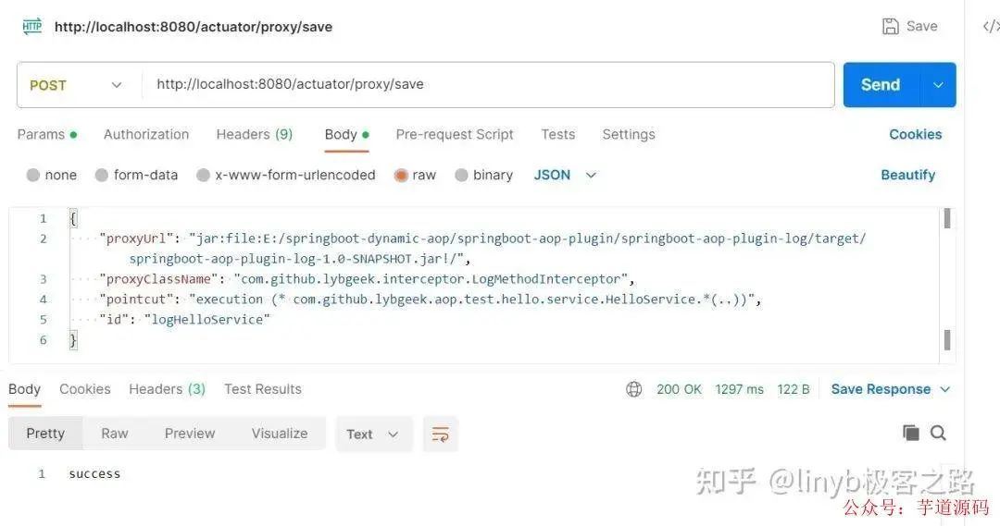

- [Spring Boot 实现热插拔 AOP，非常实用！](https://mp.weixin.qq.com/s/HyVsVXOe-6gzgD7Ea4lHcg)

现在有这么一个需求：就是我们日志的开与关是交给使用人员来控制的，而不是由我们开发人员固定写死的。大家都知道可以用aop来实现日志管理，但是如何动态的来实现日志管理呢？aop源码中的实现逻辑中有这么一个步骤，就是会依次扫描Advice的实现类，然后执行。我们要做的就是自定义一个advice的实现类然后，在用户想要开启日志的时候就把advice加到项目中来，关闭日志的时候就把advice剔除就行了。

## 前置知识
### Advice:
```java
org.aopalliance.aop.Advice
```

“通知”，表示 Aspect 在特定的 Join point 采取的操作。包括 “around”, “before” and “after 等 Advice，大体上分为了三类：BeforeAdvice、MethodInterceptor、AfterAdvice

### Advisor:
```java
org.springframework.aop.Advisor
```

“通知者”，它持有 Advice，是 Spring AOP 的一个基础接口。它的子接口 PointcutAdvisor 是一个功能完善接口，它涵盖了绝大部分的 Advisor。

### Advised:
```java
org.springframework.aop.framework.Advised
```

AOP 代理工厂配置类接口。提供了操作和管理 Advice 和 Advisor 的能力。它的实现类 ProxyFactory 是 Spring AOP 主要用于创建 AOP 代理类的核心类。

## 热插拔AOP执行核心逻辑


## 核心实现代码
### 1、动态管理advice端点实现

```java
@RestControllerEndpoint(id = "proxy")
@RequiredArgsConstructor
public class ProxyMetaDefinitionControllerEndPoint {

    private final ProxyMetaDefinitionRepository proxyMetaDefinitionRepository;


    @GetMapping("listMeta")
    public List<ProxyMetaDefinition> getProxyMetaDefinitions(){
       return proxyMetaDefinitionRepository.getProxyMetaDefinitions();
    }

    @GetMapping("{id}")
    public ProxyMetaDefinition getProxyMetaDefinition(@PathVariable("id") String proxyMetaDefinitionId){
        return proxyMetaDefinitionRepository.getProxyMetaDefinition(proxyMetaDefinitionId);
    }

    @PostMapping("save")
    public String save(@RequestBody ProxyMetaDefinition definition){

        try {
            proxyMetaDefinitionRepository.save(definition);
            return "success";
        } catch (Exception e) {

        }
        return "fail";

    }

    @PostMapping("delete/{id}")
    public String delete(@PathVariable("id")String proxyMetaDefinitionId){
        try {
            proxyMetaDefinitionRepository.delete(proxyMetaDefinitionId);
            return "success";
        } catch (Exception e) {

        }
        return "fail";
    }

}
```

### 2、利用事件监听机制捕获安装或者卸载插件

```java
@RequiredArgsConstructor
public class ProxyMetaDefinitionChangeListener {

    private final AopPluginFactory aopPluginFactory;

    @EventListener
    public void listener(ProxyMetaDefinitionChangeEvent proxyMetaDefinitionChangeEvent){
        ProxyMetaInfo proxyMetaInfo = aopPluginFactory.getProxyMetaInfo(proxyMetaDefinitionChangeEvent.getProxyMetaDefinition());
        switch (proxyMetaDefinitionChangeEvent.getOperateEventEnum()){
            case ADD:
                aopPluginFactory.installPlugin(proxyMetaInfo);
                break;
            case DEL:
                aopPluginFactory.uninstallPlugin(proxyMetaInfo.getId());
                break;
        }

    }
}
```

### 3、安装插件

```java
public void installPlugin(ProxyMetaInfo proxyMetaInfo){
        if(StringUtils.isEmpty(proxyMetaInfo.getId())){
            proxyMetaInfo.setId(proxyMetaInfo.getProxyUrl() + SPIILT + proxyMetaInfo.getProxyClassName());
        }
        AopUtil.registerProxy(defaultListableBeanFactory,proxyMetaInfo);
    }
```

### 4、安装插件核心实现

```java
public static void registerProxy(DefaultListableBeanFactory beanFactory,ProxyMetaInfo proxyMetaInfo){
        AspectJExpressionPointcutAdvisor advisor = getAspectJExpressionPointcutAdvisor(beanFactory, proxyMetaInfo);
        addOrDelAdvice(beanFactory,OperateEventEnum.ADD,advisor);

    }

    private static AspectJExpressionPointcutAdvisor getAspectJExpressionPointcutAdvisor(DefaultListableBeanFactory beanFactory, ProxyMetaInfo proxyMetaInfo) {
        BeanDefinitionBuilder builder = BeanDefinitionBuilder.genericBeanDefinition();
        GenericBeanDefinition beanDefinition = (GenericBeanDefinition) builder.getBeanDefinition();
        beanDefinition.setBeanClass(AspectJExpressionPointcutAdvisor.class);
        AspectJExpressionPointcutAdvisor advisor = new AspectJExpressionPointcutAdvisor();
        advisor.setExpression(proxyMetaInfo.getPointcut());
        advisor.setAdvice(Objects.requireNonNull(getMethodInterceptor(proxyMetaInfo.getProxyUrl(), proxyMetaInfo.getProxyClassName())));
        beanDefinition.setInstanceSupplier((Supplier<AspectJExpressionPointcutAdvisor>) () -> advisor);
        beanFactory.registerBeanDefinition(PROXY_PLUGIN_PREFIX + proxyMetaInfo.getId(),beanDefinition);

        return advisor;
    }
```

### 5、卸载插件

```java
public void uninstallPlugin(String id){
        String beanName = PROXY_PLUGIN_PREFIX + id;
        if(defaultListableBeanFactory.containsBean(beanName)){
           AopUtil.destoryProxy(defaultListableBeanFactory,id);
        }else{
            throw new NoSuchElementException("Plugin not found: " + id);
        }
    }
```

### 6、卸载插件核心实现

```java
public static void destoryProxy(DefaultListableBeanFactory beanFactory,String id){
        String beanName = PROXY_PLUGIN_PREFIX + id;
        if(beanFactory.containsBean(beanName)){
            AspectJExpressionPointcutAdvisor advisor = beanFactory.getBean(beanName,AspectJExpressionPointcutAdvisor.class);
            addOrDelAdvice(beanFactory,OperateEventEnum.DEL,advisor);
            beanFactory.destroyBean(beanFactory.getBean(beanName));
        }
    }
```

### 7、操作advice实现

```java
public static void addOrDelAdvice(DefaultListableBeanFactory beanFactory, OperateEventEnum operateEventEnum,AspectJExpressionPointcutAdvisor advisor){
        AspectJExpressionPointcut pointcut = (AspectJExpressionPointcut) advisor.getPointcut();
        for (String beanDefinitionName : beanFactory.getBeanDefinitionNames()) {
            Object bean = beanFactory.getBean(beanDefinitionName);
            if(!(bean instanceof Advised)){
                if(operateEventEnum == OperateEventEnum.ADD){
                    buildCandidateAdvised(beanFactory,advisor,bean,beanDefinitionName);
                }
                continue;
            }
            Advised advisedBean = (Advised) bean;
            boolean isFindMatchAdvised = findMatchAdvised(advisedBean.getClass(),pointcut);
            if(operateEventEnum == OperateEventEnum.DEL){
                if(isFindMatchAdvised){
                    advisedBean.removeAdvice(advisor.getAdvice());
                    log.info("######################################### Remove Advice -->【{}】 For Bean -->【{}】 SUCCESS !",advisor.getAdvice().getClass().getName(),bean.getClass().getName());
                }
            }else if(operateEventEnum == OperateEventEnum.ADD){
                if(isFindMatchAdvised){
                    advisedBean.addAdvice(advisor.getAdvice());
                    log.info("######################################### Add Advice -->【{}】 For Bean -->【{}】 SUCCESS !",advisor.getAdvice().getClass().getName(),bean.getClass().getName());
                }
            }


        }
    }
```

## 热插拔AOP演示示例
### 1、创建一个service

```java
@Service
@Slf4j
public class HelloService implements BeanNameAware, BeanFactoryAware {
    private BeanFactory beanFactory;

    private String beanName;

    @SneakyThrows
    public String sayHello(String message) {
        Object bean = beanFactory.getBean(beanName);
        log.info("============================ {} is Advised : {}",bean, bean instanceof Advised);
        TimeUnit.SECONDS.sleep(new Random().nextInt(3));
        log.info("============================ hello:{}",message);

        return "hello:" + message;

    }

    @Override
    public void setBeanFactory(BeanFactory beanFactory) throws BeansException {
        this.beanFactory = beanFactory;
    }

    @Override
    public void setBeanName(String name) {
        this.beanName = name;
    }
}
```

### 2、创建一个controller

```java
@RestController
@RequestMapping("hello")
@RequiredArgsConstructor
public class HelloController {

    private final HelloService helloService;

    @GetMapping("{message}")
    public String sayHello(@PathVariable("message")String message){
        return helloService.sayHello(message);
    }
}
```

### 3、准备一个日志切面jar


切面内容为

```java
@Slf4j
public class LogMethodInterceptor implements MethodInterceptor {
    @Override
    public Object invoke(MethodInvocation invocation) throws Throwable {
        Object result;
        try {
            result = invocation.proceed();
        } finally {
           log.info(">>>>>>>>>>>>>>>>>>>>>>>>TargetClass:【{}】,method:【{}】,args:【{}】",invocation.getThis().getClass().getName(),invocation.getMethod().getName(), Arrays.toString(invocation.getArguments()));
        }

        return result;
    }
}
```

## 测试

### 场景一：未添加切面时 浏览器访问：http://localhost:8080/hello/zhangsan 观察控制台


### 场景二：通过postman动态操作代理

#### 1、新增代理



观察控制台
```shell
######################################### BuildCandidateAdvised -->【com.github.lybgeek.aop.test.hello.service.HelloService】 With Advice -->【com.github.lybgeek.interceptor.LogMethodInterceptor】 SUCCESS !
```

此时浏览器访问：http://localhost:8080/hello/zhangsan

再次观察控制台


出现了切面日志信息，说明代理生效

#### 2、删除代理


观察控制台
```java
######################################### Remove Advice -->【com.github.lybgeek.interceptor.LogMethodInterceptor】 For Bean -->【com.github.lybgeek.aop.test.hello.service.HelloService$$EnhancerBySpringCGLIB$$7bc75aa3】 SUCCESS !
```

此时浏览器访问：http://localhost:8080/hello/zhangsan

再次观察控制台


此时没有出现切面日志信息，说明代理删除成功

## 总结
本文实现热插拔AOP就在于对advice、advised、advisor、pointcut概念的理解，这是实现热插拔AOP的前提，其次就是对自定义classloader也需要有一定的了解，因为我们jar不一定从classpath底下加载，也有可能来源其他地方，比如远程链接啥的，最后就是把原先spring自动帮我们实现aop，我们利用相关的api，自己手动实现一遍，示例代码的api只是利用spring api其中一种实现方式，它还有多种实现方式，比如可以利用TargetSource，感兴趣的朋友，也可以自己实现一把。

至于那个代理增删改查端点contoller，是我之前看springcloud gateway的路由定位器端点源码，一直没找到机会实现一下，就把他搬来这个示例实现一把，加深一下印象！