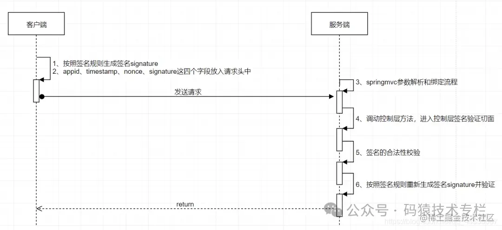
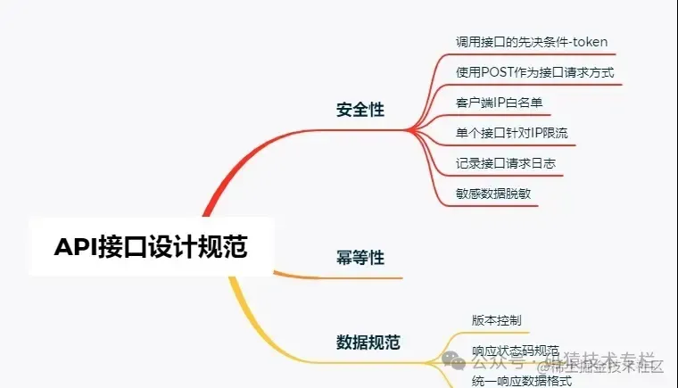
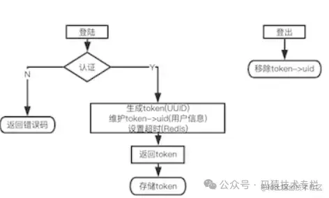
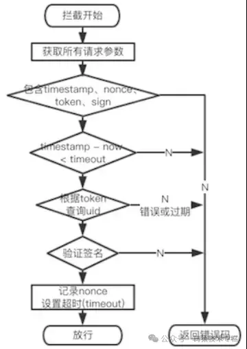

- [三方接口调用设计方案](https://juejin.cn/post/7268667384440504360)
- [三方接口就要这样设计，非常优雅！](https://mp.weixin.qq.com/s/aY7xi1uS9qWr0EuR7HNzsQ)
- [公司来了个大神，三方接口调用方案设计的真优雅~~](https://mp.weixin.qq.com/s/-6btpBrgOz-3iqP-g_l_0A)

在为第三方系统提供接口的时候，肯定要考虑接口数据的安全问题，比如数据是否被篡改，数据是否已经过时，数据是否可以重复提交等问题。

在设计三方接口调用的方案时，需要考虑到安全性和可用性。以下是一种设计方案的概述，其中包括使用API密钥（`Access Key`/`Secret Key`）进行身份验证和设置回调地址。

## 设计方案概述
### 1. API密钥生成： 为每个三方应用生成唯一的API密钥对（AK/SK），其中AK用于标识应用，SK用于进行签名和加密。

> AK：`Access Key Id`，用于标示用户。
> SK：`Secret Access Key`，是用户用于加密认证字符串和用来验证认证字符串的密钥，其中SK必须保密。
> 通过使用 `Access Key Id` / `Secret Access Key` 加密的方法来验证某个请求的发送者身份。

### 2. 接口鉴权： 在进行接口调用时，客户端需要使用AK和请求参数生成签名，并将其放入请求头或参数中以进行身份验证。

> 淘宝签名和验签： [淘宝SDK签名算法 (yuque.com)](https://www.yuque.com/u12226311/ttgrez/mxy16ld5h2tw7xhx)

### 3. 回调地址设置： 三方应用提供回调地址，用于接收异步通知和回调结果。

### 4. 接口API设计： 设计接口的URL、HTTP方法、请求参数、响应格式等细节。

## 权限划分
### appID：应用的唯一标识

用来标识你的开发者账号的，即：用户id，可以在数据库添加索引，方便快速查找，同一个 appId 可以对应多个 `appKey+appSecret`，达到权限的

### appKey：公匙（相当于账号）

公开的，调用服务所需要的密钥。是用户的身份认证标识，用于调用平台可用服务.，可以简单理解成是账号。

### appSecret：私匙（相当于密码）

签名的密钥，是跟appKey配套使用的，可以简单理解成是密码。

### token：令牌（过期失效）

### 使用方法

1. 向第三方服务器请求授权时，带上`AppKey`和`AppSecret`（需存在服务器端）
2. 第三方服务器验证`appKey`和`appSecret`在数据库、缓存中有没有记录
3. 如果有，生成一串唯一的字符串（token令牌），返回给服务器，服务器再返回给客户端
4. 后续客户端每次请求都需要带上token令牌

### 为什么 要有appKey + appSecret 这种成对出现的机制呢?

因为要加密, 通常用在首次验证(类似登录场景)，用 `appKey`(标记要申请的权限有哪些) + `appSecret`(密码, 表示你真的拥有这个权限)来申请一个`token`，就是我们经常用到的 `accessToken`（通常拥有失效时间），后续的每次请求都需要提供`accessToken` 表明验证权限通过。

> 现在有了统一的`appId`，此时如果针对同一个业务要划分不同的权限，比如同一功能，某些场景需要只读权限，某些场景需要读写权限。这样提供一个`appId`和对应的秘钥`appSecret`就没办法满足需求。此时就需要根据权限进行账号分配，通常使用`appKey`和`appSecret`。

由于 `appKey` 和 `appSecret` 是成对出现的账号, 同一个 `appId` 可以对应多个 `appKey` + `appSecret`，这样平台就为不同的`appKey` + `appSecret`对分配不一样的权限。

> 可以生成两对`appKey`和`appSecret`。一个用于删除，一个用于读写，达到权限的细粒度划分。如 : `appKey1` + `appSecect1` 只有删除权限 但是 `appKey2` + `appSecret2` 有读写权限… 这样你就可以把对应的权限 放给不同的开发者。其中权限的配置都是直接跟`appKey` 做关联的，`appKey` 也需要添加数据库索引, 方便快速查找

### 简化的场景:

#### 第一种场景： 通常用于开放性接口，像地图api，会省去`app_id`和`app_key`，此时相当于三者相等，合而为一 `appId = appKey = appSecret`。这种模式下，带上`app_id`的目的仅仅是统计某一个用户调用接口的次数而已了。

#### 第二种场景: 当每一个用户有且仅有一套权限配置 可以去掉 `appKey`，直接将 `app_id = app_key`，每个用户分配一个`appId+ appSecret`就够了。

#### 也可以采用签名(`signature`)的方式： 当调用方向服务提供方法发起请求时，带上（`appKey`、时间戳`timeStamp`、随机数`nonce`、签名`sign`） 签名`sign` 可以使用 (`AppSecret` + 时间戳 + 随机数)使用sha1、md5生成，服务提供方收到后，生成本地签名和收到的签名比对，如果一致，校验成功

## 签名流程


## 签名规则
### 1. 分配appId(开发者标识)和appSecret(密钥)，给 不同的调用方

可以直接通过平台线上申请，也可以线下直接颁发。`appId`是全局唯一的，每个`appId`将对应一个客户，密钥`appSecret`需要高度保密。

### 2. 加入timeStamp（时间戳），以服务端当前时间为准，单位为ms ，5分钟内数据有效

时间戳的目的就是为了减轻DOS攻击。防止请求被拦截后一直尝试请求接口。服务器端设置时间戳阀值，如果服务器时间 减 请求时间戳超过阀值，表示签名超时，接口调用失败。

### 3. 加入临时流水号nonce，至少为10位 ，有效期内防重复提交。

随机值nonce 主要是为了增加签名sign的多变性，也可以保护接口的幂等性，相邻的两次请求nonce不允许重复，如果重复则认为是重复提交，接口调用失败。

- 针对查询接口，流水号只用于日志落地，便于后期日志核查。
- 针对办理类接口需校验流水号在有效期内的唯一性，以避免重复请求。

通过在接口签名请求参数加上 时间戳`timeStamp` + 随机数`nonce` 可以防止 ”重放攻击“

1. 时间戳（timeStamp）:

以服务端当前时间为准，服务端要求客户端发过来的时间戳，必须是最近60秒内（假设值，自己定义）的。

这样，即使这个请求即使被截取了，也只能在60s内进行重放攻击。

2. 随机数（nonce）:

但是，即使设置了时间戳，攻击者还有60s的攻击时间呢！

所以我们需要在客户端请求中再加上一个随机数（中间黑客不可能自己修改随机数，因为有参数签名的校验呢），服务端会对一分钟内请求的随机数进行检查，如果有两个相同的，基本可以判定为重放攻击。

因为正常情况下，在短时间内（比如60s）连续生成两个相同nonce的情况几乎为0

服务端“第一次”在接收到这个nonce的时候做下面行为：

   1. 去redis中查找是否有key为`nonce:{nonce}`的数据
   2. 如果没有，则创建这个key，把这个key失效的时间和验证timestamp失效的时间一致，比如是60s。
   3. 如果有，说明这个key在60s内已经被使用了，那么这个请求就可以判断为重放请求。

### 4. 加入签名字段sign，获取调用方传递的签名信息。

通过在接口签名请求参数加上 时间戳`appId` + `sign` 解决身份验证和防止 ”参数篡改“

1. 请求携带参数`appId`和`Sign`，只有拥有合法的身份`appId`和正确的签名`Sign`才能放行。这样就解决了身份验证和参数篡改问题。
2. 即使请求参数被劫持，由于获取不到`appSecret`（仅作本地加密使用，不参与网络传输），也无法伪造合法的请求。

以上字段放在请求头中。

## API接口设计
根据你的具体需求和业务场景，以下是一个简单示例的API接口设计：

### 1. 获取资源列表接口
URL: `/api/resources`

HTTP 方法: GET

请求参数:
- page (可选): 页码
- limit (可选): 每页限制数量

响应:
- 成功状态码: 200 OK
- 响应体: 返回资源列表的JSON数组
### 2. 创建资源接口
URL: `/api/resources`

HTTP 方法: POST

请求参数:
- name (必填): 资源名称
- description (可选): 资源描述

响应:
- 成功状态码: 201 Created
- 响应体: 返回新创建资源的ID等信息

### 3. 更新资源接口
URL: `/api/resources/{resourceId}`

HTTP 方法: PUT

请求参数:
- resourceId (路径参数, 必填): 资源ID
- name (可选): 更新后的资源名称
- description (可选): 更新后的资源描述

响应:
- 成功状态码: 200 OK

### 4. 删除资源接口
URL: `/api/resources/{resourceId}`

HTTP 方法: DELETE

请求参数:
- resourceId (路径参数, 必填): 资源ID

响应:
- 成功状态码: 204 No Content

## 安全性考虑
为了确保安全性，可以采取以下措施：

1. 使用HTTPS协议进行数据传输，以保护通信过程中的数据安全。
2. 在请求中使用AK和签名进行身份验证，并对请求进行验签，在服务端进行校验和鉴权，以防止非法请求和重放攻击。
3. 对敏感数据进行加密传输，例如使用TLS加密算法对敏感数据进行加密。

以上是一个简单的设计方案和API接口设计示例。具体的实现细节可能因项目需求而有所不同。在实际开发中，还要考虑错误处理、异常情况处理、日志记录等方面。

防止重放攻击和对敏感数据进行加密传输都是保护三方接口安全的重要措施。以下是一些示例代码，展示了如何实现这些功能。

### 防止重放攻击
抓取报文原封不动重复发送如果是付款接口，或者购买接口就会造成损失，因此需要采用防重放的机制来做请求验证，如请求参数上加上timestamp时间戳+nonce随机数。关注公众号：码猿技术专栏，回复关键词：1111 获取阿里内部Java性能调优手册！

重放攻击是指黑客通过抓包的方式，得到客户端的请求数据及请求连接，重复的向服务器发送请求的行为。

> 时间戳(tamp) + 数字签名(sign)， 也就是说每次发送请求时多传两个参数，分别为 tamp 和 sign。

数字签名的作用是为了确保请求的有效性。因为签名是经过加密的，只有客户端和服务器知道加密方式及密钥（key），所以第三方模拟不了。我们通过对sign的验证来判断请求的有效性，如果sign验证失败则判定为无效的请求，反之有效。但是数字签名并不能阻止重放攻击，因为黑客可以抓取你的tamp和sign（不需做任何修改），然后发送请求。这个时候就要对时间戳进行验证。

时间戳的作用是为了确保请求的时效性。我们将上一次请求的时间戳进行存储，在下一次请求时，将两次时间戳进行比对。如果此次请求的时间戳和上次的相同或小于上一次的时间戳，则判定此请求为过时请求，无效。因为正常情况下，第二次请求的时间肯定是比上一次的时间大的，不可能相等或小于。

如果修改了时间戳来满足时间的时效性，sign验签就不通过了。

> 注：如果客户端是js，一定要对js做代码混淆，禁止右键等。

#### 1. 使用Nonce和Timestamp

在请求中添加唯一的Nonce（随机数）和Timestamp（时间戳），并将其包含在签名计算中。服务端在验证签名时，可以检查Nonce和Timestamp的有效性，并确保请求没有被重放。

防止重放攻击是在三方接口中非常重要的安全措施之一。使用Nonce（一次性随机数）和Timestamp（时间戳）结合起来，可以有效地防止重放攻击。下面是实现此功能的最佳实践：

生成Nonce和Timestamp：

- Nonce应该是一个随机的、唯一的字符串，可以使用UUID或其他随机字符串生成算法来创建。
- Timestamp表示请求的时间戳，通常使用标准的Unix时间戳格式（以秒为单位）。

在每个请求中包含Nonce和Timestamp：

- 将生成的Nonce和Timestamp作为参数添加到每个请求中，可以通过URL参数、请求头或请求体的方式进行传递。
- 确保Nonce和Timestamp在每个请求中都是唯一且正确的。

服务器端验证Nonce和Timestamp：

- 在服务器端接收到请求后，首先验证Nonce和Timestamp的有效性。
- 检查Nonce是否已经被使用过，如果已经被使用过，则可能是重放攻击，拒绝该请求。
- 检查Timestamp是否在合理的时间范围内，如果超出预定的有效期，则认为请求无效。

存储和管理Nonce：

- 为了验证Nonce是否已经被使用过，服务器需要存储已经使用过的Nonce。
- 可以使用数据库、缓存或其他持久化存储方式来管理Nonce的状态。
- 需要定期清理过期的Nonce，以防止存储占用过多的资源。

设置有效期：

- 为了限制请求的有效时间范围，可以设置一个合理的有效期。
- 根据实际需求和业务场景，选择适当的有效期，例如几分钟或几小时。

通过使用Nonce和Timestamp来防止重放攻击，可以保护三方接口免受恶意重放请求的影响。以上是实现该功能的最佳实践，但具体的实现方法可能因应用程序和技术栈的不同而有所差异。确保在设计和实施安全措施时考虑到应用程序的特定需求和风险模型。

#### 2. 添加过期时间

在请求中添加一个过期时间字段（例如，token的有效期），并在服务端验证请求的时间戳是否在有效期内。超过过期时间的请求应被拒绝。

### 防篡改、防重放攻击拦截器
每次HTTP请求，都需要加上timestamp参数，然后把timestamp和其他参数一起进行数字签名。HTTP请求从发出到达服务器一般都不会超过60s，所以服务器收到HTTP请求之后，首先判断时间戳参数与当前时间相比较，是否超过了60s，如果超过了则认为是非法的请求。

一般情况下,从抓包重放请求耗时远远超过了60s，所以此时请求中的timestamp参数已经失效了，如果修改timestamp参数为当前的时间戳，则signature参数对应的数字签名就会失效，因为不知道签名秘钥，没有办法生成新的数字签名。

> 但这种方式的漏洞也是显而易见的，如果在60s之后进行重放攻击，那就没办法了，所以这种方式不能保证请求仅一次有效 nonce的作用

nonce的意思是仅一次有效的随机字符串，要求每次请求时，该参数要保证不同。我们将每次请求的nonce参数存储到一个“集合”中，每次处理HTTP请求时，首先判断该请求的nonce参数是否在该“集合”中，如果存在则认为是非法请求。

nonce参数在首次请求时，已经被存储到了服务器上的“集合”中，再次发送请求会被识别并拒绝。

nonce参数作为数字签名的一部分，是无法篡改的，因为不知道签名秘钥，没有办法生成新的数字签名。

> 这种方式也有很大的问题，那就是存储nonce参数的“集合”会越来越大。

nonce的一次性可以解决timestamp参数60s(防止重放攻击)的问题，timestamp可以解决nonce参数“集合”越来越大的问题。

```java
public class SignAuthInterceptor implements HandlerInterceptor {

    private RedisTemplate<String, String> redisTemplate;

    private String key;

    public SignAuthInterceptor(RedisTemplate<String, String> redisTemplate, String key) {
        this.redisTemplate = redisTemplate;
        this.key = key;
    }

    @Override
    public boolean preHandle(HttpServletRequest request,
                             HttpServletResponse response, Object handler) throws Exception {
        // 获取时间戳
        String timestamp = request.getHeader("timestamp");
        // 获取随机字符串
        String nonceStr = request.getHeader("nonceStr");
        // 获取签名
        String signature = request.getHeader("signature");

        // 判断时间是否大于xx秒(防止重放攻击)
        long NONCE_STR_TIMEOUT_SECONDS = 60L;
        if (StrUtil.isEmpty(timestamp) || DateUtil.between(DateUtil.date(Long.parseLong(timestamp) * 1000), DateUtil.date(), DateUnit.SECOND) > NONCE_STR_TIMEOUT_SECONDS) {
            throw new BusinessException("invalid  timestamp");
        }

        // 判断该用户的nonceStr参数是否已经在redis中（防止短时间内的重放攻击）
        Boolean haveNonceStr = redisTemplate.hasKey(nonceStr);
        if (StrUtil.isEmpty(nonceStr) || Objects.isNull(haveNonceStr) || haveNonceStr) {
            throw new BusinessException("invalid nonceStr");
        }

        // 对请求头参数进行签名
        if (StrUtil.isEmpty(signature) || !Objects.equals(signature, this.signature(timestamp, nonceStr, request))) {
            throw new BusinessException("invalid signature");
        }

        // 将本次用户请求的nonceStr参数存到redis中设置xx秒后自动删除
        redisTemplate.opsForValue().set(nonceStr, nonceStr, NONCE_STR_TIMEOUT_SECONDS, TimeUnit.SECONDS);

        return true;
    }

    private String signature(String timestamp, String nonceStr, HttpServletRequest request) throws UnsupportedEncodingException {
        Map<String, Object> params = new HashMap<>(16);
        Enumeration<String> enumeration = request.getParameterNames();
        if (enumeration.hasMoreElements()) {
            String name = enumeration.nextElement();
            String value = request.getParameter(name);
            params.put(name, URLEncoder.encode(value, CommonConstants.UTF_8));
        }
        String qs = String.format("%s×tamp=%s&nonceStr=%s&key=%s", this.sortQueryParamString(params), timestamp, nonceStr, key);
        log.info("qs:{}", qs);
        String sign = SecureUtil.md5(qs).toLowerCase();
        log.info("sign:{}", sign);
        return sign;
    }

    /**
     * 按照字母顺序进行升序排序
     *
     * @param params 请求参数 。注意请求参数中不能包含key
     * @return 排序后结果
     */
    private String sortQueryParamString(Map<String, Object> params) {
        List<String> listKeys = Lists.newArrayList(params.keySet());
        Collections.sort(listKeys);
        StrBuilder content = StrBuilder.create();
        for (String param : listKeys) {
            content.append(param).append("=").append(params.get(param).toString()).append("&");
        }
        if (content.length() > 0) {
            return content.subString(0, content.length() - 1);
        }
        return content.toString();
    }
}
```

注册拦截器指定拦截接口

### [对敏感数据进行加密传输](https://blog.51cto.com/u_16175496/6920098)
使用TLS（传输层安全）协议可以保证通信过程中的数据加密和完整性。以下是一些基本步骤：

1. 在服务器上配置TLS证书（包括公钥和私钥）。
2. 客户端和服务器之间建立TLS连接。客户端向服务器发送HTTPS请求。
3. 在TLS握手期间，客户端和服务器协商加密算法和密钥交换方法。
4. 握手成功后，客户端和服务器之间的所有数据传输都会经过加密处理。

具体的实现取决于所使用的编程语言和框架。以下是使用Java的示例代码，演示如何使用TLS进行加密传输：

```java
// 创建SSLContext对象
SSLContext sslContext = SSLContext.getInstance("TLS");

// 初始化SSLContext，加载证书和私钥
KeyStore keyStore = KeyStore.getInstance(KeyStore.getDefaultType());
keyStore.load(new FileInputStream("keystore.jks"), "password".toCharArray());

KeyManagerFactory kmf = KeyManagerFactory.getInstance(KeyManagerFactory.getDefaultAlgorithm());
kmf.init(keyStore, "password".toCharArray());

TrustManagerFactory tmf = TrustManagerFactory.getInstance(TrustManagerFactory.getDefaultAlgorithm());
tmf.init(keyStore);

sslContext.init(kmf.getKeyManagers(), tmf.getTrustManagers(), new SecureRandom());

// 创建HttpsURLConnection连接
URL url = new URL("https://api.example.com/endpoint");
HttpsURLConnection connection = (HttpsURLConnection) url.openConnection();
connection.setSSLSocketFactory(sslContext.getSocketFactory());

// 设置其他请求参数、发送请求、处理响应等
```

这段代码中，我们创建了一个`SSLContext`对象并初始化它，加载了服务器的证书和私钥。然后，通过`HttpsURLConnection`对象，设置了TLS的安全套接字工厂，并与指定的URL建立了HTTPS连接。

请注意，你需要将实际的证书和私钥文件（通常是.jks格式）替换为真实的文件路径，并提供正确的密码。

以上代码只是一个简单的示例，实际部署时可能需要根据具体要求进行更多配置。确保在项目中遵循最佳实践和安全建议，并与相应的开发和运维团队合作，以确保三方接口的安全性。

## AK和SK生成方案
参考各大云服务厂商如何获取aksk:

> `https://blog.csdn.net/weixin_43460193/article/details/130242478`

开发一个三方接口，并提供给客户使用，可以考虑以下方法来生成AK（`Access Key`）和SK（`Secret Key`）：

### 设计API密钥管理系统：

- 创建一个API密钥管理系统，用于生成和管理AK和SK。这个系统可以是一个独立的服务器应用或与你的主应用集成在一起。

### 生成AK和SK：

- 在API密钥管理系统中，为每个客户生成唯一的AK和SK。
- AK通常是一个公开的标识符，用于标识客户的身份。可以使用随机字符串、UUID等方式生成。
- SK是一个保密的私钥，用于生成身份验证签名和加密访问令牌。可以使用随机字符串、哈希函数等方式生成，并确保其足够安全。

### 存储和管理AK和SK：

- 将生成的AK和SK存储在数据库或其他持久化存储中，并与客户的其他相关信息关联起来。
- 需要实施适当的权限控制和安全措施，以确保只有授权的用户可以访问和管理AK和SK。
- 可以考虑对SK进行加密处理，以增加安全性。

### 提供API密钥分发机制：

- 客户可以通过你提供的界面、API或者自助注册流程来获取他们的AK和SK。
- 在分发过程中，确保以安全的方式将AK和SK传递给客户。例如，使用加密连接或其他安全通道进行传输。

### 安全性和最佳实践：

- 强烈建议对API密钥管理系统进行安全审计，并根据最佳实践来保护和管理AK和SK。
- 定期轮换AK和SK，以增加安全性并降低潜在风险。
- 在设计接口时，使用AK和SK进行身份验证和权限控制，以防止未经授权的访问。

请注意，上述步骤提供了一般性的指导，具体实现可能因你的应用程序需求、技术栈和安全策略而有所不同。确保遵循安全最佳实践，并参考相关的安全文档和建议，以确保生成的AK和SK的安全性和可靠性。

```sql
CREATE TABLE api_credentials (
    id INT AUTO_INCREMENT PRIMARY KEY,
    app_id VARCHAR(255) NOT NULL,
    access_key VARCHAR(255) NOT NULL,
    secret_key VARCHAR(255) NOT NULL,
    valid_from DATETIME NOT NULL,
    valid_to DATETIME NOT NULL,
    enabled TINYINT(1) NOT NULL DEFAULT 1,
    allowed_endpoints VARCHAR(255),
    created_at TIMESTAMP DEFAULT CURRENT_TIMESTAMP
);
```

这个表包含以下字段：

- `id`：主键，自增的唯一标识符。
- `app_id`：应用程序ID或标识符，用于关联AKSK与特定应用程序。
- `access_key`：访问密钥（AK），用于标识客户身份。
- `secret_key`：秘密密钥（SK），用于生成签名和进行身份验证。
- `valid_from`：AKSK有效期起始时间。
- `valid_to`：AKSK有效期结束时间。
- `enabled`：是否启用该AKSK，1表示启用，0表示禁用。
- `allowed_endpoints`：逗号分隔的允许访问的接口/端点列表。
- `created_at`：记录创建时间。

在实际使用中，你可能需要根据具体需求对字段进行调整或添加索引以提高性能。此外，还可以考虑添加其他字段来满足你的应用程序的需求，例如描述、所属用户等。

请注意，具体的设计可能会因你的应用程序需求和使用场景而有所不同。确保在实施前仔细考虑你的业务要求，并遵循良好的数据库设计原则和最佳实践。

## API接口设计补充


### 1. 使用POST作为接口请求方式
一般调用接口最常用的两种方式就是`GET`和`POST`。两者的区别也很明显，`GET`请求会将参数暴露在浏览器`URL`中，而且对长度也有限制。为了更高的安全性，所有接口都采用`POST`方式请求。

### 2. 客户端IP白名单
ip白名单是指将接口的访问权限对部分ip进行开放来避免其他ip进行访问攻击。

- 设置ip白名单缺点就是当你的客户端进行迁移后，就需要重新联系服务提供者添加新的ip白名单。
- 设置ip白名单的方式很多，除了传统的防火墙之外，`spring cloud alibaba`提供的组件`sentinel`也支持白名单设置。
- 为了降低api的复杂度，推荐使用防火墙规则进行白名单设置。

### 3. 单个接口针对ip限流
限流是为了更好的维护系统稳定性。

使用redis进行接口调用次数统计，`ip+接口地址作为key`，访问次数作为`value`，每次请求`value+1`，设置过期时长来限制接口的调用频率。

### 4. 记录接口请求日志
记录请求日志，快速定位异常请求位置，排查问题原因。(如：用aop来全局处理接口请求)

### 5. 敏感数据脱敏
在接口调用过程中，可能会涉及到订单号等敏感数据，这类数据通常需要脱敏处理

最常用的方式就是加密。加密方式使用安全性比较高的RSA非对称加密。非对称加密算法有两个密钥，这两个密钥完全不同但又完全匹配。只有使用匹配的一对公钥和私钥，才能完成对明文的加密和解密过程。

### 6. 幂等性问题
幂等性是指: 任意多次请求的执行结果和一次请求的执行结果所产生的影响相同。

- 说的直白一点就是查询操作无论查询多少次都不会影响数据本身，因此查询操作本身就是幂等的。
- 但是新增操作，每执行一次数据库就会发生变化，所以它是非幂等的。

幂等问题的解决有很多思路，这里讲一种比较严谨的。

- 提供一个生成随机数的接口，随机数全局唯一。调用接口的时候带入随机数。
- 第一次调用，业务处理成功后，将随机数作为key，操作结果作为value，存入redis，同时设置过期时长。
- 第二次调用，查询redis，如果key存在，则证明是重复提交，直接返回错误。

### 7. 版本控制
一套成熟的API文档，一旦发布是不允许随意修改接口的。这时候如果想新增或者修改接口，就需要加入版本控制，版本号可以是整数类型，也可以是浮点数类型。

一般接口地址都会带上版本号，`http://ip:port//v1/list` , `http://ip:port//v2/list`

### 8. 响应状态码规范
一个牛逼的API，还需要提供简单明了的响应值，根据状态码就可以大概知道问题所在。我们采用http的状态码进行数据封装，例如200表示请求成功，4xx表示客户端错误，5xx表示服务器内部发生错误。

状态码设计参考如下：

```java
public enum CodeEnum {// 根据业务需求进行添加
    SUCCESS(200, "处理成功"),ERROR_PATH(404, "请求地址错误"),
    ERROR_SERVER(505, "服务器内部发生错误");

    private int code;
    private String message;

    CodeEnum(int code, String message) {
        this.code = code;
        this.message = message;
    }

    public int getCode() {
        return code;
    }

    public void setCode(int code) {
        this.code = code;
    }

    public String getMessage() {
        return message;
    }

    public void setMessage(String message) {
        this.message = message;
    }
}
```

### 9. 统一响应数据格式
为了方便给客户端响应，响应数据会包含三个属性，状态码（code）,信息描述（message）,响应数据（data）。客户端根据状态码及信息描述可快速知道接口，如果状态码返回成功，再开始处理数据。

```java
public class Result implements Serializable {
    private static final long serialVersionUID = 793034041048451317L;
    private int code;
    private String message;
    private Object data = null;

    public int getCode() {
        return code;
    }

    public void setCode(int code) {
        this.code = code;
    }

    public String getMessage() {
        return message;
    }

    public void setMessage(String message) {
        this.message = message;
    }

    public Object getData() {
        return data;
    }

    /** * 放入响应枚举 */
    public Result fillCode(CodeEnum codeEnum) {
        this.setCode(codeEnum.getCode());
        this.setMessage(codeEnum.getMessage());

        return this;
    }

    /** * 放入响应码及信息 */
    public Result fillCode(int code, String message) {
        this.setCode(code);
        this.setMessage(message);

        return this;
    }

    /** * 处理成功，放入自定义业务数据集合 */
    public Result fillData(Object data) {
        this.setCode(CodeEnum.SUCCESS.getCode());
        this.setMessage(CodeEnum.SUCCESS.getMessage());
        this.data = data;

        return this;
    }
}
```

### 10. 接口文档
一个好的API还少不了一个优秀的接口文档。接口文档的可读性非常重要，虽然很多程序员都不喜欢写文档，而且不喜欢别人不写文档。为了不增加程序员的压力，推荐使用swagger2或其他接口管理工具，通过简单配置，就可以在开发中测试接口的连通性，上线后也可以生成离线文档用于管理API

### 11. 生成签名sign的详细步骤
结合案例详细说明怎么生成签名`signature`（写完上面的博客后，得出的感悟）

第1步: 将所有参数（注意是所有参数，包括`appId`,`timeStamp`,`nonce`），除去`sign`本身，以及值是空的参数，按`key`名升序排序存储。

第2步: 然后把排序后的参数按 `key1value1key2value2…keyXvalueX` 的方式拼接成一个字符串。

> 这里的参数和值必须是传输参数的原始值，不能是经过处理的，如不能将"转成”后再拼接）

第3步: 把分配给调用方的密钥`secret`拼接在第2步得到的字符串最后面。

> 即: `key1value1key2value2…keyXvalueX + secret`

第4步: 计算第3步字符串的md5值(32位)，然后转成大写,最终得到的字符串作为签名`sign`。

> 即: `Md5(key1value1key2value2…keyXvalueX + secret)` 转大写

举例：

假设传输的数据是

> `http://www.xxx.com/openApi?sign=sign_value&k1=v1&k2=v2&method=cancel&k3=&kX=vX`

请求头是

> `appId:zs001timeStamp:1612691221000sign:2B42AAED20E4B2D5BA389F7C344FE91Bnonce:1234567890`

实际情况最好是通过post方式发送，其中`sign`参数对应的`sign_value`就是签名的值。

#### 第一步：拼接字符串。

首先去除`sign`参数本身，然后去除值是空的参数`k3`，剩下`appId=zs001&timeStamp=1612691221000&nonce=1234567890&k1=v1&k2=v2&&method=cancel&kX=vX`，然后按参数名字符升序排序，`appId=zs001&k1=v1&k2=v2&kX=vX&method=cancel&nonce=1234567890&timeStamp=1612691221000`

#### 第二步：将参数名和值的拼接

```shell
appIdzs001k1v1k2v2kXvXmethodcancelnonce1234567890timeStamp1612691221000
```

#### 第三步：在上面拼接得到的字符串前加上密钥secret

假设是`miyao`，得到新的字符串`appIdzs001k1v1k2v2kXvXmethodcancelnonce1234567890timeStamp1612691221000miyao`

#### 第四步：然后将这个字符串进行md5计算

假设得到的是`abcdef`，然后转为大写，得到`ABCDEF`这个值作为签名`sign`

> 注意，计算md5之前调用方需确保签名加密字符串编码与提供方一致，如统一使用utf-8编码或者GBK编码，如果编码方式不一致则计算出来的签名会校验失败。

上面说的请求录音可拼可不拼接，主要还是为了增强签名的复杂性

### 12. 什么是token?

#### Token是什么？

`token`即 访问令牌`access token`，用于接口中标识接口调用者的身份、凭证，减少用户名和密码的传输次数。 一般情况下客户端(接口调用方)需要先向服务器端申请一个接口调用的账号，服务器会给出一个`appId`和一个`appSecret`(`appSecret`用于参数签名使用)

> 注意`appSecret`保存到客户端，需要做一些安全处理，防止泄露。

Token的值一般是UUID，服务端生成Token后需要将token做为key，将一些和token关联的信息作为value保存到缓存服务器中(redis)，当一个请求过来后，服务器就去缓存服务器中查询这个Token是否存在，存在则调用接口，不存在返回接口错误，一般通过拦截器或者过滤器来实现。

#### Token分为两种

- `API Token`(接口令牌): 用于访问不需要用户登录的接口，如登录、注册、一些基本数据的获取等。获取接口令牌需要拿`appId`、`timestamp`和`sign`来换，`sign=加密(参数1+…+参数n+timestamp+key)`
- `USER Token`(用户令牌): 用于访问需要用户登录之后的接口，如：获取我的基本信息、保存、修改、删除等操作。获取用户令牌需要拿用户名和密码来换

### 13. Token+签名(有用户状态的接口签名)

上面讲的接口签名方式都是无状态的，在APP开放API接口的设计中，由于大多数接口涉及到用户的个人信息以及产品的敏感数据，所以要对这些接口进行身份验证，为了安全起见让用户暴露的明文密码次数越少越好，然而客户端与服务器的交互在请求之间是无状态的，也就是说，当涉及到用户状态时，每次请求都要带上身份验证信息(令牌token)。

#### 1. Token身份验证

- 用户登录向服务器提供认证信息（如账号和密码），服务器验证成功后返回Token给客户端；
- 客户端将Token缓存在本地，后续每次发起请求时，都要携带此Token；
- 服务端检查Token的有效性，有效则放行，无效（Token错误或过期）则拒绝。

弊端：Token被劫持，伪造请求和篡改参数。

#### 2. Token+签名验证

与上面接口签名规则一样，为客户端分配`appSecret`（密钥，用于接口加密，不参与传输），将`appSecret`和所有请求参数组合成一个字符串，根据签名算法生成签名值，发送请求时将签名值一起发送给服务器验证。

这样，即使Token被劫持，对方不知道`appSecret`和签名算法，就无法伪造请求和篡改参数，并且有了token后也能正确的获取到用户的状态

登陆和退出请求



后续请求

客户端: 与上面接口签名规则一样类似，把`appId`改为token即可。



- [【JavaWeb】如何优雅的实现第三方开放api接口签名(有状态/无状态)](https://www.dandelioncloud.cn/article/details/1585274840783507457)
- [java/springboot服务第三方接口安全签名(Signature)实现方案 ](https://www.cnblogs.com/shamo89/p/17497921.html)
- [AK、SK实现（双方API交互：签名及验证）](https://www.cnblogs.com/cgy1995/p/17473791.html)
