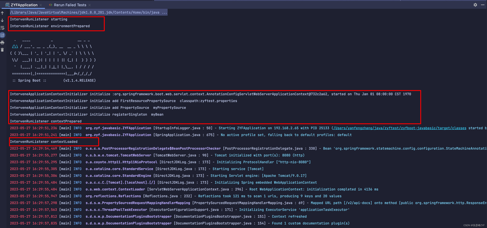
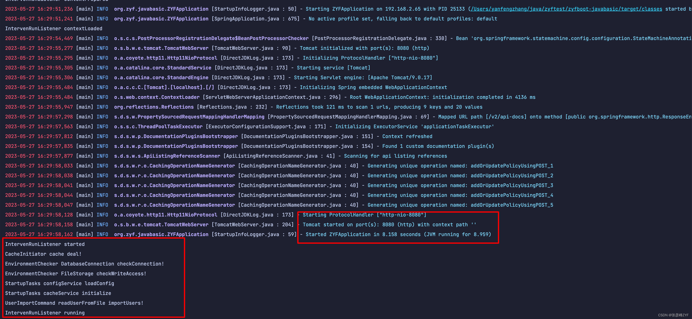
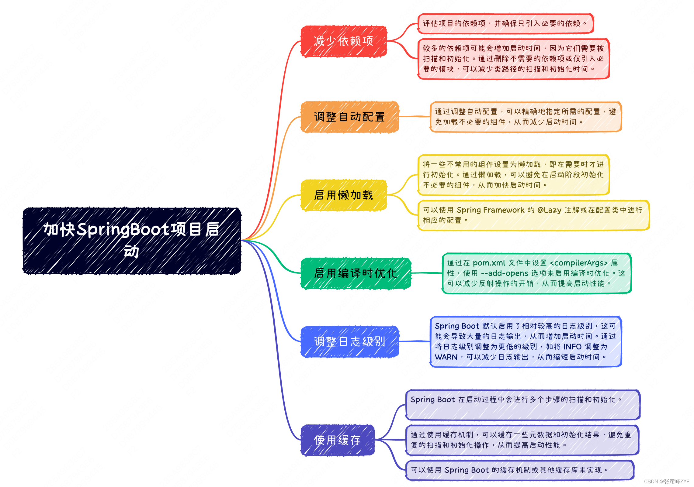

- [SpringBoot启动扩展应用：干预优化+加快启动时间](https://blog.csdn.net/xiaofeng10330111/article/details/105631666)
- [Spring Boot 干预优化+加快启动时间（干货典藏版）](https://mp.weixin.qq.com/s/NF2xjKpu2bpG3XSTDxtY7A)

## 一、SpringBoot启动配置原理简述
本内容直接查看[分析SpringBoot启动配置原理_单块系统](https://zyfcodes.blog.csdn.net/article/details/130903779)对应详细讲解。因为本期的各种优化干预手段都依赖其基本原理，建议在使用前进行阅读。

## 二、SpringBoot启动过程干预
Spring Boot启动过程中我们可以实现以下干预工作：

1. 修改Spring Boot默认的配置属性。使用`@ConfigurationProperties`和`@EnableConfigurationProperties`注解，可以获取和修改Spring Boot的配置属性。

2. 加载配置文件。Spring Boot会自动加载`application.properties`或`application.yml`等配置文件，我们可以在启动时加载其他配置文件。

3. 自定义bean。我们可以通过`@Component`注解创建自定义的bean以及其他的`@SpringBootAnnotation`注解，来实现更灵活的配置和自动化初始化。

4. 执行一些初始化逻辑。我们可以对应用程序的数据库、缓存、MQ等进行初始化，例如创建数据源、初始化缓存等，以确保应用程序正常运行，并且可以通过`ApplicationRunner`和`CommandLineRunner`等干预代码的方式执行这些初始化逻辑。

5. 执行一些后置操作。在Spring Boot应用程序停止后执行一些清理工作，例如关闭数据源、释放缓存等。

这些干预步骤可以在Spring Boot应用程序启动和停止完成后进行，从而实现更灵活的配置和初始化。

### （一）ApplicationContextInitializer扩展
通过实现`ApplicationContextInitializer`接口，我们可以在`ApplicationContext`创建之前对其进行一些定制化的修改。这个接口定义了一个`initialize`方法，接受一个`ConfigurableApplicationContext`对象作为参数，我们可以在这个方法中对这个对象进行修改和配置。

具体来说，我们可以通过`ApplicationContextInitializer`实现以下扩展任务：

1. 修改Spring Boot默认的environment属性。使用`configurableApplicationContext.getEnvironment()`方法获取到environment对象，从而修改环境变量，例如添加自定义配置文件路径。

2. 添加自定义的PropertySource。使用`environment.getPropertySources().addLast(propertySource)`方法，可以添加自定义的属性源，从而实现更灵活的配置。

3. 注册自定义bean。使用`configurableApplicationContext.getBeanFactory().registerSingleton(beanName, bean)`方法，可以注册自定义的bean，从而实现更灵活的依赖注入。

可以添加自定义的`ApplicationContextInitializer`实现类，从而扩展应用程序的初始化逻辑。

总之，通过实现`ApplicationContextInitializer`接口，可以在Spring Boot应用程序启动之前对应用程序进行一些初始化定制化的操作，从而满足开发者对应用程序的特殊需求。

#### 修改Spring Boot默认的environment属性
修改Spring Boot默认的environment属性，例如添加自定义配置文件路径，可以通过实现`ApplicationContextInitializer`接口来完成。下面是一个示例代码，演示如何添加自定义配置文件路径：

```java
package org.zyf.javabasic.springextend.runext;
 
import com.fasterxml.jackson.databind.ObjectMapper;
import org.springframework.beans.factory.config.ConfigurableListableBeanFactory;
import org.springframework.context.ApplicationContextInitializer;
import org.springframework.context.ConfigurableApplicationContext;
import org.springframework.core.env.ConfigurableEnvironment;
import org.springframework.core.env.PropertySource;
import org.springframework.core.io.support.ResourcePropertySource;
 
import java.io.IOException;
 
/**
 * @author yanfengzhang
 * @description 修改Spring Boot默认的environment属性。使用configurableApplicationContext.getEnvironment()方法获取到environment对象，从而修改环境变量，例如添加自定义配置文件路径。
 * @date 2021/2/23  23:48
 */
public class InterveneApplicationContextInitializer implements ApplicationContextInitializer<ConfigurableApplicationContext> {
    @Override
    public void initialize(ConfigurableApplicationContext configurableApplicationContext) {
 
        ConfigurableEnvironment environment = configurableApplicationContext.getEnvironment();
        // 添加自定义配置文件路径
        try {
            ObjectMapper objectMapper = new ObjectMapper();
            System.out.println("InterveneApplicationContextInitializer initialize :" + configurableApplicationContext);
            environment.getPropertySources().addFirst(new ResourcePropertySource("classpath:zyftest.properties"));
            System.out.println("InterveneApplicationContextInitializer initialize add FirstResourcePropertySource  classpath:zyftest.properties");
        } catch (IOException e) {
            e.printStackTrace();
        }
    }
}
```

在上面的代码中，我们通过`getEnvironment()`方法获取到`ConfigurableEnvironment`对象，然后通过`getPropertySources()`方法获取到属性源，使用`addFirst()`方法将自定义的`custom.properties`文件的`PropertySource`添加到属性源的首位。这样，在应用程序启动时，就会首先加载`custom.properties`文件，从而实现了自定义的配置。

需要注意的是，上述代码中的`InterveneApplicationContextInitializer`需要被注册才能生效。可以通过在`src/main/resources/META-INF/spring.factories`文件中指定注册项的方式来注册：

```factories
org.springframework.context.ApplicationContextInitializer=
org.zyf.javabasic.springextend.runext.InterveneApplicationContextInitializer
```

#### 添加自定义的PropertySource
添加自定义的`PropertySource`，可以通过实现`ApplicationContextInitializer`接口来完成。下面是一个示例代码，演示如何添加自定义的`PropertySource`：

```java
package org.zyf.javabasic.springextend.runext;
 
import com.fasterxml.jackson.databind.ObjectMapper;
import org.springframework.beans.factory.config.ConfigurableListableBeanFactory;
import org.springframework.context.ApplicationContextInitializer;
import org.springframework.context.ConfigurableApplicationContext;
import org.springframework.core.env.ConfigurableEnvironment;
import org.springframework.core.env.PropertySource;
import org.springframework.core.io.support.ResourcePropertySource;
 
import java.io.IOException;
 
/**
 * @author yanfengzhang
 * @description 添加自定义的PropertySource。使用environment.getPropertySources().addLast(propertySource)方法，可以添加自定义的属性源，从而实现更灵活的配置。
 * @date 2021/2/23  23:48
 */
public class InterveneApplicationContextInitializer implements ApplicationContextInitializer<ConfigurableApplicationContext> {
    @Override
    public void initialize(ConfigurableApplicationContext configurableApplicationContext) {
        // 添加自定义的PropertySource
        PropertySource<?> propertySource = new MyPropertySource("myPropertySource");
        environment.getPropertySources().addLast(propertySource);
        System.out.println("InterveneApplicationContextInitializer initialize add PropertySource  myPropertySource");
    }
 
    // 自定义PropertySource
    private static class MyPropertySource extends PropertySource<String> {
        private static final String MY_PROPERTY_SOURCE_KEY = "my.property.source.key";
 
        public MyPropertySource(String name) {
            super(name);
        }
 
        @Override
        public Object getProperty(String name) {
            if (MY_PROPERTY_SOURCE_KEY.equals(name)) {
                return "myPropertySourceValue";
            }
            return null;
        }
    }
}
```

在上面的代码中，我们新建了一个名为`MyPropertySource`的自定义`PropertySource`，然后在`initialize`方法中使用`environment.getPropertySources().addLast(propertySource)`方法将其添加到Spring环境中。`MyPropertySource`中实现了一个用于获取属性的`getProperty`方法，在这个方法中，我们指定了一个名为`my.property.source.key`的属性及其对应的值，这样就可以通过`@Value("${my.property.source.key}")`的方式在应用程序中获取到它的值了。

需要注意的是，上述代码中的`InterveneApplicationContextInitializer`需要被注册才能生效。具体如上部分展示，这里不在展示。

#### 注册自定义bean
注册自定义Bean，可以通过实现`ApplicationContextInitializer`接口来完成。下面是一个示例代码，演示如何注册自定义Bean：

```java
package org.zyf.javabasic.springextend.runext;
 
import com.fasterxml.jackson.databind.ObjectMapper;
import org.springframework.beans.factory.config.ConfigurableListableBeanFactory;
import org.springframework.context.ApplicationContextInitializer;
import org.springframework.context.ConfigurableApplicationContext;
import org.springframework.core.env.ConfigurableEnvironment;
import org.springframework.core.env.PropertySource;
import org.springframework.core.io.support.ResourcePropertySource;
 
import java.io.IOException;
 
/**
 * @author yanfengzhang
 * @description 注册自定义bean。使用configurableApplicationContext.getBeanFactory().registerSingleton(beanName, bean)方法，可以注册自定义的bean，从而实现更灵活的依赖注入。
 * @date 2021/2/23  23:48
 */
public class InterveneApplicationContextInitializer implements ApplicationContextInitializer<ConfigurableApplicationContext> {
    @Override
    public void initialize(ConfigurableApplicationContext configurableApplicationContext) {
 
        ConfigurableListableBeanFactory beanFactory = configurableApplicationContext.getBeanFactory();
        // 注册自定义Bean
        MyBean myBean = new MyBean();
        beanFactory.registerSingleton("myBean", myBean);
        System.out.println("InterveneApplicationContextInitializer initialize registerSingleton  myBean");
    }
 
    // 自定义Bean
    private static class MyBean {
        private String name = "myBean";
 
        public String getName() {
            return name;
        }
    }
}
```

在上面的代码中，我们新建了一个名为MyBean的自定义Bean，然后在`initialize`方法中使用`beanFactory.registerSingleton("myBean", myBean)`方法将其注册到Spring应用程序上下文中，"myBean"是注册的bean名称，myBean是实际的类实例对象。

需要注意的是，上述代码中的`InterveneApplicationContextInitializer`需要被注册才能生效。具体如上部分展示，这里不在展示。

### （二）SpringApplicationRunListener扩展
`SpringApplicationRunListener`是Spring Boot的一个事件监听器，用于在应用程序启动和停止时执行一些操作。可能需要自定义`SpringApplicationRunListener`来执行某些特定操作。下面是一个示例，演示如何扩展`SpringApplicationRunListener`以添加自定义操作：

首先，需要实现`SpringApplicationRunListener`接口：

```java
package org.zyf.javabasic.springextend.runext;
 
import org.springframework.boot.SpringApplication;
import org.springframework.boot.SpringApplicationRunListener;
import org.springframework.context.ConfigurableApplicationContext;
import org.springframework.core.env.ConfigurableEnvironment;
 
/**
 * @author yanfengzhang
 * @description SpringApplicationRunListener是Spring Boot的一个事件监听器，用于在应用程序启动和停止时执行一些操作。
 * 可能需要自定义SpringApplicationRunListener来执行某些特定操作。
 * 下面是一个示例，演示如何扩展SpringApplicationRunListener以添加自定义操作
 * @date 2021/2/23  23:44
 */
public class IntervenRunListener implements SpringApplicationRunListener {
 
    private final SpringApplication application;
 
    private final String[] args;
 
    public IntervenRunListener(SpringApplication application, String[] args) {
        this.application = application;
        this.args = args;
    }
 
    @Override
    public void starting() {
        System.out.println("IntervenRunListener starting");
    }
 
    @Override
    public void environmentPrepared(ConfigurableEnvironment environment) {
        System.out.println("IntervenRunListener environmentPrepared");
    }
 
    @Override
    public void contextPrepared(ConfigurableApplicationContext context) {
        System.out.println("IntervenRunListener contextPrepared");
    }
 
    @Override
    public void contextLoaded(ConfigurableApplicationContext context) {
        System.out.println("IntervenRunListener contextLoaded");
    }
 
    @Override
    public void started(ConfigurableApplicationContext context) {
        System.out.println("IntervenRunListener started");
    }
 
    @Override
    public void running(ConfigurableApplicationContext context) {
        System.out.println("IntervenRunListener running");
    }
 
    @Override
    public void failed(ConfigurableApplicationContext context, Throwable exception) {
        System.out.println("IntervenRunListener failed");
    }
}
```

在上述代码中，我们新建了一个名为`IntervenRunListener`的自定义`SpringApplicationRunListener`，并在`starting()`、`environmentPrepared()`、`contextPrepared()`、`contextLoaded()`、`started()`、`running()`和`failed()`方法中添加了自定义操作。

接下来，我们需要告诉Spring Boot使用这个自定义的`SpringApplicationRunListener`，上述代码中的`IntervenRunListener`需要被注册才能生效。可以通过在`src/main/resources/META-INF/spring.factories`文件中指定注册项的方式来注册：

```factories
org.springframework.boot.SpringApplicationRunListener=
org.zyf.javabasic.springextend.runext.IntervenRunListener
```

### （三）ApplicationRunner扩展
`ApplicationRunner`是Spring Boot提供的一种扩展点，它允许在Spring Boot应用程序启动时执行一些预配置操作。这些操作可以包括预热缓存，初始化数据库连接等。以下是一些用途：

- **数据库初始化**：`ApplicationRunner`可以用于执行数据库初始化操作。例如，我们可以在应用程序启动时创建数据库表格，插入初始数据等操作。这对于确保数据库的正确性和可用性非常有用，以及为整个应用程序提供更好的可维护性。

- **缓存预热**：缓存在应用程序中非常重要，它可以大大提高应用程序的性能。但是，由于缓存通常是“懒加载”的，所以在应用程序第一次使用它们时，需要花费一些时间来加载它们。使用`ApplicationRunner`，我们可以在应用程序启动后立即加载缓存，而不是等到应用程序第一次使用它们时加载。这可以大大减少应用程序响应时间，并提高用户体验。

- **环境检查**：为了确保应用程序能够正常运行，我们需要检查它所在的环境是否满足应用程序的要求。例如，我们可能需要检查数据库是否可用，检查文件系统是否可写等。使用`ApplicationRunner`，我们可以在应用程序启动时立即执行这些检查，并在应用程序无法正常运行时采取适当的措施，如打印警告或抛出异常。
总之，`ApplicationRunner`可以用于执行任何需要在应用程序启动时进行的操作。它为应用程序提供了一种简单的扩展点，可以使我们轻松地实现预配置和初始化操作。

以下从缓存预热和环境检查给出简单的代码示例。

#### 缓存预热
在应用程序启动后立即加载缓存，可以避免在应用程序第一次使用缓存时的延迟。以下是一个简单的示例，演示如何使用`ApplicationRunner`在应用程序启动时加载缓存：

```java
package org.zyf.javabasic.springextend.runext;
 
import org.springframework.boot.ApplicationArguments;
import org.springframework.boot.ApplicationRunner;
import org.springframework.stereotype.Component;
 
/**
 * @author yanfengzhang
 * @description 演示如何使用ApplicationRunner在应用程序启动时加载缓存
 * @date 2021/2/23  23:13
 */
@Component
public class CacheInitiator implements ApplicationRunner {
    @Override
    public void run(ApplicationArguments args) throws Exception {
        System.out.println("CacheInitiator cache deal!");
    }
}
```

在应用程序启动时，`ApplicationRunner`接口的run方法将被自动调用，从而将一些初始数据加载到缓存中。当应用程序需要访问缓存时，它们可以立即从缓存中获取数据，而不必等待它们被“懒加载”的时间。这将大大提高应用程序的性能和用户体验。

#### 环境检查
以下是一个简单的示例，演示如何使用`ApplicationRunner`在应用程序启动时执行环境检查:

```java
package org.zyf.javabasic.springextend.runext;
 
import org.springframework.boot.ApplicationArguments;
import org.springframework.boot.ApplicationRunner;
import org.springframework.stereotype.Component;
 
/**
 * @author yanfengzhang
 * @description 演示如何使用ApplicationRunner在应用程序启动时执行环境检查
 * @date 2021/2/23  23:17
 */
@Component
public class EnvironmentChecker implements ApplicationRunner {
    @Override
    public void run(ApplicationArguments args) throws Exception {
        // 检查数据库是否可用
        System.out.println("EnvironmentChecker DatabaseConnection checkConnection! ");
 
        // 检查文件系统是否可写
        System.out.println("EnvironmentChecker FileStorage checkWriteAccess! ");
    }
}
```

在应用程序启动时，`ApplicationRunner`接口的run方法将被自动调用，从而执行环境检查操作。当应用程序无法正常运行时，它们将抛出一个运行时异常，包含适当的错误消息，以帮助我们进行故障排除和修复操作。

### （四）CommandLineRunner扩展
`CommandLineRunner`接口用于在应用程序启动时执行一些命令行操作。这在调试应用程序、自动化部署、初始化系统配置等方面非常有用。

在较复杂的业务场景下，我们可以使用`CommandLineRunner`接口来扩展应用程序。

首先，我们可以将一些常用的业务逻辑封装在命令行工具中，然后在应用程序启动时通过执行这些命令来进行操作。例如，我们可以创建一个名为`UserImportCommand`的命令行工具，用于导入用户数据到应用程序中。在应用程序启动时，可以执行`UserImportCommand`来导入用户数据。

其次，我们可以使用`CommandLineRunner`接口来定制化应用程序的启动过程。例如，我们可以创建一个名为StartupTasks的类，并实现`CommandLineRunner`接口。在run方法中，我们可以执行任何我们需要在应用程序启动时完成的任务，如加载配置文件、初始化缓存等。

最后，我们可以结合使用`ApplicationRunner`和`CommandLineRunner`来完成更复杂的任务。例如，我们可以创建一个名为`InitializationRunner`的类，实现`ApplicationRunner`和`CommandLineRunner`接口，并在其中执行所有初始化任务。这样，在应用程序启动时，不仅可以自动执行初始化任务，还可以通过命令行手动执行这些任务。

综上所述，`CommandLineRunner`接口在业务扩展方面有着广阔的应用前景，在实际业务场景中，可以根据自己的需求进行灵活应用和扩展。

#### 应用举例一：UserImportCommand命令行工具
以下是一个简单的示例，演示如何使用`CommandLineRunner`接口创建一个命令行工具，用于导入用户数据到应用程序中。

```java
package org.zyf.javabasic.springextend.runext;
 
import com.google.common.collect.Lists;
import org.springframework.boot.CommandLineRunner;
import org.springframework.stereotype.Component;
import org.zyf.javabasic.common.User;
 
import java.util.List;
 
/**
 * @author yanfengzhang
 * @description 演示如何使用CommandLineRunner接口创建一个名为UserImportCommand的命令行工具，用于导入用户数据到应用程序中。
 * @date 2021/2/23  23:24
 */
@Component
public class UserImportCommand implements CommandLineRunner {
    @Override
    public void run(String... args) throws Exception {
        List<User> users = readUserFromFile("fileName");
        System.out.println("UserImportCommand readUserFromFile importUsers!");
    }
 
    // 从数据文件中读取用户信息
    private List<User> readUserFromFile(String fileName) {
        // 省略代码，从文件中读取用户信息，返回一个User对象列表
        return Lists.newArrayList();
    }
}
```

在应用程序启动时，`CommandLineRunner`接口的`run`方法将被自动调用，并将命令行参数作为字符串数组传递给`run`方法。


上面展示的时候并没有使用入参，当需要导入用户数据时，可以执行如下命令：
```shell
java -jar myapp.jar user-import users.txt
```

其中，`myapp.jar`是应用程序运行的jar包，`user-import`是命令行工具的名称，`users.txt`是要导入的用户数据文件名。

#### 应用举例二：定制化应用程序的启动过程
可以使用`CommandLineRunner`接口来定制化应用程序的启动过程。下面是一个示例，演示如何使用`CommandLineRunner`来执行一些自定义启动任务：

```java
package org.zyf.javabasic.springextend.runext;
 
import org.springframework.boot.CommandLineRunner;
import org.springframework.stereotype.Component;
 
/**
 * @author yanfengzhang
 * @description 演示如何使用CommandLineRunner来执行一些自定义启动任务
 * @date 2021/2/23  23:31
 */
@Component
public class StartupTasks implements CommandLineRunner {
    @Override
    public void run(String... args) throws Exception {
        // 加载应用程序配置
        System.out.println("StartupTasks configService loadConfig");
 
        // 初始化缓存
        System.out.println("StartupTasks cacheService initialize");
    }
}
```

在应用程序启动时，`CommandLineRunner`接口的`run`方法将被自动调用，并且我们的自定义启动任务将会被执行。通过使用`CommandLineRunner`接口，我们可以执行任何自定义的启动任务，以满足特定的应用程序需求。

### （五）所有扩展验证
验证以上配置是否生效很简单，只需要启动程序查看打印效果即可，以下给出一些基本的展示效果：





## 三、加快SpringBoot项目启动
公司级大多数SpringBoot 项目在日常开发过程中发现服务启动过程异常缓慢，常常需要4-7分钟才能暴露端口，有的时候甚至在十分钟左右，严重降低开发效率。



若要优化 Spring Boot 程序的启动时间以缩短启动时间，可以考虑以下几个方面的优化措施：

1. 减少依赖项：评估项目的依赖项，并确保只引入必要的依赖。较多的依赖项可能会增加启动时间，因为它们需要被扫描和初始化。通过删除不需要的依赖项或仅引入必要的模块，可以减少类路径的扫描和初始化时间。

2. 调整自动配置：Spring Boot 的自动配置是一个强大的特性，但有时可能会引入不必要的组件和功能。通过调整自动配置，可以精确地指定所需的配置，避免加载不必要的组件，从而减少启动时间。

3. 启用懒加载：将一些不常用的组件设置为懒加载，即在需要时才进行初始化。通过懒加载，可以避免在启动阶段初始化不必要的组件，从而加快启动时间。可以使用 Spring Framework 的 `@Lazy` 注解或在配置类中进行相应的配置。

4. 启用编译时优化：使用 Spring Boot 2.4 及更高版本，你可以通过启用编译时优化来加快启动时间。通过在 `pom.xml` 文件中设置 `<compilerArgs>` 属性，使用 `--add-opens` 选项来启用编译时优化。这可以减少反射操作的开销，从而提高启动性能。

5. 调整日志级别：Spring Boot 默认启用了相对较高的日志级别，这可能会导致大量的日志输出，从而增加启动时间。通过将日志级别调整为更低的级别，如将 INFO 调整为 WARN，可以减少日志输出，从而缩短启动时间。

6. 使用缓存：Spring Boot 在启动过程中会进行多个步骤的扫描和初始化。通过使用缓存机制，可以缓存一些元数据和初始化结果，避免重复的扫描和初始化操作，从而提高启动性能。可以使用 Spring Boot 的缓存机制或其他缓存库来实现。

这些是一些常见的优化措施，可以帮助缩短 Spring Boot 程序的启动时间。然而，优化的效果取决于具体的应用程序和场景，因此建议根据实际情况进行评估和测试。

### （一）减少依赖项以缩短启动时间
#### 减少依赖项具体的分析和说明

- **评估依赖项**：首先，需要仔细评估项目的依赖项。查看项目的 `pom.xml`（如果使用Maven）或 `build.gradle`（如果使用Gradle）文件，以了解所有引入的依赖项。检查每个依赖项的用途和必要性。

- **删除不需要的依赖项**：确定哪些依赖项是不需要的或没有被项目使用的。这些无用的依赖项可能会增加类路径的扫描和初始化时间，从而拖慢启动过程。可以通过移除或注释掉不需要的依赖项来减少不必要的加载和初始化。

- **仅引入必要的模块**：对于一些大型的依赖项，例如Spring Boot的模块，可以根据项目的需求仅引入必要的模块。Spring Boot提供了模块化的方式，允许你选择性地引入只需要的模块。通过仅引入必要的模块，可以减少初始化过程中的扫描和加载时间。

- **排除不必要的传递依赖项**：一些依赖项会引入其他的传递依赖项。如果这些传递依赖项不是项目所需的，可以通过在依赖项的配置中排除它们来减少类路径的扫描和初始化。这可以通过在项目的构建文件中配置`<exclusions>`标签来实现。

- **使用更轻量级的替代方案**：有时，某个依赖项可能有较重的启动开销。在评估依赖项时，可以考虑使用更轻量级的替代方案，以减少启动时间。例如，对于某个功能或工具库，可能有多个不同的实现可供选择，可以选择具有较轻量级的实现。

总的来说，通过评估和优化项目的依赖项，可以减少不必要的加载和初始化过程，从而减少启动时间。这需要仔细分析每个依赖项的用途，并确保只引入必要的依赖项和模块。同时，需要保持项目的功能完整性和正确性，确保删除的依赖项不会影响项目的正常运行。

#### 减少依赖项案例分析

当涉及到减少依赖项以缩短启动时间的案例分析，我们以一个简单的Web应用为例，假设我们有一个基于Spring Boot的Web应用，该应用使用了以下依赖项：

- `spring-boot-starter-web`：用于构建Web应用程序的基本依赖项。
- `spring-boot-starter-data-jpa`：用于与数据库进行交互的依赖项。
- `spring-boot-starter-security`：用于添加安全性功能的依赖项。
- `spring-boot-starter-test`：用于测试的依赖项。

在评估这些依赖项后，我们注意到以下情况：

1. 项目中并没有使用与数据库交互的功能，因此 `spring-boot-starter-data-jpa` 可能是不必要的依赖项。

2. 在项目中并没有实现任何安全性功能，因此 `spring-boot-starter-security` 也可能是不必要的依赖项。

基于以上分析，我们可以采取以下措施来优化启动时间：

1. 删除不需要的依赖项：从项目的构建文件（如pom.xml）中删除不需要的依赖项，即 `spring-boot-starter-data-jpa` 和 `spring-boot-starter-security`。

2. 清理类路径扫描和初始化：由于删除了不必要的依赖项，应用程序在启动时不再需要扫描和初始化与数据库和安全性相关的组件，从而减少启动时间。

3. 进行相关测试：在进行以上更改后，确保对应用程序进行全面的测试，以确保没有因删除依赖项而引起的不可预料的问题。

通过这样的优化措施，我们可以减少应用程序的启动时间，特别是在大型项目中，当引入了大量不必要的依赖项时，效果会更为显著。然而，需要注意，每个项目都有其特定的依赖项和功能需求，因此优化策略可能会有所不同。

### （二）调整自动配置以缩短启动时间
#### 调整自动配置具体分析说明

- **了解自动配置机制**：首先，了解 Spring Boot 的自动配置机制是很重要的。Spring Boot 使用条件化配置来根据项目的依赖和配置来自动决定哪些组件应该被加载和配置。条件注解（如 `@ConditionalOnClass`、`@ConditionalOnProperty` 等）用于根据特定的条件来决定组件是否应该被自动配置。

- **检查自动配置类**：查看自动配置类，了解每个自动配置类所做的配置和加载的组件。可以在 Spring Boot 的官方文档或源代码中找到自动配置类的详细信息。对于不必要的组件，可以尝试找到对应的自动配置类并进行分析。

- **排除不必要的自动配置**：通过使用 `@EnableAutoConfiguration` 注解的 `exclude` 属性，可以排除不需要的自动配置类。这可以在主应用程序类上进行配置。通过排除不必要的自动配置类，可以避免加载不需要的组件和功能，从而减少启动时间。

- **自定义自动配置**：如果发现某个自动配置类加载了不必要的组件，但又需要其他配置，可以自定义自动配置类。通过创建一个带有 `@Configuration` 注解的配置类，并在其中指定所需的配置，可以覆盖默认的自动配置。这样可以精确地指定所需的配置，避免加载不必要的组件。

- **配置条件**：有些自动配置类提供了条件注解，可以使用这些条件注解来根据项目的需求进行配置。例如，使用 `@ConditionalOnProperty` 注解可以根据配置属性的值来决定是否应用该自动配置。通过合理配置这些条件，可以避免加载不必要的组件。

通过调整自动配置，可以精确地指定所需的配置，避免加载不必要的组件和功能，从而减少启动时间。需要注意的是，在调整自动配置时，确保对应用程序进行全面的测试，以确保所需的功能和组件仍然正常工作。

#### 调整自动配置案例分析

假设我们有一个基于Spring Boot的Web应用，该应用使用了以下自动配置：

- `spring-boot-starter-web`：用于构建Web应用程序的基本自动配置。
- `spring-boot-starter-data-jpa`：用于与数据库进行交互的自动配置。
- `spring-boot-starter-security`：用于添加安全性功能的自动配置。

在评估这些自动配置后，我们注意到以下情况：

1. 项目中并没有使用与数据库交互的功能，因此 `spring-boot-starter-data-jpa` 可能是不必要的自动配置。
2. 在项目中并没有实现任何安全性功能，因此 `spring-boot-starter-security` 也可能是不必要的自动配置。

基于以上分析，我们可以采取以下措施来优化启动时间：

1. 排除不必要的自动配置：在主应用程序类上使用 `@EnableAutoConfiguration` 注解的 `exclude` 属性，排除 `spring-boot-starter-data-jpa` 和 `spring-boot-starter-security` 的自动配置。

```java
@SpringBootApplication(exclude = {DataJpaAutoConfiguration.class, SecurityAutoConfiguration.class})
public class MyApplication {
    // ...
}
```

2. 自定义自动配置：如果需要其他的配置，可以创建一个自定义的自动配置类，并在其中指定所需的配置。例如，对于与数据库交互的功能，可以创建一个自定义的配置类，仅包含必要的配置项。

```java
@Configuration
public class CustomDataJpaAutoConfiguration {
    // ...
}
```

通过以上优化措施，我们排除了不必要的自动配置，并自定义了所需的配置，避免加载不必要的组件和功能，从而减少启动时间。这种方式可以根据项目的实际需求灵活调整自动配置，以提高启动性能。然而，需要注意，在进行以上更改后，确保对应用程序进行全面的测试，以确保所需的功能和组件仍然正常工作。

### （三）启用懒加载以缩短启动时间
#### 启用懒加载具体分析说明

启用懒加载是一种有效的方法来减少启动时间，只有在需要时才初始化不常用的组件。以下是具体分析说明：

- **确定需要懒加载的组件**：仔细评估项目中的组件，并确定哪些组件是不常用的，可以延迟加载。这些组件可能包括大型的第三方库、复杂的初始化过程或与特定功能相关的组件。

- **使用 @Lazy 注解**：在需要懒加载的组件上使用 Spring Framework 的 `@Lazy` 注解。将 `@Lazy` 注解应用于组件的声明处，以指示该组件应该在需要时才进行初始化。例如：

```java
@Component
@Lazy
public class MyLazyComponent {
    // ...
}
```

- **在配置类中进行配置**：如果你使用的是配置类来进行组件的配置，你可以在配置类的方法上使用` @Lazy` 注解，将需要懒加载的组件进行标记。例如：

```java
@Configuration
public class MyConfig {
    @Bean
    @Lazy
    public MyLazyComponent myLazyComponent() {
        return new MyLazyComponent();
    }
}
```

- **重新构建和运行应用程序**：保存更改后，重新构建并运行应用程序。在启动过程中，被标记为懒加载的组件将不会立即初始化，只有在首次访问时才会进行初始化。这样可以避免启动阶段初始化不必要的组件，从而加快启动时间。

通过启用懒加载，可以延迟初始化不常用的组件，减少启动时间。这在项目中特别适用于那些具有复杂初始化过程或与特定功能相关的组件。需要注意的是，懒加载的组件在第一次访问时可能会引入额外的延迟，因此在评估和标记组件时要权衡性能和实际需求。

总结起来，通过使用 Spring Framework 的 `@Lazy` 注解或在配置类中进行相应的配置，可以启用懒加载，从而在需要时才初始化不常用的组件，加快应用程序的启动时间。

#### 启用懒加载案例分析

假设我们有一个基于 Spring Boot 的电子商务应用程序，其中包含一些复杂的服务和组件。我们注意到启动时间较长，并且发现其中一个原因是某些组件的初始化过程相对较慢。

在进一步分析后，我们确定以下组件是不常用的，并且可以通过懒加载来延迟初始化：

- `PaymentService`：用于处理支付的服务组件。
- `SearchService`：用于执行商品搜索的服务组件。

这两个组件在启动时不是必需的，因为它们只在用户执行特定操作时才会被使用。

我们可以使用 Spring Framework 的` @Lazy` 注解来标记这些组件，将它们设置为懒加载。

```java
@Service
@Lazy
public class PaymentService {
    // ...
}
 
@Service
@Lazy
public class SearchService {
    // ...
}
```

通过在组件的声明处添加 `@Lazy` 注解告诉 Spring 框架在需要使用这些组件时才进行初始化。

重新构建并运行应用程序后，启动阶段将不会立即初始化 `PaymentService` 和 `SearchService` 组件。只有当用户执行相关操作时，才会触发它们的初始化。这样可以减少启动时间，并且在应用程序启动后，只有真正需要时才会占用资源。

需要注意的是，在标记组件为懒加载时，确保仔细评估其对应用程序功能的影响。确保懒加载的组件在实际使用时能够正确地被初始化，并且不会导致功能上的问题。

### （四）启用编译时优化以缩短启动时间
启用编译时优化是一种有效的方法来加快 Spring Boot 应用程序的启动时间，特别是在使用 Spring Boot 2.4 及更高版本时。以下是具体的分析和说明：

- 确认使用的 Spring Boot 版本：确保你的项目使用的是 Spring Boot 2.4 或更高版本。编译时优化功能是在 Spring Boot 2.4 中引入的。
- 配置 `pom.xml` 文件：在项目的 `pom.xml` 文件中，找到 `<build>` 元素，并在其中的 `<plugins>` 元素下添加 Maven Compiler 插件配置。在 Maven Compiler 插件配置中，使用 `<compilerArgs>` 属性来设置编译器选项。

```xml
<build>
    <plugins>
        <plugin>
            <groupId>org.apache.maven.plugins</groupId>
            <artifactId>maven-compiler-plugin</artifactId>
            <configuration>
                <compilerArgs>
                    <arg>--add-opens</arg>
                    <arg>java.base/java.lang=ALL-UNNAMED</arg>
                    <arg>--add-opens</arg>
                    <arg>java.base/java.util=ALL-UNNAMED</arg>
                    <!-- 添加其他需要的 &#45;&#45;add-opens 选项 -->
                </compilerArgs>
            </configuration>
        </plugin>
    </plugins>
</build>
```

在 `<compilerArgs>` 属性中，我们使用 `--add-opens` 选项来指定需要开放的包和模块。上述示例中，我们设置了两个 `--add-opens` 选项，分别是 `java.lang` 和 `java.util` 包。你还可以根据需要添加其他的 `--add-opens` 选项，以开放其他需要的包和模块。

- 重新构建应用程序：保存更改后，重新构建应用程序。在编译过程中，编译器将使用指定的编译器选项，启用编译时优化。
启用编译时优化可以减少反射操作的开销，从而提高应用程序的启动性能。它通过使用 `--add-opens` 选项来开放特定的包和模块，使得一些反射操作可以直接访问，而无需通过反射 API。

需要注意的是，编译时优化可能会因为项目的具体情况而有所不同。在应用该优化时，需要进行测试和评估，确保应用程序在启用编译时优化后仍然能够正常运行。

总结起来，通过在 `pom.xml` 文件中配置 Maven Compiler 插件，使用 `<compilerArgs>` 属性设置 `--add-opens` 选项，可以启用编译时优化来加快 Spring Boot 应用程序的启动时间。根据项目的需求，你可以添加其他需要的 `--add-opens` 选项，以满足特定的优化需求。

### （五）调整日志级别以缩短启动时间
调整日志级别是一种简单而有效的方法来减少启动时间，特别是当应用程序的日志输出量较大时。以下是具体的分析和说明：

- **确定适当的日志级别**：仔细评估你的应用程序，并确定适当的日志级别。通常，将日志级别从较高的级别（如 `DEBUG` 或 `INFO`）调整为较低的级别（如 `WARN` 或 `ERROR`）是一种常见的优化策略。较低的日志级别会减少输出的日志消息数量。

- **配置日志级别**：在 Spring Boot 应用程序的配置文件（如 `application.properties` 或 `application.yml`）中，找到与日志相关的配置项。根据你使用的日志框架（如 Logback、Log4j2 或 JUL），进行相应的配置。例如，对于 Logback，你可以在 `application.properties` 文件中添加以下配置：

```properties
logging.level.root=WARN
```

或者在 `application.yml` 文件中添加以下配置：

```yaml
logging:
  level:
    root: WARN
```

这将将根日志记录器的级别设置为 `WARN`，从而只输出 `WARN` 级别及以上的日志消息。

- **重新构建和运行应用程序**：保存更改后，重新构建并运行应用程序。在启动过程中，日志框架将根据配置的日志级别来决定是否输出特定级别的日志消息。通过将日志级别调整为较低的级别，可以减少输出的日志消息数量，从而加快启动时间。

需要注意的是，调整日志级别可能会导致在应用程序运行时缺少某些重要的日志信息。因此，在进行日志级别调整时，应权衡性能和需要的日志信息，并确保不会影响应用程序的正常运行和故障排查。

总结起来，通过将日志级别调整为较低的级别，如将 `INFO` 调整为 `WARN`，可以减少日志输出量，从而缩短应用程序的启动时间。在调整日志级别时，需要确保仍能获取到足够的日志信息以满足应用程序的需求。

### （六）使用缓存以缩短启动时间
使用缓存是一种有效的方法来提高 Spring Boot 应用程序的启动性能。通过缓存一些元数据和初始化结果，可以避免重复的扫描和初始化操作，从而减少启动时间。以下是具体的分析和说明：

使用 Spring Boot 的缓存机制：Spring Boot 提供了内置的缓存机制，可以通过使用 `@EnableCaching` 注解来启用缓存功能。在需要缓存的组件或方法上添加 `@Cacheable` 注解，以指示该组件或方法的结果应该被缓存。

```java
@EnableCaching
@SpringBootApplication
public class MyApplication {
    // ...
}
 
@Service
public class MyService {
    @Cacheable("myCache")
    public MyData getData(String key) {
        // 从数据库或其他地方获取数据
        // ...
    }
}
```

在上述示例中，我们通过在 `MyService` 的 `getData()` 方法上添加 `@Cacheable("myCache") `注解，指定该方法的结果应该被缓存，并使用名为 "myCache" 的缓存区域。通过缓存结果，当多次调用 `getData()` 方法时，如果相同的参数值被传递进来，将会直接从缓存中获取结果，而不需要重复的数据获取操作。

使用其他缓存库：除了使用 Spring Boot 的缓存机制外，你还可以选择使用其他的缓存库，如 `Ehcache`、`Redis` 或 `Caffeine`。这些缓存库提供了更高级的缓存功能和配置选项，可以满足更复杂的需求。例如，使用 `Ehcache` 作为缓存库，你可以在应用程序的配置文件中配置 `Ehcache` 缓存：

```xml
<dependency>
    <groupId>org.ehcache</groupId>
    <artifactId>ehcache</artifactId>
</dependency>
```

然后，在需要缓存的方法上使用 `Ehcache` 注解，如 `@org.ehcache.Cacheable`。使用其他缓存库时，需要根据库的文档和配置方式来进行相应的设置和使用。
无论是使用 Spring Boot 的缓存机制还是其他缓存库，通过缓存一些元数据和初始化结果，可以避免重复的扫描和初始化操作，从而减少启动时间。但需要注意的是，在使用缓存时，要确保缓存的数据和结果的一致性，并考虑缓存的过期策略和清理机制，以避免缓存数据过时或占用过多内存。

总结起来，使用缓存是一种优化启动时间的有效方法。可以使用 Spring Boot 的缓存机制或其他缓存库来实现缓存功能，并根据具体需求和库的使用方式进行配置和使用。通过缓存一些元数据和初始化结果，可以避免重复操作，提高应用程序的启动性能。
