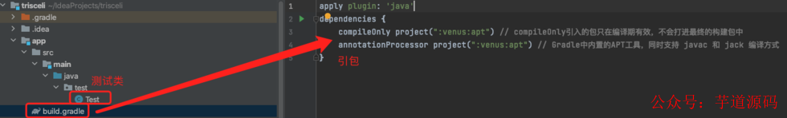

- [项目终于用上了插入式注解，真香！](https://mp.weixin.qq.com/s/_t7M962bM0QIsFY0yX_7DA)
- [优雅实现多系统一致性补偿方案](https://mp.weixin.qq.com/s/SjQ8AeaCxueHw0kuinRVHQ)

插入式注解处理器在《深入理解Java虚拟机》一书中有一些介绍（前端编译篇有提到），但一直没有机会使用，直到碰到这个需求，觉得再合适不过了，就简单用了一下，这里做个记录。

了解过lombok底层原理的都知道其使用的就是的插入式注解，那么今天笔者就以真实场景演示一下插入式注解的使用。

## 需求
我们为公司提供了一套通用的JAVA基础组件包，组件包内有不同的模块，比如熔断模块、负载均模块、rpc模块等等，这些模块均会被打成jar包，然后发布到公司的内部代码仓库中，供其他人引入使用。

这份代码会不断的迭代，我们希望可以通过promethus来监控现在公司内使用各版本代码库的比例，希望达到的效果图如下：


我们希望看到每一个版本的使用率，这有利于我们做版本兼容，必要的时候可以对古早版本使用者溯源。

## 问题
需求似乎很简单，但真要获取自身的jar版本号还是挺麻烦的，有个比较简单但阴间的办法，就是给每一个组件都加上当前的jar版本号，写到配置文件里或者直接设置成常量，这样上报promethus时就可以直接获取到jar包版本号了，这个方法虽然可以解决问题，但每次迭代版本都要跟着改一遍所有组件包的版本号数据，过于麻烦。

有没有更好的解决办法呢？比如我们可不可以在gradle打包构建时拿到jar包的版本号，然后注入到每个组件中去呢？就像lombok那样，不需要写get、set方法，只需要加个注解标记就可以自动注入get、set方法。

比如我们可以给每个组件定义一个空常量，加上自定义的注解：
```java
@TrisceliVersion
public static final String version = "";
```

然后像lombok生成set/get方法那样注入真正的版本号：
```java
@TrisceliVersion
public static final String version = "1.0.31-SNAPSHOT";
```

参考lombok的实现，这其实是可以做到的，下面来看解决方案。


## 解决
java中解析一个注解的方式主要有两种：编译期扫描、运行期反射，这是lombok @Setter的实现：
```java
@Target({ElementType.FIELD, ElementType.TYPE})
@Retention(RetentionPolicy.SOURCE)
public @interface Setter {
   // 略...
}
```

可以看到@Setter的Retention是SOURCE类型的，也就是说这个注解只在编译期有效，它甚至不会被编入class文件，所以lombok无疑是第一种解析方式，那用什么方式可以在编译期就让注解被解析到并执行我们的解析代码呢？答案就是定义插入式注解处理器（通过JSR-269提案定义的Pluggable Annotation Processing API实现）

插入式注解处理器的触发点如下图所示：


也就是说插入式注解处理器可以帮助我们在编译期修改抽象语法树（AST）！所以现在我们只需要自定义一个这样的处理器，然后其内部拿到jar版本信息（因为是编译期，可以找到源码的path，源码里随便搞个文件存放版本号，然后用java io读取进来即可），再将注解对应语法树上的常量值设置成jar包版本号，语法树变了，最终生成的字节码也会跟着变，这样就实现了我们想在编译期给常量version注入值的愿望。

自定义一个插入式注解处理器也很简单，首先要将自己的注解定义出来：
```java
@Documented
@Retention(RetentionPolicy.SOURCE) //只在编译期有效，最终不会打进class文件中
@Target({ElementType.FIELD}) //仅允许作用于类属性之上
public @interface TrisceliVersion {
}
```

然后定义一个继承了AbstractProcessor的处理器：

```java
/**
 * {@link AbstractProcessor} 就属于 Pluggable Annotation Processing API
 */
public class TrisceliVersionProcessor extends AbstractProcessor {

    private JavacTrees javacTrees;
    private TreeMaker treeMaker;
    private ProcessingEnvironment processingEnv;

    /**
     * 初始化处理器
     *
     * @param processingEnv 提供了一系列的实用工具
     */
    @SneakyThrows
    @Override
    public synchronized void init(ProcessingEnvironment processingEnv) {
        super.init(processingEnv);
        this.processingEnv = processingEnv;
        this.javacTrees = JavacTrees.instance(processingEnv);
        Context context = ((JavacProcessingEnvironment) processingEnv).getContext();
        this.treeMaker = TreeMaker.instance(context);
    }


    @Override
    public SourceVersion getSupportedSourceVersion() {
        return SourceVersion.latest();
    }

    @Override
    public Set<String> getSupportedAnnotationTypes() {
        HashSet<String> set = new HashSet<>();
        set.add(TrisceliVersion.class.getName()); // 支持解析的注解
        return set;
    }

    @Override
    public boolean process(Set<? extends TypeElement> annotations, RoundEnvironment roundEnv) {
        for (TypeElement t : annotations) {
            for (Element e : roundEnv.getElementsAnnotatedWith(t)) { // 获取到给定注解的element（element可以是一个类、方法、包等）
                // JCVariableDecl为字段/变量定义语法树节点
                JCTree.JCVariableDecl jcv = (JCTree.JCVariableDecl) javacTrees.getTree(e);
                String varType = jcv.vartype.type.toString();
                if (!"java.lang.String".equals(varType)) { // 限定变量类型必须是String类型，否则抛异常
                    printErrorMessage(e, "Type '" + varType + "'" + " is not support.");
                }
                jcv.init = treeMaker.Literal(getVersion()); // 给这个字段赋值，也就是getVersion的返回值
            }
        }
        return true;
    }

    /**
     * 利用processingEnv内的Messager对象输出一些日志
     *
     * @param e element
     * @param m error message
     */
    private void printErrorMessage(Element e, String m) {
        processingEnv.getMessager().printMessage(Diagnostic.Kind.ERROR, m, e);
    }

    private String getVersion() {
        /**
         * 获取version，这里省略掉复杂的代码，直接返回固定值
         */
        return "v1.0.1";
    }
```
定义好的处理器需要SPI机制被发现，所以需要定义META.services：


## 测试
新建测试模块，引入刚才写好的代码包：



这是Test类：


现在我们只需要让gradle build一下，新得到的字节码中该字段就有值了：


这只是插入式注解处理器 功能的冰山一角，既然它可以通过修改抽象语法树来控制生成的字节码，那么自然就有人能充分利用其特性来实现一些很酷的插件，比如lombok，我们再也不用写诸如set/get这种模板式的代码了，只要我们足够有创意，就可以让基于这一套API实现的插件在功能上有很大的发挥空间。
