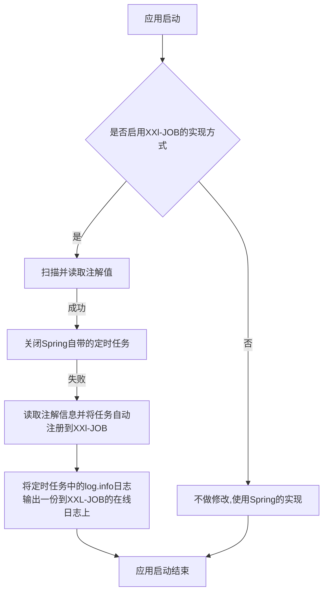
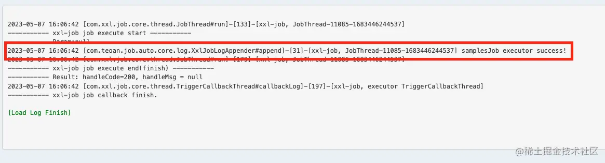

- [实现Spring定时任务与XXL-JOB灵活切换](https://juejin.cn/post/7247810665241755703)
- [Spring定时任务与XXL-JOB灵活切换](https://mp.weixin.qq.com/s/U1EF8sBZJWCNfQVtAcJz4g)

## 背景

在使用XXL—JOB的实现定时任务过程中，有时候可能由于部署环境的要求，就只能用Spring自带的实现方式。

所以为了通用性和灵活性，突发奇想地看看能不能实现在不修改原本Spring定时任务代码的前提下，通过配置灵活控制定时任务具体的实现，同时任务的日志的管理也要同步进行切换。

## 分析并列出需要解决的问题思路

根据需求背景可以初步分析实现的大致方向和实现流程。实现的思路其实不复杂，重点在于如何具体去实现落地。



## 具体实现

### 判断是否启用XXl-JOB的实现方式

和大多数第三方starter包一样，我们可以利用SpringBoot的自动装配，读取配置中的某个属性值，作为是否装配我们写的类。特别注意的是SpringBoot不同版本的配置方式有所不同。自动装配类如下：

```java
/**
 * 自动装配类
 *
 * @author Teoan
 * @since 2023/04/18 10:18
 */
@Configuration
@ConditionalOnProperty(name = "xxl.job.enable",havingValue = "true")
@ComponentScan("com.teoan.job.auto.core")
public class XxlJobAutoConfiguration {
}
```

这里我们根据`xxl.job.enable` 的值，决定是否启用XXl-JOB的实现方式，如果`xxl.job.enable` 为`false`，则就什么都不装配不修改实现方式，默认就是Spring自带的实现方式。

### 扫描并读取注解值

熟悉SpringBoot的的朋友都应该知道，SpringBoot启动的时候，会去扫描目标注解，然后去做对应的初始化操作，比如@Service，@Component就是使被扫描到并将对应的类注入到Spring容器中。所以我们可以按照相同的思路，可以在应用启动就绪之后，扫描@Scheduled注解，对其进行对应的操作。

#### Spring中的@EventListener注解

Spring中使用`@EventListener`标记某个方法为应用监听事件的处理逻辑，还能配合异步注解`@Async`实现异步触发，`@EventListener`通过传值的方式设置需要被监听的事件类型，比如应用启动时、应用就绪时、启动失败时等，具体有哪些监听的事件，可以参考Spring源码包`org.springframework.boot.context.event`。现在，我们可以利用Spring提供的监听注解，在应用启动就绪后，扫描对应注解，去实现我们的代码逻辑，同时为了不影响程序的正常启动速度，使用异步执行的方式。伪代码如下：

```java
@Component
@Slf4j
public class JobAutoRegister {
    @EventListener(ApplicationReadyEvent.class)
    @Async
    public void onApplicationEvent(ApplicationReadyEvent event) {
        // 执行扫描注解，自动注册xxl-job任务逻辑
    }
}
```

#### 扫描并获取被@Scheduled标记的方法和对象

我们知道，使用`@Scheduled`注解对应的对象，必须是被Spring所托管的类，定时任务才会生效，所以我们可以扫描被`@Component`标记的类，再定位`@Scheduled`注解，获取对应的值、对象、方法等信息。伪代码如下：

```java
private void addJobInfo() {
        List<Object> beanList = applicationContext.getBeansWithAnnotation(Component.class).values().stream().toList();
        beanList.forEach(bean -> {
            Map<Method, Scheduled> annotatedMethods = MethodIntrospector.selectMethods(bean.getClass(),
                    (MethodIntrospector.MetadataLookup<Scheduled>) method -> AnnotatedElementUtils.findMergedAnnotation(method, Scheduled.class));
            annotatedMethods.forEach((k, v) -> {
                // 停止Spring自带的定时任务

                // 自动注册到xxl-job任务 

                // 注册xxl-job的任务

            });
        });
    }
```

### 关闭Spring自带的定时任务

`ScheduledAnnotationBeanPostProcessor`类是一个Spring框架的类，用于处理`@Scheduled`注解，实现定时任务的功能。我们可以通过这个类，对Spring中的定时任务进行一定的操作。通过阅读Spring源码，发现`ScheduledAnnotationBeanPostProcessor`有这么一个方法`postProcessBeforeDestruction`， 该方法实现`DestructionAwareBeanPostProcessor`接口，用于销毁一个`Bean`的前置操作，而在`ScheduledAnnotationBeanPostProcessor`类中，这个方法的实现是取消某个`Bean`中的所有定时任务。具体可以看一下这个方法的源码。
```java
@Override
  public void postProcessBeforeDestruction(Object bean, String beanName) {
    Set<ScheduledTask> tasks;
    synchronized (this.scheduledTasks) {
      tasks = this.scheduledTasks.remove(bean);
    }
    if (tasks != null) {
      for (ScheduledTask task : tasks) {
        task.cancel();
      }
    }
  }
```

由于我们上一步已经扫描获取到被`@Scheduled`注解标记过方法，我们可以直接通过方法对象，获取到对应的`Bean`，将`Bean`作为入参传入`postProcessBeforeDestruction`方法中，关闭Spring自带的定时任务。

```java
/**
     * 停止Spring自带的定时注解
     *
     * @param clazz 带有定时注解的类
     */
    private void stopScheduled(Class<?> clazz) {
        ScheduledAnnotationBeanPostProcessor processor = (ScheduledAnnotationBeanPostProcessor) applicationContext
                .getBean("org.springframework.context.annotation.internalScheduledAnnotationProcessor");
        processor.postProcessBeforeDestruction(applicationContext.getBean(clazz), "");
    }
```

### 读取注解信息并将任务自动注册到XXl-JOB

有使用过XXL-JOB的小伙伴都清楚，在使用方法模式时，除了使用注解标记定时任务的方法，还需要在调度中心上进行任务的配置，定时任务才会生效。目前我们已经获取到 `@Scheduled` 注解的信息，我们可以将 `@Scheduled` 所带的信息转换为对应XXL-JOB上对应的任务类型，在启动的时候自动地注册到调度中心，简化XXl-JOB任务调度的使用配置步骤。

#### 注册JobHandler

翻看XXl-JOB中关于 `@XxlJob` 的源码，发现会将`@XxlJob`所标记的方法，向调度中心注册一个`MethodJobHandler`类型的`JobHandler`，表示方法模式对应的处理器。入口代码及位置如下

> `com.xxl.job.core.executor.impl.XxlJobSpringExecutor#initJobHandlerMethodRepository`

```java
protected void registJobHandler(XxlJob xxlJob, Object bean, Method executeMethod){
        if (xxlJob == null) {
            return;
        }

        String name = xxlJob.value();
        //make and simplify the variables since they'll be called several times later
        Class<?> clazz = bean.getClass();
        String methodName = executeMethod.getName();
        if (name.trim().length() == 0) {
            throw new RuntimeException("xxl-job method-jobhandler name invalid, for[" + clazz + "#" + methodName + "] .");
        }
        if (loadJobHandler(name) != null) {
            throw new RuntimeException("xxl-job jobhandler[" + name + "] naming conflicts.");
        }

        // execute method
        /*if (!(method.getParameterTypes().length == 1 && method.getParameterTypes()[0].isAssignableFrom(String.class))) {
            throw new RuntimeException("xxl-job method-jobhandler param-classtype invalid, for[" + bean.getClass() + "#" + method.getName() + "] , " +
                    "The correct method format like \" public ReturnT<String> execute(String param) \" .");
        }
        if (!method.getReturnType().isAssignableFrom(ReturnT.class)) {
            throw new RuntimeException("xxl-job method-jobhandler return-classtype invalid, for[" + bean.getClass() + "#" + method.getName() + "] , " +
                    "The correct method format like \" public ReturnT<String> execute(String param) \" .");
        }*/

        executeMethod.setAccessible(true);

        // init and destroy
        Method initMethod = null;
        Method destroyMethod = null;

        if (xxlJob.init().trim().length() > 0) {
            try {
                initMethod = clazz.getDeclaredMethod(xxlJob.init());
                initMethod.setAccessible(true);
            } catch (NoSuchMethodException e) {
                throw new RuntimeException("xxl-job method-jobhandler initMethod invalid, for[" + clazz + "#" + methodName + "] .");
            }
        }
        if (xxlJob.destroy().trim().length() > 0) {
            try {
                destroyMethod = clazz.getDeclaredMethod(xxlJob.destroy());
                destroyMethod.setAccessible(true);
            } catch (NoSuchMethodException e) {
                throw new RuntimeException("xxl-job method-jobhandler destroyMethod invalid, for[" + clazz + "#" + methodName + "] .");
            }
        }

        // 核心方法
        registJobHandler(name, new MethodJobHandler(bean, executeMethod, initMethod, destroyMethod));

    }
```

我们可以参考源码，将被 `@Scheduled` 标记的方法，以同样的方式，注册到调度中心中去。从而实现 `@XxlJob` 同样的效果。
```java
/**
     * 注册任务到xxl-job上
     *
     * @param handlerName   JobHandler名称
     * @param executeMethod 执行定时任务的方法
     */
    private void registJobHandler(String handlerName, Method executeMethod) {
        executeMethod.setAccessible(true);
        // xxl-job初始化和销毁方法对象，后续有需要再赋值
        Method initMethod = null;
        Method destroyMethod = null;
        //获取方法的Bean对象
        Object bean = applicationContext.getBean(executeMethod.getDeclaringClass());
        XxlJobExecutor.registJobHandler(handlerName, new MethodJobHandler(bean, executeMethod, initMethod, destroyMethod));
    }
```

#### 自动向调度中心注册执行器和对应的任务信息

1. 注册执行器

XXL-JOB没有像PowerJob一样，提供类似powerjob-client的OpenAPI接口，但是问题不大，根据XXL-JOB的源码，我们可以自己实现一个，将获取token，添加执行器信息，添加任务信息等包装为service。具体代码可以查看文章后的github地址，这里简单贴出向调度中心注册执行器的代码。

```java
public boolean autoRegisterGroup() {
        String url = adminAddresses + "/jobgroup/save";
        HttpRequest httpRequest = HttpRequest.post(url)
                .form("appname", appName)
                .form("title", title);

        httpRequest.form("addressType", addressType);
        if (addressType.equals(1)) {
            if (Strings.isBlank(addressList)) {
                throw new RuntimeException("手动录入模式下,执行器地址列表不能为空");
            }
            httpRequest.form("addressList", addressList);
        }

        HttpResponse response = httpRequest.cookie(jobLoginService.getCookie())
                .execute();
        Object code = JSONUtil.parse(response.body()).getByPath("code");
        if(!code.equals(200)){
            log.error(">>>>>>>>>>> xxl-job auto register group fail!msg[{}]",JSONUtil.parse(response.body()).getByPath("msg"));
            return false;
        }
        return true;
    }
```

2. 添加对应任务信息

同样的，添加任务信息的逻辑也包装为一个service。考虑到可能重复注册的问题，这里需要判断注册的任务是否已存在在调度中心中。

```java
private void addJobInfo() {
        List<XxlJobGroup> jobGroups = jobGroupService.getJobGroup();
        XxlJobGroup xxlJobGroup = jobGroups.get(0);
        List<Object> beanList = applicationContext.getBeansWithAnnotation(Component.class).values().stream().toList();
        beanList.forEach(bean -> {
            Map<Method, Scheduled> annotatedMethods = MethodIntrospector.selectMethods(bean.getClass(),
                    (MethodIntrospector.MetadataLookup<Scheduled>) method -> AnnotatedElementUtils.findMergedAnnotation(method, Scheduled.class));
            annotatedMethods.forEach((k, v) -> {
                // 停止Spring自带的定时任务
                stopScheduled(k.getDeclaringClass());
                // 自动注册到xxl-job 暂定Handle名称规则beanName#MethodName
                String handlerName = StringUtils.joinWith("#", k.getDeclaringClass().getName(), k.getName());
                // 注册xxl-job的任务
                registJobHandler(handlerName, k);
                //因为是模糊查询，需要再过滤一次
                Optional<XxlJobInfo> first = jobInfoService.getJobInfo(xxlJobGroup.getId(), handlerName).stream()
                        .filter(xxlJobInfo -> xxlJobInfo.getExecutorHandler().equals(handlerName))
                        .findFirst();
                XxlJobInfo xxlJobInfo = createXxlJobInfo(xxlJobGroup, v, handlerName);
                if (first.isEmpty()) {
                    Integer jobInfoId = jobInfoService.addJobInfo(xxlJobInfo);
                    if (ObjectUtils.isNotEmpty(jobInfoId)) {
                        log.info(">>>>>>>>>>> xxl-job auto add jobInfo success! JobInfoId[{}] JobInfo[{}]", jobInfoId,
                                JSONUtil.toJsonStr(xxlJobInfo));
                    }
                }
            });
        });
    }
```

### 将定时任务中的`log.info()`日志输出一份到XXL-JOB的在线日志上

XXl-JOB中提供了`XxlJobHelper`类，用于将任务中的日志输出到调度中心，方便在调度中心上进行查看。而 lombok 生成的`log.info()`依赖于Slf4j日志门面。而我们知道，SpringBoot默认Slf4j的实现是Logback，Logback中提供类自定义Appender的接口，用于自定义日志信息的处理逻辑。我们可以在自定义的Appender中将日志打印到XXl-JOB中的调度中心。

```java
/**
 * @author Teoan
 * @description 处理日志事件
 * @since 2023/04/11 15:17
 */
@Component
public class XxlJobLogAppender extends AppenderBase<ILoggingEvent> {

    @Override
    protected void append(ILoggingEvent iLoggingEvent) {
        if (XxlJobHelper.getJobId() == -1) {
            return;
        }
        if (Level.ERROR.equals(iLoggingEvent.getLevel())) {
            ThrowableProxy throwableProxy = (ThrowableProxy) iLoggingEvent.getThrowableProxy();
            if (throwableProxy != null) {
                XxlJobHelper.log(throwableProxy.getThrowable());
            } else {
                XxlJobHelper.log(iLoggingEvent.getMessage());
            }
        } else {
            XxlJobHelper.log(iLoggingEvent.getMessage());
        }
    }
}
```

### 第三方应用集成Starter使用

为了让使用方更加方便的集成使用，减少其他依赖的配置，以上的实现封装为一个Starter，使用起来将非常的方便，具体的使用步骤如下。

#### 在POM文件中引入Starter依赖

提供的Starter对XXL-JOB没有强依赖，所以使用方还得引入XXL-JOB的依赖
```xml
<!-- xxl-job-core -->
    <dependency>
        <groupId>com.xuxueli</groupId>
        <artifactId>xxl-job-core</artifactId>
        <version>${xxl-job.version}</version>
    </dependency>
    <dependency>
        <groupId>com.teoan</groupId>
        <artifactId>xxl-job-auto-spring-boot-starter</artifactId>
        <version>${project.version}</version>
    </dependency>
```

#### SpringBoor配置文件中添加XXL-JOB的配置

除了配置XXL-JOB的基本配置，还需要配置我们自定义实现功能所需要的配置项，具体如下：
```yaml
server:
  port: 8080
spring:
  application:
    name: xxlJobAuto
xxl:
  job:
    # 自动注册自定义新增配置项 是否使用Xxl实现定时任务
    enable: true
    accessToken: 
    admin:
      addresses: http://localhost:8080/xxl-job-admin
      # 以下admin配置为自动注册自定义新增配置项，必须项
      username: admin                         #admin 用户名
      password: password                      #admin 密码
    executor:
      appname: ${spring.application.name}
      ip: 
      address:
      logpath: 
      logretentiondays: 3
      port: 0
      # 以下executor配置为自动注册自定义新增配置项，可选
      addressList:    #在addressType为1的情况下，手动录入执行器地址列表，多地址逗号分隔
      addressType: 0      #执行器地址类型：0=自动注册、1=手动录入，默认为0
      title: ${spring.application.name}    #执行器名称
```

#### XXL-JOB执行器组件配置

这个是XXL-JOB执行器所需要的配置。
```java
@Configuration
@Slf4j
public class XxlJobConfig {

    @Value("${xxl.job.admin.addresses}")
    private String adminAddresses;

    @Value("${xxl.job.accessToken}")
    private String accessToken;

    @Value("${xxl.job.executor.appname}")
    private String appname;

    @Value("${xxl.job.executor.address}")
    private String address;

    @Value("${xxl.job.executor.ip}")
    private String ip;

    @Value("${xxl.job.executor.port}")
    private int port;

    @Value("${xxl.job.executor.logpath}")
    private String logPath;

    @Value("${xxl.job.executor.logretentiondays}")
    private int logRetentionDays;


    @Bean
    public XxlJobSpringExecutor xxlJobExecutor() {
        log.info(">>>>>>>>>>> xxl-job config init.");
        XxlJobSpringExecutor xxlJobSpringExecutor = new XxlJobSpringExecutor();
        xxlJobSpringExecutor.setAdminAddresses(adminAddresses);
        xxlJobSpringExecutor.setAppname(appname);
        xxlJobSpringExecutor.setAddress(address);
        xxlJobSpringExecutor.setIp(ip);
        xxlJobSpringExecutor.setPort(port);
        xxlJobSpringExecutor.setAccessToken(accessToken);
        xxlJobSpringExecutor.setLogPath(logPath);
        xxlJobSpringExecutor.setLogRetentionDays(logRetentionDays);

        return xxlJobSpringExecutor;
    }

}
```

#### 使用SpringBoot自带的@Scheduled注解开发定时任务

新建一个Job类模拟使用定时任务的场景。
```java
/**
 * @author Teoan
 * @since 2023/04/19 10:14
 */
@Slf4j
@Component
public class XxlJobAutoSamplesJob {

    @Scheduled(fixedRate = 10000)
    public void samplesJob(){
        log.info("samplesJob executor success!");
    }
}
```

#### 启动项目验证

先将配置文件中的`xxl.job.enable`设置为`false`，使用Spring默认的实现方式。
```bash
  .   ____          _            __ _ _
 /\\ / ___'_ __ _ _(_)_ __  __ _ \ \ \ \
( ( )\___ | '_ | '_| | '_ \/ _` | \ \ \ \
 \\/  ___)| |_)| | | | | || (_| |  ) ) ) )
  '  |____| .__|_| |_|_| |_\__, | / / / /
 =========|_|==============|___/=/_/_/_/
 :: Spring Boot ::                (v3.0.5)

2023-05-07 15:46:19.633 [main] INFO  com.teoan.job.auto.samples.XxlJobAutoApplication - Starting XxlJobAutoApplication using Java 17.0.6 with PID 28253 (/Users/teoan/Project/xxl-job-auto/xxl-job-auto-spring-boot-samples/target/classes started by teoan in /Users/teoan/Project/xxl-job-auto)
2023-05-07 15:46:19.645 [main] INFO  com.teoan.job.auto.samples.XxlJobAutoApplication - No active profile set, falling back to 1 default profile: "default"
2023-05-07 15:46:21.083 [main] INFO  o.s.boot.web.embedded.tomcat.TomcatWebServer - Tomcat initialized with port(s): 8080 (http)
2023-05-07 15:46:21.091 [main] INFO  org.apache.coyote.http11.Http11NioProtocol - Initializing ProtocolHandler ["http-nio-8080"]
2023-05-07 15:46:21.092 [main] INFO  org.apache.catalina.core.StandardService - Starting service [Tomcat]
2023-05-07 15:46:21.092 [main] INFO  org.apache.catalina.core.StandardEngine - Starting Servlet engine: [Apache Tomcat/10.1.7]
2023-05-07 15:46:21.179 [main] INFO  o.a.c.core.ContainerBase.[Tomcat].[localhost].[/] - Initializing Spring embedded WebApplicationContext
2023-05-07 15:46:21.179 [main] INFO  o.s.b.w.s.c.ServletWebServerApplicationContext - Root WebApplicationContext: initialization completed in 1295 ms
2023-05-07 15:46:21.367 [main] INFO  com.teoan.job.auto.samples.config.XxlJobConfig - >>>>>>>>>>> xxl-job config init.
2023-05-07 15:46:21.797 [main] INFO  o.s.b.actuate.endpoint.web.EndpointLinksResolver - Exposing 1 endpoint(s) beneath base path '/actuator'
2023-05-07 15:46:21.954 [main] INFO  org.apache.coyote.http11.Http11NioProtocol - Starting ProtocolHandler ["http-nio-8080"]
2023-05-07 15:46:21.969 [main] INFO  o.s.boot.web.embedded.tomcat.TomcatWebServer - Tomcat started on port(s): 8080 (http) with context path ''
2023-05-07 15:46:21.998 [scheduling-1] INFO  c.teoan.job.auto.samples.job.XxlJobAutoSamplesJob - samplesJob executor success!
2023-05-07 15:46:22.000 [main] INFO  com.teoan.job.auto.samples.XxlJobAutoApplication - Started XxlJobAutoApplication in 3.014 seconds (process running for 3.887)
2023-05-07 15:46:22.020 [Thread-4] INFO  com.xxl.job.core.server.EmbedServer - >>>>>>>>>>> xxl-job remoting server start success, nettype = class com.xxl.job.core.server.EmbedServer, port = 9999
2023-05-07 15:46:22.397 [RMI TCP Connection(2)-192.168.123.139] INFO  o.a.c.core.ContainerBase.[Tomcat].[localhost].[/] - Initializing Spring DispatcherServlet 'dispatcherServlet'
2023-05-07 15:46:22.399 [RMI TCP Connection(2)-192.168.123.139] INFO  org.springframework.web.servlet.DispatcherServlet - Initializing Servlet 'dispatcherServlet'
2023-05-07 15:46:22.402 [RMI TCP Connection(2)-192.168.123.139] INFO  org.springframework.web.servlet.DispatcherServlet - Completed initialization in 3 ms
2023-05-07 15:47:31.997 [scheduling-1] INFO  c.teoan.job.auto.samples.job.XxlJobAutoSamplesJob - samplesJob executor success!
2023-05-07 15:47:41.997 [scheduling-1] INFO  c.teoan.job.auto.samples.job.XxlJobAutoSamplesJob - samplesJob executor success!
2023-05-07 15:47:51.996 [scheduling-1] INFO  c.teoan.job.auto.samples.job.XxlJobAutoSamplesJob - samplesJob executor success!
2023-05-07 15:48:01.994 [scheduling-1] INFO  c.teoan.job.auto.samples.job.XxlJobAutoSamplesJob - samplesJob executor success!
```

嗯，没啥毛病。scheduling-1 用的啥Spring自带的scheduling线程池去执行定时任务。接下来将配置文件中的`xxl.job.enable`设置为`true`，再看看日志。

```bash
  .   ____          _            __ _ _
 /\\ / ___'_ __ _ _(_)_ __  __ _ \ \ \ \
( ( )\___ | '_ | '_| | '_ \/ _` | \ \ \ \
 \\/  ___)| |_)| | | | | || (_| |  ) ) ) )
  '  |____| .__|_| |_|_| |_\__, | / / / /
 =========|_|==============|___/=/_/_/_/
 :: Spring Boot ::                (v3.0.5)

2023-05-07 15:56:50.011 [main] INFO  com.teoan.job.auto.samples.XxlJobAutoApplication - Starting XxlJobAutoApplication using Java 17.0.6 with PID 30937 (/Users/teoan/Project/xxl-job-auto/xxl-job-auto-spring-boot-samples/target/classes started by teoan in /Users/teoan/Project/xxl-job-auto)
2023-05-07 15:56:50.025 [main] INFO  com.teoan.job.auto.samples.XxlJobAutoApplication - No active profile set, falling back to 1 default profile: "default"
2023-05-07 15:56:51.538 [main] INFO  o.s.boot.web.embedded.tomcat.TomcatWebServer - Tomcat initialized with port(s): 8080 (http)
2023-05-07 15:56:51.548 [main] INFO  org.apache.coyote.http11.Http11NioProtocol - Initializing ProtocolHandler ["http-nio-8080"]
2023-05-07 15:56:51.549 [main] INFO  org.apache.catalina.core.StandardService - Starting service [Tomcat]
2023-05-07 15:56:51.549 [main] INFO  org.apache.catalina.core.StandardEngine - Starting Servlet engine: [Apache Tomcat/10.1.7]
2023-05-07 15:56:51.642 [main] INFO  o.a.c.core.ContainerBase.[Tomcat].[localhost].[/] - Initializing Spring embedded WebApplicationContext
2023-05-07 15:56:51.642 [main] INFO  o.s.b.w.s.c.ServletWebServerApplicationContext - Root WebApplicationContext: initialization completed in 1351 ms
2023-05-07 15:56:51.835 [main] INFO  com.teoan.job.auto.samples.config.XxlJobConfig - >>>>>>>>>>> xxl-job config init.
2023-05-07 15:56:52.282 [main] INFO  o.s.b.actuate.endpoint.web.EndpointLinksResolver - Exposing 1 endpoint(s) beneath base path '/actuator'
2023-05-07 15:56:52.444 [main] INFO  org.apache.coyote.http11.Http11NioProtocol - Starting ProtocolHandler ["http-nio-8080"]
2023-05-07 15:56:52.457 [main] INFO  o.s.boot.web.embedded.tomcat.TomcatWebServer - Tomcat started on port(s): 8080 (http) with context path ''
2023-05-07 15:56:52.477 [scheduling-1] INFO  c.teoan.job.auto.samples.job.XxlJobAutoSamplesJob - samplesJob executor success!
2023-05-07 15:56:52.480 [main] INFO  com.teoan.job.auto.samples.XxlJobAutoApplication - Started XxlJobAutoApplication in 3.118 seconds (process running for 3.86)
2023-05-07 15:56:52.515 [Thread-4] INFO  com.xxl.job.core.server.EmbedServer - >>>>>>>>>>> xxl-job remoting server start success, nettype = class com.xxl.job.core.server.EmbedServer, port = 9999
2023-05-07 15:56:52.712 [RMI TCP Connection(3)-192.168.123.139] INFO  o.a.c.core.ContainerBase.[Tomcat].[localhost].[/] - Initializing Spring DispatcherServlet 'dispatcherServlet'
2023-05-07 15:56:52.714 [RMI TCP Connection(3)-192.168.123.139] INFO  org.springframework.web.servlet.DispatcherServlet - Initializing Servlet 'dispatcherServlet'
2023-05-07 15:56:52.715 [RMI TCP Connection(3)-192.168.123.139] INFO  org.springframework.web.servlet.DispatcherServlet - Completed initialization in 1 ms
2023-05-07 15:56:53.145 [main] INFO  com.teoan.job.auto.core.JobAutoRegister - >>>>>>>>>>> xxl-job auto register group success!
2023-05-07 15:56:53.490 [main] INFO  com.xxl.job.core.executor.XxlJobExecutor - >>>>>>>>>>> xxl-job register jobhandler success, name:com.teoan.job.auto.samples.job.XxlJobAutoSamplesJob#samplesJob, jobHandler:com.xxl.job.core.handler.impl.MethodJobHandler@223cbf0d[class com.teoan.job.auto.samples.job.XxlJobAutoSamplesJob#samplesJob]
2023-05-07 15:56:53.647 [main] INFO  com.teoan.job.auto.core.JobAutoRegister - >>>>>>>>>>> xxl-job auto add jobInfo success! JobInfoId[11085] JobInfo[{"id":0,"jobGroup":2080,"jobDesc":"com.teoan.job.auto.samples.job.XxlJobAutoSamplesJob#samplesJob","author":"JobAutoRegister","scheduleType":"FIX_RATE","scheduleConf":"10","misfireStrategy":"DO_NOTHING","executorRouteStrategy":"FIRST","executorHandler":"com.teoan.job.auto.samples.job.XxlJobAutoSamplesJob#samplesJob","executorBlockStrategy":"SERIAL_EXECUTION","executorTimeout":0,"executorFailRetryCount":0,"glueType":"BEAN","glueRemark":"GLUE代码初始化","triggerStatus":1,"triggerLastTime":0,"triggerNextTime":0}]
2023-05-07 15:56:53.650 [main] INFO  com.teoan.job.auto.core.JobAutoRegister - >>>>>>>>>>> xxl-job auto register success
2023-05-07 15:57:24.538 [xxl-job, EmbedServer bizThreadPool-123827075] INFO  com.xxl.job.core.executor.XxlJobExecutor - >>>>>>>>>>> xxl-job regist JobThread success, jobId:11085, handler:com.xxl.job.core.handler.impl.MethodJobHandler@223cbf0d[class com.teoan.job.auto.samples.job.XxlJobAutoSamplesJob#samplesJob]
2023-05-07 15:57:24.540 [xxl-job, JobThread-11085-1683446244537] INFO  c.teoan.job.auto.samples.job.XxlJobAutoSamplesJob - samplesJob executor success!
```

日志看起来没啥问题，注册执行器和注册任务信息的相关日志都打印了出来，定时任务的执行日志也有了。我们上调度中心看看。




嗯，符合预期，执行器和任务详情都自动添加到调度中心了，任务中心的日志也能在调度中心中查看了。

## 实现过程中思考的几个问题

### 是否实现任务信息的更新
一开始想着是否需要监听注解上值的变化，对应地去更新XXL-JOB上的任务信息，如经常需要改变的定时任务的间隙时间或者corn表达式，后来还是决定不实现了，考虑到大多数场景下，自动注册任务只是作为应用启动的初始化工作，后续需要调整还是得上调度中心进行操作，所以任务的配置就不能一直以注解上配置为准了。

### 是否采用修改数据库数据的方式实现任务的注册
自动注册任务和执行器信息，其实可以直接利用ORM操作数据库去实现。不过如果XXL-JOB的数据库和当前应用不在同一台机器上，就需要配置多个数据源了，相对比较麻烦，对于第三方使用者来说，也会多出一些配置。总体看起来不够优雅，最后还是采用读取调度中心地址，利用http工具调用API的方式去实现。

### 是否在自动装配类上加上@Scheduled
在提供的自动装配类中，其实可以帮使用者默认加上 @Scheduled 开启SpringBoot的自动任务，但是为了尽量不影响正常的开发配置，开头说到的尽量让用户无感知，所以这个 @Scheduled 还是需要starter的使用方自己去配置，然后走默认实现的定时任务开发。

### 提供的Starter是否加上XXL-Job的依赖
提供的strarter包只是作为增强功能的存在，所以是可选的，不应该耦合XXL-JOB的核心依赖，就像Hutool中POI工具一样，本身并不依赖POI的核心依赖，作为Strarter包，应该只提供自己的核心功能就行。

## 总结

第一次根据自己的突发奇想，对中间件进行二次开发，了解了XXL-JOB的具体实现的过程中，也间接锻炼了自己阅读开源代码的能力。

### 项目地址
[xxl-job-auto](https://github.com/Teoan/xxl-job-auto)
