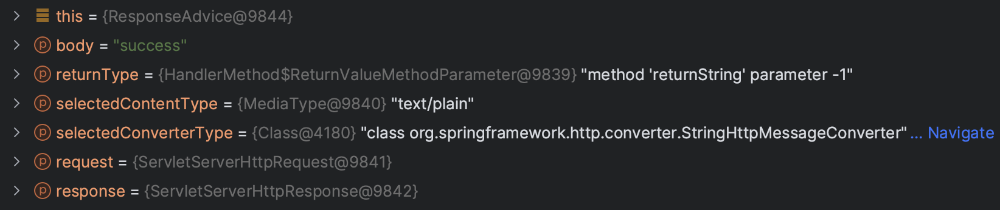
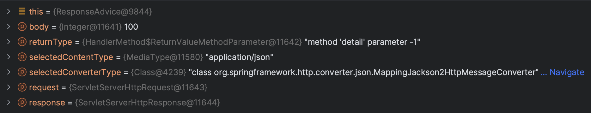

- [Controller 就该这么写](https://juejin.cn/post/7123091045071454238)
- [四步帮你把Controller 的代码变得简洁](https://mp.weixin.qq.com/s/ONHGzQru2gTyYwGDZcl9MQ)

## 一个优秀的Controller层逻辑

说到 `Controller`，相信大家都不陌生，它可以很方便地对外提供数据接口。它的定位，我认为是「不可或缺的配角」，说它不可或缺是因为无论是传统的三层架构还是现在的COLA架构，`Controller` 层依旧有一席之地，说明他的必要性；说它是配角是因为 `Controller` 层的代码一般是不负责具体的逻辑业务逻辑实现，但是它负责接收和响应请求

## 从现状看问题
`Controller` 主要的工作有以下几项

- 接收请求并解析参数
- 调用 Service 执行具体的业务代码（可能包含参数校验）
- 捕获业务逻辑异常做出反馈
- 业务逻辑执行成功做出响应

```java
//DTO
@Data
public class TestDTO {
    private Integer num;
    private String type;
}


//Service
@Service
public class TestService {

    public Double service(TestDTO testDTO) throws Exception {
        if (testDTO.getNum() <= 0) {
            throw new Exception("输入的数字需要大于0");
        }
        if (testDTO.getType().equals("square")) {
            return Math.pow(testDTO.getNum(), 2);
        }
        if (testDTO.getType().equals("factorial")) {
            double result = 1;
            int num = testDTO.getNum();
            while (num > 1) {
                result = result * num;
                num -= 1;
            }
            return result;
        }
        throw new Exception("未识别的算法");
    }
}


//Controller
@RestController
public class TestController {

    private TestService testService;

    @PostMapping("/test")
    public Double test(@RequestBody TestDTO testDTO) {
        try {
            Double result = this.testService.service(testDTO);
            return result;
        } catch (Exception e) {
            throw new RuntimeException(e);
        }
    }

    @Autowired
    public DTOid setTestService(TestService testService) {
        this.testService = testService;
    }
}
```

如果真的按照上面所列的工作项来开发 `Controller` 代码会有几个问题

1. 参数校验过多地耦合了业务代码，违背单一职责原则
2. 可能在多个业务中都抛出同一个异常，导致代码重复
3. 各种异常反馈和成功响应格式不统一，接口对接不友好

## 改造 Controller 层逻辑
### 统一返回结构
统一返回值类型无论项目前后端是否分离都是非常必要的，方便对接接口的开发人员更加清晰地知道这个接口的调用是否成功（不能仅仅简单地看返回值是否为 null 就判断成功与否，因为有些接口的设计就是如此），使用一个状态码、状态信息就能清楚地了解接口调用情况
```java
//定义返回数据结构
public interface IResult {
    Integer getCode();
    String getMessage();
}

//常用结果的枚举
public enum ResultEnum implements IResult {
    SUCCESS(2001, "接口调用成功"),
    VALIDATE_FAILED(2002, "参数校验失败"),
    COMMON_FAILED(2003, "接口调用失败"),
    FORBIDDEN(2004, "没有权限访问资源");

    private Integer code;
    private String message;

    //省略get、set方法和构造方法
}

//统一返回数据结构
@Data
@NoArgsConstructor
@AllArgsConstructor
public class Result<T> {
    private Integer code;
    private String message;
    private T data;

    public static <T> Result<T> success(T data) {
        return new Result<>(ResultEnum.SUCCESS.getCode(), ResultEnum.SUCCESS.getMessage(), data);
    }

    public static <T> Result<T> success(String message, T data) {
        return new Result<>(ResultEnum.SUCCESS.getCode(), message, data);
    }

    public static Result<?> failed() {
        return new Result<>(ResultEnum.COMMON_FAILED.getCode(), ResultEnum.COMMON_FAILED.getMessage(), null);
    }

    public static Result<?> failed(String message) {
        return new Result<>(ResultEnum.COMMON_FAILED.getCode(), message, null);
    }

    public static Result<?> failed(IResult errorResult) {
        return new Result<>(errorResult.getCode(), errorResult.getMessage(), null);
    }

    public static <T> Result<T> instance(Integer code, String message, T data) {
        Result<T> result = new Result<>();
        result.setCode(code);
        result.setMessage(message);
        result.setData(data);
        return result;
    }
}
```

统一返回结构后，在 `Controller` 中就可以使用了，但是每一个 `Controller` 都写这么一段最终封装的逻辑，这些都是很重复的工作，所以还要继续想办法进一步处理统一返回结构

### 统一包装处理
Spring 中提供了一个类 `ResponseBodyAdvice` ，能帮助我们实现上述需求
`ResponseBodyAdvice` 是对 `Controller` 返回的内容在 `HttpMessageConverter` 进行类型转换之前拦截，进行相应的处理操作后，再将结果返回给客户端。那这样就可以把统一包装的工作放到这个类里面。
```java
public interface ResponseBodyAdvice<T> {
    boolean supports(MethodParameter returnType, Class<? extends HttpMessageConverter<?>> converterType);

    @Nullable
    T beforeBodyWrite(@Nullable T body, MethodParameter returnType, MediaType selectedContentType, Class<? extends HttpMessageConverter<?>> selectedConverterType, ServerHttpRequest request, ServerHttpResponse response);
}
```

- `supports`：判断是否要交给 `beforeBodyWrite` 方法执行，ture：需要；false：不需要
- `beforeBodyWrite`：对 `response` 进行具体的处理

```java
// 如果引入了swagger或knife4j的文档生成组件，这里需要仅扫描自己项目的包，否则文档无法正常生成
@RestControllerAdvice(basePackages = "com.example.demo")
public class ResponseAdvice implements ResponseBodyAdvice<Object> {
    @Override
    public boolean supports(MethodParameter returnType, Class<? extends HttpMessageConverter<?>> converterType) {
        // 如果不需要进行封装的，可以添加一些校验手段，比如添加标记排除的注解
        return true;
    }
  

    @Override
    public Object beforeBodyWrite(Object body, MethodParameter returnType, MediaType selectedContentType, Class<? extends HttpMessageConverter<?>> selectedConverterType, ServerHttpRequest request, ServerHttpResponse response) {
        // 提供一定的灵活度，如果body已经被包装了，就不进行包装
        if (body instanceof Result) {
            return body;
        }
        return Result.success(body);
    }
}
```

经过这样改造，既能实现对 `Controller` 返回的数据进行统一包装，又不需要对原有代码进行大量的改动

### 处理 `cannot be cast to java.lang.String` 问题
如果直接使用 `ResponseBodyAdvice`，对于一般的类型都没有问题，当处理字符串类型时，会抛出 `xxx.包装类 cannot be cast to java.lang.String` 的类型转换的异常
在 `ResponseBodyAdvice` 实现类中 debug 发现，只有 String 类型的 `selectedConverterType` 参数值是 `org.springframework.http.converter.StringHttpMessageConverter`，而其他数据类型的值是 `org.springframework.http.converter.json.MappingJackson2HttpMessageConverter`

- String 类型



- 其他类型 (如 Integer 类型)




现在问题已经较为清晰了，因为我们需要返回一个 `Result` 对象
所以使用 `MappingJackson2HttpMessageConverter` 是可以正常转换的
而使用 `StringHttpMessageConverter` 字符串转换器会导致类型转换失败

现在处理这个问题有两种方式


1. 在 `beforeBodyWrite` 方法处进行判断，如果返回值是 `String` 类型就对 `Result` 对象手动进行转换成 `JSON` 字符串，另外方便前端使用，最好在 `@RequestMapping` 中指定 `ContentType`
```java
@RestControllerAdvice(basePackages = "com.example.demo")
public class ResponseAdvice implements ResponseBodyAdvice<Object> {
    ...
    @Override
    public Object beforeBodyWrite(Object body, MethodParameter returnType, MediaType selectedContentType, Class<? extends HttpMessageConverter<?>> selectedConverterType, ServerHttpRequest request, ServerHttpResponse response) {
        // 提供一定的灵活度，如果body已经被包装了，就不进行包装
        if (body instanceof Result) {
            return body;
        }
        // 如果返回值是String类型，那就手动把Result对象转换成JSON字符串
        if (body instanceof String) {
            try {
                return this.objectMapper.writeValueAsString(Result.success(body));
            } catch (JsonProcessingException e) {
                throw new RuntimeException(e);
            }
        }
        return Result.success(body);
    }
    ...
}

@GetMapping(value = "/returnString", produces = "application/json; charset=UTF-8")
public String returnString() {
    return "success";
}
```


2. 修改 `HttpMessageConverter` 实例集合中 `MappingJackson2HttpMessageConverter` 的顺序。因为发生上述问题的根源所在是集合中 `StringHttpMessageConverter` 的顺序先于 `MappingJackson2HttpMessageConverter` 的，调整顺序后即可从根源上解决这个问题

   - 网上有不少做法是直接在集合中第一位添加 `MappingJackson2HttpMessageConverter`

```java
@Configuration
public class WebConfiguration implements WebMvcConfigurer {
    
    @Override
    public void configureMessageConverters(List<HttpMessageConverter<?>> converters) {
        converters.add(0, new MappingJackson2HttpMessageConverter());
    }
}
```

   - 诚然，这种方式可以解决问题，但其实问题的根源不是集合中缺少这一个转换器，而是转换器的顺序导致的，所以最合理的做法应该是调整 `MappingJackson2HttpMessageConverter` 在集合中的顺序

```java
@Configuration
public class WebMvcConfiguration implements WebMvcConfigurer {

    /**
     * 交换MappingJackson2HttpMessageConverter与第一位元素
     * 让返回值类型为String的接口能正常返回包装结果
     *
     * @param converters initially an empty list of converters
     */
    @Override
    public void configureMessageConverters(List<HttpMessageConverter<?>> converters) {
        for (int i = 0; i < converters.size(); i++) {
            if (converters.get(i) instanceof MappingJackson2HttpMessageConverter) {
                MappingJackson2HttpMessageConverter mappingJackson2HttpMessageConverter = (MappingJackson2HttpMessageConverter) converters.get(i);
                converters.set(i, converters.get(0));
                converters.set(0, mappingJackson2HttpMessageConverter);
                break;
            }
        }
    }
}
```


### 参数校验
Java API 的规范 JSR303 定义了校验的标准 `validation-api` ，其中一个比较出名的实现是 `hibernate validation` ，`spring validation` 是对其的二次封装，常用于 SpringMVC 的参数自动校验，参数校验的代码就不需要再与业务逻辑代码进行耦合了

#### `@PathVariable` 和 `@RequestParam` 参数校验
Get 请求的参数接收一般依赖这两个注解，但是处于 url 有长度限制和代码的可维护性，超过 5 个参数尽量用实体来传参

对 `@PathVariable` 和 `@RequestParam` 参数进行校验需要在入参声明约束的注解

如果校验失败，会抛出 `MethodArgumentNotValidException` 异常

```java 
@RestController(value = "prettyTestController")
@RequestMapping("/pretty")
@Validated
public class TestController {

    private TestService testService;

    @GetMapping("/{num}")
    public Integer detail(@PathVariable("num") @Min(1) @Max(20) Integer num) {
        return num * num;
    }

    @GetMapping("/getByEmail")
    public TestDTO getByAccount(@RequestParam @NotBlank @Email String email) {
        TestDTO testDTO = new TestDTO();
        testDTO.setEmail(email);
        return testDTO;
    }

    @Autowired
    public void setTestService(TestService prettyTestService) {
        this.testService = prettyTestService;
    }
}
```

##### 校验原理
在 SpringMVC 中，有一个类是 `RequestResponseBodyMethodProcessor` ，这个类有两个作用（实际上可以从名字上得到一点启发）

1. 用于解析 `@RequestBody` 标注的参数
2. 处理 `@ResponseBody` 标注方法的返回值

解析` @RequestBody` 标注参数的方法是 `resolveArgument`

```java
public class RequestResponseBodyMethodProcessor extends AbstractMessageConverterMethodProcessor {
      /**
     * Throws MethodArgumentNotValidException if validation fails.
     * @throws HttpMessageNotReadableException if {@link RequestBody#required()}
     * is {@code true} and there is no body content or if there is no suitable
     * converter to read the content with.
     */
    @Override
    public Object resolveArgument(MethodParameter parameter, @Nullable ModelAndViewContainer mavContainer,
        NativeWebRequest webRequest, @Nullable WebDataBinderFactory binderFactory) throws Exception {

      parameter = parameter.nestedIfOptional();
      //把请求数据封装成标注的DTO对象
      Object arg = readWithMessageConverters(webRequest, parameter, parameter.getNestedGenericParameterType());
      String name = Conventions.getVariableNameForParameter(parameter);

      if (binderFactory != null) {
        WebDataBinder binder = binderFactory.createBinder(webRequest, arg, name);
        if (arg != null) {
          //执行数据校验
          validateIfApplicable(binder, parameter);
          //如果校验不通过，就抛出MethodArgumentNotValidException异常
          //如果我们不自己捕获，那么最终会由DefaultHandlerExceptionResolver捕获处理
          if (binder.getBindingResult().hasErrors() && isBindExceptionRequired(binder, parameter)) {
            throw new MethodArgumentNotValidException(parameter, binder.getBindingResult());
          }
        }
        if (mavContainer != null) {
          mavContainer.addAttribute(BindingResult.MODEL_KEY_PREFIX + name, binder.getBindingResult());
        }
      }

      return adaptArgumentIfNecessary(arg, parameter);
    }
}

public abstract class AbstractMessageConverterMethodArgumentResolver implements HandlerMethodArgumentResolver {
  /**
    * Validate the binding target if applicable.
    * <p>The default implementation checks for {@code @javax.validation.Valid},
    * Spring's {@link org.springframework.validation.annotation.Validated},
    * and custom annotations whose name starts with "Valid".
    * @param binder the DataBinder to be used
    * @param parameter the method parameter descriptor
    * @since 4.1.5
    * @see #isBindExceptionRequired
    */
   protected void validateIfApplicable(WebDataBinder binder, MethodParameter parameter) {
    //获取参数上的所有注解
      Annotation[] annotations = parameter.getParameterAnnotations();
      for (Annotation ann : annotations) {
      //如果注解中包含了@Valid、@Validated或者是名字以Valid开头的注解就进行参数校验
         Object[] validationHints = ValidationAnnotationUtils.determineValidationHints(ann);
         if (validationHints != null) {
        //实际校验逻辑，最终会调用Hibernate Validator执行真正的校验
        //所以Spring Validation是对Hibernate Validation的二次封装
            binder.validate(validationHints);
            break;
         }
      }
   }
}
```

#### `@RequestBody` 参数校验
Post、Put 请求的参数推荐使用 `@RequestBody` 请求体参数

对 `@RequestBody` 参数进行校验需要在 DTO 对象中加入校验条件后，再搭配 `@Validated` 即可完成自动校验

如果校验失败，会抛出 `ConstraintViolationException` 异常

```java 
//DTO
@Data
public class TestDTO {
    @NotBlank
    private String userName;

    @NotBlank
    @Length(min = 6, max = 20)
    private String password;

    @NotNull
    @Email
    private String email;
}

//Controller
@RestController(value = "prettyTestController")
@RequestMapping("/pretty")
public class TestController {

    private TestService testService;

    @PostMapping("/test-validation")
    public void testValidation(@RequestBody @Validated TestDTO testDTO) {
        this.testService.save(testDTO);
    }

    @Autowired
    public void setTestService(TestService testService) {
        this.testService = testService;
    }
}
```

##### 校验原理
声明约束的方式，注解加到了参数上面，可以比较容易猜测到是使用了 AOP 对方法进行增强

而实际上 Spring 也是通过 `MethodValidationPostProcessor` 动态注册 AOP 切面，然后使用 `MethodValidationInterceptor` 对切点方法进行织入增强

```java
public class MethodValidationPostProcessor extends AbstractBeanFactoryAwareAdvisingPostProcessor implements InitializingBean {
  
    //指定了创建切面的Bean的注解
   private Class<? extends Annotation> validatedAnnotationType = Validated.class;
  
    @Override
    public void afterPropertiesSet() {
        //为所有@Validated标注的Bean创建切面
        Pointcut pointcut = new AnnotationMatchingPointcut(this.validatedAnnotationType, true);
        //创建Advisor进行增强
        this.advisor = new DefaultPointcutAdvisor(pointcut, createMethodValidationAdvice(this.validator));
    }

    //创建Advice，本质就是一个方法拦截器
    protected Advice createMethodValidationAdvice(@Nullable Validator validator) {
        return (validator != null ? new MethodValidationInterceptor(validator) : new MethodValidationInterceptor());
    }
}

public class MethodValidationInterceptor implements MethodInterceptor {
    @Override
    public Object invoke(MethodInvocation invocation) throws Throwable {
        //无需增强的方法，直接跳过
        if (isFactoryBeanMetadataMethod(invocation.getMethod())) {
            return invocation.proceed();
        }
      
        Class<?>[] groups = determineValidationGroups(invocation);
        ExecutableValidator execVal = this.validator.forExecutables();
        Method methodToValidate = invocation.getMethod();
        Set<ConstraintViolation<Object>> result;
        try {
            //方法入参校验，最终还是委托给Hibernate Validator来校验
             //所以Spring Validation是对Hibernate Validation的二次封装
            result = execVal.validateParameters(
                invocation.getThis(), methodToValidate, invocation.getArguments(), groups);
        }
        catch (IllegalArgumentException ex) {
            ...
        }
        //校验不通过抛出ConstraintViolationException异常
        if (!result.isEmpty()) {
            throw new ConstraintViolationException(result);
        }
        //Controller方法调用
        Object returnValue = invocation.proceed();
        //下面是对返回值做校验，流程和上面大概一样
        result = execVal.validateReturnValue(invocation.getThis(), methodToValidate, returnValue, groups);
        if (!result.isEmpty()) {
            throw new ConstraintViolationException(result);
        }
        return returnValue;
    }
}
```

#### 自定义校验规则
有些时候 JSR303 标准中提供的校验规则不满足复杂的业务需求，也可以自定义校验规则

自定义校验规则需要做两件事情

1. 自定义注解类，定义错误信息和一些其他需要的内容
2. 注解校验器，定义判定规则

```java 
//自定义注解类
@Target({ElementType.METHOD, ElementType.FIELD, ElementType.ANNOTATION_TYPE, ElementType.CONSTRUCTOR, ElementType.PARAMETER})
@Retention(RetentionPolicy.RUNTIME)
@Documented
@Constraint(validatedBy = MobileValidator.class)
public @interface Mobile {
    /**
     * 是否允许为空
     */
    boolean required() default true;

    /**
     * 校验不通过返回的提示信息
     */
    String message() default "不是一个手机号码格式";

    /**
     * Constraint要求的属性，用于分组校验和扩展，留空就好
     */
    Class<?>[] groups() default {};
    Class<? extends Payload>[] payload() default {};
}

//注解校验器
public class MobileValidator implements ConstraintValidator<Mobile, CharSequence> {

    private boolean required = false;

    private final Pattern pattern = Pattern.compile("^1[34578][0-9]{9}$"); // 验证手机号

    /**
     * 在验证开始前调用注解里的方法，从而获取到一些注解里的参数
     *
     * @param constraintAnnotation annotation instance for a given constraint declaration
     */
    @Override
    public void initialize(Mobile constraintAnnotation) {
        this.required = constraintAnnotation.required();
    }

    /**
     * 判断参数是否合法
     *
     * @param value   object to validate
     * @param context context in which the constraint is evaluated
     */
    @Override
    public boolean isValid(CharSequence value, ConstraintValidatorContext context) {
        if (this.required) {
            // 验证
            return isMobile(value);
        }
        if (StringUtils.hasText(value)) {
            // 验证
            return isMobile(value);
        }
        return true;
    }

    private boolean isMobile(final CharSequence str) {
        Matcher m = pattern.matcher(str);
        return m.matches();
    }
}
```

自动校验参数真的是一项非常必要、非常有意义的工作。 JSR303 提供了丰富的参数校验规则，再加上复杂业务的自定义校验规则，完全把参数校验和业务逻辑解耦开，代码更加简洁，符合单一职责原则。
更多关于 Spring 参数校验请参考：[Spring Validation最佳实践及其实现原理，参数校验没那么简单！](https://juejin.cn/post/6856541106626363399)

### 自定义异常与统一拦截异常
原来的代码中可以看到有几个问题

1. 抛出的异常不够具体，只是简单地把错误信息放到了 Exception 中
2. 抛出异常后，Controller 不能具体地根据异常做出反馈
3. 虽然做了参数自动校验，但是异常返回结构和正常返回结构不一致

自定义异常是为了后面统一拦截异常时，对业务中的异常有更加细颗粒度的区分，拦截时针对不同的异常作出不同的响应

而统一拦截异常的目的一个是为了可以与前面定义下来的统一包装返回结构能对应上，另一个是我们希望无论系统发生什么异常，Http 的状态码都要是 200 ，尽可能由业务来区分系统的异常

```java 
//自定义异常
public class ForbiddenException extends RuntimeException {
    public ForbiddenException(String message) {
        super(message);
    }
}

//自定义异常
public class BusinessException extends RuntimeException {
    public BusinessException(String message) {
        super(message);
    }
}

//统一拦截异常
@RestControllerAdvice(basePackages = "com.example.demo")
public class ExceptionAdvice {

    /**
     * 捕获 {@code BusinessException} 异常
     */
    @ExceptionHandler({BusinessException.class})
    public Result<?> handleBusinessException(BusinessException ex) {
        return Result.failed(ex.getMessage());
    }

    /**
     * 捕获 {@code ForbiddenException} 异常
     */
    @ExceptionHandler({ForbiddenException.class})
    public Result<?> handleForbiddenException(ForbiddenException ex) {
        return Result.failed(ResultEnum.FORBIDDEN);
    }

    /**
     * {@code @RequestBody} 参数校验不通过时抛出的异常处理
     */
    @ExceptionHandler({MethodArgumentNotValidException.class})
    public Result<?> handleMethodArgumentNotValidException(MethodArgumentNotValidException ex) {
        BindingResult bindingResult = ex.getBindingResult();
        StringBuilder sb = new StringBuilder("校验失败:");
        for (FieldError fieldError : bindingResult.getFieldErrors()) {
            sb.append(fieldError.getField()).append("：").append(fieldError.getDefaultMessage()).append(", ");
        }
        String msg = sb.toString();
        if (StringUtils.hasText(msg)) {
            return Result.failed(ResultEnum.VALIDATE_FAILED.getCode(), msg);
        }
        return Result.failed(ResultEnum.VALIDATE_FAILED);
    }

    /**
     * {@code @PathVariable} 和 {@code @RequestParam} 参数校验不通过时抛出的异常处理
     */
    @ExceptionHandler({ConstraintViolationException.class})
    public Result<?> handleConstraintViolationException(ConstraintViolationException ex) {
        if (StringUtils.hasText(ex.getMessage())) {
            return Result.failed(ResultEnum.VALIDATE_FAILED.getCode(), ex.getMessage());
        }
        return Result.failed(ResultEnum.VALIDATE_FAILED);
    }

    /**
     * 顶级异常捕获并统一处理，当其他异常无法处理时候选择使用
     */
    @ExceptionHandler({Exception.class})
    public Result<?> handle(Exception ex) {
        return Result.failed(ex.getMessage());
    }

}
```

## 总结
做好了这一切改动后，可以发现 Controller 的代码变得非常简洁，可以很清楚地知道每一个参数、每一个 DTO 的校验规则，可以很明确地看到每一个 Controller 方法返回的是什么数据，也可以方便每一个异常应该如何进行反馈

这一套操作下来后，我们能更加专注于业务逻辑的开发，代码简洁、功能完善，何乐而不为呢？
