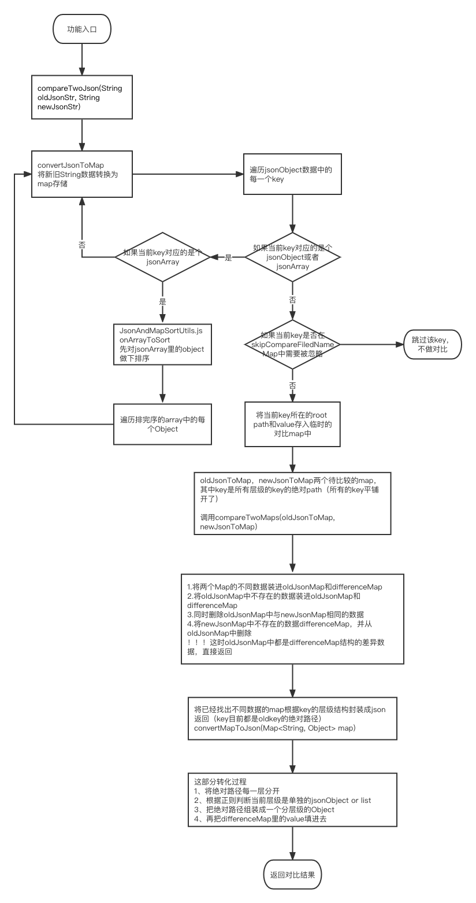

## 背景
之前有类似接口diff对比，数据对比的测试需求，涉及到json格式的数据对比，调研了几个大神们分享的代码，选了一个最符合自己需求的研究了下。

## 说明
这个对比方法，支持JsonObject和JsonArray类型的数据对比，支持：

- 深度的对比：list变化（个数、内容）、层级结构变化
- 字段的对比：新增、修改、删除数据可察觉，能找到对应的旧数据
- 支持特定字段忽略对比

输出的对比结果格式为：


源码分为JsonCompareUtils， JsonAndMapSortUtils两个类，对比入口是compareTwoJson方法

核心逻辑在JsonCompareUtils类中，JsonAndMapSortUtils主要做过程中的数据排序功能，相对独立。

## 源码
```java
package com.xhzyqa.transcodetest.utils;
 
 
import com.alibaba.fastjson.JSON;
import com.alibaba.fastjson.JSONArray;
import com.alibaba.fastjson.JSONObject;
import org.apache.commons.lang.ArrayUtils;
import org.apache.commons.lang.StringUtils;
 
import java.util.HashMap;
import java.util.Iterator;
import java.util.LinkedHashMap;
import java.util.Map;
import java.util.stream.Stream;
 
public class JsonCompareUtils {
 
    //标志位：对json报文中含有JsonArray类型的数据是否进行排序
    private static boolean isSort;
 
    private Map<String, Object> oldJsonToMap = new LinkedHashMap<>();
    private Map<String, Object> newJsonToMap = new LinkedHashMap<>();
 
    //每一个实体里的排序字段
    private static Map<String, String> filedNameMap = new HashMap<>();
 
    static {
        filedNameMap.put("dogs", "dogNo");
        filedNameMap.put("cats", "catNo");
    }
 
    //可以跳过比对的字段
//    private static String[] skipCompareFiledNameMap = {"dogAge", "catAge", "catName"};
    private static String[] skipCompareFiledNameMap = {"key3"};
 
    /**
     * 两json报文比对入口
     *
     * @param oldJsonStr
     * @param newJsonStr
     * @return
     */
    public String compareTwoJson(String oldJsonStr, String newJsonStr) {
        /**
         * 递归遍历json对象所有的key-value，以map形式的path:value进行存储
         * 然后对两个map进行比较
         */
        convertJsonToMap(JSON.parseObject(oldJsonStr), "", false);
        convertJsonToMap(JSON.parseObject(newJsonStr), "", true);
        //获取比较结果
        Map<String, Object> differenceMap = compareTwoMaps(oldJsonToMap, newJsonToMap);
        String diffJsonResult = convertMapToJson(differenceMap);
        return diffJsonResult;
    }
 
    /**
     * 将json数据转换为map存储--用于后续比较map
     *
     * @param json
     * @param root
     * @param isNew 区别新旧报文
     */
    private void convertJsonToMap(Object json, String root, boolean isNew) {
        if (json instanceof JSONObject) {
            JSONObject jsonObject = ((JSONObject) json);
            Iterator iterator = jsonObject.keySet().iterator();
            while (iterator.hasNext()) {
                Object key = iterator.next();
                Object value = jsonObject.get(key);
                String newRoot = "".equals(root) ? key + "" : root + "." + key;
                fillInResultMap(value, newRoot, isNew);
            }
        } else if (json instanceof JSONArray) {
            JSONArray jsonArray = (JSONArray) json;
            //将jsonArray进行排序
            if (isSort) {
                //需要排序
                String sortEntityName = root.substring(root.lastIndexOf(".") + 1);
                String sortFiledName = filedNameMap.get(sortEntityName);//需要排序 获取排序字段
                if (!StringUtils.isEmpty(sortFiledName)) {
                    jsonArray = JsonAndMapSortUtils.jsonArrayToSort(jsonArray, sortFiledName, true);
                }
            }
            final JSONArray jsonArray1 = jsonArray;
            Stream.iterate(0, integer -> integer + 1).limit(jsonArray1.size()).forEach(index -> {
                Object value = jsonArray1.get(index);
                String newRoot = "".equals(root) ? "[" + index + "]" : root + ".[" + index + "]";
                fillInResultMap(value, newRoot, isNew);
            });
        }
    }
 
    /**
     * 封装json转map后的数据
     *
     * @param value
     * @param newRoot
     * @param isNew   区别新旧json
     */
    public void fillInResultMap(Object value, String newRoot, boolean isNew) {
        if (value instanceof JSONObject || value instanceof JSONArray) {
            convertJsonToMap(value, newRoot, isNew);
        } else {
            //设置跳过比对的字段，直接不装入map
            boolean check = ArrayUtils.contains(JsonCompareUtils.skipCompareFiledNameMap, newRoot);
            if (!check){
                if (!isNew) {
                    oldJsonToMap.put(newRoot, value);
                } else {
                    newJsonToMap.put(newRoot, value);
                }
            }
        }
    }
 
    /**
     * 比较两个map，将不同的数据以map形式存储并返回
     *
     * @param oldJsonMap
     * @param newJsonMap
     * @return
     */
    private Map<String, Object> compareTwoMaps(Map<String, Object> oldJsonMap, Map<String, Object> newJsonMap) {
        //1.将newJsonMap的不同数据装进oldJsonMap，同时删除oldJsonMap中与newJsonMap相同的数据
        newJsonMap.forEach((k, v) -> {
            Map<String, Object> differenceMap = new HashMap<>();
            String lastFieldKey = k.substring(k.lastIndexOf(".") + 1);
//            boolean check = ArrayUtils.contains(JsonCompareUtils.skipCompareFiledNameMap, lastFieldKey);
//            if (!check){
            if (oldJsonMap.containsKey(k)) {
//                boolean check = ArrayUtils.contains(JsonCompareUtils.skipCompareFiledNameMap, lastFieldKey);
                Object oldValue = oldJsonMap.get(k);
                if (v.equals(oldValue)) {
                    oldJsonMap.remove(k);
                } else {
                    differenceMap.put("oldValue", oldValue);
                    differenceMap.put("newValue", v);
                    oldJsonMap.put(k, differenceMap);
                }
            } else {
                differenceMap.put("oldValue", "no exists " + k);
                differenceMap.put("newValue", v);
                oldJsonMap.put(k, differenceMap);
            }
//            }else {
//                oldJsonMap.remove(k);
//            }
        });
        //2.统一oldJsonMap中newMap不存在的数据的数据结构，便于解析
        oldJsonMap.forEach((k, v) -> {
            String lastFieldKey = k.substring(k.lastIndexOf(".") + 1);
//            boolean check = ArrayUtils.contains(JsonCompareUtils.skipCompareFiledNameMap, lastFieldKey);
//            if (!check && !(v instanceof Map)) {
            if (!(v instanceof Map)) {
                Map<String, Object> differenceMap = new HashMap<>();
                differenceMap.put("oldValue", v);
                differenceMap.put("newValue", "no exists " + k);
                oldJsonMap.put(k, differenceMap);
            }
        });
        return oldJsonMap;
    }
 
    /**
     * 将已经找出不同数据的map根据key的层级结构封装成json返回
     *
     * @param map
     * @return
     */
    private String convertMapToJson(Map<String, Object> map) {
        JSONObject resultJSONObject = new JSONObject();
        for (Iterator<Map.Entry<String, Object>> it = map.entrySet().iterator(); it.hasNext(); ) {
            Map.Entry<String, Object> item = it.next();
            String key = item.getKey();
            Object value = item.getValue();
            String[] paths = key.split("\\.");
            int i = 0;
            Object remarkObject = null;//用於深度標識對象
            int indexAll = paths.length - 1;
            while (i <= paths.length - 1) {
                String path = paths[i];
                if (i == 0) {
                    //初始化对象标识
                    if (resultJSONObject.containsKey(path)) {
                        remarkObject = resultJSONObject.get(path);
                    } else {
                        if (indexAll > i) {
                            if (paths[i + 1].matches("\\[[0-9]+\\]")) {
                                remarkObject = new JSONArray();
                            } else {
                                remarkObject = new JSONObject();
                            }
                            resultJSONObject.put(path, remarkObject);
                        } else {
                            resultJSONObject.put(path, value);
                        }
                    }
                    i++;
                    continue;
                }
                if (path.matches("\\[[0-9]+\\]")) {//匹配集合对象
                    int startIndex = path.lastIndexOf("[");
                    int endIndext = path.lastIndexOf("]");
                    int index = Integer.parseInt(path.substring(startIndex + 1, endIndext));
                    if (indexAll > i) {
                        if (paths[i + 1].matches("\\[[0-9]+\\]")) {
                            while (((JSONArray) remarkObject).size() <= index) {
                                if (((JSONArray) remarkObject).size() == index) {
                                    ((JSONArray) remarkObject).add(index, new JSONArray());
                                } else {
                                    ((JSONArray) remarkObject).add(null);
                                }
                            }
                        } else {
                            while (((JSONArray) remarkObject).size() <= index) {
                                if (((JSONArray) remarkObject).size() == index) {
                                    ((JSONArray) remarkObject).add(index, new JSONObject());
                                } else {
                                    ((JSONArray) remarkObject).add(null);
                                }
                            }
                        }
                        remarkObject = ((JSONArray) remarkObject).get(index);
                    } else {
                        while (((JSONArray) remarkObject).size() <= index) {
                            if (((JSONArray) remarkObject).size() == index) {
                                ((JSONArray) remarkObject).add(index, value);
                            } else {
                                ((JSONArray) remarkObject).add(null);
                            }
                        }
                    }
                } else {
                    if (indexAll > i) {
                        if (paths[i + 1].matches("\\[[0-9]+\\]")) {
                            if (!((JSONObject) remarkObject).containsKey(path)) {
                                ((JSONObject) remarkObject).put(path, new JSONArray());
                            }
                        } else {
                            if (!((JSONObject) remarkObject).containsKey(path)) {
                                ((JSONObject) remarkObject).put(path, new JSONObject());
                            }
                        }
                        remarkObject = ((JSONObject) remarkObject).get(path);
                    } else {
                        ((JSONObject) remarkObject).put(path, value);
                    }
                }
                i++;
            }
        }
        return JSON.toJSONString(resultJSONObject);
    }
 
    public boolean isSort() {
        return isSort;
    }
 
    public void setSort(boolean sort) {
        isSort = sort;
    }
 
    public static void main(String[] args) {
        String oldStr = "{key1:'aaa',key2:'bbb'}";
        String newStr = "{key1:'aaa',key2:'bbb',key3:'c'}";
        System.out.println(new JsonCompareUtils().compareTwoJson(oldStr, newStr));
        System.out.println("\n========测试复杂json的比对============");
    }
 
    /**
     * 测试类
    static class JsonCompareTest {
        public static void compareTest() {
            String oldJson = MakeJsonCompareDatas.getJsonDataOldStr();
            String newJson = MakeJsonCompareDatas.getJsonDataNewStr();
            //对json报文中含有JsonArray类型的数据是否进行排序
            JsonCompareUtils.isSort = true;
            String compareResult = new JsonCompareUtils().compareTwoJson(oldJson, newJson);
            System.out.println("oldJson==>" + oldJson);
            System.out.println("newJson==>" + newJson);
            System.out.println("\nisSort==" + isSort + "-->compareResult==>\n" + compareResult);
        }
    }
     */
}
```

```java
package com.xhzyqa.transcodetest.utils;
 
 
import com.alibaba.fastjson.JSONArray;
import com.alibaba.fastjson.JSONObject;
import sun.misc.ASCIICaseInsensitiveComparator;
 
import java.util.*;
import java.util.function.Function;
import java.util.stream.Collectors;
 
public class JsonAndMapSortUtils {
 
    /**
     * map排序
     * @param map
     * @param keySort
     * @param <k>
     * @param <v>
     * @return
     */
    public static <k,v> List mapByKeyToSort(Map<k,v> map , final Comparator keySort){
        List<Map.Entry<k,v>> entryList = new ArrayList<Map.Entry<k, v>>(map.entrySet());
        Collections.sort(entryList, new Comparator<Map.Entry<k, v>>() {
            public int compare(Map.Entry<k, v> o1, Map.Entry<k, v> o2) {
                return keySort.compare(o1.getKey(),o2.getKey());
            }
        });
        //return (Map<k,v>)entryList.stream().collect(Collectors.toMap(Map.Entry<k,v>::getKey, Function.identity(), (key1, key2) -> key2));
        Map<String,String> afterToSortMap = new HashMap<>();
        /*for (Map.Entry<k,v> m : entryList){
            System.out.println(m.getKey()+"===>"+m.getValue());
        }*/
        System.out.println("排序=====");
        entryList.forEach(m->{
            System.out.println(m.getKey()+"===>"+m.getValue());
        });
        return entryList;
    }
 
    /**
     * JSONArray排序
     * @param jsonArray
     * @param fildName
     * @param isAsc
     * @return
     */
    public static JSONArray jsonArrayToSort(JSONArray jsonArray,final String fildName,final boolean isAsc){
        JSONArray afterSortJsonArray = new JSONArray();
        List<JSONObject> objectList = new ArrayList<JSONObject>();
        jsonArray.forEach(obj ->{
            objectList.add((JSONObject)obj);
        });
        Collections.sort(objectList, new Comparator<JSONObject>() {
            @Override
            public int compare(JSONObject o1, JSONObject o2) {
                String fildValueA = o1.getString(fildName);
                String fildValueB = o2.getString(fildName);
                if (isAsc)
                    return fildValueA.compareTo(fildValueB);
                return fildValueB.compareTo(fildValueA);
            }
        });
        objectList.forEach(obj->{
            afterSortJsonArray.add(obj);
        });
        return afterSortJsonArray;
    }
 
    /**
     *准备map测试数据
     */
    public static Map<String,String> getMapData(){
        LinkedHashMap<String,String> map = new LinkedHashMap<>();
        map.put("key1","麦兜");
        map.put("key3","贝塔");
        map.put("key5","酥妮");
        map.put("key2","小H");
        map.put("key4","小O");
        return map;
    }
    /**
     *准备json测试数据
     */
    public static JSONArray getJsonArrayData(){
        JSONArray jsonArray = new JSONArray();
        JSONObject jsonObject1 = new JSONObject();
        jsonObject1.put("userId","1001");
        jsonObject1.put("name","麦兜");
        jsonArray.add(jsonObject1);
 
        JSONObject jsonObject3 = new JSONObject();
        jsonObject3.put("userId","1003");
        jsonObject3.put("name","酥妮");
        jsonArray.add(jsonObject3);
 
        JSONObject jsonObject2 = new JSONObject();
        jsonObject2.put("userId","1002");
        jsonObject2.put("name","贝塔");
        jsonArray.add(jsonObject2);
 
        return jsonArray;
    }
 
    public static void main(String[] args) {
        Map<String,String> map = JsonAndMapSortUtils.getMapData();
        JSONArray jsonArray = JsonAndMapSortUtils.getJsonArrayData();
        List afterSortMap = JsonAndMapSortUtils.mapByKeyToSort(map,new ASCIICaseInsensitiveComparator());
 
        JSONArray afterSortJsonArray_isAsc = JsonAndMapSortUtils.jsonArrayToSort(jsonArray,"userId",true);
        JSONArray afterSortJsonArray_noAsc = JsonAndMapSortUtils.jsonArrayToSort(jsonArray,"userId",false);
 
        System.out.println("map排序前："+map);
        System.out.println("map排序后："+afterSortMap+"\n");
 
        System.out.println("JsonArray排序前："+jsonArray);
        System.out.println("JsonArray排序后==》升序："+afterSortJsonArray_isAsc);
        System.out.println("JsonArray排序后==》降序："+afterSortJsonArray_noAsc);
    }
 
 
}
```

## 源码走读
整个源码调用链路如下图，简单来说过程就是：object拆分解析-新旧数据逐个对比-结果信息组装三个步骤


## 其他
原始代码中有些小bug，已修复。目前这个工具主要被我拿来用在了一个接口数据对比工具中，来检测迭代前后的接口协议数据变更，以完善迭代变更范围来确认测试范围
