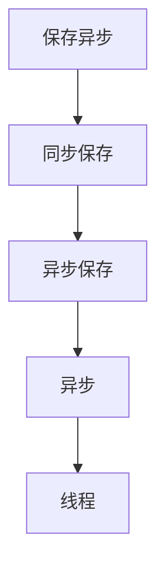
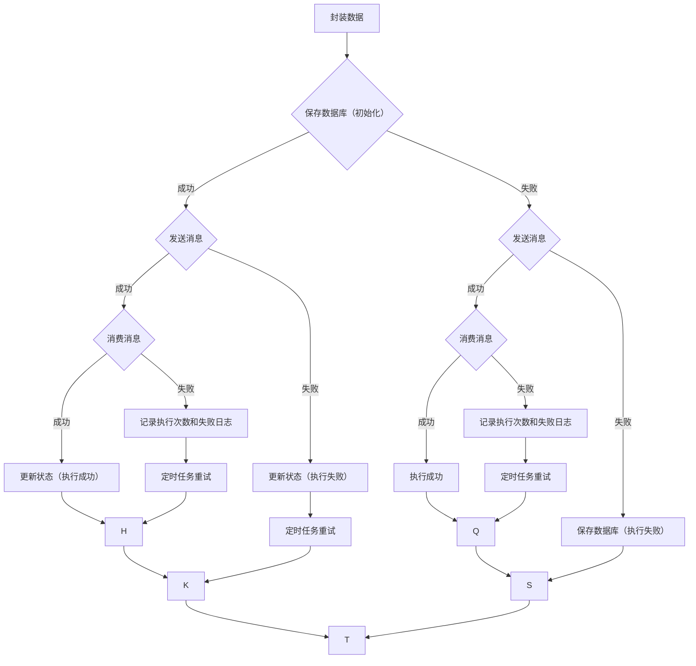

- [万能的异步处理方案](https://juejin.cn/post/7266087843239084090)
- [一套万能通用的异步处理方案](https://mp.weixin.qq.com/s/4Te7HRFvdM6H3VGnCAview)

## 前言
良好的系统设计必须要做到开闭原则，随着业务的不断迭代更新，核心代码也会被不断改动，出错的概率也会大大增加。但是大部分增加的功能都是在扩展原有的功能，既要保证性能又要保证质量，我们往往都会使用异步线程池来处理，然而却增加了很多不确定性因素。 由此我设计了一套通用的异步处理SDK，可以很轻松的实现各种异步处理

## 目的
通过异步处理不仅能够保证方法能够得到有效的执行而且不影响主流程
更重要的是各种兜底方法保证数据不丢失，从而达到**最终一致性**

## 优点
无侵入设计，独立数据库，独立定时任务，独立消息队列，独立人工执行界面(统一登录认证)
使用spring事务事件机制，即使异步策略解析失败也不会影响业务
如果你的方法正在运行事务，会等事务提交后或回滚后再处理事件
就算事务提交了，异步策略解析失败了，我们还有兜底方案执行（除非数据库有问题，消息队列有问题，方法有bug）

## 原理
- 容器初始化bean完成后遍历所有方法，把有`@AsyncExec`注解的方法缓存起来
- 方法运行时通过AOP切面发布事件
- 事务事件监听处理异步执行策略

```java
@TransactionalEventListener(fallbackExecution = true, phase = TransactionPhase.AFTER_COMPLETION)
```

- `fallbackExecution=true` 没有事务正在运行，依然处理事件 
- `TransactionPhase.AFTER_COMPLETION` 事务提交后和事务回滚后都处理事件

## 组件
- kafka 消息队列
- xxl job  定时任务
- mysql 数据库
- spring 切面
- vue 界面

## 设计模式
- 策略
- 模板方法
- 动态代理

## 流程图


## 数据库脚本
```sql
CREATE TABLE `async_req` (
  `id` bigint NOT NULL AUTO_INCREMENT COMMENT '主键ID',
  `application_name` varchar(100) NOT NULL DEFAULT '' COMMENT '应用名称',
  `sign` varchar(50) NOT NULL DEFAULT '' COMMENT '方法签名',
  `class_name` varchar(200) NOT NULL DEFAULT '' COMMENT '全路径类名称',
  `method_name` varchar(100) NOT NULL DEFAULT '' COMMENT '方法名称',
  `async_type` varchar(50) NOT NULL DEFAULT '' COMMENT '异步策略类型',
  `exec_status` tinyint NOT NULL DEFAULT '0' COMMENT '执行状态 0：初始化 1：执行失败 2：执行成功',
  `exec_count` int NOT NULL DEFAULT '0' COMMENT '执行次数',
  `param_json` longtext COMMENT '请求参数',
  `remark` varchar(200) NOT NULL DEFAULT '' COMMENT '业务描述',
  `create_time` datetime NOT NULL DEFAULT CURRENT_TIMESTAMP COMMENT '创建时间',
  `update_time` datetime NOT NULL DEFAULT CURRENT_TIMESTAMP COMMENT '更新时间',
  PRIMARY KEY (`id`) USING BTREE,
  KEY `idx_applocation_name` (`application_name`) USING BTREE,
  KEY `idx_exec_status` (`exec_status`) USING BTREE
) ENGINE=InnoDB DEFAULT CHARSET=utf8mb4 COMMENT='异步处理请求';

CREATE TABLE `async_log` (
  `id` bigint NOT NULL AUTO_INCREMENT COMMENT '主键ID',
  `async_id` bigint NOT NULL DEFAULT '0' COMMENT '异步请求ID',
  `error_data` longtext COMMENT '执行错误信息',
  `create_time` datetime NOT NULL DEFAULT CURRENT_TIMESTAMP COMMENT '创建时间',
  PRIMARY KEY (`id`) USING BTREE,
  KEY `idx_async_id` (`async_id`) USING BTREE
) ENGINE=InnoDB DEFAULT CHARSET=utf8mb4 COMMENT='异步处理日志';
```

## 异步策略

AsyncExecEnum

| 字段名称   | 描述                           | 兜底方案                                 |
| ---------- | ------------------------------ | ---------------------------------------- |
| SAVE_ASYNC | 先保存数据库再异步消息处理     | 保存数据库失败 -> 放入消息队列->直接执行 |
| SYNC_SAVE  | 先同步处理失败再保存数据库     | 保存数据库失败-> 放入消息队列            |
| ASYNC_SAVE | 先异步消息处理失败再保存数据库 | 保存数据库失败->直接执行                 |
| ASYNC      | 仅异步消息处理                 | 发送消息失败->直接执行                   |
| THREAD     | 仅异步线程处理                 | 无                                       |

## 安全级别

从下往上依次递增

## 执行状态
ExecStatusEnum

| 字段名称 | 字段值 | 描述     |
| -------- | ------ | -------- |
| INIT     | 0      | 初始化   |
| ERROR    | 1      | 执行失败 |
| SUCCESS  | 2      | 执行成功 |

## 流程图
### SAVE_ASYNC 先保存数据库再异步消息处理


```uml
@startuml
'https://plantuml.com/activity-diagram-beta

title 先保存数据库再异步消息处理

start

:封装数据;
if (保存数据库(初始化)) then (成功)
  if (发送消息) then (成功)
    if (消费消息) then (成功)
      :更新状态(执行成功);
    else (失败)
      :记录执行次数和失败日志;
      :定时任务重试;
    endif
  else (失败)
    :更新状态(执行失败);
    :定时任务重试;
  endif
else (失败)
  if (发送消息) then (成功)
    if (消费消息) then (成功)
      :执行成功;
    else (失败)
      :保存数据库(执行失败);
      :定时任务重试;
    endif
  else (失败)
    :直接执行;
  endif
endif

stop

@enduml
```

### SYNC_SAVE 先同步处理失败再保存数据库
```uml
@startuml
'https://plantuml.com/activity-diagram-beta

title 先同步处理失败再保存数据库

start
:封装数据;
if (保存数据库(初始化)) then (成功)
  if (发送消息) then (成功)
    if (消费消息) then (成功)
      :更新状态(执行成功);
    else (失败)
      :记录执行次数和失败日志;
      :定时任务重试;
    endif
  else (失败)
    :更新状态(执行失败);
    :定时任务重试;
  endif
else (失败)
  if (发送消息) then (成功)
    if (消费消息) then (成功)
      :执行成功;
    else (失败)
      :保存数据库(执行失败);
      :定时任务重试;
    endif
  else (失败)
    :直接执行;
  endif
endif

stop

@enduml
```

### ASYNC_SAVE 先异步消息处理失败再保存数据库
```uml
@startuml
'https://plantuml.com/activity-diagram-beta

title 先异步消息处理失败再保存数据库

start

:封装数据;
if (发送消息) then (成功)
    if (消费消息) then (成功)
      :执行成功;
    else (失败)
       :保存数据库(执行失败);
       :定时任务重试;
    endif
else (失败)
    if (保存数据库(执行失败)) then (成功)
        :定时任务重试;
    else (失败)
        :直接执行;
    endif
endif

stop
@enduml
```


## apollo 配置
```yaml
xml复制代码# 开关：默认关闭
async.enabled=true

# 应用名称
spring.application.name=xxx

# 数据源 druid 
spring.datasource.driver-class-name=com.mysql.jdbc.Driver
spring.datasource.url=jdbc:mysql://127.0.0.1:3306/fc_async?useUnicode=true&characterEncoding=utf-8&zeroDateTimeBehavior=convertToNull&useSSL=false&allowMultiQueries=true&rewriteBatchedStatements=true
spring.datasource.username=user
spring.datasource.password=xxxx
spring.datasource.filters=config
spring.datasource.connectionProperties=config.decrypt=true;config.decrypt.key=yyy
#静态地址
spring.resources.add-mappings=true
spring.resources.static-locations=classpath:/static/


# 以下配置都有默认值
# 核心线程数
async.executor.thread.corePoolSize=10
# 最大线程数
async.executor.thread.maxPoolSize=50
# 队列容量
async.executor.thread.queueCapacity=10000
# 活跃时间
async.executor.thread.keepAliveSeconds=600

# 执行成功是否删除记录：默认删除
async.exec.deleted=true
 
# 自定义队列名称前缀：默认应用名称
async.topic=${spring.application.name}
 
# 重试执行次数：默认5次
async.exec.count=5
 
# 重试最大查询数量
async.retry.limit=100

# 补偿最大查询数量
async.comp.limit=100

# 登录拦截：默认false
async.login=false
```

## 用法
```txt
1，异步开关
scm.async.enabled=true

2，在需要异步执行的方法加注解 （必须是spring代理方法）
@AsyncExec(type = AsyncExecEnum.SAVE_ASYNC, remark = "数据字典")

3，人工处理地址
http://localhost:8004/async/index.html
```

## 注意
```txt
1，应用名称
spring.application.name

2，队列名称
${async.topic:${spring.application.name}}_async_queue
自定义topic：async.topic=xxx

3，自己业务要做幂等

4，一个应用公用一个队列
自产自消

5，定时任务
异步重试定时任务（2分钟重试一次，可配置重试次数） 
异步补偿定时任务（一小时补偿一次，创建时间在一小时之前的）
```

## 效果展示


## github地址
[github.com/xiongyanoko…](https://github.com/xiongyanokok/fc-async)
