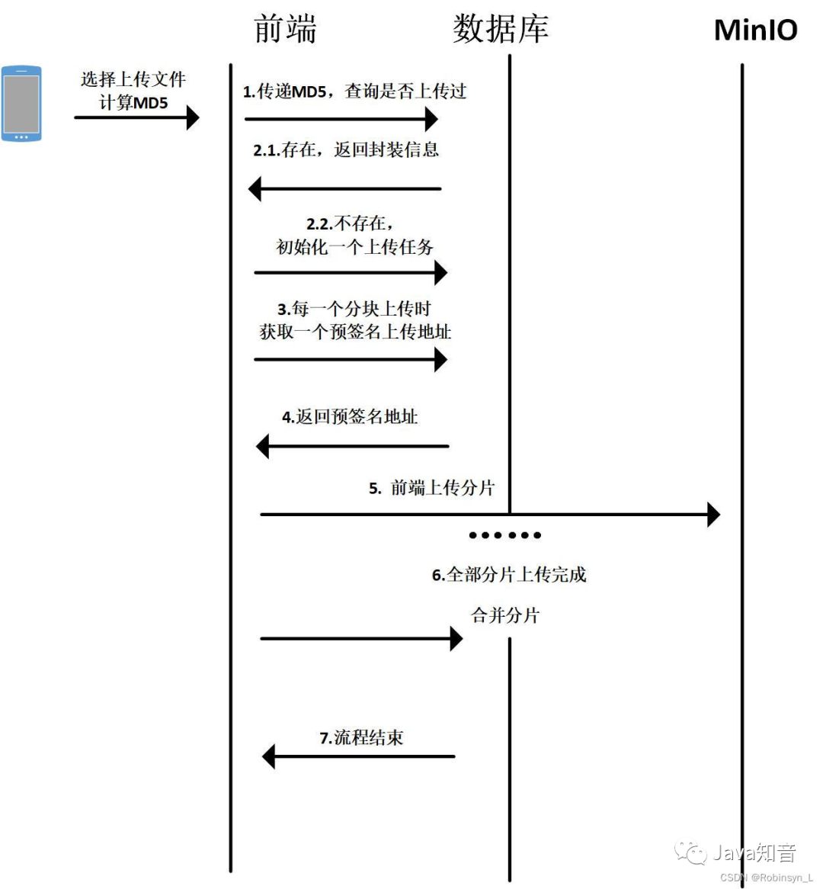

- [SpringBoot 整合 MinIO 实现视频的分片上传/断点续传](https://mp.weixin.qq.com/s/Vy9pG4CncXpgxg_-YkGuwg)
- [SpringBoot 整合 MinIO 实现视频的分片上传/断点续传](https://blog.csdn.net/weixin_44153131/article/details/129249169)

## 1、前言
之前做了一个慕课网上的仿短视频开发，里面有很多比较粗糙的实现，比如视频上传部分是直接由前端上传云服务，没考虑到客户的网络环境质量等问题，如果一个视频快上传完了，但是网断了没有上传完成需要客户重新上传，这对于用户体验是极差的。

那么我们对于视频文件的上传可以采取断点续传，上传过程中，如果出现网络异常或程序崩溃导致文件上传失败时，将从断点记录处继续上传未上传完成的部分，断点续传依赖于MD5和分片上传，对于本demo分片上传的流程如图



通过文件唯一标识MD5，在数据库中查询此前是否创建过该SysUploadTask，如果存在，直接返回TaskInfo；如果不存在，通过amazonS3获取到UploadId并新建一个SysUploadTask返回。

前端将文件分好片后，通过服务器得到每一片的一个预地址，然后由前端直接向minio服务器发起真正的上传请求，避免上传时占用应用服务器的带宽，影响系统稳定。最后再向后端服务器发起合并请求。

## 2、数据库结构
| 列名            | 类型    | 长度 | 可否为NULL | 是否主键 | 注释               |
| --------------- | ------- | ---- | ---------- | -------- | ------------------ |
| id              | BIGINT  |      | FALSE      | TRUE     | 主键               |
| upload_id       | VARCHAR | 255  | FALSE      | FALSE    | 分片上传的UploadId |
| file_identifier | VARCHAR | 500  | FALSE      | FALSE    | 文件唯一标识 (MD5) |
| file_name       | VARCHAR | 500  | FALSE      | FALSE    | 文件名             |
| bucket_name     | VARCHAR | 255  | FALSE      | FALSE    | 所属桶名           |
| object_key      | VARCHAR | 500  | FALSE      | FALSE    | 文件的key          |
| total_size      | BIGINT  |      | FALSE      | FALSE    | 文件大小 (byte)    |
| chunk_size      | BIGINT  |      | FALSE      | FALSE    | 分片大小 (byte)    |
| chunk_num       | INT     |      | FALSE      | FALSE    | 分片数量           |

## 3、后端实现
### 3.1、根据MD5获取是否存在相同文件
Controller层
```java
/**
 * 查询是否上传过，若存在，返回TaskInfoDTO
 * @param identifier 文件md5
 * @return
 */
@GetMapping("/{identifier}")
public GraceJSONResult taskInfo (@PathVariable("identifier") String identifier) {
    return GraceJSONResult.ok(sysUploadTaskService.getTaskInfo(identifier));
}
```

Service层
```java
/**
 * 查询是否上传过，若存在，返回TaskInfoDTO
 * @param identifier
 * @return
 */
public TaskInfoDTO getTaskInfo(String identifier) {
    SysUploadTask task = getByIdentifier(identifier);
    if (task == null) {
        return null;
    }
    TaskInfoDTO result = new TaskInfoDTO().setFinished(true).setTaskRecord(TaskRecordDTO.convertFromEntity(task)).setPath(getPath(task.getBucketName(), task.getObjectKey()));

    boolean doesObjectExist = amazonS3.doesObjectExist(task.getBucketName(), task.getObjectKey());
    if (!doesObjectExist) {
        // 未上传完，返回已上传的分片
        ListPartsRequest listPartsRequest = new ListPartsRequest(task.getBucketName(), task.getObjectKey(), task.getUploadId());
        PartListing partListing = amazonS3.listParts(listPartsRequest);
        result.setFinished(false).getTaskRecord().setExitPartList(partListing.getParts());
    }
    return result;
}
```

### 3.2、初始化一个上传任务
Controller层
```java
/**
 * 创建一个上传任务
 * @return
 */
@PostMapping
public GraceJSONResult initTask (@Valid @RequestBody InitTaskParam param) {
    return GraceJSONResult.ok(sysUploadTaskService.initTask(param));
}
```

Service层
```java
/**
 * 初始化一个任务
 */
public TaskInfoDTO initTask(InitTaskParam param) {

    Date currentDate = new Date();
    String bucketName = minioProperties.getBucketName();
    String fileName = param.getFileName();
    String suffix = fileName.substring(fileName.lastIndexOf(".")+1, fileName.length());
    String key = StrUtil.format("{}/{}.{}", DateUtil.format(currentDate, "YYYY-MM-dd"), IdUtil.randomUUID(), suffix);
    String contentType = MediaTypeFactory.getMediaType(key).orElse(MediaType.APPLICATION_OCTET_STREAM).toString();
    ObjectMetadata objectMetadata = new ObjectMetadata();
    objectMetadata.setContentType(contentType);
    InitiateMultipartUploadResult initiateMultipartUploadResult = amazonS3
            .initiateMultipartUpload(new InitiateMultipartUploadRequest(bucketName, key).withObjectMetadata(objectMetadata));
    String uploadId = initiateMultipartUploadResult.getUploadId();

    SysUploadTask task = new SysUploadTask();
    int chunkNum = (int) Math.ceil(param.getTotalSize() * 1.0 / param.getChunkSize());
    task.setBucketName(minioProperties.getBucketName())
            .setChunkNum(chunkNum)
            .setChunkSize(param.getChunkSize())
            .setTotalSize(param.getTotalSize())
            .setFileIdentifier(param.getIdentifier())
            .setFileName(fileName)
            .setObjectKey(key)
            .setUploadId(uploadId);
    sysUploadTaskMapper.insert(task);
    return new TaskInfoDTO().setFinished(false).setTaskRecord(TaskRecordDTO.convertFromEntity(task)).setPath(getPath(bucketName, key));
}
```

### 3.3、获取每个分片的预签名上传地址
Controller层
```java
/**
 * 获取每个分片的预签名上传地址
 * @param identifier
 * @param partNumber
 * @return
 */
@GetMapping("/{identifier}/{partNumber}")
public GraceJSONResult preSignUploadUrl (@PathVariable("identifier") String identifier, @PathVariable("partNumber") Integer partNumber) {
    SysUploadTask task = sysUploadTaskService.getByIdentifier(identifier);
    if (task == null) {
        return GraceJSONResult.error("分片任务不存在");
    }
    Map<String, String> params = new HashMap<>();
    params.put("partNumber", partNumber.toString());
    params.put("uploadId", task.getUploadId());
    return GraceJSONResult.ok(sysUploadTaskService.genPreSignUploadUrl(task.getBucketName(), task.getObjectKey(), params));
}
```

Service层
```java
/**
 * 生成预签名上传url
 * @param bucket 桶名
 * @param objectKey 对象的key
 * @param params 额外的参数
 * @return
 */
public String genPreSignUploadUrl(String bucket, String objectKey, Map<String, String> params) {
    Date currentDate = new Date();
    Date expireDate = DateUtil.offsetMillisecond(currentDate, PRE_SIGN_URL_EXPIRE.intValue());
    GeneratePresignedUrlRequest request = new GeneratePresignedUrlRequest(bucket, objectKey)
            .withExpiration(expireDate).withMethod(HttpMethod.PUT);
    if (params != null) {
        params.forEach((key, val) -> request.addRequestParameter(key, val));
    }
    URL preSignedUrl = amazonS3.generatePresignedUrl(request);
    return preSignedUrl.toString();
}
```

### 3.4、合并分片
Controller层
```java
/**
 * 合并分片
 * @param identifier
 * @return
 */
@PostMapping("/merge/{identifier}")
public GraceJSONResult merge (@PathVariable("identifier") String identifier) {
    sysUploadTaskService.merge(identifier);
    return GraceJSONResult.ok();
}
```

Service层
```java
/**
 * 合并分片
 * @param identifier
 */
public void merge(String identifier) {
    SysUploadTask task = getByIdentifier(identifier);
    if (task == null) {
        throw new RuntimeException("分片任务不存");
    }

    ListPartsRequest listPartsRequest = new ListPartsRequest(task.getBucketName(), task.getObjectKey(), task.getUploadId());
    PartListing partListing = amazonS3.listParts(listPartsRequest);
    List<PartSummary> parts = partListing.getParts();
    if (!task.getChunkNum().equals(parts.size())) {
        // 已上传分块数量与记录中的数量不对应，不能合并分块
        throw new RuntimeException("分片缺失，请重新上传");
    }
    CompleteMultipartUploadRequest completeMultipartUploadRequest = new CompleteMultipartUploadRequest()
            .withUploadId(task.getUploadId())
            .withKey(task.getObjectKey())
            .withBucketName(task.getBucketName())
            .withPartETags(parts.stream().map(partSummary -> new PartETag(partSummary.getPartNumber(), partSummary.getETag())).collect(Collectors.toList()));
    CompleteMultipartUploadResult result = amazonS3.completeMultipartUpload(completeMultipartUploadRequest);
}
```

## 4、分片文件清理问题
视频上传一半不上传了，怎么清理碎片分片。

可以考虑在`sys_upload_task`表中新加一个`status`字段，表示是否合并分片，默认为`false`，`merge`请求结束后变更为`true`，通过一个定时任务定期清理为`status`为`false`的记录。另外MinIO自身对于临时上传的分片，会实施定时清理。

Demo地址
> https://github.com/robinsyn/MinIO_Demo