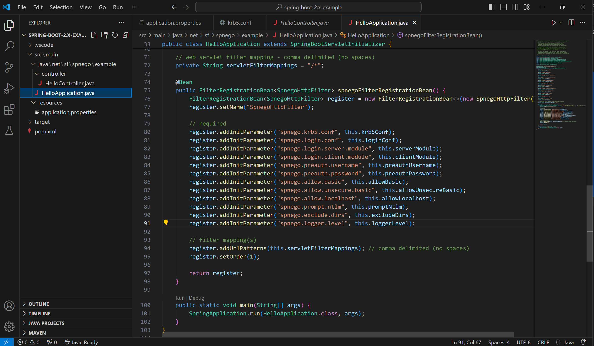

## Kerberos 授权协商过程：
>
> https://www.ibm.com/docs/zh/was-liberty/base?topic=authentication-single-sign-http-requests-using-spnego-web
>
> https://www.cnblogs.com/mfmdaoyou/p/7241712.html
>
> 

### 以下内容涉及三台服务器

KDC 和 DNS 服务器：`WIN-56OPDADOTNR.pisx.com`

app 和 tomcat 部署服务器：`server01.pisx.com`

浏览器所在`工作站`：`xiaopo.pisx.com`，工作站登录用户 `xsu01`

域：`pisx.com`

app 或者 tomcat 的预验证用户是: `xsu`

## 一、Tomcat 接入 AD 域相关配置

### 1. 配置 app 所在 Server 的 ad 域用户名密码

#### 1. 在 KDC 服务器中使用 ActiveDirectory 管理中心添加用户

> 创建用户名密码时“加密选项”需选中“次账户支持 Kerberos AES 128 位加密”以及“此账户支持 Kerberos AES 256 位加密”


#### 2. 创建此账户对应的 app所在Server 的关联

`setspn HTTP/[FQDN/Cumputer Full Name] xsu`

​	例如：Service 所在的服务器设备名称为：`server01`，所在域：`pisx.com`，设备全名：`server01.pisx.com`，则执行以下两条命令：

```shell
setspn HTTP/server01 xsu
setspn HTTP/server01.pisx.com xsu
```

#### 3. 确认 spn 已经配置正确

`setspn -l xsu`


#### 4. app 所在服务器已经加入域

1. 确认 app 所在服务器已经加入域


### 2. 配置app 所需要的 krb5.conf 和 login.conf

> default_realm 表示域

> 注意：`default_tkt_enctypes`、 `permitted_enctypes`  、`default_cts_enctypes` 必须包含：`aes256-cts-hmac-sha1-96 aes128-cts-hmac-sha1-96`

#### 1. krb5.conf

> 请注意标红的内容，务必保证其正确性


```ini
[libdefaults]
   default_realm = PISX.COM
   default_tkt_enctypes = aes128-cts rc4-hmac des3-cbc-sha1 des-cbc-md5 des-cbc-crc aes256-cts-hmac-sha1-96 aes128-cts-hmac-sha1-96
   default_tgs_enctypes = aes128-cts rc4-hmac des3-cbc-sha1 des-cbc-md5 des-cbc-crc aes256-cts-hmac-sha1-96 aes128-cts-hmac-sha1-96
   permitted_enctypes   = aes128-cts rc4-hmac des3-cbc-sha1 des-cbc-md5 des-cbc-crc aes256-cts-hmac-sha1-96 aes128-cts-hmac-sha1-96

[realms]
   PISX.COM  = {
      kdc = WIN-56OPDADOTNR.pisx.com
      default_domain = PISX.COM
}

[domain_realm]
   .PISX.COM = PISX.COM
```

#### 2. login.conf

```ini
spnego-client {
   com.sun.security.auth.module.Krb5LoginModule required;
};

spnego-server {
   com.sun.security.auth.module.Krb5LoginModule required
   storeKey=true
   isInitiator=false;
};
```

#### 3. Tomcat 相关配置

1. 下载 Spnego.jar 放入 tomcat 所在的lib 目录

> spnego-r9 表示用于 tomcat8 和 jdk8
>
> spnego-r7 表示用于 tomcat6 和 jdk1.6


2. 配置Tomcat 下的 web.xml，添加一下内容

**注意：** `spnego.preauth.username`和 `spnego.preauth.password`需改为正确的域用户和密码

**注意：** 此处的用户名密码必须是前面步骤中设置 setspn 的用户名

```xml
<filter>
    <filter-name>SpnegoHttpFilter</filter-name>
    <filter-class>net.sourceforge.spnego.SpnegoHttpFilter</filter-class>

    <init-param>
        <param-name>spnego.allow.basic</param-name>
        <param-value>true</param-value>
    </init-param>

    <init-param>
        <param-name>spnego.allow.localhost</param-name>
        <param-value>true</param-value>
    </init-param>

    <init-param>
        <param-name>spnego.allow.unsecure.basic</param-name>
        <param-value>true</param-value>
    </init-param>

    <init-param>
        <param-name>spnego.login.client.module</param-name>
        <param-value>spnego-client</param-value>
    </init-param>

    <init-param>
        <param-name>spnego.krb5.conf</param-name>
        <param-value>krb5.conf</param-value>
    </init-param>

    <init-param>
        <param-name>spnego.login.conf</param-name>
        <param-value>login.conf</param-value>
    </init-param>

    <init-param>
        <param-name>spnego.preauth.username</param-name>
        <param-value>xsu</param-value>
    </init-param>

    <init-param>
        <param-name>spnego.preauth.password</param-name>
        <param-value>Admin123</param-value>
    </init-param>

    <init-param>
        <param-name>spnego.login.server.module</param-name>
        <param-value>spnego-server</param-value>
    </init-param>

    <init-param>
        <param-name>spnego.prompt.ntlm</param-name>
        <param-value>true</param-value>
    </init-param>

    <init-param>
        <param-name>spnego.logger.level</param-name>
        <param-value>1</param-value>
    </init-param>
</filter>

<filter-mapping>
    <filter-name>SpnegoHttpFilter</filter-name>
    <url-pattern>*.jsp</url-pattern>
</filter-mapping>
```

3. 拷贝 `krb5.conf`和 `login.conf` 到 tomcat 根目录


4. 在 tomcat 的 webapps/ROOT 目录下创建hello_spnego.jsp文件

```jsp
<!DOCTYPE HTML PUBLIC "-//W3C//DTD HTML 4.01 Transitional//EN">
<html>
<head>
      <title>Hello SPNEGO Example</title>
</head>
<body>
Hello <%= request.getRemoteUser() %> !
</body>
</html>
```

5. 在`工作站`访问 [http://server01:8080/hello_spnego.jsp](http://server01:8080/hello_spnego.jsp)测试是否正常

> 注意：访问此 url 不应该输入任何用户名和密码就可以看到如下界面才算配置正确


## 二、测试 使用Keytab 文件接入（以上是使用用户名密码接入）

**注意：** 使用 spnego.jar 以及 keytab 认证，域用户必须选择支持 Kerberos AES 加密


### 1. 创建spnego-examples 文件夹

### 2. 拷贝上方 tomcat 中的 login.conf 到 `spnego-examples`文件夹并添加一下内容：

**注意：** 修改 principal 后对应的用户xsu01为自己的域用户

**注意：** principal后对应的用户必须与下方生成的 keytab 文件的用户相同

**注意：** xsu01 用户可以为任意域用户，不需要与 setspn 关联的域用户相同

```ini
custom-client {
      com.sun.security.auth.module.Krb5LoginModule required
      storeKey=true
      useKeyTab=true
      keyTab="file:///C:/spnego-examples/hellokeytab.keytab"
      principal=xsu01;
};
```

### 3. 创建测试 java 类

**注意：** 请修改下方的 URL 中的 server01 为自己 app 服务器的设备名称

```java
import java.net.URL;

import net.sourceforge.spnego.SpnegoHttpURLConnection;

public class HelloKeytab {

      public static void main(final String[] args) throws Exception {
         System.setProperty("java.security.krb5.conf", "krb5.conf");
         System.setProperty("sun.security.krb5.debug", "true");
         System.setProperty("java.security.auth.login.config", "login.conf");
            
         SpnegoHttpURLConnection spnego = null;
         
         try {
            spnego = new SpnegoHttpURLConnection("custom-client");
            spnego.connect(new URL("http://server01:8080/hello_spnego.jsp"));
            
            System.out.println("HTTP Status Code: " + spnego.getResponseCode());
            
            System.out.println("HTTP Status Message: " + spnego.getResponseMessage());

         } finally {
            if (null != spnego) {
                  spnego.disconnect();
            }
         }
      }
}
```

### 4. 生成 keytab 文件

`keytab -a [域用户名] [密码] -k [输出路径]`

例如： `ktab -a xsu01 Admin123 -k hellokeytab.keytab`

### 5. 测试

> 最后输出类似如下内容表示 keytab 生成成功。


## 三、springboot2 实现 AD 域身份验证

### 1. 创建 spring-boot-2.x-example 文件夹（Server01 服务器）

### 2. 拷贝 krb5.conf 和 login.conf 到此文件夹


### 3. 创建 springboot2 应用程序并配置 spnego

示例程序：[spring-boot-2.x-example.zip](https://spnego.sourceforge.net/spring-boot-2.x-example.zip) 

> 包含 HelloController.java 文件（用于处理 http 请求）
>
> 包含 HelloApplication.java文件（用于配饰 spnegofilter 和启动程序）
>
> 包含 application.properties用于配置 spnego 相关配置



### 4. 配置 application.properties 


### 5. 打包并在 server01 中启动

`mvn clean package` 

### 6. 拷贝spnego-r9-example-1.0-SNAPSHOT.jar 到spring-boot-2.x-example


### 7. 启动 app 并在工作站访问


## 四、pd-service-auth 接入 AD 域

### 1. 修改配置文件

> 打开pd-common-constant-lib中的配置：`spring.ad.enabled: true`
>
> 确保pd-service-auth.jar 运行时同级目录中存在 `krb5.conf` 和 `login.conf`


### 2. 修改 spnego 配置文件 krb5.conf

参考：“一、Tomcat 接入 AD 域相关配置”中相关配置

### 3. 修改预认证的用户名和密码

> spring.ad.preauth.username
>
> spring.ad.preauth.password
>
> 此处的用户名和密码需要和 setspn 配置的映射一致


