## 一、环境准备
### 1.1 OpenLDAP
- [OpenLDAP](https://www.openldap.org/) [Github](https://github.com/openldap/openldap)
- bitnami OpenLDAP [Docker](https://hub.docker.com/r/bitnami/openldap) [Github](https://github.com/bitnami/containers) 
- osixia OpenLDAP [Docker](https://hub.docker.com/r/osixia/openldap) [Github](https://github.com/osixia/docker-openldap)

```shell
docker run --detach \
  --publish 1389:1389 \
  --publish 1636:1636 \
  --env LDAP_ADMIN_USERNAME=admin \
  --env LDAP_ADMIN_PASSWORD=admin \
  --env LDAP_USERS=light \
  --env LDAP_PASSWORDS=light \
  --env LDAP_ROOT=dc=light,dc=org \
  --env LDAP_ADMIN_DN=cn=admin,dc=light,dc=org \
  --network dev \
  --restart=no \
  --name openldap \
  bitnami/openldap:latest
```

- Account
  - user: cn=light,ou=users,dc=light,dc=org  password: light

### 1.2 Apache Directory Server
- [ApacheDS](https://directory.apache.org/) [Download](https://directory.apache.org/apacheds/) [Studio Client](https://directory.apache.org/studio)
- [Apache Directory Server](https://github.com/apache/directory-server)
- itzg ApacheDS [ Docker](https://hub.docker.com/r/itzg/apacheds)

```shell
docker run --detach \
  --publish 10389:10389 \
  --network dev \
  --restart=no \
  --name apache-ds \
  itzg/apacheds:latest
```

- Account
  - user: uid=admin,ou=system  password secret

### 1.3 Apache Directory Studio
- [Studio Client](https://directory.apache.org/studio)

#### 1. 下载客户端 [Studio Client](https://directory.apache.org/studio)
#### 2. 修改配置文件 `ApacheDirectoryStudio.ini` （客户端运行需要 Jdk11 以上）

```ini
-startup
plugins/org.eclipse.equinox.launcher_1.6.0.v20200915-1508.jar
--launcher.library
plugins/org.eclipse.equinox.launcher.win32.win32.x86_64_1.2.0.v20200915-1442
/studio-rcp/resources/icons/linux/studio.xpm
###
#Uncomment_to_configure_the_language
#https://directory.apache.org/studio/faqs.html#how-to-set-the-language-of-studio
#-nl
#en
###
#Uncomment_to_configure_Java_version_to_use
#https://directory.apache.org/studio/faqs.html#how-to-set-the-java-vm-to-use
#-vm
#/usr/lib/jvm/java-11-openjdk/bin/java
-vmargs
-Dosgi.requiredJavaVersion=11
###
#Uncomment_to_configure_heap_memory
#https://directory.apache.org/studio/faqs.html#how-to-increase-the-heap-memory
#-Xms1g
#-Xmx2g
```

添加两行
```ini
-vm
D:/Develop/jdk/jdk-17/bin/java
```

#### 3. 运行程序，新建LDAP连接

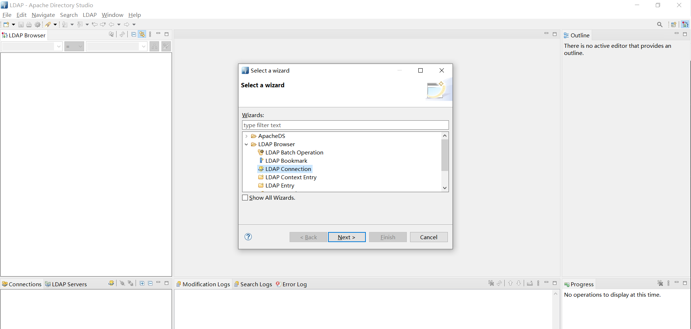

输入ldap地址端口，输入完成校验ip端口是否可用
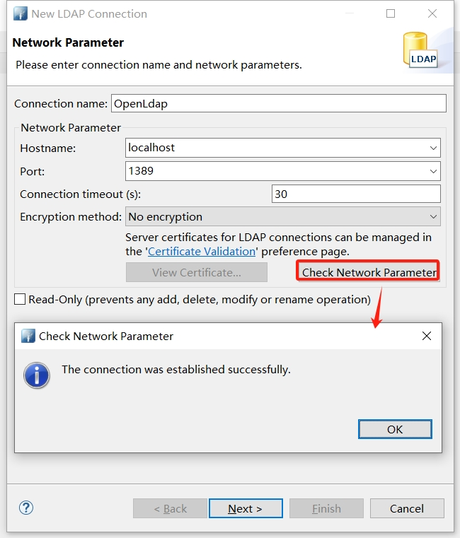

点击下一步，输入账号密码并校验
- OpenLDAP: cn=light,ou=users,dc=light,dc=org / light
- ApacheDS: uid=admin,ou=system / secret

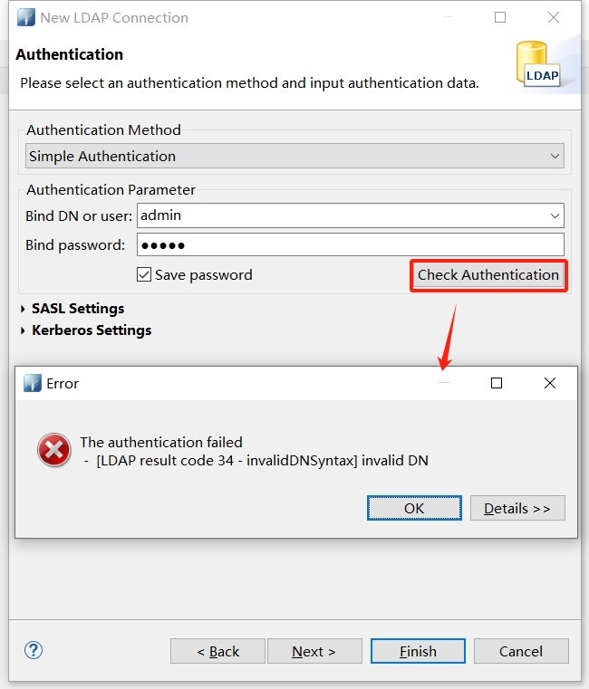

切换认证模式重试，按上面的脚本，使用 `No Authentication` 即可
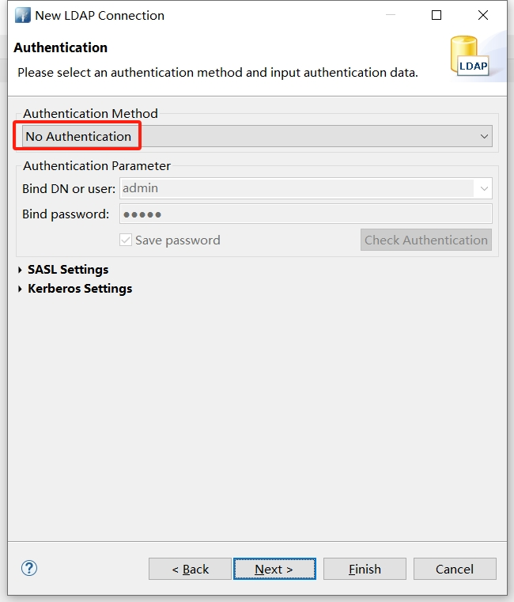

点击完成，连接成功后即可在左侧看到对应的连接和ldap信息
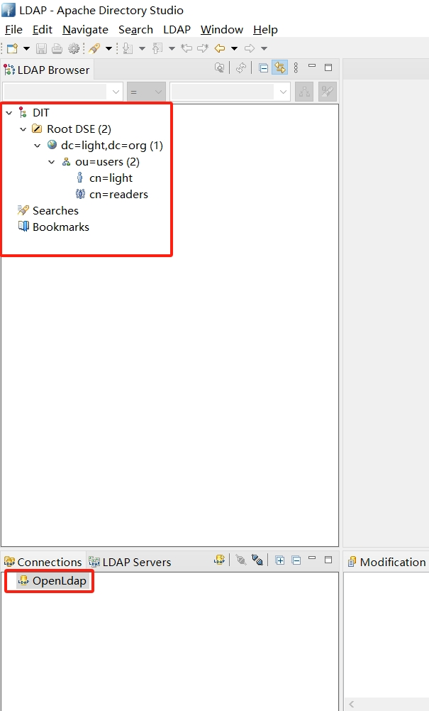

#### 4. 创建自己的Partition

Partition就好比一个完整的分区列表，在ApacheDS中，有一个默认的partition是 `dc=example,dc=com`，我们可以自定义一个Partition
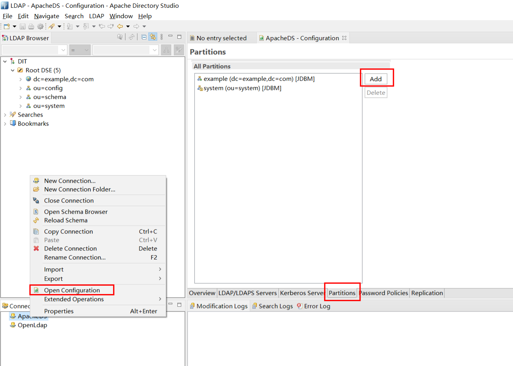

在Partitions General Detail 页面中，填入你自己的Partition ID和Suffix即可保存配置
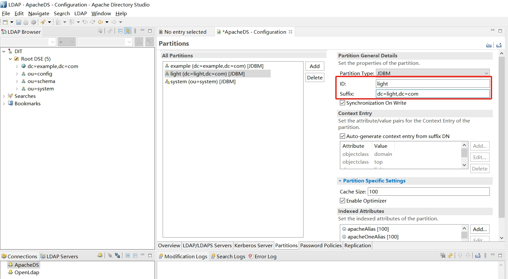

**注意：** 新建Partition后需要重启 ApacheDS 才能正常读取到

#### 5. 新增属性

Ldap自带一些objectClass，这些objectClass包含常用的属性。但在一般不能满足业务需求，需要我们自定义的属性，比如用户的roleId和groupId这两个属性
首先打开Schema Editor视图
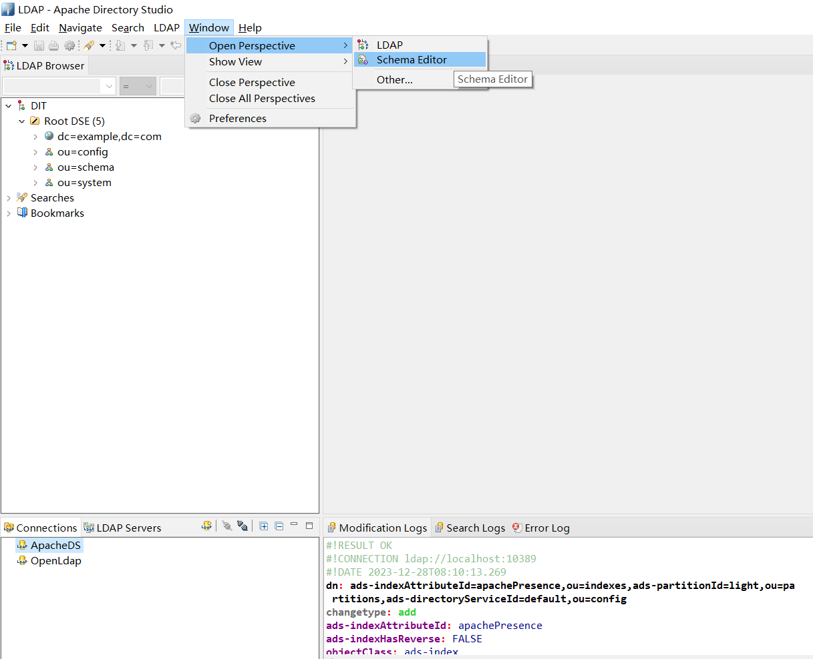

新增Schema项目，选择离线/在线并提供项目名称，Next 并全选所有类型
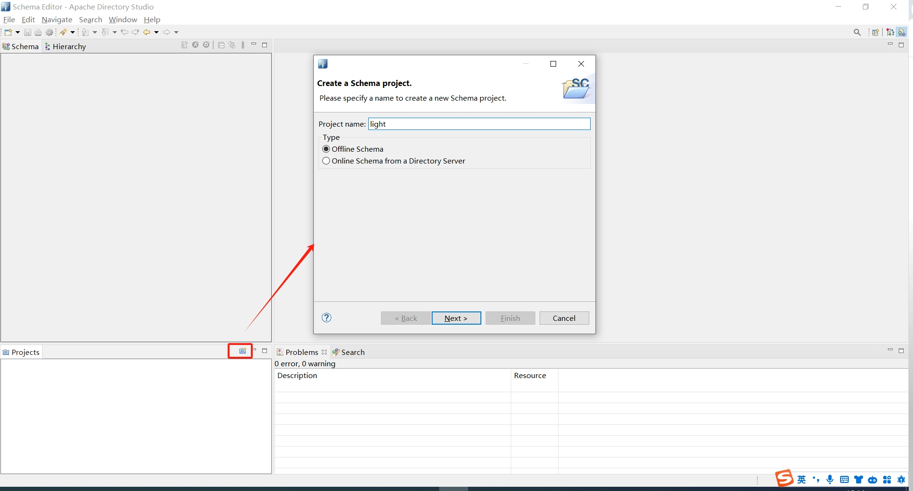

打开连接，创建具有唯一名称的新Schema
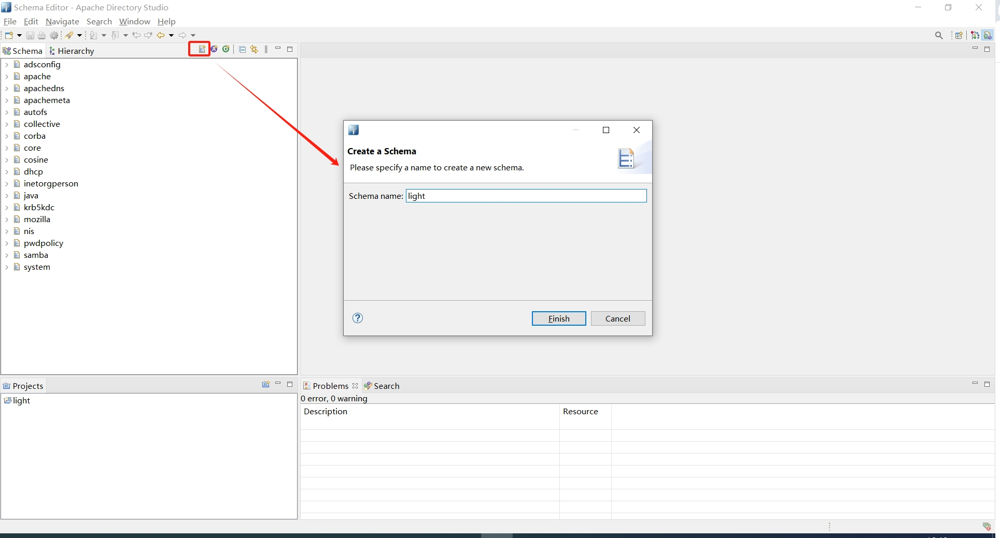

在Schema下可以为这些属性创建新的属性
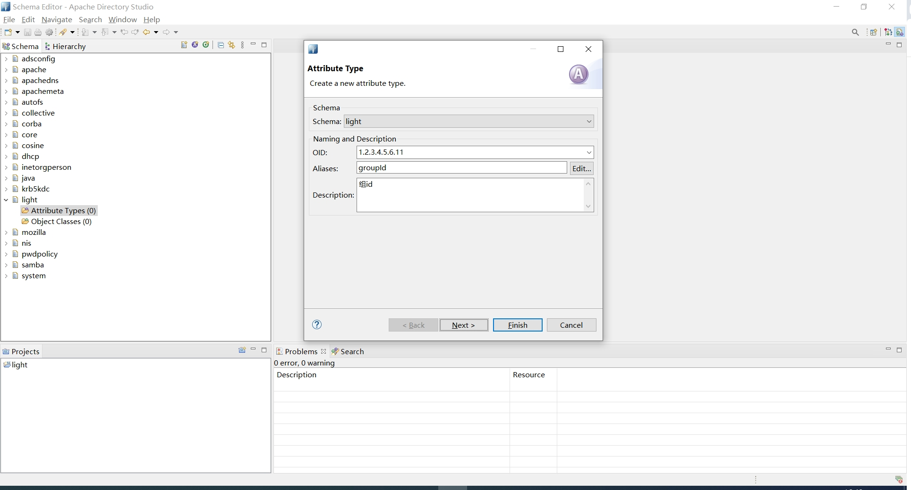
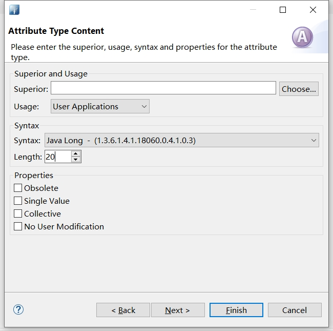
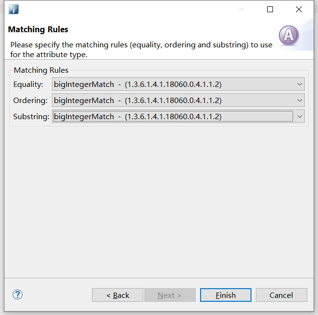

在Schema下可以为这些属性创建新的对象

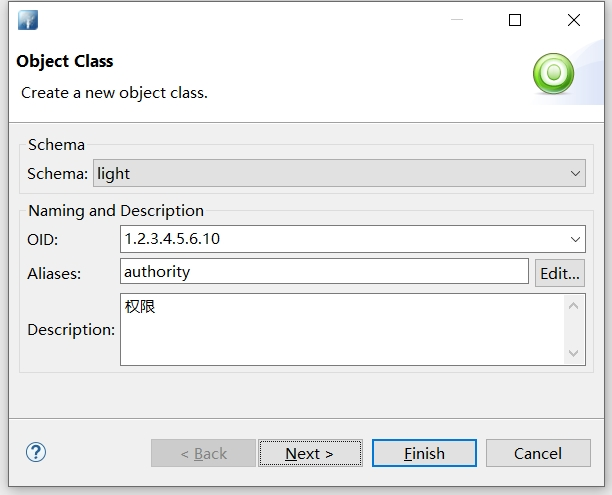
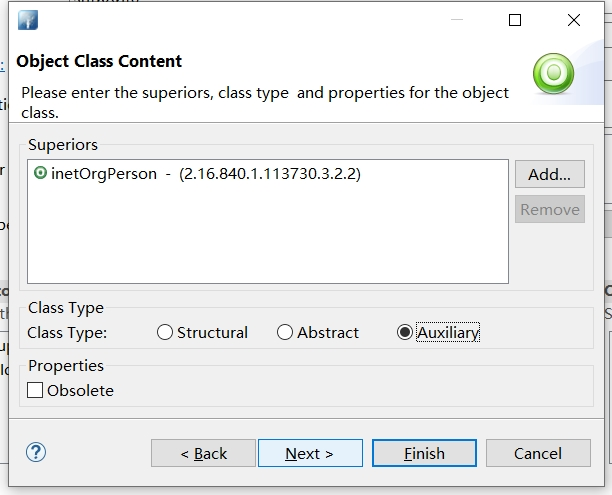
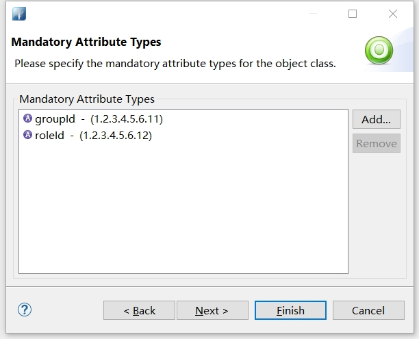

完成所有操作后，可以导出为.ldif 文件
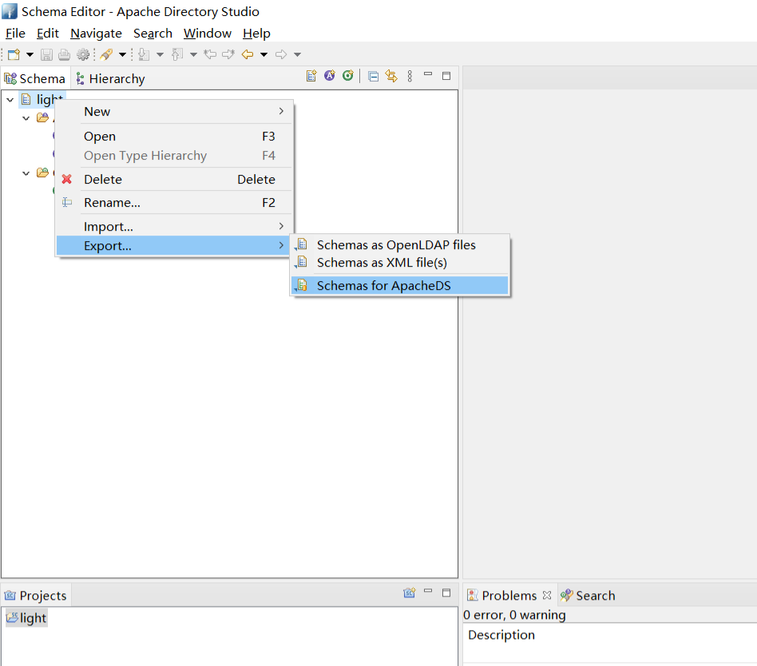

```ldif
# Generated by Apache Directory Studio on 2023年12月28日 下午5:02:28

# SCHEMA "LIGHT"
dn: cn=light, ou=schema
objectclass: metaSchema
objectclass: top
cn: light

dn: ou=attributetypes, cn=light, ou=schema
objectclass: organizationalUnit
objectclass: top
ou: attributetypes

dn: m-oid=1.2.3.4.5.6.11, ou=attributetypes, cn=light, ou=schema
objectclass: metaAttributeType
objectclass: metaTop
objectclass: top
m-oid: 1.2.3.4.5.6.11
m-name: groupId
m-description:: 57uEaWQ=
m-equality: bigIntegerMatch
m-ordering: bigIntegerMatch
m-substr: bigIntegerMatch
m-syntax: 1.3.6.1.4.1.18060.0.4.1.0.3
m-length: 20

dn: m-oid=1.2.3.4.5.6.12, ou=attributetypes, cn=light, ou=schema
objectclass: metaAttributeType
objectclass: metaTop
objectclass: top
m-oid: 1.2.3.4.5.6.12
m-name: roleId
m-description:: 6KeS6ImyaWQ=
m-equality: bigIntegerMatch
m-ordering: bigIntegerMatch
m-substr: bigIntegerMatch
m-syntax: 1.3.6.1.4.1.18060.0.4.1.0.3
m-length: 20

dn: ou=comparators, cn=light, ou=schema
objectclass: organizationalUnit
objectclass: top
ou: comparators

dn: ou=ditcontentrules, cn=light, ou=schema
objectclass: organizationalUnit
objectclass: top
ou: ditcontentrules

dn: ou=ditstructurerules, cn=light, ou=schema
objectclass: organizationalUnit
objectclass: top
ou: ditstructurerules

dn: ou=matchingrules, cn=light, ou=schema
objectclass: organizationalUnit
objectclass: top
ou: matchingrules

dn: ou=matchingruleuse, cn=light, ou=schema
objectclass: organizationalUnit
objectclass: top
ou: matchingruleuse

dn: ou=nameforms, cn=light, ou=schema
objectclass: organizationalUnit
objectclass: top
ou: nameforms

dn: ou=normalizers, cn=light, ou=schema
objectclass: organizationalUnit
objectclass: top
ou: normalizers

dn: ou=objectclasses, cn=light, ou=schema
objectclass: organizationalUnit
objectclass: top
ou: objectClasses

dn: m-oid=1.2.3.4.5.6.10, ou=objectclasses, cn=light, ou=schema
objectclass: metaObjectClass
objectclass: metaTop
objectclass: top
m-oid: 1.2.3.4.5.6.10
m-name: authority
m-description:: 5p2D6ZmQ
m-typeObjectClass: AUXILIARY
m-must: groupId
m-must: roleId

dn: ou=syntaxcheckers, cn=light, ou=schema
objectclass: organizationalUnit
objectclass: top
ou: syntaxcheckers

dn: ou=syntaxes, cn=light, ou=schema
objectclass: organizationalUnit
objectclass: top
ou: syntaxes

```

现在转到 LDAP浏览器透视图(Windows -> Open Perspective -> LDAP)，右键点击 `ou = schema` 对象，然后点击导入LDIF，导入上面的LDIF文件
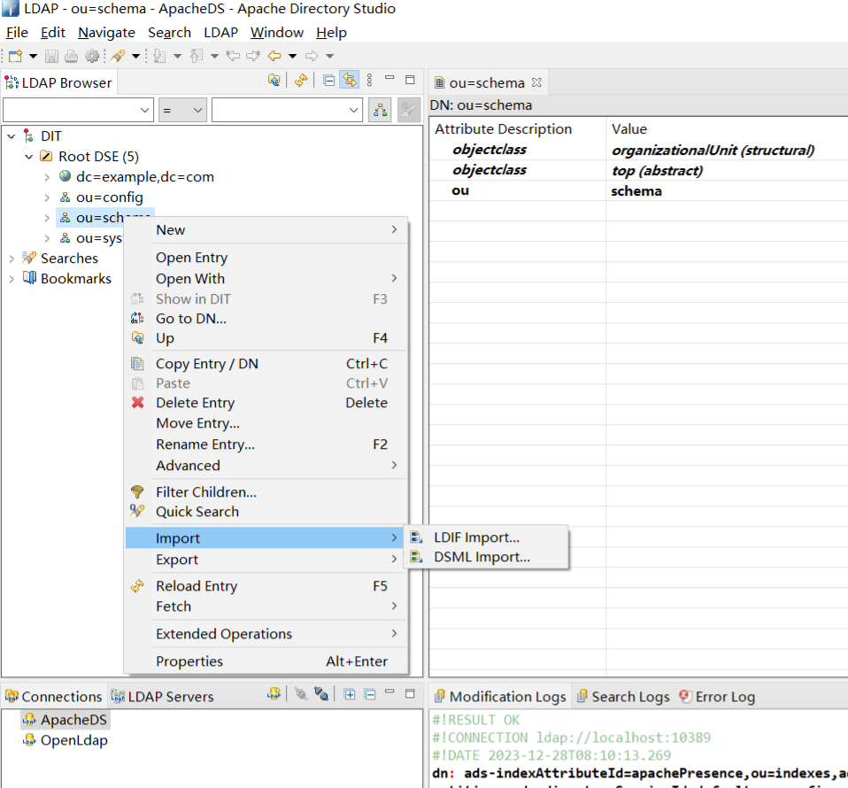

成功完成并刷新ou = schema对象，您可以看到添加的对象
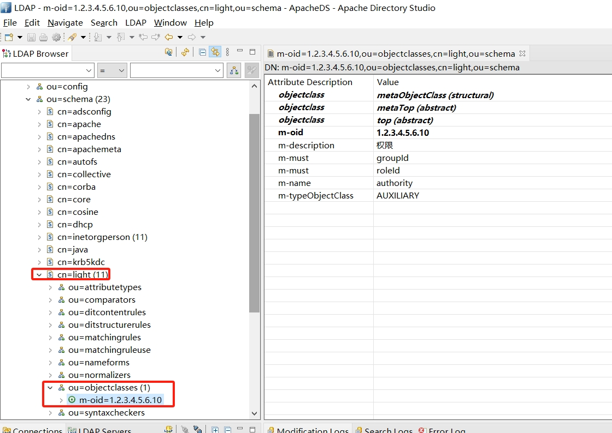

#### 6. 新增用户

新增用户，我们都通过ldif导入的方式
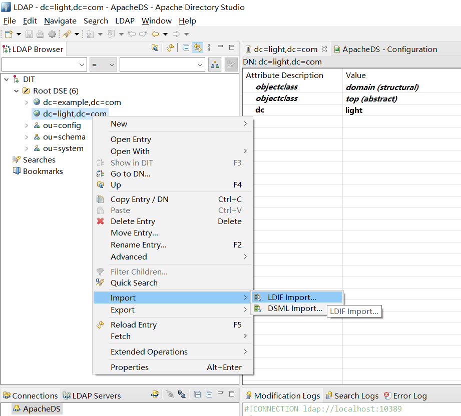

新增一个ou (people)
通过ldif文件的导入形式远比手动添加更为方便，下面是添加ou的ldif配置文件内容。并且将他们导入进去

people.ldif
```ldif
dn: ou=people,dc=light,dc=com
ou: group
objectclass: top
objectclass: organizationalUnit
```

新增一个用户 (tom)

tom.ldif
```ldif
dn: uid=tom, ou=people, dc=light,dc=com
objectClass: organizationalPerson
objectClass: person
objectClass: inetOrgPerson
objectClass: top
objectClass: authority
cn: tom
sn: tom
mobile: 123456
displayName: tom
mail: 123456@qq.com
uid: tom
userPassword: 123456
groupId: 630030462375411712
roleId: 703667259852726272
```

导入结果如图
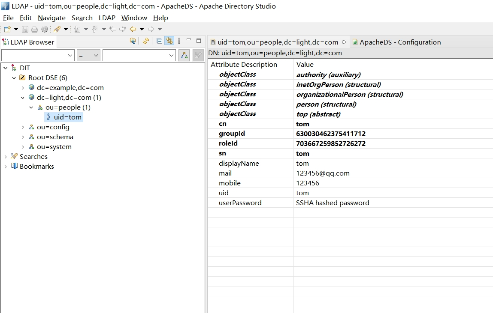

## 二、搭建服务
### 2.1 配置
pom.ml 

```xml
<dependency>
  <groupId>org.springframework.boot</groupId>
  <artifactId>spring-boot-starter-data-ldap</artifactId>
</dependency>
```

application.yaml

```yaml
spring:
  ldap:
    urls: ldap://localhost:10389
    base: ou=people,dc=light,dc=com
    username: uid=admin,ou=system
    password: secret
    base-environment.java.naming.ldap.attributes.binary: objectGUID
```

### 2.2 配置类
创建配置类，完成用Spring LDAP连接LDAP服务器，定义`LdapTemplate`，后续通过它完成对ldap目录树的CRUD操作

```java
/**
 * @see org.springframework.boot.autoconfigure.ldap.LdapAutoConfiguration
 */
@Configuration
public class LdapConfig {

    @Resource
    private LdapTemplate ldapTemplate;

    @Bean
    public LdapContextSource contextSource() {
        LdapContextSource contextSource = new LdapContextSource();
        Map<String, Object> config = new HashMap<>();
        contextSource.setUrl(urls);
        contextSource.setBase(base);
        contextSource.setUserDn(username);
        contextSource.setPassword(password);
        // 解决乱码
        config.put("java.naming.ldap.attributes.binary", "objectGUID");
        contextSource.setPooled(true);
        contextSource.setBaseEnvironmentProperties(config);
        return contextSource;
    }

    @Bean
    public LdapTemplate ldapTemplate() {
        if (null == ldapTemplate) {
            ldapTemplate = new LdapTemplate(contextSource());
        }
        return ldapTemplate;
    }

}
```

### 2.3 业务类
以下就是通过`LdapTemplate`完成CRUD功能，后续创新平台对用户进行增删改查操作都会调用这些接口将用户信息同步到LDAP服务器中

LdapTestController.java
```java
@RestController
@RequestMapping("ldap")
public class LdapTestController {

    @Resource
    private LdapService ldapService;

    @Resource
    private LdapAuthenticationProvider ldapAuthenticationProvider;

    @GetMapping("userExists")
    public ResultResponse<Boolean> userExists(String username) {
        ldapService.userExists(username);
        return ResultResponse.SUCCESS(true);
    }

    @GetMapping("userInfo")
    public ResultResponse<UserInfo> userInfo(String username) throws NamingException {
        UserInfo adapter = ldapService.userInfo(username);
        return ResultResponse.SUCCESS(adapter);
    }

    @PostMapping("authenticate")
    public ResultResponse<Object> authenticate(@RequestBody LoginParam user) {
        UsernamePasswordAuthenticationToken token = new UsernamePasswordAuthenticationToken(user.getUsername(), user.getPassword());
        Authentication authentication = ldapAuthenticationProvider.authenticate(token);
        return ResultResponse.SUCCESS(authentication.getPrincipal());
    }

}
```


LdapService.java
```java
public interface LdapService {

    /**
     * 根据用户名查询用户
     * @param username 用户名
     * @return 
     */
    void userExists(String username);

    /**
     * 根据用户名查询用户信息
     * @param username 用户名
     * @return 
     */
    UserInfo userInfo(String username) throws NamingException;

    /**
     * 登录认证
     * @param username 用户名
     * @param password 密码
     * @return
     */
    boolean authentication(String username, String password);
}
```

LdapServiceImpl.java
```java
@Service
public class LdapServiceImpl implements LdapService {

    public static final Logger log = LoggerFactory.getLogger(LdapServiceImpl.class);

    @Resource
    private LdapTemplate ldapTemplate;

    @Override
    public void userExists(String username) {
        ldapTemplate.lookup("uid=" + username);
    }

    @Override
    public UserInfo userInfo(String username) {
        Object result = ldapTemplate.lookup("uid=" + username);
        if (result instanceof DirContextAdapter) {
            return parse((DirContextAdapter) result);
        }
        return null;
    }

    @Override
    public boolean authentication(String username, String password) {
        EqualsFilter filter = new EqualsFilter("uid", username);
        return ldapTemplate.authenticate("", filter.encode(), password);
    }

    public UserInfo parse(DirContextAdapter adapter) {
        Map<String, LdapAttributeVO> attributeMap = parseAttributes(adapter);

        LdapAttributeVO uid = attributeMap.get("uid");
        LdapAttributeVO userPassword = attributeMap.get("userPassword");
        LdapAttributeVO displayName = attributeMap.get("displayName");
        LdapAttributeVO mobile = attributeMap.get("mobile");
        LdapAttributeVO mail = attributeMap.get("mail");
//        LdapAttributeVO groupId = attributeMap.get("groupId");
//        LdapAttributeVO roleId = attributeMap.get("roleId");
//        List<Long> groupIds = Arrays.stream(groupId.getValue().toString().split(",")).map(Long::valueOf).collect(Collectors.toList());
//        List<Long> roleIds = Arrays.stream(roleId.getValue().toString().split(",")).map(Long::valueOf).collect(Collectors.toList());

        Object value = userPassword.getValue();
        String password = (value instanceof String) ? (String) value : new String((byte[]) value);
        UserInfo userInfo = new UserInfo();
        userInfo.setUsername(parseValue(uid.getValue().toString()));
        userInfo.setRealname(parseValue(displayName.getValue().toString()));
        userInfo.setPassword(password);
        userInfo.setEmail(parseValue(mail.getValue().toString()));
        userInfo.setPhone(parseValue(mobile.getValue().toString()));
//        userInfo.setGroupIdList(groupIds);
//        userInfo.setRoleIdList(roleIds);

        return userInfo;
    }

    public String parseValue(String value) {
        Charset charset = CharsetTool.detect(value);
        if (StandardCharsets.UTF_8.equals(charset)) {
            return value;
        }
        return new String(value.getBytes(charset), StandardCharsets.UTF_8);
    }

    public Map<String, LdapAttributeVO> parseAttributes(DirContextAdapter adapter) {
        Map<String, LdapAttributeVO> attributeMap = new HashMap<>(16);
        NamingEnumeration<? extends Attribute> attributesEnum = adapter.getAttributes().getAll();
        try {
            while (attributesEnum.hasMoreElements()) {
                Attribute attribute = attributesEnum.next();

                LdapAttributeVO attributeVO = convertAttribute(attribute);
                attributeMap.put(attributeVO.getName(), attributeVO);
            }
        } catch (Exception e) {
            e.printStackTrace();
        }

        return attributeMap;
    }

    public LdapAttributeVO convertAttribute(Attribute attribute) throws NamingException {
        String id = attribute.getID();
        Object value = attribute.get();
        String name = id;
        List<String> langTags = new ArrayList<>();
        List<String> options = new ArrayList<>();
        if (id.contains(";")) {
            String[] ids = id.split(";");
            name = ids[0];
            for (int i = 1, len = ids.length; i < len; i++) {
                String tag = ids[i];
                if (tag.startsWith("lang-")) {
                    tag = tag.substring("lang-".length());
                    langTags.add(tag);
                } else {
                    options.add(tag);
                }
            }
        }
        LdapAttributeVO ldapAttributeVO = new LdapAttributeVO();
        ldapAttributeVO.setName(name);
        ldapAttributeVO.setLangTags(langTags);
        ldapAttributeVO.setOptions(options);
        ldapAttributeVO.setValue(value);
        return ldapAttributeVO;
    }

}
```

LdapAttributeVO.java
```java
@Data
public class LdapAttributeVO implements Serializable {

    private static final long serialVersionUID = -1L;

    /**
     * 属性名
     */
    private String name;
    /**
     * 属性语言标签
     */
    private List<String> langTags;
    /**
     * 属性额外配置信息
     */
    private List<String> options;

    /**
     * 值
     */
    private Object value;
}
```

UserInfo.java
```java
@Data
public class UserInfo implements Serializable {

    private static final long serialVersionUID = 1L;
    /**
     * 用户来源的第三方系统系统标识，如：ldap，wecom，dingtalk等
     */
    @NotNull(message = "第三方系统系统标识不能为空")
    private String thirdSource;
    /**
     * 用户名
     */
    @NotNull(message = "用户名不能为空")
    private String username;
    /**
     * 用户姓名
     */
    @NotNull(message = "用户真实名字不能为空")
    private String realname;
    /**
     * 密码
     */
    @NotNull
    @Length(min = 5, max = 50, message = "用户密码长度应该在5 -50之间")
    private String password;
    /**
     * 邮箱
     */
    @NotNull(message = "邮箱不能为空")
    private String email;
    /**
     * 手机号
     */
    @NotNull(message = "手机号不能为空")
    private String phone;
    /**
     * 主部门
     */
    @NotNull(message = "主部门不能为空")
    private Long mainDepartmentId;
    /**
     * 状态 0-正常；1-删除、冻结
     */
    @NotNull(message = "状态不能为空")
    @Max(value = 1, message = "状态最大为1")
    @Min(value = 0, message = "状态最小为0")
    private Integer status;
    /**
     * 角色id集合
     */
    private List<Long> roleIdList;
    /**
     * 分组id集合
     */
    private List<Long> groupIdList;

}
```

## 三、测试效果

## 四、集成OAuth2
