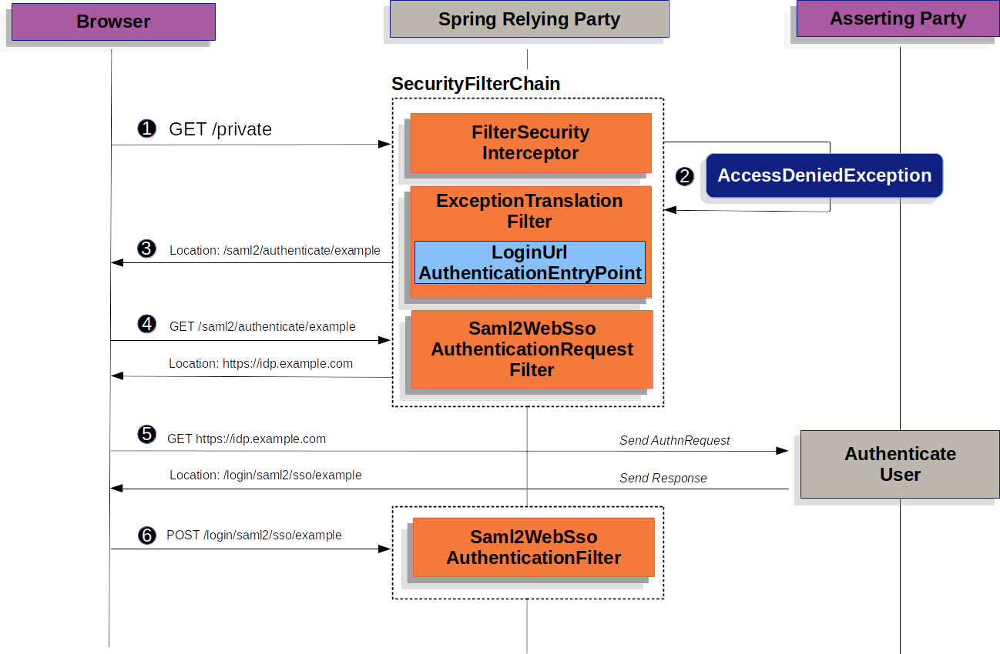
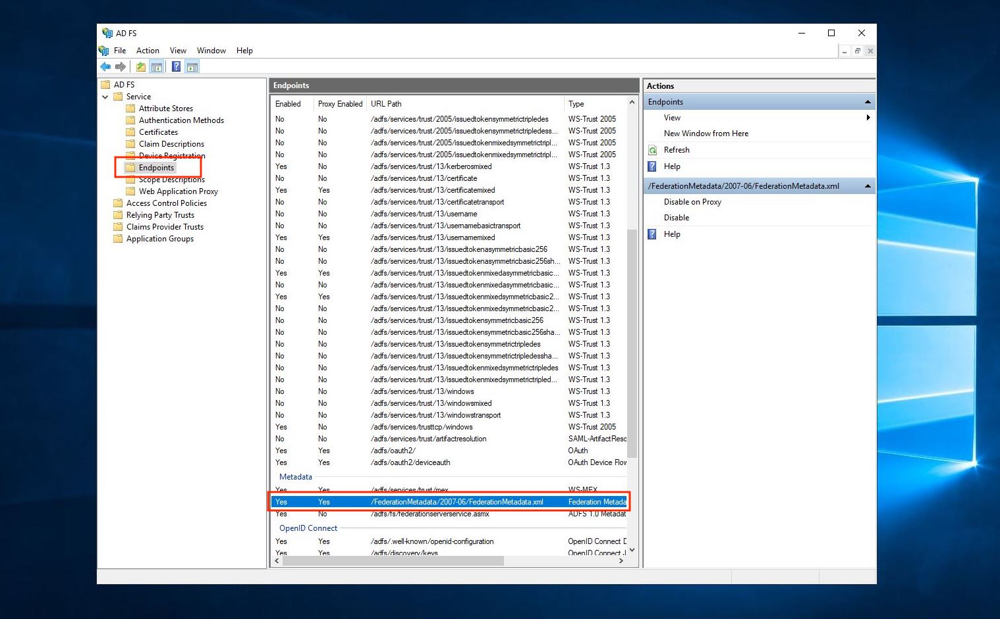
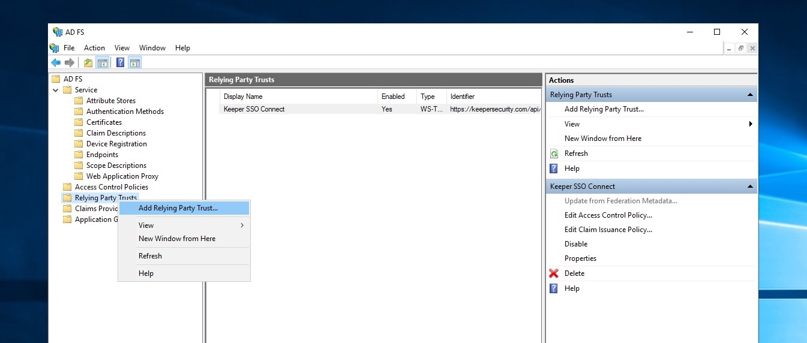
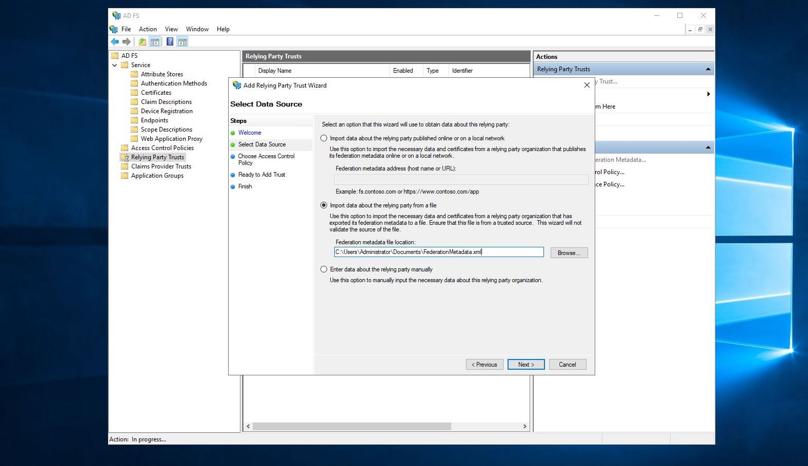
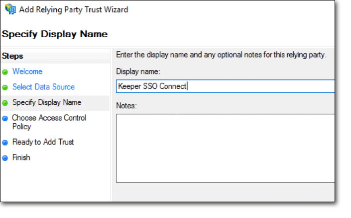
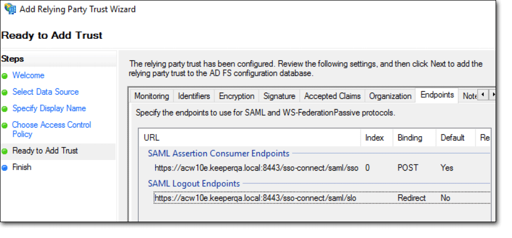
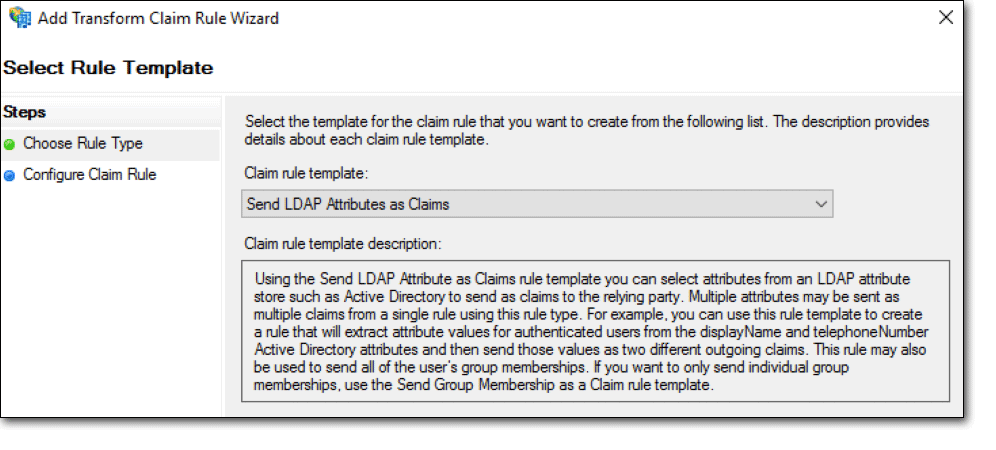
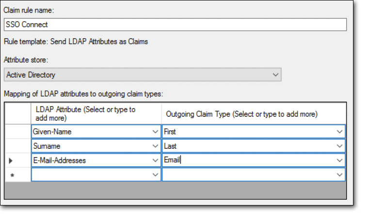

## 相关网站
- [Spring SAML2](https://docs.spring.io/spring-security/reference/servlet/saml2/index.html)

- [Microsoft - 标识和访问文档](https://learn.microsoft.com/zh-cn/windows-server/identity/identity-and-access)
- [Microsoft - AD FS 概述](https://learn.microsoft.com/zh-cn/windows-server/identity/ad-fs/ad-fs-overview)

- [Microsoft - SAML SSO协议](https://learn.microsoft.com/zh-cn/entra/identity-platform/single-sign-on-saml-protocol)
- [Microsoft - 自定义 SAML 令牌声明](https://learn.microsoft.com/zh-cn/entra/identity-platform/saml-claims-customization#edit-nameid)
- [Microsoft - 疑难解答](https://learn.microsoft.com/zh-cn/entra/identity/enterprise-apps/troubleshoot-password-based-sso)

- [阿里云 - 使用AD FS进行角色SSO的示例](https://help.aliyun.com/zh/ram/user-guide/implement-role-based-sso-from-ad-fs)
- [腾讯云 - ADFS 用户 SSO 使用说明](https://cloud.tencent.com/document/product/598/84174)
- [Keeper SSO Connect - Microsoft AD FS](https://docs.keeper.io/sso-connect-cloud/identity-provider-setup/ad-fs-keeper)

- [解析SAML Request Response](https://www.samltool.com/decode.php)
- [校验SAML Request](https://www.samltool.com/validate_authn_req.php)
- [校验SAML Response](https://www.samltool.com/validate_response.php)

## 一、概念
在学习之前，首先要了解SAML的概念，SAML主要有三个身份：用户/浏览器，服务提供商，身份提供商

### 1. 身份提供者
“身份提供者”和“断言方”是同义词，在ADFS，OKta通常叫做IDP，而在Spring这些经常被缩写为AP。简而言之用户需要重定向到IDP去登录，以绕过服务提供商，避免让服务提供商获取用户敏感信息。

- IDP（Identity Provider）身份提供者
  - 解释：IDP负责验证用户的身份，并生成包含有关用户身份信息的安全断言（assertion）。在SAML中，IDP通常是由一个组织或服务提供商提供的，用于验证用户身份。

- AP（Attribute Provider）属性提供者，基本等同IDP
  - 解释：AP是一个提供用户属性信息的实体。在SAML中，这些属性信息可能包括用户的姓名、电子邮件地址、角色等。AP通常与IDP分开，以便属性信息可以由专门的实体进行管理。

### 2. 服务提供者
“服务提供者”和“信赖方”也是同义词，在ADFS，OKta通常叫做SP，而在Spring通常叫做RP。

- SP（Service Provider）服务提供者
  - 解释：SP是依赖SAML断言来对用户进行授权的实体。SP可能是一个Web应用程序、服务或资源，它依赖IDP生成的断言来确定用户是否有权访问受保护的资源。

- RP（Relying Party）依赖方 SP 同义词
  - 解释：RP是指依赖SAML断言来接受或拒绝用户访问请求的实体。RP可以是SP的同义词，表示它依赖IDP生成的断言来进行用户授权。

### 3. SAML认证时序图

我们先来看看SAML 2.0依赖方认证在Spring Security中是如何工作的。首先，我们看到，像OAuth 2.0 登录一样，Spring Security 将用户带到第三方进行认证。它通过一系列的重定向来做到这一点。



以上是根据Spring官方文档来描述，请参考：[SAML 2.0 Login Overview](https://docs.spring.io/spring-security/reference/servlet/saml2/login/overview.html)

## 二、IDP配置 (ADFS Server)
可以参考 [Microsoft AD FS](https://docs.keeper.io/sso-connect-cloud/identity-provider-setup/ad-fs-keeper)

### 1. 获取联合元数据 XML
在 AD FS 管理应用程序内，找到联合元数据 xml 文件。单击 `AD FS` > `服务` > `端点`，然后在 `元数据` 部分中找到 URL 路径即可找到此信息。该路径通常为`/FederationMetadata/2007-06/FederationMetadata.xml` ，如下所示：




### 2. 下载元数据
要下载元数据文件，通常可以通过在服务器上的浏览器中加载 URL 来找到该文件。例如： `https://idp.example.com/FederationMetadata/2007-06/FederationMetadata.xml` 下载此文件并保存到计算机。

这个步骤是可选的，你可以直接copy这个url，在后续Spring Boot 配置中直接导入

### 3. 创建信赖信任方

创建你的服务作为依赖信任方（以Spring 配置为例）



导入你的程元数据
通过完成信赖方信任向导，导入之前从Spring导出的 SP Metadata元数据(见 3.4 获取 SP 元数据)，如以下步骤所示：

Welcom步骤选择 `Claims aware`

在公网可以用的话选用第一项，更新很方便，否则选用第二项自行导入，因为要求必须是https链接，或者设置局域网https



输入显示名称



选择访问控制策略


配置Logout端点



到这一步点完成就可以了

但是还缺一步，ADFS需要你配置发放的字段，至少需要配置一个NameID属性，否则你会发现登录完报错，可自行尝试。接下来是配置属性

**注意：** Metadata也可以手动配置，不通过导入 `Metadata.xml`，配置下面两个属性即可
- 终结点（Assertion Consumer Endpoints）: `https://sp.example.com:8080/oauth/saml/SSO/adfs`
- 信赖方标识符 (Identifier): `https://sp.example.com:8080/oauth`

### 4. 创建 Claims 签发策略规则

要在 AD FS 和 App 之间映射属性，您需要创建一个声明发布策略，其中将LDAP 属性作为声明发送，并将 LDAP 属性映射到 SpringApp 属性。

编辑 Claims 签发策略


添加规则


选择规则类型



配置Claims属性及名称



**重要提示：** 确保 至少有个属性（“NameID“）配置为使用如上所示的准确拼写。

到此ADFS配置完成

## 三、SP配置 (Spring Boot Application)
### 1. 导入依赖
```xml
<dependency>
    <groupId>org.springframework.security</groupId>
    <artifactId>spring-security-saml2-service-provider</artifactId>
</dependency>
```

### 2. 指定身份提供者（Identity Provider）元数据
```yaml
spring:
  security:
    saml2:
      relyingparty:
        registration:
          metadata:
            entity-id: "{baseUrl}"
            singlelogout:
              binding: POST
              url: "{baseUrl}/saml/logout"
              responseUrl: "{baseUrl}/saml/SingleLogout"
            acs:
              location: "{baseUrl}/saml/sso/{registrationId}"
            assertingparty:
              metadata-uri: https://idp.example.com/FederationMetadata/2007-06/FederationMetadata.xml
            identityprovider:
              singlesignon:
                sign-request: false
              entity-id: "{baseUrl}"
              sso-url: https://idp.example.com/adfs/ls/
              metadata-uri: https://idp.example.com/FederationMetadata/2007-06/FederationMetadata.xml

```

其中：

- `entity-id` 是身份提供者发出的SAML响应中的 Issuer 属性所包含的值,在adfs就是你的唯一id，相当于依赖方的 `<EntityDescriptor EntityID="..."/>` 中找到的值。该值可能包含多个占位符。它们是baseUrl 、 registrationId 、 baseScheme 、 baseHost和basePort
- `singlelogout.url` 是SingleLogoutService 位置相当于依赖方的 `<SPSSODescriptor>` 中的 `<SingleLogoutService Location="..."/>` 中找到的值。。
- `acs.location` 是AssertionConsumerService 位置。相当于依赖方的 `<SPSSODescriptor>` 中的 `<AssertionConsumerService Location="..."/>` 中找到的值该值可能包含多个占位符。它们是baseUrl 、 registrationId 、 baseScheme 、 baseHost和basePort 。
- `assertingparty.metadata-uri` 是断言方元数据文件的基于类路径或文件的位置或 HTTP 端点

### 3. 配置类
```java
import org.springframework.beans.factory.annotation.Value;
import org.springframework.boot.autoconfigure.security.saml2.Saml2RelyingPartyProperties;
import org.springframework.context.annotation.Bean;
import org.springframework.context.annotation.Configuration;
import org.springframework.core.convert.converter.Converter;
import org.springframework.security.config.annotation.web.builders.HttpSecurity;
import org.springframework.security.saml2.core.Saml2X509Credential;
import org.springframework.security.saml2.provider.service.metadata.OpenSamlMetadataResolver;
import org.springframework.security.saml2.provider.service.registration.InMemoryRelyingPartyRegistrationRepository;
import org.springframework.security.saml2.provider.service.registration.RelyingPartyRegistration;
import org.springframework.security.saml2.provider.service.registration.RelyingPartyRegistrationRepository;
import org.springframework.security.saml2.provider.service.registration.RelyingPartyRegistrations;
import org.springframework.security.saml2.provider.service.servlet.filter.Saml2WebSsoAuthenticationFilter;
import org.springframework.security.saml2.provider.service.web.DefaultRelyingPartyRegistrationResolver;
import org.springframework.security.saml2.provider.service.web.Saml2MetadataFilter;
import org.springframework.security.web.SecurityFilterChain;
import org.springframework.security.web.util.matcher.AntPathRequestMatcher;

import javax.servlet.http.HttpServletRequest;
import java.io.File;
import java.io.FileInputStream;
import java.io.IOException;
import java.io.InputStream;
import java.security.cert.CertificateException;
import java.security.cert.CertificateFactory;
import java.security.cert.X509Certificate;
import java.security.interfaces.RSAPrivateKey;
import java.util.UUID;
import java.util.stream.Collectors;

@Configuration
public class SecurityConfig  {


    @Bean
    SecurityFilterChain securityFilterChain(HttpSecurity http, RelyingPartyRegistrationRepository registrations) throws Exception {
        DefaultRelyingPartyRegistrationResolver relyingPartyRegistrationResolver =
                new DefaultRelyingPartyRegistrationResolver(registrations);
        Saml2MetadataFilter metadataFilter = new Saml2MetadataFilter(
                (Converter<HttpServletRequest, RelyingPartyRegistration>) relyingPartyRegistrationResolver,
                new OpenSamlMetadataResolver());
        metadataFilter.setRequestMatcher(new AntPathRequestMatcher("/saml/metadata/{registrationId}", "GET"));

        // @formatter:off
        http.authorizeRequests()
                .antMatchers("/app", "/error").permitAll()
                .antMatchers("/saml/**", "/saml2/**").permitAll()
                .anyRequest().authenticated()
                .and()
                .saml2Login((saml2) -> saml2.loginProcessingUrl("/saml/sso/{registrationId}"))
                .addFilterBefore(metadataFilter, Saml2WebSsoAuthenticationFilter.class)
//                .saml2Logout((saml2) -> saml2.logoutRequest((request) -> request.logoutUrl("/oauth/saml/logout")))
//                .saml2Logout((saml2) -> saml2.logoutResponse((response) -> response.logoutUrl("/oauth/saml/SingleLogout")))
                .csrf().disable()
                .cors().disable();

        return http.build();
    }

    @Bean
    InMemoryRelyingPartyRegistrationRepository repository(Saml2RelyingPartyProperties properties) {
//        Saml2X509Credential signing = Saml2X509Credential.signing(key, x509Certificate(cert));
        Saml2RelyingPartyProperties.Registration registration = properties.getRegistration().values().iterator().next();
        return new InMemoryRelyingPartyRegistrationRepository(RelyingPartyRegistrations
                .collectionFromMetadataLocation(registration.getAssertingparty().getMetadataUri()).stream()
                .map((builder) -> builder.registrationId(UUID.randomUUID().toString())
                        .entityId(registration.getEntityId())
                        .registrationId("adfs")
                        .assertionConsumerServiceLocation(registration.getAcs().getLocation())
                        .singleLogoutServiceLocation(registration.getSinglelogout().getUrl())
                        .singleLogoutServiceResponseLocation(registration.getSinglelogout().getResponseUrl())
//                        .signingX509Credentials((credentials) -> credentials.add(signing))
                        .build())
                .collect(Collectors.toList()));
    }

    X509Certificate x509Certificate(File location) {
        try (InputStream source = new FileInputStream(location)) {
            return (X509Certificate) CertificateFactory.getInstance("X.509").generateCertificate(source);
        }
        catch (CertificateException | IOException ex) {
            throw new IllegalArgumentException(ex);
        }
    }

}
```

### 4. 获取 SP 元数据
- 获取SP Metadata: `https://sp.example.com:8080/oauth/saml/metadata/adfs`
  - 此功能需要添加 `Saml2MetadataFilter`，默认URL为 `/saml2/service-provider-metadata/{registrationId}`，文件名默认为 `saml-{registrationId}-metadata.xml`

```xml
<?xml version="1.0" encoding="UTF-8"?>
<EntityDescriptor entityID="https://sp.example.com:8080/oauth" xmlns="urn:oasis:names:tc:SAML:2.0:metadata">
    <md:SPSSODescriptor WantAssertionsSigned="true"
        protocolSupportEnumeration="urn:oasis:names:tc:SAML:2.0:protocol" xmlns:md="urn:oasis:names:tc:SAML:2.0:metadata">
        <md:AssertionConsumerService
            Binding="urn:oasis:names:tc:SAML:2.0:bindings:HTTP-POST"
            Location="https://sp.example.com:8080/oauth/saml/sso/adfs" index="1"/>
    </md:SPSSODescriptor>
</EntityDescriptor>
```

就这样！已经完成了最小配置！

程序启动之后 访问 `http://sp.example.com:8080` 应该就可以登录了，登录界面如下

## 四、示例

### 1. 请求流程
1. 访问 `https://plmmidqas2.sfdomain.com:9100/test/home` 页面
2. 发送请求 `https://plmmidqas2.sfdomain.com:31888/oauth/samlLogin`
3. 没有认证，重定向到 `https://plmmidqas2.sfdomain.com:31888/oauth/saml2/authenticate/adfs`
  - 见 `Saml2WebSsoAuthenticationRequestFilter`，默认URL为 `/saml2/authenticate/{registrationId}`
4. 组装SAML认证请求，重定向到 `https://adfs.sf-auto.com/adfs/ls/`
  - AD FS Server
5. 输入用户名密码，再次请求 `https://adfs.sf-auto.com/adfs/ls/`
6. 携带认证结果，重定向 `https://plmmidqas2.sfdomain.com:31888/saml/SSO/adfs`
  - 见 `Saml2WebSsoAuthenticationFilter`，默认URL为 `/login/saml2/sso/{registrationId}`
7. 根据结果进行认证，认证成功后回调开始的请求地址 `https://plmmidqas2.sfdomain.com:31888/oauth/samlLogin`


### 2. 请求参数解析 SAMLRequest
上面第四步携带的请求参数示例
```shell
SAMLRequest: lZFNb4JAEIbv/RVk78t+iAobwdCapiY2WsEeelthqSSwi8xi+vOLoom9mPS4szPPTJ53Nv+pK+ekWiiNDhFzKXKUzkxe6u8Q7dJX7KN59DQDWVe8EXFnD3qrjp0C68QAqrX93IvR0NWqTVR7KjO1265CdLC2AUFIU9V1mR8lcBeK3NSy1G5majFivu8TI3sgOcNJkqyJzAtAzqKHl1ray0U3zvmrJ+B+wJwBlwKpgCBnuQhRvP2YsiAoWI6pzMfY8zKK95T5eFLIkSd5kI0473sBOrXUYKW2IeKUe5gyTKcp9QULxJi5bBJ8IWfTGmsyUz2XelDRtVoYCSUILWsFwmYiid9XgrtU7IcmEG9pusGbdZIi5/OmlJ+V9pI1iEHiY1ZzXYyiwbm4XNzeEx4D5C0VFP0jgxm53xZdn38Dj34B
```

这个参数需要[Base64 Decode + Inflate解析](https://www.samltool.com/decode.php)为XML并[格式化](https://c.runoob.com/front-end/710/)
```xml
<?xml version="1.0" encoding="UTF-8"?>
<saml2p:AuthnRequest AssertionConsumerServiceURL="https://plmmidqas2.sfdomain.com:31888/oauth/saml/SSO/adfs" 
					 Destination="https://adfs.sf-auto.com/adfs/ls/" 
					 ID="ARQ7199f1d-0ad5-44c0-b018-6fa34a29c322" 
					 IssueInstant="2024-01-07T08:19:51.169Z" 
					 ProtocolBinding="urn:oasis:names:tc:SAML:2.0:bindings:HTTP-POST" 
					 Version="2.0"
					 xmlns:saml2p="urn:oasis:names:tc:SAML:2.0:protocol">
  <saml2:Issuer
    xmlns:saml2="urn:oasis:names:tc:SAML:2.0:assertion">https://plmmidqas2.sfdomain.com:31888/oauth
  
  </saml2:Issuer>
</saml2p:AuthnRequest>
```

对请求参数进行简单的[校验](https://www.samltool.com/validate_authn_req.php)

- `SAML AuthN Request`: 请求的XML
- `SP EntityId`: `https://plmmidqas2.sfdomain.com:31888/oauth`
- `Target URL, Destination of the AuthN Request`: `https://adfs.sf-auto.com/adfs/ls/`

### 3. 响应值解析 SAMLResponse
上面第六步携带的认证结果示例
```shell
SAMLResponse: PHNhbWxwOlJlc3BvbnNlIElEPSJfNjM2MmZjOGMtYWFkOS00M2EwLTljM2QtNTcyZTUwY2FiOWU2IiBWZXJzaW9uPSIyLjAiIElzc3VlSW5zdGFudD0iMjAyNC0wMS0wN1QwODoyMDo0NC4wMjVaIiBEZXN0aW5hdGlvbj0iaHR0cHM6Ly9wbG1taWRxYXMyLnNmZG9tYWluLmNvbTozMTg4OC9vYXV0aC9zYW1sL1NTTy9hZGZzIiBDb25zZW50PSJ1cm46b2FzaXM6bmFtZXM6dGM6U0FNTDoyLjA6Y29uc2VudDp1bnNwZWNpZmllZCIgSW5SZXNwb25zZVRvPSJBUlE3MTk5ZjFkLTBhZDUtNDRjMC1iMDE4LTZmYTM0YTI5YzMyMiIgeG1sbnM6c2FtbHA9InVybjpvYXNpczpuYW1lczp0YzpTQU1MOjIuMDpwcm90b2NvbCI+PElzc3VlciB4bWxucz0idXJuOm9hc2lzOm5hbWVzOnRjOlNBTUw6Mi4wOmFzc2VydGlvbiI+aHR0cDovL2FkZnMuc2YtYXV0by5jb20vYWRmcy9zZXJ2aWNlcy90cnVzdDwvSXNzdWVyPjxzYW1scDpTdGF0dXM+PHNhbWxwOlN0YXR1c0NvZGUgVmFsdWU9InVybjpvYXNpczpuYW1lczp0YzpTQU1MOjIuMDpzdGF0dXM6U3VjY2VzcyIgLz48L3NhbWxwOlN0YXR1cz48QXNzZXJ0aW9uIElEPSJfN2U4ODA4NWYtZWYyZS00MTBhLWEwMGQtODRkZjhkYzQ1MThjIiBJc3N1ZUluc3RhbnQ9IjIwMjQtMDEtMDdUMDg6MjA6NDQuMDI1WiIgVmVyc2lvbj0iMi4wIiB4bWxucz0idXJuOm9hc2lzOm5hbWVzOnRjOlNBTUw6Mi4wOmFzc2VydGlvbiI+PElzc3Vlcj5odHRwOi8vYWRmcy5zZi1hdXRvLmNvbS9hZGZzL3NlcnZpY2VzL3RydXN0PC9Jc3N1ZXI+PGRzOlNpZ25hdHVyZSB4bWxuczpkcz0iaHR0cDovL3d3dy53My5vcmcvMjAwMC8wOS94bWxkc2lnIyI+PGRzOlNpZ25lZEluZm8+PGRzOkNhbm9uaWNhbGl6YXRpb25NZXRob2QgQWxnb3JpdGhtPSJodHRwOi8vd3d3LnczLm9yZy8yMDAxLzEwL3htbC1leGMtYzE0biMiIC8+PGRzOlNpZ25hdHVyZU1ldGhvZCBBbGdvcml0aG09Imh0dHA6Ly93d3cudzMub3JnLzIwMDEvMDQveG1sZHNpZy1tb3JlI3JzYS1zaGEyNTYiIC8+PGRzOlJlZmVyZW5jZSBVUkk9IiNfN2U4ODA4NWYtZWYyZS00MTBhLWEwMGQtODRkZjhkYzQ1MThjIj48ZHM6VHJhbnNmb3Jtcz48ZHM6VHJhbnNmb3JtIEFsZ29yaXRobT0iaHR0cDovL3d3dy53My5vcmcvMjAwMC8wOS94bWxkc2lnI2VudmVsb3BlZC1zaWduYXR1cmUiIC8+PGRzOlRyYW5zZm9ybSBBbGdvcml0aG09Imh0dHA6Ly93d3cudzMub3JnLzIwMDEvMTAveG1sLWV4Yy1jMTRuIyIgLz48L2RzOlRyYW5zZm9ybXM+PGRzOkRpZ2VzdE1ldGhvZCBBbGdvcml0aG09Imh0dHA6Ly93d3cudzMub3JnLzIwMDEvMDQveG1sZW5jI3NoYTI1NiIgLz48ZHM6RGlnZXN0VmFsdWU+MzFrSUdOdkxzQTk3YWdCUTRXSmlMWWsyVUtDM212UEl0cGVySEtaVzd3dz08L2RzOkRpZ2VzdFZhbHVlPjwvZHM6UmVmZXJlbmNlPjwvZHM6U2lnbmVkSW5mbz48ZHM6U2lnbmF0dXJlVmFsdWU+Y3VKQWhPZWN0eENBT0Y4ZWRaVHp4T0tTOWpSeEhVNE1jUU9QNXFkZXk3WjdTQnZOOEdzeUs5ekVFNFVXYUJaYytnVm5sVFNPMXlyNmhhaWNkYktnN2FOeUpLWmFZV1NsaXBxc2RoUnNIOFJKZFBrOHI3aUJwNER5aVhQTVZUcFJGVHI5cDZJQmhCOUV3elUyNnFlN0RkZm9pSlcraVgxekNmNDZwci9DdXJueExSeERlT0tuYURoTHk4VjBVZWRqSk1YR1ZBQlRHOWsxajVYd1gwREgxQ0lUK0wzQ0x2d0cwNUVzUmJTWkdhclcwaWMrYWdWS1lDbDVEYlRNNWsvNnFzam9GWFhhMkFFUzNiQUp5bWNuOTd5UWd1ZjZpM3hxd3RCbE92ek9sTC9UTXpMTW55cnhXYXN4ZE83QnVFSEVhOFpxTVRyRVV0ek1PbzQzdThoRzRnPT08L2RzOlNpZ25hdHVyZVZhbHVlPjxLZXlJbmZvIHhtbG5zPSJodHRwOi8vd3d3LnczLm9yZy8yMDAwLzA5L3htbGRzaWcjIj48ZHM6WDUwOURhdGE+PGRzOlg1MDlDZXJ0aWZpY2F0ZT5NSUlIbHpDQ0JYK2dBd0lCQWdJUUNUQytvb1hYSVRBMmJhTk5FTXhhbmpBTkJna3Foa2lHOXcwQkFRc0ZBREJjTVFzd0NRWURWUVFHRXdKVlV6RVhNQlVHQTFVRUNoTU9SR2xuYVVObGNuUXNJRWx1WXk0eE5EQXlCZ05WQkFNVEsxSmhjR2xrVTFOTUlFZHNiMkpoYkNCVVRGTWdVbE5CTkRBNU5pQlRTRUV5TlRZZ01qQXlNaUJEUVRFd0hoY05Nak13T1RFNU1EQXdNREF3V2hjTk1qUXhNREV5TWpNMU9UVTVXakFZTVJZd0ZBWURWUVFEREEwcUxuTm1MV0YxZEc4dVkyOXRNSUlCSWpBTkJna3Foa2lHOXcwQkFRRUZBQU9DQVE4QU1JSUJDZ0tDQVFFQXVZQTZKM0RLVk81dCt3VkRmUGpJWnF1SmtiTTJkaE00UHpxNGtBME5XK2V3NkNrZDJnUmpuYXRTVTVtMlFnRWh1dzJjL3l2U25FbDdKMG5tTlBBQm9EZ3N6azRiaGtSRElyNVdZVUFQbTBXRnB2V2NIWHM0NEJwUXJxdUlOcUdHWFhUS3laV2FDYWhUN3hFYkJaRmx5Z3l2dU91NkZzK201Q01SdTRKbVNTZWo0MSs4YUJwa3d2QW9Ueld4NjZYLzcxS3U5UXdJU0pwajV3QmEvN3VmV3pqVDN6dlFTUnNPU1ptWkRRTTdSejEzSUlkL0RLTkZmcjZoRjJ4TzJBTXVaL2kraXdFSDI2bmdRRGtxazgydGtZYUVwa2N0MDlSUTBuTWlhRnJyb1QvM3hsM2RlbU00eHJRRmE1blhqM3RHTHNnLzBVZEpDOGlJcVlPMUdzcXNvd0lEQVFBQm80SURsekNDQTVNd0h3WURWUjBqQkJnd0ZvQVU4SnlGL2FLZmZZL0phTHZWMUlsTkhiN1RrUDh3SFFZRFZSME9CQllFRkJCdjZyeUV0RmxOWW9IUGZpL3A0ZDltcHNlK01DVUdBMVVkRVFRZU1CeUNEU291YzJZdFlYVjBieTVqYjIyQ0MzTm1MV0YxZEc4dVkyOXRNRDRHQTFVZElBUTNNRFV3TXdZR1o0RU1BUUlCTUNrd0p3WUlLd1lCQlFVSEFnRVdHMmgwZEhBNkx5OTNkM2N1WkdsbmFXTmxjblF1WTI5dEwwTlFVekFPQmdOVkhROEJBZjhFQkFNQ0JhQXdIUVlEVlIwbEJCWXdGQVlJS3dZQkJRVUhBd0VHQ0NzR0FRVUZCd01DTUlHZkJnTlZIUjhFZ1pjd2daUXdTS0JHb0VTR1FtaDBkSEE2THk5amNtd3pMbVJwWjJsalpYSjBMbU52YlM5U1lYQnBaRk5UVEVkc2IySmhiRlJNVTFKVFFUUXdPVFpUU0VFeU5UWXlNREl5UTBFeExtTnliREJJb0VhZ1JJWkNhSFIwY0RvdkwyTnliRFF1WkdsbmFXTmxjblF1WTI5dEwxSmhjR2xrVTFOTVIyeHZZbUZzVkV4VFVsTkJOREE1TmxOSVFUSTFOakl3TWpKRFFURXVZM0pzTUlHSEJnZ3JCZ0VGQlFjQkFRUjdNSGt3SkFZSUt3WUJCUVVITUFHR0dHaDBkSEE2THk5dlkzTndMbVJwWjJsalpYSjBMbU52YlRCUkJnZ3JCZ0VGQlFjd0FvWkZhSFIwY0RvdkwyTmhZMlZ5ZEhNdVpHbG5hV05sY25RdVkyOXRMMUpoY0dsa1UxTk1SMnh2WW1Gc1ZFeFRVbE5CTkRBNU5sTklRVEkxTmpJd01qSkRRVEV1WTNKME1Bd0dBMVVkRXdFQi93UUNNQUF3Z2dGL0Jnb3JCZ0VFQWRaNUFnUUNCSUlCYndTQ0FXc0JhUUIyQU83TjBHVFYyeHJPeFZ5M25iVE5FNkl5aDBaOHZPemV3MUZJV1VaeEg3V2JBQUFCaXF0cUExSUFBQVFEQUVjd1JRSWhBSkJRekwyMlp0dzR1VlBaVGcvR3hlMzlXRVZBM3dXY05OOGVFMXFBUzBPSEFpQWF5cVRFRDJVOVVmQVhHNUpvZjM3TzBUTUxISDNJanFOVG1lSnJrSThvcXdCMkFFaXc0MnZhcGtjMEQrVnFBdnFkTU9zY1VnSExWdDBzZ2RtN3Y2czUySVJ6QUFBQmlxdHFBM1VBQUFRREFFY3dSUUlnSkMreVNZMlY2NGVKN0J2a0tJdm54bWh6L1RCbVliY1UwbVNiTDhFcEJqa0NJUUN1cnNZRlpaY0I1OWRzQkJLaXgraHVVUHJHbUplNi9jcG5qSmFzY1ExOHFBQjNBTnEydjJzL3RiWWluNXZDdTF4cjZIQ1JjV3k3VVlTRk5MMmtQVEJJMS91ckFBQUJpcXRxQTZFQUFBUURBRWd3UmdJaEFKZXh4WjJxbnVqTkNDVmZ2ZTFaMThhdmZNVCtTVEhpdkxtVFFyV1dzZ3AyQWlFQXNldDR4d1NRQVRnM2hhT1dhN1dLTXVoSjAwaFBwelUrUFI1cTNoQUszZ2d3RFFZSktvWklodmNOQVFFTEJRQURnZ0lCQUk5NVJ2UDFBSUlSMyt0bU5QZ1QzRE9wbisxdUI0VFA3NCt3Z3QrWjB4dGJQbldVNUpxdjYxLzR0alpmZ2o1QjE1djVZbENhb3ZGS1FCMkxPRllhT3dBYy8xMGRGVTBqVnpDUTFlajU3cCtRL2habEpMNDEwNkZtOG1tc012U1BFMjlKTHFZSnh1bjZuTFZIelQ0T3NMMHN6a3oyRWl2OEw1MXNVdkFPZWtrSUo2RENYc1FqNHNqZVNja2FWK2tCZkVKSEZCdnJRRkxvbExYQzYyLzg3Y1BNSlUvbFQxYW42bnFmcHVlZ1pweldrRXJuS3NGcUtsTzZvdGJwTWJ5YnBkMVk5SFpkYlhnSkl5cUJxbjUrSmp0cHlyT3podGFNUWc0OEhGb21JdFhBRUVndE1iYkRFZUx1eVdSSzQ0eG1iYmNUZStnRVJ0MnlrWjZ2czYybUxRRUorQVl5YlBZTDVGTTRhcTB5YmZXUjZaKzNGSTZFdml1SUYzV3Exc1lSUTB0MlJla1lzZEx3eEZHT0FZd0tIdllPcUFzRkx6RnhhM0dYTlVsek80TXU3SllTMWtiMnZqM0R2d3FMZDRzeFRzRkRqM0dMaVN2K2oraVVzZFQvcTJpa0cwUzJjc2ZQNmhrWnY5cG9PakkrbGM2Z2xWeFpVaFUwRUkyTVh0anV2M2pRU0VyMkNYLzhsUjFBMHZKNjNCRjZPTXBjSmNBRjBqTTF0WFNCQXR0K3N1VFp1anc1dkZ2cW1vSGpqVWJ4R2lHS0Mza2xYd1R4aXJyTjRsNkxPak81SUk0NTZLaWtwYkQ3YjJwUVJoOU9EK0xZWkRLRE5LNXA0LzVvRm5XOGdKdnFrNzVPcjRGT0M1Nzk1RTFCaUtTTnJoUmx1V0lkcy80RjJlRGtUTGJuPC9kczpYNTA5Q2VydGlmaWNhdGU+PC9kczpYNTA5RGF0YT48L0tleUluZm8+PC9kczpTaWduYXR1cmU+PFN1YmplY3Q+PE5hbWVJRD55YW5nZ3VhbmctdkBzZmRvbWFpbi5jb208L05hbWVJRD48U3ViamVjdENvbmZpcm1hdGlvbiBNZXRob2Q9InVybjpvYXNpczpuYW1lczp0YzpTQU1MOjIuMDpjbTpiZWFyZXIiPjxTdWJqZWN0Q29uZmlybWF0aW9uRGF0YSBJblJlc3BvbnNlVG89IkFSUTcxOTlmMWQtMGFkNS00NGMwLWIwMTgtNmZhMzRhMjljMzIyIiBOb3RPbk9yQWZ0ZXI9IjIwMjQtMDEtMDdUMDg6MjU6NDQuMDI1WiIgUmVjaXBpZW50PSJodHRwczovL3BsbW1pZHFhczIuc2Zkb21haW4uY29tOjMxODg4L29hdXRoL3NhbWwvU1NPL2FkZnMiIC8+PC9TdWJqZWN0Q29uZmlybWF0aW9uPjwvU3ViamVjdD48Q29uZGl0aW9ucyBOb3RCZWZvcmU9IjIwMjQtMDEtMDdUMDg6MjA6NDQuMDIzWiIgTm90T25PckFmdGVyPSIyMDI0LTAxLTA3VDA5OjIwOjQ0LjAyM1oiPjxBdWRpZW5jZVJlc3RyaWN0aW9uPjxBdWRpZW5jZT5odHRwczovL3BsbW1pZHFhczIuc2Zkb21haW4uY29tOjMxODg4L29hdXRoPC9BdWRpZW5jZT48L0F1ZGllbmNlUmVzdHJpY3Rpb24+PC9Db25kaXRpb25zPjxBdHRyaWJ1dGVTdGF0ZW1lbnQ+PEF0dHJpYnV0ZSBOYW1lPSJodHRwOi8vc2NoZW1hcy54bWxzb2FwLm9yZy93cy8yMDA1LzA1L2lkZW50aXR5L2NsYWltcy9lbWFpbGFkZHJlc3MiPjxBdHRyaWJ1dGVWYWx1ZT55YW5nZ3VhbmctdkBzZi5sb2NhbDwvQXR0cmlidXRlVmFsdWU+PC9BdHRyaWJ1dGU+PEF0dHJpYnV0ZSBOYW1lPSJodHRwOi8vc2NoZW1hcy54bWxzb2FwLm9yZy93cy8yMDA1LzA1L2lkZW50aXR5L2NsYWltcy9uYW1lIj48QXR0cmlidXRlVmFsdWU+5p2o5YWJ77yIUExNLS3lpJbpg6jpob7pl67vvIk8L0F0dHJpYnV0ZVZhbHVlPjwvQXR0cmlidXRlPjwvQXR0cmlidXRlU3RhdGVtZW50PjxBdXRoblN0YXRlbWVudCBBdXRobkluc3RhbnQ9IjIwMjQtMDEtMDdUMDg6MjA6NDQuMDAwWiIgU2Vzc2lvbkluZGV4PSJfN2U4ODA4NWYtZWYyZS00MTBhLWEwMGQtODRkZjhkYzQ1MThjIj48QXV0aG5Db250ZXh0PjxBdXRobkNvbnRleHRDbGFzc1JlZj51cm46ZmVkZXJhdGlvbjphdXRoZW50aWNhdGlvbjp3aW5kb3dzPC9BdXRobkNvbnRleHRDbGFzc1JlZj48L0F1dGhuQ29udGV4dD48L0F1dGhuU3RhdGVtZW50PjwvQXNzZXJ0aW9uPjwvc2FtbHA6UmVzcG9uc2U+
```

这个响应值需要[Base64 Decode + Inflate解析](https://www.samltool.com/decode.php)为XML并[格式化](https://c.runoob.com/front-end/710/)
```xml
<samlp:Response ID="_6362fc8c-aad9-43a0-9c3d-572e50cab9e6" 
				Version="2.0" 
				IssueInstant="2024-01-07T08:20:44.025Z" 
				Destination="https://plmmidqas2.sfdomain.com:31888/oauth/saml/SSO/adfs" 
				Consent="urn:oasis:names:tc:SAML:2.0:consent:unspecified" 
				InResponseTo="ARQ7199f1d-0ad5-44c0-b018-6fa34a29c322"
  xmlns:samlp="urn:oasis:names:tc:SAML:2.0:protocol">
  <Issuer
    xmlns="urn:oasis:names:tc:SAML:2.0:assertion">http://adfs.sf-auto.com/adfs/services/trust
  </Issuer>
  <samlp:Status>
    <samlp:StatusCode Value="urn:oasis:names:tc:SAML:2.0:status:Success" />
  </samlp:Status>
  <Assertion ID="_7e88085f-ef2e-410a-a00d-84df8dc4518c" IssueInstant="2024-01-07T08:20:44.025Z" Version="2.0"
    xmlns="urn:oasis:names:tc:SAML:2.0:assertion">
    <Issuer>http://adfs.sf-auto.com/adfs/services/trust</Issuer>
    <ds:Signature
      xmlns:ds="http://www.w3.org/2000/09/xmldsig#">
      <ds:SignedInfo>
        <ds:CanonicalizationMethod Algorithm="http://www.w3.org/2001/10/xml-exc-c14n#" />
        <ds:SignatureMethod Algorithm="http://www.w3.org/2001/04/xmldsig-more#rsa-sha256" />
        <ds:Reference URI="#_7e88085f-ef2e-410a-a00d-84df8dc4518c">
          <ds:Transforms>
            <ds:Transform Algorithm="http://www.w3.org/2000/09/xmldsig#enveloped-signature" />
            <ds:Transform Algorithm="http://www.w3.org/2001/10/xml-exc-c14n#" />
          </ds:Transforms>
          <ds:DigestMethod Algorithm="http://www.w3.org/2001/04/xmlenc#sha256" />
          <ds:DigestValue>31kIGNvLsA97agBQ4WJiLYk2UKC3mvPItperHKZW7ww=</ds:DigestValue>
        </ds:Reference>
      </ds:SignedInfo>
      <ds:SignatureValue>cuJAhOectxCAOF8edZTzxOKS9jRxHU4McQOP5qdey7Z7SBvN8GsyK9zEE4UWaBZc+gVnlTSO1yr6haicdbKg7aNyJKZaYWSlipqsdhRsH8RJdPk8r7iBp4DyiXPMVTpRFTr9p6IBhB9EwzU26qe7DdfoiJW+iX1zCf46pr/CurnxLRxDeOKnaDhLy8V0UedjJMXGVABTG9k1j5XwX0DH1CIT+L3CLvwG05EsRbSZGarW0ic+agVKYCl5DbTM5k/6qsjoFXXa2AES3bAJymcn97yQguf6i3xqwtBlOvzOlL/TMzLMnyrxWasxdO7BuEHEa8ZqMTrEUtzMOo43u8hG4g==</ds:SignatureValue>
      <KeyInfo
        xmlns="http://www.w3.org/2000/09/xmldsig#">
        <ds:X509Data>
          <ds:X509Certificate>MIIHlzCCBX+gAwIBAgIQCTC+ooXXITA2baNNEMxanjANBgkqhkiG9w0BAQsFADBcMQswCQYDVQQGEwJVUzEXMBUGA1UEChMORGlnaUNlcnQsIEluYy4xNDAyBgNVBAMTK1JhcGlkU1NMIEdsb2JhbCBUTFMgUlNBNDA5NiBTSEEyNTYgMjAyMiBDQTEwHhcNMjMwOTE5MDAwMDAwWhcNMjQxMDEyMjM1OTU5WjAYMRYwFAYDVQQDDA0qLnNmLWF1dG8uY29tMIIBIjANBgkqhkiG9w0BAQEFAAOCAQ8AMIIBCgKCAQEAuYA6J3DKVO5t+wVDfPjIZquJkbM2dhM4Pzq4kA0NW+ew6Ckd2gRjnatSU5m2QgEhuw2c/yvSnEl7J0nmNPABoDgszk4bhkRDIr5WYUAPm0WFpvWcHXs44BpQrquINqGGXXTKyZWaCahT7xEbBZFlygyvuOu6Fs+m5CMRu4JmSSej41+8aBpkwvAoTzWx66X/71Ku9QwISJpj5wBa/7ufWzjT3zvQSRsOSZmZDQM7Rz13IId/DKNFfr6hF2xO2AMuZ/i+iwEH26ngQDkqk82tkYaEpkct09RQ0nMiaFrroT/3xl3demM4xrQFa5nXj3tGLsg/0UdJC8iIqYO1GsqsowIDAQABo4IDlzCCA5MwHwYDVR0jBBgwFoAU8JyF/aKffY/JaLvV1IlNHb7TkP8wHQYDVR0OBBYEFBBv6ryEtFlNYoHPfi/p4d9mpse+MCUGA1UdEQQeMByCDSouc2YtYXV0by5jb22CC3NmLWF1dG8uY29tMD4GA1UdIAQ3MDUwMwYGZ4EMAQIBMCkwJwYIKwYBBQUHAgEWG2h0dHA6Ly93d3cuZGlnaWNlcnQuY29tL0NQUzAOBgNVHQ8BAf8EBAMCBaAwHQYDVR0lBBYwFAYIKwYBBQUHAwEGCCsGAQUFBwMCMIGfBgNVHR8EgZcwgZQwSKBGoESGQmh0dHA6Ly9jcmwzLmRpZ2ljZXJ0LmNvbS9SYXBpZFNTTEdsb2JhbFRMU1JTQTQwOTZTSEEyNTYyMDIyQ0ExLmNybDBIoEagRIZCaHR0cDovL2NybDQuZGlnaWNlcnQuY29tL1JhcGlkU1NMR2xvYmFsVExTUlNBNDA5NlNIQTI1NjIwMjJDQTEuY3JsMIGHBggrBgEFBQcBAQR7MHkwJAYIKwYBBQUHMAGGGGh0dHA6Ly9vY3NwLmRpZ2ljZXJ0LmNvbTBRBggrBgEFBQcwAoZFaHR0cDovL2NhY2VydHMuZGlnaWNlcnQuY29tL1JhcGlkU1NMR2xvYmFsVExTUlNBNDA5NlNIQTI1NjIwMjJDQTEuY3J0MAwGA1UdEwEB/wQCMAAwggF/BgorBgEEAdZ5AgQCBIIBbwSCAWsBaQB2AO7N0GTV2xrOxVy3nbTNE6Iyh0Z8vOzew1FIWUZxH7WbAAABiqtqA1IAAAQDAEcwRQIhAJBQzL22Ztw4uVPZTg/Gxe39WEVA3wWcNN8eE1qAS0OHAiAayqTED2U9UfAXG5Jof37O0TMLHH3IjqNTmeJrkI8oqwB2AEiw42vapkc0D+VqAvqdMOscUgHLVt0sgdm7v6s52IRzAAABiqtqA3UAAAQDAEcwRQIgJC+ySY2V64eJ7BvkKIvnxmhz/TBmYbcU0mSbL8EpBjkCIQCursYFZZcB59dsBBKix+huUPrGmJe6/cpnjJascQ18qAB3ANq2v2s/tbYin5vCu1xr6HCRcWy7UYSFNL2kPTBI1/urAAABiqtqA6EAAAQDAEgwRgIhAJexxZ2qnujNCCVfve1Z18avfMT+STHivLmTQrWWsgp2AiEAset4xwSQATg3haOWa7WKMuhJ00hPpzU+PR5q3hAK3ggwDQYJKoZIhvcNAQELBQADggIBAI95RvP1AIIR3+tmNPgT3DOpn+1uB4TP74+wgt+Z0xtbPnWU5Jqv61/4tjZfgj5B15v5YlCaovFKQB2LOFYaOwAc/10dFU0jVzCQ1ej57p+Q/hZlJL4106Fm8mmsMvSPE29JLqYJxun6nLVHzT4OsL0szkz2Eiv8L51sUvAOekkIJ6DCXsQj4sjeSckaV+kBfEJHFBvrQFLolLXC62/87cPMJU/lT1an6nqfpuegZpzWkErnKsFqKlO6otbpMbybpd1Y9HZdbXgJIyqBqn5+JjtpyrOzhtaMQg48HFomItXAEEgtMbbDEeLuyWRK44xmbbcTe+gERt2ykZ6vs62mLQEJ+AYybPYL5FM4aq0ybfWR6Z+3FI6EviuIF3Wq1sYRQ0t2RekYsdLwxFGOAYwKHvYOqAsFLzFxa3GXNUlzO4Mu7JYS1kb2vj3DvwqLd4sxTsFDj3GLiSv+j+iUsdT/q2ikG0S2csfP6hkZv9poOjI+lc6glVxZUhU0EI2MXtjuv3jQSEr2CX/8lR1A0vJ63BF6OMpcJcAF0jM1tXSBAtt+suTZujw5vFvqmoHjjUbxGiGKC3klXwTxirrN4l6LOjO5II456KikpbD7b2pQRh9OD+LYZDKDNK5p4/5oFnW8gJvqk75Or4FOC5795E1BiKSNrhRluWIds/4F2eDkTLbn</ds:X509Certificate>
        </ds:X509Data>
      </KeyInfo>
    </ds:Signature>
    <Subject>
      <NameID>yangguang-v@sfdomain.com</NameID>
      <SubjectConfirmation Method="urn:oasis:names:tc:SAML:2.0:cm:bearer">
        <SubjectConfirmationData InResponseTo="ARQ7199f1d-0ad5-44c0-b018-6fa34a29c322" NotOnOrAfter="2024-01-07T08:25:44.025Z" Recipient="https://plmmidqas2.sfdomain.com:31888/oauth/saml/SSO/adfs" />
      </SubjectConfirmation>
    </Subject>
    <Conditions NotBefore="2024-01-07T08:20:44.023Z" NotOnOrAfter="2024-01-07T09:20:44.023Z">
      <AudienceRestriction>
        <Audience>https://plmmidqas2.sfdomain.com:31888/oauth</Audience>
      </AudienceRestriction>
    </Conditions>
    <AttributeStatement>
      <Attribute Name="http://schemas.xmlsoap.org/ws/2005/05/identity/claims/emailaddress">
        <AttributeValue>yangguang-v@sf.local</AttributeValue>
      </Attribute>
      <Attribute Name="http://schemas.xmlsoap.org/ws/2005/05/identity/claims/name">
        <AttributeValue>杨光（PLM--外部顾问）</AttributeValue>
      </Attribute>
    </AttributeStatement>
    <AuthnStatement AuthnInstant="2024-01-07T08:20:44.000Z" SessionIndex="_7e88085f-ef2e-410a-a00d-84df8dc4518c">
      <AuthnContext>
        <AuthnContextClassRef>urn:federation:authentication:windows</AuthnContextClassRef>
      </AuthnContext>
    </AuthnStatement>
  </Assertion>
</samlp:Response>
```

对响应值进行简单的[校验](https://www.samltool.com/validate_authn_req.php)

- `SAML Response`: 响应的的XML
- `IdP EntityId`: `http://adfs.sf-auto.com/adfs/services/trust`
- `SP EntityId`: `https://plmmidqas2.sfdomain.com:31888/oauth`
- `SP Attribute Consume Service Endpoint`: `https://plmmidqas2.sfdomain.com:31888/oauth/saml/SSO/adfs`
- `Target URL, Destination of the Response`: `https://plmmidqas2.sfdomain.com:31888/oauth/saml/SSO/adfs`
- `X.509 cert of the IdP (to check Signature)`: 响应XML中的 `<ds:X509Certificate></ds:X509Certificate>`

## 五、注意事项

### 1. 响应状态码
取值为`Status` - `StatusCode` 的 `value` 属性
- `urn:oasis:names:tc:SAML:2.0:status:Success` 表示认证成功，没有或为其他值都是认证失败
- `urn:oasis:names:tc:SAML:2.0:status:NoPassive` 用户未登录 [响应为NoPassive状态的被动登录](https://www.cnpython.com/java/785418) 
- `urn:oasis:names:tc:SAML:2.0:status:Responder` IDP无法验证消息，需要看ADFS的后台日志，定位具体问题

```shell
Microsoft.IdentityServer.Protocols.Saml.SamlProtocolSignatureAlgorithmMismatchException: MSIS7093: 
The message is not signed with expected signature algorithm. 
Message is signed with signature algorithm http://www.w3.org/2000/09/xmldsig#rsa-sha1. 
Expected signature algorithm http://www.w3.org/2001/04/xmldsig-more#rsa-sha256. 
at Microsoft.IdentityServer.Web.Protocols.Saml.SamlProtocolManager.ValidateSignatureRequirements(SamlMessage samlMessage) 
at Microsoft.IdentityServer.Web.Protocols.Saml.SamlProtocolManager.Issue(HttpSamlRequestMessage httpSamlRequestMessage, SecurityTokenElement onBehalfOf, String sessionState, String relayState, String& newSamlSession, String& samlpAuthenticationProvider, Boolean isUrlTranslationNeeded, WrappedHttpListenerContext context, Boolean isKmsiRequested)
```

例如上面日志就表示接收到了`rsa-sha1`的请求，ADFS期望收到的为`rsa-sha256`请求

### 2. IDP 与 SP 的摘要算法需要一致
参考[将 ADFS 与 Spring SAML 扩展集成时的问题](https://www.coder.work/article/6699695)
- IDP 的摘要算法可以从 `FederationMetadata.xml` 中获取，一般默认为`RSA-SHA256`，如下所示

```xml
<ds:Signature
    xmlns:ds="http://www.w3.org/2000/09/xmldsig#">
    <ds:SignedInfo>
        <ds:CanonicalizationMethod Algorithm="http://www.w3.org/2001/10/xml-exc-c14n#"/>
        <ds:SignatureMethod Algorithm="http://www.w3.org/2001/04/xmldsig-more#rsa-sha256"/>
        <ds:Reference URI="#_a4c31e03-f662-4807-9765-9a308fd4718e">
        <ds:Transforms>
            <ds:Transform Algorithm="http://www.w3.org/2000/09/xmldsig#enveloped-signature"/>
            <ds:Transform Algorithm="http://www.w3.org/2001/10/xml-exc-c14n#"/>
        </ds:Transforms>
        <ds:DigestMethod Algorithm="http://www.w3.org/2001/04/xmlenc#sha256"/>
        <ds:DigestValue>xxxxxxxxxxxxxxxxxxxxxxxxxxxxxxxxxx</ds:DigestValue>
        </ds:Reference>
    </ds:SignedInfo>
    <ds:SignatureValue>xxxxxxxxxxxxxxxxxxxxxxxxxxxxxxxxxx</ds:SignatureValue>
    <KeyInfo
        xmlns="http://www.w3.org/2000/09/xmldsig#">
        <X509Data>
        <X509Certificate>xxxxxxxxxxxxxxxxxxxxxxxxxxxxxxxxxx</X509Certificate>
        </X509Data>
    </KeyInfo>
</ds:Signature>
```

- SP(Spring Security) 的摘要算法默认为 `SignatureConstants.ALGO_ID_SIGNATURE_RSA_SHA256`，可以通过[asserting-party](https://docs.spring.io/spring-security/reference/servlet/appendix/namespace/http.html#nsa-asserting-party-attributes)或者[配置文件](https://docs.spring.io/spring-security/reference/servlet/saml2/login/authentication-requests.html#servlet-saml2login-sp-initiated-factory-signing)来设置

```java
@Bean
InMemoryRelyingPartyRegistrationRepository repository(Saml2RelyingPartyProperties properties) {
    Saml2RelyingPartyProperties.Registration registration = properties.getRegistration().values().iterator().next();
    return new InMemoryRelyingPartyRegistrationRepository(RelyingPartyRegistrations
            .fromMetadataLocation(registration.getIdentityprovider().getMetadataUri())
            .registrationId("adfs")
            .entityId(registration.getEntityId())
            .assertingPartyDetails(party ->
                    party.signingAlgorithms(sign ->
                            sign.add(SignatureConstants.ALGO_ID_SIGNATURE_RSA_SHA256)))
            .assertionConsumerServiceLocation(registration.getAcs().getLocation())
            .build());
}
```

### 3. NameID属性
`Assertion` - `Subject` - `NameID`属性不能为空，否则Spring Security框架不能正确获取认证用户名，导致认证出错
- 见 `org.springframework.security.saml2.provider.service.authentication.OpenSaml4AuthenticationProvider#createDefaultResponseAuthenticationConverter`

```java
public static Converter<ResponseToken, Saml2Authentication> createDefaultResponseAuthenticationConverter() {
    return (responseToken) -> {
        Response response = responseToken.response;
        Saml2AuthenticationToken token = responseToken.token;
        Assertion assertion = CollectionUtils.firstElement(response.getAssertions());
        String username = assertion.getSubject().getNameID().getValue();
        Map<String, List<Object>> attributes = getAssertionAttributes(assertion);
        return new Saml2Authentication(new DefaultSaml2AuthenticatedPrincipal(username, attributes),
                token.getSaml2Response(), AuthorityUtils.createAuthorityList("ROLE_USER"));
    };
}
```

- 确实没有NameID，或不能提供NameID，可以参考[此处配置](https://docs.spring.io/spring-security/reference/servlet/saml2/login/authentication.html#servlet-saml2login-opensamlauthenticationprovider-userdetailsservice)，重写 `ResponseAuthenticationConverter`，在生成认证信息时取其他属性

### 4. 注意 `Reference` 标签引用的元素是否在响应体中存在
参考[Issuer of the Assertion not found or multiple](https://stackoverflow.com/questions/54617814/issuer-of-the-assertion-not-found-or-multiple-a-valid-subjectconfirmation-was-n)
