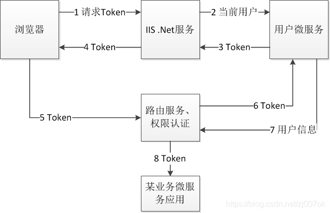

- [Spring Boot 项目集成Windows域账户认证](https://blog.csdn.net/zj007ok/article/details/101434566)
- [Spring Security Kerberos Samples](https://docs.spring.io/spring-security-kerberos/reference/samples.html)

## 问题描述
将已有的Spring Cloud项目与AD域账户集成，要求实现效果如下

1. 系统用户就是Ad域账户，使用Ad域用户名密码登录。

2. 当用户在公司内网时，如果浏览器已经登录过域，直接进入系统，无需登录。否则通过浏览器的windows认证窗口登录。就是IIS的Windows认证效果。

3. 当用户在公司外网时，通过系统原有登录界面输入Ad域账户用户名密码登录。

## 原有系统的用户登录及认证

项目是一个Spring Cloud项目，本身有一个用户服务，根据用户名、密码发放动态且有时限的User-Token。客户端每次请求都将User-Token写入请求的Header中，服务端根据User-Token判别用户，进行权限控制。

## 实现方案

1. 原有的用户名密码认证服务通过连接AD域服务器实现用户名密码验证，使用spring-boot-starter-data-ldap实现（网上搜，maven直接依赖，很简单）。

2. 内网的Windows认证效果。据说Waffle可以实现，但是资料不多，而且据说要必须安装在Windows中，实际情况我不了解。我的解决方案更简单，就是直接用.Net做，IIS设置成Windows 认证。认证后调用我本身的用户服务（这个服务需要服务间认证才能执行，否则有安全隐患），由原有的用户服务生成Token，再由IIS服务器返回Token。

## 具体应用认证过程如下图所示

**注：**
1. 如果第一次请求返回404，说明用户不在公司域内，直接转向系统原有登录界面即可。

2. 浏览器请求IIS获取Token必须采用JSONP的Get方法实现，否则取不到。
   - 原理：普通Ajax是基于`XmlHttpRequest`的，只会返回无权限，不会弹出Windows登陆窗口。JSONP本质是资源访问方式，类似于下载一个静态资源，所以IIS当作资源访问处理，会弹出Windows登陆窗口。
